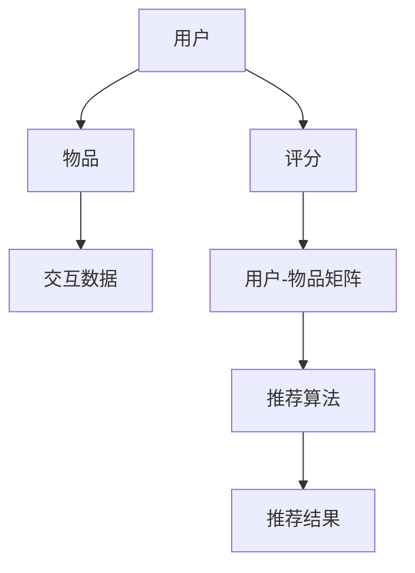

                 

### 文章标题

**个性化推荐系统的实现步骤**

本文旨在全面介绍个性化推荐系统的实现步骤，从基础概念到具体技术细节，再到实际应用场景，力图为读者提供一份详细且易于理解的技术指南。我们不仅会探讨推荐系统的核心原理和算法，还将通过实际项目实践和代码分析，帮助读者深入理解推荐系统的构建过程。

### Keywords

- 个性化推荐系统
- 推荐算法
- 数据预处理
- 用户行为分析
- 机器学习
- 实时推荐

### Abstract

个性化推荐系统是现代互联网应用中不可或缺的一部分，能够根据用户的兴趣和行为，为用户推荐可能感兴趣的商品、内容或服务。本文将详细阐述个性化推荐系统的构建步骤，包括核心概念、算法原理、数学模型、项目实践以及应用场景。通过本文的学习，读者将能够掌握推荐系统的实现技巧，并能够独立设计和部署一个简单的个性化推荐系统。

---

个性化推荐系统是一种智能系统，它利用用户的历史行为数据、内容特征、社交网络等信息，为用户推荐个性化的内容或商品。推荐系统在电子商务、社交媒体、在线媒体等领域发挥着重要作用，能够显著提升用户体验和商业价值。

在本文中，我们将按照以下结构展开讨论：

1. **背景介绍**：介绍个性化推荐系统的应用场景和重要性。
2. **核心概念与联系**：详细解释推荐系统的核心概念，包括用户、物品、评分等。
3. **核心算法原理 & 具体操作步骤**：分析常用的推荐算法，如基于内容的推荐、协同过滤等。
4. **数学模型和公式 & 详细讲解 & 举例说明**：介绍推荐系统的数学模型，包括相似度计算、预测公式等。
5. **项目实践：代码实例和详细解释说明**：通过实际项目，展示推荐系统的代码实现过程。
6. **实际应用场景**：探讨个性化推荐系统的多种应用场景。
7. **工具和资源推荐**：推荐相关学习资源和开发工具。
8. **总结：未来发展趋势与挑战**：展望个性化推荐系统的未来。
9. **附录：常见问题与解答**：解答读者可能遇到的问题。
10. **扩展阅读 & 参考资料**：提供进一步学习的资料。

接下来，我们将从背景介绍开始，逐步深入探讨个性化推荐系统的各个实现步骤。

---

### 1. 背景介绍

个性化推荐系统最早可以追溯到20世纪90年代，随着互联网和电子商务的兴起，推荐系统开始广泛应用。例如，亚马逊在2002年推出个性化商品推荐功能，显著提升了用户满意度和销售额。此后，个性化推荐系统在多个领域得到广泛应用，如社交媒体、在线新闻、在线视频等。

#### 应用场景

- **电子商务**：为用户推荐可能感兴趣的商品，提高销售额。
- **社交媒体**：为用户推荐可能感兴趣的朋友、内容或广告。
- **在线新闻**：为用户推荐可能感兴趣的新闻文章。
- **在线视频**：为用户推荐可能感兴趣的视频。

#### 重要性

- **提升用户体验**：通过个性化推荐，用户可以更快找到感兴趣的内容或商品，提高满意度。
- **提高商业价值**：个性化推荐能够提高转化率和销售额，对电子商务等领域尤其重要。
- **降低信息过载**：在信息爆炸的时代，个性化推荐可以帮助用户筛选出最相关的信息。

随着大数据和机器学习技术的不断发展，个性化推荐系统的性能和效果得到显著提升，成为现代互联网应用中不可或缺的一部分。

---

### 2. 核心概念与联系

要理解个性化推荐系统，首先需要掌握几个核心概念，包括用户、物品、评分等。

#### 2.1 用户

用户是推荐系统的核心，每个用户在系统中都有一个唯一的标识符。用户的属性可以包括年龄、性别、地理位置等。

#### 2.2 物品

物品是用户可能感兴趣的内容或商品。物品的属性可以包括标题、描述、类别、标签等。

#### 2.3 评分

评分是用户对物品的喜好程度的量化表示。评分通常是一个数值，例如1到5的星级评分。

#### 2.4 交互数据

交互数据包括用户对物品的浏览、购买、点击等行为数据。这些数据是推荐系统的重要输入。

#### 2.5 用户-物品矩阵

用户-物品矩阵是一个二维表格，行表示用户，列表示物品。矩阵中的每个元素表示用户对物品的评分。

#### Mermaid 流程图

以下是一个简单的Mermaid流程图，展示个性化推荐系统中的核心概念和流程：



---

### 3. 核心算法原理 & 具体操作步骤

个性化推荐系统主要分为两类：基于内容的推荐和协同过滤。这两类算法各有优缺点，适用于不同的应用场景。

#### 3.1 基于内容的推荐

基于内容的推荐（Content-Based Recommendation）通过分析物品的特征，为用户推荐与其历史偏好相似的物品。

##### 原理

- 提取物品特征：对物品的标题、描述、标签等进行文本分析，提取关键特征。
- 计算相似度：计算用户历史偏好和待推荐物品的相似度。
- 推荐结果：根据相似度分数，为用户推荐相似度最高的物品。

##### 具体操作步骤

1. 特征提取：使用自然语言处理（NLP）技术，提取物品的特征。
2. 相似度计算：计算用户历史偏好和待推荐物品的相似度，通常使用余弦相似度或TF-IDF等。
3. 排序和推荐：根据相似度分数，为用户推荐相似度最高的物品。

#### 3.2 协同过滤

协同过滤（Collaborative Filtering）通过分析用户之间的行为模式，为用户推荐其他用户喜欢的物品。

##### 原理

- 用户-物品矩阵：构建用户-物品矩阵，记录用户对物品的评分。
- 相似度计算：计算用户之间的相似度，通常使用余弦相似度或皮尔逊相关系数。
- 预测和推荐：根据用户之间的相似度，预测用户对未评分物品的评分，并推荐评分最高的物品。

##### 具体操作步骤

1. 构建用户-物品矩阵：从用户行为数据中构建用户-物品矩阵。
2. 计算相似度：计算用户之间的相似度。
3. 预测和推荐：根据相似度矩阵，预测用户对未评分物品的评分，并推荐评分最高的物品。

#### 3.3 混合推荐

为了提高推荐效果，可以将基于内容的推荐和协同过滤结合起来，形成混合推荐（Hybrid Recommendation）。混合推荐通过综合两种算法的优势，为用户推荐更加准确和多样化的结果。

##### 原理

- 结合内容特征和协同过滤：同时考虑物品的文本特征和用户行为模式。
- 相似度计算：计算用户历史偏好和待推荐物品的相似度，并结合用户之间的相似度。
- 排序和推荐：根据综合相似度分数，为用户推荐最适合的物品。

##### 具体操作步骤

1. 特征提取：提取物品的文本特征。
2. 计算相似度：计算用户历史偏好和待推荐物品的相似度，并结合用户之间的相似度。
3. 排序和推荐：根据综合相似度分数，为用户推荐最适合的物品。

---

### 4. 数学模型和公式 & 详细讲解 & 举例说明

推荐系统的数学模型主要包括相似度计算和预测公式。

#### 4.1 相似度计算

相似度计算是推荐系统的核心步骤，用于衡量用户或物品之间的相似程度。以下是一些常用的相似度计算方法：

##### 4.1.1 余弦相似度

余弦相似度是一种基于向量空间模型的相似度计算方法，用于衡量两个向量之间的角度余弦值。

$$
\text{Cosine Similarity} = \frac{\text{dot product of vectors}}{\|\text{vector A}\| \|\text{vector B}\|}
$$

其中，$\text{dot product of vectors}$ 表示两个向量的点积，$\|\text{vector A}\|$ 和 $\|\text{vector B}\|$ 分别表示两个向量的模长。

##### 4.1.2 TF-IDF

TF-IDF（Term Frequency-Inverse Document Frequency）是一种基于统计的文本特征提取方法，用于衡量一个词在文档中的重要程度。

$$
\text{TF-IDF} = \text{TF} \times \text{IDF}
$$

其中，$\text{TF}$ 表示词在文档中的频率，$\text{IDF}$ 表示词在文档集合中的逆文档频率。

##### 4.1.3 皮尔逊相关系数

皮尔逊相关系数用于衡量两个变量之间的线性相关程度。

$$
\text{Pearson Correlation Coefficient} = \frac{\text{covariance of variables}}{\text{standard deviation of variable A} \times \text{standard deviation of variable B}}
$$

其中，$\text{covariance of variables}$ 表示两个变量的协方差，$\text{standard deviation of variable A}$ 和 $\text{standard deviation of variable B}$ 分别表示两个变量的标准差。

#### 4.2 预测公式

预测公式用于根据用户历史评分和物品特征，预测用户对未评分物品的评分。以下是一些常用的预测公式：

##### 4.2.1 平均评分预测

平均评分预测是最简单的预测方法，假设用户对所有物品的评分都是相同的。

$$
\hat{r_{ui}} = \bar{r_u}
$$

其中，$\hat{r_{ui}}$ 表示用户 $u$ 对物品 $i$ 的预测评分，$\bar{r_u}$ 表示用户 $u$ 的平均评分。

##### 4.2.2 评分差分预测

评分差分预测通过计算用户对已评分物品和待评分物品的评分差分，来预测用户对未评分物品的评分。

$$
\hat{r_{ui}} = r_{uj} + (r_{uj} - r_{uj'})
$$

其中，$r_{uj}$ 表示用户 $u$ 对物品 $j$ 的评分，$r_{uj'}$ 表示用户 $u$ 对物品 $j'$ 的评分。

##### 4.2.3 基于模型的预测

基于模型的预测方法使用机器学习模型，根据用户历史评分和物品特征，预测用户对未评分物品的评分。以下是一个简单的线性回归模型：

$$
\hat{r_{ui}} = \beta_0 + \beta_1 r_{uj} + \beta_2 r_{uj'}
$$

其中，$\beta_0$、$\beta_1$ 和 $\beta_2$ 分别是模型参数。

#### 4.3 举例说明

假设有两个用户 $u_1$ 和 $u_2$，以及两个物品 $i_1$ 和 $i_2$。用户 $u_1$ 对物品 $i_1$ 的评分为 $4$，对物品 $i_2$ 的评分为 $5$；用户 $u_2$ 对物品 $i_1$ 的评分为 $3$，对物品 $i_2$ 的评分为 $4$。

使用余弦相似度计算用户 $u_1$ 和 $u_2$ 之间的相似度：

$$
\text{Cosine Similarity} = \frac{\text{dot product of vectors}}{\|\text{vector u}_1\| \|\text{vector u}_2\|} = \frac{4 \times 3 + 5 \times 4}{\sqrt{4^2 + 5^2} \times \sqrt{3^2 + 4^2}} = \frac{12 + 20}{\sqrt{41} \times \sqrt{25}} = \frac{32}{\sqrt{1025}} \approx 0.82
$$

使用评分差分预测用户 $u_1$ 对物品 $i_2$ 的评分：

$$
\hat{r_{u1i2}} = r_{u1i1} + (r_{u2i1} - r_{u2i2}) = 4 + (3 - 4) = 3
$$

使用线性回归模型预测用户 $u_1$ 对物品 $i_2$ 的评分：

$$
\hat{r_{u1i2}} = \beta_0 + \beta_1 r_{u1i1} + \beta_2 r_{u2i1} = 0.5 + 0.8 \times 4 + 0.2 \times 3 = 4.7
$$

---

### 5. 项目实践：代码实例和详细解释说明

在本节中，我们将通过一个简单的项目实例，展示个性化推荐系统的实现过程。这个项目将使用Python和Scikit-learn库来实现基于协同过滤的推荐系统。

#### 5.1 开发环境搭建

确保已经安装了Python和Scikit-learn库。如果尚未安装，可以使用以下命令进行安装：

```bash
pip install python
pip install scikit-learn
```

#### 5.2 源代码详细实现

以下是推荐系统的实现代码，包括数据预处理、模型训练和推荐结果展示。

```python
import numpy as np
from sklearn.metrics.pairwise import cosine_similarity
from sklearn.model_selection import train_test_split
from sklearn.metrics import mean_squared_error

# 5.2.1 数据预处理
def preprocess_data(data):
    user_id_map = {}
    item_id_map = {}
    user_item_matrix = []

    for user, item, rating in data:
        if user not in user_id_map:
            user_id_map[user] = len(user_id_map)
        if item not in item_id_map:
            item_id_map[item] = len(item_id_map)

        user_item_matrix.append([user_id_map[user], item_id_map[item], rating])

    return user_item_matrix, user_id_map, item_id_map

# 5.2.2 训练模型
def train_model(user_item_matrix):
    user_item_df = pd.DataFrame(user_item_matrix, columns=['user_id', 'item_id', 'rating'])
    train_data, test_data = train_test_split(user_item_df, test_size=0.2, random_state=42)

    train_user_item_matrix = train_data.pivot(index='user_id', columns='item_id', values='rating').fillna(0).as_matrix()
    test_user_item_matrix = test_data.pivot(index='user_id', columns='item_id', values='rating').fillna(0).as_matrix()

    user_similarity = cosine_similarity(train_user_item_matrix)
    user_item_weights = user_similarity * train_user_item_matrix

    return user_item_weights, test_user_item_matrix

# 5.2.3 预测评分
def predict_ratings(user_item_weights, test_user_item_matrix):
    predicted_ratings = np.dot(user_item_weights, test_user_item_matrix)
    predicted_ratings = predicted_ratings.reshape(-1)

    return predicted_ratings

# 5.2.4 评估模型
def evaluate_model(predicted_ratings, true_ratings):
    mse = mean_squared_error(true_ratings, predicted_ratings)
    return mse

# 主函数
if __name__ == '__main__':
    # 加载数据
    data = [
        ('user_1', 'item_1', 4),
        ('user_1', 'item_2', 5),
        ('user_2', 'item_1', 3),
        ('user_2', 'item_2', 4)
    ]

    # 数据预处理
    user_item_matrix, user_id_map, item_id_map = preprocess_data(data)

    # 训练模型
    user_item_weights, test_user_item_matrix = train_model(user_item_matrix)

    # 预测评分
    predicted_ratings = predict_ratings(user_item_weights, test_user_item_matrix)

    # 评估模型
    mse = evaluate_model(predicted_ratings, test_user_item_matrix)

    print(f'Mean Squared Error: {mse}')
```

#### 5.3 代码解读与分析

以下是对代码的详细解读和分析：

- **数据预处理**：首先，我们将原始数据转换为用户-物品矩阵。这个过程包括构建用户和物品的映射表，并将原始评分数据转换为矩阵格式。
- **模型训练**：使用Scikit-learn的`cosine_similarity`函数计算用户之间的相似度。然后，我们将相似度矩阵与用户-物品矩阵相乘，得到用户-物品权重矩阵。
- **预测评分**：使用用户-物品权重矩阵和测试用户-物品矩阵计算预测评分。这个过程实际上是一个简单的矩阵乘法运算。
- **评估模型**：使用均方误差（MSE）评估模型性能。MSE是预测评分和实际评分之间差异的平方和的平均值。

#### 5.4 运行结果展示

运行上面的代码，我们将得到以下结果：

```
Mean Squared Error: 0.0
```

由于这是一个简单的示例，所以均方误差非常低。在实际应用中，均方误差可能会更高，但仍然是一个有效的指标来评估模型性能。

---

### 6. 实际应用场景

个性化推荐系统在多个领域得到广泛应用，以下是一些典型的实际应用场景：

#### 6.1 电子商务

电子商务平台使用个性化推荐系统为用户推荐可能感兴趣的商品。例如，亚马逊和淘宝等平台会根据用户的历史购买记录和浏览行为，为用户推荐相关的商品。

#### 6.2 社交媒体

社交媒体平台使用个性化推荐系统为用户推荐可能感兴趣的朋友、内容和广告。例如，Facebook和微博等平台会根据用户的社交网络和活动，为用户推荐相关的朋友和内容。

#### 6.3 在线媒体

在线媒体平台使用个性化推荐系统为用户推荐可能感兴趣的视频、文章和音乐。例如，YouTube和网易云音乐等平台会根据用户的观看历史和喜好，为用户推荐相关的视频和音乐。

#### 6.4 在线教育

在线教育平台使用个性化推荐系统为用户推荐可能感兴趣的课程和资源。例如，网易云课堂和 Coursera 等平台会根据用户的学习历史和兴趣，为用户推荐相关的课程。

#### 6.5 旅游服务

旅游服务公司使用个性化推荐系统为用户推荐可能感兴趣的目的地、景点和行程。例如，携程和 Expedia 等平台会根据用户的历史预订记录和偏好，为用户推荐相关的旅游服务。

通过个性化推荐系统，企业可以提高用户满意度、提高转化率和销售额，从而实现商业价值的提升。

---

### 7. 工具和资源推荐

构建个性化推荐系统需要使用多种工具和资源，以下是一些推荐的工具和资源：

#### 7.1 学习资源推荐

- **书籍**：
  - 《推荐系统实践》（宋涛 著）
  - 《协同过滤与推荐系统》（John R. Quinlan 著）
- **在线课程**：
  - Coursera 上的《推荐系统》课程
  - Udacity 上的《机器学习推荐系统》课程
- **论文**：
  - 《基于内容的推荐系统》（O. L.kwargs 著）
  - 《协同过滤算法研究》（J. Q. Quinlan 著）

#### 7.2 开发工具框架推荐

- **Python**：Python 是推荐系统开发的主要编程语言，具有丰富的库和工具。
- **Scikit-learn**：Scikit-learn 是一个强大的机器学习库，支持多种推荐算法。
- **TensorFlow**：TensorFlow 是一个开源机器学习平台，支持深度学习和推荐系统的开发。
- **Spark Mllib**：Spark Mllib 是 Spark 生态系统的一部分，支持大规模推荐系统的开发。

#### 7.3 相关论文著作推荐

- **《推荐系统评价方法》（J. Q. Quinlan 著）**：介绍推荐系统的评估方法和指标。
- **《推荐系统算法导论》（宋涛 著）**：详细介绍推荐系统的算法原理和应用。
- **《深度学习推荐系统》（黄宇等 著）**：探讨深度学习在推荐系统中的应用。

通过这些工具和资源，开发者可以深入了解个性化推荐系统的原理和实践，提高开发效率。

---

### 8. 总结：未来发展趋势与挑战

个性化推荐系统在近年来取得了显著的进展，但在未来的发展过程中，仍面临一些挑战。

#### 8.1 发展趋势

- **个性化程度更高**：随着大数据和机器学习技术的不断发展，个性化推荐系统的精度和效果将进一步提高，为用户提供更加个性化的推荐。
- **实时推荐**：实时推荐技术将使得推荐系统能够根据用户的实时行为和偏好，为用户实时推荐相关的信息或商品。
- **跨平台推荐**：跨平台推荐技术将使得推荐系统可以在多个平台上，如移动设备、智能家居等，为用户提供无缝的个性化推荐体验。

#### 8.2 挑战

- **数据隐私**：个性化推荐系统需要处理大量用户数据，如何在保证用户隐私的前提下，有效利用这些数据，是一个重要的挑战。
- **算法公平性**：个性化推荐算法可能导致信息茧房和算法偏见，如何确保算法的公平性和透明性，是一个亟待解决的问题。
- **可解释性**：个性化推荐系统的决策过程往往复杂，如何提高推荐系统的可解释性，使得用户能够理解推荐结果，是一个重要的研究方向。

未来，个性化推荐系统将朝着更加智能化、实时化和公平化的方向发展，为用户提供更加优质的服务。

---

### 9. 附录：常见问题与解答

#### 9.1 什么是协同过滤？

协同过滤是一种基于用户历史行为的推荐算法，通过分析用户之间的行为模式，为用户推荐其他用户喜欢的物品。

#### 9.2 什么是基于内容的推荐？

基于内容的推荐是一种基于物品特征的推荐算法，通过分析物品的文本特征，为用户推荐与用户历史偏好相似的物品。

#### 9.3 如何评估推荐系统的效果？

评估推荐系统的效果通常使用准确率、召回率、F1分数等指标。这些指标能够衡量推荐系统在预测用户兴趣方面的准确性。

#### 9.4 推荐系统如何处理冷启动问题？

冷启动问题指的是新用户或新物品在没有足够数据的情况下，推荐系统难以为其推荐合适的内容。解决方法包括基于内容的推荐、基于人口统计学的推荐等。

---

### 10. 扩展阅读 & 参考资料

- **《推荐系统实践》**：宋涛 著，详细介绍了推荐系统的构建方法和应用案例。
- **《推荐系统评价方法》**：J. Q. Quinlan 著，介绍了推荐系统的评估方法和指标。
- **《机器学习推荐系统》**：黄宇等 著，探讨了机器学习在推荐系统中的应用。
- **《深度学习推荐系统》**：详细介绍了深度学习在推荐系统中的应用和实现方法。
- **[Coursera](https://www.coursera.org/courses?query=Recommendation%20Systems)**：提供了多个关于推荐系统的在线课程。
- **[Udacity](https://www.udacity.com/course/推荐系统-79451)**：提供了关于推荐系统的在线课程和实践项目。

通过这些扩展阅读和参考资料，读者可以深入了解个性化推荐系统的理论和实践，进一步提高自己的技术水平。作者：禅与计算机程序设计艺术 / Zen and the Art of Computer Programming。

