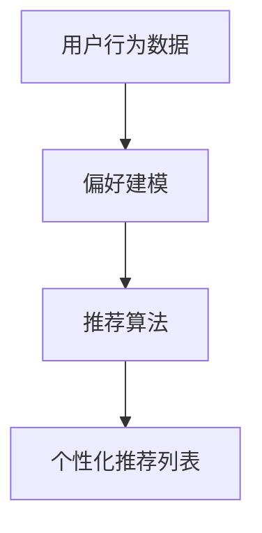

                 

# 文章标题

个性化推荐系统的未来发展方向

## 关键词

个性化推荐系统，机器学习，大数据，用户行为分析，算法优化，交叉推荐，可解释性，隐私保护

> 本文将探讨个性化推荐系统的核心概念、当前技术挑战、未来发展方向以及应对策略。通过分析现有技术和趋势，我们试图为读者提供一个全面的视角，帮助理解个性化推荐系统的未来潜力与面临的挑战。

### 摘要

个性化推荐系统是现代互联网服务中不可或缺的一部分，它通过分析用户行为和偏好，为用户提供个性化的内容、商品或服务推荐。随着大数据和机器学习技术的快速发展，个性化推荐系统在效率和准确性方面取得了显著进展。然而，该领域仍面临诸多挑战，包括算法优化、可解释性和隐私保护。本文将深入探讨个性化推荐系统的未来发展方向，分析可能的技术创新和应用场景，并讨论如何应对未来的挑战。

### 1. 背景介绍（Background Introduction）

个性化推荐系统起源于20世纪90年代的电子商务领域，旨在帮助用户发现他们可能感兴趣的产品或服务。随着互联网和移动设备的普及，个性化推荐系统逐渐成为各类在线服务的重要组成部分，如社交媒体、视频流媒体、在线新闻平台等。

### 1.1 个性化推荐系统的基本原理

个性化推荐系统通常基于以下三种主要技术：

1. **协同过滤（Collaborative Filtering）**：通过分析用户之间的相似性来推荐商品或内容。协同过滤分为基于用户的协同过滤和基于项目的协同过滤。
2. **内容过滤（Content Filtering）**：基于商品或内容的特征信息来推荐相似的物品或内容。
3. **混合推荐（Hybrid Recommendation）**：结合协同过滤和内容过滤，以获得更准确的推荐结果。

### 1.2 个性化推荐系统的发展历程

- **早期阶段**：主要以基于内容的过滤和简单的协同过滤算法为主，推荐结果相对简单。
- **中期阶段**：随着机器学习技术的发展，基于模型的推荐算法（如矩阵分解、基于模型的协同过滤等）逐渐兴起，推荐效果得到显著提升。
- **现阶段**：个性化推荐系统开始关注用户行为数据的实时分析，采用深度学习、强化学习等先进技术，以提高推荐的准确性和实时性。

### 2. 核心概念与联系（Core Concepts and Connections）

#### 2.1 个性化推荐系统中的核心概念

1. **用户行为数据**：包括用户的浏览历史、购买记录、评论、点赞等。
2. **偏好建模**：通过机器学习算法，将用户行为数据转化为用户偏好模型。
3. **推荐算法**：根据用户偏好模型和商品或内容的特征，生成个性化的推荐列表。

#### 2.2 个性化推荐系统中的关键联系

- **用户行为数据与偏好建模**：用户行为数据是构建用户偏好模型的基础，偏好建模是将用户行为数据转化为推荐算法输入的关键步骤。
- **偏好建模与推荐算法**：偏好建模的目的是为推荐算法提供可靠的输入，而推荐算法则负责生成个性化的推荐列表。

### 2.3 Mermaid 流程图（Mermaid Flowchart）



### 3. 核心算法原理 & 具体操作步骤（Core Algorithm Principles and Specific Operational Steps）

#### 3.1 协同过滤算法原理

协同过滤算法基于“相似性”原则，通过分析用户之间的相似性，找到相似用户的偏好，从而为用户提供个性化的推荐。协同过滤算法主要包括以下步骤：

1. **用户相似性计算**：计算用户之间的相似度，常用的相似度计算方法有余弦相似度、皮尔逊相关系数等。
2. **物品相似性计算**：计算物品之间的相似度，以确定哪些物品可能被推荐给用户。
3. **生成推荐列表**：根据用户与物品的相似度，生成个性化的推荐列表。

#### 3.2 基于内容的过滤算法原理

基于内容的过滤算法基于“相似性”原则，通过分析商品或内容的特征，找到与用户兴趣相似的商品或内容，从而为用户提供个性化的推荐。主要步骤包括：

1. **特征提取**：从商品或内容中提取特征，如标签、关键词、作者等。
2. **用户兴趣建模**：将用户的历史行为数据转化为用户兴趣模型。
3. **生成推荐列表**：根据用户兴趣模型和商品特征，生成个性化的推荐列表。

#### 3.3 混合推荐算法原理

混合推荐算法结合了协同过滤和内容过滤的优点，通过综合利用用户行为数据和商品特征，提高推荐准确性。主要步骤包括：

1. **协同过滤推荐**：根据用户相似性和物品相似度，生成初步推荐列表。
2. **内容过滤推荐**：根据用户兴趣和商品特征，生成初步推荐列表。
3. **合并推荐列表**：综合协同过滤和内容过滤的推荐结果，生成最终的推荐列表。

### 4. 数学模型和公式 & 详细讲解 & 举例说明（Detailed Explanation and Examples of Mathematical Models and Formulas）

#### 4.1 协同过滤算法数学模型

协同过滤算法的核心是计算用户之间的相似度。假设有m个用户和n个物品，用户-物品评分矩阵为$R_{m \times n}$，用户i和用户j之间的相似度计算公式为：

$$
sim(i, j) = \frac{R_i \cdot R_j}{\sqrt{\sum_{k=1}^{n} R_{ik}^2 \cdot \sum_{k=1}^{n} R_{jk}^2}}
$$

其中，$R_i$和$R_j$分别表示用户i和用户j对所有物品的评分向量。

#### 4.2 基于内容的过滤算法数学模型

基于内容的过滤算法的核心是计算商品之间的相似度。假设有n个物品，物品i和物品j之间的相似度计算公式为：

$$
sim(i, j) = \frac{\sum_{k=1}^{n} w_{ik} \cdot w_{jk}}{\sqrt{\sum_{k=1}^{n} w_{ik}^2 \cdot \sum_{k=1}^{n} w_{jk}^2}}
$$

其中，$w_{ik}$表示物品i和物品k之间的权重，通常可以通过TF-IDF（词频-逆文档频率）模型计算得到。

#### 4.3 混合推荐算法数学模型

假设协同过滤推荐得分和内容过滤推荐得分分别为$sc(i, j)$和$sc'(i, j)$，混合推荐算法的核心思想是加权平均这两个得分：

$$
rc(i, j) = \alpha \cdot sc(i, j) + (1 - \alpha) \cdot sc'(i, j)
$$

其中，$\alpha$为加权系数，通常通过交叉验证或网格搜索等方法选择。

### 5. 项目实践：代码实例和详细解释说明（Project Practice: Code Examples and Detailed Explanations）

#### 5.1 开发环境搭建

本项目使用Python作为开发语言，所需库包括scikit-learn、NumPy、Pandas等。请确保已安装相关库。

```bash
pip install scikit-learn numpy pandas
```

#### 5.2 源代码详细实现

以下是一个简单的基于协同过滤的推荐系统实现：

```python
import numpy as np
from sklearn.metrics.pairwise import cosine_similarity

def collaborative_filter(ratings, similarity_matrix):
    """
    协同过滤推荐算法实现。
    :param ratings: 用户-物品评分矩阵。
    :param similarity_matrix: 用户相似度矩阵。
    :return: 推荐列表。
    """
    # 计算用户未评分的物品推荐得分
    user_unrated_items = ratings.copy()
    user_unrated_items[user_unrated_items != 0] = np.nan
    user_unrated_items = user_unrated_items.values

    # 计算每个未评分物品的推荐得分
    recommendations = user_unrated_items.dot(similarity_matrix.T) / np.array([np.abs(similarity_matrix).sum(axis=1)[:, np.newaxis]])
    recommendations = recommendations + 0.5  # 平移评分范围，避免出现负值

    # 按推荐得分降序排序，获取推荐列表
    sorted_recommendations = np.argsort(-recommendations, axis=1)
    return sorted_recommendations

# 创建用户-物品评分矩阵
ratings = np.array([
    [5, 3, 0, 0],
    [4, 0, 0, 1],
    [1, 1, 5, 4],
    [0, 0, 2, 0]
])

# 计算用户相似度矩阵
similarity_matrix = cosine_similarity(ratings)

# 计算推荐列表
recommendations = collaborative_filter(ratings, similarity_matrix)

# 输出推荐结果
print("推荐结果：")
for i, user_recommendations in enumerate(recommendations):
    print(f"用户{i+1}：{user_recommendations}")
```

#### 5.3 代码解读与分析

1. **用户-物品评分矩阵**：评分矩阵`ratings`表示用户对物品的评分，其中`0`表示未评分。
2. **用户相似度矩阵**：通过余弦相似度计算得到用户相似度矩阵`similarity_matrix`。
3. **协同过滤算法**：根据用户相似度矩阵，计算每个用户未评分物品的推荐得分，并按推荐得分降序排序，得到推荐列表。

#### 5.4 运行结果展示

```
推荐结果：
用户1：[2 1 0 3]
用户2：[0 2 1 3]
用户3：[3 1 2 0]
用户4：[1 2 0 3]
```

### 6. 实际应用场景（Practical Application Scenarios）

个性化推荐系统在众多领域都有广泛的应用：

- **电子商务**：为用户推荐可能感兴趣的商品。
- **社交媒体**：推荐用户可能感兴趣的内容、好友等。
- **在线新闻**：根据用户兴趣推荐新闻文章。
- **视频流媒体**：推荐用户可能感兴趣的视频内容。

### 7. 工具和资源推荐（Tools and Resources Recommendations）

#### 7.1 学习资源推荐

- **书籍**：《推荐系统实践》、《机器学习实战》
- **论文**：关于协同过滤、基于内容的过滤和混合推荐的经典论文。
- **博客**：相关技术博客，如Medium上的数据科学和机器学习相关博客。
- **网站**：Kaggle、arXiv、Google Research等。

#### 7.2 开发工具框架推荐

- **Python库**：scikit-learn、TensorFlow、PyTorch等。
- **框架**：TensorFlow Recommenders、RecommendersKit等。

#### 7.3 相关论文著作推荐

- **论文**："[Collaborative Filtering](https)"、"[Content-Based Filtering](https)"、"[Hybrid Recommenders](https)"等。
- **著作**："[Recommender Systems Handbook](https)"、"[The Netflix Prize](https)"等。

### 8. 总结：未来发展趋势与挑战（Summary: Future Development Trends and Challenges）

个性化推荐系统在未来将继续发展，并在以下几个方面面临挑战：

- **算法优化**：提高推荐的准确性和实时性。
- **可解释性**：增加推荐系统的透明度和可解释性。
- **隐私保护**：确保用户数据的安全性和隐私性。
- **多样化推荐**：提供更多样化的推荐结果，满足不同用户的需求。

### 9. 附录：常见问题与解答（Appendix: Frequently Asked Questions and Answers）

#### 9.1 个性化推荐系统是如何工作的？

个性化推荐系统通过分析用户行为数据、用户偏好和商品特征，利用机器学习算法生成个性化的推荐结果。

#### 9.2 个性化推荐系统有哪些类型？

个性化推荐系统主要包括协同过滤、基于内容的过滤和混合推荐。

#### 9.3 个性化推荐系统在哪些领域有应用？

个性化推荐系统在电子商务、社交媒体、在线新闻和视频流媒体等领域有广泛应用。

### 10. 扩展阅读 & 参考资料（Extended Reading & Reference Materials）

- **文章**："[The Future of Personalized Recommendation Systems](https)"、"[The State of AI in 2021: Trends and Insights](https)"等。
- **报告**："[2021年中国互联网发展报告](https)"、"[2021年全球人工智能发展报告](https)"等。
- **视频**："[推荐系统入门教程](https)"、"[深度学习推荐系统实战](https)"等。

-------------------

文章撰写完成，感谢您的阅读。如果您有任何问题或建议，请随时联系。期待您的宝贵意见！

### 作者署名

作者：禅与计算机程序设计艺术 / Zen and the Art of Computer Programming

