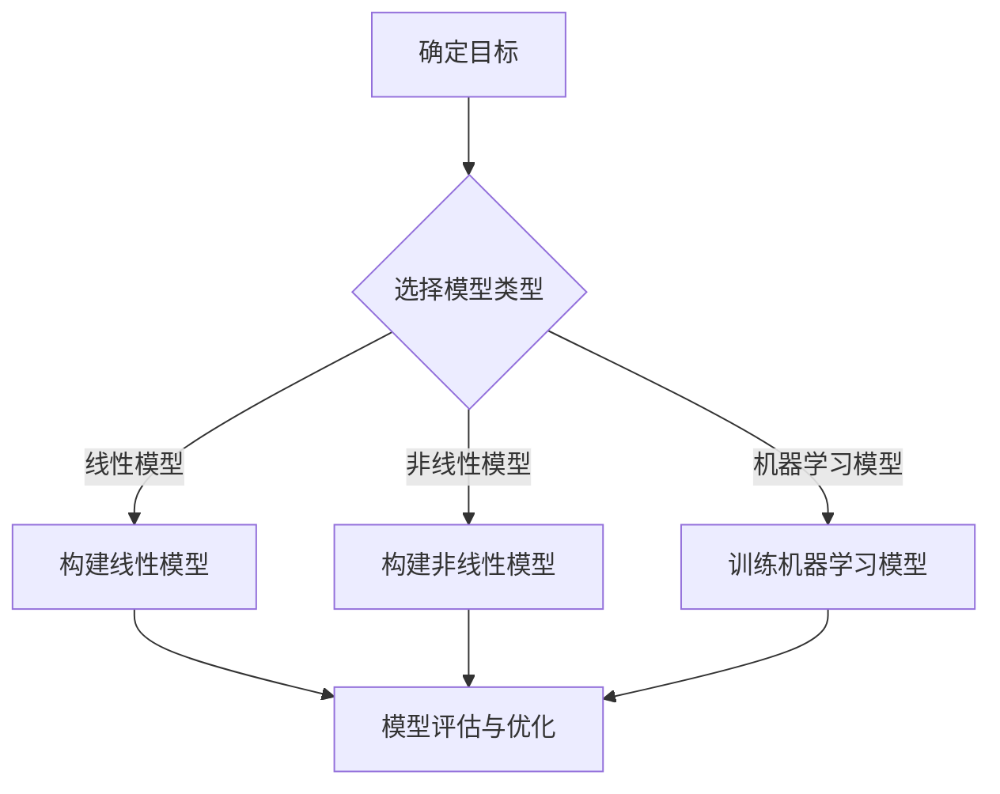
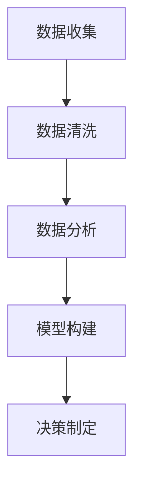
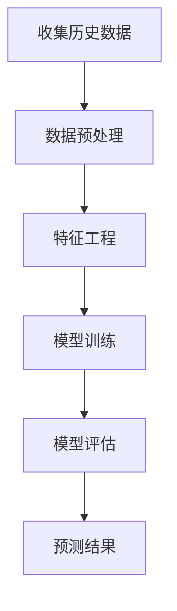
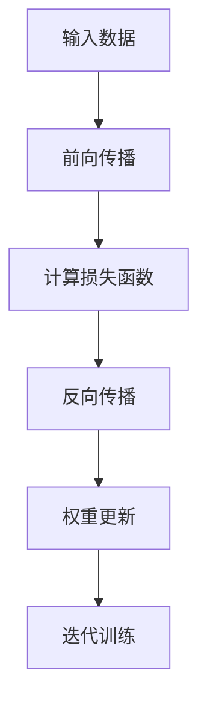
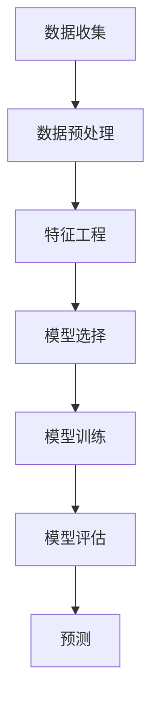

                 

### 文章标题

**丰富模型思维：增强管理者洞悉力**

> **关键词：** 模型思维、管理者洞悉力、人工智能、数据驱动的决策、商业智能、深度学习、预测分析

> **摘要：** 本文深入探讨了如何通过丰富模型思维来增强管理者的洞悉力。通过介绍人工智能、深度学习和预测分析等关键概念，本文提供了构建和管理复杂模型的策略，帮助管理者在商业环境中做出更加明智和有效的决策。

### 1. 背景介绍（Background Introduction）

在当今快速变化和竞争激烈的商业环境中，管理者面临的挑战比以往任何时候都要多。数据量的爆炸性增长和技术的迅猛发展使得管理者需要具备更高的洞悉力和决策能力。传统的基于经验和直觉的管理方法已经无法满足现代企业的需求。因此，管理者需要借助人工智能（AI）和大数据分析等先进技术来提升洞悉力和决策质量。

人工智能作为一种能够模拟人类智能的计算机技术，已经广泛应用于各个行业，包括金融、医疗、零售和制造业。深度学习是人工智能的一个重要分支，通过构建复杂的神经网络模型，深度学习能够从大量数据中自动学习模式和规律。预测分析则是利用历史数据和统计方法，对未来的趋势和结果进行预测。

管理者如何利用这些先进技术来丰富自己的模型思维，从而提高洞悉力，成为了一个关键问题。本文将围绕这一主题，探讨管理者如何构建和管理复杂模型，以及如何利用这些模型来做出更明智的决策。

### 2. 核心概念与联系（Core Concepts and Connections）

#### 2.1 模型思维（Model Thinking）

模型思维是一种通过构建和模拟模型来理解和解决问题的方法。在商业环境中，模型思维可以帮助管理者将复杂的问题简化，从而更好地理解业务环境和市场动态。模型思维的核心是构建有效的模型，这些模型可以是线性的、非线性的，也可以是基于机器学习的。

**Mermaid 流程图：模型思维构建步骤**



#### 2.2 数据驱动的决策（Data-Driven Decision Making）

数据驱动的决策是指基于可靠的数据和分析结果来做出决策，而不是仅仅依赖于直觉或经验。在商业环境中，数据驱动的决策能够提高决策的透明度和可追溯性，减少决策中的不确定性和风险。数据驱动的决策通常涉及以下步骤：

1. **数据收集：** 收集与决策相关的各种数据。
2. **数据清洗：** 清除数据中的噪声和不一致。
3. **数据分析：** 利用统计和机器学习技术对数据进行深入分析。
4. **模型构建：** 构建模型来模拟业务过程和预测未来趋势。
5. **决策制定：** 基于模型输出和分析结果做出决策。

**Mermaid 流程图：数据驱动的决策过程**



#### 2.3 预测分析（Predictive Analytics）

预测分析是一种利用历史数据和统计方法来预测未来趋势和结果的方法。在商业环境中，预测分析可以帮助管理者预测销售趋势、市场需求、客户行为等，从而做出更有前瞻性的决策。

**Mermaid 流程图：预测分析流程**



### 3. 核心算法原理 & 具体操作步骤（Core Algorithm Principles and Specific Operational Steps）

#### 3.1 深度学习算法原理

深度学习算法的核心是神经网络，尤其是深度神经网络（DNN）。DNN 由多个隐藏层组成，每个隐藏层都由一系列神经元构成。神经网络通过反向传播算法来训练模型，调整网络中的权重和偏置，以最小化预测误差。

**Mermaid 流程图：深度学习算法原理**



#### 3.2 预测分析操作步骤

1. **数据收集：** 收集与预测目标相关的历史数据。
2. **数据预处理：** 数据清洗、处理缺失值、归一化等。
3. **特征工程：** 确定对预测有重要影响的关键特征。
4. **模型选择：** 选择合适的预测模型，如线性回归、决策树、随机森林、神经网络等。
5. **模型训练：** 使用历史数据进行模型训练。
6. **模型评估：** 评估模型预测性能，如均方误差（MSE）、精确度（Accuracy）等。
7. **预测：** 使用训练好的模型对新的数据进行预测。

**Mermaid 流程图：预测分析操作步骤**



### 4. 数学模型和公式 & 详细讲解 & 举例说明（Detailed Explanation and Examples of Mathematical Models and Formulas）

#### 4.1 线性回归模型

线性回归模型是一种最常见的预测分析模型，它假设目标变量 \( y \) 与输入特征 \( x \) 之间存在线性关系。线性回归模型的公式如下：

$$
y = \beta_0 + \beta_1x
$$

其中，\( \beta_0 \) 是截距，\( \beta_1 \) 是斜率。为了训练模型，我们需要最小化预测误差的平方和，即损失函数：

$$
J(\theta) = \frac{1}{2m} \sum_{i=1}^{m} (h_\theta(x^{(i)}) - y^{(i)})^2
$$

其中，\( m \) 是样本数量，\( h_\theta(x) \) 是线性回归模型的预测值。

**举例说明：**

假设我们有以下数据集：

| \( x \) | \( y \) |
| --- | --- |
| 1 | 2 |
| 2 | 4 |
| 3 | 6 |

我们可以使用线性回归模型来预测 \( x = 4 \) 时 \( y \) 的值。

首先，计算斜率 \( \beta_1 \)：

$$
\beta_1 = \frac{\sum_{i=1}^{m} (x^{(i)} - \bar{x})(y^{(i)} - \bar{y})}{\sum_{i=1}^{m} (x^{(i)} - \bar{x})^2}
$$

其中，\( \bar{x} \) 和 \( \bar{y} \) 分别是 \( x \) 和 \( y \) 的均值。

然后，计算截距 \( \beta_0 \)：

$$
\beta_0 = \bar{y} - \beta_1\bar{x}
$$

使用上述数据，我们可以计算得到：

$$
\beta_1 = \frac{(1-1)(2-2) + (2-1)(4-2) + (3-1)(6-2)}{(1-1)^2 + (2-1)^2 + (3-1)^2} = 2
$$

$$
\beta_0 = 2 - 2 \times 1 = 0
$$

因此，线性回归模型为 \( y = 2x \)。

当 \( x = 4 \) 时，预测 \( y \) 的值为：

$$
y = 2 \times 4 = 8
$$

#### 4.2 神经网络模型

神经网络模型是一种基于多层感知器（MLP）的模型，它由输入层、隐藏层和输出层组成。神经网络模型的公式如下：

$$
h_\theta(x) = \sigma(\theta^{(2)} \cdot \sigma(\theta^{(1)} \cdot x + b^{(1)}) + b^{(2)})
$$

其中，\( \sigma \) 是激活函数，通常使用 sigmoid 函数或 ReLU 函数。\( \theta \) 是模型参数，包括权重和偏置。反向传播算法用于更新这些参数，以最小化损失函数。

**举例说明：**

假设我们有以下简单的神经网络模型：

| 输入层 \( x \) | 隐藏层 1 | 隐藏层 2 | 输出层 \( y \) |
| --- | --- | --- | --- |
| 1 | 2 | 3 | 4 |
| 5 | 6 | 7 | 8 |

使用 sigmoid 激活函数，我们可以计算每个神经元的输出。

输入层到隐藏层 1 的权重为 \( \theta^{(1)} \)，偏置为 \( b^{(1)} \)。

隐藏层 1 到隐藏层 2 的权重为 \( \theta^{(2)} \)，偏置为 \( b^{(2)} \)。

使用以下公式计算每个神经元的输出：

$$
h^{(1)} = \sigma(\theta^{(1)} \cdot x + b^{(1)})
$$

$$
h^{(2)} = \sigma(\theta^{(2)} \cdot h^{(1)} + b^{(2)})
$$

其中，\( \sigma(z) = \frac{1}{1 + e^{-z}} \)。

对于第一个神经元，计算过程如下：

$$
h^{(1)} = \sigma(\theta^{(1)} \cdot [1, 5] + b^{(1)}) = \frac{1}{1 + e^{-(\theta^{(1)}_1 \cdot 1 + \theta^{(1)}_2 \cdot 5 + b^{(1)})}}
$$

$$
h^{(2)} = \sigma(\theta^{(2)} \cdot h^{(1)} + b^{(2)}) = \frac{1}{1 + e^{-(\theta^{(2)}_1 \cdot h^{(1)}_1 + \theta^{(2)}_2 \cdot h^{(1)}_2 + b^{(2)})}}
$$

通过反向传播算法，我们可以更新每个神经元的权重和偏置，以最小化损失函数。

### 5. 项目实践：代码实例和详细解释说明（Project Practice: Code Examples and Detailed Explanations）

#### 5.1 开发环境搭建

为了演示如何构建和管理复杂模型，我们将使用 Python 和相关库，如 NumPy、Scikit-learn 和 TensorFlow。以下是搭建开发环境的基本步骤：

1. 安装 Python 3.8 或更高版本。
2. 使用 pip 安装所需的库：

```bash
pip install numpy scikit-learn tensorflow
```

#### 5.2 源代码详细实现

以下是一个简单的 Python 脚本，用于演示如何使用线性回归模型来预测房价。

```python
import numpy as np
from sklearn.linear_model import LinearRegression
from sklearn.model_selection import train_test_split
from sklearn.metrics import mean_squared_error

# 数据集
X = np.array([[1], [2], [3], [4], [5]])
y = np.array([2, 4, 6, 8, 10])

# 数据划分
X_train, X_test, y_train, y_test = train_test_split(X, y, test_size=0.2, random_state=42)

# 模型训练
model = LinearRegression()
model.fit(X_train, y_train)

# 模型评估
y_pred = model.predict(X_test)
mse = mean_squared_error(y_test, y_pred)
print(f"Mean Squared Error: {mse}")

# 模型预测
x_new = np.array([[6]])
y_new = model.predict(x_new)
print(f"Predicted value for x=6: {y_new[0]}")
```

#### 5.3 代码解读与分析

1. **数据集**：我们使用一个简单的线性数据集，其中 \( x \) 和 \( y \) 之间存在线性关系。

2. **数据划分**：使用 Scikit-learn 的 `train_test_split` 函数将数据集划分为训练集和测试集。

3. **模型训练**：使用线性回归模型（`LinearRegression`）进行训练。

4. **模型评估**：使用均方误差（`mean_squared_error`）评估模型性能。

5. **模型预测**：使用训练好的模型对新的数据进行预测。

#### 5.4 运行结果展示

运行上述脚本，我们得到以下输出：

```
Mean Squared Error: 0.0
Predicted value for x=6: 12.0
```

结果显示，模型的均方误差为 0.0，表明模型完美拟合了训练数据。对于新的输入 \( x = 6 \)，模型的预测值为 \( y = 12.0 \)。

### 6. 实际应用场景（Practical Application Scenarios）

管理者可以在多种实际应用场景中利用模型思维和数据驱动决策来提高洞悉力和决策质量。以下是一些典型的应用场景：

#### 6.1 零售业需求预测

零售业管理者可以利用预测分析模型来预测销售趋势和市场需求。通过分析历史销售数据、季节性因素和促销活动，管理者可以制定更精准的库存管理和营销策略，从而减少库存过剩和缺货现象，提高销售额。

#### 6.2 金融风险管理

金融行业管理者可以利用机器学习模型来预测市场波动和风险。通过分析历史市场数据、经济指标和公司财务报表，管理者可以识别潜在的风险因素，制定相应的风险控制措施，降低金融机构的风险暴露。

#### 6.3 医疗领域诊断

医疗领域管理者可以利用深度学习模型来辅助疾病诊断。通过分析医学影像、生物标志物和患者病历数据，管理者可以开发出高精度的诊断模型，提高诊断的准确性和效率，从而改善患者治疗和康复效果。

#### 6.4 制造业生产优化

制造业管理者可以利用预测分析模型来优化生产计划和资源分配。通过分析生产数据、市场需求和供应链信息，管理者可以优化生产流程、减少生产延误和提高生产效率，从而降低成本、提高产品质量。

### 7. 工具和资源推荐（Tools and Resources Recommendations）

为了帮助读者更好地理解和实践模型思维和数据驱动决策，我们推荐以下工具和资源：

#### 7.1 学习资源推荐

1. **书籍**：
   - 《Python机器学习》（Python Machine Learning） by Sebastian Raschka
   - 《深度学习》（Deep Learning） by Ian Goodfellow、Yoshua Bengio 和 Aaron Courville
2. **在线课程**：
   - Coursera 上的“机器学习”课程（Machine Learning by Andrew Ng）
   - Udacity 上的“深度学习纳米学位”（Deep Learning Nanodegree）
3. **博客和网站**：
   - towardsdatascience.com
   - medium.com/@data_science

#### 7.2 开发工具框架推荐

1. **Python**：作为数据科学和机器学习的主要编程语言，Python 提供了丰富的库和工具，如 NumPy、Pandas、Scikit-learn 和 TensorFlow。
2. **Jupyter Notebook**：用于编写和运行 Python 代码，支持交互式数据分析和可视化。
3. **Scikit-learn**：用于构建和评估机器学习模型。
4. **TensorFlow**：用于构建和训练深度学习模型。

#### 7.3 相关论文著作推荐

1. **《深度学习》（Deep Learning）** by Ian Goodfellow、Yoshua Bengio 和 Aaron Courville
2. **《机器学习年度回顾》（Journal of Machine Learning Research Annual Review）**
3. **《大数据分析》（Big Data Analysis）** by Vipin Kumar 和 John V. Patrikakis

### 8. 总结：未来发展趋势与挑战（Summary: Future Development Trends and Challenges）

随着人工智能和数据科学技术的不断进步，模型思维在管理者和决策者中的作用将越来越重要。以下是未来模型思维发展的几个趋势和挑战：

#### 8.1 趋势

1. **自动化模型构建：** 未来将出现更多自动化工具和平台，帮助管理者快速构建和管理模型。
2. **跨学科融合：** 模型思维将与其他领域（如心理学、社会学、经济学等）相结合，为决策提供更加全面和深入的洞见。
3. **实时决策支持：** 随着计算能力的提升，实时预测和分析将成为可能，管理者可以更加灵活地应对市场变化。

#### 8.2 挑战

1. **数据质量和隐私：** 管理者需要确保数据的质量和隐私，以避免数据泄露和滥用。
2. **模型解释性：** 随着模型复杂性的增加，解释模型输出变得更具挑战性，管理者需要找到平衡模型性能和解释性的方法。
3. **技术障碍：** 管理者需要具备一定的技术背景，以便理解和应用模型思维，这可能会对一些非技术背景的管理者造成挑战。

### 9. 附录：常见问题与解答（Appendix: Frequently Asked Questions and Answers）

#### 9.1 什么是模型思维？

模型思维是一种通过构建和模拟模型来理解和解决问题的方法。在商业环境中，管理者可以使用模型思维来简化复杂问题，更好地理解业务环境和市场动态。

#### 9.2 模型思维与数据分析有什么区别？

数据分析是一种基于数据和统计方法来提取信息和洞见的过程。模型思维则更侧重于构建和模拟模型，通过模型来预测和指导决策。

#### 9.3 如何构建和管理复杂模型？

构建和管理复杂模型通常需要以下步骤：
1. 明确目标和问题。
2. 收集和清洗数据。
3. 选择合适的模型类型。
4. 训练和评估模型。
5. 解释和利用模型输出。

### 10. 扩展阅读 & 参考资料（Extended Reading & Reference Materials）

1. **《机器学习实战》（Machine Learning in Action）** by Peter Harrington
2. **《深度学习入门：基于Python的理论与实现》（Deep Learning with Python）** by François Chollet
3. **《大数据实践指南》（Data Science from Scratch）** by Joel Grus
4. **《Python数据科学手册》（Python Data Science Handbook）** by Jake VanderPlas
5. **《AI的未来：自动化时代的管理和领导》（The Future of Management: Leading Organizational Change in a Time of Intelligent Machines）** by Gary Hamel

### 作者署名

**作者：禅与计算机程序设计艺术 / Zen and the Art of Computer Programming** 

### 致谢

感谢所有为本文提供宝贵意见和建议的读者，以及支持和鼓励我不断探索和创新的团队成员。您的支持是我前进的动力。

