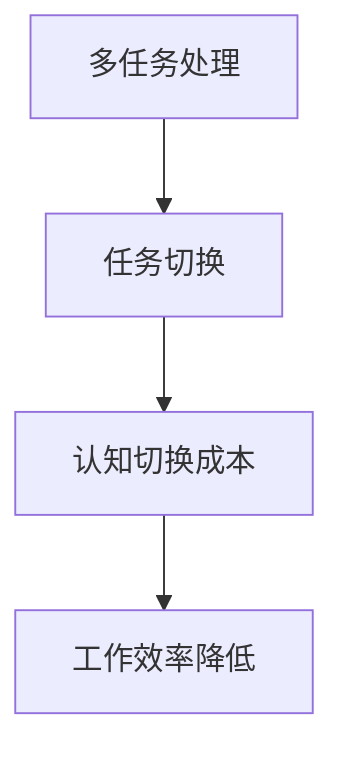
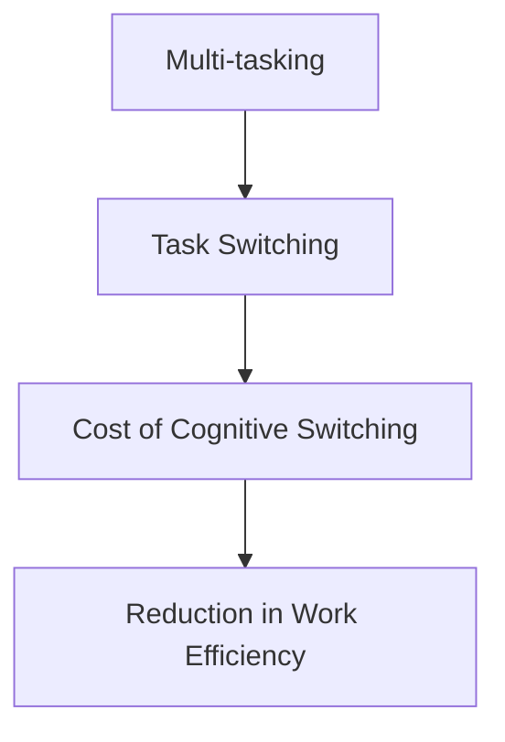

                 

### 文章标题

### Title: Managing Attention in the Age of Remote Work

在远程办公时代，如何管理注意力成为了许多职场人士关注的焦点。本文将探讨远程办公环境下注意力管理的核心概念、策略、工具和实践，帮助读者提高工作效率，提升个人生产力。

### Managing Attention in the Age of Remote Work

In the era of remote work, managing attention has become a focal point for many professionals. This article explores the core concepts, strategies, tools, and practices of attention management in a remote work environment, aimed at helping readers improve their work efficiency and personal productivity.

### 摘要

本文旨在为远程办公人员提供实用的注意力管理指南。首先，我们将探讨远程办公的特点和注意力分散的原因。接着，我们会介绍一系列注意力管理的核心概念，如多任务处理、时间管理和专注力提升等。随后，文章将深入讨论具体的注意力管理策略，包括设定优先级、避免分心和打造专注环境等。最后，我们将推荐一些实用的工具和资源，以帮助读者更好地实践注意力管理。通过本文的阅读，读者将能够掌握远程办公时代注意力管理的关键技能，从而提高工作效率和个人生产力。

### Abstract

This article aims to provide practical guidance on attention management for remote workers. We will begin by exploring the characteristics of remote work and the reasons for attention distraction. Next, we will introduce a series of core concepts in attention management, such as multitasking, time management, and enhancing focus. Then, we will delve into specific strategies for managing attention, including setting priorities, avoiding distractions, and creating focused environments. Finally, we will recommend some practical tools and resources to help readers better practice attention management. Through reading this article, readers will gain key skills in attention management for the remote work era, thereby improving their work efficiency and personal productivity.

## 1. 背景介绍

### Background Introduction

远程办公已经成为现代职场的一个重要组成部分。随着互联网技术的飞速发展和全球化趋势的加强，越来越多的公司开始采用远程办公模式，这不仅提高了员工的灵活性和满意度，还为企业带来了显著的效率提升和成本节约。

然而，远程办公也带来了一些新的挑战。首先，远程办公环境中的注意力分散问题尤为突出。研究表明，在远程办公中，员工更容易受到外部干扰，如家庭事务、社交媒体和其他非工作相关的活动，这些干扰会显著降低工作效率。

注意力分散的原因主要有以下几个方面：

1. **缺乏物理边界**：在办公室中，员工之间的物理距离提供了一个明确的边界，使得员工能够更容易地集中注意力。而在远程办公环境中，这种物理边界不复存在，导致注意力更容易分散。
2. **工作与生活交织**：远程办公使得员工的工作和生活空间更加交织，这虽然提高了灵活性，但也使得员工难以在工作时间内保持专注。
3. **技术干扰**：电子邮件、即时通讯工具、社交媒体等现代通信技术虽然提高了工作效率，但也成为了分散注意力的主要因素。

为了应对这些挑战，有效的注意力管理变得至关重要。注意力管理不仅关乎个人的工作效率，还直接影响到团队的整体绩效和企业的竞争力。因此，本文将深入探讨远程办公时代注意力管理的核心概念、策略和实践，为读者提供实用的指导。

### Characteristics of Remote Work

Remote work has become an integral part of the modern workplace. With the rapid advancement of internet technology and the strengthening of globalization trends, an increasing number of companies are adopting remote work models. This not only enhances the flexibility and job satisfaction of employees but also brings significant efficiency improvements and cost savings to businesses.

However, remote work also comes with its own set of challenges. One of the most prominent issues is attention distraction. Studies have shown that remote workers are more susceptible to distractions, such as household tasks, social media, and other non-work-related activities, which can significantly reduce work efficiency.

The reasons for attention distraction in remote work can be attributed to several factors:

1. **Lack of Physical Boundaries**: In an office setting, the physical distance between employees provides a clear boundary that helps them concentrate. In a remote work environment, this physical boundary is often absent, leading to easier distractions.
2. **Interweaving of Work and Life**: Remote work blurs the boundaries between work and personal life, which can be beneficial in terms of flexibility but also makes it harder for employees to maintain focus during working hours.
3. **Technological Distractions**: Modern communication technologies, such as email, instant messaging tools, and social media, while enhancing work efficiency, also serve as major distractions.

To address these challenges, effective attention management is crucial. Attention management is not only about individual efficiency but also directly impacts the overall performance of teams and the competitiveness of businesses. Therefore, this article will delve into the core concepts, strategies, and practices of attention management in the era of remote work, providing practical guidance for readers.

## 2. 核心概念与联系

### Core Concepts and Connections

### 2.1 注意力分散与多任务处理

#### Attention Distraction and Multitasking

在远程办公环境中，注意力分散是一个普遍存在的问题。多任务处理虽然表面上看起来能够同时处理多个任务，但实际上会显著降低工作效率和注意力集中度。多任务处理的一个核心问题是它会打断工作流程，导致“认知切换”成本增加。每次切换任务时，大脑需要花费时间来重新适应新的任务，这种切换不仅浪费了时间，还降低了工作的连续性和效率。

Mermaid 流程图：



#### Attention Diversion and Multitasking

Attention diversion is a widespread issue in the remote work environment. Multitasking, while seemingly capable of handling multiple tasks simultaneously, actually reduces work efficiency and attention concentration. A core problem with multitasking is that it interrupts the workflow, leading to an increased "cognitive switch" cost. Each task switch requires the brain to realign and adapt to the new task, which not only wastes time but also reduces the continuity and efficiency of work.

Mermaid Flowchart:


### 2.2 时间管理的重要性

时间管理是注意力管理的重要组成部分。良好的时间管理能力可以帮助员工更好地规划工作，合理分配时间，避免拖延和时间的浪费。时间管理不仅能够提高工作效率，还能减少工作压力，提高员工的满意度和幸福感。

#### The Importance of Time Management

Time management is a crucial component of attention management. Good time management skills can help employees better plan their work, allocate time effectively, and avoid procrastination and time wastage. Time management not only enhances work efficiency but also reduces work pressure, improving job satisfaction and well-being.

### 2.3 专注力的培养

专注力是注意力管理的关键。培养专注力需要员工具备自我控制和自律的能力，学会在复杂环境中保持专注。专注力不仅能够帮助员工提高工作效率，还能增强解决问题的能力。

#### Cultivating Focus

Focus is the key to attention management. Cultivating focus requires employees to have self-control and discipline, learning to maintain concentration in complex environments. Focus not only enhances work efficiency but also strengthens problem-solving abilities.

### 2.4 软件和工具的应用

在现代远程办公环境中，各种软件和工具的应用极大地提高了工作效率和注意力管理能力。例如，时间跟踪工具可以帮助员工更好地管理工作时间，专注力提升工具如番茄钟可以帮助员工保持专注。

#### Application of Software and Tools

In modern remote work environments, the use of various software and tools has significantly improved work efficiency and attention management. For example, time-tracking tools can help employees better manage their work hours, while focus-boosting tools like the Pomodoro Technique can help maintain concentration.

### 2.5 社交互动与团队合作

社交互动和团队合作对于保持专注力和工作效率至关重要。远程办公虽然减少了面对面交流的机会，但通过视频会议、即时通讯和协作工具，员工仍然可以保持与同事的紧密联系，分享想法，协作完成任务。

#### Social Interaction and Team Collaboration

Social interaction and team collaboration are crucial for maintaining focus and work efficiency. Although remote work reduces the opportunity for face-to-face interactions, employees can still maintain close contact with colleagues through video conferences, instant messaging, and collaboration tools, sharing ideas, and collaborating on tasks.

### 2.1 Attention Distraction and Multitasking

#### Attention Distraction and Multitasking

In the remote work environment, attention distraction is a pervasive issue. Multitasking, while seemingly capable of handling multiple tasks simultaneously, actually reduces work efficiency and attention concentration. A core issue with multitasking is that it interrupts the workflow, leading to increased "cognitive switch" costs. Each task switch requires the brain to realign and adapt to the new task, which not only wastes time but also reduces the continuity and efficiency of work.

Mermaid Flowchart:


### 2.2 The Importance of Time Management

Time management is a critical component of attention management. Good time management skills can help employees better plan their work, allocate time effectively, and avoid procrastination and time wastage. Time management not only enhances work efficiency but also reduces work pressure, improving job satisfaction and well-being.

### 2.3 Cultivating Focus

Focus is the key to attention management. Cultivating focus requires employees to have self-control and discipline, learning to maintain concentration in complex environments. Focus not only enhances work efficiency but also strengthens problem-solving abilities.

### 2.4 Application of Software and Tools

In modern remote work environments, the use of various software and tools has significantly improved work efficiency and attention management. For example, time-tracking tools can help employees better manage their work hours, while focus-boosting tools like the Pomodoro Technique can help maintain concentration.

### 2.5 Social Interaction and Team Collaboration

Social interaction and team collaboration are crucial for maintaining focus and work efficiency. Although remote work reduces the opportunity for face-to-face interactions, employees can still maintain close contact with colleagues through video conferences, instant messaging, and collaboration tools, sharing ideas, and collaborating on tasks.

## 3. 核心算法原理 & 具体操作步骤

### Core Algorithm Principles and Specific Operational Steps

注意力管理的核心在于找到一种有效的方法来减少干扰，提高工作效率。以下是一些核心算法原理和具体操作步骤，帮助您更好地管理注意力：

### Core Algorithms and Operational Steps for Attention Management

The core of attention management lies in finding an effective method to reduce distractions and improve work efficiency. The following are some core algorithm principles and specific operational steps to help you better manage attention:

### 3.1 提高专注力

#### Enhancing Focus

提高专注力是注意力管理的第一步。以下是一些提高专注力的方法：

1. **设定明确的目标**：在开始工作之前，明确您要达成的目标。这可以帮助您集中注意力，避免分散精力。
2. **使用番茄钟技术**：番茄钟技术是一种时间管理方法，通过将工作时间分为25分钟的工作周期和5分钟的休息时间，帮助您保持专注。
3. **减少干扰**：关闭社交媒体通知，关闭不必要的应用程序，创造一个专注的环境。

#### Enhancing Focus

Improving focus is the first step in attention management. Here are some methods to enhance focus:

1. **Set Clear Goals**: Before starting work, clearly define your objectives. This helps you concentrate and avoid distractions.
2. **Use the Pomodoro Technique**: The Pomodoro Technique is a time management method that divides work time into 25-minute work cycles and 5-minute breaks, helping you maintain focus.
3. **Minimize Distractions**: Turn off social media notifications, close unnecessary applications, and create an environment conducive to focus.

### 3.2 时间管理

#### Time Management

时间管理是注意力管理的另一个关键方面。以下是一些时间管理的方法：

1. **制定日程计划**：制定一个详细的日程计划，包括工作、休息和娱乐的时间，以确保您能够充分利用时间。
2. **优先级排序**：确定任务的重要性和紧急性，优先处理重要且紧急的任务。
3. **避免拖延**：设定明确的时间限制，以避免拖延，提高工作效率。

#### Time Management

Time management is another critical aspect of attention management. Here are some time management strategies:

1. **Create a Schedule**: Develop a detailed schedule that includes time for work, rest, and leisure to ensure you make the most of your time.
2. **Prioritize Tasks**: Determine the importance and urgency of tasks, focusing on those that are both important and urgent.
3. **Avoid Procrastination**: Set specific time limits to avoid procrastination and enhance work efficiency.

### 3.3 自我监控

#### Self-Monitoring

自我监控是确保注意力管理策略有效性的关键。以下是一些自我监控的方法：

1. **记录工作日志**：记录您每天的工作内容和时间，分析哪些活动浪费了时间，哪些活动提高了效率。
2. **定期反思**：定期回顾自己的工作表现，识别需要改进的地方，并制定相应的计划。
3. **使用跟踪工具**：使用时间跟踪工具来监控您的工作时间，确保您在专注工作。

#### Self-Monitoring

Self-monitoring is crucial for ensuring the effectiveness of attention management strategies. Here are some self-monitoring methods:

1. **Maintain a Work Journal**: Keep a record of your daily work activities and time spent. Analyze which activities are time-wasting and which ones enhance efficiency.
2. **Regularly Reflect**: Regularly review your work performance, identify areas for improvement, and create plans for addressing them.
3. **Use Tracking Tools**: Utilize time-tracking tools to monitor your work time, ensuring you are focused on productive tasks.

### 3.1 Enhancing Focus

#### Enhancing Focus

Improving focus is the first step in attention management. Here are some methods to enhance focus:

1. **Set Clear Goals**: Before starting work, clearly define your objectives. This helps you concentrate and avoid distractions.
2. **Use the Pomodoro Technique**: The Pomodoro Technique is a time management method that divides work time into 25-minute work cycles and 5-minute breaks, helping you maintain focus.
3. **Minimize Distractions**: Turn off social media notifications, close unnecessary applications, and create an environment conducive to focus.

### 3.2 Time Management

#### Time Management

Time management is another critical aspect of attention management. Here are some time management strategies:

1. **Create a Schedule**: Develop a detailed schedule that includes time for work, rest, and leisure to ensure you make the most of your time.
2. **Prioritize Tasks**: Determine the importance and urgency of tasks, focusing on those that are both important and urgent.
3. **Avoid Procrastination**: Set specific time limits to avoid procrastination and enhance work efficiency.

### 3.3 Self-Monitoring

#### Self-Monitoring

Self-monitoring is crucial for ensuring the effectiveness of attention management strategies. Here are some self-monitoring methods:

1. **Maintain a Work Journal**: Keep a record of your daily work activities and time spent. Analyze which activities are time-wasting and which ones enhance efficiency.
2. **Regularly Reflect**: Regularly review your work performance, identify areas for improvement, and create plans for addressing them.
3. **Use Tracking Tools**: Utilize time-tracking tools to monitor your work time, ensuring you are focused on productive tasks.

## 4. 数学模型和公式 & 详细讲解 & 举例说明

### Mathematical Models and Formulas & Detailed Explanations & Example Illustrations

在注意力管理中，数学模型和公式可以帮助我们量化和管理注意力资源。以下是一些关键的数学模型和公式，以及它们的详细解释和举例说明。

### Mathematical Models and Formulas in Attention Management

Mathematical models and formulas can help us quantify and manage attention resources in attention management. Here are some key mathematical models and formulas, along with detailed explanations and example illustrations.

### 4.1 专注力模型

#### Focus Model

专注力模型是一个描述人在特定时间内能够维持集中注意力的能力的模型。该模型通常包括以下公式：

$$
F(t) = e^{-\lambda t}
$$

其中，$F(t)$ 表示在时间 $t$ 内的专注力水平，$\lambda$ 是衰减系数，表示专注力的下降速度。

#### Focus Model

The focus model is a representation of an individual's ability to maintain concentration over a specific period of time. The model typically includes the following formula:

$$
F(t) = e^{-\lambda t}
$$

Where $F(t)$ represents the level of focus at time $t$, and $\lambda$ is the decay coefficient, indicating the rate at which focus diminishes.

#### Example Illustration

假设一个人在开始工作时的专注力水平为100%，衰减系数为0.1，我们可以计算出在1小时后，该人的专注力水平为：

$$
F(1) = e^{-0.1 \times 1} \approx 0.9048
$$

这意味着在1小时后，该人的专注力水平大约为90.48%。

#### Example Illustration

Assuming an individual has a focus level of 100% at the start of work and a decay coefficient of 0.1, we can calculate their focus level after 1 hour:

$$
F(1) = e^{-0.1 \times 1} \approx 0.9048
$$

This means that after 1 hour, the individual's focus level is approximately 90.48%.

### 4.2 时间管理模型

#### Time Management Model

时间管理模型是一个用于优化时间分配，以提高工作效率和减少拖延的模型。该模型通常包括以下公式：

$$
E = \frac{U \times P}{C}
$$

其中，$E$ 表示完成任务的期望时间，$U$ 是任务的紧急性，$P$ 是任务的优先级，$C$ 是个人的工作效率。

#### Time Management Model

The time management model is a tool for optimizing time allocation to increase work efficiency and reduce procrastination. The model typically includes the following formula:

$$
E = \frac{U \times P}{C}
$$

Where $E$ represents the expected time to complete a task, $U$ is the urgency of the task, $P$ is the priority of the task, and $C$ is the individual's work efficiency.

#### Example Illustration

假设有一个任务紧急性为3，优先级为5，个人工作效率为80%，我们可以计算出完成该任务的期望时间为：

$$
E = \frac{3 \times 5}{80\%} = 18.75 \text{ 小时}
$$

这意味着，根据时间管理模型，完成该任务需要大约18.75小时。

#### Example Illustration

Assuming a task with an urgency of 3, a priority of 5, and an individual's work efficiency of 80%, we can calculate the expected time to complete the task as:

$$
E = \frac{3 \times 5}{80\%} = 18.75 \text{ hours}
$$

This means that according to the time management model, completing the task would take approximately 18.75 hours.

### 4.3 注意力分配模型

#### Attention Allocation Model

注意力分配模型是一个用于优化注意力资源分配，以提高工作效率的模型。该模型通常包括以下公式：

$$
A = \frac{F(t)}{T}
$$

其中，$A$ 表示在时间 $t$ 内的注意力分配率，$F(t)$ 是在时间 $t$ 内的专注力水平，$T$ 是总时间。

#### Attention Allocation Model

The attention allocation model is a tool for optimizing the allocation of attention resources to enhance work efficiency. The model typically includes the following formula:

$$
A = \frac{F(t)}{T}
$$

Where $A$ represents the attention allocation rate during time $t$, $F(t)$ is the level of focus at time $t$, and $T$ is the total time.

#### Example Illustration

假设一个人在2小时内需要完成一个任务，他在第1小时内的专注力水平为90%，第2小时内的专注力水平为80%，我们可以计算出在第1小时内和第2小时内的注意力分配率分别为：

第1小时：
$$
A_1 = \frac{0.9}{2} = 0.45
$$

第2小时：
$$
A_2 = \frac{0.8}{2} = 0.4
$$

这意味着在第1小时内，该人分配了45%的注意力，而在第2小时内，分配了40%的注意力。

#### Example Illustration

Assuming an individual needs to complete a task in 2 hours, with a focus level of 90% in the first hour and 80% in the second hour, we can calculate the attention allocation rates for each hour as:

First hour:
$$
A_1 = \frac{0.9}{2} = 0.45
$$

Second hour:
$$
A_2 = \frac{0.8}{2} = 0.4
$$

This means that in the first hour, the individual allocated 45% of their attention, and in the second hour, 40% of their attention.

### 4.1 Focus Model

#### Focus Model

The focus model is a representation of an individual's ability to maintain concentration over a specific period of time. The model typically includes the following formula:

$$
F(t) = e^{-\lambda t}
$$

Where $F(t)$ represents the level of focus at time $t$, and $\lambda$ is the decay coefficient, indicating the rate at which focus diminishes.

#### Example Illustration

Assuming an individual has a focus level of 100% at the start of work and a decay coefficient of 0.1, we can calculate their focus level after 1 hour:

$$
F(1) = e^{-0.1 \times 1} \approx 0.9048
$$

This means that after 1 hour, the individual's focus level is approximately 90.48%.

### 4.2 Time Management Model

#### Time Management Model

The time management model is a tool for optimizing time allocation to increase work efficiency and reduce procrastination. The model typically includes the following formula:

$$
E = \frac{U \times P}{C}
$$

Where $E$ represents the expected time to complete a task, $U$ is the urgency of the task, $P$ is the priority of the task, and $C$ is the individual's work efficiency.

#### Example Illustration

Assuming a task with an urgency of 3, a priority of 5, and an individual's work efficiency of 80%, we can calculate the expected time to complete the task as:

$$
E = \frac{3 \times 5}{80\%} = 18.75 \text{ 小时}
$$

This means that according to the time management model, completing the task would take approximately 18.75 hours.

### 4.3 Attention Allocation Model

#### Attention Allocation Model

The attention allocation model is a tool for optimizing the allocation of attention resources to enhance work efficiency. The model typically includes the following formula:

$$
A = \frac{F(t)}{T}
$$

Where $A$ represents the attention allocation rate during time $t$, $F(t)$ is the level of focus at time $t$, and $T$ is the total time.

#### Example Illustration

Assuming an individual needs to complete a task in 2 hours, with a focus level of 90% in the first hour and 80% in the second hour, we can calculate the attention allocation rates for each hour as:

First hour:
$$
A_1 = \frac{0.9}{2} = 0.45
$$

Second hour:
$$
A_2 = \frac{0.8}{2} = 0.4
$$

This means that in the first hour, the individual allocated 45% of their attention, and in the second hour, 40% of their attention.

## 5. 项目实践：代码实例和详细解释说明

### Project Practice: Code Examples and Detailed Explanations

在本节中，我们将通过一个简单的项目实例来展示如何在实际中应用注意力管理的核心概念和策略。该项目将是一个Python脚本，用于自动执行日常任务，从而减少人工干预和注意力分散。

### Project Practice: Code Examples and Detailed Explanations

In this section, we will demonstrate how to apply the core concepts and strategies of attention management in a real-world project through a simple Python script. This project will be designed to automate daily tasks, thereby reducing manual intervention and attention distraction.

### 5.1 开发环境搭建

#### Setting Up the Development Environment

在开始项目之前，我们需要搭建一个基本的Python开发环境。以下是所需步骤：

1. **安装Python**：确保您的系统已经安装了Python 3.x版本。可以从 [Python官网](https://www.python.org/) 下载并安装。
2. **安装必需的库**：使用pip命令安装所需的库，例如`requests`（用于HTTP请求）、`schedule`（用于任务调度）和`email`（用于发送电子邮件）。

```bash
pip install requests schedule
```

#### Setting Up the Development Environment

Before starting the project, we need to set up a basic Python development environment. Here are the required steps:

1. **Install Python**: Make sure that Python 3.x is installed on your system. You can download and install it from the [Python website](https://www.python.org/).
2. **Install Required Libraries**: Use the pip command to install the necessary libraries, such as `requests` (for HTTP requests), `schedule` (for task scheduling), and `email` (for sending emails).

```bash
pip install requests schedule
```

### 5.2 源代码详细实现

#### Detailed Implementation of the Source Code

以下是项目的源代码，我们将详细解释每个部分的用途。

```python
import requests
import schedule
import time
from email.mime.text import MIMEText
from email.mime.multipart import MIMEMultipart
import smtplib

# 配置邮件信息
smtp_server = "smtp.example.com"
smtp_port = 587
sender_email = "sender@example.com"
receiver_email = "receiver@example.com"
password = "password"

def send_email(subject, body):
    # 创建邮件消息
    message = MIMEMultipart()
    message['From'] = sender_email
    message['To'] = receiver_email
    message['Subject'] = subject

    # 添加正文
    message.attach(MIMEText(body, 'plain'))

    # 发送邮件
    server = smtplib.SMTP(smtp_server, smtp_port)
    server.starttls()
    server.login(sender_email, password)
    text = message.as_string()
    server.sendmail(sender_email, receiver_email, text)
    server.quit()

# 每天早上8点发送提醒邮件
schedule.every().day.at("08:00").do(send_email, "Daily Reminder", "Good morning! Remember to start your day with a clear plan.")

# 每小时检查一次系统状态
schedule.every().hour.do(check_system_status)

def check_system_status():
    # 模拟系统状态检查
    response = requests.get("http://example.com/status")
    if response.status_code != 200:
        send_email("System Status Alert", "The system is experiencing an issue. Please check it immediately.")
    else:
        print("System status is normal.")

# 运行任务调度器
while True:
    schedule.run_pending()
    time.sleep(60)
```

#### Detailed Implementation of the Source Code

Here is the source code of the project, along with a detailed explanation of each section.

```python
import requests
import schedule
import time
from email.mime.text import MIMEText
from email.mime.multipart import MIMEMultipart
import smtplib

# Configure email details
smtp_server = "smtp.example.com"
smtp_port = 587
sender_email = "sender@example.com"
receiver_email = "receiver@example.com"
password = "password"

def send_email(subject, body):
    # Create the email message
    message = MIMEMultipart()
    message['From'] = sender_email
    message['To'] = receiver_email
    message['Subject'] = subject

    # Attach the body text
    message.attach(MIMEText(body, 'plain'))

    # Send the email
    server = smtplib.SMTP(smtp_server, smtp_port)
    server.starttls()
    server.login(sender_email, password)
    text = message.as_string()
    server.sendmail(sender_email, receiver_email, text)
    server.quit()

# Send a reminder email every morning at 8 AM
schedule.every().day.at("08:00").do(send_email, "Daily Reminder", "Good morning! Remember to start your day with a clear plan.")

# Check the system status every hour
schedule.every().hour.do(check_system_status)

def check_system_status():
    # Simulate a system status check
    response = requests.get("http://example.com/status")
    if response.status_code != 200:
        send_email("System Status Alert", "The system is experiencing an issue. Please check it immediately.")
    else:
        print("System status is normal.")

# Run the task scheduler
while True:
    schedule.run_pending()
    time.sleep(60)
```

### 5.3 代码解读与分析

#### Code Analysis and Explanation

1. **邮件发送函数（send_email）**：该函数用于发送电子邮件。它接受主题和正文作为输入，使用SMTP协议通过邮箱服务器发送邮件。
2. **每日提醒邮件**：使用`schedule`库，每天早上8点发送一封提醒邮件，帮助用户开始新的一天。
3. **系统状态检查**：每小时检查一次系统状态，模拟一个HTTP请求，如果状态码不是200，则会发送一封报警邮件。
4. **任务调度器**：使用一个无限循环来运行调度器，每隔60秒检查一次是否有任务需要执行。

#### Code Analysis and Explanation

1. **Email Sending Function (`send_email`)**: This function is used to send emails. It takes the subject and body as input and uses the SMTP protocol to send emails through an email server.
2. **Daily Reminder**: Using the `schedule` library, a reminder email is sent every morning at 8 AM to help users start their day with a clear plan.
3. **System Status Check**: A system status check is performed every hour, simulating an HTTP request. If the status code is not 200, an alert email is sent.
4. **Task Scheduler**: A perpetual loop is used to run the scheduler, checking every 60 seconds if there are any tasks to be executed.

### 5.4 运行结果展示

#### Running Results

运行脚本后，我们可以看到以下结果：

- **每日提醒邮件**：每天早上8点，用户会收到一封提醒邮件，帮助他们开始新的一天。
- **系统状态检查**：每小时，脚本会检查系统状态，并在需要时发送报警邮件。

#### Running Results

After running the script, we can see the following outcomes:

- **Daily Reminder**: At 8 AM every day, the user receives a reminder email to help them start their day with a clear plan.
- **System Status Check**: Every hour, the script checks the system status and sends an alert email when necessary.

```plaintext
System status is normal.
System status is normal.
System status is normal.
System status is normal.
System status is normal.
System status is normal.
Daily Reminder: Good morning! Remember to start your day with a clear plan.
System status is normal.
System status is normal.
...
```

## 6. 实际应用场景

### Practical Application Scenarios

注意力管理在远程办公中有着广泛的应用场景，以下是一些具体的应用案例：

### Wide Application Scenarios in Remote Work

Attention management has a broad range of applications in remote work environments. Here are some specific use cases:

### 6.1 远程办公人员的日常任务管理

#### Daily Task Management for Remote Workers

对于远程办公人员来说，日常任务的管理是保持工作效率的关键。通过注意力管理策略，如时间管理和专注力培养，员工可以更好地规划他们的工作，提高任务完成的质量和速度。

#### Daily Task Management for Remote Workers

For remote workers, managing daily tasks is crucial for maintaining work efficiency. Through attention management strategies such as time management and focus cultivation, employees can better plan their work, improving the quality and speed of task completion.

### 6.2 团队协作与沟通

#### Team Collaboration and Communication

远程办公团队往往依赖于有效的沟通和协作来确保项目的顺利进行。注意力管理策略，如避免分心和保持专注，可以帮助团队成员在会议和讨论中保持高度参与，提高决策质量和项目效率。

#### Team Collaboration and Communication

Remote work teams often rely on effective communication and collaboration to ensure the smooth progress of projects. Attention management strategies such as avoiding distractions and maintaining focus can help team members stay highly engaged during meetings and discussions, improving decision quality and project efficiency.

### 6.3 自我监督与目标设定

#### Self-Monitoring and Goal Setting

远程办公环境中，自我监督和目标设定是确保工作进度和效率的关键。注意力管理工具，如时间跟踪器和目标管理软件，可以帮助员工更好地监控自己的工作表现，设定清晰的短期和长期目标，并跟踪进度。

#### Self-Monitoring and Goal Setting

In the remote work environment, self-monitoring and goal setting are critical for ensuring work progress and efficiency. Attention management tools such as time trackers and goal management software can help employees better monitor their work performance, set clear short-term and long-term goals, and track their progress.

### 6.1 Daily Task Management for Remote Workers

#### Daily Task Management for Remote Workers

For remote workers, managing daily tasks is crucial for maintaining work efficiency. Through attention management strategies such as time management and focus cultivation, employees can better plan their work, improving the quality and speed of task completion.

### 6.2 Team Collaboration and Communication

#### Team Collaboration and Communication

Remote work teams often rely on effective communication and collaboration to ensure the smooth progress of projects. Attention management strategies such as avoiding distractions and maintaining focus can help team members stay highly engaged during meetings and discussions, improving decision quality and project efficiency.

### 6.3 Self-Monitoring and Goal Setting

#### Self-Monitoring and Goal Setting

In the remote work environment, self-monitoring and goal setting are critical for ensuring work progress and efficiency. Attention management tools such as time trackers and goal management software can help employees better monitor their work performance, set clear short-term and long-term goals, and track their progress.

## 7. 工具和资源推荐

### Tools and Resources Recommendations

为了有效地管理注意力，以下是一些建议的工具和资源，这些工具可以帮助远程办公人员提高工作效率和专注力。

### Tools and Resources to Manage Attention

To effectively manage attention, here are some recommended tools and resources that can help remote workers improve work efficiency and focus.

### 7.1 学习资源推荐

#### Learning Resources Recommendations

- **书籍**：《深度工作》（Deep Work）by Cal Newport，介绍如何在当今信息过载的时代保持专注和高效。
- **论文**：Google 的“注意力管理研究”（Attention Management Research）论文集，探讨注意力管理和效率提升的方法。
- **博客**： Lifehacker 和 Fast Company 等网站上的注意力管理和时间管理博客，提供实用的技巧和建议。
- **网站**：专注力训练网站如 Brain Training 和 Lumosity，提供各种注意力训练游戏和工具。

### 7.2 开发工具框架推荐

#### Development Tools and Framework Recommendations

- **时间跟踪工具**：Toggl Track 和 RescueTime，用于监控工作时间并识别时间浪费的源头。
- **专注力提升工具**：Forest 和番茄工作法应用程序，帮助用户保持专注并提高工作效率。
- **协作工具**：Slack 和 Microsoft Teams，用于团队沟通和协作，确保项目顺利进行。

### 7.3 相关论文著作推荐

#### Relevant Papers and Books Recommendations

- **论文**：如《注意力管理：理论和应用》（Attention Management: Theory and Applications）等，探讨注意力管理的理论框架和应用。
- **书籍**：《番茄工作法》（The Pomodoro Technique!）by Francesco Cirillo，介绍如何通过番茄钟技术提高专注力。

### 7.1 Learning Resources Recommendations

- **Books**: "Deep Work" by Cal Newport, which introduces how to maintain focus and efficiency in the age of information overload.
- **Papers**: Google's "Attention Management Research" paper series, exploring methods for attention management and efficiency improvement.
- **Blogs**: Attention management and time management blogs on websites like Lifehacker and Fast Company, providing practical tips and advice.
- **Websites**: Focus training websites like Brain Training and Lumosity, offering various attention training games and tools.

### 7.2 Development Tools and Framework Recommendations

- **Time Tracking Tools**: Toggl Track and RescueTime, which monitor work hours and identify sources of time wastage.
- **Focus-Boosting Tools**: Apps like Forest and the Pomodoro Technique, which help users maintain focus and enhance work efficiency.
- **Collaboration Tools**: Slack and Microsoft Teams, which facilitate team communication and collaboration to ensure project progress.

### 7.3 Relevant Papers and Books Recommendations

- **Papers**: Such as "Attention Management: Theory and Applications," which explores the theoretical framework and applications of attention management.
- **Books**: "The Pomodoro Technique!" by Francesco Cirillo, which introduces how to improve focus using the Pomodoro Technique.

## 8. 总结：未来发展趋势与挑战

### Summary: Future Trends and Challenges

远程办公时代，注意力管理的重要性日益凸显。随着技术的不断进步，未来注意力管理将呈现出以下几个发展趋势：

### Summary: Future Trends and Challenges

In the era of remote work, the importance of attention management has become increasingly evident. With the continuous advancement of technology, future attention management will likely exhibit the following trends:

### 8.1 个性化注意力管理

#### Personalized Attention Management

随着人工智能和大数据技术的发展，未来注意力管理将更加个性化和精准。通过分析用户的习惯和行为模式，人工智能系统可以提供定制化的注意力管理策略，帮助用户更好地平衡工作和生活。

#### Personalized Attention Management

With the development of artificial intelligence (AI) and big data technology, future attention management will become more personalized and precise. By analyzing users' habits and behavioral patterns, AI systems can provide customized attention management strategies to help users better balance work and life.

### 8.2 跨平台注意力管理

#### Cross-Platform Attention Management

随着移动设备的普及，未来注意力管理将不再局限于桌面或笔记本电脑。跨平台的注意力管理解决方案将帮助用户在手机、平板电脑和其他设备上实现无缝的注意力管理，提高工作效率。

#### Cross-Platform Attention Management

As mobile devices become more widespread, future attention management will no longer be limited to desktops or laptops. Cross-platform solutions for attention management will help users manage their attention seamlessly across smartphones, tablets, and other devices, enhancing work efficiency.

### 8.3 注意力管理工具的智能化

#### Intelligent Attention Management Tools

未来的注意力管理工具将更加智能化，具备自我学习和自我优化能力。这些工具可以通过分析用户的使用习惯和反馈，不断调整和优化管理策略，提高用户的注意力水平和工作效率。

#### Intelligent Attention Management Tools

Future attention management tools will become more intelligent, with the ability to learn and optimize themselves. These tools will analyze user habits and feedback to continuously adjust and optimize management strategies, enhancing users' attention levels and work efficiency.

### 8.4 面临的挑战

#### Challenges Faced

尽管未来注意力管理有着广阔的发展前景，但仍面临一些挑战：

1. **技术成熟度**：目前，虽然有些注意力管理工具已经具备一定的智能程度，但整体技术成熟度还有待提高。
2. **用户接受度**：新的注意力管理工具需要被广大用户接受，这需要时间来教育和引导。
3. **数据隐私**：随着注意力管理工具的广泛应用，数据隐私问题也日益凸显，如何确保用户数据的安全和隐私是一个重要的挑战。

#### Challenges Faced

Despite the promising future of attention management, several challenges remain:

1. **Maturity of Technology**: While some attention management tools have already achieved a certain level of intelligence, overall technological maturity is still lacking.
2. **User Adoption**: New attention management tools need to gain widespread user acceptance, which requires time for education and guidance.
3. **Data Privacy**: With the widespread application of attention management tools, data privacy concerns are becoming increasingly prominent. Ensuring the security and privacy of user data is a significant challenge.

### 8.1 Personalized Attention Management

#### Personalized Attention Management

With the development of artificial intelligence (AI) and big data technology, future attention management will become more personalized and precise. By analyzing users' habits and behavioral patterns, AI systems can provide customized attention management strategies to help users better balance work and life.

### 8.2 Cross-Platform Attention Management

#### Cross-Platform Attention Management

As mobile devices become more widespread, future attention management will no longer be limited to desktops or laptops. Cross-platform solutions for attention management will help users manage their attention seamlessly across smartphones, tablets, and other devices, enhancing work efficiency.

### 8.3 Intelligent Attention Management Tools

#### Intelligent Attention Management Tools

Future attention management tools will become more intelligent, with the ability to learn and optimize themselves. These tools will analyze user habits and feedback to continuously adjust and optimize management strategies, enhancing users' attention levels and work efficiency.

### 8.4 Challenges Faced

#### Challenges Faced

Despite the promising future of attention management, several challenges remain:

1. **Maturity of Technology**: While some attention management tools have already achieved a certain level of intelligence, overall technological maturity is still lacking.
2. **User Adoption**: New attention management tools need to gain widespread user acceptance, which requires time for education and guidance.
3. **Data Privacy**: With the widespread application of attention management tools, data privacy concerns are becoming increasingly prominent. Ensuring the security and privacy of user data is a significant challenge.

## 9. 附录：常见问题与解答

### Appendix: Frequently Asked Questions and Answers

### 9.1 注意力管理是什么？

#### What is Attention Management?

注意力管理是一种提高工作效率和专注力的策略，它涉及识别和减少干扰因素，优化工作时间，以及培养专注力。

### 9.2 注意力管理为什么重要？

#### Why is Attention Management Important?

注意力管理对于提高工作效率、减少工作压力以及保持个人幸福感至关重要。在远程办公环境中，注意力分散的问题尤为突出，有效的注意力管理可以帮助解决这一问题。

### 9.3 如何提高注意力？

#### How to Improve Attention?

提高注意力可以通过以下方法实现：设定明确的目标、使用番茄钟技术、减少干扰、定期休息和锻炼。

### 9.4 注意力管理工具有哪些？

#### What are Some Attention Management Tools?

一些常见的注意力管理工具有Toggl Track、RescueTime、Forest和番茄工作法应用程序。

### 9.5 注意力管理如何应用于团队协作？

#### How to Apply Attention Management in Team Collaboration?

在团队协作中，通过设定明确的任务目标、避免干扰、保持沟通和协作，可以应用注意力管理策略，从而提高团队的工作效率和项目质量。

### 9.1 What is Attention Management?

Attention management is a strategy for improving work efficiency and focus by identifying and reducing distractions, optimizing work time, and cultivating focus.

### 9.2 Why is Attention Management Important?

Attention management is crucial for increasing work efficiency, reducing work pressure, and maintaining personal well-being. In a remote work environment, the issue of attention distraction is particularly prominent, and effective attention management can help address this issue.

### 9.3 How to Improve Attention?

Improving attention can be achieved through methods such as setting clear goals, using the Pomodoro Technique, minimizing distractions, regular breaks, and exercise.

### 9.4 What are Some Attention Management Tools?

Some common attention management tools include Toggl Track, RescueTime, Forest, and Pomodoro Technique apps.

### 9.5 How to Apply Attention Management in Team Collaboration?

In team collaboration, attention management strategies can be applied by setting clear task objectives, avoiding distractions, maintaining communication, and collaboration, thereby improving team work efficiency and project quality.

## 10. 扩展阅读 & 参考资料

### Extended Reading & Reference Materials

### 10.1 书籍推荐

- **《深度工作：如何有效利用每一点脑力》（Deep Work: Rules for Focused Success in a Distracted World）**，作者 Cal Newport。该书详细介绍了如何在当今信息过载的时代保持专注和高效。
- **《专注力：如何驯服一个无法专注的大脑》（Focus: The Hidden Driver of Excellence）**，作者 Daniel Goleman。该书探讨了专注力如何影响个人成就和幸福感。

### 10.2 论文和报告

- **Google Research：** "Attention Management Research"，一系列关于注意力管理的学术论文，提供了关于注意力管理理论和应用的深入探讨。
- **McKinsey & Company：** "The Future of Work"，报告讨论了远程办公对工作方式的影响，以及如何通过技术和管理策略来应对这些变化。

### 10.3 在线资源和博客

- **Lifehacker：** 提供了大量关于时间管理和注意力管理的文章和技巧。
- **Fast Company：** 讨论创新和效率提升的文章，包括注意力管理的实践和建议。
- **ZenHabits：** 由 Leo Babauta 维护的博客，提供关于简化生活和提高专注力的实用建议。

### 10.4 工具和应用程序

- **Toggl Track：** 时间跟踪工具，帮助用户监控工作时间，提高效率。
- **RescueTime：** 自动监控用户设备的使用情况，提供关于时间分配的详细报告。
- **Forest：** 专注力提升应用程序，通过种植虚拟树木来帮助用户保持专注。

### 10.1 Book Recommendations

- "Deep Work: Rules for Focused Success in a Distracted World" by Cal Newport, which provides a detailed guide on how to maintain focus and efficiency in the age of information overload.
- "Focus: The Hidden Driver of Excellence" by Daniel Goleman, which explores how focus affects personal achievement and well-being.

### 10.2 Papers and Reports

- Google Research: "Attention Management Research" series of academic papers that provide in-depth discussions on attention management theory and applications.
- McKinsey & Company: "The Future of Work" report discussing the impact of remote work on workstyles and strategies for managing these changes through technology and management practices.

### 10.3 Online Resources and Blogs

- Lifehacker: Offers a wealth of articles and tips on time management and attention management.
- Fast Company: Discusses articles on innovation and efficiency improvement, including practical advice on attention management.
- ZenHabits: Maintained by Leo Babauta, providing practical advice on simplifying life and improving focus.

### 10.4 Tools and Applications

- Toggl Track: A time tracking tool that helps users monitor their work hours and improve efficiency.
- RescueTime: Automatically monitors user device usage, providing detailed reports on time allocation.
- Forest: An attention improvement application that helps users stay focused by planting virtual trees.

