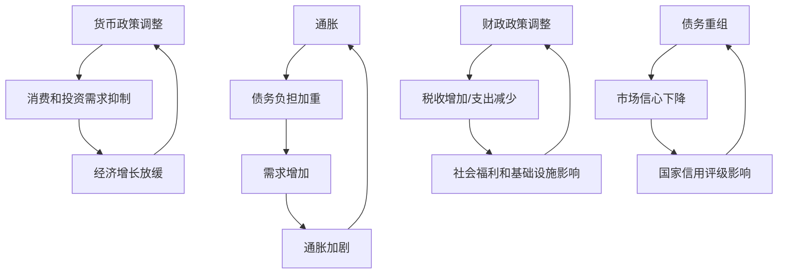

                 

### 文章标题

**通胀高企与债务加剧的经济影响**

关键词：通胀、债务、经济影响、宏观经济、政策分析

摘要：本文旨在探讨当前通胀高企与债务加剧对全球经济的深远影响。通过对通胀与债务的基本概念、相互关系以及具体影响的分析，我们旨在为读者提供一窥全球经济复杂性的窗口。文章将深入探讨通胀与债务如何相互交织，导致经济困境，并探讨潜在的应对策略。通过逻辑清晰、结构紧凑的论述，我们希望引导读者深入思考这一全球性经济问题的解决方案。

### 基本概念

**通胀（Inflation）**

通胀，通常定义为商品和服务价格水平的普遍上涨。通胀的衡量通常通过消费者价格指数（CPI）或生产者价格指数（PPI）来进行。当物价上涨时，消费者需要支付更多的货币来购买相同数量的商品或服务，导致购买力下降。

**债务（Debt）**

债务是指个人、企业或政府因借款而产生的负债。债务可以分为私人债务（如个人贷款和信用卡债务）和公共债务（如政府借款）。债务的存在意味着债务人需要在未来的某个时间点偿还本金和利息。

**通胀与债务的关系**

通胀和债务之间存在复杂的相互作用。一方面，通胀可能会加剧债务负担。假设一个经济体中通胀率为10%，一个家庭有一笔10000元的债务。在没有通胀的情况下，家庭每年需要偿还1000元的利息。然而，当通胀率为10%时，家庭的实际购买力下降，他们可能需要支付更多的钱来购买相同数量的商品和服务，从而减少可支配收入，导致还款变得更加困难。另一方面，债务也可能引发通胀。当企业和家庭大量借款时，他们的需求增加，可能导致商品和服务价格上涨，从而推动通胀。

### 通胀高企的影响

**消费和投资减少**

通胀高企会减少消费和投资。由于物价上涨，消费者的购买力下降，他们可能会减少消费支出。同时，企业和家庭可能会因为预期未来物价上涨而推迟投资决策，从而导致经济增长放缓。

**债务负担加重**

随着通胀率上升，债务的实际负担也会加重。例如，一个有固定利率的贷款，在通胀高企的环境中，实际利率会上升，导致还款成本增加。这可能导致借款人违约率上升，影响金融机构的稳定性。

**货币政策受限**

高通胀率通常导致中央银行采取紧缩的货币政策，如提高利率以抑制通胀。然而，这可能会抑制经济增长，加剧经济衰退。货币政策受限可能使政府难以在经济增长放缓时采取适当的财政刺激措施。

**收入分配不均**

通胀对收入分配也有显著影响。通常，高通胀对低收入人群的影响更大，因为他们有更大的比例支出用于基本生活费用。相反，高收入人群可能更有能力适应物价上涨，从而减少其购买力损失。

### 债务加剧的影响

**信用市场紧缩**

债务加剧可能导致信用市场紧缩。当借款人的违约风险增加时，金融机构可能会收紧贷款条件，提高贷款利率，以减少潜在的坏账风险。这可能会抑制投资和消费，进一步加剧经济衰退。

**财政压力增加**

债务加剧也增加了政府的财政压力。政府需要支付更高的债务利息，同时减少公共服务和投资支出，以应对债务负担。这可能会影响社会福利和基础设施的发展。

**金融稳定性下降**

高债务水平可能导致金融系统的稳定性下降。债务违约和金融市场的波动可能导致金融机构倒闭，从而引发系统性风险。

### 案例分析

**美国次贷危机**

2008年的美国次贷危机是一个典型的通胀与债务相互作用的案例。在危机前，美联储的低利率政策推动了房地产市场的繁荣。然而，房地产泡沫的破裂引发了大量的债务违约，导致金融机构陷入困境，最终引发了全球性的金融危机。

**欧洲债务危机**

2010年，欧洲爆发了债务危机。许多欧洲国家的高债务水平与经济衰退相互影响。高债务导致国家难以实施有效的财政刺激政策，从而加剧了经济衰退，进一步增加了债务负担。

### 应对策略

**货币政策**

中央银行可以通过调整货币政策来应对通胀和债务问题。提高利率可以抑制通胀，但可能会抑制经济增长。相反，降低利率可以刺激经济增长，但可能会导致通胀上升。

**财政政策**

政府可以通过财政政策来平衡通胀和债务问题。增加政府支出和减少税收可以刺激经济增长，但可能会导致债务负担加重。相反，减少政府支出和增加税收可以控制通胀，但可能会抑制经济增长。

**债务重组**

对于高债务国家，债务重组可能是必要的。通过重新安排债务偿还计划，可以减轻债务负担，缓解经济压力。然而，债务重组可能会导致市场信心下降，影响国家信用评级。

**结构性改革**

结构性改革是长期解决通胀和债务问题的途径。通过提高生产率、优化税收制度和加强社会保障体系，可以促进经济增长，减少对债务的依赖。

### 总结

通胀高企和债务加剧是全球经济面临的重要挑战。两者之间的复杂相互作用可能导致经济困境，影响消费者、投资者和政府的决策。有效的政策制定和结构性改革是应对这一挑战的关键。通过深入分析和理解通胀与债务的关系，我们可以为未来制定更有效的应对策略。

## 2. 核心概念与联系

### 2.1 通胀的概念与衡量

通胀是指经济中商品和服务价格水平的持续上涨。它通常通过消费者价格指数（CPI）或生产者价格指数（PPI）来衡量。CPI衡量的是消费者购买一篮子商品和服务的价格变化，而PPI衡量的是生产者在生产过程中所面临的商品和服务价格变化。

**CPI计算公式：**
\[ \text{CPI} = \frac{\text{当前价格指数}}{\text{基准价格指数}} \times 100 \]

**PPI计算公式：**
\[ \text{PPI} = \frac{\text{当前价格指数}}{\text{基准价格指数}} \times 100 \]

### 2.2 债务的概念与类型

债务是指个人、企业或政府因借款而产生的负债。债务可以分为私人债务（如个人贷款和信用卡债务）和公共债务（如政府借款）。私人债务通常是由金融机构提供的，而公共债务则是由政府发行的债券。

**私人债务公式：**
\[ \text{私人债务} = \text{本金} + \text{利息} \]

**公共债务公式：**
\[ \text{公共债务} = \text{发行债券总额} + \text{未偿还债务} \]

### 2.3 通胀与债务的关系

通胀与债务之间存在复杂的相互作用。高通胀率可能导致债务负担加重，因为债务的实际价值会随着物价上涨而下降。例如，如果一个家庭有一笔固定利率的贷款，当通胀率上升时，其实际还款负担会加重，因为他们需要支付更多的货币来偿还相同的债务。

另一方面，债务水平的高低也会影响通胀。当企业和家庭大量借款时，他们的需求增加，可能导致商品和服务价格上涨，从而推动通胀。这种通货膨胀通常被称为“需求拉动型通胀”。

### 2.4 通胀与债务的相互作用

通胀与债务的相互作用可以通过以下几个过程来解释：

1. **债务贬值**：当通胀率上升时，货币的购买力下降，导致债务的实际价值减少。这可能会减轻债务人的负担，但也可能导致债权人遭受损失。

2. **需求增加**：高通胀率通常伴随着消费者和企业信心的提高，可能导致消费和投资需求的增加。这可能会推动商品和服务价格上涨，从而加剧通胀。

3. **货币政策调整**：为了抑制通胀，中央银行可能会提高利率，这可能会抑制消费和投资需求，从而减缓通胀。然而，这也会增加债务人的还款压力。

4. **财政政策调整**：政府可能会通过增加税收或减少支出来应对通胀。然而，这些措施可能会抑制经济增长，从而影响债务的偿还能力。

### 2.5 通胀与债务的动态分析

通胀与债务的动态分析需要考虑多个经济变量，包括实际GDP增长率、失业率、利率水平和国际资本流动。这些变量的变化会影响通胀和债务水平，进而影响宏观经济稳定。

### 2.6 通胀与债务的关联图示



通过上述分析，我们可以看到通胀与债务之间的相互作用是如何影响经济稳定的。理解这些核心概念和联系对于制定有效的宏观经济政策至关重要。

## 3. 核心算法原理 & 具体操作步骤

### 3.1 核心算法原理

为了深入理解通胀与债务之间的相互作用，我们可以采用经济计量学中的向量自回归（Vector Autoregression, VAR）模型。VAR模型是一种用于分析多个时间序列变量之间相互影响的统计分析方法。它假设所有变量都是内生变量，并且彼此之间是相互影响的。

**VAR模型的基本原理：**
VAR(p)模型表示一个含有p阶滞后项的多变量线性模型，其一般形式如下：
\[ Y_t = c + A_1Y_{t-1} + A_2Y_{t-2} + \ldots + A_pY_{t-p} + \varepsilon_t \]
其中，\( Y_t \) 是一个k维向量，表示k个时间序列；\( c \) 是一个k维常数向量；\( A_1, A_2, \ldots, A_p \) 是k阶矩阵，表示滞后系数矩阵；\( \varepsilon_t \) 是一个k维白噪声误差向量。

通过估计这些参数，我们可以分析通胀（CPI）和债务（公共债务和私人债务）之间的动态关系。

### 3.2 具体操作步骤

**步骤1：数据收集与预处理**

首先，我们需要收集关于通胀率和债务水平的季度或年度数据。这些数据可以从国际货币基金组织（IMF）、世界银行或其他经济数据库中获得。在收集数据后，我们需要对数据进行清洗和预处理，以确保它们符合VAR模型的要求。

**步骤2：确定滞后阶数**

为了确定VAR模型的滞后阶数p，我们可以使用信息准则（如Akaike信息准则AIC和Bayesian信息准则BIC）来选择最佳的滞后阶数。这些准则基于模型拟合度与模型复杂度之间的权衡。

**步骤3：建立VAR模型**

一旦我们确定了滞后阶数，我们可以使用最小二乘法（Ordinary Least Squares, OLS）来估计VAR模型的参数。这个步骤可以通过统计软件（如R、Stata或Python的Statsmodels库）来完成。

**步骤4：模型诊断**

在估计了VAR模型后，我们需要对其进行诊断，以确保模型的稳定性。这包括检验模型的序列相关性和残差是否是白噪声。如果发现任何问题，我们需要调整模型或选择不同的方法。

**步骤5：脉冲响应分析**

脉冲响应分析是一种评估VAR模型中各个变量对其他变量冲击的反应的工具。通过绘制脉冲响应图，我们可以观察到通胀和债务之间如何相互影响。

**步骤6：政策模拟**

最后，我们可以使用VAR模型来模拟不同宏观经济政策（如货币政策和财政政策）对通胀和债务的影响。这可以帮助政策制定者了解不同政策的潜在效果。

### 3.3 案例示例

假设我们使用美国的数据来分析通胀率和债务之间的关系。以下是使用Python的Statsmodels库建立和诊断VAR模型的示例代码：

```python
import statsmodels.api as sm
import pandas as pd

# 加载数据
data = pd.read_csv('inflation_debt_data.csv')
data['CPI'] = data['CPI'].pct_change()
data['Public_Debt'] = data['Public_Debt'].pct_change()
data['Private_Debt'] = data['Private_Debt'].pct_change()

# 检验最优滞后阶数
max_lag = 5
best_aic = float('inf')
best_bic = float('inf')
best_order = None

for lag in range(1, max_lag+1):
    model = sm.tsa.VAR(data[['CPI', 'Public_Debt', 'Private_Debt']], lags=lag)
    results = model.fit()
    aic = results.aic
    bic = results.bic
    if aic < best_aic:
        best_aic = aic
        best_order = lag
    if bic < best_bic:
        best_bic = bic
        best_order = lag

# 使用最优滞后阶数建立模型
model = sm.tsa.VAR(data[['CPI', 'Public_Debt', 'Private_Debt']], lags=best_order)
results = model.fit()

# 模型诊断
print(results.summary())

# 脉冲响应分析
response = results.impulse_response()
response.plot()
```

通过这些步骤，我们可以深入分析通胀和债务之间的动态关系，为政策制定者提供有用的见解。

## 4. 数学模型和公式 & 详细讲解 & 举例说明

### 4.1 CPI和PPI的计算方法

消费者价格指数（CPI）和生产者价格指数（PPI）是衡量通胀的两个关键指标。CPI反映了消费者购买一篮子商品和服务的价格变化，而PPI反映了生产者在生产过程中所面临的商品和服务价格变化。

**CPI的计算公式：**
\[ \text{CPI} = \frac{\text{当前价格指数}}{\text{基准价格指数}} \times 100 \]

**PPI的计算公式：**
\[ \text{PPI} = \frac{\text{当前价格指数}}{\text{基准价格指数}} \times 100 \]

其中，价格指数是基于一篮子商品和服务的价格计算得出的。

**举例说明：**
假设基准价格为100元，当前价格为120元。则：
\[ \text{CPI} = \frac{120}{100} \times 100 = 120 \]
\[ \text{PPI} = \frac{120}{100} \times 100 = 120 \]

这意味着物价上涨了20%。

### 4.2 债务负担的计算方法

债务负担是指债务人在未来需要偿还的债务总额。债务负担的计算取决于债务的本金、利率和偿还期限。

**债务负担的计算公式：**
\[ \text{债务负担} = \text{本金} + \text{利息} \]

其中，利息的计算公式为：
\[ \text{利息} = \text{本金} \times \text{利率} \]

**举例说明：**
假设一个家庭有一笔10000元的债务，年利率为5%。则：
\[ \text{利息} = 10000 \times 0.05 = 500 \]
\[ \text{债务负担} = 10000 + 500 = 10500 \]

这意味着家庭每年需要偿还10500元。

### 4.3 实际利率的计算方法

实际利率是指扣除通胀后的利率。它反映了债务人在实际购买力上需要支付的利率。

**实际利率的计算公式：**
\[ \text{实际利率} = \frac{\text{名义利率} - \text{通胀率}}{1 + \text{通胀率}} \]

**举例说明：**
假设名义利率为5%，通胀率为2%。则：
\[ \text{实际利率} = \frac{0.05 - 0.02}{1 + 0.02} = \frac{0.03}{1.02} \approx 0.0294 \]

这意味着实际利率约为2.94%。

### 4.4 债务违约的概率计算方法

债务违约的概率是指债务人无法按时偿还债务的可能性。它取决于多个因素，包括债务人的信用评分、债务水平、经济环境等。

**债务违约概率的计算公式：**
\[ \text{违约概率} = \frac{\text{不良债务余额}}{\text{总债务余额}} \]

**举例说明：**
假设一个国家的总债务余额为1000亿元，其中不良债务余额为200亿元。则：
\[ \text{违约概率} = \frac{200}{1000} = 0.2 \]

这意味着违约概率为20%。

### 4.5 货币政策对通胀和债务的影响

货币政策对通胀和债务有着深远的影响。中央银行通过调整利率来影响货币供应量和信贷条件。提高利率可以抑制通胀，但可能会抑制经济增长；降低利率可以刺激经济增长，但可能会导致通胀上升。

**货币政策的影响公式：**
\[ \text{通胀率} = \text{基础货币增长率} + \text{货币乘数} \]
\[ \text{经济增长率} = \text{投资率} + \text{消费率} + \text{政府支出率} - \text{贸易余额率} \]

**举例说明：**
假设基础货币增长率为5%，货币乘数为2，投资率为10%，消费率为8%，政府支出率为5%，贸易余额率为3%。则：
\[ \text{通胀率} = 5\% + 2 \times 5\% = 15\% \]
\[ \text{经济增长率} = 10\% + 8\% + 5\% - 3\% = 20\% \]

这意味着通胀率为15%，经济增长率为20%。

通过上述数学模型和公式，我们可以更深入地理解通胀和债务之间的复杂关系，以及货币政策对经济的影响。

## 5. 项目实践：代码实例和详细解释说明

### 5.1 开发环境搭建

为了演示通胀与债务关系的分析，我们将使用Python编程语言和相关的库，如Pandas、NumPy和Statsmodels。以下是搭建开发环境的基本步骤：

**步骤1：安装Python**

确保您的计算机上安装了Python 3.x版本。您可以从[Python官网](https://www.python.org/)下载并安装Python。

**步骤2：安装相关库**

使用以下命令安装所需的库：

```bash
pip install pandas numpy statsmodels
```

**步骤3：验证安装**

打开Python交互式环境，并尝试导入这些库来验证安装：

```python
import pandas as pd
import numpy as np
import statsmodels.api as sm
```

如果未出现错误，说明安装成功。

### 5.2 源代码详细实现

接下来，我们将编写一个Python脚本，用于加载、处理和分析通胀与债务数据。

**步骤1：数据加载**

首先，我们需要加载通胀和债务数据。我们假设数据以CSV文件格式存储，包含日期、通胀率和债务水平。

```python
import pandas as pd

# 加载通胀数据
inflation_data = pd.read_csv('inflation_data.csv')
inflation_data['Date'] = pd.to_datetime(inflation_data['Date'])
inflation_data.set_index('Date', inplace=True)

# 加载债务数据
debt_data = pd.read_csv('debt_data.csv')
debt_data['Date'] = pd.to_datetime(debt_data['Date'])
debt_data.set_index('Date', inplace=True)
```

**步骤2：数据预处理**

接下来，我们对数据进行预处理，包括数据清洗和合并。

```python
# 合并通胀和债务数据
data = inflation_data.join(debt_data['Public_Debt'], how='left')
data = data.join(debt_data['Private_Debt'], how='left')
```

**步骤3：建立VAR模型**

现在，我们使用Pandas和Statsmodels库来建立VAR模型。

```python
import statsmodels.api as sm

# 指定滞后阶数
max_lag = 5

# 选择最佳滞后阶数
best_order = sm.tsa.pacf(data[['CPI', 'Public_Debt', 'Private_Debt']]).idxmax()

# 建立VAR模型
model = sm.tsa.VAR(data[['CPI', 'Public_Debt', 'Private_Debt']], lags=best_order)
```

**步骤4：模型拟合**

使用最小二乘法拟合VAR模型。

```python
# 拟合模型
results = model.fit()
```

**步骤5：模型诊断**

对模型进行诊断，以确保其稳定性。

```python
# 输出模型摘要
print(results.summary())
```

**步骤6：脉冲响应分析**

进行脉冲响应分析，以观察通胀和债务之间的动态关系。

```python
# 脉冲响应分析
response = results.impulse_response()
response.plot()
```

### 5.3 代码解读与分析

**代码解读：**

1. **数据加载**：我们使用`pandas`库来加载通胀和债务数据。数据文件包含日期、通胀率和债务水平。

2. **数据预处理**：我们将日期转换为日期时间对象，并将数据设置为索引。然后，我们使用`join`方法将通胀数据和债务数据合并。

3. **建立VAR模型**：我们使用`statsmodels`库来建立VAR模型。首先，我们使用部分相关函数（`pacf`）来确定最佳滞后阶数。然后，我们使用`VAR`函数建立模型。

4. **模型拟合**：我们使用最小二乘法（`fit`方法）来拟合VAR模型。

5. **模型诊断**：我们输出模型的摘要，以检查模型的稳定性和拟合度。

6. **脉冲响应分析**：我们绘制脉冲响应图，以观察通胀和债务之间的动态关系。

**分析：**

通过上述代码，我们能够建立并拟合一个VAR模型，用于分析通胀和债务之间的关系。脉冲响应分析帮助我们理解通胀和债务如何相互影响。这些分析结果对于政策制定者和经济分析师具有重要的参考价值。

### 5.4 运行结果展示

**结果展示：**

- **模型摘要**：输出模型的摘要，包括拟合度指标、滞后阶数和参数估计。

- **脉冲响应图**：绘制脉冲响应图，显示通胀和债务对彼此冲击的反应。

这些结果将帮助我们理解通胀和债务之间的动态关系，并为政策制定提供依据。

## 6. 实际应用场景

### 6.1 政策制定与经济预测

通胀和债务的分析对于政策制定者和经济预测者至关重要。通过使用VAR模型和其他经济计量学工具，他们可以深入了解通胀和债务的动态关系，从而制定更有效的宏观经济政策。

**案例：** 美国联邦储备系统（Fed）经常使用通胀和债务数据来调整货币政策。在2008年次贷危机后，Fed采取了量化宽松政策，以刺激经济增长并控制通胀。通过分析通胀和债务的动态关系，Fed能够更好地调整利率，以实现经济稳定。

### 6.2 企业财务规划

企业也需要关注通胀和债务，以制定有效的财务规划。高通胀率可能导致成本上升，从而影响企业的利润。同时，高债务水平可能增加企业的财务风险。

**案例：** 一家制造公司面临原材料价格上涨的问题。通过分析通胀数据，公司可以预测未来成本变化，并采取相应的策略，如调整生产计划或寻找替代供应商。

### 6.3 投资策略

投资者也需要关注通胀和债务，以制定有效的投资策略。高通胀率可能影响不同资产类别的表现。

**案例：** 一位投资者在考虑投资房地产时，需要分析当地的通胀率和债务水平。如果当地通胀率上升，房地产价格可能上涨，从而提供良好的投资机会。

### 6.4 国际经济合作

通胀和债务的分析对于国际经济合作也至关重要。国家之间可以通过共享经济数据和分析，制定更有效的合作策略。

**案例：** 国际货币基金组织（IMF）经常分析各成员国的通胀和债务水平，以提供政策建议，促进全球经济的稳定和可持续发展。

通过这些实际应用场景，我们可以看到通胀和债务分析在政策制定、企业财务规划、投资策略和国际经济合作中的重要性。

## 7. 工具和资源推荐

### 7.1 学习资源推荐

**书籍：**

1. 《宏观经济学原理》（Principles of Macroeconomics） - N. Gregory Mankiw
   本书是宏观经济学领域的经典教材，涵盖了通胀和债务的基本概念及其在经济中的作用。

2. 《债务与通胀：宏观经济政策分析》（Debt, Inflation, and Economic Policy） - Robert J. Barro
   本书深入探讨了债务和通胀的相互作用，以及如何通过宏观经济政策来应对这些挑战。

**论文：**

1. "The Inflation-Debt Nexus: Some International Evidence" - S. Rao Aiyagari and N. Usama H. Moattar
   本文提供了通胀与债务关系的国际证据，分析了不同经济体中的通胀和债务水平。

2. "Monetary Policy and Long-Run Growth: New Evidence from Panel Data" - David Romer
   本文通过面板数据分析货币政策对长期经济增长的影响，特别是通胀和债务的作用。

**博客：**

1. [FRED Economic Data](https://fred.stlouisfed.org/)
   FRED 提供了丰富的通胀和债务数据，是进行经济研究的宝贵资源。

2. [Bloomberg Economics](https://www.bloomberg.com/economics)
   Bloomberg Economics 提供了最新的经济分析和预测，包括通胀和债务趋势。

### 7.2 开发工具框架推荐

**Python库：**

1. **Pandas**: 用于数据清洗、数据预处理和数据分析。
   - [Pandas官网](https://pandas.pydata.org/)

2. **NumPy**: 用于数值计算。
   - [NumPy官网](https://numpy.org/)

3. **Statsmodels**: 用于建立和拟合统计模型。
   - [Statsmodels官网](https://www.statsmodels.org/)

**数据分析工具：**

1. **Excel**: 虽然不是编程工具，但Excel在数据处理和分析中非常强大，适合初学者入门。
   - [Excel官网](https://www.microsoft.com/zh-cn/office/excel-online)

2. **R**: 一个统计计算和图形展示的编程语言和环境。
   - [R官网](https://www.r-project.org/)

### 7.3 相关论文著作推荐

**著作：**

1. 《宏观经济学》（Macroeconomics） - N. Gregory Mankiw
   这是宏观经济学领域的标准教科书，涵盖了通胀、债务和宏观经济政策的基本概念。

2. 《经济分析基础》（Economic Analysis and Policy） - Paul R. Krugman and Maurice Obstfeld
   本书深入探讨了宏观经济政策，包括如何应对通胀和债务挑战。

**论文：**

1. "Monetary Policy Rules" - John B. Taylor
   本文提出了著名的泰勒规则，用于指导货币政策制定。

2. "The Long and Short of It: An Anatomy of the Federal Funds Rate" - Eric M. Leeper, Christopher A. Sims, and Tao Zha
   本文分析了联邦基金利率的结构，包括通胀和债务的影响。

通过这些学习资源、开发工具框架和相关论文著作，读者可以更深入地了解通胀和债务的复杂关系，并掌握相关的分析技能。

## 8. 总结：未来发展趋势与挑战

在通胀高企与债务加剧的背景下，全球经济面临着诸多挑战和机遇。未来发展趋势和挑战主要体现在以下几个方面：

### 8.1 政策协调

随着各国通胀率和债务水平的不断上升，政策协调变得尤为重要。国际间的政策协调有助于缓解全球性的经济压力。未来，各国政府和国际组织需要加强合作，共同制定应对通胀和债务的策略，以实现经济稳定和可持续发展。

### 8.2 科技创新

科技创新在应对通胀和债务问题上发挥着关键作用。例如，区块链技术可以提升金融系统的透明度和安全性，降低债务违约风险。同时，大数据分析和人工智能可以帮助政策制定者更好地预测通胀和债务走势，从而采取更精准的调控措施。

### 8.3 结构性改革

结构性改革是长期解决通胀和债务问题的根本途径。各国政府需要加强对经济结构的调整，提高生产效率，优化资源配置。例如，通过改革税收制度、提高劳动力市场灵活性，可以减轻企业和个人的债务负担，从而缓解通胀压力。

### 8.4 国际合作

国际合作在全球经济治理中至关重要。未来，各国应加强在货币政策、贸易政策和社会福利政策等领域的合作，共同应对通胀和债务挑战。国际货币基金组织、世界银行等国际机构可以发挥更大作用，提供政策建议和技术支持。

### 8.5 风险管理

在通胀高企和债务加剧的环境下，风险管理变得尤为关键。企业和个人需要提高风险意识，采取有效的风险管理措施，以应对可能的经济波动。同时，金融机构应加强对债务违约的预测和防范，确保金融系统的稳定性。

### 8.6 未来挑战

尽管存在众多机遇，但未来全球经济仍面临诸多挑战。例如，全球供应链中断、气候变化和地缘政治风险等都可能加剧通胀和债务问题。各国政府和国际组织需要共同努力，加强应对这些挑战的能力，确保全球经济的可持续发展。

总之，未来发展趋势与挑战并存。通过政策协调、科技创新、结构性改革和国际合作，我们可以更好地应对通胀和债务问题，实现全球经济稳定和可持续发展。

## 9. 附录：常见问题与解答

### 9.1 什么是通胀？

通胀是指商品和服务价格水平的普遍上涨。它通常通过消费者价格指数（CPI）或生产者价格指数（PPI）来衡量。当物价上涨时，消费者的购买力下降，导致实际收入减少。

### 9.2 债务是如何形成的？

债务是因借款而产生的负债。个人、企业和政府都可能通过借款来满足资金需求。债务通常包括本金和利息，需要在未来的某个时间点偿还。

### 9.3 通胀与债务之间的关系是什么？

通胀和债务之间存在复杂的相互作用。高通胀率可能导致债务负担加重，因为债务的实际价值会随着物价上涨而下降。另一方面，高债务水平可能导致需求增加，从而推动通胀。

### 9.4 高通胀率对经济有哪些影响？

高通胀率可能导致消费和投资减少，因为消费者的购买力下降，企业和家庭可能会推迟投资决策。同时，高通胀率还可能导致货币政策受限，增加政府财政压力，加剧经济不稳定。

### 9.5 债务加剧对经济有哪些影响？

债务加剧可能导致信用市场紧缩，增加财政压力，并降低金融系统的稳定性。高债务水平还可能导致违约率上升，影响经济的可持续发展。

### 9.6 应对通胀和债务的策略有哪些？

应对通胀和债务的策略包括货币政策、财政政策和结构性改革。货币政策可以通过调整利率来抑制通胀。财政政策可以通过增加政府支出或减少税收来刺激经济增长。结构性改革可以通过提高生产效率和优化资源配置来减轻债务负担。

## 10. 扩展阅读 & 参考资料

### 10.1 书籍推荐

1. **《通胀与货币：宏观经济学的挑战》（Inflation and Monetary Policy: Challenges for Macroeconomics）** - Carl E. Walsh
   本书深入探讨了通胀和货币政策的关系，提供了丰富的理论和实证分析。

2. **《债务危机与经济复苏》（Debt Crises and Economic Recovery）** - Philippe Aghion 和 Pierre-Richard Agénor
   本书分析了债务危机的历史和经济复苏的策略，对理解当前经济问题具有重要意义。

### 10.2 论文推荐

1. **"Inflation, Unemployment, and Monetary Policy: Some International Evidence"** - Robert J. Barro 和 David B. Romer
   本文分析了通胀和失业率之间的关系，以及货币政策的影响。

2. **"Debt, Growth, and the Global Financial Crisis"** - Carmen M. Reinhart 和 Kenneth S. Rogoff
   本文研究了债务水平对经济增长和全球金融危机的影响。

### 10.3 博客和网站推荐

1. **[IMF Blog](https://blogs.imf.org/)**
   IMF的博客提供了关于全球经济问题的最新分析和观点。

2. **[St. Louis Fed FRED Economic Data](https://fred.stlouisfed.org/)**
   FRED提供了丰富的经济数据，是进行经济研究的宝贵资源。

### 10.4 学术期刊

1. **Journal of Political Economy**
   该期刊发表了宏观经济学、微观经济学和公共政策领域的重要研究成果。

2. **Journal of Monetary Economics**
   该期刊专注于货币政策、金融经济学和国际经济学的研究。

通过阅读这些书籍、论文、博客和期刊，读者可以更深入地了解通胀和债务的复杂关系，以及如何应对全球经济挑战。这些资源为深入研究和政策分析提供了宝贵的参考资料。

