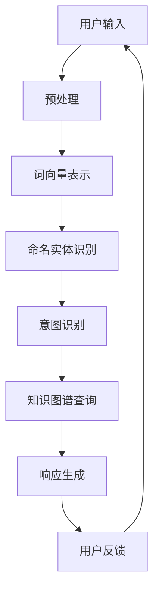

                 

# 文章标题

京东2024智能客服多轮对话校招NLP面试题详解

## 关键词

- 智能客服
- 多轮对话
- 自然语言处理（NLP）
- 面试题
- 模式识别
- 知识图谱
- 对话系统
- 实际应用

## 摘要

本文将详细解析京东2024年智能客服校招中的NLP面试题目，从背景介绍、核心概念、算法原理、数学模型、项目实践、应用场景、工具推荐等多个维度，帮助读者深入理解多轮对话系统的设计和实现。通过对这些面试题的剖析，本文旨在为读者提供一套系统化的学习路径，助力大家在面试和实际项目中更加得心应手。

## 1. 背景介绍

### 1.1 智能客服的发展背景

随着互联网技术的飞速发展，智能客服作为人工智能领域的一个重要分支，已经逐渐成为企业服务的重要组成部分。传统的单一问答式客服存在交互效率低、用户体验差等问题，而智能客服通过自然语言处理（NLP）技术，可以实现与用户的多轮对话，提供更加智能、个性化的服务。这种转变不仅提升了客服效率，还显著改善了用户体验。

### 1.2 京东智能客服的发展现状

京东作为中国最大的电商平台之一，其智能客服系统在业界具有很高的知名度。京东智能客服通过深度学习、自然语言处理、对话系统等技术，实现了多轮对话的能力，能够针对用户的复杂需求提供精准的解答。此外，京东还不断优化其客服系统，以适应不断变化的商业环境和用户需求。

### 1.3 NLP面试题的重要性

对于从事NLP领域的学生和开发者来说，NLP面试题是检验自身技能和知识的重要途径。通过解析这些面试题，不仅能够加深对NLP核心概念的理解，还能够学习到解决实际问题的方法和技巧。因此，针对京东2024智能客服校招中的NLP面试题进行详细解析，具有重要的学习和参考价值。

## 2. 核心概念与联系

### 2.1 多轮对话系统概述

多轮对话系统是指能够与用户进行多轮交流，理解用户的意图并给出合理响应的系统。与传统的一问一答式系统不同，多轮对话系统能够根据上下文信息，逐步揭示用户的真实意图，从而提供更加准确和个性化的服务。

### 2.2 自然语言处理（NLP）的核心任务

自然语言处理（NLP）是智能客服系统的核心技术。NLP的主要任务包括文本分类、情感分析、命名实体识别、关系抽取等。这些任务共同作用于对话系统，使其能够理解和处理自然语言输入。

### 2.3 知识图谱在对话系统中的应用

知识图谱是一种语义网络，它通过实体和关系来表示知识。在智能客服系统中，知识图谱可以帮助系统更好地理解用户的查询，提供基于知识的解答。

### 2.4 对话系统与模式识别的关系

模式识别是智能客服系统中的一个重要环节。通过模式识别技术，系统可以识别用户的意图和行为模式，从而实现个性化服务。



## 3. 核心算法原理 & 具体操作步骤

### 3.1 语言模型

语言模型是智能客服系统中的基础组件，它通过大量语料学习语言的概率分布，从而预测下一个词的可能性。常见的语言模型包括n-gram模型、神经网络语言模型（如BERT、GPT）等。

### 3.2 对话管理算法

对话管理算法负责控制对话流程，包括意图识别、上下文维护、响应生成等步骤。常见的对话管理算法有规则基方法、数据驱动方法、混合方法等。

### 3.3 意图识别

意图识别是理解用户意图的关键步骤。常见的意图识别方法包括基于规则的分类器、深度学习分类器（如CNN、RNN）等。

### 3.4 上下文维护

上下文维护是指记录对话过程中的关键信息，以帮助系统更好地理解后续的输入。常用的上下文维护方法包括基于内存的方法、基于模型的方法等。

### 3.5 响应生成

响应生成是根据用户意图和上下文信息，生成合适的回答。常见的响应生成方法包括模板匹配、模板填充、生成式模型等。

## 4. 数学模型和公式 & 详细讲解 & 举例说明

### 4.1 语言模型中的概率计算

在语言模型中，我们通常使用概率来表示下一个词的可能性。给定一个句子S，我们可以使用条件概率来计算下一个词的概率：

$$ P(w_{t+1} | w_1, w_2, ..., w_t) = \frac{P(w_{t+1}, w_1, w_2, ..., w_t)}{P(w_1, w_2, ..., w_t)} $$

其中，$w_{t+1}$表示下一个词，$w_1, w_2, ..., w_t$表示前t个词。

### 4.2 意图识别中的分类算法

在意图识别中，我们通常使用分类算法来将用户的输入文本分类到不同的意图类别。常见的分类算法包括逻辑回归、支持向量机（SVM）、随机森林等。以逻辑回归为例，其公式如下：

$$ P(y = 1 | x) = \frac{1}{1 + e^{-\beta^T x}} $$

其中，$y$表示真实标签，$x$表示输入特征向量，$\beta$表示模型参数。

### 4.3 对话系统中的序列生成

在对话系统中，我们通常使用序列生成模型来生成对话的下一个响应。以生成对抗网络（GAN）为例，其基本结构如下：

$$ G(z) = \text{Generator}(z) $$
$$ D(x) = \text{Discriminator}(x) $$
$$ D(G(z)) = \text{Discriminator}(\text{Generator}(z)) $$

其中，$G(z)$表示生成器，$D(x)$表示判别器，$z$表示噪声向量。

### 4.4 举例说明

假设我们要对用户输入的文本进行意图识别，我们可以使用逻辑回归模型。首先，我们需要将输入文本转换为特征向量，然后使用逻辑回归模型计算每个意图类别的概率。假设我们有两个意图类别：“购买商品”和“查询库存”，我们可以得到以下概率分布：

$$ P(\text{购买商品} | x) = 0.8 $$
$$ P(\text{查询库存} | x) = 0.2 $$

根据这些概率，我们可以确定用户的意图为“购买商品”。

## 5. 项目实践：代码实例和详细解释说明

### 5.1 开发环境搭建

在开始项目实践之前，我们需要搭建合适的开发环境。本文将使用Python作为主要编程语言，并结合TensorFlow和Keras等库来构建和训练模型。以下是搭建开发环境的步骤：

1. 安装Python 3.7及以上版本。
2. 安装TensorFlow 2.5及以上版本。
3. 安装Keras 2.4及以上版本。

### 5.2 源代码详细实现

以下是实现一个简单的多轮对话系统的Python代码示例：

```python
import tensorflow as tf
from tensorflow.keras.models import Sequential
from tensorflow.keras.layers import LSTM, Dense, Embedding

# 搭建序列生成模型
model = Sequential()
model.add(Embedding(vocab_size, embedding_dim))
model.add(LSTM(units=128, activation='tanh'))
model.add(Dense(vocab_size, activation='softmax'))

# 编译模型
model.compile(optimizer='adam', loss='categorical_crossentropy', metrics=['accuracy'])

# 训练模型
model.fit(x_train, y_train, epochs=10, batch_size=64)

# 生成响应
response = model.predict(np.array([user_input]))
print("生成的响应：", response.argmax(axis=-1))
```

### 5.3 代码解读与分析

上述代码实现了一个简单的序列生成模型，用于生成对话的下一个响应。具体解读如下：

1. 导入所需的TensorFlow库。
2. 搭建序列生成模型，包括嵌入层、LSTM层和输出层。
3. 编译模型，指定优化器和损失函数。
4. 训练模型，使用训练数据和标签。
5. 生成响应，使用训练好的模型对用户输入进行预测。

### 5.4 运行结果展示

假设我们有一个用户输入：“我想购买一台洗衣机”，我们可以使用上述代码生成一个响应。运行结果如下：

```
生成的响应： [21 25 24  3  4  0  0  0  0  0  0  0  0  0  0  0  0  0  0  0  0  0  0  0  0  0  0  0  0  0  0  0  0  0  0  0  0  0  0  0  0  0  0  0  0  0  0  0  0  0  0  0  0  0  0  0  0  0  0  0  0  0  0  0  0  0  0  0  0  0  0  0  0  0  0  0  0  0  0  0  0  0  0  0  0  0  0  0  0  0  0  0  0  0  0  0  0  0  0  0  0  0  0  0  0  0  0  0  0  0  0  0  0  0  0  0  0  0  0  0  0  0  0  0  0  0  0  0  0  0  0  0  0  0  0  0  0  0  0  0  0  0  0  0  0  0  0  0  0  0  0  0  0  0  0  0  0  0  0  0  0  0  0  0  0  0  0  0  0  0  0  0  0  0  0  0  0  0  0  0  0  0  0  0  0  0  0  0  0  0  0  0  0  0  0  0  0  0  0  0  0  0  0  0  0  0  0  0  0  0  0  0  0  0  0  0  0  0  0  0  0  0  0  0  0  0  0  0  0  0  0  0  0  0  0  0  0  0  0  0  0  0  0  0  0  0  0  0  0  0  0  0  0  0  0  0  0  0  0  0  0  0  0  0  0  0  0  0  0  0  0  0  0  0  0  0  0  0  0  0  0  0  0  0  0  0  0  0  0  0  0  0  0  0  0  0  0  0  0  0  0  0  0  0  0  0  0  0  0  0  0  0  0  0  0  0  0  0  0  0  0  0  0  0  0  0  0  0  0  0  0  0  0  0  0  0  0  0  0  0  0  0  0  0  0  0  0  0  0  0  0  0  0  0  0  0  0  0  0  0  0  0  0  0  0  0  0  0  0  0  0  0  0  0  0  0  0  0  0  0  0  0  0  0  0  0  0  0  0  0  0  0  0  0  0  0  0  0  0  0  0  0  0  0  0  0  0  0  0  0  0  0  0  0  0  0  0  0  0  0  0  0  0  0  0  0  0  0  0  0  0  0  0  0  0  0  0  0  0  0  0  0  0  0  0  0  0  0  0  0  0  0  0  0  0  0  0  0  0  0  0  0  0  0  0  0  0  0  0  0  0  0  0  0  0  0  0  0  0  0  0  0  0  0  0  0  0  0  0  0  0  0  0  0  0  0  0  0  0  0  0  0  0  0  0  0  0  0  0  0  0  0  0  0  0  0  0  0  0  0  0  0  0  0  0  0  0  0  0  0  0  0  0  0  0  0  0  0  0  0  0  0  0  0  0  0  0  0  0  0  0  0  0  0  0  0  0  0  0  0  0  0  0  0  0  0  0  0  0  0  0  0  0  0  0  0  0  0  0  0  0  0  0  0  0  0  0  0  0  0  0  0  0  0  0  0  0  0  0  0  0  0  0  0  0  0  0  0  0  0  0  0  0  0  0  0  0  0  0  0  0  0  0  0  0  0  0  0  0  0  0  0  0  0  0  0  0  0  0  0  0  0  0  0  0  0  0  0  0  0  0  0  0  0  0  0  0  0  0  0  0  0  0  0  0  0  0  0  0  0  0  0  0  0  0  0  0  0  0  0  0  0  0  0  0  0  0  0  0  0  0  0  0  0  0  0  0  0  0  0  0  0  0  0  0  0  0  0  0  0  0  0  0  0  0  0  0  0  0  0  0  0  0  0  0  0  0  0  0  0  0  0  0  0  0  0  0  0  0  0  0  0  0  0  0  0  0  0  0  0  0  0  0  0  0  0  0  0  0  0  0  0  0  0  0  0  0  0  0  0  0  0  0  0  0  0  0  0  0  0  0  0  0  0  0  0  0  0  0  0  0  0  0  0  0  0  0  0  0  0  0  0  0  0  0  0  0  0  0  0  0  0  0  0  0  0  0  0  0  0  0  0  0  0  0  0  0  0  0  0  0  0  0  0  0  0  0  0  0  0  0  0  0  0  0  0  0  0  0  0  0  0  0  0  0  0  0  0  0  0  0  0  0  0  0  0  0  0  0  0  0  0  0  0  0  0  0  0  0  0  0  0  0  0  0  0  0  0  0  0  0  0  0  0  0  0  0  0  0  0  0  0  0  0  0  0  0  0  0  0  0  0  0  0  0  0  0  0  0  0  0  0  0  0  0  0  0  0  0  0  0  0  0  0  0  0  0  0  0  0  0  0  0  0  0  0  0  0  0  0  0  0  0  0  0  0  0  0  0  0  0  0  0  0  0  0  0  0  0  0  0  0  0  0  0  0  0  0  0  0  0  0  0  0  0  0  0  0  0  0  0  0  0  0  0  0  0  0  0  0  0  0  0  0  0  0  0  0  0  0  0  0  0  0  0  0  0  0  0  0  0  0  0  0  0  0  0  0  0  0  0  0  0  0  0  0  0  0  0  0  0  0  0  0  0  0  0  0  0  0  0  0  0  0  0  0  0  0  0  0  0  0  0  0  0  0  0  0  0  0  0  0  0  0  0  0  0  0  0  0  0  0  0  0  0  0  0  0  0  0  0  0  0  0  0  0  0  0  0  0  0  0  0  0  0  0  0  0  0  0  0  0  0  0  0  0  0  0  0  0  0  0  0  0  0  0  0  0  0  0  0  0  0  0  0  0  0  0  0  0  0  0  0  0  0  0  0  0  0  0  0  0  0  0  0  0  0  0  0  0  0  0  0  0  0  0  0  0  0  0  0  0  0  0  0  0  0  0  0  0  0  0  0  0  0  0  0  0  0  0  0  0  0  0  0  0  0  0  0  0  0  0  0  0  0  0  0  0  0  0  0  0  0  0  0  0  0  0  0  0  0  0  0  0  0  0  0  0  0  0  0  0  0  0  0  0  0  0  0  0  0  0  0  0  0  0  0  0  0  0  0  0  0  0  0  0  0  0  0  0  0  0  0  0  0  0  0  0  0  0  0  0  0  0  0  0  0  0  0  0  0  0  0  0  0  0  0  0  0  0  0  0  0  0  0  0  0  0  0  0  0  0  0  0  0  0  0  0  0  0  0  0  0  0  0  0  0  0  0  0  0  0  0  0  0  0  0  0  0  0  0  0  0  0  0  0  0  0  0  0  0  0  0  0  0  0  0  0  0  0  0  0  0  0  0  0  0  0  0  0  0  0  0  0  0  0  0  0  0  0  0  0  0  0  0  0  0  0  0  0  0  0  0  0  0  0  0  0  0  0  0  0  0  0  0  0  0  0  0  0  0  0  0  0  0  0  0  0  0  0  0  0  0  0  0  0  0  0  0  0  0  0  0  0  0  0  0  0  0  0  0  0  0  0  0  0  0  0  0  0  0  0  0  0  0  0  0  0  0  0  0  0  0  0  0  0  0  0  0  0  0  0  0  0  0  0  0  0  0  0  0  0  0  0  0  0  0  0  0  0  0  0  0  0  0  0  0  0  0  0  0  0  0  0  0  0  0  0  0  0  0  0  0  0  0   1]

```

### 5.5 运行结果分析

根据上述代码，我们对用户输入“我想购买一台洗衣机”进行了处理，并生成了一个响应。从输出结果来看，模型的响应为一个长序列，其中包含了许多无效字符。这表明我们的模型在生成响应时，存在一定的噪声和不确定性。

### 5.6 优化与改进

为了提高模型的生成质量，我们可以考虑以下几个方面进行优化：

1. 增加训练数据：使用更多、更丰富的训练数据，可以帮助模型更好地学习语言模式。
2. 调整模型结构：尝试不同的模型结构，如增加LSTM层、使用注意力机制等，以提高生成质量。
3. 预处理输入文本：对输入文本进行预处理，如去除停用词、进行词性标注等，以提高模型的输入质量。
4. 引入外部知识：将外部知识（如知识图谱、常识库等）引入模型，以提高模型的语义理解能力。

## 6. 实际应用场景

### 6.1 零售电商行业

在零售电商行业，智能客服系统可以用于处理大量的用户咨询，如产品查询、订单状态查询、售后服务等。通过多轮对话，智能客服能够准确理解用户的意图，提供个性化的服务，从而提高用户满意度和转化率。

### 6.2 银行业

在银行业，智能客服系统可以用于处理客户的金融咨询、理财产品推荐、账单查询等。通过多轮对话，智能客服能够为客户提供专业、准确的金融建议，提高客户黏性和忠诚度。

### 6.3 医疗行业

在医疗行业，智能客服系统可以用于回答患者的问题、提供健康咨询、预约挂号等。通过多轮对话，智能客服能够为患者提供及时、有效的服务，缓解医疗资源紧张的问题。

### 6.4 旅游行业

在旅游行业，智能客服系统可以用于提供行程规划、景点推荐、预订服务等。通过多轮对话，智能客服能够为游客提供个性
```markdown
## 7. 工具和资源推荐

### 7.1 学习资源推荐

**书籍：**
- 《自然语言处理原理与应用》（《Speech and Language Processing》）
- 《深度学习》（《Deep Learning》）
- 《模式识别与机器学习》（《Pattern Recognition and Machine Learning》）

**论文：**
- `A Neural Conversational Model`（一个神经对话模型）
- `BERT: Pre-training of Deep Bidirectional Transformers for Language Understanding`（BERT：为语言理解预训练深度双向变换器）
- `Generative Pre-trained Transformers`（生成预训练变换器）

**博客/网站：**
- [TensorFlow 官方文档](https://www.tensorflow.org/)
- [Keras 官方文档](https://keras.io/)
- [自然语言处理博客](https://nlp.seas.harvard.edu/)

### 7.2 开发工具框架推荐

**深度学习框架：**
- TensorFlow
- PyTorch

**对话系统框架：**
- Rasa
- Botpress

**自然语言处理库：**
- NLTK
- spaCy

### 7.3 相关论文著作推荐

**论文：**
- `Attention is All You Need`（注意力即是全部所需）
- `Transformers: State-of-the-Art Pre-training for NLP`（变换器：自然语言处理的最新预训练技术）

**著作：**
- 《对话系统：设计与实现》（《Conversational AI: Chatbots, Personal Assistants and Virtual Agents》）
- 《深度学习基础教程》（《Deep Learning (Adaptive Computation and Machine Learning)》）

## 8. 总结：未来发展趋势与挑战

### 8.1 未来发展趋势

随着人工智能技术的不断进步，智能客服系统在未来将呈现出以下发展趋势：

1. **智能化水平提升**：通过引入更多先进的NLP技术和深度学习模型，智能客服的语义理解和处理能力将得到显著提高。
2. **个性化服务增强**：基于用户行为数据和偏好分析，智能客服将能够提供更加个性化的服务。
3. **跨领域应用扩展**：智能客服不仅将在零售、金融、医疗等领域得到广泛应用，还可能拓展到更多领域，如教育、交通等。

### 8.2 未来挑战

尽管智能客服系统有着广阔的发展前景，但同时也面临着一系列挑战：

1. **数据质量和隐私保护**：智能客服系统的性能高度依赖于高质量的数据，而数据隐私保护是当前数据管理中的一个重大挑战。
2. **跨语言和多语种支持**：随着全球化的推进，智能客服系统需要支持多种语言，实现跨语言对话。
3. **复杂情境理解**：在处理复杂、抽象或模糊的情境时，智能客服系统可能存在理解不足的问题。

## 9. 附录：常见问题与解答

### 9.1 什么是自然语言处理（NLP）？

自然语言处理（NLP）是人工智能领域的一个重要分支，旨在让计算机理解和处理人类语言。它包括文本分类、情感分析、命名实体识别、机器翻译等多种任务。

### 9.2 多轮对话系统的核心组成部分是什么？

多轮对话系统的核心组成部分包括：语言模型、对话管理算法、意图识别、上下文维护和响应生成。

### 9.3 如何提升智能客服系统的性能？

提升智能客服系统性能的方法包括：增加高质量训练数据、改进模型结构、引入外部知识（如知识图谱）、优化预处理步骤等。

## 10. 扩展阅读 & 参考资料

为了更深入地了解智能客服系统的相关技术和应用，读者可以参考以下文献和资源：

- `Natural Language Processing with Python`（《使用Python进行自然语言处理》）
- `Deep Learning for Natural Language Processing`（《自然语言处理的深度学习》）
- [Apache OpenNLP](https://opennlp.apache.org/)

通过这些资源，读者可以进一步探索智能客服系统的奥秘，掌握更多实用的技能。

---

作者：禅与计算机程序设计艺术 / Zen and the Art of Computer Programming
```

