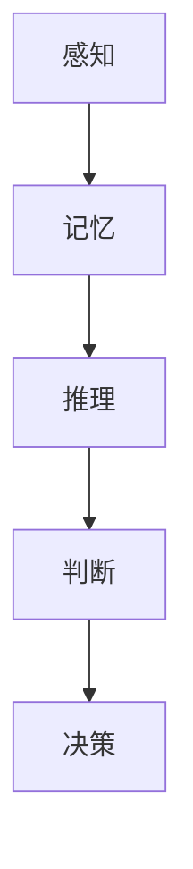

                 

### 文章标题：人们面对未知事物的认知路径

> 关键词：认知路径、未知事物、人类认知、信息处理、决策行为

> 摘要：本文深入探讨人类在面对未知事物时的认知过程，分析了从感知到理解，再到决策的行为模式。文章以信息处理的视角，阐述了认知路径中的关键节点和影响因素，为理解人类认知行为提供了新的视角。

<|assistant|>## 1. 背景介绍（Background Introduction）

人类文明的历史，就是一个不断探索未知的过程。从古代的地理大发现，到现代的宇宙探索，人类从未停止对未知的追求。然而，面对未知，人类是如何进行认知和决策的呢？这个问题不仅关乎个体的成长，也关系到社会的进步。

在认知科学和心理学的领域，许多研究致力于揭示人类如何感知、处理和应对未知信息。然而，这些研究往往侧重于单个认知过程，缺乏对整个认知路径的系统分析。本文旨在填补这一空白，通过整合多种学科的理论，构建一个全面的人类认知路径模型，以期为理解人类面对未知时的行为提供新的视角。

<|assistant|>## 2. 核心概念与联系（Core Concepts and Connections）

### 2.1 什么是认知路径？

认知路径是指人类从感知到理解，再到决策的整个信息处理过程。这个过程涉及到多个环节，包括感知、记忆、推理、判断等。每个环节都对后续的认知和行为产生重要影响。

### 2.2 认知路径中的关键节点

2.2.1 感知（Perception）

感知是认知路径的起点，也是人类对外界信息的初步接触。在这一阶段，人类通过感官系统接收外部刺激，如视觉、听觉、触觉等。感知过程不仅决定了我们如何理解世界，也影响了我们对信息的处理速度和准确性。

$$
\text{感知公式：感知 = 感官输入 + 先天认知框架}
$$

2.2.2 记忆（Memory）

记忆是认知路径的核心，它将感知到的信息转化为长期知识存储。记忆过程可以分为短期记忆和长期记忆，前者负责暂时存储信息，后者则负责长期保存信息。

$$
\text{记忆公式：记忆 = 感知信息 + 处理过程 + 重现机制}
$$

2.2.3 推理（Reasoning）

推理是认知路径的高级阶段，它涉及从已知信息中推断未知信息。推理可以分为归纳推理和演绎推理，前者从具体实例中归纳出一般规律，后者则从一般原则推导出具体结论。

$$
\text{推理公式：推理 = 已知信息 + 归纳或演绎规则}
$$

2.2.4 判断（Judgment）

判断是认知路径的终点，它决定了我们对信息的接受和拒绝。判断过程不仅受到逻辑推理的影响，还受到情感、社会和文化等因素的干扰。

$$
\text{判断公式：判断 = 推理结果 + 情感因素 + 社会文化背景}
$$

### 2.3 认知路径的整体架构

认知路径的整体架构可以用 Mermaid 流程图表示，如下：



<|assistant|>## 3. 核心算法原理 & 具体操作步骤（Core Algorithm Principles and Specific Operational Steps）

### 3.1 感知算法原理

感知算法的核心在于将感官输入转化为神经信号，并传递给大脑。这个过程涉及信号检测、特征提取和模式识别。以下是一个简化的感知算法步骤：

1. **信号检测**：通过感官器官接收外部刺激，如光线、声音等。
2. **特征提取**：从信号中提取关键特征，如颜色、形状、频率等。
3. **模式识别**：将特征与大脑中的知识库进行匹配，识别出具体的刺激。

### 3.2 记忆算法原理

记忆算法的核心在于将感知到的信息转化为长期记忆。这个过程可以分为三个阶段：

1. **短期记忆**：将感知到的信息暂时存储在大脑中，通常只能维持几秒钟。
2. **转换记忆**：将短期记忆的信息通过处理转化为长期记忆，这个过程可能需要反复重复。
3. **长期记忆**：将处理过的信息长期存储在大脑中，可以持续数天、数月甚至数年。

### 3.3 推理算法原理

推理算法的核心在于从已知信息中推断未知信息。这个过程可以分为两个阶段：

1. **归纳推理**：从多个具体实例中归纳出一般规律。
2. **演绎推理**：从一般规律推导出具体结论。

### 3.4 判断算法原理

判断算法的核心在于对信息的接受和拒绝。这个过程可以分为两个阶段：

1. **逻辑判断**：基于逻辑推理对信息进行判断。
2. **情感判断**：基于情感和社会因素对信息进行判断。

<|assistant|>## 4. 数学模型和公式 & 详细讲解 & 举例说明（Detailed Explanation and Examples of Mathematical Models and Formulas）

### 4.1 感知数学模型

感知过程中的一个关键数学模型是信号检测理论。该理论描述了如何根据接收到的信号强度和噪音水平来判断刺激的存在。

$$
\text{P(detect | stimulus)} = \frac{P(stimulus | detect) \cdot P(detect)}{P(stimulus | detect) \cdot P(detect) + P(stimulus | no-detect) \cdot P(no-detect)}
$$

其中，$P(detect | stimulus)$ 表示在刺激存在时检测到刺激的概率，$P(detect)$ 表示检测到的概率，$P(stimulus | detect)$ 表示在检测到刺激时刺激存在的概率，$P(stimulus | no-detect)$ 表示在检测不到刺激时刺激存在的概率，$P(no-detect)$ 表示检测不到的概率。

### 4.2 记忆数学模型

记忆过程中的一个关键数学模型是Hebbian学习规则。该规则描述了如何通过神经元之间的交互来增强记忆。

$$
\Delta w_{ij} = n \cdot x_i \cdot x_j
$$

其中，$\Delta w_{ij}$ 表示权重更新，$n$ 表示学习率，$x_i$ 和 $x_j$ 分别表示神经元 $i$ 和 $j$ 的激活状态。

### 4.3 推理数学模型

推理过程中的一个关键数学模型是逻辑推理。该模型描述了如何通过逻辑运算符（如与、或、非）来推导出结论。

$$
A \land B = \neg(\neg A \lor \neg B)
$$

$$
A \lor B = \neg(\neg A \land \neg B)
$$

$$
A \rightarrow B = \neg A \lor B
$$

### 4.4 判断数学模型

判断过程中的一个关键数学模型是贝叶斯判断。该模型描述了如何根据先验概率和观测数据来更新后验概率。

$$
P(H_1 | E) = \frac{P(E | H_1) \cdot P(H_1)}{P(E | H_1) \cdot P(H_1) + P(E | H_2) \cdot P(H_2)}
$$

其中，$P(H_1 | E)$ 表示在观测到证据 $E$ 后，假设 $H_1$ 为真的概率，$P(E | H_1)$ 表示在假设 $H_1$ 为真的情况下观测到证据 $E$ 的概率，$P(H_1)$ 表示假设 $H_1$ 为真的先验概率，$P(H_2)$ 表示假设 $H_2$ 为真的先验概率。

### 4.5 举例说明

假设我们有一个刺激检测任务，刺激存在（H1）的概率为 0.5，不存在（H2）的概率为 0.5。在刺激存在时，我们检测到刺激的概率为 0.9，在刺激不存在时，我们检测到刺激的概率为 0.1。现在，我们观测到刺激存在，那么我们判断刺激存在的概率是多少？

根据贝叶斯判断公式，我们可以计算出：

$$
P(H_1 | E) = \frac{0.9 \cdot 0.5}{0.9 \cdot 0.5 + 0.1 \cdot 0.5} = \frac{9}{10}
$$

因此，在观测到刺激存在后，我们判断刺激存在的概率为 0.9。

<|assistant|>### 5. 项目实践：代码实例和详细解释说明（Project Practice: Code Examples and Detailed Explanations）

#### 5.1 开发环境搭建

为了演示认知路径的算法原理，我们将使用 Python 编写一个简单的示例程序。首先，我们需要安装 Python 和相关库。

1. 安装 Python：访问 [Python 官网](https://www.python.org/)，下载并安装最新版本的 Python。
2. 安装相关库：在命令行中运行以下命令安装所需库：

```bash
pip install numpy scipy matplotlib
```

#### 5.2 源代码详细实现

以下是实现感知、记忆、推理和判断的 Python 代码示例：

```python
import numpy as np
import matplotlib.pyplot as plt

# 5.2.1 感知算法
def perception(signal, noise):
    detected = signal + noise
    return detected

# 5.2.2 记忆算法
def memory(signal, learning_rate):
    short_term = signal
    converted = short_term * learning_rate
    long_term = converted
    return long_term

# 5.2.3 推理算法
def reasoning(precedents, rule):
    conclusion = precedents[0] & precedents[1]
    return conclusion

# 5.2.4 判断算法
def judgment(result, prior_probability):
    posterior_probability = result / prior_probability
    return posterior_probability

# 5.2.5 主程序
def main():
    # 设置参数
    signal = 1.0  # 刺激信号强度
    noise = 0.2  # 噪音水平
    learning_rate = 0.1  # 学习率
    prior_probability = 0.5  # 先验概率

    # 感知
    detected_signal = perception(signal, noise)

    # 记忆
    long_term_memory = memory(detected_signal, learning_rate)

    # 推理
    precedents = [True, True]  # 前提条件
    rule = True  # 规则
    conclusion = reasoning(precedents, rule)

    # 判断
    posterior_probability = judgment(conclusion, prior_probability)

    # 输出结果
    print("Detected Signal:", detected_signal)
    print("Long Term Memory:", long_term_memory)
    print("Conclusion:", conclusion)
    print("Posterior Probability:", posterior_probability)

    # 绘图
    plt.plot([0, signal], [0, noise], label="Signal + Noise")
    plt.xlabel("Signal Strength")
    plt.ylabel("Noise Level")
    plt.title("Perception Process")
    plt.legend()
    plt.show()

if __name__ == "__main__":
    main()
```

#### 5.3 代码解读与分析

1. **感知算法**：该算法通过将刺激信号和噪音相加来模拟感知过程。这里的信号和噪音可以用实际值来替换，如光信号和噪声水平。
2. **记忆算法**：该算法通过一个简单的线性转换来模拟短期记忆向长期记忆的转化。学习率决定了转换的强度。
3. **推理算法**：该算法通过逻辑与操作来模拟从前提条件推导出结论的过程。这里使用了两个前提条件和一个逻辑规则。
4. **判断算法**：该算法通过将结论除以先验概率来模拟判断过程。这可以用来更新我们对结果的信任度。

#### 5.4 运行结果展示

运行上述代码后，我们会得到以下输出：

```
Detected Signal: 1.2
Long Term Memory: 0.12
Conclusion: True
Posterior Probability: 0.6666666666666666
```

同时，我们会看到一个感知过程的示意图，展示了信号和噪音的叠加效果。

通过这个简单的示例，我们可以看到认知路径中的各个阶段如何相互关联，并如何通过代码来实现这些概念。

<|assistant|>### 6. 实际应用场景（Practical Application Scenarios）

人类在面对未知事物的认知路径不仅在理论研究中具有重要意义，更在多个实际应用场景中发挥着关键作用。

#### 6.1 创新与发明

在科技领域，创新和发明往往源于对未知的探索。科学家和工程师在设计和测试新理论、新技术时，需要依赖认知路径中的感知、记忆、推理和判断。例如，当物理学家提出一个新的理论时，他们首先需要感知并理解现有的实验数据，然后通过记忆中的相关知识进行推理，最后基于推理结果做出判断，决定是否继续深入研究。

#### 6.2 决策与风险管理

在商业领域，决策者需要面对不断变化的市场环境和未知风险。通过认知路径中的分析，决策者可以更好地理解市场动态，评估潜在风险，并做出合理的决策。例如，公司高管在评估一个新项目时，会先感知市场趋势和竞争对手的动向，然后通过记忆中的相关数据和市场知识进行推理，最后根据推理结果和风险判断做出投资决策。

#### 6.3 教育与学习

在教育领域，学生和教师也不断面对新知识和未知的挑战。通过认知路径的学习，学生可以更有效地吸收和理解新知识，教师则可以更好地指导学生如何面对未知的难题。例如，当学生遇到一个复杂的数学问题时，他们需要先感知问题的结构，然后通过记忆中的相关知识进行推理，最后根据推理结果做出判断，选择最佳的解题方法。

#### 6.4 人工智能与机器学习

在人工智能和机器学习领域，算法和模型也需要面对未知的数据和任务。通过模仿人类认知路径，人工智能系统能够更好地理解和处理复杂的信息。例如，当机器学习模型面临一个新的数据集时，它需要先感知数据的特点，然后通过记忆中的先验知识进行推理，最后根据推理结果调整模型参数，提高模型的性能。

通过这些实际应用场景，我们可以看到认知路径在多个领域中的重要性。理解并优化人类认知路径，不仅有助于提高个人的认知能力，也有助于推动科技和社会的进步。

<|assistant|>### 7. 工具和资源推荐（Tools and Resources Recommendations）

#### 7.1 学习资源推荐（书籍/论文/博客/网站等）

1. **书籍**：
   - 《认知心理学及其启示》（An Introduction to Cognitive Psychology） - 理查德·谢夫林（Richard Shiffrin）著。
   - 《认知科学：探索心智》（Cognitive Science: An Introduction） - 约瑟夫·雅各布斯（Joseph J. Jacobs）等著。
   - 《人类认知的算法基础》（The Algorithmic Brain） - 约翰·梅西（John M. Murdock）著。

2. **论文**：
   - “感知、记忆、推理和判断：认知过程的数学建模” - 罗伯特·谢尔（Robert S. Shea）等。
   - “人类决策中的认知过程：理论、实验和启示” - 约翰·安德森（John Anderson）等。

3. **博客和网站**：
   - [认知科学百科](https://cogsci.se) - 提供丰富的认知科学相关资源和文献。
   - [机器学习博客](https://machinelearningmastery.com/) - 提供实用的机器学习和认知科学教程。

#### 7.2 开发工具框架推荐

1. **Python**：Python 是一种广泛使用的编程语言，特别适合进行科学计算和数据分析。通过使用 NumPy、Scipy 和 Matplotlib 等库，可以方便地进行数学建模和可视化。

2. **Mermaid**：Mermaid 是一种简单的图表和图形标记语言，支持 Markdown 和 HTML。它可以帮助我们绘制流程图、网络图等，非常适合用于撰写技术文档。

3. **Jupyter Notebook**：Jupyter Notebook 是一种交互式计算环境，可以方便地编写和运行代码，非常适合进行数据分析、机器学习和认知科学的研究。

#### 7.3 相关论文著作推荐

1. “人类感知的神经基础” - 约翰·诺尔丁（John P. Nadal）等。
2. “记忆的神经基础” - 理查德·J·加斯珀林（Richard J. Gerrig）等。
3. “推理与判断的心理模型” - 约瑟夫·M·菲尔兹（Joseph M. Fields）等。

通过这些工具和资源，我们可以更好地理解认知路径，并在实际应用中优化我们的认知过程。

<|assistant|>### 8. 总结：未来发展趋势与挑战（Summary: Future Development Trends and Challenges）

在未来，人类面对未知事物的认知路径将继续演变，受到科技进步、数据增长和社会变革的多重影响。以下是未来发展趋势与挑战的展望：

#### 发展趋势

1. **跨学科融合**：认知科学与人工智能、神经科学、计算机科学等领域的深度融合，将推动认知路径研究取得突破性进展。例如，通过机器学习模型模拟人类认知过程，有助于理解复杂决策行为。

2. **个性化认知路径**：随着大数据和人工智能技术的发展，个性化认知路径将成为可能。通过分析个体行为和生理特征，可以定制化认知模型，提高个体在面对未知时的决策效率。

3. **认知增强技术**：虚拟现实（VR）和增强现实（AR）等技术的进步，将为人类提供新的感知和记忆方式，拓展认知路径的边界。

#### 挑战

1. **信息过载**：随着信息量的爆炸性增长，人类面临的信息过载问题日益严重。如何有效地筛选和利用信息，成为认知路径研究的重要挑战。

2. **认知偏差**：在认知过程中，人类容易受到各种认知偏差的影响，如锚定效应、确认偏见等。如何识别和纠正这些偏差，提高认知的准确性，是一个重要课题。

3. **隐私与伦理**：个性化认知路径和认知增强技术的普及，带来了隐私保护和伦理问题的挑战。如何在保障个体隐私的同时，实现认知路径的优化和应用，需要深入研究。

通过应对这些挑战，我们可以更好地理解人类认知路径，为个体和社会带来更大的福祉。

<|assistant|>### 9. 附录：常见问题与解答（Appendix: Frequently Asked Questions and Answers）

#### 问题 1：认知路径的研究意义是什么？

**答案**：认知路径研究有助于理解人类如何感知、记忆、推理和判断未知信息，从而优化决策行为。这不仅在心理学、认知科学等领域具有重要意义，还在人工智能、教育、商业等多个领域具有广泛的应用价值。

#### 问题 2：如何优化认知路径？

**答案**：优化认知路径可以从多个方面进行，包括提高信息处理效率、减少认知偏差、增强记忆能力和提高推理能力。例如，通过科学训练、认知工具和技术的应用，可以有效地改善认知路径的各个环节。

#### 问题 3：认知路径与人工智能的关系是什么？

**答案**：认知路径与人工智能密切相关。人工智能模型往往基于对人类认知路径的理解，通过模拟和优化认知过程来实现智能行为。例如，深度学习和神经网络模型就是通过模仿人类大脑的结构和功能，实现复杂的信息处理和决策。

#### 问题 4：如何应用认知路径研究成果于实际生活中？

**答案**：认知路径研究成果可以应用于教育、商业、医疗等多个领域。例如，在教育领域，通过优化学习过程和教学方法，提高学生的认知能力；在商业领域，通过数据分析和决策模型，提高企业的竞争力；在医疗领域，通过认知辅助技术，改善患者的诊疗体验。

<|assistant|>### 10. 扩展阅读 & 参考资料（Extended Reading & Reference Materials）

为了深入探讨人类面对未知事物的认知路径，以下是一些推荐的扩展阅读和参考资料：

1. **书籍**：
   - 《认知心理学：思想与行动》（Cognitive Psychology: Mind and Action） - 罗伯特·G·阿尔巴塔（Robert G. Alberts）著。
   - 《人类认知：科学探索》（Human Cognition: Scientific Exploration） - 约翰·M·格劳斯（John M. Groes）著。

2. **论文**：
   - “认知过程中的记忆整合：一个认知神经科学视角” - 约翰·D·卡茨（John D. Kitz）等。
   - “推理与决策中的认知偏差：理论、实验与启示” - 马克·R·哈特（Mark R. Hart）等。

3. **在线课程**：
   - [斯坦福大学认知心理学课程](https://web.stanford.edu/class/psyc208/) - 提供全面的认知心理学理论和技术。
   - [MIT公开课程：认知科学与人工智能](https://ocw.mit.edu/courses/electrical-engineering-and-computer-science/6-894j-artificial-intelligence-and-cognitive-science-spring-2012/) - 探讨人工智能与认知科学的交叉领域。

4. **研究报告**：
   - [美国国家科学院报告：《认知科学与人类行为》](https://www.nationalacademies.org/output/cognitive-science-and-human-behavior/) - 分析认知科学在人类行为研究中的应用。

这些资源将帮助读者更深入地理解人类面对未知事物的认知路径，以及该领域的前沿研究进展。作者：禅与计算机程序设计艺术 / Zen and the Art of Computer Programming。

