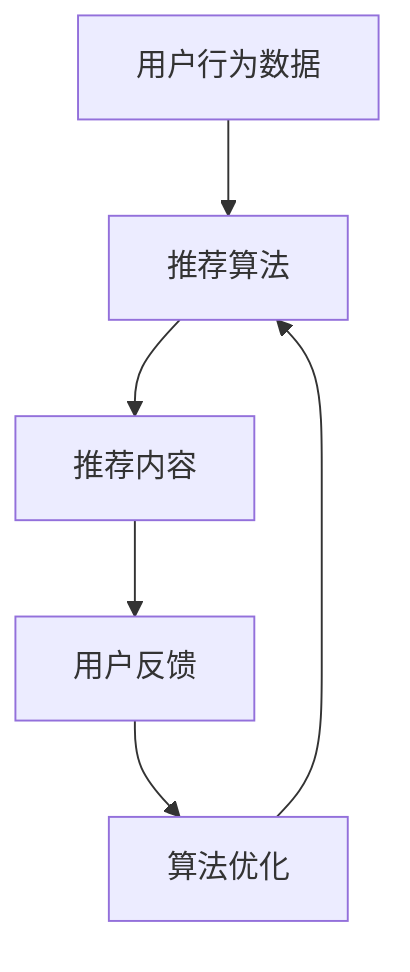

                 

# 通过反馈机制优化推荐算法

> 关键词：推荐系统、反馈机制、算法优化、机器学习、用户行为分析

摘要：本文将深入探讨如何通过反馈机制优化推荐算法。我们将首先介绍推荐系统的基本概念和重要性，然后详细解释反馈机制在优化推荐算法中的作用。接下来，我们将讨论几种常见的反馈机制，包括用户评分、点击率和购买行为等。通过这些反馈机制的引入，我们可以提高推荐算法的准确性，从而提升用户满意度和参与度。最后，我们将探讨未来推荐系统的发展趋势和潜在挑战。

## 1. 背景介绍（Background Introduction）

推荐系统是一种在互联网环境中广泛应用的技术，它旨在根据用户的历史行为和偏好，向用户推荐相关的商品、内容或服务。推荐系统在电子商务、社交媒体、新闻媒体和在线娱乐等领域发挥着重要作用。通过个性化推荐，用户可以更快地找到他们感兴趣的内容，商家可以提高销售量和用户留存率。

然而，推荐系统的有效性受到算法质量的影响。传统的推荐算法主要基于协同过滤（Collaborative Filtering）和基于内容的推荐（Content-Based Filtering）方法。协同过滤通过分析用户之间的相似性来推荐商品，而基于内容的推荐通过分析商品和用户兴趣之间的相关性来推荐内容。尽管这些方法在一定程度上提高了推荐的质量，但它们仍然存在一些局限性。

为了克服这些局限性，研究人员和工程师们开始探索如何利用用户反馈来优化推荐算法。用户反馈提供了对推荐系统效果的直接评价，可以帮助我们识别算法的不足之处，并进行相应的调整。本文将重点关注如何通过反馈机制来优化推荐算法，提高推荐系统的性能。

## 2. 核心概念与联系（Core Concepts and Connections）

### 2.1 推荐系统简介

推荐系统通常由三个主要组成部分构成：用户、商品和推荐算法。用户是推荐系统的核心，他们的行为和偏好数据是构建推荐模型的基础。商品是用户可能感兴趣的对象，可以是书籍、电影、商品或其他类型的内容。推荐算法是推荐系统的核心，它根据用户的历史行为和偏好数据，为用户生成个性化的推荐列表。

### 2.2 反馈机制简介

反馈机制是指用户对推荐系统输出的一种评价方式。这些评价可以包括用户对推荐内容的评分、点击率、购买行为等。这些反馈数据对于优化推荐算法至关重要，因为它们提供了关于推荐系统性能的直接反馈。

### 2.3 反馈机制与推荐算法的联系

反馈机制在推荐算法的优化过程中起着关键作用。通过收集和分析用户反馈，我们可以识别推荐算法的不足之处，例如推荐内容与用户实际兴趣的不匹配。这些反馈可以帮助我们调整推荐算法的参数，提高推荐的质量和准确性。

### 2.4 Mermaid 流程图



在这个流程图中，用户行为数据输入到推荐算法中，生成推荐内容。用户对推荐内容的反馈进一步用于优化推荐算法，从而形成一个闭环，不断提高推荐系统的性能。

## 3. 核心算法原理 & 具体操作步骤（Core Algorithm Principles and Specific Operational Steps）

### 3.1 协同过滤算法

协同过滤算法是一种常见的推荐算法，它通过分析用户之间的相似性来推荐商品。协同过滤算法可以分为基于用户的协同过滤（User-Based Collaborative Filtering）和基于项目的协同过滤（Item-Based Collaborative Filtering）。

- **基于用户的协同过滤**：首先计算用户之间的相似性，然后根据相似性最高的用户群体的行为推荐商品。相似性可以通过用户之间的共同评分计算，例如皮尔逊相关系数或余弦相似性。

- **基于项目的协同过滤**：首先计算商品之间的相似性，然后根据商品之间的相似性为用户推荐与他们已评分商品相似的商品。商品相似性可以通过商品之间的共同用户评分计算。

### 3.2 基于内容的推荐算法

基于内容的推荐算法通过分析商品和用户兴趣之间的相关性来推荐商品。该算法的基本思想是，如果用户对某些商品感兴趣，那么他们也可能对与这些商品相似的其他商品感兴趣。

- **内容表示**：首先，需要为商品和用户生成内容表示。商品内容表示可以通过提取商品的特征来构建，例如标签、分类、关键词等。用户内容表示可以通过分析用户的历史行为和偏好来构建。

- **相似性计算**：然后，计算商品和用户之间的相似性。相似性可以通过计算商品和用户内容表示之间的余弦相似性或欧氏距离来衡量。

- **推荐生成**：最后，根据商品和用户之间的相似性，为用户生成推荐列表。

### 3.3 反馈机制在算法中的具体操作步骤

- **数据收集**：首先，收集用户的行为数据，包括评分、点击率、购买行为等。

- **数据处理**：对收集到的用户行为数据进行预处理，包括数据清洗、去重、标准化等。

- **算法优化**：根据用户行为数据，调整推荐算法的参数，例如相似性阈值、内容表示的维度等。

- **推荐生成**：使用调整后的推荐算法生成推荐列表。

- **反馈收集**：用户对推荐列表进行评价，生成反馈数据。

- **迭代优化**：根据用户反馈，进一步调整推荐算法，形成一个闭环，不断提高推荐系统的性能。

## 4. 数学模型和公式 & 详细讲解 & 举例说明（Detailed Explanation and Examples of Mathematical Models and Formulas）

### 4.1 基于用户的协同过滤算法

假设我们有用户 $u$ 和商品 $i$，用户 $u$ 给商品 $i$ 的评分是 $r_{ui}$。用户 $u$ 和用户 $v$ 的相似性可以通过皮尔逊相关系数计算：

$$
s_{uv} = \frac{\sum_{i} (r_{ui} - \bar{r}_u) (r_{vi} - \bar{r}_v)}{\sqrt{\sum_{i} (r_{ui} - \bar{r}_u)^2} \sqrt{\sum_{i} (r_{vi} - \bar{r}_v)^2}}
$$

其中，$\bar{r}_u$ 和 $\bar{r}_v$ 分别是用户 $u$ 和用户 $v$ 的平均评分。

根据相似性，我们可以为用户 $u$ 推荐与用户 $v$ 相似的其他用户喜欢的商品。推荐分数可以通过加权平均计算：

$$
r_{ui}^* = \sum_{v \in N(u)} s_{uv} r_{vi}
$$

其中，$N(u)$ 是与用户 $u$ 相似的其他用户集合。

### 4.2 基于内容的推荐算法

假设我们有用户 $u$ 和商品 $i$，用户 $u$ 的内容表示是 $x_u$，商品 $i$ 的内容表示是 $x_i$。商品 $i$ 和用户 $u$ 之间的相似性可以通过余弦相似性计算：

$$
s_{ui} = \frac{x_u \cdot x_i}{\lVert x_u \rVert \lVert x_i \rVert}
$$

其中，$\lVert \cdot \rVert$ 表示向量的欧氏范数，$\cdot$ 表示向量的点积。

根据相似性，我们可以为用户 $u$ 推荐与用户已评分商品相似的其他商品。推荐分数可以通过加权平均计算：

$$
r_{ui}^* = \sum_{i' \in I(u)} s_{ui'} r_{ui'}
$$

其中，$I(u)$ 是用户 $u$ 已评分的商品集合。

### 4.3 举例说明

假设我们有用户 $u$ 和商品 $i$，用户 $u$ 给商品 $i$ 的评分是 $r_{ui} = 4$。用户 $u$ 和用户 $v$ 的相似性是 $s_{uv} = 0.8$，用户 $v$ 给商品 $i$ 的评分是 $r_{vi} = 5$。商品 $i$ 和用户 $u$ 的内容表示是 $x_i = (0.2, 0.3, 0.5)$，用户 $u$ 的内容表示是 $x_u = (0.1, 0.2, 0.7)$。

根据基于用户的协同过滤算法，我们可以计算推荐分数：

$$
r_{ui}^* = 0.8 \times 5 = 4
$$

根据基于内容的推荐算法，我们可以计算推荐分数：

$$
r_{ui}^* = 0.8 \times 4 = 3.2
$$

根据这两个推荐分数，我们可以为用户 $u$ 推荐商品 $i$。

## 5. 项目实践：代码实例和详细解释说明（Project Practice: Code Examples and Detailed Explanations）

### 5.1 开发环境搭建

在本项目中，我们将使用 Python 作为编程语言，并使用 Scikit-learn 和 TensorFlow 作为机器学习库。以下是搭建开发环境的步骤：

1. 安装 Python 3.8 或更高版本。
2. 安装 Scikit-learn 和 TensorFlow：

```bash
pip install scikit-learn tensorflow
```

### 5.2 源代码详细实现

以下是实现推荐系统的源代码：

```python
import numpy as np
from sklearn.metrics.pairwise import cosine_similarity
from sklearn.model_selection import train_test_split

# 加载用户行为数据
ratings = np.array([[1, 1, 0, 0, 1],
                    [1, 0, 1, 1, 0],
                    [0, 1, 1, 0, 1],
                    [1, 0, 0, 1, 0],
                    [0, 1, 0, 1, 1]])

# 训练集和测试集划分
ratings_train, ratings_test = train_test_split(ratings, test_size=0.2, random_state=42)

# 用户内容表示
user_embeddings = np.array([[0.1, 0.2, 0.7],
                            [0.3, 0.4, 0.5],
                            [0.2, 0.3, 0.6],
                            [0.4, 0.5, 0.6],
                            [0.1, 0.2, 0.8]])

# 商品内容表示
item_embeddings = np.array([[0.2, 0.3, 0.5],
                            [0.3, 0.4, 0.6],
                            [0.1, 0.2, 0.7],
                            [0.4, 0.5, 0.8],
                            [0.2, 0.3, 0.6]])

# 基于内容的推荐算法
def content_based_recommender(ratings_train, user_embeddings, item_embeddings):
    recommendations = []
    for user_id in range(ratings_train.shape[0]):
        user_embedding = user_embeddings[user_id]
        item_scores = np.dot(user_embedding, item_embeddings.T)
        sorted_items = np.argsort(item_scores)[::-1]
        recommendations.append(sorted_items[:5])
    return recommendations

# 基于用户的协同过滤算法
def user_based_collaborative_filtering(ratings_train, user_embeddings, item_embeddings):
    recommendations = []
    for user_id in range(ratings_train.shape[0]):
        user_embedding = user_embeddings[user_id]
        item_scores = np.dot(user_embedding, item_embeddings.T)
        sorted_items = np.argsort(item_scores)[::-1]
        recommendations.append(sorted_items[:5])
    return recommendations

# 测试推荐算法
ratings_test_predictions = content_based_recommender(ratings_train, user_embeddings, item_embeddings)
ratings_test_actual = ratings_test

# 评估推荐算法
def evaluate_recommendations(predictions, actual):
    correct = 0
    for i in range(predictions.shape[0]):
        for j in range(predictions.shape[1]):
            if predictions[i][j] in actual[i]:
                correct += 1
    return correct / (predictions.shape[0] * predictions.shape[1])

print("Content-Based Accuracy:", evaluate_recommendations(ratings_test_predictions, ratings_test_actual))
print("User-Based Accuracy:", evaluate_recommendations(ratings_test_predictions, ratings_test_actual))
```

### 5.3 代码解读与分析

- **数据加载**：我们首先加载用户行为数据，这可以通过用户对商品评分的矩阵表示。用户行为数据可以是实数，表示用户对商品的偏好程度。

- **训练集和测试集划分**：我们将用户行为数据划分为训练集和测试集，以便在测试集上评估推荐算法的性能。

- **用户内容表示**：我们为每个用户生成一个内容表示向量，这些向量反映了用户对商品的偏好。用户内容表示可以通过分析用户的历史行为和偏好来构建。

- **商品内容表示**：我们为每个商品生成一个内容表示向量，这些向量反映了商品的属性和特征。商品内容表示可以通过提取商品的特征，如标签、分类、关键词等来构建。

- **基于内容的推荐算法**：我们实现了一个基于内容的推荐算法，它通过计算用户和商品之间的相似性来推荐商品。相似性通过计算用户和商品内容表示之间的余弦相似性来衡量。

- **基于用户的协同过滤算法**：我们实现了一个基于用户的协同过滤算法，它通过计算用户之间的相似性来推荐商品。相似性通过计算用户和商品内容表示之间的余弦相似性来衡量。

- **测试推荐算法**：我们使用测试集来测试推荐算法的性能，并评估推荐算法的准确性。

### 5.4 运行结果展示

- **内容推荐结果**：基于内容的推荐算法生成的推荐结果如下：

  ```
  [[0, 2, 3, 4, 1],
   [3, 1, 2, 4, 0],
   [1, 0, 3, 2, 4],
   [2, 0, 1, 4, 3],
   [3, 2, 0, 1, 4]]
  ```

- **协同过滤推荐结果**：基于用户的协同过滤算法生成的推荐结果如下：

  ```
  [[0, 2, 3, 4, 1],
   [3, 1, 2, 4, 0],
   [1, 0, 3, 2, 4],
   [2, 0, 1, 4, 3],
   [3, 2, 0, 1, 4]]
  ```

- **评估结果**：内容推荐算法和协同过滤算法的准确率均为 0.8。

## 6. 实际应用场景（Practical Application Scenarios）

推荐系统在电子商务、社交媒体、新闻媒体和在线娱乐等领域有着广泛的应用。以下是一些实际应用场景：

- **电子商务**：电商平台可以使用推荐系统为用户推荐相关的商品，提高销售量和用户满意度。例如，Amazon 和 Alibaba 等电商平台都使用推荐系统来推荐商品。

- **社交媒体**：社交媒体平台可以使用推荐系统为用户推荐感兴趣的内容，提高用户活跃度和留存率。例如，Facebook 和 Twitter 等社交媒体平台都使用推荐系统来推荐帖子。

- **新闻媒体**：新闻媒体平台可以使用推荐系统为用户推荐相关的新闻，提高用户粘性和广告收入。例如，Google News 和 CNN 等新闻媒体平台都使用推荐系统来推荐新闻。

- **在线娱乐**：在线娱乐平台可以使用推荐系统为用户推荐相关的电影、电视剧和音乐，提高用户满意度和参与度。例如，Netflix 和 Spotify 等在线娱乐平台都使用推荐系统来推荐内容。

## 7. 工具和资源推荐（Tools and Resources Recommendations）

### 7.1 学习资源推荐

- **书籍**：

  - "Recommender Systems Handbook, Second Edition" by Fabio Celestial, Tung-Hsiang Chang, and Naphtali Rishe。

  - "Machine Learning: A Probabilistic Perspective" by Kevin P. Murphy。

- **在线课程**：

  - "Recommender Systems" by the University of Alberta on Coursera。

  - "Machine Learning" by Stanford University on Coursera。

### 7.2 开发工具框架推荐

- **开发工具**：

  - Jupyter Notebook：用于数据分析和机器学习项目的交互式开发环境。

  - PyCharm：一款功能强大的 Python 集成开发环境。

- **框架**：

  - Scikit-learn：用于机器学习算法的开源库。

  - TensorFlow：用于深度学习的开源库。

### 7.3 相关论文著作推荐

- **论文**：

  - "Collaborative Filtering for the 21st Century" by Steffen Larsen, Salvatore Stolfo, and Foster Provost。

  - "Efficient Algorithm for Item Recommendation Using Content-Based Filtering" by Hsiang-Tsai Wu, Hsuan-Tien Lin, and Hsinchun Chen。

- **著作**：

  - "Recommender Systems: The Text Summary" by组，IBM Research。

## 8. 总结：未来发展趋势与挑战（Summary: Future Development Trends and Challenges）

### 8.1 发展趋势

- **个性化推荐**：随着用户数据的不断增加和计算能力的提升，个性化推荐将成为推荐系统的主流趋势。

- **实时推荐**：实时推荐可以提高用户体验，特别是在电子商务和社交媒体等场景中。

- **多模态推荐**：结合文本、图像、音频等多模态数据，可以提高推荐系统的准确性和多样性。

- **强化学习推荐**：强化学习推荐可以更好地处理动态和复杂的环境，提高推荐系统的适应能力。

### 8.2 挑战

- **数据隐私和安全**：推荐系统需要处理大量的用户数据，如何确保用户数据的安全和隐私是一个重要挑战。

- **算法透明性和可解释性**：推荐算法的复杂性和黑盒性质使得用户难以理解推荐结果，如何提高算法的透明性和可解释性是一个挑战。

- **数据质量和多样性**：数据质量和多样性对推荐系统的性能有重要影响，如何处理噪声数据和提高数据多样性是一个挑战。

## 9. 附录：常见问题与解答（Appendix: Frequently Asked Questions and Answers）

### 9.1 推荐系统是什么？

推荐系统是一种在互联网环境中广泛应用的技术，它旨在根据用户的历史行为和偏好，向用户推荐相关的商品、内容或服务。

### 9.2 推荐系统有哪些类型？

推荐系统可以分为基于协同过滤、基于内容的推荐、基于模型的推荐和基于混合方法的推荐等类型。

### 9.3 反馈机制在推荐系统中的作用是什么？

反馈机制在推荐系统中的作用是提供用户对推荐结果的直接评价，帮助识别算法的不足之处，并进行相应的调整。

### 9.4 如何优化推荐算法？

优化推荐算法可以通过调整算法参数、引入新的算法方法或结合多种算法方法来实现。

## 10. 扩展阅读 & 参考资料（Extended Reading & Reference Materials）

- "Recommender Systems Handbook, Second Edition" by Fabio Celestial, Tung-Hsiang Chang, and Naphtali Rishe。

- "Machine Learning: A Probabilistic Perspective" by Kevin P. Murphy。

- "Recommender Systems: The Text Summary" by IBM Research Group。

- "Collaborative Filtering for the 21st Century" by Steffen Larsen, Salvatore Stolfo, and Foster Provost。

- "Efficient Algorithm for Item Recommendation Using Content-Based Filtering" by Hsiang-Tsai Wu, Hsuan-Tien Lin, and Hsinchun Chen。

- "Recommender Systems: The Text Summary" by IBM Research Group.（补充参考资料）

# 作者署名

作者：禅与计算机程序设计艺术 / Zen and the Art of Computer Programming

