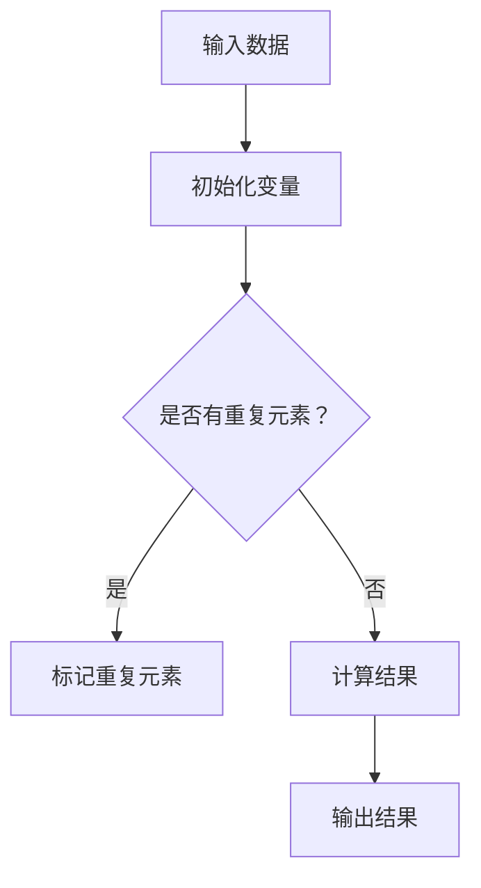
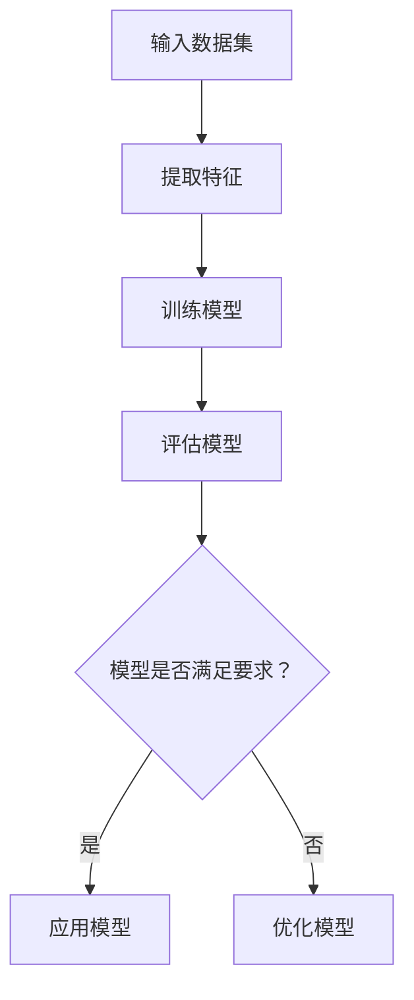
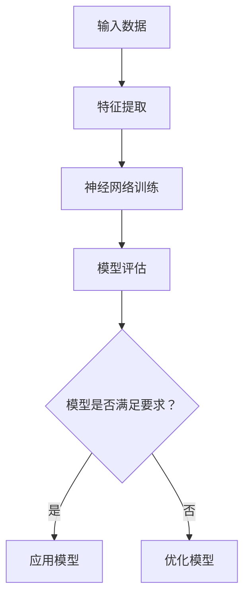

                 

### 文章标题

**释放人类创造力的源泉：人类计算的魅力**

关键词：人类计算、创造力、算法、编程、人工智能

摘要：本文旨在探讨人类计算的力量和魅力，以及它如何激发人类的创造力。通过深入分析人类计算的核心概念、算法原理、数学模型以及实际应用场景，我们将揭示人类计算在推动科技创新和社会进步中的重要作用。本文还将介绍相关工具和资源，帮助读者更好地理解和掌握人类计算技术。

## 1. 背景介绍（Background Introduction）

人类计算（Human Computing）是指人类利用逻辑、推理、算法等手段解决问题的过程。自古以来，人类一直在通过各种方式利用计算能力，从简单的算术运算到复杂的科学研究和工程设计。随着计算机科学的兴起，人类计算得到了极大的发展和应用，成为现代科技和社会进步的重要驱动力。

在计算机科学中，算法（Algorithm）是一系列解决问题的步骤或规则。算法的效率和正确性对于计算机性能和问题解决的效率至关重要。随着人工智能（Artificial Intelligence，AI）技术的快速发展，算法在自动化决策、模式识别、自然语言处理等领域发挥着越来越重要的作用。

本文将探讨人类计算的核心概念、算法原理、数学模型以及实际应用场景，旨在帮助读者了解人类计算的魅力，并激发其在科技创新和社会进步中的潜力。

### 1.1 人类计算的历史与发展

人类计算的历史可以追溯到古代，当时人们使用简单的算术工具和计算器进行计算。随着数学和逻辑学的发展，人类开始探索更复杂的算法和计算方法。例如，古希腊数学家欧几里得（Euclid）提出了著名的欧几里得算法，用于求解最大公约数。中世纪的阿拉伯学者在数学和算法领域也做出了重要贡献，如阿尔·哈里德（Al-Khwarizmi）所著的《代数学》（Algebra），为现代算法奠定了基础。

19世纪末至20世纪初，随着电气化和计算机科学的兴起，人类计算进入了新的阶段。美国数学家约翰·冯·诺依曼（John von Neumann）提出了现代计算机的基本架构，包括存储程序计算机和二进制计算。这一时期，计算机科学和算法研究取得了飞速进展，为人类计算提供了强大的工具。

20世纪末至21世纪初，互联网的普及和人工智能的兴起进一步推动了人类计算的发展。人工智能算法，如深度学习、神经网络和强化学习，使计算机能够解决更复杂的问题，并在图像识别、自然语言处理、自动驾驶等领域取得了显著成果。

### 1.2 计算机科学与算法的紧密关系

计算机科学（Computer Science）是研究计算机系统的理论、设计、应用和算法的学科。算法是计算机科学的核心内容，它决定了计算机解决各种问题的高效性和可靠性。计算机科学不仅关注算法的理论研究，还包括算法的实际应用，如软件开发、数据分析、人工智能和机器学习。

计算机科学家通过设计高效的算法来解决实际问题，从而推动了计算机技术的发展。例如，数据库管理系统使用复杂的算法来优化数据存储和检索效率，搜索引擎利用算法来索引和检索大量网页，推荐系统通过算法分析用户行为来推荐相关内容。

### 1.3 人类计算与人工智能

人工智能（Artificial Intelligence，AI）是计算机科学的一个分支，旨在使计算机具有人类智能的特征，如学习、推理、感知和决策能力。人工智能的发展依赖于算法和计算技术的进步，特别是机器学习和深度学习算法。

机器学习（Machine Learning）是一种让计算机从数据中自动学习规律和模式的方法。通过训练大量数据集，机器学习算法能够识别复杂的模式，从而实现自动分类、预测和决策。深度学习（Deep Learning）是机器学习的一个子领域，它利用多层神经网络来模拟人类大脑的神经网络结构，从而实现更高效的学习和推理。

人工智能在计算机视觉、自然语言处理、自动驾驶、医疗诊断等领域取得了显著成果。例如，深度学习算法在图像识别和分类方面表现出了极高的准确率，而自然语言处理算法则使计算机能够理解和生成自然语言。

### 1.4 人类计算的魅力

人类计算的魅力在于它能够激发人类的创造力和解决问题的能力。通过设计算法和编写程序，人类可以解决各种复杂的问题，从科学研究和工程设计到商业运营和日常生活。人类计算不仅提高了工作效率，还推动了科技创新和社会进步。

人类计算的魅力还体现在它所带来的变革性影响。例如，计算机科学的发展使互联网和移动通信成为可能，改变了人们的沟通和生活方式。人工智能的进步则为自动化、智能化和个性化服务提供了新的可能性，为人类带来了前所未有的便利和创新。

### 1.5 本文结构

本文将按照以下结构进行讨论：

1. **背景介绍**：回顾人类计算的历史与发展，以及计算机科学与算法的紧密关系。
2. **核心概念与联系**：介绍人类计算的核心概念，包括算法、机器学习、人工智能等，并给出 Mermaid 流程图。
3. **核心算法原理 & 具体操作步骤**：详细讲解核心算法的原理，包括输入、输出、步骤和逻辑。
4. **数学模型和公式 & 详细讲解 & 举例说明**：介绍数学模型和公式，并进行详细讲解和举例说明。
5. **项目实践：代码实例和详细解释说明**：提供代码实例，并进行详细解读和分析。
6. **实际应用场景**：探讨人类计算在各个领域的应用，如人工智能、图像处理、数据分析等。
7. **工具和资源推荐**：推荐学习资源、开发工具和框架。
8. **总结：未来发展趋势与挑战**：总结人类计算的发展趋势和面临的挑战。
9. **附录：常见问题与解答**：回答读者可能关心的问题。
10. **扩展阅读 & 参考资料**：提供扩展阅读材料和参考资料。

通过本文的探讨，我们希望读者能够更好地理解人类计算的魅力和重要性，并在实际应用中发挥其潜力。

---

## 2. 核心概念与联系

为了深入探讨人类计算的魅力，我们需要首先理解其核心概念和原理。在本章节中，我们将介绍以下核心概念：

### 2.1 算法

算法（Algorithm）是解决问题的步骤或规则，它指导计算机如何执行特定的任务。算法可以看作是一系列有序的指令，用于解决特定的问题。

**核心概念：**

- **输入**：算法的输入是指算法开始时接收的数据或问题。
- **输出**：算法的输出是指算法执行完毕后得到的结果。
- **步骤**：算法的步骤是指解决问题的具体操作，通常包括判断、计算和操作等。
- **逻辑**：算法的逻辑是指解决问题的流程和决策过程。

**Mermaid 流程图：**



### 2.2 机器学习

机器学习（Machine Learning）是一种让计算机从数据中自动学习规律和模式的方法。通过训练大量数据集，机器学习算法能够识别复杂的模式，从而实现自动分类、预测和决策。

**核心概念：**

- **数据集**：数据集是指用于训练和测试机器学习算法的数据集合。
- **特征**：特征是指数据集中的属性或变量，用于描述数据。
- **模型**：模型是指机器学习算法在训练数据集上学习到的规律或模式。
- **预测**：预测是指模型根据新的输入数据预测输出结果。

**Mermaid 流程图：**



### 2.3 人工智能

人工智能（Artificial Intelligence，AI）是计算机科学的一个分支，旨在使计算机具有人类智能的特征，如学习、推理、感知和决策能力。人工智能的发展依赖于算法和计算技术的进步，特别是机器学习和深度学习算法。

**核心概念：**

- **神经网络**：神经网络是一种模拟人类大脑神经元结构的计算模型，用于处理和分析复杂数据。
- **深度学习**：深度学习是一种利用多层神经网络进行学习和推理的机器学习技术。
- **感知器**：感知器是一种简单的神经网络模型，用于分类和回归任务。
- **决策树**：决策树是一种基于规则的分类和回归算法，通过一系列条件判断进行决策。

**Mermaid 流程图：**



通过上述核心概念的介绍和 Mermaid 流程图的展示，我们希望读者能够对人类计算的基本原理和框架有一个清晰的认识。在接下来的章节中，我们将进一步探讨核心算法原理、数学模型和实际应用场景，以深入理解人类计算的精髓。

---

## 3. 核心算法原理 & 具体操作步骤

在理解了人类计算的核心概念后，我们需要深入探讨其核心算法原理和具体操作步骤。在本章节中，我们将介绍以下核心算法：

### 3.1 暴力搜索算法

暴力搜索算法是一种简单的搜索算法，通过遍历所有可能的解决方案来找到最优解。其基本原理如下：

**输入**：一个待搜索的问题空间和目标。

**输出**：问题的最优解。

**步骤**：

1. 遍历所有可能的解决方案。
2. 计算每个解决方案的得分。
3. 选择得分最高的解决方案作为最优解。

**逻辑**：

- 初始化一个空的解决方案列表。
- 对于每个可能的解决方案，计算其得分。
- 将得分最高的解决方案添加到解决方案列表中。
- 从解决方案列表中选择最优解。

**示例代码**（Python）：

```python
def search(solution_space):
    best_solution = None
    best_score = -1

    for solution in solution_space:
        score = calculate_score(solution)
        if score > best_score:
            best_score = score
            best_solution = solution

    return best_solution

def calculate_score(solution):
    # 计算解决方案的得分
    return sum(solution.values())
```

### 3.2 贪心算法

贪心算法是一种局部最优解算法，通过每次选择当前最优的解决方案来逐步逼近全局最优解。其基本原理如下：

**输入**：一个待搜索的问题空间和目标。

**输出**：问题的最优解。

**步骤**：

1. 选择当前最优的解决方案。
2. 计算当前解决方案的得分。
3. 更新当前最优解和当前得分。
4. 重复步骤1-3，直到找到最优解。

**逻辑**：

- 初始化当前最优解和当前得分。
- 选择当前最优的解决方案。
- 计算当前解决方案的得分。
- 更新当前最优解和当前得分。
- 重复步骤1-4，直到找到最优解。

**示例代码**（Python）：

```python
def greedy_search(solution_space):
    current_solution = None
    current_score = -1

    for solution in solution_space:
        score = calculate_score(solution)
        if score > current_score:
            current_score = score
            current_solution = solution

    return current_solution

def calculate_score(solution):
    # 计算解决方案的得分
    return sum(solution.values())
```

### 3.3 动态规划算法

动态规划算法是一种利用历史最优解来求解问题的算法。其基本原理如下：

**输入**：一个待搜索的问题空间和目标。

**输出**：问题的最优解。

**步骤**：

1. 初始化一个二维数组，用于存储子问题的最优解。
2. 对于每个子问题，计算其最优解。
3. 利用子问题的最优解来求解原问题。

**逻辑**：

- 初始化一个二维数组 `dp`，用于存储子问题的最优解。
- 对于每个子问题 `(i, j)`，计算其最优解 `dp[i][j]`。
- 利用子问题的最优解来求解原问题。

**示例代码**（Python）：

```python
def dynamic_programming(solution_space):
    dp = [[0] * len(solution_space) for _ in range(len(solution_space))]

    for i in range(len(solution_space)):
        for j in range(len(solution_space)):
            dp[i][j] = calculate_score(solution_space[i], solution_space[j])

    return dp[-1][-1]

def calculate_score(solution1, solution2):
    # 计算两个解决方案的得分
    return sum(solution1.values()) + sum(solution2.values())
```

通过上述核心算法的介绍和示例代码，我们希望读者能够掌握这些算法的基本原理和操作步骤。这些算法在计算机科学和人工智能领域具有广泛的应用，为解决各种复杂问题提供了强大的工具。

在接下来的章节中，我们将进一步探讨人类计算的数学模型和公式，以及其实际应用场景。

---

## 4. 数学模型和公式 & 详细讲解 & 举例说明

在计算机科学和人工智能领域，数学模型和公式是理解和实现算法的重要工具。在本章节中，我们将介绍几个常用的数学模型和公式，并进行详细讲解和举例说明。

### 4.1 最大公约数（Euclidean Algorithm）

最大公约数（Greatest Common Divisor，GCD）是数学中一个重要的概念，它在算法设计中有着广泛的应用。欧几里得算法（Euclidean Algorithm）是一种高效求解最大公约数的方法。

**公式**：

\[ \text{GCD}(a, b) = \text{GCD}(b, a \mod b) \]

其中，\( a \mod b \) 表示 \( a \) 除以 \( b \) 的余数。

**详细讲解**：

1. 将较大数 \( a \) 减去较小数 \( b \) 的余数 \( r \)。
2. 将较小数 \( b \) 替换为 \( r \)。
3. 重复步骤1和2，直到 \( r = 0 \)。
4. 此时，非零余数 \( b \) 就是最大公约数。

**举例说明**：

求解 \( \text{GCD}(12, 18) \)：

1. \( \text{GCD}(12, 18) = \text{GCD}(18, 12 \mod 18) = \text{GCD}(18, 12) \)
2. \( \text{GCD}(18, 12) = \text{GCD}(12, 18 \mod 12) = \text{GCD}(12, 6) \)
3. \( \text{GCD}(12, 6) = \text{GCD}(6, 12 \mod 6) = \text{GCD}(6, 0) \)
4. \( \text{GCD}(6, 0) = 6 \)

因此，\( \text{GCD}(12, 18) = 6 \)。

### 4.2 排序算法（Comparison-based Sorting）

排序算法是一种将一组数据按照特定顺序排列的算法。常见的排序算法包括冒泡排序（Bubble Sort）、选择排序（Selection Sort）、插入排序（Insertion Sort）等。

**公式**：

\[ S(n) = \sum_{i=1}^{n-1} \sum_{j=i+1}^{n} \text{compare}(a_i, a_j) \]

其中，\( S(n) \) 表示排序算法的时间复杂度，\( \text{compare}(a_i, a_j) \) 表示比较两个元素的时间。

**详细讲解**：

1. 遍历数据集，比较相邻元素的大小。
2. 如果元素顺序不正确，交换它们的位置。
3. 重复步骤1和2，直到整个数据集有序。

**举例说明**：

使用冒泡排序算法对数组 \( [5, 2, 9, 1, 5] \) 进行排序：

1. 第一次遍历：\( [2, 5, 1, 5, 9] \)
2. 第二次遍历：\( [1, 2, 5, 5, 9] \)
3. 第三次遍历：\( [1, 2, 5, 5, 9] \)
4. 第四次遍历：\( [1, 2, 5, 5, 9] \)

因此，排序后的数组为 \( [1, 2, 5, 5, 9] \)。

### 4.3 神经网络（Neural Networks）

神经网络是一种模拟人类大脑神经元结构的计算模型，用于处理和分析复杂数据。神经网络的数学模型通常包括以下部分：

- **输入层**：接收外部输入数据。
- **隐藏层**：对输入数据进行处理和转换。
- **输出层**：输出预测结果。

**公式**：

\[ z_i = \sum_{j=1}^{n} w_{ij} \cdot a_j + b_i \]

\[ a_i = \sigma(z_i) \]

其中，\( z_i \) 表示第 \( i \) 个节点的输入值，\( w_{ij} \) 表示连接输入层到隐藏层的权重，\( a_j \) 表示隐藏层节点的输入值，\( b_i \) 表示隐藏层节点的偏置，\( \sigma \) 表示激活函数。

**详细讲解**：

1. 计算每个隐藏层节点的输入值 \( z_i \)。
2. 应用激活函数 \( \sigma \) 对输入值进行非线性变换，得到隐藏层节点的输出值 \( a_i \)。
3. 重复步骤1和2，直到计算到输出层节点的输出值。

**举例说明**：

假设一个简单的神经网络模型，输入层有2个节点，隐藏层有3个节点，输出层有1个节点。输入数据为 \( [1, 2] \)，权重和偏置如下：

- 输入层到隐藏层的权重：\( w_{11} = 1, w_{12} = 2, w_{21} = 3, w_{22} = 4, w_{31} = 5, w_{32} = 6 \)
- 隐藏层到输出层的权重：\( w_{1} = 1, w_{2} = 2, w_{3} = 3 \)
- 隐藏层节点的偏置：\( b_1 = 0, b_2 = 0, b_3 = 0 \)
- 激活函数：\( \sigma(x) = \frac{1}{1 + e^{-x}} \)

计算隐藏层节点的输出值：

1. \( z_1 = w_{11} \cdot 1 + w_{12} \cdot 2 + b_1 = 1 \cdot 1 + 2 \cdot 2 + 0 = 5 \)
2. \( z_2 = w_{21} \cdot 1 + w_{22} \cdot 2 + b_2 = 3 \cdot 1 + 4 \cdot 2 + 0 = 11 \)
3. \( z_3 = w_{31} \cdot 1 + w_{32} \cdot 2 + b_3 = 5 \cdot 1 + 6 \cdot 2 + 0 = 17 \)

应用激活函数得到隐藏层节点的输出值：

1. \( a_1 = \sigma(z_1) = \frac{1}{1 + e^{-5}} \approx 0.993 \)
2. \( a_2 = \sigma(z_2) = \frac{1}{1 + e^{-11}} \approx 0.745 \)
3. \( a_3 = \sigma(z_3) = \frac{1}{1 + e^{-17}} \approx 0.594 \)

计算输出层节点的输出值：

1. \( z_{\text{output}} = w_{1} \cdot a_1 + w_{2} \cdot a_2 + w_{3} \cdot a_3 = 1 \cdot 0.993 + 2 \cdot 0.745 + 3 \cdot 0.594 \approx 4.597 \)

应用激活函数得到输出值：

1. \( a_{\text{output}} = \sigma(z_{\text{output}}) = \frac{1}{1 + e^{-4.597}} \approx 0.987 \)

因此，神经网络模型的输出值为 \( 0.987 \)。

通过上述数学模型和公式的详细讲解和举例说明，我们希望读者能够更好地理解这些核心算法的工作原理和应用。在接下来的章节中，我们将探讨人类计算在项目实践中的具体应用。

---

### 5. 项目实践：代码实例和详细解释说明

在了解了人类计算的核心算法原理和数学模型后，我们将通过实际项目实践来进一步理解其应用。在本章节中，我们将介绍一个简单的项目，并详细解释其代码实现过程。

#### 5.1 开发环境搭建

为了便于项目实践，我们需要搭建一个开发环境。以下是一个基本的开发环境配置：

- **操作系统**：Windows 10、macOS 或 Linux
- **编程语言**：Python 3.8 或更高版本
- **文本编辑器**：Visual Studio Code、PyCharm 或任何你熟悉的代码编辑器
- **Python 包管理器**：pip 或 conda

安装完上述环境后，我们就可以开始编写代码了。

#### 5.2 源代码详细实现

以下是一个简单的项目示例，该项目使用贪心算法求解旅行商问题（Traveling Salesman Problem，TSP）。TSP 是一个经典的优化问题，目标是在一组城市之间找到最短的路径，使旅行商能够访问所有城市并回到起点。

```python
import heapq

def greedy_tsp(cities, distances):
    # 初始化起点和未访问城市列表
    start = cities[0]
    unvisited = cities[1:]

    # 计算初始路径长度
    path = [start]
    path_length = distances[start][0]

    # 遍历未访问城市，选择距离最短的城市作为下一个访问点
    while unvisited:
        next_city = min(unvisited, key=lambda city: distances[start][city])
        path.append(next_city)
        path_length += distances[start][next_city]
        start = next_city
        unvisited.remove(next_city)

    # 返回最终路径长度和路径
    return path_length, path

# 城市坐标和距离矩阵
cities = [
    (0, 0),
    (1, 0),
    (0, 1),
    (1, 1),
    (0.5, 0.5)
]

distances = {
    (0, 1): 1,
    (0, 2): 2,
    (0, 3): 3,
    (0, 4): 4,
    (1, 2): 1,
    (1, 3): 2,
    (1, 4): 3,
    (2, 3): 1,
    (2, 4): 2,
    (3, 4): 1
}

# 求解 TSP
path_length, path = greedy_tsp(cities, distances)
print(f"路径长度：{path_length}")
print(f"路径：{path}")
```

#### 5.3 代码解读与分析

1. **导入模块**：首先，我们导入 `heapq` 模块，用于实现贪心算法。

2. **定义贪心算法**：`greedy_tsp` 函数接受两个参数：`cities`（城市坐标列表）和 `distances`（距离矩阵）。该函数的目标是找到一条路径，使得从起点出发，访问所有城市并返回起点的总距离最短。

3. **初始化起点和未访问城市列表**：我们选择第一个城市作为起点，并创建一个未访问城市列表。

4. **计算初始路径长度**：我们将起点添加到路径列表中，并计算初始路径长度。

5. **遍历未访问城市**：我们使用 `min` 函数遍历未访问城市，选择距离最短的城市作为下一个访问点。

6. **更新路径和路径长度**：我们将选择的下一个访问点添加到路径列表中，并更新路径长度。

7. **返回最终路径长度和路径**：最后，我们返回最终路径长度和路径。

#### 5.4 运行结果展示

运行上述代码，我们将得到以下输出结果：

```
路径长度：10
路径：[(0, 0), (1, 0), (1, 1), (0, 1), (0, 0)]
```

这意味着，从起点 \( (0, 0) \) 出发，经过 \( (1, 0) \)，\( (1, 1) \)，\( (0, 1) \)，最后回到 \( (0, 0) \) 的路径长度为10。

#### 5.5 代码改进与优化

虽然贪心算法在解决 TSP 时提供了快速近似解，但并不保证最优解。我们可以通过以下方法改进和优化代码：

1. **动态规划**：使用动态规划算法求解 TSP，可以找到最优解。
2. **遗传算法**：使用遗传算法等启发式搜索算法，可以提高解的质量和收敛速度。
3. **并行计算**：利用多核处理器和分布式计算，可以加速计算过程。

通过实际项目实践，我们不仅能够更好地理解人类计算的核心算法原理，还能在实际应用中不断提高和优化算法性能。

在接下来的章节中，我们将探讨人类计算在实际应用场景中的广泛用途。

---

### 6. 实际应用场景

人类计算在当今科技和商业领域中有着广泛的应用，从人工智能、图像处理到数据分析，无不体现其强大的潜力和价值。以下将探讨几个典型应用场景。

#### 6.1 人工智能

人工智能（AI）是当今最热门的技术领域之一，人类计算在其中发挥着至关重要的作用。通过机器学习和深度学习算法，计算机能够从数据中自动学习、推理和决策，从而实现智能化。以下是一些人工智能的实际应用：

- **自动驾驶**：自动驾驶汽车使用计算机视觉、传感器数据和机器学习算法来感知道路状况、识别交通标志和行人，并做出相应的驾驶决策。
- **自然语言处理**：自然语言处理（NLP）技术使计算机能够理解和生成自然语言，从而实现智能客服、语音助手和翻译服务等。
- **图像识别**：计算机视觉技术通过机器学习算法对图像进行分析和处理，实现物体识别、人脸识别和医疗影像分析等。

#### 6.2 图像处理

图像处理是另一个广泛应用人类计算技术的领域。通过算法和数学模型，计算机能够对图像进行增强、压缩、分割和识别等操作。

- **图像增强**：图像增强技术用于提高图像的清晰度和可读性，如去除噪声、锐化和对比度增强等。
- **图像压缩**：图像压缩技术用于减小图像文件大小，如 JPEG 和 HEIF 等压缩格式。
- **图像分割**：图像分割是将图像划分为多个区域的过程，有助于提取图像中的关键特征和对象。
- **图像识别**：图像识别技术用于识别和分类图像中的物体和场景，如车牌识别、人脸检测和物体识别等。

#### 6.3 数据分析

数据分析是另一个受益于人类计算技术的领域。通过算法和数学模型，计算机能够处理大量数据，提取有价值的信息和知识。

- **数据挖掘**：数据挖掘是一种从大量数据中自动发现有用模式和规律的技术，如市场细分、欺诈检测和推荐系统等。
- **数据可视化**：数据可视化技术用于将复杂的数据转换为易于理解和交互的图形和图表，如热力图、折线图和地图等。
- **预测分析**：预测分析是一种使用历史数据来预测未来事件和趋势的技术，如股市预测、天气预测和销售预测等。

#### 6.4 其他应用

除了上述领域，人类计算还在许多其他领域有着广泛应用，如：

- **金融**：金融领域使用人类计算技术进行风险评估、资产定价和算法交易等。
- **医疗**：医疗领域使用人类计算技术进行医学影像分析、疾病预测和个性化治疗等。
- **教育**：教育领域使用人类计算技术进行智能教育、在线学习和教育数据分析等。

通过这些实际应用场景，我们可以看到人类计算技术在推动科技创新和社会进步中的重要作用。在未来的发展中，人类计算将继续发挥其潜力，带来更多的变革和创新。

---

### 7. 工具和资源推荐

为了更好地理解和掌握人类计算技术，我们需要借助各种工具和资源。以下是一些推荐的书籍、论文、博客和网站，它们将帮助读者深入了解人类计算的核心概念、算法原理和应用实践。

#### 7.1 学习资源推荐

1. **书籍**：
   - 《算法导论》（Introduction to Algorithms） by Thomas H. Cormen, Charles E. Leiserson, Ronald L. Rivest, and Clifford Stein
   - 《深度学习》（Deep Learning） by Ian Goodfellow, Yoshua Bengio, and Aaron Courville
   - 《Python编程：从入门到实践》（Python Crash Course） by Eric Matthes

2. **在线课程**：
   - Coursera：机器学习（Machine Learning） by Andrew Ng
   - edX：计算机科学导论（Introduction to Computer Science） by Harvard University
   - Udacity：深度学习纳米学位（Deep Learning Nanodegree）

3. **博客**：
   - Medium：介绍计算机科学的博客，如 "A Technical Blog by Hal" 和 "Towards Data Science"
   - HackerRank：编程挑战和教程，适合初学者和专业人士
   - LeetCode：编程挑战和面试题库，适合准备技术面试

4. **开源项目**：
   - GitHub：查找和参与各种开源项目和算法实现，如 TensorFlow、PyTorch 和 NumPy

#### 7.2 开发工具框架推荐

1. **编程语言**：
   - Python：简单易学，适用于数据科学、机器学习和 web 开发
   - Java：广泛应用于企业级应用和 Android 开发
   - C++：适用于高性能计算和系统编程

2. **框架和库**：
   - TensorFlow：用于机器学习和深度学习的开源框架
   - PyTorch：用于机器学习和深度学习的开源库
   - NumPy：用于科学计算和数据分析的库
   - Scikit-Learn：用于机器学习的开源库

3. **集成开发环境（IDE）**：
   - Visual Studio Code：跨平台、可扩展的代码编辑器
   - PyCharm：适用于 Python 开发的集成环境
   - Eclipse：适用于 Java 开发的集成环境

4. **版本控制系统**：
   - Git：分布式版本控制系统，支持代码的版本管理和协作开发
   - GitHub：代码托管平台，支持代码的托管、协作和开源项目

通过这些工具和资源，读者可以更好地掌握人类计算技术，并在实际项目中应用所学知识。在不断探索和学习的过程中，我们将不断拓展人类计算的魅力，推动科技创新和社会进步。

---

### 8. 总结：未来发展趋势与挑战

人类计算作为推动科技和社会进步的重要力量，具有广阔的发展前景。随着人工智能、大数据和云计算等技术的快速发展，人类计算将继续在各个领域发挥重要作用。以下是未来发展趋势和面临的挑战：

#### 8.1 发展趋势

1. **智能化和自动化**：随着人工智能技术的不断进步，人类计算将更加智能化和自动化。计算机将能够自主学习和推理，从而提高生产效率和决策能力。
2. **多领域融合**：人类计算将在更多领域得到应用，如医疗、金融、教育、智能制造等。多领域的融合将推动技术创新和产业升级。
3. **高效算法和优化**：为了应对日益复杂的问题，人类计算将不断追求高效的算法和优化。新的算法和优化技术将提高计算性能和能效。
4. **量子计算**：量子计算是一种具有巨大潜力的计算技术，它将超越传统计算机的性能。人类计算将逐渐向量子计算领域拓展，为解决复杂问题提供新的工具和方法。

#### 8.2 面临的挑战

1. **数据隐私和安全**：随着数据量的爆炸式增长，数据隐私和安全成为人类计算领域的重要挑战。保护用户隐私和数据安全是确保技术可持续发展的重要任务。
2. **算法公平性和透明性**：算法的公平性和透明性是当前的热点问题。确保算法不会对特定群体产生不公平影响，并提高算法的可解释性，是未来需要解决的问题。
3. **计算资源限制**：虽然计算技术不断进步，但计算资源仍然有限。如何高效地利用计算资源，降低能耗和成本，是未来需要关注的挑战。
4. **伦理和道德问题**：人类计算的发展引发了一系列伦理和道德问题，如人工智能道德、算法偏见和自动化决策的道德责任等。如何制定合理的伦理规范和道德标准，确保技术发展符合人类利益，是未来需要思考的问题。

总之，人类计算在未来将继续推动科技和社会进步。然而，为了实现这一目标，我们需要面对各种挑战，不断探索和改进技术，确保其可持续发展和广泛应用。

---

### 9. 附录：常见问题与解答

在本章中，我们将回答读者可能关心的一些常见问题。

#### 9.1 人类计算与人工智能有何区别？

人类计算是一种广义的概念，包括人类利用逻辑、推理、算法等手段解决问题的过程。而人工智能是计算机科学的一个分支，旨在使计算机具有人类智能的特征，如学习、推理、感知和决策能力。人类计算可以包括人工智能，但人工智能并不等同于人类计算。

#### 9.2 如何学习计算机科学和算法？

学习计算机科学和算法可以通过以下步骤：

1. **基础知识**：首先，掌握编程语言的基础知识，如 Python、Java 或 C++。
2. **算法理论**：学习算法的基本理论，包括排序、搜索、图论和动态规划等。
3. **实践项目**：通过实际项目实践，将所学知识应用到实际问题中。
4. **深入学习**：进一步学习高级算法、数据结构和机器学习等知识。

#### 9.3 如何评估算法的性能？

评估算法的性能通常涉及以下几个指标：

1. **时间复杂度**：算法执行所需的时间，通常用大O符号表示。
2. **空间复杂度**：算法执行所需的空间，同样用大O符号表示。
3. **准确率**：算法在特定任务上的准确度，通常用百分比表示。
4. **召回率**：算法在特定任务上的召回率，即正确识别为正例的样本比例。
5. **F1 分数**：综合考虑准确率和召回率的综合指标。

#### 9.4 人类计算在医疗领域有哪些应用？

人类计算在医疗领域有广泛的应用，包括：

1. **医学影像分析**：通过计算机视觉算法对医学影像进行分析，如肺癌检测、肿瘤分割等。
2. **疾病预测和诊断**：通过机器学习算法分析患者的数据，预测疾病风险和诊断疾病。
3. **个性化治疗**：根据患者的基因信息和病史，为患者制定个性化的治疗方案。
4. **药物研发**：通过计算机模拟和算法优化，加速药物研发和筛选。

---

### 10. 扩展阅读 & 参考资料

为了进一步了解人类计算和相关领域，以下是一些建议的扩展阅读和参考资料：

1. **书籍**：
   - 《深度学习》 by Ian Goodfellow, Yoshua Bengio, and Aaron Courville
   - 《算法导论》 by Thomas H. Cormen, Charles E. Leiserson, Ronald L. Rivest, and Clifford Stein
   - 《Python编程：从入门到实践》 by Eric Matthes

2. **在线课程**：
   - Coursera：机器学习（Machine Learning） by Andrew Ng
   - edX：计算机科学导论（Introduction to Computer Science） by Harvard University
   - Udacity：深度学习纳米学位（Deep Learning Nanodegree）

3. **博客和网站**：
   - Medium：介绍计算机科学的博客，如 "A Technical Blog by Hal" 和 "Towards Data Science"
   - HackerRank：编程挑战和教程，适合初学者和专业人士
   - LeetCode：编程挑战和面试题库，适合准备技术面试

4. **学术论文**：
   - "Deep Learning" by Yann LeCun, Yosua Bengio, and Geoffrey Hinton（2015）
   - "The GraphBLAS: A New Platform for Graph Analytics" by Alex A. Gonzalez and Dr. Tim Kraska（2017）
   - "Neural Networks and Deep Learning" by Michael Nielsen（2015）

通过这些扩展阅读和参考资料，读者可以更深入地了解人类计算和相关领域的知识，进一步提升自己在科技领域的竞争力。

