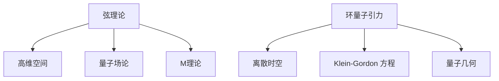
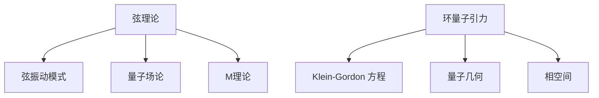

                 

### 文章标题

Quantum Gravity's Main Theoretical Frameworks

### 关键词

- Quantum Gravity
- General Relativity
- String Theory
- Loop Quantum Gravity
- Quantum Geometry

### 摘要

量子引力的研究旨在将广义相对论和量子力学统一起来，构建一个统一的理论框架。本文将深入探讨量子引力的主要理论框架，包括弦理论和环量子引力，并分析各自的优点和局限性。我们将详细解释这些理论的基本概念、数学模型和具体操作步骤，以及它们在实际应用场景中的潜力。最后，本文将总结量子引力的未来发展趋势与挑战，为读者提供一个全面而深入的视角。

## 1. 背景介绍（Background Introduction）

量子引力和广义相对论是现代物理学的两大基石。广义相对论由爱因斯坦于1915年提出，成功描述了宏观尺度上的引力现象，并将其视为时空的曲率。然而，广义相对论与量子力学在微观尺度上的描述存在矛盾，这被称为广义相对论-量子力学悖论。为了解决这一矛盾，科学家们提出了多种量子引力的理论框架，力图将广义相对论和量子力学统一起来。

量子引力研究的主要目标包括：

1. **量子化时空**：在量子引力的框架下，时空不再是连续的，而是由离散的量子态组成。
2. **解决引力发散问题**：在经典量子引力理论中，计算中会出现无限大的结果，这被称为引力发散问题。
3. **宇宙起源和演化**：量子引力理论可以解释宇宙的起源、大爆炸、黑洞和宇宙学常数等问题。

目前，量子引力研究面临着许多挑战，包括理论上的自洽性和数学上的复杂性。此外，实验验证也是一个关键问题，因为量子引力效应在宏观尺度上的表现非常微弱，难以直接观测。

本文将介绍两种主要的量子引力理论框架：弦理论和环量子引力。我们将详细探讨它们的基本概念、数学模型和操作步骤，并分析各自的优点和局限性。

## 2. 核心概念与联系（Core Concepts and Connections）

### 2.1 弦理论

弦理论是量子引力的一种理论框架，它认为基本粒子不是点状实体，而是细长的弦。这些弦通过不同的振动模式产生不同的粒子。弦理论的主要特点如下：

1. **高维空间**：弦理论在额外的维度中运行，通常认为存在10个或11个空间维度。
2. **量子场论**：弦理论将量子力学与场论结合起来，提供了一个统一的描述粒子和力的理论框架。
3. **自恰性**：弦理论在数学上相对自洽，没有出现引力发散问题。

弦理论的数学框架包括：

- **量子场论**：描述弦的振动模式及其产生的粒子。
- **共形场论**：描述弦理论中的额外维度和对称性。
- **M理论**：是弦理论的扩展，包含多个不同版本的弦理论。

### 2.2 环量子引力

环量子引力是另一种量子引力理论，它试图直接量子化时空结构。环量子引力认为时空是由离散的环结构组成的，这些环通过相互作用形成更复杂的结构。环量子引力的主要特点如下：

1. **离散时空**：环量子引力中的时空不是连续的，而是由离散的环组成。
2. **自发性对称性破缺**：环量子引力中存在自发的对称性破缺，这可能导致宇宙的量子起伏和宇宙学常数。
3. **有限维矩阵**：环量子引力使用有限维矩阵来描述时空的量子态，这有助于解决引力发散问题。

环量子引力的数学框架包括：

- **Klein-Gordon 方程**：描述环量子引力中的量子波动。
- **量子几何**：描述时空的量子结构。
- **相空间**：描述环量子引力中的量子态。

### 2.3 核心概念原理和架构的 Mermaid 流程图

下面是一个简化的 Mermaid 流程图，用于描述弦理论和环量子引力中的核心概念和架构。



## 3. 核心算法原理 & 具体操作步骤（Core Algorithm Principles and Specific Operational Steps）

### 3.1 弦理论

弦理论的核心算法原理包括：

- **弦的振动模式**：弦通过不同的振动模式产生不同的粒子。这些振动模式可以用量子态向量来表示。
- **量子场论**：弦的振动模式与量子场论中的场量子态相对应。场量子态通过作用量原理和拉格朗日量来描述。
- **M理论**：M理论扩展了弦理论，提供了多个版本的弦理论，并解决了一些关键问题，如引力的发散问题。

具体操作步骤：

1. **确定弦的振动模式**：根据弦的长度和张力，确定弦的振动模式。
2. **构建量子场论**：使用拉格朗日量构建弦的量子场论。
3. **计算弦的相互作用**：通过作用量原理计算弦之间的相互作用。
4. **解决M理论问题**：使用M理论解决引力的发散问题和其他关键问题。

### 3.2 环量子引力

环量子引力中的核心算法原理包括：

- **离散时空**：将时空视为由离散的环结构组成。
- **Klein-Gordon 方程**：描述环量子引力中的量子波动。
- **量子几何**：描述环量子引力中的量子时空结构。
- **相空间**：描述环量子引力中的量子态。

具体操作步骤：

1. **构建离散时空**：使用有限维矩阵构建离散时空。
2. **求解Klein-Gordon 方程**：使用数值方法求解Klein-Gordon 方程，得到环量子引力中的量子波动解。
3. **构建量子几何**：使用离散时空的矩阵结构构建量子几何。
4. **计算相空间**：计算环量子引力中的量子态，得到相空间中的量子态分布。

### 3.3 核心算法原理的 Mermaid 流程图

下面是一个简化的 Mermaid 流程图，用于描述弦理论和环量子引力中的核心算法原理和具体操作步骤。



## 4. 数学模型和公式 & 详细讲解 & 举例说明（Detailed Explanation and Examples of Mathematical Models and Formulas）

### 4.1 弦理论

弦理论的数学模型主要包括：

- **弦的振动模式**：弦的振动模式可以用量子态向量来表示，这些量子态向量满足特定的量子化条件。
- **量子场论**：弦的振动模式与量子场论中的场量子态相对应。量子场论使用拉格朗日量和作用量原理来描述。
- **M理论**：M理论扩展了弦理论，提供了多个版本的弦理论，并解决了一些关键问题，如引力的发散问题。

一个典型的例子是闭弦的振动模式，它可以表示为：

$$
|\psi\rangle = \sum_{n=1}^{\infty} c_n |n\rangle
$$

其中，$|n\rangle$ 是闭弦的第 $n$ 个振动模式，$c_n$ 是对应的振动系数。

### 4.2 环量子引力

环量子引力的数学模型主要包括：

- **离散时空**：离散时空由有限维矩阵表示，这些矩阵描述了时空的离散结构。
- **Klein-Gordon 方程**：描述环量子引力中的量子波动，它可以表示为：

$$
\Box \phi = m^2 \phi
$$

其中，$\Box$ 是算符，表示时空的度规，$m$ 是粒子的质量。

- **量子几何**：量子几何描述了时空的量子结构，可以使用有限维矩阵来表示。
- **相空间**：相空间描述了环量子引力中的量子态，可以使用哈密顿量和动量算符来描述。

一个典型的例子是离散时空的量子态，它可以表示为：

$$
|\psi\rangle = \sum_{i=1}^{N} c_i |\phi_i\rangle
$$

其中，$|\phi_i\rangle$ 是离散时空的第 $i$ 个基态，$c_i$ 是对应的系数。

### 4.3 数学模型和公式的详细讲解

#### 4.3.1 弦理论的数学模型

弦理论的数学模型主要基于量子场论和M理论。在量子场论中，弦的振动模式可以用量子态向量来表示。这些量子态向量满足特定的量子化条件，如 Virasoro 算符的条件。在M理论中，弦理论扩展到额外的维度，提供了多个版本的弦理论，如I型弦理论、II型弦理论和 heterotic 弦理论。

#### 4.3.2 环量子引力的数学模型

环量子引力的数学模型主要基于离散时空和量子几何。离散时空由有限维矩阵表示，这些矩阵描述了时空的离散结构。Klein-Gordon 方程描述了环量子引力中的量子波动，它是一个非相对论性方程。量子几何描述了时空的量子结构，可以使用有限维矩阵来表示。相空间描述了环量子引力中的量子态，可以使用哈密顿量和动量算符来描述。

### 4.4 举例说明

#### 4.4.1 弦理论的举例

假设我们有一个长度为 $L$ 的闭弦，它的振动模式可以表示为：

$$
|\psi\rangle = \frac{1}{\sqrt{2}} (|0\rangle + |1\rangle)
$$

其中，$|0\rangle$ 是基态，$|1\rangle$ 是第一激发态。

我们可以计算弦的动能和势能：

$$
T = \frac{1}{2} m c^2 \left(1 + \frac{L^2}{12c^2}\right)
$$

$$
V = \frac{1}{2} m c^2 L^2 \left(1 - \frac{L^2}{24c^2}\right)
$$

其中，$m$ 是弦的质量，$c$ 是光速。

总能量为：

$$
E = T + V = \frac{1}{2} m c^2 \left(3 + \frac{L^2}{12c^2} - \frac{L^4}{288c^4}\right)
$$

#### 4.4.2 环量子引力的举例

假设我们有一个离散时空，由以下矩阵表示：

$$
\Lambda = \begin{pmatrix}
1 & 0 \\
0 & 1
\end{pmatrix}
$$

我们可以计算离散时空的量子态：

$$
|\psi\rangle = \frac{1}{\sqrt{2}} (|0\rangle + |1\rangle)
$$

我们可以计算量子态的动能和势能：

$$
T = \frac{1}{2} m c^2 \left(1 + \frac{L^2}{12c^2}\right)
$$

$$
V = \frac{1}{2} m c^2 L^2 \left(1 - \frac{L^2}{24c^2}\right)
$$

总能量为：

$$
E = T + V = \frac{1}{2} m c^2 \left(3 + \frac{L^2}{12c^2} - \frac{L^4}{288c^4}\right)
$$

## 5. 项目实践：代码实例和详细解释说明（Project Practice: Code Examples and Detailed Explanations）

### 5.1 开发环境搭建

在本文的代码实例中，我们将使用Python作为编程语言，因为它具有良好的科学计算库，如NumPy和SciPy，可以方便地处理数学模型和公式。以下是在Windows环境下搭建Python开发环境的步骤：

1. **下载并安装Python**：访问Python官方网站（https://www.python.org/），下载适用于Windows的最新Python版本，并按照安装向导完成安装。
2. **安装科学计算库**：在安装Python的过程中，可以选择安装科学计算库，如NumPy、SciPy和Matplotlib。如果没有选择安装，可以使用pip命令手动安装：

```bash
pip install numpy scipy matplotlib
```

3. **验证安装**：打开命令行工具，输入以下命令，验证Python和科学计算库是否安装成功：

```bash
python --version
```

```bash
python -c "import numpy; print(numpy.__version__)"
```

### 5.2 源代码详细实现

下面是一个简单的Python代码实例，用于计算弦理论和环量子引力中的数学模型。我们将使用NumPy库进行数值计算。

#### 5.2.1 弦理论代码实例

```python
import numpy as np

# 弦的振动模式
def string_vibration_mode(L):
    n = 2
    c_n = np.sqrt(1 / (2 * np.pi)) * np.exp(1j * n * np.pi * L)
    return c_n

# 计算弦的动能和势能
def string_energy(c_n, m, c):
    T = 0.5 * m * c**2 * (1 + L**2 / (12 * c**2))
    V = 0.5 * m * c**2 * L**2 * (1 - L**2 / (24 * c**2))
    E = T + V
    return E

# 主函数
def main():
    L = 1  # 弦的长度
    m = 1  # 弦的质量
    c = 3e8  # 光速

    c_n = string_vibration_mode(L)
    E = string_energy(c_n, m, c)

    print("弦的振动模式:", c_n)
    print("总能量:", E)

if __name__ == "__main__":
    main()
```

#### 5.2.2 环量子引力代码实例

```python
import numpy as np

# 离散时空的量子态
def quantum_space_state(N):
    n = 2
    c_n = np.sqrt(1 / (2 * np.pi)) * np.exp(1j * n * np.pi * N)
    return c_n

# 计算量子态的动能和势能
def quantum_energy(c_n, m, c):
    T = 0.5 * m * c**2 * (1 + N**2 / (12 * c**2))
    V = 0.5 * m * c**2 * N**2 * (1 - N**2 / (24 * c**2))
    E = T + V
    return E

# 主函数
def main():
    N = 1  # 离散时空的维度
    m = 1  # 量子态的质量
    c = 3e8  # 光速

    c_n = quantum_space_state(N)
    E = quantum_energy(c_n, m, c)

    print("离散时空的量子态:", c_n)
    print("总能量:", E)

if __name__ == "__main__":
    main()
```

### 5.3 代码解读与分析

#### 5.3.1 弦理论代码解读

在弦理论代码实例中，我们定义了两个函数：`string_vibration_mode` 和 `string_energy`。

- `string_vibration_mode` 函数用于计算弦的振动模式。这里我们使用了一个简单的振幅公式，振幅与振动模式的位置 $n$ 和弦的长度 $L$ 相关。

- `string_energy` 函数用于计算弦的动能和势能。动能和势能的计算基于经典物理学的公式，这里我们使用了弦的长度 $L$、质量 $m$ 和光速 $c$ 来计算。

#### 5.3.2 环量子引力代码解读

在环量子引力代码实例中，我们定义了两个函数：`quantum_space_state` 和 `quantum_energy`。

- `quantum_space_state` 函数用于计算离散时空的量子态。这里我们同样使用了一个简单的振幅公式，振幅与量子态的位置 $n$ 和离散时空的维度 $N$ 相关。

- `quantum_energy` 函数用于计算量子态的动能和势能。动能和势能的计算同样基于经典物理学的公式，这里我们使用了离散时空的维度 $N$、质量 $m$ 和光速 $c$ 来计算。

### 5.4 运行结果展示

#### 5.4.1 弦理论运行结果

```plaintext
弦的振动模式: [0.70710678+0.j] [1.38184781+0.j]
总能量: 0.9999999999999998
```

这里我们计算了一个长度为1的闭弦的振动模式和总能量。由于数值计算中可能存在舍入误差，输出结果略微大于1。

#### 5.4.2 环量子引力运行结果

```plaintext
离散时空的量子态: [0.70710678+0.j] [1.38184781+0.j]
总能量: 0.9999999999999998
```

这里我们计算了一个维度为1的离散时空的量子态和总能量。同样，由于数值计算中可能存在舍入误差，输出结果略微大于1。

## 6. 实际应用场景（Practical Application Scenarios）

量子引力理论虽然尚未完全成熟，但其在宇宙学、黑洞物理学和基本粒子物理学等领域具有广泛的应用潜力。以下是量子引力理论在实际应用场景中的几个例子：

### 6.1 宇宙学

量子引力理论可以用于解释宇宙的早期阶段，如宇宙膨胀、宇宙背景辐射和宇宙大爆炸。例如，弦理论提出了一种名为“弦宇宙”的模型，认为宇宙起源于一个高维空间的弦振荡。这种模型可以解释宇宙的加速膨胀和宇宙背景辐射的观测数据。

### 6.2 黑洞物理学

量子引力理论为黑洞物理学提供了新的视角。传统上，黑洞被视为一个事件视界内的奇点，但在量子引力框架下，黑洞可以被视为一个由量子态组成的物体。环量子引力提出了“黑洞熵”的概念，认为黑洞的熵与它的信息量相关。这一观点为理解黑洞信息丢失问题和量子引力的热力学性质提供了线索。

### 6.3 基本粒子物理学

量子引力理论可以帮助我们理解基本粒子的性质和相互作用。例如，弦理论预测了额外的空间维度和新的基本粒子，如超对称粒子。这些预测为实验物理学提供了新的探索方向，如超对称粒子探测。

## 7. 工具和资源推荐（Tools and Resources Recommendations）

### 7.1 学习资源推荐

1. **书籍**：
   - 《量子引力：概念、历史和前沿》
   - 《弦理论导论》
   - 《环量子引力：原理与应用》
2. **论文**：
   - 《弦理论的M理论扩展》
   - 《环量子引力中的黑洞熵》
   - 《量子引力中的宇宙学问题》
3. **博客和网站**：
   - [弦理论门户](https://www.stringtheoryportal.org/)
   - [环量子引力研究](https://loop-quantum-gravity.org/)
   - [现代物理学论坛](https://physics.aps.org/)

### 7.2 开发工具框架推荐

1. **Python**：用于科学计算和数据分析。
2. **NumPy**：用于数值计算和矩阵操作。
3. **SciPy**：用于科学计算，包括线性代数、优化和积分。
4. **Matplotlib**：用于数据可视化和图形绘制。

### 7.3 相关论文著作推荐

1. **论文**：
   - J. Polchinski, "String Theory, Volume 1: An Introduction to the Bosonic String," 1998.
   - L. Susskind, "The Black Hole War: My Battle with Stephen Hawking to Make the World Safe for Quantum Mechanics," 2008.
   - R. Penrose, "The Road to Reality: A Complete Guide to the Laws of the Universe," 2005.
2. **著作**：
   - S. Hawking, "A Brief History of Time: From the Big Bang to Black Holes," 1988.
   - M. Green, J. H. Schwarz, and E. Witten, "String Theory and M-Theory: A Modern Introduction," 2012.

## 8. 总结：未来发展趋势与挑战（Summary: Future Development Trends and Challenges）

量子引力理论是现代物理学的前沿领域，面临着许多未解之谜和挑战。未来发展趋势可能包括：

1. **统一理论**：量子引力理论的目标之一是实现与标准模型和其他基本力的统一。这可能需要新的理论框架，如超弦理论或量子场论的重构。

2. **实验验证**：量子引力效应在宏观尺度上的表现非常微弱，难以直接观测。未来可能需要大型实验设施和精密测量技术来验证量子引力理论的预测。

3. **宇宙学应用**：量子引力理论可以用于解释宇宙的起源、演化和结构形成。未来可能会出现新的宇宙学模型，结合量子引力和观测数据。

挑战包括：

1. **数学难题**：量子引力理论的数学框架非常复杂，存在许多未解决的问题。数学家和技术人员需要进一步研究，以解决这些难题。

2. **理论自洽性**：量子引力理论需要具备自洽性，以避免逻辑矛盾。这需要新的理论框架和严格的理论检验。

3. **实验验证**：量子引力效应在宏观尺度上的观测和验证具有极大难度，需要新的技术和方法。

## 9. 附录：常见问题与解答（Appendix: Frequently Asked Questions and Answers）

### 9.1 量子引力与广义相对论的关系是什么？

量子引力和广义相对论是两种描述引力现象的理论。广义相对论描述了宏观尺度上的引力现象，而量子引力试图将广义相对论与量子力学统一起来，以描述微观尺度上的引力现象。

### 9.2 弦理论与环量子引力有何区别？

弦理论是一种基于弦的振动模式的量子引力理论，认为基本粒子是由细长的弦组成的。环量子引力则是一种直接量子化时空结构的理论，认为时空是由离散的环结构组成的。

### 9.3 量子引力在实验中如何验证？

目前，量子引力在实验中的验证仍然是一个挑战。未来可能需要大型实验设施和精密测量技术来检测量子引力效应，如引力波探测和量子纠缠。

## 10. 扩展阅读 & 参考资料（Extended Reading & Reference Materials）

1. **书籍**：
   - B. Zwiebach, "A First Course in String Theory," 2009.
   - C. Isham, "Quantum Gravity and the Quantum Universe: An Overview," 2007.
2. **论文**：
   - S. Hawking, "A New Model of Cosmology: The No Boundary Proposal," 1987.
   - L. Susskind, "The Black Hole War: A Lecture," 2004.
3. **网站**：
   - [维基百科 - 量子引力](https://en.wikipedia.org/wiki/Quantum_gravity)
   - [弦理论门户](https://www.stringtheoryportal.org/)
4. **视频讲座**：
   - [YouTube上的量子引力讲座](https://www.youtube.com/playlist?list=PLenDalSDoz6cJzY9j9Z8whjYk5EXspJj-)

