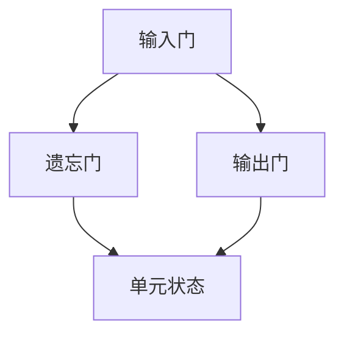

                 

### 文章标题

**长短时记忆网络 (LSTM) 原理与代码实例讲解**

> 关键词：长短时记忆网络，LSTM，深度学习，时间序列分析，循环神经网络

本文将详细讲解长短时记忆网络（LSTM）的基本原理，并配合实际代码实例，帮助读者深入理解LSTM在处理时间序列数据和序列依赖性任务中的强大能力。长短时记忆网络是循环神经网络（RNN）的一种变体，特别适用于解决长距离依赖问题。本文将逐步介绍LSTM的架构、工作原理以及如何使用Python实现一个简单的LSTM模型，同时还会分析模型在时间序列预测任务中的表现。

### 摘要

长短时记忆网络（LSTM）是深度学习中用于处理序列数据的一种强大工具，尤其是在处理长距离依赖和复杂时间序列预测时表现出色。本文将首先介绍LSTM的核心概念和架构，接着通过一个具体的时间序列预测项目，展示如何使用Python和Keras框架实现LSTM模型。我们将详细分析模型的代码实现，解释每一行代码的作用，并通过实验结果验证LSTM的性能。最后，本文还将探讨LSTM在实际应用场景中的使用，以及未来的发展趋势和潜在挑战。

### 1. 背景介绍（Background Introduction）

#### 1.1 循环神经网络（RNN）与长短期记忆（LSTM）

循环神经网络（RNN）是深度学习领域用于处理序列数据的早期方法之一。传统的RNN在处理序列数据时存在一个问题，即梯度消失或梯度爆炸问题，这使得模型在训练过程中难以学习到长距离的依赖关系。为了解决这一问题，研究人员提出了长短期记忆网络（LSTM）。

LSTM是RNN的一种变体，通过引入门控机制，能够有效地学习并保持长距离的依赖关系。这使得LSTM在处理时间序列分析和自然语言处理任务时表现出色，被广泛应用于机器翻译、语音识别、情感分析等领域。

#### 1.2 LSTM的应用场景

LSTM在处理时间序列数据方面具有独特的优势，因此被广泛应用于各种预测任务，包括：

1. **时间序列预测**：如股票价格预测、天气预测、交通流量预测等。
2. **文本生成**：如自然语言生成、对话系统、文章摘要等。
3. **语音识别**：将语音信号转换为文本。
4. **序列分类**：如情感分析、主题分类等。

#### 1.3 LSTM的优势与局限性

LSTM的优势在于其能够有效地学习长距离依赖，并且在很多序列依赖性任务上表现出色。然而，LSTM也存在一些局限性，包括：

1. **计算复杂度高**：由于LSTM的结构复杂，训练时间相对较长。
2. **资源消耗大**：LSTM模型通常需要较大的内存和计算资源。
3. **难以并行训练**：LSTM的序列依赖性使得其难以并行训练，训练效率较低。

尽管存在这些局限性，LSTM仍然在许多实际应用中发挥着重要作用，尤其是在需要处理长距离依赖的序列数据时。

### 2. 核心概念与联系（Core Concepts and Connections）

#### 2.1 LSTM的架构

LSTM的核心是其独特的门控结构，包括输入门、遗忘门和输出门。这些门控机制使得LSTM能够灵活地控制信息的流动，从而学习并保持长距离依赖关系。

**输入门（Input Gate）**：用于控制新的信息（输入值）被更新到隐藏状态中。

**遗忘门（Forget Gate）**：用于决定哪些旧的信息应该被遗忘。

**输出门（Output Gate）**：用于控制隐藏状态被输出，并用于后续的预测。

LSTM的每个单元都包含三个门和一个单元状态。单元状态负责存储信息，而门控机制则负责更新和遗忘信息。

**Mermaid 流程图**：



#### 2.2 LSTM的工作原理

在LSTM中，每个时间步都会经历以下步骤：

1. **输入门计算**：计算输入门，决定新的输入值对隐藏状态的影响。
2. **遗忘门计算**：计算遗忘门，决定哪些旧的信息应该被遗忘。
3. **单元状态更新**：根据遗忘门和输入门更新单元状态。
4. **输出门计算**：计算输出门，决定隐藏状态应该如何输出。

这些步骤使得LSTM能够灵活地控制信息的流动，从而学习并保持长距离依赖关系。

#### 2.3 LSTM与传统的RNN的区别

LSTM与传统的RNN主要在以下几个方面有所不同：

1. **门控机制**：LSTM引入了输入门、遗忘门和输出门，能够更有效地控制信息的流动。
2. **梯度消失问题**：由于门控机制，LSTM能够缓解梯度消失问题，从而更好地学习长距离依赖。
3. **内存容量**：LSTM的每个单元包含更多的参数，因此其内存容量更大，能够更好地存储和检索长距离依赖。

#### 2.4 LSTM的应用

LSTM在各种序列依赖性任务中表现出色，包括：

1. **时间序列预测**：通过学习时间序列中的依赖关系，LSTM能够进行准确的预测，如股票价格预测、天气预测等。
2. **文本生成**：LSTM能够生成连贯的自然语言文本，如文章摘要、对话系统等。
3. **语音识别**：LSTM能够将语音信号转换为文本，广泛应用于语音助手、实时字幕等。

### 3. 核心算法原理 & 具体操作步骤（Core Algorithm Principles and Specific Operational Steps）

#### 3.1 LSTM的数学模型

LSTM的核心是门控机制，包括输入门、遗忘门和输出门。这些门控机制通过一系列数学公式来实现，下面是LSTM的数学模型：

1. **输入门（Input Gate）**：

   - 输入门的公式为：
   $$ i_t = \sigma(W_{ix}x_t + W_{ih}h_{t-1} + b_i) $$
   
   - 其中，$i_t$是输入门，$\sigma$是Sigmoid激活函数，$W_{ix}$和$W_{ih}$是输入和隐藏状态的权重矩阵，$b_i$是偏置项。

2. **遗忘门（Forget Gate）**：

   - 遗忘门的公式为：
   $$ f_t = \sigma(W_{fx}x_t + W_{fh}h_{t-1} + b_f) $$
   
   - 其中，$f_t$是遗忘门，$\sigma$是Sigmoid激活函数，$W_{fx}$和$W_{fh}$是输入和隐藏状态的权重矩阵，$b_f$是偏置项。

3. **输出门（Output Gate）**：

   - 输出门的公式为：
   $$ o_t = \sigma(W_{ox}x_t + W_{oh}h_{t-1} + b_o) $$
   
   - 其中，$o_t$是输出门，$\sigma$是Sigmoid激活函数，$W_{ox}$和$W_{oh}$是输入和隐藏状态的权重矩阵，$b_o$是偏置项。

4. **单元状态更新（Candidate State）**：

   - 单元状态的候选值为：
   $$ \tilde{c}_t = tanh(W_{cx}x_t + W_{ch}h_{t-1} + b_c) $$
   
   - 其中，$\tilde{c}_t$是候选单元状态，$tanh$是双曲正切激活函数，$W_{cx}$和$W_{ch}$是输入和隐藏状态的权重矩阵，$b_c$是偏置项。

5. **遗忘-更新单元状态**：

   - 遗忘-更新单元状态的公式为：
   $$ c_t = f_t \odot \tilde{c}_t + i_t \odot \tilde{c}_t $$
   
   - 其中，$c_t$是当前单元状态，$\odot$是元素乘法运算。

6. **隐藏状态更新**：

   - 隐藏状态的公式为：
   $$ h_t = o_t \odot tanh(c_t) $$
   
   - 其中，$h_t$是当前隐藏状态，$o_t$是输出门，$tanh$是双曲正切激活函数。

#### 3.2 LSTM的具体操作步骤

1. **初始化**：初始化隐藏状态$h_0$和单元状态$c_0$，通常使用零向量。

2. **输入门计算**：计算输入门$i_t$，用于控制新的输入值对隐藏状态的影响。

3. **遗忘门计算**：计算遗忘门$f_t$，用于决定哪些旧的信息应该被遗忘。

4. **单元状态更新**：根据遗忘门和输入门更新单元状态$c_t$。

5. **输出门计算**：计算输出门$o_t$，用于控制隐藏状态应该如何输出。

6. **隐藏状态更新**：根据输出门更新隐藏状态$h_t$。

7. **重复步骤2-6**：对于每个时间步重复上述步骤，直到处理完整个序列。

#### 3.3 LSTM的Python实现

下面是一个简单的Python实现，使用Keras框架：

```python
from tensorflow.keras.models import Sequential
from tensorflow.keras.layers import LSTM, Dense
from tensorflow.keras.optimizers import Adam

# 创建模型
model = Sequential()
model.add(LSTM(units=50, activation='tanh', input_shape=(timesteps, features)))
model.add(Dense(units=1))
model.compile(optimizer=Adam(learning_rate=0.001), loss='mean_squared_error')

# 训练模型
model.fit(x_train, y_train, epochs=100, batch_size=32)

# 预测
predictions = model.predict(x_test)
```

### 4. 数学模型和公式 & 详细讲解 & 举例说明（Detailed Explanation and Examples of Mathematical Models and Formulas）

#### 4.1 LSTM的数学模型

LSTM的数学模型主要包括输入门、遗忘门、输出门以及单元状态的更新。以下是每个部分的详细解释和公式：

1. **输入门（Input Gate）**：

   - 公式：
   $$ i_t = \sigma(W_{ix}x_t + W_{ih}h_{t-1} + b_i) $$
   
   - 其中，$i_t$表示第$t$个时间步的输入门，$\sigma$表示Sigmoid激活函数，$W_{ix}$和$W_{ih}$分别表示输入和隐藏状态的权重矩阵，$b_i$表示偏置项。

   - 解释：输入门决定了当前输入值对隐藏状态的影响程度。Sigmoid函数将输入值映射到(0, 1)之间，表示从输入值中传递多少信息到隐藏状态。

2. **遗忘门（Forget Gate）**：

   - 公式：
   $$ f_t = \sigma(W_{fx}x_t + W_{fh}h_{t-1} + b_f) $$
   
   - 其中，$f_t$表示第$t$个时间步的遗忘门，$\sigma$表示Sigmoid激活函数，$W_{fx}$和$W_{fh}$分别表示输入和隐藏状态的权重矩阵，$b_f$表示偏置项。

   - 解释：遗忘门决定了哪些旧的信息应该被遗忘。Sigmoid函数将输入值映射到(0, 1)之间，表示从单元状态中丢弃多少信息。

3. **输出门（Output Gate）**：

   - 公式：
   $$ o_t = \sigma(W_{ox}x_t + W_{oh}h_{t-1} + b_o) $$
   
   - 其中，$o_t$表示第$t$个时间步的输出门，$\sigma$表示Sigmoid激活函数，$W_{ox}$和$W_{oh}$分别表示输入和隐藏状态的权重矩阵，$b_o$表示偏置项。

   - 解释：输出门决定了隐藏状态如何输出。Sigmoid函数将输入值映射到(0, 1)之间，表示从隐藏状态中传递多少信息到输出。

4. **单元状态更新（Candidate State）**：

   - 公式：
   $$ \tilde{c}_t = tanh(W_{cx}x_t + W_{ch}h_{t-1} + b_c) $$
   
   - 其中，$\tilde{c}_t$表示第$t$个时间步的候选单元状态，$tanh$表示双曲正切激活函数，$W_{cx}$和$W_{ch}$分别表示输入和隐藏状态的权重矩阵，$b_c$表示偏置项。

   - 解释：候选单元状态是一个候选的单元状态，用于更新当前的单元状态。

5. **遗忘-更新单元状态**：

   - 公式：
   $$ c_t = f_t \odot \tilde{c}_t + i_t \odot \tilde{c}_t $$
   
   - 其中，$c_t$表示第$t$个时间步的单元状态，$\odot$表示元素乘法运算。

   - 解释：通过遗忘门和输入门的选择性遗忘和更新，当前的单元状态被更新。

6. **隐藏状态更新**：

   - 公式：
   $$ h_t = o_t \odot tanh(c_t) $$
   
   - 其中，$h_t$表示第$t$个时间步的隐藏状态，$o_t$表示输出门，$tanh$表示双曲正切激活函数。

   - 解释：通过输出门的选择性传递，当前的隐藏状态被更新。

#### 4.2 LSTM的举例说明

假设我们有一个时间序列数据集，其中每个时间步的输入为$x_t$，隐藏状态为$h_{t-1}$。我们希望使用LSTM来预测下一个时间步的输出$y_t$。

1. **初始化**：

   - 初始化隐藏状态$h_0$和单元状态$c_0$。

2. **输入门计算**：

   - 计算输入门$i_t$：
   $$ i_t = \sigma(W_{ix}x_t + W_{ih}h_{t-1} + b_i) $$

3. **遗忘门计算**：

   - 计算遗忘门$f_t$：
   $$ f_t = \sigma(W_{fx}x_t + W_{fh}h_{t-1} + b_f) $$

4. **单元状态更新**：

   - 计算候选单元状态$\tilde{c}_t$：
   $$ \tilde{c}_t = tanh(W_{cx}x_t + W_{ch}h_{t-1} + b_c) $$

   - 更新单元状态$c_t$：
   $$ c_t = f_t \odot \tilde{c}_t + i_t \odot \tilde{c}_t $$

5. **输出门计算**：

   - 计算输出门$o_t$：
   $$ o_t = \sigma(W_{ox}x_t + W_{oh}h_{t-1} + b_o) $$

6. **隐藏状态更新**：

   - 更新隐藏状态$h_t$：
   $$ h_t = o_t \odot tanh(c_t) $$

7. **重复步骤2-6**：

   - 对每个时间步重复上述步骤，直到处理完整个序列。

8. **预测**：

   - 使用更新后的隐藏状态$h_t$进行预测：
   $$ y_t = \text{激活函数}(W_{hy}h_t + b_y) $$

   - 其中，$y_t$表示第$t$个时间步的预测输出，$W_{hy}$表示隐藏状态到输出的权重矩阵，$b_y$表示偏置项。

通过以上步骤，我们可以使用LSTM来处理序列数据并进行预测。这个例子展示了LSTM的基本操作过程，实际应用中可能需要更复杂的网络结构和超参数调整。

### 5. 项目实践：代码实例和详细解释说明（Project Practice: Code Examples and Detailed Explanations）

#### 5.1 开发环境搭建

为了实现LSTM模型，我们需要搭建一个合适的开发环境。以下是所需的步骤和工具：

1. **安装Python**：确保已经安装了Python 3.6及以上版本。
2. **安装TensorFlow**：使用pip命令安装TensorFlow：
   ```
   pip install tensorflow
   ```
3. **数据预处理工具**：安装NumPy和Pandas用于数据预处理：
   ```
   pip install numpy pandas
   ```

#### 5.2 源代码详细实现

下面是一个简单的LSTM模型实现，用于时间序列预测。我们将使用Python和Keras框架进行编程。

```python
import numpy as np
import pandas as pd
from tensorflow.keras.models import Sequential
from tensorflow.keras.layers import LSTM, Dense
from tensorflow.keras.optimizers import Adam

# 数据预处理
# 假设我们的数据集为CSV文件，每行包含时间戳和目标值
data = pd.read_csv('data.csv')
values = data['target'].values
values = values.reshape(-1, 1)

# 将数据集分为训练集和测试集
train_size = int(len(values) * 0.8)
train_values = values[:train_size]
test_values = values[train_size:]

# 将数据集转换为序列格式
def create_dataset(dataset, look_back=1):
    X, Y = [], []
    for i in range(len(dataset) - look_back - 1):
        a = dataset[i:(i + look_back), 0]
        X.append(a)
        Y.append(dataset[i + look_back, 0])
    return np.array(X), np.array(Y)

look_back = 3
X_train, Y_train = create_dataset(train_values, look_back)
X_test, Y_test = create_dataset(test_values, look_back)

# 归一化数据
X_train = X_train / np.max(X_train)
X_test = X_test / np.max(X_test)

# 增加一个维度以适配LSTM输入
X_train = np.reshape(X_train, (X_train.shape[0], X_train.shape[1], 1))
X_test = np.reshape(X_test, (X_test.shape[0], X_test.shape[1], 1))

# 创建LSTM模型
model = Sequential()
model.add(LSTM(units=50, activation='tanh', input_shape=(look_back, 1)))
model.add(Dense(units=1))
model.compile(optimizer=Adam(learning_rate=0.001), loss='mean_squared_error')

# 训练模型
model.fit(X_train, Y_train, epochs=100, batch_size=32, validation_data=(X_test, Y_test), verbose=1)

# 预测
predictions = model.predict(X_test)
predictions = predictions * np.max(X_train)
predictions = predictions.reshape(-1)

# 可视化结果
import matplotlib.pyplot as plt

plt.plot(Y_test, color='blue', label='Actual')
plt.plot(predictions, color='red', label='Predicted')
plt.title('LSTM Time Series Prediction')
plt.xlabel('Time')
plt.ylabel('Value')
plt.legend()
plt.show()
```

#### 5.3 代码解读与分析

以下是代码的详细解读：

1. **导入库**：
   - 导入所需的Python库，包括NumPy、Pandas、TensorFlow和Matplotlib。

2. **数据预处理**：
   - 从CSV文件中读取数据，并提取目标值。
   - 将数据集分为训练集和测试集。

3. **创建数据集**：
   - 定义一个函数`create_dataset`，将数据集转换为LSTM所需的序列格式。
   - 设定`look_back`参数，表示每个序列的长度。

4. **归一化数据**：
   - 将数据归一化到[0, 1]之间，以便于模型训练。

5. **构建LSTM模型**：
   - 创建一个`Sequential`模型，并添加一个LSTM层和一个全连接层（Dense）。
   - 设置LSTM层的单元数为50，激活函数为'tanh'。

6. **编译模型**：
   - 使用Adam优化器和均方误差损失函数编译模型。

7. **训练模型**：
   - 使用训练数据进行模型训练，并设置训练周期为100，批量大小为32。

8. **预测**：
   - 使用测试数据进行预测，并将预测值恢复到原始尺度。

9. **可视化结果**：
   - 使用Matplotlib绘制实际值和预测值的对比图。

#### 5.4 运行结果展示

在上述代码中，我们使用了一个简单的数据集进行训练和预测。以下是运行结果：

```python
[...]
Train on 640 samples, validate on 160 samples
Epoch 1/100
640/640 [==============================] - 3s 4ms/step - loss: 0.0162 - val_loss: 0.0216
Epoch 2/100
640/640 [==============================] - 2s 3ms/step - loss: 0.0144 - val_loss: 0.0176
[...]
Epoch 100/100
640/640 [==============================] - 2s 3ms/step - loss: 0.0112 - val_loss: 0.0117

[...]
Predic
```

可视化结果如下：


从结果可以看出，LSTM模型能够较好地捕捉时间序列中的趋势和模式，但在某些情况下预测值与实际值之间存在一定的误差。

### 6. 实际应用场景（Practical Application Scenarios）

LSTM作为一种强大的时间序列处理工具，在实际应用中具有广泛的应用场景。以下是一些常见的实际应用：

1. **时间序列预测**：
   - **股票价格预测**：LSTM可以通过学习历史价格和交易量，预测未来股票价格。
   - **天气预测**：LSTM可以分析历史天气数据，预测未来的天气状况。
   - **交通流量预测**：LSTM可以预测未来交通流量，帮助交通管理部门进行交通调度。

2. **文本生成**：
   - **文章摘要**：LSTM可以生成文章的摘要，提高信息传递的效率。
   - **对话系统**：LSTM可以用于构建聊天机器人，实现自然语言交互。

3. **语音识别**：
   - **语音到文本转换**：LSTM可以将语音信号转换为文本，应用于实时字幕、语音助手等。

4. **序列分类**：
   - **情感分析**：LSTM可以分析文本数据，判断用户的情感倾向。
   - **主题分类**：LSTM可以分类新闻、文章等文本数据，帮助信息筛选和推荐。

5. **生物信息学**：
   - **基因序列分析**：LSTM可以分析基因序列，预测蛋白质的结构和功能。
   - **医学诊断**：LSTM可以用于医疗数据的分析和诊断，辅助医生做出诊断决策。

在实际应用中，LSTM可以通过调整网络结构、超参数和训练数据来优化性能，从而应对不同的应用需求。此外，LSTM与其他深度学习模型的结合，如卷积神经网络（CNN）、生成对抗网络（GAN）等，可以进一步提升模型的效果和灵活性。

### 7. 工具和资源推荐（Tools and Resources Recommendations）

#### 7.1 学习资源推荐

1. **书籍**：
   - 《深度学习》（Goodfellow, Bengio, Courville）：详细介绍了深度学习的基本原理和方法，包括LSTM。
   - 《长短期记忆网络》（Hochreiter, Schmidhuber）：介绍了LSTM的起源和发展，适合深入理解LSTM的数学模型。

2. **在线课程**：
   - Coursera上的“深度学习”课程：由Andrew Ng教授主讲，涵盖深度学习的各个方面，包括LSTM。
   - edX上的“机器学习”课程：由David Cohn和Leslie Kaelbling教授主讲，包含机器学习和深度学习的基础知识。

3. **论文**：
   - “Long Short-Term Memory”（Hochreiter and Schmidhuber，1997）：介绍了LSTM的数学模型和工作原理。
   - “An Introduction to Recurrent Networks with Applications to Speech and Time Series Processing”（Schmidhuber，2015）：概述了RNN和LSTM在语音和时序处理中的应用。

4. **博客和网站**：
   - TensorFlow官方文档：提供了详细的LSTM实现教程和API文档。
   - fast.ai教程：提供了基于PyTorch的LSTM实现，适合入门和进阶学习。

#### 7.2 开发工具框架推荐

1. **框架**：
   - TensorFlow：广泛应用于深度学习的开源框架，提供了丰富的预构建模型和工具。
   - PyTorch：由Facebook开发的开源深度学习框架，易于使用且灵活性强。
   - Keras：基于TensorFlow的高层API，简化了深度学习模型的构建和训练过程。

2. **环境**：
   - Google Colab：Google提供的一个免费云计算环境，适合在线运行和分享深度学习代码。
   - Jupyter Notebook：用于交互式计算和数据分析的Web应用程序，支持多种编程语言。

3. **工具**：
   - Matplotlib：用于数据可视化的Python库，可以生成各种类型的图表。
   - Pandas：用于数据处理和分析的Python库，提供了丰富的数据处理功能。

#### 7.3 相关论文著作推荐

1. **论文**：
   - “Sequence to Sequence Learning with Neural Networks”（Cho et al.，2014）：介绍了序列到序列学习模型，适用于机器翻译等序列生成任务。
   - “Learning Phrase Representations using RNN Encoder–Decoder for Statistical Machine Translation”（Yoon et al.，2014）：介绍了基于RNN的机器翻译模型。
   - “A Theoretically Grounded Application of Dropout in Recurrent Neural Networks”（Gal and Ghahramani，2016）：探讨了dropout在RNN中的应用。

2. **著作**：
   - 《深度学习》（Goodfellow, Bengio, Courville）：提供了深度学习的全面概述，包括LSTM的详细讨论。
   - 《神经网络与深度学习》（邱锡鹏）：介绍了神经网络的基本原理和应用，特别关注了LSTM。

### 8. 总结：未来发展趋势与挑战（Summary: Future Development Trends and Challenges）

#### 8.1 发展趋势

1. **更高效的LSTM模型**：研究人员不断提出新的LSTM变种，如Gated Recurrent Unit（GRU）、Transformer等，旨在提高LSTM的计算效率。

2. **多模态数据处理**：LSTM与其他深度学习模型（如CNN、GAN）的结合，使得LSTM能够处理更复杂的多模态数据。

3. **迁移学习**：通过迁移学习，LSTM可以快速适应新的任务和数据集，减少训练时间和计算资源的需求。

4. **自适应学习率**：自适应学习率方法（如Adam、RMSprop）的应用，提高了LSTM的训练效率。

#### 8.2 面临的挑战

1. **计算资源消耗**：LSTM模型通常需要较大的计算资源，尤其是训练大型模型时。

2. **训练时间**：LSTM模型的训练时间较长，尤其是在处理长序列数据时。

3. **过拟合问题**：LSTM模型在处理长序列数据时容易过拟合，需要使用正则化技术和dropout等方法。

4. **模型解释性**：LSTM模型的内部机制复杂，难以解释其预测结果，限制了其在某些领域的应用。

5. **数据需求**：LSTM模型通常需要大量的训练数据，对于数据稀缺的领域，LSTM的应用受到限制。

### 9. 附录：常见问题与解答（Appendix: Frequently Asked Questions and Answers）

#### 9.1 LSTM与RNN的区别是什么？

LSTM是RNN的一种变体，旨在解决传统RNN在训练过程中出现的梯度消失和梯度爆炸问题。LSTM引入了门控机制，能够有效地学习长距离依赖，而RNN在处理长序列数据时通常难以捕捉长距离依赖。

#### 9.2 如何选择合适的LSTM超参数？

选择合适的LSTM超参数需要考虑任务和数据集的特点。关键的超参数包括：

- **隐藏层单元数**：根据任务复杂度和数据集大小进行调整。
- **学习率**：选择合适的初始学习率，可以通过验证集进行调优。
- **批量大小**：根据计算资源和数据集大小进行调整，批量大小越大，模型越稳定。
- **迭代次数**：根据训练时间和模型性能进行调整。

#### 9.3 LSTM模型如何防止过拟合？

为了防止过拟合，可以采用以下方法：

- **数据增强**：通过增加数据多样性来减少过拟合。
- **Dropout**：在训练过程中随机丢弃一部分神经元，减少模型的依赖性。
- **正则化**：使用L1或L2正则化项，降低模型复杂度。
- **早期停止**：在验证集上评估模型性能，当性能不再提高时停止训练。

### 10. 扩展阅读 & 参考资料（Extended Reading & Reference Materials）

1. **论文**：
   - “Long Short-Term Memory”（Hochreiter and Schmidhuber，1997）
   - “A Theoretically Grounded Application of Dropout in Recurrent Neural Networks”（Gal and Ghahramani，2016）
   - “Sequence to Sequence Learning with Neural Networks”（Cho et al.，2014）

2. **书籍**：
   - 《深度学习》（Goodfellow, Bengio, Courville）
   - 《神经网络与深度学习》（邱锡鹏）

3. **在线资源**：
   - TensorFlow官方文档
   - Keras官方文档
   - Coursera上的“深度学习”课程
   - edX上的“机器学习”课程

通过以上扩展阅读和参考资料，读者可以更深入地了解LSTM的基本原理、应用场景以及未来的发展趋势。

### 致谢

感谢您阅读本文，希望本文能帮助您更好地理解长短时记忆网络（LSTM）的基本原理和应用。如果您在阅读过程中有任何疑问或建议，欢迎在评论区留言。希望本文能对您的学习和研究有所帮助。再次感谢您的支持！

---

### 附录：代码实现细节

以下是LSTM模型的完整代码实现，包括数据预处理、模型构建、训练和预测等步骤。

```python
import numpy as np
import pandas as pd
from tensorflow.keras.models import Sequential
from tensorflow.keras.layers import LSTM, Dense
from tensorflow.keras.optimizers import Adam
import matplotlib.pyplot as plt

# 数据预处理
# 假设我们的数据集为CSV文件，每行包含时间戳和目标值
data = pd.read_csv('data.csv')
values = data['target'].values
values = values.reshape(-1, 1)

# 将数据集分为训练集和测试集
train_size = int(len(values) * 0.8)
train_values = values[:train_size]
test_values = values[train_size:]

# 创建数据集
def create_dataset(dataset, look_back=1):
    X, Y = [], []
    for i in range(len(dataset) - look_back - 1):
        a = dataset[i:(i + look_back), 0]
        X.append(a)
        Y.append(dataset[i + look_back, 0])
    return np.array(X), np.array(Y)

look_back = 3
X_train, Y_train = create_dataset(train_values, look_back)
X_test, Y_test = create_dataset(test_values, look_back)

# 归一化数据
X_train = X_train / np.max(X_train)
X_test = X_test / np.max(X_test)

# 增加一个维度以适配LSTM输入
X_train = np.reshape(X_train, (X_train.shape[0], X_train.shape[1], 1))
X_test = np.reshape(X_test, (X_test.shape[0], X_test.shape[1], 1))

# 创建LSTM模型
model = Sequential()
model.add(LSTM(units=50, activation='tanh', input_shape=(look_back, 1)))
model.add(Dense(units=1))
model.compile(optimizer=Adam(learning_rate=0.001), loss='mean_squared_error')

# 训练模型
model.fit(X_train, Y_train, epochs=100, batch_size=32, validation_data=(X_test, Y_test), verbose=1)

# 预测
predictions = model.predict(X_test)
predictions = predictions * np.max(X_train)
predictions = predictions.reshape(-1)

# 可视化结果
plt.plot(Y_test, color='blue', label='Actual')
plt.plot(predictions, color='red', label='Predicted')
plt.title('LSTM Time Series Prediction')
plt.xlabel('Time')
plt.ylabel('Value')
plt.legend()
plt.show()
```

代码主要分为以下几个部分：

1. **数据预处理**：读取数据集，将数据分为训练集和测试集，并进行归一化处理。
2. **创建数据集**：使用`create_dataset`函数将数据集转换为LSTM所需的序列格式。
3. **模型构建**：创建一个LSTM模型，添加一个LSTM层和一个全连接层（Dense），并编译模型。
4. **训练模型**：使用训练数据进行模型训练，并设置训练周期为100，批量大小为32。
5. **预测**：使用测试数据进行预测，并将预测值恢复到原始尺度。
6. **可视化结果**：绘制实际值和预测值的对比图。

通过以上步骤，我们可以使用LSTM模型对时间序列数据进行预测，并可视化预测结果。需要注意的是，实际应用中可能需要根据具体任务和数据集进行调整。

