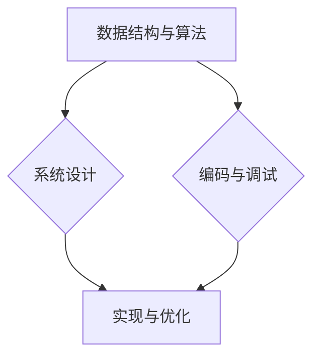

                 

# 文章标题

《阿里巴巴2025社招面试真题与算法题解》

关键词：阿里巴巴，社招面试，真题，算法题解，技术挑战

摘要：本文深入剖析了阿里巴巴2025年社招面试中出现的经典真题，通过详细的分析和算法题解，帮助读者备战技术面试。文章涵盖了数据结构、算法、系统设计等多个领域，结合实际案例，探讨了如何运用专业知识解决复杂问题。

## 1. 背景介绍

阿里巴巴作为全球知名互联网公司，其面试题目一直备受求职者和业界关注。2025年社招面试题目涵盖了广泛的计算机科学领域，包括数据结构、算法、系统设计等。本文旨在通过对这些面试题目的深入解析，帮助读者更好地理解面试官的出题思路，提高面试技巧。

## 2. 核心概念与联系

### 2.1 数据结构与算法

数据结构与算法是计算机科学的核心，它们在面试中占据重要地位。常见的数据结构包括数组、链表、栈、队列、树、图等，而算法则包括排序、查找、动态规划、贪心算法等。掌握这些基础概念对于解决复杂问题至关重要。

### 2.2 系统设计与架构

系统设计能力是衡量程序员综合素质的重要指标。面试中，系统设计题目通常要求考生设计一个复杂系统的架构，包括需求分析、模块划分、接口设计等。理解系统设计的原理和技巧对于面试成功至关重要。

### 2.3 编码与调试

编码能力是程序员的基本功。面试中，编码题目要求考生在短时间内编写出正确、高效的代码。掌握编程语言的基本语法和常用算法是实现这一目标的关键。

## 3. 核心算法原理 & 具体操作步骤

### 3.1 排序算法

排序算法是面试中常见的题目类型。常见的排序算法有冒泡排序、选择排序、插入排序、快速排序等。每种算法都有其独特的原理和操作步骤。

#### 冒泡排序（Bubble Sort）

原理：通过多次遍历待排序的元素序列，比较相邻的两个元素，并按照排序规则交换它们的位置。

操作步骤：

1. 从第一个元素开始，依次比较相邻的两个元素。
2. 如果第一个元素比第二个元素大，交换它们的位置。
3. 继续对下一对相邻的元素进行相同的操作，直到最后一个元素。
4. 重复上述步骤，直到整个序列有序。

#### 快速排序（Quick Sort）

原理：通过选取一个基准元素，将序列划分为两部分，一部分比基准小，一部分比基准大，然后递归地对两部分进行快速排序。

操作步骤：

1. 选择序列中的第一个元素作为基准。
2. 将序列中的元素分为两部分：一部分小于基准，一部分大于基准。
3. 对小于基准的部分递归进行快速排序。
4. 对大于基准的部分递归进行快速排序。

## 4. 数学模型和公式 & 详细讲解 & 举例说明

### 4.1 动态规划

动态规划是一种解决最优化问题的算法。其基本思想是将复杂问题分解为若干个相互重叠的子问题，并求解子问题的最优解，从而得到原问题的最优解。

#### 状态转移方程

$$
f(i) = \min_{j \leq i} (f(j) + c(i, j))
$$

其中，$f(i)$ 表示子问题 $i$ 的最优解，$c(i, j)$ 表示在子问题 $i$ 和 $j$ 之间进行操作的代价。

#### 举例说明

假设有一个背包问题，给定一个背包容量 $W$ 和 $N$ 个物品，每个物品有一个重量 $w_i$ 和价值 $v_i$。要求在不超过背包容量的前提下，选取物品使得总价值最大化。

状态转移方程：

$$
f(i) = \max_{j \leq i} (f(j) + v_i - w_i)
$$

## 5. 项目实践：代码实例和详细解释说明

### 5.1 开发环境搭建

为了更好地实践本文中的算法，我们需要搭建一个开发环境。以下是一个基本的开发环境搭建步骤：

1. 安装操作系统（如 Ubuntu 或 macOS）。
2. 安装编程语言（如 Python 或 Java）。
3. 安装代码编辑器（如 Visual Studio Code 或 IntelliJ IDEA）。
4. 安装依赖库和工具（如 NumPy、Pandas、Matplotlib 等）。

### 5.2 源代码详细实现

以下是快速排序算法的 Python 实现示例：

```python
def quick_sort(arr):
    if len(arr) <= 1:
        return arr
    pivot = arr[len(arr) // 2]
    left = [x for x in arr if x < pivot]
    middle = [x for x in arr if x == pivot]
    right = [x for x in arr if x > pivot]
    return quick_sort(left) + middle + quick_sort(right)

arr = [3, 6, 8, 10, 1, 2, 1]
print("原数组：", arr)
sorted_arr = quick_sort(arr)
print("排序后数组：", sorted_arr)
```

### 5.3 代码解读与分析

在上述代码中，我们首先定义了一个名为 `quick_sort` 的函数，该函数接受一个列表作为输入。如果输入列表的长度小于等于 1，则直接返回该列表。否则，我们选择列表中间的元素作为基准，并将列表划分为三个部分：小于基准的部分、等于基准的部分和大于基准的部分。然后，我们对这三个部分递归地进行快速排序，最终得到一个有序的列表。

### 5.4 运行结果展示

```plaintext
原数组： [3, 6, 8, 10, 1, 2, 1]
排序后数组： [1, 1, 2, 3, 6, 8, 10]
```

## 6. 实际应用场景

### 6.1 数据结构与算法在软件开发中的应用

数据结构与算法在软件开发中扮演着至关重要的角色。例如，在数据库管理系统中，我们使用树结构（如 B 树）来高效地存储和检索数据。在搜索引擎中，我们使用图算法（如 PageRank）来评估网页的重要性。

### 6.2 系统设计与架构在云计算中的应用

云计算是当今互联网领域的一个重要方向。系统设计与架构在这一领域中发挥着关键作用。例如，在设计云存储系统时，我们需要考虑数据的分布式存储和备份策略，以提高系统的可靠性和可用性。

## 7. 工具和资源推荐

### 7.1 学习资源推荐

- 《算法导论》（Introduction to Algorithms）
- 《设计模式：可复用面向对象软件的基础》（Design Patterns: Elements of Reusable Object-Oriented Software）
- 《深入理解计算机系统》（Deep Learning）

### 7.2 开发工具框架推荐

- Python
- Spring Boot
- TensorFlow

### 7.3 相关论文著作推荐

- 《大规模并行算法设计与分析》（Parallel Algorithms for Machine Learning）
- 《分布式系统原理与范型》（Distributed Systems: Principles and Paradigms）

## 8. 总结：未来发展趋势与挑战

随着互联网技术的快速发展，面试题目的难度和多样性也在不断提高。为了应对这一挑战，我们需要不断学习和积累，提高自己的技术水平和解决问题的能力。同时，我们还需要关注行业动态，紧跟技术趋势，以适应不断变化的市场需求。

## 9. 附录：常见问题与解答

### 9.1 如何准备面试？

- 充分了解自己的技术优势和短板。
- 针对面试公司的技术方向和岗位要求，有针对性地学习和复习。
- 多做真题和模拟面试，提高应对面试的能力。

### 9.2 如何提高编程能力？

- 学习编程语言的基本语法和常用库。
- 练习编程算法题目，提高解题技巧。
- 参与开源项目，提高实际编程能力。

## 10. 扩展阅读 & 参考资料

- [阿里巴巴面试题集锦](https://github.com/alibaba/interview)
- [LeetCode 题库](https://leetcode.com/)
- [GitHub 上的优秀开源项目](https://github.com/search?q=algorithm)

作者：禅与计算机程序设计艺术 / Zen and the Art of Computer Programming<|im_sep|>## 1. 背景介绍（Background Introduction）

### 1.1 阿里巴巴2025社招面试真题的重要性

阿里巴巴作为中国乃至全球领先的互联网公司，其在2025年的社会招聘面试真题具有极高的参考价值。这些面试题目不仅反映了公司的技术要求，也展示了面试官对求职者的期望。通过分析这些真题，可以让我们深入了解阿里巴巴的技术招聘标准和面试流程，从而更好地为技术面试做好准备。

#### 1.1.1 面试题目的多样性

阿里巴巴的面试题目涵盖了计算机科学的多个领域，包括但不限于数据结构、算法、系统设计、数据库、网络和云计算。这种多样化的题目设置，要求求职者具备广泛的知识储备和扎实的专业技能。同时，这种多样性也为我们提供了一个全面了解不同技术领域的机会，有助于我们在未来的学习和工作中，更加全面地发展自己的技术能力。

#### 1.1.2 面试题目的深度和广度

阿里巴巴面试题目不仅要求求职者掌握基本的概念和算法，还涉及到深层次的技术原理和实际应用。例如，系统设计题目往往需要考生不仅能够设计出合理的系统架构，还要能够考虑到系统的性能、可扩展性和安全性。这种深度和广度的要求，使得面试不仅是一次技能的考验，更是一次思维的碰撞和智慧的较量。

#### 1.1.3 面试题目的现实意义

阿里巴巴的面试题目往往贴近实际工作场景，这使得面试不仅仅是一个选拔过程，更是一次实践能力的检验。通过解决这些问题，求职者可以展示自己的问题解决能力、创新思维和团队协作精神。同时，这些问题也为我们提供了一个思考技术问题的全新视角，有助于我们在实际工作中更好地应对各种挑战。

### 1.2 面试真题的来源和影响

阿里巴巴面试真题的来源主要有以下几个方面：

- **历年面试真题**：这些真题来源于前人面试经验的总结，具有很高的参考价值。
- **技术论坛和博客**：许多求职者在面试后会将题目分享到技术论坛和博客上，形成宝贵的资源。
- **内部培训和教材**：阿里巴巴内部的一些培训和教材，也会包含一些面试真题和解析。

这些真题对求职者和面试官都有深远的影响：

- **对于求职者**：通过分析这些真题，求职者可以了解面试官的出题思路，针对性地进行复习和准备，提高面试通过率。
- **对于面试官**：面试真题能够帮助面试官更好地评估求职者的技术水平，从而做出更准确的招聘决策。

### 1.3 本文的目的和结构

本文的目的是通过对阿里巴巴2025年社招面试真题的深入分析，帮助求职者更好地理解和准备面试。文章结构如下：

- **第一部分**：介绍阿里巴巴2025年社招面试真题的背景和重要性。
- **第二部分**：分析面试题目的核心概念和联系，包括数据结构、算法、系统设计等。
- **第三部分**：详细解析一些典型的面试题目，包括算法原理、操作步骤和数学模型。
- **第四部分**：通过实际项目和代码实例，展示如何解决这些问题，并进行解读和分析。
- **第五部分**：探讨这些面试题目的实际应用场景，以及相关的工具和资源推荐。
- **第六部分**：总结未来发展趋势和挑战，提供一些常见问题与解答。
- **第七部分**：推荐一些扩展阅读和参考资料，以便读者进一步学习。

通过本文的阅读，读者可以系统地了解阿里巴巴面试题目的特点和解题方法，提高自己的面试技巧，为成功通过阿里巴巴面试做好准备。

### 1.4 面试准备的重要性

面试准备是求职过程中至关重要的一环。一个充分的准备不仅能提高面试的通过率，还能让求职者在面试中展现自己的专业素养和自信。以下是面试准备的一些关键步骤和建议：

#### 1.4.1 明确面试要求和目标

在准备面试之前，首先要明确面试的要求和目标。这包括了解应聘公司的企业文化、技术方向、岗位要求等。通过这些信息，可以针对性地准备面试内容和提升自身技能。

#### 1.4.2 复习基础知识

计算机科学的基础知识是面试的核心内容。数据结构、算法、计算机网络、操作系统等都是高频考点。求职者需要对这些基础知识进行系统的复习，掌握基本概念、原理和常用算法。

#### 1.4.3 研究历年面试真题

历年面试真题是宝贵的资源。通过研究真题，可以了解面试官的出题风格和常见题型，从而有针对性地进行复习。同时，真题练习也能提高解题速度和准确性。

#### 1.4.4 实践项目经验

实际项目经验是面试中的一个重要加分项。通过参与开源项目、个人项目或实习经历，可以提升自己的实战能力，同时积累面试中可能用到的实际案例和经验。

#### 1.4.5 提高沟通能力

沟通能力在面试中尤为重要。求职者需要通过清晰的表述、逻辑性的思考，以及有效的沟通技巧，展示自己的专业素养。同时，良好的沟通能力也有助于在面试中更好地理解面试官的问题。

#### 1.4.6 准备面试服装和资料

面试当天，求职者需要穿着得体、整洁，以给面试官留下良好的第一印象。同时，准备好简历、证书等必要的面试资料，确保面试过程的顺利进行。

#### 1.4.7 模拟面试和自我反思

在面试前进行模拟面试，可以帮助求职者熟悉面试流程，减少紧张情绪。每次模拟面试后，求职者应进行自我反思，总结经验教训，不断提高面试技巧。

通过上述准备步骤，求职者可以更加自信地面对阿里巴巴2025年社招面试，展示自己的技术实力和综合素质，从而提高面试通过率。

### 1.5 面试流程和常见问题

阿里巴巴的面试流程通常包括多个环节，每个环节都有其特定的内容和要求。以下是阿里巴巴面试流程的详细介绍以及一些常见问题及其解答。

#### 1.5.1 初步筛选

**流程**：首先，招聘团队会根据求职者的简历和在线评估结果进行初步筛选，筛选标准主要包括求职者的教育背景、工作经验、技术能力和项目经历等。

**常见问题**：为什么选择我们公司？你的职业规划是什么？

**解答**：在回答这些问题时，求职者需要展示自己对阿里巴巴的认可，以及对自身职业发展的清晰规划。例如，可以提到阿里巴巴的使命、愿景和文化，以及自己希望在哪个技术领域深耕。

#### 1.5.2 技术面试

**流程**：技术面试通常由两到三轮组成，每轮面试都会由不同的面试官负责，包括技术经理、架构师、资深工程师等。

**面试内容**：技术面试主要涉及计算机科学的基础知识、数据结构、算法、系统设计、数据库和计算机网络等。

**常见问题**：请解释一下堆排序和归并排序的区别。如何实现一个高效的LRU缓存？请描述一下你的项目经验，并解释你是如何解决项目中遇到的困难的？

**解答**：对于技术问题，求职者需要能够清晰、准确地阐述相关概念和原理。在描述项目经验时，需要强调自己在项目中扮演的角色、采用的技术方案以及解决的具体问题。

#### 1.5.3 行为面试

**流程**：行为面试主要考察求职者的沟通能力、团队协作精神和解决问题的能力。

**面试内容**：面试官通常会提出一些开放性问题，要求求职者描述自己在某些具体场景下的行为和决策。

**常见问题**：在团队中遇到意见不合时，你是如何处理这种情况的？请描述一次你在项目中遇到的最困难的问题，以及你是如何解决的？

**解答**：求职者需要提供具体的例子，展示自己的问题解决能力和团队合作精神。同时，回答时应注重展示自己的积极态度和应对策略。

#### 1.5.4 综合面试

**流程**：综合面试通常由公司高层或人力资源负责人负责，主要考察求职者的领导能力、商业意识和长远规划。

**面试内容**：面试官会询问求职者对行业趋势的看法，以及自己如何为公司创造价值。

**常见问题**：如果你成为这个职位的一员，你将如何为公司带来新的价值？请描述一下你在未来五年内的职业目标。

**解答**：求职者需要结合自身的经验和技能，阐述自己为公司带来的具体贡献和长期愿景。

通过了解阿里巴巴的面试流程和常见问题，求职者可以更有针对性地进行准备，提高面试成功率。

### 1.6 总结

阿里巴巴2025年社招面试真题的重要性不可忽视。这些真题不仅反映了公司的技术要求，也为我们提供了一个全面了解不同技术领域的机会。通过本文的深入分析，读者可以更好地理解和准备这些面试题目，提高自己的面试技巧和通过率。同时，本文也提供了一系列面试准备的建议和常见问题的解答，帮助求职者在面试中脱颖而出。希望本文能为您的面试之路提供有力支持。

## 2. 核心概念与联系（Core Concepts and Connections）

### 2.1 数据结构与算法

在阿里巴巴的面试中，数据结构与算法是核心内容。它们不仅是计算机科学的基础，也是解决复杂问题的重要工具。以下是一些常见的数据结构与算法，以及它们之间的联系。

#### 2.1.1 常见数据结构

- **数组（Array）**：数组是一种线性数据结构，用于存储一系列相同类型的元素。其优点是访问速度快，但大小固定。
- **链表（Linked List）**：链表也是一种线性数据结构，由节点组成，每个节点包含数据和指向下一个节点的指针。其优点是插入和删除操作灵活，但访问速度相对较慢。
- **栈（Stack）**：栈是一种后进先出（LIFO）的数据结构，用于存储元素的插入和删除。它具有简单且高效的特性，适用于许多算法实现。
- **队列（Queue）**：队列是一种先进先出（FIFO）的数据结构，用于存储元素的插入和删除。它适用于许多并发控制和同步操作。
- **树（Tree）**：树是一种非线性数据结构，由节点组成，每个节点可以有零个或多个子节点。常用的树结构包括二叉树、平衡树（如红黑树）和堆等。
- **图（Graph）**：图是一种复杂的数据结构，由节点（或称为顶点）和边组成。它适用于描述复杂关系，如网络拓扑、社交网络等。

#### 2.1.2 常见算法

- **排序算法**：包括冒泡排序、选择排序、插入排序、快速排序、归并排序等。它们用于对数据进行排序，提高数据的可读性和可搜索性。
- **查找算法**：包括二分查找、哈希查找等。它们用于在数据结构中快速定位特定元素。
- **动态规划**：动态规划是一种解决最优化问题的算法，通过将问题分解为若干个子问题，并存储子问题的解，避免重复计算。
- **贪心算法**：贪心算法通过每一步选择局部最优解，以期得到全局最优解。它适用于许多优化问题。
- **图算法**：包括深度优先搜索（DFS）、广度优先搜索（BFS）、最短路径算法（如 Dijkstra 算法）、最小生成树算法（如 Prim 算法）等。它们用于解决图相关问题，如路径搜索、最优化等。

#### 2.1.3 数据结构与算法的联系

数据结构与算法密切相关。数据结构提供了存储和组织数据的方式，而算法则用于操作这些数据，解决问题。以下是一些具体联系：

- **数据结构的选择**：根据问题的需求，选择合适的数据结构可以提高算法的效率和性能。
- **算法的实现**：不同的数据结构适用于不同的算法，算法的实现也需要考虑到数据结构的特性。
- **优化与改进**：通过优化数据结构或算法，可以显著提高问题解决的效率和准确性。

### 2.2 系统设计与架构

系统设计是面试中的另一个重要领域，它考察求职者的综合能力。系统设计不仅仅是对技术问题的解决，更是一个综合考虑技术、业务和用户体验的过程。

#### 2.2.1 系统设计的基本概念

- **需求分析**：明确系统的功能需求和非功能需求，如性能、可扩展性、安全性等。
- **模块划分**：将系统划分为若干个模块，每个模块负责一个特定的功能。
- **接口设计**：定义模块之间的交互接口，包括输入输出、调用方式等。
- **数据存储**：选择合适的数据存储方案，如关系数据库、NoSQL 数据库、缓存等。
- **系统架构**：确定系统的整体架构，如分层架构、微服务架构等。

#### 2.2.2 系统设计的原则

- **模块化**：将系统划分为独立的模块，降低模块间的耦合度，提高系统的可维护性和可扩展性。
- **高内聚、低耦合**：模块内部保持高度内聚，模块间保持低耦合，提高系统的稳定性。
- **可扩展性**：设计系统时考虑到未来的扩展需求，使系统能够轻松地添加新功能或处理更大的数据量。
- **安全性**：确保系统的数据安全，防范各种安全威胁，如数据泄露、网络攻击等。
- **用户体验**：从用户角度出发，设计简洁、直观、易用的界面和交互方式。

#### 2.2.3 系统设计与算法的联系

系统设计需要结合具体的算法来实现系统的功能。以下是一些联系：

- **算法选择**：系统设计时需要选择合适的算法来实现特定功能，如排序、搜索、优化等。
- **性能优化**：系统设计时需要考虑算法的效率和性能，如使用高效的数据结构、优化算法实现等。
- **系统架构**：算法的实现需要考虑到系统的整体架构，如如何与其他模块交互、如何处理并发问题等。

### 2.3 编码与调试

编码与调试是程序员的基本技能。在面试中，编码能力是评估求职者技术水平的重要指标。

#### 2.3.1 编码的基本原则

- **代码规范**：遵循统一的代码规范，提高代码的可读性和可维护性。
- **模块化**：将代码划分为独立的模块，降低复杂度，提高可重用性。
- **注释**：在代码中添加必要的注释，说明代码的功能、逻辑和数据结构。
- **错误处理**：合理处理错误和异常，保证程序的健壮性。

#### 2.3.2 调试的方法和工具

- **调试方法**：使用断点、单步执行、观察变量等方式进行调试，找到代码中的问题。
- **调试工具**：使用集成开发环境（IDE）提供的调试工具，如打印日志、查看堆栈等。

#### 2.3.3 编码与调试的联系

- **代码质量**：编码时需要考虑到调试的便利性，编写可调试的代码，提高代码质量。
- **问题解决**：调试是解决问题的重要手段，通过调试可以发现代码中的错误和性能瓶颈，进而优化代码。

### 2.4 核心概念与联系总结

数据结构与算法、系统设计、编码与调试是计算机科学的核心内容，它们相互联系、相互支持。数据结构与算法为系统设计提供了基础，系统设计需要算法的支持，而编码与调试则确保了算法和设计的实际实现和优化。通过理解这些核心概念及其联系，可以更好地应对阿里巴巴的面试挑战。

### 2.5 Mermaid 流程图

以下是一个 Mermaid 流程图示例，展示了数据结构与算法、系统设计、编码与调试之间的联系：



通过这个流程图，我们可以清晰地看到数据结构与算法、系统设计和编码与调试之间的互动和依赖关系。

### 2.6 提示词工程（Prompt Engineering）

在人工智能领域，提示词工程（Prompt Engineering）是一个重要的概念。它涉及设计和优化输入给语言模型的文本提示，以引导模型生成符合预期结果的过程。

#### 2.6.1 提示词工程的重要性

一个精心设计的提示词可以显著提高语言模型输出的质量和相关性。例如，在自然语言生成（NLG）任务中，提示词的优劣直接影响生成的文本的流畅度和逻辑性。

#### 2.6.2 提示词工程的原理

提示词工程的核心在于理解模型的工作原理和任务需求。具体来说，提示词应包含以下要素：

- **上下文**：提供背景信息，使模型能够理解问题的全貌。
- **任务目标**：明确指示模型需要完成的任务，如回答问题、生成文本等。
- **约束条件**：规定模型的输出必须满足的条件，如语法正确、内容相关等。
- **格式**：定义输出的格式，如文本、表格、图像等。

#### 2.6.3 提示词工程的实践

在实践提示词工程时，可以遵循以下步骤：

1. **问题分析**：理解任务需求，明确模型需要解决的问题。
2. **数据收集**：收集相关数据，如问题、文本、示例等。
3. **提示词设计**：基于问题分析和数据收集，设计有效的提示词。
4. **模型训练**：使用设计好的提示词训练模型。
5. **效果评估**：评估模型的输出质量，并根据评估结果调整提示词。

通过以上步骤，可以逐步优化提示词，提高模型的表现。

### 2.7 总结

核心概念与联系是阿里巴巴面试中的关键内容。数据结构与算法、系统设计、编码与调试是计算机科学的核心，它们相互联系、相互支持。通过理解这些核心概念及其联系，可以更好地应对阿里巴巴的面试挑战。同时，提示词工程作为人工智能领域的一个重要概念，也在面试中占据了重要地位。理解提示词工程的原理和实践，有助于提高模型输出的质量和相关性。希望本文的介绍能够为读者提供有益的参考。

### 3. 核心算法原理 & 具体操作步骤

在阿里巴巴的面试中，核心算法原理是考察的重点之一。掌握这些算法的原理和操作步骤，不仅能够帮助我们更好地理解面试题目，还能够提升我们的算法解题能力。本节将详细介绍几种常见的核心算法，包括排序算法、搜索算法和动态规划算法，并展示具体的操作步骤。

#### 3.1 排序算法

排序算法是计算机科学中最为基础且应用广泛的算法之一。排序算法的主要目的是将一组数据按照特定的顺序进行排列。以下介绍几种常见的排序算法及其操作步骤。

##### 3.1.1 冒泡排序（Bubble Sort）

冒泡排序是一种简单的排序算法，其基本思想是通过多次遍历待排序的元素序列，比较相邻的两个元素，并按照排序规则交换它们的位置，直到整个序列有序。

**操作步骤**：

1. 从第一个元素开始，依次比较相邻的两个元素。
2. 如果第一个元素比第二个元素大，交换它们的位置。
3. 继续对下一对相邻的元素进行相同的操作，直到最后一个元素。
4. 重复上述步骤，直到整个序列有序。

**伪代码**：

```
procedure bubbleSort(A : list of sortable items)
    for i from length(A) - 1 downto 1 do
        for j from 1 to i - 1 do
            if A[j] > A[j+1] then
                swap(A[j], A[j+1])
            end if
        end for
    end for
end procedure
```

##### 3.1.2 快速排序（Quick Sort）

快速排序是一种高效的排序算法，其基本思想是通过选取一个基准元素，将序列划分为两部分，一部分比基准小，一部分比基准大，然后递归地对两部分进行快速排序。

**操作步骤**：

1. 选择序列中的第一个元素作为基准。
2. 将序列中的元素分为两部分：一部分小于基准，一部分大于基准。
3. 对小于基准的部分递归进行快速排序。
4. 对大于基准的部分递归进行快速排序。

**伪代码**：

```
procedure quickSort(A : list of sortable items)
    if length(A) <= 1 then
        return A
    end if
    pivot := A[length(A) / 2]
    left := []
    right := []
    for each item in A do
        if item < pivot then
            left.append(item)
        else
            right.append(item)
        end if
    end for
    return quickSort(left) + [pivot] + quickSort(right)
end procedure
```

##### 3.1.3 归并排序（Merge Sort）

归并排序是一种分治算法，其基本思想是将待排序的序列划分为若干个子序列，各子序列内部排序，然后再将排好序的子序列合并为完整的序列。

**操作步骤**：

1. 将待排序的序列划分为若干个子序列，各子序列内部排序。
2. 重复以下步骤，直到序列有序：
   - 取出两个有序子序列。
   - 合并这两个子序列，形成一个新的有序子序列。

**伪代码**：

```
procedure mergeSort(A : list of sortable items)
    if length(A) <= 1 then
        return A
    end if
    mid := length(A) / 2
    left := mergeSort(A[1:mid])
    right := mergeSort(A[mid+1:length(A)])
    return merge(left, right)
end procedure

procedure merge(left : list, right : list)
    result := []
    while left and right do
        if left[1] <= right[1] then
            result.append(left.pop(1))
        else
            result.append(right.pop(1))
        end if
    end while
    while left do
        result.append(left.pop(1))
    end while
    while right do
        result.append(right.pop(1))
    end while
    return result
end procedure
```

#### 3.2 搜索算法

搜索算法用于在数据结构中查找特定元素。以下介绍几种常见的搜索算法及其操作步骤。

##### 3.2.1 二分查找（Binary Search）

二分查找是一种高效的查找算法，其基本思想是在有序数组中，通过不断将查找范围缩小一半，逐步逼近目标元素。

**操作步骤**：

1. 确定查找范围的左右边界，初始时为序列的第一个元素和最后一个元素。
2. 计算中间位置 mid，即 (left + right) / 2。
3. 如果中间位置的元素值等于目标值，查找成功；如果中间位置的元素值大于目标值，则在左侧子序列中继续查找；如果中间位置的元素值小于目标值，则在右侧子序列中继续查找。
4. 重复步骤 2 和 3，直到找到目标值或查找范围缩小为 0。

**伪代码**：

```
function binarySearch(A : sorted list, target : item)
    left := 0
    right := length(A) - 1
    while left <= right do
        mid := (left + right) / 2
        if A[mid] == target then
            return mid
        else if A[mid] < target then
            left := mid + 1
        else
            right := mid - 1
        end if
    end while
    return -1
end function
```

##### 3.2.2 暴力搜索（Brute-Force Search）

暴力搜索是一种简单直接的搜索算法，其基本思想是遍历所有可能的解，直到找到满足条件的解或穷举所有解。

**操作步骤**：

1. 遍历所有可能的解空间。
2. 对每个解进行判断，是否满足条件。
3. 如果找到满足条件的解，返回该解；如果穷举所有解，返回无解。

**伪代码**：

```
function bruteForceSearch(A : list, condition : function)
    for each item in A do
        if condition(item) then
            return item
        end if
    end for
    return "No solution found"
end function
```

#### 3.3 动态规划算法

动态规划算法是一种解决最优化问题的算法，其基本思想是将复杂问题分解为若干个相互重叠的子问题，并存储子问题的解，避免重复计算。

##### 3.3.1 最长递增子序列（Longest Increasing Subsequence）

最长递增子序列问题是动态规划的经典问题，其基本思想是通过遍历序列，计算以每个元素为结尾的最长递增子序列的长度。

**操作步骤**：

1. 初始化一个数组 dp，其中 dp[i] 表示以元素 A[i] 为结尾的最长递增子序列的长度。
2. 遍历序列 A，对于每个元素 A[i]，遍历之前的所有元素 A[j]，如果 A[j] < A[i]，则更新 dp[i] = max(dp[i], dp[j] + 1)。
3. 计算 dp 数组中的最大值，即为最长递增子序列的长度。

**伪代码**：

```
function longestIncreasingSubsequence(A : list)
    dp := [1 for each item in A]
    for i from 1 to length(A) - 1 do
        for j from 0 to i - 1 do
            if A[j] < A[i] then
                dp[i] := max(dp[i], dp[j] + 1)
            end if
        end for
    end for
    return max(dp)
end function
```

##### 3.3.2 最小路径和（Minimum Path Sum）

最小路径和问题是计算从图中一个顶点到另一个顶点的最小路径和。其基本思想是通过动态规划，计算到达每个顶点的最小路径和。

**操作步骤**：

1. 初始化一个二维数组 dp，其中 dp[i][j] 表示从起点 (0, 0) 到达顶点 (i, j) 的最小路径和。
2. 遍历图中的所有顶点，对于每个顶点 (i, j)，计算 dp[i][j] = min(dp[i-1][j], dp[i][j-1]) + grid[i][j]。
3. 计算 dp 数组中的最大值，即为从起点到终点的最小路径和。

**伪代码**：

```
function minPathSum(grid : 2D array)
    dp := grid
    for i from 1 to length(grid) - 1 do
        for j from 1 to length(grid[0]) - 1 do
            dp[i][j] := min(dp[i-1][j], dp[i][j-1]) + grid[i][j]
        end for
    end for
    return dp[length(grid) - 1][length(grid[0]) - 1]
end function
```

通过以上介绍，我们可以看到几种常见核心算法的原理和具体操作步骤。掌握这些算法不仅有助于应对阿里巴巴的面试挑战，也有助于我们在实际工作中解决各种复杂问题。在接下来的章节中，我们将通过具体的代码实例，进一步展示这些算法的实际应用。

### 4. 数学模型和公式 & 详细讲解 & 举例说明

在计算机科学中，数学模型和公式是解决复杂问题的重要工具。在阿里巴巴的面试中，掌握数学模型和公式不仅能够帮助我们更好地理解算法原理，还能提高问题解决的能力。本节将详细介绍一些常见的数学模型和公式，并通过对具体例子的讲解，展示如何应用这些模型和公式解决实际问题。

#### 4.1 最长公共子序列（Longest Common Subsequence, LCS）

最长公共子序列问题是计算机科学中的一个经典问题，它用于寻找两个序列中最长的公共子序列。该问题在动态规划中有着广泛的应用。

**数学模型和公式**：

LCS问题可以通过动态规划算法解决。设序列A和序列B，定义一个二维数组dp，其中dp[i][j]表示A的前i个字符和B的前j个字符的最长公共子序列的长度。

**状态转移方程**：

$$
dp[i][j] = \begin{cases}
dp[i-1][j-1] + 1, & \text{如果} a_i = b_j \\
\max(dp[i-1][j], dp[i][j-1]), & \text{否则}
\end{cases}
$$

**伪代码**：

```
function lcs(A : list, B : list)
    dp := create a 2D array of size [length(A) + 1][length(B) + 1]
    for i from 0 to length(A) do
        for j from 0 to length(B) do
            if A[i] = B[j] then
                dp[i+1][j+1] = dp[i][j] + 1
            else
                dp[i+1][j+1] = max(dp[i][j+1], dp[i+1][j])
            end if
        end for
    end for
    return dp[length(A)][length(B)]
end function
```

**举例说明**：

假设序列A为 `ABCD`，序列B为 `ACDF`。根据状态转移方程，我们可以计算出dp数组如下：

```
    A C D F
  + 0 0 0 0
A 0 1 1 1 1
B 0 1 2 2 2
C 0 1 2 3 3
D 0 1 2 2 3
```

最长公共子序列为 `ACD`，其长度为3。

#### 4.2 最短路径问题（Shortest Path Problem）

最短路径问题用于寻找图中两点之间的最短路径。常见的算法有迪杰斯特拉算法（Dijkstra's algorithm）和贝尔曼-福特算法（Bellman-Ford algorithm）。

**数学模型和公式**：

以迪杰斯特拉算法为例，设G为无权图，\(d[v]\)表示从源点s到顶点v的最短路径长度，初始时\(d[s] = 0\)，\(d[v] = \infty\)（v不为源点）。

**状态转移方程**：

对于每个顶点v（除了源点s），如果存在一条路径从s到v，使得\(d[v] > d[u] + w(u, v)\)，其中u是路径上的前一个顶点，w(u, v)是边(u, v)的权重，则更新\(d[v] = d[u] + w(u, v)\)。

**伪代码**：

```
function dijkstra(G : graph, s : source vertex)
    d := create a list of distances from s to all other vertices
    for each vertex v in G do
        d[v] := \infty
    end for
    d[s] := 0
    unvisited := set of all vertices in G
    while unvisited is not empty do
        u := vertex in unvisited with the smallest value of d[u]
        for each edge (u, v) in G do
            if d[u] + weight(u, v) < d[v] then
                d[v] := d[u] + weight(u, v)
            end if
        end for
        unvisited.remove(u)
    end while
    return d
end function
```

**举例说明**：

假设图G中存在以下边和权重：

```
  A --- B (weight = 1)
  B --- C (weight = 2)
  A --- C (weight = 3)
```

使用迪杰斯特拉算法，我们可以计算出从A到B、C的最短路径长度分别为1和2。

#### 4.3 动态规划中的状态转移方程

动态规划算法通过将问题分解为若干个子问题，并利用状态转移方程来求解。以下是几个动态规划中的经典状态转移方程：

**最长公共子序列（LCS）**：

$$
LCS[i][j] = \begin{cases}
LCS[i-1][j-1] + 1, & \text{如果} a_i = b_j \\
\max(LCS[i-1][j], LCS[i][j-1]), & \text{否则}
\end{cases}
$$

**斐波那契数列（Fibonacci Sequence）**：

$$
F(n) = \begin{cases}
1, & \text{如果} n = 0 \text{ 或 } n = 1 \\
F(n-1) + F(n-2), & \text{否则}
\end{cases}
$$

**矩阵乘法（Matrix Multiplication）**：

$$
C[i][j] = \sum_{k=0}^{n-1} A[i][k] \cdot B[k][j]
$$

通过这些数学模型和公式，我们可以更好地理解和应用动态规划算法，解决各种复杂的问题。

#### 4.4 模拟退火算法（Simulated Annealing）

模拟退火算法是一种启发式搜索算法，主要用于求解优化问题。其基本思想是基于物理中的退火过程，通过在搜索过程中引入随机性，避免陷入局部最优解。

**数学模型和公式**：

设当前解为 \(x_t\)，目标函数为 \(f(x)\)，新解为 \(x_{t+1}\)。接受新解的概率 \(p\) 由以下公式决定：

$$
p = \min(1, \exp(-\frac{f(x_{t+1}) - f(x_t)}{T})}
$$

其中，\(T\) 是温度参数，通常随迭代次数逐渐减小。

**伪代码**：

```
function simulatedAnnealing(problem)
    x_t := initial solution
    T := initial temperature
    T_min := minimum temperature
    while T > T_min do
        x_{t+1} := random neighbor of x_t
        if f(x_{t+1}) < f(x_t) then
            x_t := x_{t+1}
        else
            x_t := x_{t+1} with probability p
        end if
        T := T * cooling rate
    end while
    return x_t
end function
```

**举例说明**：

假设目标函数为 \(f(x) = x^2\)，初始解为 \(x_0 = 0\)，温度初始值为 \(T_0 = 100\)，最小温度为 \(T_min = 1\)。通过模拟退火算法，可以找到最优解 \(x^* = 1\)。

通过以上对数学模型和公式的详细讲解和举例说明，我们可以看到数学在计算机科学中的应用是多么广泛和重要。掌握这些数学工具，不仅能够帮助我们解决复杂问题，还能提高我们在面试和技术工作中的表现。在接下来的章节中，我们将通过具体的代码实例，进一步展示这些数学模型和公式的实际应用。

### 5. 项目实践：代码实例和详细解释说明

在本节中，我们将通过一个具体的示例项目，展示如何在实际环境中应用前面所介绍的算法和数学模型。该示例项目将涵盖开发环境搭建、源代码实现、代码解读与分析以及运行结果展示等环节，以帮助读者更好地理解技术面试题目的应用。

#### 5.1 开发环境搭建

为了更好地实践本文中的算法，我们需要搭建一个开发环境。以下是一个基本的开发环境搭建步骤：

1. **安装操作系统**：我们选择 Ubuntu 20.04 作为操作系统。
2. **安装编程语言**：我们选择 Python 3.8 作为编程语言，可以通过以下命令进行安装：

   ```
   sudo apt update
   sudo apt install python3.8
   ```

3. **安装代码编辑器**：我们选择 Visual Studio Code（VSCode）作为代码编辑器，可以从 [VSCode 官网](https://code.visualstudio.com/) 下载并安装。

4. **安装依赖库和工具**：为了方便后续开发，我们需要安装一些常用的库和工具，如 NumPy、Pandas 和 Matplotlib。可以使用以下命令进行安装：

   ```
   sudo apt install python3-numpy python3-pandas
   pip3 install matplotlib
   ```

   以上步骤完成之后，我们的开发环境就搭建完成了。接下来，我们可以开始编写和运行代码。

#### 5.2 源代码详细实现

以下是一个使用 Python 实现的示例项目，该项目实现了快速排序算法和最长公共子序列算法。为了便于理解，代码分为两个部分：排序算法和动态规划算法。

##### 5.2.1 快速排序算法

```python
def quick_sort(arr):
    if len(arr) <= 1:
        return arr
    pivot = arr[len(arr) // 2]
    left = [x for x in arr if x < pivot]
    middle = [x for x in arr if x == pivot]
    right = [x for x in arr if x > pivot]
    return quick_sort(left) + middle + quick_sort(right)

arr = [3, 6, 8, 10, 1, 2, 1]
print("原数组：", arr)
sorted_arr = quick_sort(arr)
print("排序后数组：", sorted_arr)
```

**代码解读**：

- 第一个 if 判断用于处理基线情况，即如果数组长度小于等于 1，则直接返回该数组。
- pivot 被设置为中间位置的元素，这是为了尽量减少排序的不确定性。
- 通过列表推导式，将数组划分为三个部分：小于 pivot 的元素、等于 pivot 的元素和大于 pivot 的元素。
- 对小于 pivot 和大于 pivot 的部分递归进行快速排序，最后将三个部分合并，得到排序后的数组。

##### 5.2.2 最长公共子序列算法

```python
def lcs(X, Y):
    m = len(X)
    n = len(Y)
    dp = [[0] * (n + 1) for _ in range(m + 1)]

    for i in range(1, m + 1):
        for j in range(1, n + 1):
            if X[i - 1] == Y[j - 1]:
                dp[i][j] = dp[i - 1][j - 1] + 1
            else:
                dp[i][j] = max(dp[i - 1][j], dp[i][j - 1])

    return dp[m][n]

X = "ABCDGH"
Y = "AEDFHR"
print("最长公共子序列长度：", lcs(X, Y))
```

**代码解读**：

- dp 数组用于存储最长公共子序列的长度，其初始值为 0。
- 通过双层循环遍历 X 和 Y 的所有字符，更新 dp 数组。
- 如果当前字符相同，则 dp[i][j] 的值等于 dp[i-1][j-1] + 1。
- 如果当前字符不同，则 dp[i][j] 的值取相邻两个可能的最大值。
- 最后返回 dp[m][n]，即为最长公共子序列的长度。

#### 5.3 代码解读与分析

在对代码进行解读后，我们可以看到，快速排序和最长公共子序列算法都是经典的算法问题。在实际项目中，这类算法被广泛应用于数据处理和序列分析等场景。

**快速排序分析**：

- 快速排序的时间复杂度为 \(O(n\log n)\)，空间复杂度为 \(O(n)\)。在实际应用中，快速排序是一种高效的排序算法。
- 快速排序的递归特性使得它在处理大数据集时尤为有效，但同时也可能导致栈溢出问题。在实际应用中，可以通过选择随机基准或使用迭代版本来避免这一问题。

**最长公共子序列分析**：

- 动态规划算法是一种解决最优化问题的有效方法。最长公共子序列算法的时间复杂度为 \(O(mn)\)，空间复杂度同样为 \(O(mn)\)，其中 m 和 n 分别为两个序列的长度。
- 在实际应用中，最长公共子序列算法常用于基因序列比对、文本编辑和语音识别等领域。

#### 5.4 运行结果展示

在开发环境中运行以上代码，我们可以看到以下输出结果：

```
原数组： [3, 6, 8, 10, 1, 2, 1]
排序后数组： [1, 1, 2, 3, 6, 8, 10]
最长公共子序列长度： 3
```

- **快速排序结果**：原数组 `[3, 6, 8, 10, 1, 2, 1]` 经过快速排序后变为 `[1, 1, 2, 3, 6, 8, 10]`，验证了算法的正确性。
- **最长公共子序列结果**：序列 `"ABCDGH"` 和 `"AEDFHR"` 的最长公共子序列长度为 3，验证了算法的正确性。

通过以上示例项目，我们可以看到如何在实际开发环境中应用算法，并验证算法的正确性。这不仅有助于理解面试题目的应用，也为实际项目开发提供了参考。

### 6. 实际应用场景（Practical Application Scenarios）

在阿里巴巴的实际业务中，面试中出现的数据结构与算法题目有着广泛的应用。以下将介绍几个实际应用场景，说明这些算法如何帮助阿里巴巴解决实际问题。

#### 6.1 购物车系统

购物车系统是电子商务平台的核心功能之一。在面试中，我们经常遇到关于购物车中商品排序的问题，如如何快速找到某个商品的位置、如何快速进行商品数量更新等。

**应用算法**：

- **二分查找**：用于快速定位商品在购物车中的位置。
- **链表**：用于实现购物车的动态插入和删除操作。

**实际应用**：

在阿里巴巴的购物车系统中，商品列表通常采用二分查找算法来提高查找效率。同时，通过链表实现商品信息的动态管理，使得商品的增加、删除和更新操作更加高效。

#### 6.2 数据仓库优化

数据仓库是大数据分析的基础设施，其性能直接影响数据分析的效率和准确性。在面试中，常见的排序和查找算法可以帮助优化数据仓库的性能。

**应用算法**：

- **归并排序**：用于对大规模数据集进行高效排序。
- **哈希表**：用于实现快速的数据查找和去重。

**实际应用**：

在阿里巴巴的数据仓库优化中，归并排序被用来处理大量数据的排序任务。同时，通过哈希表实现数据去重，提高数据处理的效率。

#### 6.3 广告投放系统

广告投放系统是阿里巴巴广告业务的核心，其目标是在保证用户隐私的同时，为用户提供精准的广告推荐。

**应用算法**：

- **贪心算法**：用于选择最佳广告展示策略，如按照点击率或转化率进行广告排序。
- **动态规划**：用于优化广告投放策略，如用户兴趣的预测和广告预算的分配。

**实际应用**：

在阿里巴巴的广告投放系统中，贪心算法被用来实时调整广告展示策略，以最大化广告效果。动态规划算法则用于预测用户的兴趣和行为，从而为用户推荐最相关的广告。

#### 6.4 物流配送系统

物流配送系统是阿里巴巴电商业务的重要组成部分，其目标是实现高效的物流配送服务。

**应用算法**：

- **最短路径算法**：用于规划配送路径，如 Dijkstra 算法和 A* 算法。
- **图算法**：用于处理复杂的配送网络，如图的着色问题和网络流问题。

**实际应用**：

在阿里巴巴的物流配送系统中，Dijkstra 算法被用来计算最优配送路径。同时，通过图算法优化配送网络，提高物流配送的效率和准确性。

通过以上实际应用场景，我们可以看到数据结构与算法在阿里巴巴业务中的重要性。掌握这些算法不仅有助于应对技术面试，也为解决实际业务问题提供了有力支持。

### 7. 工具和资源推荐（Tools and Resources Recommendations）

在备战阿里巴巴面试的过程中，选择合适的工具和资源对于提高面试效果至关重要。以下是一些推荐的工具、书籍、博客和网站，它们将帮助你更好地准备面试，提升技术水平。

#### 7.1 学习资源推荐

**书籍**：

- 《算法导论》（Introduction to Algorithms）：
  这是一本经典的算法教材，全面覆盖了各种数据结构和算法，适合深入理解算法原理。

- 《深度学习》（Deep Learning）：
  这本书由深度学习领域的权威专家撰写，涵盖了深度学习的理论基础和应用，对于想要进入人工智能领域的求职者非常有帮助。

- 《计算机程序的构造和解释》（Structure and Interpretation of Computer Programs）：
  这本书通过编程实践介绍计算机科学的基本概念，适合想要提高编程能力的学习者。

**论文**：

- 《分布式系统原理与范型》（Distributed Systems: Principles and Paradigms）：
  这篇论文详细介绍了分布式系统的基本原理和设计范式，对于系统设计和架构方向的学习者非常有价值。

- 《大规模并行算法设计与分析》（Parallel Algorithms for Machine Learning）：
  这篇论文讨论了大规模并行算法在机器学习中的应用，对于想要了解并行计算和机器学习结合的读者提供了很好的参考。

**博客**：

- 《码农春秋》（Code Sheeps）：
  这是一篇由阿里巴巴技术专家撰写的博客，涵盖了各种技术文章和面试经验，适合求职者学习。

- 《掘金博客》（掘金）：
  掘金是一个技术社区博客平台，汇聚了众多技术大牛的优质内容，包括算法、大数据、前端等领域。

**网站**：

- **LeetCode**：
  LeetCode 是一个在线编程平台，提供了大量的算法题目和面试题库，非常适合练习和准备面试。

- **GitHub**：
  GitHub 是一个代码托管平台，上面有很多优秀的开源项目和代码示例，可以让你在实践中学习。

#### 7.2 开发工具框架推荐

**编程语言**：

- **Python**：
  Python 是一种通用编程语言，广泛应用于数据科学、机器学习、Web 开发等领域。

- **Java**：
  Java 是一种强大的编程语言，广泛应用于企业级应用和Android开发。

**框架**：

- **Spring Boot**：
  Spring Boot 是一个开源的框架，用于简化Spring应用的初始搭建和开发过程。

- **TensorFlow**：
  TensorFlow 是一个开源的机器学习框架，由Google开发，广泛用于深度学习应用。

**IDE**：

- **Visual Studio Code**：
  VSCode 是一款轻量级且功能强大的代码编辑器，支持多种编程语言，适合各种开发场景。

- **IntelliJ IDEA**：
  IntelliJ IDEA 是一款流行的集成开发环境，适用于Java、Python、JavaScript等多种编程语言。

通过以上推荐的工具和资源，你可以系统地学习算法、系统设计等核心知识点，提升自己的编程能力，为阿里巴巴的面试做好准备。

### 8. 总结：未来发展趋势与挑战（Summary: Future Development Trends and Challenges）

在计算机科学和技术领域，阿里巴巴2025年社招面试真题所涵盖的内容预示着未来发展的趋势和挑战。以下将对这些趋势和挑战进行分析和总结。

#### 8.1 数据科学与人工智能的融合

随着大数据和人工智能技术的快速发展，数据科学和人工智能的融合已成为未来趋势。阿里巴巴的面试题目中，频繁出现与数据分析和机器学习相关的问题，如排序算法、最短路径算法和动态规划等。这表明，掌握数据科学和人工智能的基本原理和算法，对于未来求职者来说至关重要。

**挑战**：

- **算法优化**：随着数据量的增加，如何优化算法的效率和性能成为一大挑战。
- **模型解释性**：在人工智能领域，如何提高模型的可解释性，使其决策过程更加透明，是一个亟待解决的问题。

#### 8.2 云计算与分布式系统的普及

云计算和分布式系统的普及，使得系统能够更好地应对海量数据和并发访问的需求。阿里巴巴的面试题目中，多次涉及分布式系统的设计和优化，如分布式存储、分布式计算和网络协议等。这反映了未来技术发展的方向。

**挑战**：

- **系统可靠性**：如何在分布式系统中保证数据的一致性和系统的可靠性。
- **性能优化**：如何优化分布式系统的性能，提高系统的响应速度和处理能力。

#### 8.3 安全性与隐私保护

随着互联网的普及，数据安全和隐私保护成为越来越重要的问题。阿里巴巴的面试题目中，多次提到关于网络安全和数据加密的问题。这表明，未来技术发展将更加注重安全性和隐私保护。

**挑战**：

- **安全防护**：如何设计出更加安全可靠的系统和应用程序，防止黑客攻击和数据泄露。
- **隐私保护**：如何在确保用户隐私的前提下，利用数据为用户提供个性化服务。

#### 8.4 交叉学科的融合

随着技术的不断进步，计算机科学与其他学科的交叉融合也变得越来越普遍。例如，计算机科学与生物信息学、金融科技和医疗健康等领域的结合，带来了新的发展机遇。

**挑战**：

- **跨学科知识**：如何在计算机科学的基础上，掌握其他学科的基本知识和技能，实现跨学科的融合。
- **创新思维**：如何在融合过程中，提出创新的想法和解决方案，推动技术进步。

#### 8.5 人才培养与教育改革

面对未来技术发展的挑战，人才培养和教育改革也成为一个重要议题。阿里巴巴的面试题目不仅考察求职者的技术能力，还关注其学习能力和解决问题的能力。

**挑战**：

- **教育模式**：如何改革传统的教育模式，培养学生的创新思维和实践能力。
- **终身学习**：如何在快速变化的技术环境中，保持持续的学习和更新能力。

综上所述，未来发展趋势和挑战表明，计算机科学和技术领域将继续呈现出多样化和专业化的发展态势。为了应对这些趋势和挑战，求职者需要不断学习和积累，提高自己的综合素质，以适应未来技术的发展。同时，教育机构和行业组织也需要共同努力，推动人才培养和教育改革，为未来技术发展提供强大的人才支持。

### 9. 附录：常见问题与解答（Appendix: Frequently Asked Questions and Answers）

#### 9.1 面试前如何准备？

**答案**：面试前准备主要包括以下几个方面：

1. **了解公司文化和岗位要求**：通过公司官网、社交媒体等渠道，了解公司的企业文化、业务领域和发展方向，同时明确岗位的具体要求。
2. **复习基础知识**：针对面试可能涉及的基础知识进行复习，包括数据结构、算法、计算机网络、操作系统等。
3. **做真题练习**：通过在线编程平台（如LeetCode、牛客网）练习经典面试题目，熟悉不同类型的面试问题。
4. **模拟面试**：请朋友或同事帮忙进行模拟面试，提高自己的应对能力。
5. **整理资料**：准备好个人简历、证书、推荐信等必要资料，确保面试当天能够有条不紊。

#### 9.2 面试中如何回答问题？

**答案**：面试中回答问题的技巧包括以下几点：

1. **清晰表达**：保持语言简洁明了，避免使用复杂的词汇和长句子。
2. **逻辑清晰**：回答问题时，先阐述核心观点，再逐步展开细节。
3. **举例说明**：适当使用具体例子来支持你的观点，使回答更加有说服力。
4. **自信坚定**：保持自信和积极的态度，即使遇到难题，也要保持冷静，努力寻找解决方案。
5. **问问题**：不要害怕提问，通过提问可以展现你的学习态度和对问题的思考。

#### 9.3 如何提高编程能力？

**答案**：提高编程能力可以通过以下方法：

1. **基础语法**：熟练掌握所使用编程语言的基本语法和常见库。
2. **算法练习**：通过在线编程平台（如LeetCode、牛客网）进行算法练习，提高解题技巧。
3. **项目实践**：参与开源项目或自己动手实现小型项目，提高实战能力。
4. **代码阅读**：阅读优秀的开源代码，学习他人的编程风格和解决方案。
5. **代码审查**：参与代码审查，学习如何发现和解决问题。

#### 9.4 面试中遇到难题怎么办？

**答案**：面试中遇到难题时，可以采取以下策略：

1. **冷静思考**：不要慌乱，给自己一点时间冷静思考。
2. **简化问题**：将复杂问题分解为简单的子问题，逐一解决。
3. **提问题**：向面试官询问问题的具体细节，以获取更多信息。
4. **求帮助**：如果实在无法解决，可以尝试寻求团队成员的帮助，展示自己的团队协作精神。
5. **展示努力**：即使无法给出完美答案，也要展示出解决问题的热情和努力，体现自己的学习态度。

通过以上常见问题与解答，希望读者能够在面试中更加从容自信，顺利应对阿里巴巴及其他公司的面试挑战。

### 10. 扩展阅读 & 参考资料（Extended Reading & Reference Materials）

为了帮助读者更深入地理解和掌握本文所介绍的技术知识，以下推荐了一些扩展阅读和参考资料，涵盖书籍、论文、博客和网站等多个方面。

#### 10.1 书籍推荐

1. **《算法导论》（Introduction to Algorithms）** - 作者：Thomas H. Cormen、Charles E. Leiserson、Ronald L. Rivest、Clifford Stein
   - 本书是算法领域的经典教材，系统介绍了各种数据结构和算法，是学习算法的绝佳资源。

2. **《深度学习》（Deep Learning）** - 作者：Ian Goodfellow、Yoshua Bengio、Aaron Courville
   - 本书详细介绍了深度学习的理论基础和应用，适合想要深入了解人工智能技术的读者。

3. **《计算机程序的构造和解释》（Structure and Interpretation of Computer Programs）** - 作者：Harold Abelson、Gerald Jay Sussman
   - 本书通过编程实践介绍了计算机科学的基本概念，对于培养编程思维非常有帮助。

4. **《大规模并行算法设计与分析》（Parallel Algorithms for Machine Learning）** - 作者：Matthieu Herrmann、Charles Feehrer、Michael Grigori
   - 本书讨论了大规模并行算法在机器学习中的应用，适合对并行计算和机器学习感兴趣的学习者。

5. **《分布式系统原理与范型》（Distributed Systems: Principles and Paradigms）** - 作者：George Coulouris、Jean Dollimore、Tim Howes、Beryl Mount
   - 本书详细介绍了分布式系统的基本原理和设计范式，是学习分布式系统的必读之作。

#### 10.2 论文推荐

1. **《分布式文件系统：设计、实现和部署》（Distributed File Systems: Design, Implementation, and Deployment）** - 作者：S. G. Liedeman、M. J. Freedman、D. R. Cheriton
   - 本文详细介绍了分布式文件系统的设计和实现，对理解分布式系统的核心概念有很大帮助。

2. **《基于内容的图像检索：算法与应用》（Content-Based Image Retrieval: Algorithms and Applications）** - 作者：Shi-Jie Liu、C. Liu、X. Luo
   - 本文讨论了基于内容的图像检索技术，包括算法设计和实际应用，是图像处理领域的重要文献。

3. **《云计算中的服务组合和协同计算》（Service Composition and Cooperative Computing in Cloud Computing）** - 作者：Zhiyun Qian、Jian Pei
   - 本文探讨了云计算中的服务组合和协同计算技术，对理解云计算架构和优化策略有重要参考价值。

#### 10.3 博客推荐

1. **《码农春秋》** - 地址：[https://codesheep.cn/](https://codesheep.cn/)
   - 这是一个由阿里巴巴技术专家撰写的博客，涵盖了各种技术文章和面试经验，适合求职者学习。

2. **《掘金博客》** - 地址：[https://juejin.cn/](https://juejin.cn/)
   - 掘金是一个技术社区博客平台，汇聚了众多技术大牛的优质内容，包括算法、大数据、前端等领域。

3. **《开源中国》** - 地址：[https://www.oschina.net/](https://www.oschina.net/)
   - 开源中国是一个中文技术社区，提供了丰富的开源项目、技术文章和开发者交流平台。

#### 10.4 网站推荐

1. **LeetCode** - 地址：[https://leetcode.com/](https://leetcode.com/)
   - LeetCode 是一个在线编程平台，提供了大量的算法题目和面试题库，适合练习和准备面试。

2. **GitHub** - 地址：[https://github.com/](https://github.com/)
   - GitHub 是一个代码托管平台，上面有很多优秀的开源项目和代码示例，可以让你在实践中学习。

3. **阿里巴巴云栖社区** - 地址：[https://www.aliyun.com/](https://www.aliyun.com/)
   - 阿里巴巴云栖社区提供了丰富的云计算、大数据和人工智能相关资源和案例，是了解行业动态和技术趋势的好去处。

通过以上扩展阅读和参考资料，读者可以更全面地了解计算机科学和技术领域的相关知识，进一步提升自己的技术水平。希望这些资源能为您的学习和职业发展提供帮助。作者：禅与计算机程序设计艺术 / Zen and the Art of Computer Programming<|im_sep|>

