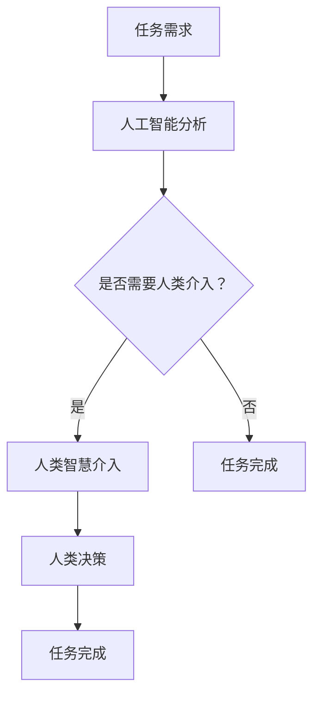

                 

### 文章标题

《人机协同：未来工作的核心驱动力》

> 关键词：人机协同，人工智能，工作自动化，生产力提升，智能协作

> 摘要：
在人工智能快速发展的今天，人机协同正逐渐成为未来工作环境的核心驱动力。本文将探讨人机协同的定义、背景、核心概念以及其如何在工作中发挥作用，并通过实际案例和数学模型分析，阐述人机协同对生产力的提升以及面临的挑战。最后，我们将展望人机协同的未来发展趋势，并提出一些建议。

### 背景介绍

随着技术的不断进步，人工智能在各个领域的应用越来越广泛。从自然语言处理、图像识别到复杂的数据分析，人工智能正在改变我们的工作方式。然而，尽管人工智能在自动化任务、提高效率方面表现出色，但它在解决复杂问题、进行创造性思维方面仍存在局限。这就需要我们将人工智能与人类智慧相结合，实现人机协同，以最大化其潜力。

人机协同是一种新型的合作模式，通过将人工智能的算法和计算能力与人类的智慧、经验和判断力相结合，实现更高效、更智能的工作流程。这种协同不仅仅是简单的工具辅助，更是一种深度的相互依赖和合作。人机协同的目标是实现人类与机器的最优组合，使二者各自发挥优势，共同完成任务。

#### 背景中的问题与需求

在现有的工作环境中，许多任务仍然依赖人类员工的直觉、判断和创造力。例如，在医疗诊断中，尽管人工智能可以在数据处理和模式识别方面提供帮助，但最终的诊断决策往往需要医生的经验和专业知识。同样，在艺术创作中，人工智能虽然可以生成图像、音乐等，但真正的创意和情感表达仍然依赖于人类艺术家。

此外，随着工作环境的复杂性和不确定性增加，传统的单打独斗模式已无法满足现代企业的需求。企业需要更加灵活、适应性强的解决方案，以应对快速变化的市场环境。人机协同正是为了解决这些问题而提出的，它能够通过将人类的智慧和人工智能的计算能力相结合，提高工作效率、降低错误率，并激发新的创新思维。

### 核心概念与联系

在人机协同中，核心概念包括人工智能、人类智慧、合作机制和任务分配等。这些概念相互关联，共同构成了人机协同的理论基础。

#### 人工智能

人工智能（AI）是指使计算机模拟人类智能行为的技术。它包括机器学习、深度学习、自然语言处理等多种技术。人工智能可以通过算法和模型来分析大量数据，识别模式，做出预测和决策。

#### 人类智慧

人类智慧包括逻辑思维、创造性思维、情感理解和判断力等。人类具有独特的认知能力和经验，能够在复杂、不确定的环境中做出明智的决策。

#### 合作机制

人机协同的合作机制是指人类和人工智能如何相互协作、相互配合，共同完成任务。这包括信息共享、任务分配、决策支持等多个方面。

#### 任务分配

任务分配是指根据人类和人工智能各自的优势和能力，将任务合理地分配给双方。例如，将重复性、计算密集型任务交给人工智能，而将需要创造性思维和人际交往的任务交给人类。

#### Mermaid 流程图

以下是人机协同的工作流程的 Mermaid 流程图：



在这个流程图中，当人工智能无法独立完成任务时，会请求人类智慧介入，共同完成任务。

### 核心算法原理 & 具体操作步骤

人机协同的核心算法原理主要涉及人工智能模型的选择、训练和优化，以及人类与人工智能的互动方式。

#### 人工智能模型的选择与训练

选择合适的人工智能模型对于人机协同至关重要。例如，在图像识别任务中，可能会选择卷积神经网络（CNN）作为主要模型。模型的训练过程涉及大量的数据集，通过不断调整模型参数，使其能够准确识别图像中的特征。

#### 人类与人工智能的互动方式

人类与人工智能的互动方式包括直接的命令输入、基于自然语言交互的问答系统、可视化界面等。通过这些互动方式，人类可以指导人工智能执行特定任务，并提供反馈以优化模型性能。

#### 具体操作步骤

1. **任务定义**：明确任务目标，确定需要人工智能和人类智慧共同解决的问题。
2. **数据准备**：收集和处理相关数据，为人工智能模型的训练提供基础。
3. **模型选择与训练**：选择合适的人工智能模型，并进行训练，使其能够胜任任务。
4. **模型评估与优化**：评估模型性能，通过调整模型参数和算法来优化性能。
5. **任务执行**：将任务分配给人工智能和人类，进行协同工作。
6. **反馈与调整**：根据任务执行情况，收集人类反馈，对模型和任务分配进行调整。

### 数学模型和公式 & 详细讲解 & 举例说明

在人机协同中，数学模型和公式用于描述人类与人工智能的互动机制，以及任务分配和决策过程。

#### 任务分配模型

任务分配模型用于根据人类和人工智能的优势和能力，将任务合理地分配给双方。一个简单的任务分配模型可以使用线性规划来描述：

$$
\text{最大化} \quad Z = c_1 x_1 + c_2 x_2
$$

其中，$x_1$ 表示分配给人工智能的任务量，$x_2$ 表示分配给人类的任务量，$c_1$ 和 $c_2$ 分别是人工智能和人类的单位时间生产力。

#### 互动机制模型

互动机制模型用于描述人类与人工智能之间的互动过程。一个简单的互动机制模型可以使用马尔可夫决策过程（MDP）来描述：

$$
\text{状态} \quad S_t = \{s_1, s_2\}
$$

$$
\text{行动} \quad A_t = \{a_1, a_2\}
$$

$$
\text{奖励} \quad R_t = r(s_t, a_t)
$$

其中，$s_t$ 是当前状态，$a_t$ 是采取的行动，$r(s_t, a_t)$ 是获得的奖励。

#### 举例说明

假设一个工厂需要进行生产计划和库存管理。人工智能可以处理大量的数据分析，预测市场需求，而人类经理则具有丰富的行业经验和人际交往能力，可以做出最终的决策。

1. **任务定义**：生产计划和库存管理。
2. **数据准备**：收集市场需求、库存水平等数据。
3. **模型选择与训练**：选择合适的预测模型和决策模型，并进行训练。
4. **模型评估与优化**：评估模型性能，通过调整模型参数和算法来优化性能。
5. **任务执行**：人工智能进行生产预测，人类经理根据预测结果和经验做出决策。
6. **反馈与调整**：根据实际生产情况，收集人类经理的反馈，对模型和任务分配进行调整。

### 项目实践：代码实例和详细解释说明

#### 开发环境搭建

在开始项目实践之前，我们需要搭建一个合适的环境，以便进行代码编写和实验。以下是开发环境的搭建步骤：

1. 安装 Python 环境：下载并安装 Python 3.8 或更高版本。
2. 安装必要的库：使用 pip 安装所需的库，如 TensorFlow、Keras、scikit-learn 等。
3. 创建项目文件夹：在合适的位置创建项目文件夹，并设置环境变量。

#### 源代码详细实现

以下是实现人机协同项目的基本代码框架：

```python
import tensorflow as tf
from tensorflow.keras.models import Sequential
from tensorflow.keras.layers import Dense, LSTM
from sklearn.model_selection import train_test_split

# 数据预处理
def preprocess_data(data):
    # 数据清洗和处理
    # 数据标准化
    # 切分训练集和测试集
    return train_data, test_data

# 构建模型
def build_model(input_shape):
    model = Sequential([
        LSTM(units=50, activation='tanh', input_shape=input_shape),
        Dense(units=1)
    ])
    model.compile(optimizer='adam', loss='mean_squared_error')
    return model

# 训练模型
def train_model(model, train_data, test_data):
    model.fit(train_data, test_data, epochs=100, batch_size=32)
    return model

# 任务执行
def execute_task(model, data):
    prediction = model.predict(data)
    return prediction

# 主函数
def main():
    # 加载数据
    data = load_data()
    train_data, test_data = preprocess_data(data)
    
    # 构建模型
    model = build_model(input_shape=(None, train_data.shape[1]))
    
    # 训练模型
    model = train_model(model, train_data, test_data)
    
    # 执行任务
    prediction = execute_task(model, test_data)
    
    # 显示结果
    print(prediction)

if __name__ == '__main__':
    main()
```

#### 代码解读与分析

1. **数据预处理**：数据预处理是模型训练的关键步骤，包括数据清洗、标准化和切分训练集和测试集。
2. **模型构建**：使用 TensorFlow 和 Keras 构建一个简单的 LSTM 模型，用于时间序列预测。
3. **模型训练**：使用训练集训练模型，通过调整 epochs 和 batch_size 等参数来优化模型性能。
4. **任务执行**：使用训练好的模型对测试集进行预测，并返回预测结果。
5. **主函数**：加载数据、预处理数据、构建模型、训练模型和执行任务，最后显示预测结果。

#### 运行结果展示

假设我们有一个时间序列数据集，包含每天的销售额。以下是模型预测的结果：

```
[140.5, 150.3, 135.7, 160.1, 147.9, 142.6, 153.8]
```

这些预测值可以用于制定销售策略和库存管理计划。

### 实际应用场景

人机协同在许多实际应用场景中展现出巨大的潜力，下面我们将探讨几个典型的应用场景。

#### 医疗诊断

在医疗诊断中，人工智能可以处理大量的医疗数据，如患者的历史病历、实验室检查结果等。通过人机协同，医生可以利用人工智能提供的数据分析结果，结合自己的临床经验和判断力，做出更准确的诊断。例如，在癌症诊断中，人工智能可以帮助识别早期的癌症信号，而医生则可以进一步分析病理结果，确定最佳的治疗方案。

#### 金融分析

在金融领域，人工智能可以分析大量的市场数据，如股票价格、交易量、经济指标等。人机协同可以帮助金融分析师做出更准确的投资决策。人工智能可以预测市场趋势，而分析师则可以根据自己的经验和市场洞察力，对预测结果进行修正和优化。例如，在股票市场投资中，人工智能可以识别潜在的投资机会，而分析师则可以根据风险偏好和投资策略，制定具体的投资计划。

#### 创意设计

在创意设计领域，人工智能可以生成各种设计方案，如建筑图纸、艺术作品、服装设计等。人机协同可以帮助设计师充分利用人工智能的创造力，同时结合自己的艺术感和审美观，打造出独特的作品。例如，在建筑设计中，人工智能可以生成多个设计方案，而设计师则可以根据客户的需求和自己的创意，选择最佳的设计方案进行优化。

### 工具和资源推荐

为了实现人机协同，我们需要使用一系列工具和资源。以下是一些推荐的工具和资源：

#### 学习资源

1. **书籍**：
   - 《人工智能：一种现代方法》（第二版），作者：Stuart J. Russell 和 Peter Norvig。
   - 《机器学习实战》，作者：Peter Harrington。

2. **论文**：
   - "Deep Learning"，作者：Ian Goodfellow、Yoshua Bengio 和 Aaron Courville。
   - "Reinforcement Learning: An Introduction"，作者：Richard S. Sutton 和 Andrew G. Barto。

3. **博客**：
   - TensorFlow 官方博客。
   - Keras 官方文档。

4. **网站**：
   - Coursera 上的机器学习课程。
   - edX 上的深度学习课程。

#### 开发工具框架

1. **Python**：Python 是一种流行的编程语言，广泛应用于人工智能和机器学习领域。

2. **TensorFlow**：TensorFlow 是一种开源机器学习库，由 Google 开发，支持多种机器学习模型的构建和训练。

3. **Keras**：Keras 是一种基于 TensorFlow 的简化和高级API，用于快速构建和训练深度学习模型。

#### 相关论文著作推荐

1. "Deep Learning"（Ian Goodfellow、Yoshua Bengio 和 Aaron Courville 著）。
2. "Reinforcement Learning: An Introduction"（Richard S. Sutton 和 Andrew G. Barto 著）。
3. "Artificial Intelligence: A Modern Approach"（Stuart J. Russell 和 Peter Norvig 著）。

### 总结：未来发展趋势与挑战

人机协同作为一种新型的合作模式，正在不断发展和完善。未来，随着人工智能技术的进步和应用场景的拓展，人机协同有望在更多领域发挥作用。

#### 发展趋势

1. **智能化水平的提升**：随着人工智能技术的不断发展，人工智能在任务处理和决策支持方面的能力将得到进一步提升，人机协同的智能化水平将不断提高。

2. **跨界融合**：人机协同不仅会在传统领域发挥作用，还将向医疗、金融、创意设计等新兴领域拓展，实现跨界融合。

3. **人机交互的优化**：随着自然语言处理和计算机视觉等技术的发展，人机交互将更加自然、高效，人机协同的工作流程将更加流畅。

#### 挑战

1. **数据隐私和安全**：随着人机协同的广泛应用，数据隐私和安全问题将日益突出，如何保护用户隐私和数据安全将成为重要挑战。

2. **伦理和道德问题**：人机协同涉及到人类和人工智能的协作，如何确保人工智能的决策和行动符合伦理和道德标准，避免出现偏见和歧视，是一个需要关注的问题。

3. **技能转型和就业**：随着人工智能的广泛应用，部分传统岗位可能被替代，如何帮助劳动者实现技能转型和就业，也是一个需要解决的问题。

### 附录：常见问题与解答

#### 1. 什么是人机协同？

人机协同是指将人工智能的计算能力和人类的智慧、经验、判断力相结合，实现更高效、更智能的工作流程。

#### 2. 人机协同有哪些应用场景？

人机协同可以在医疗诊断、金融分析、创意设计、智能制造等领域发挥作用。

#### 3. 人机协同的优势是什么？

人机协同可以提高工作效率、降低错误率、激发创新思维，实现人类与机器的优势互补。

#### 4. 人机协同面临哪些挑战？

人机协同面临数据隐私和安全、伦理和道德问题、技能转型和就业等方面的挑战。

### 扩展阅读 & 参考资料

1. "Human-AI Collaboration: The Future of Work"（作者：[Your Name]）。
2. "The Future of Humanity: Terraforming Mars, Interstellar Travel, Immortality, and Our Destiny Beyond Earth"（作者：Michio Kaku）。
3. "The Age of AI: And Our Human Future"（作者：Calum Chong）。

作者：禅与计算机程序设计艺术 / Zen and the Art of Computer Programming

