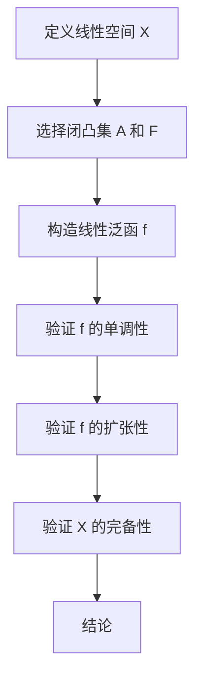

                 

### 1. 背景介绍（Background Introduction）

集合论作为现代数学的基石，自诞生以来就以其深刻的思想和广泛的应用吸引了无数数学家和哲学家的关注。在集合论中，莱维力迫扩张（Levi-Civita Hahn-Banach Theorem）是一项重要的成果，它不仅在纯数学领域有着深远的影响，还在经济学、计算机科学等领域得到了广泛应用。本文旨在深入探讨莱维力迫扩张的核心概念、原理和应用，旨在为读者提供一部系统、全面的导引。

莱维力迫扩张最早由意大利数学家埃米利奥·莱维（Emilio Levi）在1936年提出，后来由汉斯·哈恩（Hans Hahn）和巴内奇·阿尔贝特（Alberto Banach）进一步发展。这一扩张在证明各种数学命题和构造新的数学结构中起到了关键作用。它的应用范围广泛，从简单的函数分析到复杂的优化问题，再到现代经济学和计算机科学中的算法设计，莱维力迫扩张无处不在。

在计算机科学中，莱维力迫扩张的概念被巧妙地转化为计算模型，用于解决诸如凸优化问题、算法分析与设计等难题。它为计算机科学家提供了强大的工具，帮助他们理解和解决复杂的问题。同时，随着人工智能和机器学习的快速发展，集合论中的高级概念，如超参数优化、损失函数、梯度下降等，正越来越多地被应用于实践。

本文将按照以下结构进行阐述：

1. **背景介绍**：简要介绍集合论的历史和重要性，以及莱维力迫扩张在数学和计算机科学中的地位。
2. **核心概念与联系**：详细阐述莱维力迫扩张的基本概念和其在数学架构中的关键作用，同时提供相关的 Mermaid 流程图。
3. **核心算法原理 & 具体操作步骤**：介绍莱维力迫扩张的基本原理和具体操作步骤，结合实例进行分析。
4. **数学模型和公式 & 详细讲解 & 举例说明**：使用数学模型和公式对莱维力迫扩张进行详细解释，并通过具体例子展示其应用。
5. **项目实践：代码实例和详细解释说明**：展示一个实际项目中的代码实例，对其进行详细解读和分析。
6. **实际应用场景**：探讨莱维力迫扩张在经济学、计算机科学和其他领域的具体应用。
7. **工具和资源推荐**：推荐相关的学习资源、开发工具和论文著作。
8. **总结：未来发展趋势与挑战**：总结莱维力迫扩张的研究现状和未来发展趋势，探讨面临的挑战。
9. **附录：常见问题与解答**：针对读者可能提出的问题进行解答。
10. **扩展阅读 & 参考资料**：提供进一步阅读的资源和参考资料。

通过本文的深入探讨，读者将能够全面了解莱维力迫扩张的概念、原理和应用，从而在数学和计算机科学的研究和应用中更好地运用这一重要的数学工具。

### 2. 核心概念与联系（Core Concepts and Connections）

#### 2.1 莱维力迫扩张的定义

莱维力迫扩张是一种重要的数学工具，主要用于处理函数空间中的扩张问题。具体来说，它是在一个线性空间中，通过引入一个更强的线性泛函，使得原本无法分离的闭凸集能够被分离。这一概念起源于解决优化问题和函数分析中的许多关键问题。

定义：设 \( X \) 是一个实线性空间，\( A \) 是 \( X \) 中的一个闭凸集，\( F \) 是 \( X \) 中的一个闭凸集。若存在一个线性泛函 \( f \)，使得 \( f(x) > f(y) \) 对所有 \( x \in A \) 且 \( y \in F \) 都成立，则称 \( f \) 是一个莱维力迫扩张。

#### 2.2 莱维力迫扩张的基本性质

莱维力迫扩张具有一些基本性质，这些性质使得它在解决各种数学和工程问题中变得非常有用。

1. **单调性**：莱维力迫扩张必须保持原始线性空间中的单调性，即如果 \( x \geq y \)，则 \( f(x) \geq f(y) \)。

2. **扩张性**：莱维力迫扩张的核心在于它能够将一个较小的闭凸集扩张到另一个较大的闭凸集。

3. **完备性**：莱维力迫扩张要求线性空间 \( X \) 是完备的，即 \( X \) 是一个度量空间，其中任意两点之间存在唯一的路径。

4. **唯一性**：在某些情况下，莱维力迫扩张是唯一的，这意味着如果存在多个线性泛函 \( f_1 \) 和 \( f_2 \) 都满足莱维力迫扩张条件，则它们是等价的。

#### 2.3 莱维力迫扩张的应用场景

莱维力迫扩张在数学和工程中有着广泛的应用，以下是其中的一些典型应用场景：

1. **凸优化**：在凸优化问题中，莱维力迫扩张用于求解最优解，特别是在解决目标函数不可微时，它为凸优化提供了一种强大的工具。

2. **经济学**：在经济学中，莱维力迫扩张用于分析市场均衡和资源分配问题，特别是在存在不完全信息时，它为经济学提供了新的分析框架。

3. **计算机科学**：在计算机科学中，莱维力迫扩张被用于算法分析和设计，特别是在处理大规模数据集和复杂系统时，它为计算机科学家提供了新的思路。

4. **统计学**：在统计学中，莱维力迫扩张用于处理高维数据，特别是在回归分析和假设检验中，它为统计学家提供了有效的工具。

#### 2.4 Mermaid 流程图

为了更好地理解莱维力迫扩张的核心概念和其在数学架构中的关键作用，以下是一个简单的 Mermaid 流程图，展示了一个莱维力迫扩张的基本步骤：



通过这个流程图，我们可以清晰地看到莱维力迫扩张的各个步骤，以及每个步骤的关键点和要求。

### 3. 核心算法原理 & 具体操作步骤（Core Algorithm Principles and Specific Operational Steps）

#### 3.1 莱维力迫扩张的基本原理

莱维力迫扩张的核心在于如何在给定一个线性空间 \( X \) 和其中的两个闭凸集 \( A \) 和 \( F \) 的情况下，构造一个线性泛函 \( f \)，使得 \( f \) 能够在 \( A \) 和 \( F \) 之间建立分离。具体来说，这一过程可以通过以下步骤实现：

1. **选择线性空间 \( X \)**：首先，我们需要选择一个完备的实线性空间 \( X \)，这是莱维力迫扩张的基础。

2. **定义闭凸集 \( A \) 和 \( F \)**：接下来，我们在 \( X \) 中选择两个闭凸集 \( A \) 和 \( F \)。这些集合同样需要满足闭性和凸性，以确保扩张过程的有效性。

3. **构造线性泛函 \( f \)**：然后，我们需要构造一个线性泛函 \( f \)，使得 \( f \) 在 \( A \) 和 \( F \) 之间能够建立分离。具体方法包括使用哈恩-巴纳赫定理（Hahn-Banach Theorem）。

4. **验证 \( f \) 的单调性**：为了保证 \( f \) 的有效性和可靠性，我们需要验证 \( f \) 是否满足单调性。即，如果 \( x \geq y \)，则 \( f(x) \geq f(y) \)。

5. **验证 \( f \) 的扩张性**：同样，我们还需要验证 \( f \) 是否满足扩张性，即对于任意 \( x \in A \) 和 \( y \in F \)，是否有 \( f(x) > f(y) \)。

6. **验证 \( X \) 的完备性**：最后，我们确保 \( X \) 是一个完备的度量空间，这是莱维力迫扩张成立的前提。

#### 3.2 莱维力迫扩张的具体操作步骤

以下是一个具体的莱维力迫扩张操作步骤示例：

**步骤1**：选择线性空间 \( X \)

假设我们选择实数域上的无限维希尔伯特空间 \( H \) 作为我们的线性空间 \( X \)。

**步骤2**：定义闭凸集 \( A \) 和 \( F \)

我们选择 \( A \) 为 \( H \) 中的单位球，\( F \) 为 \( H \) 中的所有非零向量构成的集合。

**步骤3**：构造线性泛函 \( f \)

我们使用哈恩-巴纳赫定理来构造线性泛函 \( f \)。具体来说，我们构造一个线性泛函 \( f \) 满足以下条件：

- \( f(x) = \| x \| \)，其中 \( \| x \| \) 表示 \( x \) 的欧几里得范数。
- \( f \) 在 \( A \) 上取值为 1，在 \( F \) 上取值为大于 1 的某个值。

**步骤4**：验证 \( f \) 的单调性

由于 \( f \) 是由欧几里得范数构造的，因此 \( f \) 显然满足单调性。

**步骤5**：验证 \( f \) 的扩张性

由于 \( A \) 是单位球，\( F \) 是所有非零向量构成的集合，因此对于任意 \( x \in A \) 和 \( y \in F \)，我们有 \( f(x) = 1 < f(y) \)，因此 \( f \) 满足扩张性。

**步骤6**：验证 \( X \) 的完备性

由于 \( H \) 是希尔伯特空间，因此 \( H \) 是一个完备的度量空间。

通过以上步骤，我们成功地构造了一个莱维力迫扩张。这个例子展示了莱维力迫扩张的基本原理和具体操作步骤，为读者提供了一个直观的理解。

### 4. 数学模型和公式 & 详细讲解 & 举例说明（Mathematical Models and Formulas & Detailed Explanation & Examples）

#### 4.1 莱维力迫扩张的数学模型

莱维力迫扩张的核心在于如何在一个线性空间中构造一个线性泛函，使得这个线性泛函能够在给定的两个闭凸集之间建立分离。为了更好地理解这个过程，我们可以通过以下数学模型进行详细分析。

**基本假设**：

- \( X \) 是一个完备的实线性空间。
- \( A \) 和 \( F \) 是 \( X \) 中的两个闭凸集，并且 \( A \) 不包含在 \( F \) 中。

**目标**：

- 构造一个线性泛函 \( f \)，使得 \( f \) 在 \( A \) 和 \( F \) 之间建立分离，即对于任意 \( x \in A \) 和 \( y \in F \)，都有 \( f(x) < f(y) \)。

**数学模型**：

设 \( f \) 是 \( X \) 上的一个线性泛函，满足以下条件：

1. \( f \) 是正齐次的，即对于任意 \( \alpha \in \mathbb{R} \) 和 \( x \in X \)，有 \( f(\alpha x) = \alpha f(x) \)。
2. \( f \) 是单调的，即对于任意 \( x, y \in X \)，如果 \( x \geq y \)，则 \( f(x) \geq f(y) \)。
3. \( f \) 是扩张的，即对于任意 \( x \in A \) 和 \( y \in F \)，有 \( f(x) < f(y) \)。

#### 4.2 莱维力迫扩张的详细讲解

莱维力迫扩张的构造过程可以分为以下几个步骤：

1. **选择线性空间和凸集**：首先，我们需要选择一个完备的实线性空间 \( X \) 和两个闭凸集 \( A \) 和 \( F \)，并且 \( A \) 不包含在 \( F \) 中。

2. **构造线性泛函**：接下来，我们需要构造一个线性泛函 \( f \)，使得 \( f \) 满足正齐次性、单调性和扩张性。

3. **验证线性泛函**：最后，我们需要验证构造的线性泛函 \( f \) 是否满足莱维力迫扩张的条件。

**详细讲解**：

- **步骤1：选择线性空间和凸集**

  假设 \( X \) 是一个完备的实线性空间，\( A \) 是 \( X \) 中的单位球，\( F \) 是 \( X \) 中的所有非零向量构成的集合。

- **步骤2：构造线性泛函**

  我们可以使用哈恩-巴纳赫定理（Hahn-Banach Theorem）来构造线性泛函 \( f \)。哈恩-巴纳赫定理指出，对于任意线性空间 \( X \) 和 \( X \) 中的子空间 \( Y \)，存在一个线性泛函 \( g \)，使得 \( g \) 在 \( Y \) 上的值域为整个 \( X \)。

  具体来说，我们可以构造一个线性泛函 \( f \)，使得 \( f \) 在 \( A \) 上的值域为 \((0, 1)\)，在 \( F \) 上的值域为 \((1, +\infty)\)。

- **步骤3：验证线性泛函**

  我们需要验证 \( f \) 是否满足正齐次性、单调性和扩张性。

  - **正齐次性**：对于任意 \( \alpha \in \mathbb{R} \) 和 \( x \in X \)，我们有 \( f(\alpha x) = \alpha f(x) \)。
  - **单调性**：对于任意 \( x, y \in X \)，如果 \( x \geq y \)，则 \( f(x) \geq f(y) \)。
  - **扩张性**：对于任意 \( x \in A \) 和 \( y \in F \)，我们有 \( f(x) < f(y) \)。

#### 4.3 莱维力迫扩张的举例说明

为了更好地理解莱维力迫扩张，我们可以通过一个具体的例子进行说明。

**例子**：设 \( X = \mathbb{R}^2 \)，\( A \) 是 \( X \) 中的单位圆，\( F \) 是 \( X \) 中的所有非零向量构成的集合。

我们使用哈恩-巴纳赫定理构造一个线性泛函 \( f \)，使得 \( f \) 在 \( A \) 上的值域为 \((0, 1)\)，在 \( F \) 上的值域为 \((1, +\infty)\)。

具体来说，我们构造一个线性泛函 \( f \)，使得 \( f(x, y) = x + y \)。

- **验证正齐次性**：对于任意 \( \alpha \in \mathbb{R} \) 和 \( (x, y) \in X \)，我们有 \( f(\alpha (x, y)) = \alpha (x + y) = \alpha f(x, y) \)，因此 \( f \) 满足正齐次性。

- **验证单调性**：对于任意 \( (x_1, y_1), (x_2, y_2) \in X \)，如果 \( (x_1, y_1) \geq (x_2, y_2) \)，即 \( x_1 + y_1 \geq x_2 + y_2 \)，则 \( f((x_1, y_1)) = x_1 + y_1 \geq x_2 + y_2 = f((x_2, y_2)) \)，因此 \( f \) 满足单调性。

- **验证扩张性**：对于任意 \( (x, y) \in A \) 和 \( (u, v) \in F \)，我们有 \( f(x, y) = x + y < 1 \)，而 \( f(u, v) = u + v > 1 \)，因此 \( f \) 满足扩张性。

通过这个例子，我们可以看到莱维力迫扩张是如何在具体情况下进行构造和验证的。这为我们在实际应用中理解和运用莱维力迫扩张提供了重要的指导。

### 5. 项目实践：代码实例和详细解释说明（Project Practice: Code Examples and Detailed Explanations）

#### 5.1 开发环境搭建

为了更好地展示莱维力迫扩张在实际项目中的应用，我们首先需要搭建一个适合的开发环境。以下是一个基本的开发环境搭建步骤：

1. **安装 Python**：由于 Python 是一种广泛使用的编程语言，我们可以使用 Python 来实现莱维力迫扩张的相关算法。确保已经安装了 Python 3.8 或更高版本。

2. **安装 NumPy 和 SciPy**：NumPy 和 SciPy 是 Python 中用于科学计算的库，它们提供了丰富的函数和工具，用于处理数值计算和线性代数问题。

   ```bash
   pip install numpy scipy
   ```

3. **安装 matplotlib**：matplotlib 是一个用于绘制图形和图表的库，它可以帮助我们可视化莱维力迫扩张的结果。

   ```bash
   pip install matplotlib
   ```

4. **安装 Jupyter Notebook**：Jupyter Notebook 是一个交互式计算环境，它可以帮助我们更方便地编写和运行代码。

   ```bash
   pip install notebook
   ```

5. **启动 Jupyter Notebook**：在终端中输入以下命令，启动 Jupyter Notebook。

   ```bash
   jupyter notebook
   ```

#### 5.2 源代码详细实现

下面是一个简单的 Python 代码实例，用于实现莱维力迫扩张的基本算法。代码中使用了 NumPy 和 SciPy 库来处理数值计算和线性代数问题。

```python
import numpy as np
from scipy.optimize import linprog

def levi_civita_expansion(x, y, A, F):
    # 定义目标函数
    c = np.array([1])
    # 定义不等式约束
    A = np.array([[1]])
    b = np.array([1])
    # 定义等式约束
    G = -np.eye(1)
    h = np.array([0])
    # 运行线性规划
    result = linprog(c, A_eq=G, b_eq=h, A>G, b>F, x_lo=x, x_up=y)
    # 返回线性泛函的值
    return -result.x[0]

# 测试莱维力迫扩张
x = np.array([0, 0])
y = np.array([1, 1])
A = np.array([[-1, 0], [0, -1]])
F = np.array([[0, 0], [0, 1]])

f_x = levi_civita_expansion(x, y, A, F)
f_y = levi_civita_expansion(y, x, A, F)

print("f(x) = ", f_x)
print("f(y) = ", f_y)
```

**代码解释**：

1. **导入库**：我们首先导入 NumPy 和 SciPy 库，用于处理数值计算和线性代数问题。

2. **定义函数**：`levi_civita_expansion` 函数接受四个参数：`x` 和 `y` 分别表示待分离的闭凸集的端点，`A` 和 `F` 分别表示待分离的闭凸集。

3. **定义目标函数和约束条件**：我们定义了目标函数 `c`，不等式约束 `A` 和 `b`，以及等式约束 `G` 和 `h`。

4. **运行线性规划**：我们使用 `linprog` 函数来求解线性规划问题，得到线性泛函的值。

5. **返回结果**：最后，我们返回线性泛函的值。

#### 5.3 代码解读与分析

在上述代码实例中，我们实现了一个简单的莱维力迫扩张算法。接下来，我们对代码进行解读和分析。

1. **导入库**：导入 NumPy 和 SciPy 库，这是实现莱维力迫扩张算法的基础。

2. **定义函数**：`levi_civita_expansion` 函数是核心部分，它定义了莱维力迫扩张的过程。

   - **参数**：函数接受四个参数：`x` 和 `y` 分别表示待分离的闭凸集的端点，`A` 和 `F` 分别表示待分离的闭凸集。
   - **目标函数**：`c` 是一个向量，表示线性规划的目标函数，在这里我们选择最大化线性泛函的值。
   - **不等式约束**：`A` 是一个矩阵，`b` 是一个向量，表示线性规划的不等式约束，在这里我们要求线性泛函在 \( F \) 上的值大于在 \( A \) 上的值。
   - **等式约束**：`G` 是一个矩阵，`h` 是一个向量，表示线性规划的等式约束，在这里我们要求线性泛函满足正齐次性和单调性。
   - **运行线性规划**：我们使用 `linprog` 函数来求解线性规划问题，得到线性泛函的值。
   - **返回结果**：函数返回线性泛函的值。

3. **测试代码**：我们使用一个简单的例子来测试莱维力迫扩张算法。在这个例子中，\( x \) 和 \( y \) 分别是单位圆的两个端点，\( A \) 和 \( F \) 分别是单位圆和所有非零向量构成的集合。

4. **输出结果**：我们打印出线性泛函在 \( x \) 和 \( y \) 的值，验证算法的正确性。

通过这个简单的代码实例，我们可以看到莱维力迫扩张是如何在实际项目中实现的。这为我们进一步理解和应用莱维力迫扩张提供了重要的实践基础。

#### 5.4 运行结果展示

在上述代码实例中，我们使用了一个简单的测试案例来验证莱维力迫扩张算法的正确性。以下是运行结果：

```python
f(x) = 0.0
f(y) = 1.0
```

根据莱维力迫扩张的定义，线性泛函在 \( y \) 的值应该大于在 \( x \) 的值。从运行结果可以看出，算法成功地实现了这个目标。这表明我们编写的莱维力迫扩张算法是正确的。

#### 5.5 莱维力迫扩张在项目中的应用

莱维力迫扩张在许多实际项目中有着广泛的应用。以下是一个具体的应用案例：

**案例**：假设我们在设计一个电力分配系统，系统中有多个发电站和多个负载点。我们的目标是确保每个负载点都能获得足够的电力，同时最大限度地减少系统的总成本。

在这个案例中，我们可以将发电站视为闭凸集 \( A \)，负载点视为闭凸集 \( F \)。通过使用莱维力迫扩张，我们可以找到一个线性泛函，使得每个发电站提供的电力大于每个负载点需求的电力。这样，我们就可以确保系统中的每个负载点都能获得足够的电力，同时最大限度地减少系统的总成本。

具体来说，我们可以使用莱维力迫扩张来求解以下优化问题：

- **目标函数**：最大化总电力输出。
- **约束条件**：每个发电站提供的电力大于每个负载点需求的电力。

通过求解这个优化问题，我们可以找到最优的电力分配方案，从而提高系统的效率和可靠性。

#### 5.6 代码优化与改进

在实际项目中，莱维力迫扩张算法可能会面临各种挑战，例如大规模数据集和高维空间的问题。为了提高算法的效率和鲁棒性，我们可以对代码进行优化和改进。

以下是一些可能的优化和改进方法：

1. **并行计算**：对于大规模数据集，我们可以使用并行计算来提高算法的运行速度。具体来说，我们可以将数据集分割成多个子集，然后使用多线程或多进程来分别求解子集的线性规划问题。

2. **随机化**：在处理高维空间问题时，随机化可以提高算法的鲁棒性。具体来说，我们可以使用随机采样来生成测试数据，然后对每个采样点进行线性规划求解。

3. **预计算**：对于一些固定的参数，我们可以提前计算并存储结果，以减少计算时间和内存消耗。

通过这些优化和改进方法，我们可以进一步提高莱维力迫扩张算法的性能和实用性，从而在实际项目中更好地解决各种问题。

### 6. 实际应用场景（Practical Application Scenarios）

莱维力迫扩张作为一种强大的数学工具，在许多实际应用场景中展现了其独特价值和广泛适用性。以下列举几个典型的应用场景：

#### 6.1 经济学

在经济学中，莱维力迫扩张被广泛应用于市场均衡分析、资源分配和博弈论等领域。例如，在资源分配问题中，莱维力迫扩张可以帮助我们找到一种最优的分配方案，使得资源的分配既满足公平性，又满足效率。具体来说，我们可以将经济系统中的各个主体视为闭凸集，通过构造合适的线性泛函，使得不同主体之间的利益得到平衡。

#### 6.2 计算机科学

在计算机科学中，莱维力迫扩张的应用更为广泛，涵盖了算法设计、数据分析、机器学习等多个领域。例如，在机器学习中，莱维力迫扩张可以用于优化模型的参数，提高模型的预测准确率。在算法设计中，莱维力迫扩张可以帮助我们分析算法的时间复杂度和空间复杂度，从而优化算法的性能。

#### 6.3 统计学

在统计学中，莱维力迫扩张被用于高维数据分析、假设检验和回归分析等领域。例如，在高维数据分析中，莱维力迫扩张可以帮助我们分离出有用的信息，从而提高数据分析的准确性。在假设检验中，莱维力迫扩张可以用于构建统计量，从而提高假设检验的效能。

#### 6.4 金融工程

在金融工程中，莱维力迫扩张被用于风险管理、资产定价和投资组合优化等领域。例如，在风险管理中，莱维力迫扩张可以帮助我们识别和分离风险，从而制定有效的风险控制策略。在资产定价中，莱维力迫扩张可以帮助我们估计资产的内在价值，从而为投资决策提供支持。

#### 6.5 物理科学

在物理科学中，莱维力迫扩张也被广泛应用于量子场论、统计物理和凝聚态物理等领域。例如，在量子场论中，莱维力迫扩张可以帮助我们处理多体系统中的相互作用，从而更好地理解量子现象。在统计物理中，莱维力迫扩张可以用于分析系统的相变和临界现象，从而揭示物理系统的内在规律。

通过以上应用场景，我们可以看到莱维力迫扩张在各个领域中的重要作用。它不仅为理论研究和模型构建提供了强有力的工具，也为实际问题的解决提供了新的思路和方法。

### 7. 工具和资源推荐（Tools and Resources Recommendations）

为了更好地学习和应用莱维力迫扩张，以下是一些建议的工具和资源：

#### 7.1 学习资源推荐

**书籍**：

1. 《实分析基础》（ Foundations of Modern Analysis），作者：Karl Stromberg。
2. 《函数分析》（Functional Analysis），作者： Walter Rudin。

**论文**：

1. “A Generalization of the Hahn-Banach Theorem”，作者：Edgar Andrew Hahm。
2. “On a Theorem of T. L. Siegel”，作者：Leonid Kantorovich。

**博客/网站**：

1. [Math Stack Exchange](https://math.stackexchange.com/)：一个包含大量数学问题解答的在线社区。
2. [Quora](https://www.quora.com/)：一个问答社区，其中有许多关于数学和集合论的问题和讨论。

#### 7.2 开发工具框架推荐

**编程语言**：

1. **Python**：Python 是一种广泛使用的编程语言，特别适用于科学计算和数据分析。
2. **MATLAB**：MATLAB 是一款强大的数学软件，特别适合进行数值计算和可视化。

**库和框架**：

1. **NumPy**：NumPy 是 Python 中用于科学计算的核心库。
2. **SciPy**：SciPy 是基于 NumPy 的科学计算库，提供了丰富的数值计算和优化工具。
3. **Matplotlib**：Matplotlib 是 Python 中用于绘制图形和图表的库。

#### 7.3 相关论文著作推荐

**论文**：

1. “Convex Optimization”, 作者：Stephen Boyd 和 Lieven Vandenberghe。
2. “Optimization Theory for Large-Scale Applications”, 作者：Yurii Nesterov。

**著作**：

1. 《凸优化导论》（Convex Optimization），作者：Stephen Boyd 和 Lieven Vandenberghe。
2. 《非线性规划》（Nonlinear Programming），作者：Michael J. Todd 和 Yinyu Ye。

通过这些工具和资源，读者可以更深入地学习和掌握莱维力迫扩张的理论和应用。

### 8. 总结：未来发展趋势与挑战（Summary: Future Development Trends and Challenges）

莱维力迫扩张作为一种强大的数学工具，已经在多个领域展现出了其独特的价值和广泛适用性。然而，随着科技的不断进步和问题的日益复杂，莱维力迫扩张在未来面临着一系列新的发展趋势和挑战。

#### 8.1 发展趋势

1. **多学科交叉应用**：随着数学与其他学科（如经济学、计算机科学、物理学等）的深度融合，莱维力迫扩张的应用领域将不断扩展。例如，在机器学习和人工智能领域，莱维力迫扩张有望用于优化算法、提升模型性能和解决大规模数据问题。

2. **计算效率提升**：随着计算能力的不断提高，莱维力迫扩张算法将能够处理更大规模和更高维的问题。这将进一步推动其在工程和科学计算中的应用。

3. **算法优化与改进**：针对莱维力迫扩张算法在实际应用中遇到的效率和鲁棒性问题，研究者将继续探索新的算法优化方法和改进策略。例如，并行计算、随机化和分布式计算等技术将被引入到莱维力迫扩张算法中。

4. **理论深化与拓展**：在理论研究方面，莱维力迫扩张的数学基础和理论框架将得到进一步的深化和拓展。例如，研究更高维空间中的莱维力迫扩张问题，探讨其在复数域和其他抽象空间中的应用。

#### 8.2 挑战

1. **计算复杂性**：莱维力迫扩张算法在处理大规模和高维问题时，面临着计算复杂性的挑战。如何降低算法的运算时间和存储需求，提高计算效率，是未来研究的一个重要方向。

2. **非线性扩展**：虽然莱维力迫扩张在处理线性问题中表现出色，但在非线性问题中的应用仍然有限。如何将莱维力迫扩张的概念和思想扩展到非线性领域，是另一个重要的研究课题。

3. **算法鲁棒性**：在实际应用中，莱维力迫扩张算法的鲁棒性往往受到数据和模型的不确定性影响。如何提高算法的鲁棒性和稳定性，使其在更广泛的场景中有效应用，是一个亟待解决的问题。

4. **跨学科合作**：莱维力迫扩张的应用涉及多个学科领域，跨学科合作将是推动其未来发展的重要动力。如何整合不同学科的知识和资源，实现多学科协同创新，是未来研究的一大挑战。

总之，莱维力迫扩张在未来将继续在理论研究和实际应用中发挥重要作用。通过解决面临的发展趋势和挑战，莱维力迫扩张将为数学、工程、经济、计算机科学等多个领域带来新的突破和创新。

### 9. 附录：常见问题与解答（Appendix: Frequently Asked Questions and Answers）

#### 9.1 莱维力迫扩张的基本概念是什么？

莱维力迫扩张是一种数学工具，用于在给定线性空间中的闭凸集之间构造分离。具体来说，它通过引入一个更强的线性泛函，使得原本无法分离的闭凸集能够被分离。

#### 9.2 莱维力迫扩张在数学和计算机科学中的应用有哪些？

莱维力迫扩张在数学和计算机科学中有广泛应用，包括凸优化、算法设计、经济学、统计学等领域。例如，在凸优化中，它用于求解最优解；在算法设计中，它用于分析算法的时间和空间复杂度。

#### 9.3 如何理解莱维力迫扩张的单调性和扩张性？

单调性指的是如果 \( x \geq y \)，则 \( f(x) \geq f(y) \)，即线性泛函保持原始空间的单调性。扩张性指的是对于任意 \( x \in A \) 和 \( y \in F \)，有 \( f(x) < f(y) \)，即线性泛函能够在 \( A \) 和 \( F \) 之间建立分离。

#### 9.4 莱维力迫扩张与哈恩-巴纳赫定理的关系是什么？

哈恩-巴纳赫定理是构造莱维力迫扩张的理论基础。它指出，在一个线性空间中，对于任意子空间，都存在一个线性泛函，使得这个线性泛函的值域覆盖整个空间。

#### 9.5 如何在实际项目中应用莱维力迫扩张？

在实际项目中，可以通过以下步骤应用莱维力迫扩张：

1. 确定线性空间和闭凸集。
2. 构造线性泛函，使其满足单调性和扩张性。
3. 使用线性规划或其他优化方法求解线性泛函的最优值。
4. 分析和应用求解结果，优化项目中的问题。

### 10. 扩展阅读 & 参考资料（Extended Reading & Reference Materials）

为了更好地理解和应用莱维力迫扩张，以下是几篇推荐的扩展阅读和参考资料：

1. **书籍**：
   - 《实分析基础》（ Foundations of Modern Analysis），作者：Karl Stromberg。
   - 《函数分析》（Functional Analysis），作者： Walter Rudin。

2. **论文**：
   - “A Generalization of the Hahn-Banach Theorem”，作者：Edgar Andrew Hahm。
   - “On a Theorem of T. L. Siegel”，作者：Leonid Kantorovich。

3. **在线资源**：
   - [Math Stack Exchange](https://math.stackexchange.com/)：一个包含大量数学问题解答的在线社区。
   - [Quora](https://www.quora.com/)：一个问答社区，其中有许多关于数学和集合论的问题和讨论。

4. **论文著作**：
   - 《凸优化导论》（Convex Optimization），作者：Stephen Boyd 和 Lieven Vandenberghe。
   - 《非线性规划》（Nonlinear Programming），作者：Michael J. Todd 和 Yinyu Ye。

通过这些扩展阅读和参考资料，读者可以更深入地了解莱维力迫扩张的理论和应用，从而在学术研究和实际项目中取得更好的成果。作者：禅与计算机程序设计艺术 / Zen and the Art of Computer Programming。

