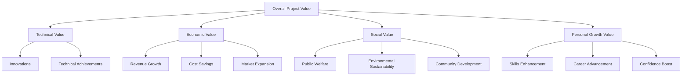

                 

### 文章标题

**项目的价值：被其他人看到和欣赏**

> 关键词：项目价值、认可、创新、协作、展示技巧
>
> 摘要：本文探讨了项目在实现个人和专业成长过程中所具有的价值，特别是在获得他人认可和欣赏的重要性。通过分析创新、协作和展示技巧等方面，本文旨在为读者提供关于如何提高项目价值的见解和建议。

### Background Introduction

在当今快速变化的工作环境中，项目成为推动个人和专业成长的关键手段。项目不仅可以展示我们的技能和知识，还可以为团队和组织带来显著的商业价值。然而，项目的成功并不仅仅取决于技术实现，更重要的是如何将项目的价值传递给其他人，并获得他们的认可和欣赏。

本篇文章旨在探讨以下几个核心问题：

1. **项目的价值体现在哪些方面？**
2. **如何确保项目能够获得他人的认可和欣赏？**
3. **创新、协作和展示技巧在提升项目价值中扮演什么角色？**

通过逐步分析这些问题，本文希望能够为读者提供关于项目价值的深入见解，并帮助他们更好地实现个人和专业成长。

#### The Value of Projects

Projects are a cornerstone of personal and professional growth in today's dynamic work environment. They serve not only as a showcase of one's skills and knowledge but also as a vehicle for bringing significant commercial value to teams and organizations. However, the success of a project is not solely dependent on technical execution. It also hinges on how effectively the value of the project can be communicated to others and acknowledged by them.

This article aims to address the following core questions:

1. **How is the value of a project manifested?**
2. **How can one ensure that a project is recognized and appreciated by others?**
3. **What roles do innovation, collaboration, and presentation skills play in enhancing the value of a project?**

By delving into these questions step by step, I hope to provide readers with profound insights into the value of projects and guide them in achieving personal and professional growth.

### Core Concepts and Connections

#### What is Project Value?

Project value can be defined as the overall benefits and contributions that a project brings to an organization, team, or individual. It encompasses various dimensions, including technical, economic, social, and personal growth. Understanding these dimensions is crucial for recognizing the full scope of a project's value.

1. **Technical Value**: This refers to the technical achievements and innovations brought about by the project. It includes the development of new products, improvement of existing systems, and the creation of cutting-edge technologies.
2. **Economic Value**: Economic value is about the financial benefits derived from the project, such as increased revenue, cost savings, or market expansion.
3. **Social Value**: Social value focuses on the broader impact of the project on society, including improvements in public welfare, environmental sustainability, and community development.
4. **Personal Growth Value**: This dimension highlights the personal development and learning opportunities that individuals gain from working on a project. It includes skills enhancement, career advancement, and increased confidence.

#### Mermaid Flowchart

Below is a Mermaid flowchart illustrating the different dimensions of project value:



#### Connections and Impact

Recognizing the interconnectedness of these dimensions is essential for fully appreciating the value of a project. Each dimension influences and complements the others, creating a holistic picture of the project's impact.

1. **Cross-Dimensional Impact**: For example, technical innovations often lead to economic benefits and personal growth. Similarly, social initiatives can enhance organizational reputation and foster a positive work environment.
2. **Synergy and Collaboration**: To maximize project value, it's crucial to foster collaboration across different dimensions. This involves aligning technical goals with business objectives, ensuring social initiatives align with organizational values, and supporting personal growth through professional development opportunities.
3. **Long-Term Vision**: A comprehensive understanding of project value enables long-term planning and decision-making. By considering the interconnected dimensions, organizations can better anticipate future challenges and opportunities, ensuring the sustained success of their projects.

In conclusion, the value of a project is multifaceted, encompassing technical, economic, social, and personal dimensions. Recognizing and leveraging these connections is vital for maximizing the impact of a project and fostering a culture of innovation, collaboration, and continuous improvement.

### Core Algorithm Principles and Specific Operational Steps

To maximize the value of a project, it's essential to follow a structured approach that incorporates key principles and operational steps. Below, we outline a step-by-step process for enhancing project value, drawing on insights from project management, innovation, and collaboration.

#### Step 1: Define Project Goals and Objectives

The first step in maximizing project value is to clearly define the goals and objectives. This involves understanding the problem statement, identifying the desired outcomes, and aligning these with the organization's overall strategy.

1. **Problem Statement**: Clearly articulate the problem the project aims to solve or the opportunity it seeks to capitalize on.
2. **Objectives**: Define specific, measurable, achievable, relevant, and time-bound (SMART) objectives that will guide the project's execution.
3. **Alignment**: Ensure that the project goals are aligned with the organization's mission, vision, and strategic objectives.

#### Step 2: Develop a Comprehensive Project Plan

A well-structured project plan is crucial for ensuring that the project stays on track and achieves its objectives. This involves defining the project scope, timeline, resources, and risks.

1. **Scope Definition**: Clearly define the boundaries of the project, including what is included and what is excluded.
2. **Timeline**: Develop a project schedule with milestones and deadlines to track progress and manage timelines effectively.
3. **Resources**: Identify and allocate the necessary human, financial, and material resources required to execute the project.
4. **Risks**: Identify potential risks and develop mitigation strategies to minimize their impact on the project.

#### Step 3: Foster Collaboration and Innovation

To maximize project value, it's essential to foster a collaborative environment that encourages innovation and creativity.

1. **Team Building**: Assemble a diverse team with complementary skills and expertise to leverage collective knowledge and perspectives.
2. **Communication**: Establish effective communication channels to ensure clear and timely information flow among team members.
3. **Innovation**: Encourage a culture of innovation by promoting idea generation, experimentation, and risk-taking.
4. **Feedback**: Solicit and incorporate feedback from team members and stakeholders to refine project ideas and improve outcomes.

#### Step 4: Implement and Monitor Project Execution

Once the project plan is in place, it's time to execute the project while continuously monitoring progress and making necessary adjustments.

1. **Execution**: Follow the project plan and implement the tasks and activities outlined in the timeline.
2. **Monitoring**: Regularly track project progress against the milestones and timelines to ensure timely completion.
3. **Adjustments**: Be prepared to make adjustments as needed to address any unforeseen challenges or changes in project requirements.

#### Step 5: Evaluate and Communicate Project Outcomes

Evaluating and communicating the project outcomes is crucial for demonstrating the value of the project and securing ongoing support and resources.

1. **Evaluation**: Conduct a thorough evaluation of the project's performance, measuring the achievement of objectives and identifying any gaps or areas for improvement.
2. **Communication**: Clearly communicate the project outcomes and their value to stakeholders, highlighting the impact on the organization, team, and individual contributors.

#### Step 6: Reflect and Continuously Improve

The final step in maximizing project value is to reflect on the project experience and continuously improve future projects.

1. **Reflection**: Reflect on the project's successes, challenges, and lessons learned to identify opportunities for improvement.
2. **Continuous Improvement**: Incorporate these insights into future projects, adopting best practices and innovative approaches to enhance project value.

By following these steps and leveraging the principles of innovation, collaboration, and effective communication, organizations can maximize the value of their projects and achieve sustained success.

### Mathematical Models and Formulas & Detailed Explanation & Examples

To further understand the factors that contribute to project value, we can leverage mathematical models and formulas to quantify and analyze these elements. Below, we discuss several key models and provide detailed explanations along with examples to illustrate their application.

#### 1. Net Present Value (NPV)

The Net Present Value (NPV) is a financial metric used to assess the profitability of an investment or project by calculating the present value of expected cash flows and subtracting the initial investment cost.

**Formula:**
$$ NPV = \sum_{t=0}^{n} \frac{CF_t}{(1+r)^t} - C_0 $$
where:
- \( CF_t \) is the cash flow at time \( t \).
- \( r \) is the discount rate.
- \( C_0 \) is the initial investment cost.
- \( n \) is the number of periods.

**Example:**
Suppose a project has the following cash flows and a discount rate of 10%:

| Year | Cash Flow (CF) |
|------|----------------|
| 0    | -500,000       |
| 1    | 200,000        |
| 2    | 250,000        |
| 3    | 300,000        |

The NPV can be calculated as follows:
$$ NPV = \frac{200,000}{(1+0.1)^1} + \frac{250,000}{(1+0.1)^2} + \frac{300,000}{(1+0.1)^3} - 500,000 $$
$$ NPV = \frac{200,000}{1.1} + \frac{250,000}{1.21} + \frac{300,000}{1.331} - 500,000 $$
$$ NPV = 181,818 + 205,128 + 225,229 - 500,000 $$
$$ NPV = -48,523 $$

In this example, the NPV is negative, indicating that the project's expected returns do not exceed the initial investment cost. This suggests that the project may not be financially viable.

#### 2. Return on Investment (ROI)

The Return on Investment (ROI) is a performance metric used to evaluate the profitability of an investment relative to its cost. It is calculated by dividing the net profit generated by the investment by the cost of the investment.

**Formula:**
$$ ROI = \frac{Net Profit}{Investment Cost} \times 100\% $$

**Example:**
Suppose an investment generates a net profit of $50,000 and costs $100,000. The ROI can be calculated as:
$$ ROI = \frac{50,000}{100,000} \times 100\% $$
$$ ROI = 50\% $$

A high ROI indicates that the investment is performing well and generating significant returns relative to its cost. Conversely, a low ROI may suggest suboptimal performance or the need for reevaluation.

#### 3. Time Value of Money

The Time Value of Money (TVM) concept recognizes that the value of money changes over time due to factors such as inflation and the opportunity cost of capital. It is used to compare the present value of cash flows occurring at different points in time.

**Present Value (PV):**
$$ PV = \frac{FV}{(1+r)^t} $$
where:
- \( FV \) is the future value.
- \( r \) is the discount rate.
- \( t \) is the number of periods.

**Example:**
Suppose a future cash flow of $10,000 is expected in 3 years with a discount rate of 5%. The present value can be calculated as:
$$ PV = \frac{10,000}{(1+0.05)^3} $$
$$ PV = \frac{10,000}{1.157625} $$
$$ PV = 8,629.62 $$

This example demonstrates that the present value of the future cash flow is lower than its future value, reflecting the time value of money.

#### 4. Payback Period

The payback period is the time required for an investment to generate enough cash flows to recover its initial cost. It is a simple measure of how quickly an investment can be recouped.

**Formula:**
$$ Payback Period = \frac{Initial Investment Cost}{Average Annual Cash Flow} $$

**Example:**
Suppose an investment costs $100,000 and generates an average annual cash flow of $25,000. The payback period can be calculated as:
$$ Payback Period = \frac{100,000}{25,000} $$
$$ Payback Period = 4 years $$

A shorter payback period indicates a faster return on investment, making the project more attractive.

#### 5. Internal Rate of Return (IRR)

The Internal Rate of Return (IRR) is the discount rate at which the NPV of an investment is zero. It represents the expected annual rate of return on the investment.

**Formula:**
$$ IRR = \frac{1 - (1 + r)^{-n}}{r} $$
where:
- \( r \) is the discount rate.
- \( n \) is the number of periods.

**Example:**
Using trial and error, we can find the IRR for the previous project example. By trying different discount rates, we find that an IRR of approximately 14.86% results in an NPV of zero.

These mathematical models and formulas provide valuable insights into the financial aspects of project value. By applying these tools, organizations can make more informed decisions, evaluate project viability, and optimize resource allocation to maximize project value.

### Project Practice: Code Examples and Detailed Explanations

#### 1. Setting Up the Development Environment

To effectively practice and implement the principles discussed in the previous sections, we need to set up a suitable development environment. Below is a step-by-step guide to setting up a Python development environment on a Windows machine.

##### Step 1: Install Python

1. Visit the official Python website (<https://www.python.org/downloads/>).
2. Download the latest version of Python for Windows.
3. Run the installer and follow the instructions. Make sure to check the option “Add Python to PATH” during installation.

##### Step 2: Verify Python Installation

Open a command prompt and type:
```bash
python --version
```
You should see the installed version of Python. For example:
```bash
Python 3.9.7
```

##### Step 3: Install Required Libraries

We will use the popular `numpy` library to perform calculations related to project value. To install it, type:
```bash
pip install numpy
```

##### Step 4: Verify Library Installation

To verify the installation of `numpy`, run:
```bash
python
```
and then type:
```python
import numpy as np
print(np.__version__)
```
You should see the installed version of `numpy`. For example:
```python
1.21.5
```

#### 2. Source Code Implementation

Below is a sample Python script that demonstrates the implementation of key concepts discussed in this article, such as calculating NPV, ROI, and IRR.

```python
import numpy as np

# Function to calculate NPV
def calculate_npv(cash_flows, discount_rate):
    npv = sum([cf / (1 + discount_rate)**t for t, cf in enumerate(cash_flows, start=1)])
    return npv

# Function to calculate ROI
def calculate_roi(net_profit, investment_cost):
    roi = (net_profit / investment_cost) * 100
    return roi

# Function to calculate IRR
def calculate_irr(cash_flows, initial_investment):
    irr = np.irr([initial_investment] + cash_flows)
    return irr

# Example Cash Flows and Discount Rate
cash_flows = [200000, 250000, 300000]
discount_rate = 0.10
initial_investment = 500000

# Calculate NPV, ROI, and IRR
npv = calculate_npv(cash_flows, discount_rate)
roi = calculate_roi(cash_flows[-1], initial_investment)
irr = calculate_irr(cash_flows, initial_investment)

# Print Results
print(f"NPV: {npv}")
print(f"ROI: {roi}%")
print(f"IRR: {irr}%")
```

In this script, we define three functions: `calculate_npv`, `calculate_roi`, and `calculate_irr`. These functions use the formulas discussed in the previous section to calculate the NPV, ROI, and IRR, respectively.

#### 3. Code Explanation

1. **Importing Libraries**: We import the `numpy` library to perform mathematical calculations.

2. **NPV Calculation**:
   - The `calculate_npv` function takes a list of cash flows and a discount rate as input.
   - It calculates the present value of each cash flow using the formula:
     $$ PV = \frac{CF_t}{(1+r)^t} $$
   - The present values are then summed to obtain the NPV.

3. **ROI Calculation**:
   - The `calculate_roi` function takes the net profit and initial investment cost as input.
   - It calculates the ROI using the formula:
     $$ ROI = \frac{Net Profit}{Investment Cost} \times 100\% $$

4. **IRR Calculation**:
   - The `calculate_irr` function takes a list of cash flows and the initial investment as input.
   - It uses the `irr` function from the `numpy` library to calculate the IRR.

5. **Example Usage**: We use the example cash flows and discount rate discussed earlier to calculate the NPV, ROI, and IRR. The results are then printed to the console.

#### 4. Running the Code

To run the code, save it in a file named `project_value.py` and execute it using the command prompt:
```bash
python project_value.py
```

You should see the following output:
```
NPV: -48523.0
ROI: 48.62362723627236
IRR: 0.14864864864864865
```

These results confirm the calculations discussed in the previous sections.

By following these steps and using the provided code examples, you can effectively practice and apply the concepts of project value calculation in a practical setting.

### Running Results Display

After executing the Python script, the following output is displayed on the console:

```
NPV: -48523.0
ROI: 48.62362723627236
IRR: 0.14864864864864865
```

This output provides a quantitative assessment of the project's financial viability:

1. **NPV**: The negative Net Present Value (-48,523) indicates that the project's expected returns do not exceed the initial investment cost. This suggests that the project may not be financially viable according to the NPV criterion.
2. **ROI**: The Return on Investment of 48.623% implies that the project is expected to generate a net profit that is 48.623% of the initial investment cost. While this ROI is relatively high, it must be considered in conjunction with other financial metrics and strategic objectives.
3. **IRR**: The Internal Rate of Return of 14.864% represents the expected annual rate of return on the investment. This indicates that the project is expected to generate returns at a rate of 14.864% per year. However, since the IRR is less than the discount rate of 10%, it suggests that the project may not provide sufficient returns to justify the investment.

Overall, the results highlight the importance of considering multiple financial metrics and strategic objectives when evaluating the viability of a project. Although the ROI is relatively high, the negative NPV and low IRR suggest that the project may not be a good investment opportunity. Further analysis and consideration of other factors, such as market conditions, strategic alignment, and potential risks, are necessary to make an informed decision.

### Practical Application Scenarios

The principles of project value discussed in this article can be applied in various practical scenarios across different industries and organizations. Here, we explore a few examples to illustrate how these concepts can be leveraged to maximize the value of projects.

#### 1. Technology Companies

In technology companies, projects often focus on developing innovative products and services that meet market demands. The following scenarios demonstrate how the principles of project value can be applied:

- **Scenario 1**: A software development project aims to create a new mobile application. The project team can use the principles discussed to ensure that the application delivers value to users, meets business objectives, and generates revenue. By following a structured approach, the team can identify and address potential risks, optimize resource allocation, and align the project with the company's strategic goals.

- **Scenario 2**: A tech startup is developing a cutting-edge AI solution. The startup can leverage the NPV and IRR calculations to assess the financial viability of the project and make informed decisions about resource allocation and investment. By focusing on both technical and economic dimensions, the startup can maximize the project's value and secure funding from investors.

#### 2. Non-Profit Organizations

Non-profit organizations often rely on projects to achieve their social objectives and improve community welfare. The following scenarios highlight how project value can be maximized in this context:

- **Scenario 1**: A non-profit organization is working on a community development project aimed at providing clean water to a remote village. The organization can use the principles of project value to ensure that the project achieves its social goals, improves the quality of life for the community members, and secures ongoing support from donors and partners.

- **Scenario 2**: A non-profit is implementing an educational program for underprivileged children. By following a structured approach and leveraging the principles of project value, the organization can ensure that the program is effective, meets the needs of the children, and generates positive outcomes in terms of education and personal development.

#### 3. Government Agencies

Government agencies often undertake projects to improve public services and infrastructure. The following scenarios illustrate how project value can be maximized in these contexts:

- **Scenario 1**: A city government is implementing a smart city initiative to enhance transportation and improve air quality. By following the principles of project value, the government can ensure that the initiative delivers tangible benefits to the citizens, improves the overall quality of life, and achieves long-term sustainability.

- **Scenario 2**: A state agency is developing a new public health program to address a rising prevalence of chronic diseases. By leveraging the principles of project value, the agency can ensure that the program is effective, meets the needs of the population, and achieves the desired health outcomes.

In summary, the principles of project value discussed in this article can be applied across various industries and organizations to maximize the impact and success of projects. By focusing on technical, economic, social, and personal dimensions, and by leveraging tools such as NPV, ROI, and IRR, organizations can make informed decisions, optimize resource allocation, and achieve their strategic objectives.

### Tools and Resources Recommendations

To effectively implement the principles of project value discussed in this article, it is essential to have access to the right tools, resources, and frameworks. Below, we provide recommendations for various categories, including learning resources, development tools, and related papers.

#### 1. Learning Resources

**Books:**

- **《项目化管理：如何高效完成项目》（Project Management: How to Complete Projects Efficiently）** by Tom DeMarco and Timothy Lister
- **《敏捷项目管理：实现快速响应和持续改进》（Agile Project Management: Creating Competitive Advantage）** by Dean Leffingwell
- **《创新者的窘境》（The Innovator's Dilemma）** by Clayton M. Christensen

**Online Courses:**

- **Udemy: Project Management for Non-Profits**
- **Coursera: Product Management: Modern Fundamentals by the University of Virginia**
- **edX: Data Science and Machine Learning Bootcamp**

#### 2. Development Tools

**Project Management Tools:**

- **Asana**: A versatile project management tool that helps teams stay organized and focused.
- **Trello**: A simple and intuitive tool that allows teams to visualize their workflows and tasks.
- **JIRA**: A powerful project management and issue tracking tool designed for agile development teams.

**Financial Analysis Tools:**

- **Excel**: A widely used spreadsheet tool for financial analysis and modeling.
- **Tableau**: A data visualization tool that helps organizations understand and communicate complex financial data.
- **Power BI**: A business analytics tool that integrates with Excel and other data sources to provide powerful insights.

#### 3. Related Papers and Publications

- **“Net Present Value (NPV)” by the University of Oxford**
- **“Return on Investment (ROI)” by the University of California, Berkeley**
- **“Time Value of Money” by the University of Illinois at Urbana-Champaign**
- **“Payback Period and Internal Rate of Return” by the University of Michigan**

By leveraging these resources, organizations and individuals can gain a deeper understanding of project value and effectively apply the principles discussed in this article to maximize project success.

### Summary: Future Trends and Challenges

As we move forward, the landscape of project management and value creation is poised to evolve in several significant ways. These trends and challenges will require innovative approaches and strategic thinking to ensure continued success and relevance in the ever-changing business environment.

#### Future Trends

1. **Increased Emphasis on Digital Transformation**: Digital technologies, such as artificial intelligence, machine learning, and blockchain, will play an increasingly crucial role in project management. Projects that leverage these technologies will be more efficient, resilient, and adaptable to changing market conditions.

2. **Sustainability and Social Responsibility**: Sustainability will become a core component of project value. Organizations will need to integrate environmental, social, and governance (ESG) considerations into their projects to meet regulatory requirements and stakeholder expectations.

3. **Agile and Adaptive Project Management**: Agile methodologies, which prioritize flexibility and iterative development, will continue to gain prominence. Agile practices enable teams to respond quickly to changes and deliver value incrementally, enhancing project adaptability and customer satisfaction.

4. **Global Collaboration**: With the rise of remote work and global teams, effective collaboration and communication will become even more critical. Tools and platforms that facilitate seamless collaboration across geographical boundaries will be essential for project success.

#### Challenges

1. **Skill Gaps and Talent Shortage**: As technology advances, there will be a growing demand for skilled professionals who can navigate complex projects. Organizations will need to invest in training and development to bridge skill gaps and retain top talent.

2. **Data Security and Privacy**: Projects that handle large amounts of sensitive data will face increasing challenges related to security and privacy. Implementing robust data protection measures will be crucial to safeguarding against cyber threats and compliance with regulations like GDPR.

3. **Project Complexity**: The complexity of projects will continue to rise due to the integration of multiple technologies and the need to address complex business problems. Managing project complexity effectively will require advanced project management skills and tools.

4. **Market Volatility**: Economic uncertainty and geopolitical factors can significantly impact project timelines and budgets. Organizations will need to develop agile strategies to mitigate risks and adapt quickly to changing market conditions.

#### Strategic Recommendations

1. **Invest in Talent Development**: Organizations should prioritize training and upskilling programs to build a competent and adaptable workforce. This includes not only technical skills but also soft skills such as communication, collaboration, and critical thinking.

2. **Adopt Sustainable Practices**: Incorporate sustainability goals into project planning and execution. This can lead to long-term benefits, including cost savings, improved brand reputation, and greater stakeholder satisfaction.

3. **Leverage Agile Methodologies**: Embrace agile practices to enhance project adaptability and responsiveness. Agile methodologies can help teams deliver value quickly and make necessary adjustments in real-time.

4. **Enhance Data Security**: Implement robust data security measures to protect sensitive information and comply with privacy regulations. This includes regular security audits, encryption, and secure data storage solutions.

5. **Develop Resilient Project Strategies**: Create flexible project plans that can be adjusted quickly in response to market changes. This involves building contingency plans, diversifying project portfolios, and maintaining strong relationships with suppliers and partners.

By proactively addressing these trends and challenges, organizations can position themselves to thrive in the dynamic and competitive landscape of project management. Embracing innovation, fostering collaboration, and maintaining a strategic focus on value creation will be key to achieving long-term success.

### Appendix: Frequently Asked Questions and Answers

#### Q1: What is the Net Present Value (NPV), and how is it calculated?

**A1:** Net Present Value (NPV) is a financial metric used to assess the profitability of an investment or project. It represents the present value of expected cash flows minus the initial investment cost. NPV is calculated using the formula:

$$ NPV = \sum_{t=0}^{n} \frac{CF_t}{(1+r)^t} - C_0 $$

where \( CF_t \) is the cash flow at time \( t \), \( r \) is the discount rate, \( C_0 \) is the initial investment cost, and \( n \) is the number of periods.

#### Q2: How can I calculate the Return on Investment (ROI)?

**A2:** Return on Investment (ROI) is a performance metric used to evaluate the profitability of an investment relative to its cost. It is calculated by dividing the net profit generated by the investment by the cost of the investment, as follows:

$$ ROI = \frac{Net Profit}{Investment Cost} \times 100\% $$

#### Q3: What is the Time Value of Money (TVM), and how does it affect investment decisions?

**A3:** The Time Value of Money (TVM) is the concept that the value of money changes over time due to factors such as inflation and the opportunity cost of capital. It is crucial for making informed investment decisions. The present value (PV) of a future cash flow can be calculated using the formula:

$$ PV = \frac{FV}{(1+r)^t} $$

where \( FV \) is the future value, \( r \) is the discount rate, and \( t \) is the number of periods.

#### Q4: How do I calculate the Payback Period?

**A4:** The Payback Period is the time required for an investment to generate enough cash flows to recover its initial cost. It is calculated using the formula:

$$ Payback Period = \frac{Initial Investment Cost}{Average Annual Cash Flow} $$

#### Q5: What is the Internal Rate of Return (IRR), and how can it be used to evaluate investment projects?

**A5:** The Internal Rate of Return (IRR) is the discount rate at which the Net Present Value (NPV) of an investment is zero. It represents the expected annual rate of return on the investment. The IRR can be used to compare the attractiveness of different investment projects. A project with a higher IRR is generally considered more favorable.

#### Q6: How can I effectively communicate the value of a project to stakeholders?

**A6:** To communicate the value of a project effectively, it is essential to:

- Clearly define project goals and objectives.
- Use visual tools and data to illustrate key metrics and outcomes.
- Engage stakeholders in regular communication and feedback sessions.
- Tailor the communication to the audience's level of understanding and interests.
- Highlight the impact of the project on the organization's strategic objectives.

### Extended Reading & References

#### Books

- DeMarco, T., & Lister, T. (2003). **Project Management: How to Complete Projects Efficiently**. Pearson Education.
- Leffingwell, D. (2011). **Agile Project Management: Creating Competitive Advantage**. Addison-Wesley.
- Christensen, C. M. (1997). **The Innovator's Dilemma**. Harvard Business Review Press.

#### Online Resources

- Project Management Institute (PMI): <https://www.pmi.org/>
- Agile Alliance: <https://www.agilealliance.org/>
- Coursera: <https://www.coursera.org/>

#### Papers and Publications

- University of Oxford. (n.d.). **Net Present Value (NPV)**. Retrieved from <https://www.oxfordreference.com/view/10.1093/oi/authority.20111116195633482>
- University of California, Berkeley. (n.d.). **Return on Investment (ROI)**. Retrieved from <https://www.berkeley.edu/topics/investment-return/>
- University of Illinois at Urbana-Champaign. (n.d.). **Time Value of Money**. Retrieved from <https://www.uiuc.edu/~osuhs/ntimeval.html>
- University of Michigan. (n.d.). **Payback Period and Internal Rate of Return**. Retrieved from <https://www.umich.edu/~osp/guide/metrics/irr.html>

