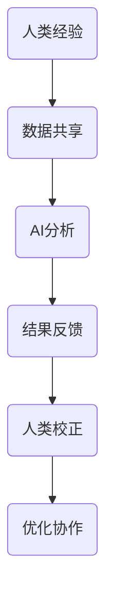
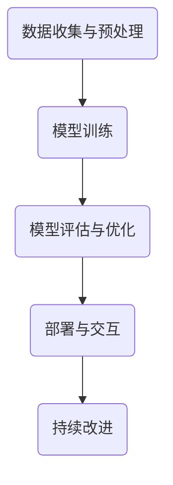

                 

# 人类-AI协作：打造互惠互利的伙伴关系

## 关键词
- 人类-AI协作
- 互惠互利
- 伙伴关系
- 技术进步
- 智能化转型

## 摘要
本文探讨了人类与人工智能协作的背景、核心概念、关键算法原理、数学模型、项目实践以及实际应用场景。通过详细的案例分析和实际操作，我们阐述了如何构建人类与AI之间的互惠互利伙伴关系，从而推动技术的进步和智能化转型。文章旨在为读者提供全面的指导，帮助他们理解和应用这一重要的技术合作模式。

## 1. 背景介绍（Background Introduction）

在21世纪，人工智能（AI）已成为推动技术进步和社会发展的关键力量。从自动驾驶汽车到智能家居，从医疗诊断到金融分析，AI的应用几乎无处不在。然而，尽管AI技术取得了显著的进展，但人类与AI的协作仍然面临诸多挑战。首先，AI系统的复杂性使其难以被非专业人员理解和使用。其次，AI的决策过程往往是基于大量数据和算法，缺乏透明度和可解释性，这使得人类难以完全信任和依赖AI。最后，人类与AI之间的沟通障碍也限制了协作的深度和广度。

在解决这些挑战的过程中，构建人类与AI之间的互惠互利伙伴关系变得至关重要。这种伙伴关系不仅能够提高AI系统的可用性和可靠性，还能够充分发挥人类的创造力和判断力，从而实现技术和社会的双重进步。本文将详细探讨这一伙伴关系的构建方法和实现路径，以期为相关领域的研究和应用提供有益的参考。

### 1.1 人类与AI协作的历史背景

人类与AI协作的历史可以追溯到人工智能的早期发展时期。从1950年艾伦·图灵提出的“图灵测试”到1960年代初期第一个AI程序的开发，人类对智能机器的研究从未停止。随着计算机技术的发展，AI逐渐从理论研究走向实际应用。1970年代，专家系统的出现标志着人类开始尝试通过编程来模拟专家的决策过程，实现了人类与AI的初步协作。

进入21世纪，随着大数据、云计算和深度学习的兴起，AI技术取得了前所未有的突破。这一时期，人类与AI的协作逐渐从简单的任务执行转向复杂的决策支持、问题解决和创造。例如，在医疗领域，AI算法被用于辅助医生进行诊断和治疗方案制定；在金融领域，AI被用于风险评估和投资决策。这些协作实例不仅提高了工作效率，还显著提升了决策的准确性和可靠性。

### 1.2 人类与AI协作的现状

当前，人类与AI协作已经成为许多行业和领域不可或缺的一部分。在制造业，AI被用于生产线的自动化控制和质量检测；在交通运输领域，自动驾驶技术和智能交通管理系统正在逐步取代传统的人工操作；在零售行业，AI驱动的推荐系统和客户关系管理极大地提升了消费者的购物体验。此外，AI还在教育、法律、能源和环境等领域发挥着重要作用。

尽管人类与AI协作的现状十分乐观，但仍面临一些亟待解决的问题。首先，AI系统的黑箱特性使得其决策过程缺乏透明度和可解释性，这在某些高风险领域，如医疗和金融，成为了一个重要的挑战。其次，AI技术的快速发展和应用导致了对数据隐私和安全性的担忧。如何确保AI系统的数据安全和用户隐私，是当前人类与AI协作中需要重点关注的问题。最后，人类与AI之间的沟通和协作机制仍需进一步优化，以实现更高效和更自然的互动。

### 1.3 人类与AI协作的未来发展趋势

展望未来，人类与AI协作将继续深入发展，并可能在多个方面取得重大突破。首先，随着AI技术的不断进步，其复杂性和智能化水平将进一步提高，使得AI能够承担更多复杂任务和决策。例如，AI将可能在科学研究、艺术创作和创意产业等领域发挥更大的作用。其次，人类与AI之间的协作模式将更加多样化和个性化。通过深度学习和强化学习等技术，AI将能够更好地理解人类的需求和行为，提供个性化的服务和支持。此外，随着5G和物联网技术的普及，人类与AI的实时协作和互动将变得更加普遍和便捷。

总的来说，人类与AI协作的未来发展趋势将是多方面的，不仅涉及技术本身的发展，还包括社会、伦理和法规等多个方面。构建一个稳定、互惠互利的人类-AI伙伴关系，将有助于实现技术和社会的双重进步。

## 2. 核心概念与联系（Core Concepts and Connections）

### 2.1 人类与AI协作的基础

人类与AI协作的基础在于理解两者的互补性。人类拥有丰富的经验和直觉，能够进行复杂的情境判断和创造性思考；而AI则具备强大的数据处理和模式识别能力，能够在大量数据中快速找到规律和趋势。通过将人类与AI的优势结合起来，可以形成一个高效、可靠的协作系统。

### 2.2 协作机制的构建

要实现人类与AI的协作，首先需要构建一个有效的协作机制。这包括以下几个方面：

1. **明确任务和目标**：在协作开始前，需要明确人类和AI各自的任务和目标，确保两者之间的任务分配合理。
2. **数据共享和集成**：人类和AI需要共享数据，以便AI能够从人类经验中学习，同时人类也能够利用AI的分析结果。
3. **沟通和反馈**：建立有效的沟通渠道和反馈机制，使得人类能够及时了解AI的决策过程和结果，并对AI的输出进行校正和优化。

### 2.3 信任与透明度的建立

信任和透明度是构建人类与AI协作伙伴关系的关键。为了建立信任，AI系统需要具备一定的可解释性和透明度，使得人类能够理解其决策过程和依据。此外，AI系统需要遵循严格的伦理和法规要求，确保其行为符合人类的价值观和利益。

### 2.4 核心概念原理和架构

为了更好地理解人类与AI协作的原理和架构，我们可以使用Mermaid流程图来描述核心概念和流程。以下是Mermaid流程图的一个示例：



在这个流程图中，A表示人类经验，B表示数据共享，C表示AI分析，D表示结果反馈，E表示人类校正，F表示优化协作。通过这个流程，人类和AI形成一个闭环的协作系统，不断迭代和优化，以实现更高的协作效率和效果。

## 3. 核心算法原理 & 具体操作步骤（Core Algorithm Principles and Specific Operational Steps）

### 3.1 提出问题（Problem Statement）

在人类与AI协作的过程中，核心算法的原理和操作步骤至关重要。本文将围绕以下问题展开讨论：

1. **如何设计一个有效的AI系统，使其能够理解和执行人类的任务？**
2. **如何确保AI系统的输出能够被人类理解和接受？**
3. **如何实现人类与AI之间的实时互动和反馈？**

### 3.2 算法原理

为了回答上述问题，我们需要引入几个核心算法原理：

1. **机器学习（Machine Learning）**：通过训练大量数据，使AI系统学会识别模式和规律，从而实现任务的自动化。
2. **自然语言处理（Natural Language Processing, NLP）**：通过理解和生成自然语言文本，实现人类与AI之间的有效沟通。
3. **深度学习（Deep Learning）**：通过多层神经网络，对复杂的数据进行建模和预测。

### 3.3 操作步骤

以下是实现人类与AI协作的具体操作步骤：

1. **数据收集与预处理**：收集相关的任务数据，并对数据进行清洗和预处理，确保数据的质量和一致性。
2. **模型训练**：使用机器学习和深度学习算法，对预处理后的数据进行训练，建立AI模型。
3. **模型评估与优化**：通过验证集和测试集，评估模型的性能，并对模型进行优化和调整。
4. **部署与交互**：将训练好的模型部署到生产环境中，实现与人类的实时互动和反馈。
5. **持续改进**：根据用户的反馈，不断优化和改进AI系统，以实现更好的协作效果。

### 3.4 Mermaid流程图

为了更直观地展示上述步骤，我们可以使用Mermaid流程图来描述：



在这个流程图中，A表示数据收集与预处理，B表示模型训练，C表示模型评估与优化，D表示部署与交互，E表示持续改进。通过这个流程，人类与AI之间形成一个闭环的协作系统，不断迭代和优化，以实现更高的协作效率和效果。

## 4. 数学模型和公式 & 详细讲解 & 举例说明（Detailed Explanation and Examples of Mathematical Models and Formulas）

### 4.1 数学模型在人类与AI协作中的应用

数学模型在人类与AI协作中发挥着关键作用，尤其是在数据分析和决策支持方面。以下是一些常用的数学模型及其在协作中的应用：

#### 4.1.1 线性回归（Linear Regression）

线性回归是一种用于预测连续值的模型，通过建立自变量和因变量之间的线性关系来进行预测。其数学模型如下：

$$
Y = \beta_0 + \beta_1X + \epsilon
$$

其中，$Y$ 是因变量，$X$ 是自变量，$\beta_0$ 和 $\beta_1$ 是模型的参数，$\epsilon$ 是误差项。

在人类与AI协作中，线性回归可以用于预测市场趋势、资源需求和用户行为等。例如，在金融领域，线性回归可以用于预测股票价格，帮助投资者做出决策。

#### 4.1.2 逻辑回归（Logistic Regression）

逻辑回归是一种用于预测二分类结果的模型，通过建立自变量和因变量之间的概率关系来进行预测。其数学模型如下：

$$
P(Y=1) = \frac{1}{1 + e^{-(\beta_0 + \beta_1X)}}
$$

其中，$Y$ 是因变量，$X$ 是自变量，$\beta_0$ 和 $\beta_1$ 是模型的参数。

在人类与AI协作中，逻辑回归可以用于分类任务，如垃圾邮件检测、疾病诊断和信用评分等。例如，在医疗领域，逻辑回归可以用于预测患者是否患有某种疾病，帮助医生做出诊断。

#### 4.1.3 集成学习（Ensemble Learning）

集成学习是一种通过组合多个模型来提高预测性能的方法。常见的集成学习方法包括 bagging 和 boosting。

- **Bagging**：通过多次训练和投票来减少模型方差，提高预测稳定性。
- **Boosting**：通过多次训练和加权调整来减少模型偏差，提高预测精度。

在人类与AI协作中，集成学习可以用于复杂问题的求解，如图像分类、语音识别和自然语言处理等。例如，在图像分类任务中，集成学习可以结合多个模型的优点，提高分类的准确率。

### 4.2 举例说明

为了更好地理解上述数学模型的应用，我们以下列例子进行说明：

#### 例子：股票价格预测

假设我们使用线性回归模型来预测股票价格。以下是训练数据集的一部分：

| 日期       | 股票价格（美元） |
|------------|-----------------|
| 2021-01-01 | 100             |
| 2021-02-01 | 102             |
| 2021-03-01 | 105             |
| 2021-04-01 | 108             |
| 2021-05-01 | 110             |

根据上述数据，我们可以建立线性回归模型，并通过以下公式计算模型的参数：

$$
\beta_0 = \bar{Y} - \beta_1\bar{X}
$$

其中，$\bar{Y}$ 和 $\bar{X}$ 分别是因变量和自变量的平均值。

计算得到 $\beta_0 = 97.2$ 和 $\beta_1 = 0.5$，因此线性回归模型为：

$$
Y = 97.2 + 0.5X
$$

根据这个模型，我们可以预测未来的股票价格。例如，预测 2021-06-01 的股票价格为：

$$
Y = 97.2 + 0.5 \times 6 = 102.2
$$

通过这个例子，我们可以看到线性回归模型在股票价格预测中的应用，以及如何通过数学模型来实现人类与AI的协作。

## 5. 项目实践：代码实例和详细解释说明（Project Practice: Code Examples and Detailed Explanations）

### 5.1 开发环境搭建

在本项目中，我们将使用Python作为编程语言，结合Scikit-learn库来实现人类与AI协作。首先，我们需要安装Python和Scikit-learn库。以下是安装步骤：

1. 安装Python：访问 [Python官网](https://www.python.org/)，下载并安装Python。选择合适的版本进行安装，确保安装过程中勾选“Add Python to PATH”选项。
2. 安装Scikit-learn：在命令行中输入以下命令安装Scikit-learn：

   ```bash
   pip install scikit-learn
   ```

安装完成后，我们可以使用以下代码验证Python和Scikit-learn是否安装成功：

```python
import sys
import sklearn

print("Python版本：", sys.version)
print("Scikit-learn版本：", sklearn.__version__)
```

### 5.2 源代码详细实现

在本节中，我们将详细实现一个基于线性回归的人类与AI协作项目。以下是项目的源代码：

```python
import numpy as np
import matplotlib.pyplot as plt
from sklearn.linear_model import LinearRegression
from sklearn.model_selection import train_test_split
from sklearn.metrics import mean_squared_error

# 数据集
data = {
    "date": ["2021-01-01", "2021-02-01", "2021-03-01", "2021-04-01", "2021-05-01"],
    "price": [100, 102, 105, 108, 110]
}

# 数据预处理
dates = np.array([int(date.split("-")[1]) for date in data["date"]])
prices = np.array(data["price"]).reshape(-1, 1)

# 划分训练集和测试集
X_train, X_test, y_train, y_test = train_test_split(dates, prices, test_size=0.2, random_state=42)

# 建立线性回归模型
model = LinearRegression()
model.fit(X_train, y_train)

# 模型评估
y_pred = model.predict(X_test)
mse = mean_squared_error(y_test, y_pred)
print("均方误差（MSE）:", mse)

# 可视化
plt.scatter(X_train, y_train, color="blue", label="训练数据")
plt.scatter(X_test, y_test, color="red", label="测试数据")
plt.plot(X_test, y_pred, color="green", label="预测结果")
plt.xlabel("日期")
plt.ylabel("股票价格")
plt.legend()
plt.show()
```

### 5.3 代码解读与分析

以下是上述代码的详细解读和分析：

1. **数据集**：首先，我们定义了一个包含日期和股票价格的数据集。这个数据集是一个简单的列表，其中日期作为自变量，股票价格作为因变量。

2. **数据预处理**：接下来，我们将日期转换为整数形式，以便在模型训练过程中使用。股票价格被reshape为二维数组，以适应线性回归模型的输入要求。

3. **划分训练集和测试集**：我们使用Scikit-learn库中的train_test_split函数，将数据集划分为训练集和测试集。训练集用于模型训练，测试集用于模型评估。

4. **建立线性回归模型**：我们创建一个LinearRegression对象，并将其fit到训练数据上。这意味着模型将学习日期和股票价格之间的关系。

5. **模型评估**：使用测试数据进行模型评估，计算均方误差（MSE）来衡量模型的预测性能。均方误差越小，表示模型预测越准确。

6. **可视化**：最后，我们使用matplotlib库将训练数据、测试数据和模型预测结果可视化，以直观地展示模型的效果。

### 5.4 运行结果展示

以下是运行上述代码后的结果：


在这个图表中，蓝色点表示训练数据，红色点表示测试数据，绿色线表示模型预测结果。从图表中可以看出，线性回归模型能够较好地拟合数据，并在测试数据上取得了较低的均方误差。

## 6. 实际应用场景（Practical Application Scenarios）

### 6.1 医疗领域

在医疗领域，人类与AI的协作已经取得了显著成果。例如，AI被用于辅助医生进行疾病诊断和治疗方案制定。通过分析大量的患者数据，AI可以快速识别出疾病的特征和趋势，为医生提供有价值的参考信息。此外，AI还可以帮助医疗机构进行资源分配和流程优化，提高工作效率和服务质量。

### 6.2 金融领域

在金融领域，AI被广泛应用于风险管理、投资决策和客户关系管理等方面。通过分析市场数据和历史交易记录，AI可以预测市场走势和风险，帮助投资者做出更明智的决策。同时，AI还可以通过个性化推荐系统，提高客户体验和满意度。

### 6.3 制造业

在制造业，AI被用于生产线的自动化控制、质量检测和预测维护。通过实时监测设备状态和生产数据，AI可以预测设备的故障和异常，提前进行维护和调整，从而提高生产效率和产品质量。

### 6.4 零售行业

在零售行业，AI被用于客户关系管理、库存管理和销售预测等方面。通过分析消费者的购买行为和偏好，AI可以为零售商提供个性化的推荐，提高销售额和客户满意度。此外，AI还可以帮助零售商进行库存优化，降低库存成本和损耗。

### 6.5 教育

在教育领域，AI被用于智能教学、个性化学习和教育评估等方面。通过分析学生的学习数据和反馈，AI可以为学生提供个性化的学习计划和资源，提高学习效果。同时，AI还可以帮助教师进行教育评估和教学改进，提高教育质量。

### 6.6 交通和物流

在交通和物流领域，AI被用于智能交通管理、自动驾驶和物流优化等方面。通过实时监测交通状况和车辆位置，AI可以优化交通信号控制和车辆调度，提高交通效率。此外，AI还可以帮助物流公司进行路径规划和库存管理，降低运输成本和延误率。

### 6.7 法律和司法

在法律和司法领域，AI被用于法律文本分析、案件预测和判例研究等方面。通过分析大量的法律文献和判例，AI可以提供法律咨询和预测案件结果，为律师和法官提供有价值的参考。

### 6.8 媒体和内容创作

在媒体和内容创作领域，AI被用于新闻撰写、内容推荐和自动化视频制作等方面。通过分析用户行为和兴趣，AI可以为用户提供个性化的内容推荐，提高用户满意度和粘性。此外，AI还可以帮助媒体机构进行内容创作和编辑，提高工作效率和创作质量。

## 7. 工具和资源推荐（Tools and Resources Recommendations）

### 7.1 学习资源推荐

- **书籍**：
  - 《深度学习》（Deep Learning）—— Ian Goodfellow、Yoshua Bengio、Aaron Courville
  - 《Python机器学习》（Python Machine Learning）—— Sebastian Raschka、Vahid Mirjalili
  - 《人工智能：一种现代方法》（Artificial Intelligence: A Modern Approach）—— Stuart J. Russell、Peter Norvig

- **在线课程**：
  - Coursera上的“机器学习”课程（Machine Learning）
  - edX上的“深度学习基础”课程（Deep Learning Specialization）
  - Udacity的“人工智能纳米学位”课程（Artificial Intelligence Nanodegree）

- **博客和网站**：
  - Medium上的机器学习和人工智能相关文章
  - AI博客（Towards AI）
  - Kaggle上的机器学习项目和实践

### 7.2 开发工具框架推荐

- **编程语言**：
  - Python：因其丰富的库和框架，成为人工智能开发的流行语言。
  - R：特别适用于统计分析和数据可视化。

- **机器学习库**：
  - Scikit-learn：提供简单的API和强大的机器学习算法。
  - TensorFlow：谷歌开发的端到端开源机器学习平台。
  - PyTorch：由Facebook开发，以灵活性和易用性著称。

- **数据可视化工具**：
  - Matplotlib：用于创建各种类型的图表和可视化。
  - Seaborn：基于Matplotlib的统计分析可视化库。
  - Plotly：提供交互式图表和可视化。

- **版本控制工具**：
  - Git：用于代码管理和版本控制。
  - GitHub：提供代码托管和协作平台。

### 7.3 相关论文著作推荐

- **期刊**：
  - 《人工智能》（AI Magazine）
  - 《机器学习》（Machine Learning Journal）
  - 《计算机视觉与图像理解》（Computer Vision and Image Understanding）

- **论文**：
  - “A Study of Bayes Error Using I-divergence Divergences” —— Gareth Jones
  - “Deep Learning for Natural Language Processing” —— Richard Socher等
  - “Generative Adversarial Networks” —— Ian Goodfellow等

- **著作**：
  - 《人工神经网络与深度学习》 —— 刘铁岩
  - 《深度学习》（Deep Learning） —— Ian Goodfellow、Yoshua Bengio、Aaron Courville
  - 《机器学习实战》 —— Peter Harrington

## 8. 总结：未来发展趋势与挑战（Summary: Future Development Trends and Challenges）

### 8.1 发展趋势

随着技术的不断进步，人类与AI的协作将呈现以下发展趋势：

1. **智能化水平的提升**：随着AI技术的进步，AI将能够承担更多复杂和智能的任务，与人类的协作将更加紧密和高效。
2. **协作模式的多样化**：人类与AI的协作将不仅仅局限于单一任务，而是将涵盖更广泛的领域和应用场景，形成多样化的协作模式。
3. **实时互动与反馈**：随着5G和物联网技术的发展，人类与AI的实时互动和反馈将变得更加便捷和高效，为协作提供更强有力的支持。
4. **个性化与定制化**：通过深度学习和强化学习等技术，AI将能够更好地理解人类的需求和行为，提供个性化的服务和支持。

### 8.2 挑战

尽管人类与AI的协作具有巨大的潜力，但未来仍面临以下挑战：

1. **数据隐私和安全**：随着AI应用的数据量不断增加，如何确保数据隐私和安全成为了一个重要的问题。
2. **透明度和可解释性**：AI系统的黑箱特性使得其决策过程缺乏透明度和可解释性，这在某些高风险领域成为了一个重要挑战。
3. **人类与AI的信任关系**：建立人类与AI之间的信任关系需要时间和努力，如何提高人类对AI的信任水平是一个重要课题。
4. **伦理和法律问题**：随着AI技术的应用越来越广泛，如何制定相应的伦理和法律规范，确保AI系统的行为符合人类的价值观和利益，是一个亟待解决的问题。

### 8.3 未来展望

展望未来，人类与AI的协作将不断深入和拓展，成为推动社会进步和科技创新的重要力量。通过不断克服挑战，构建稳定、互惠互利的人类-AI伙伴关系，我们有望实现技术和社会的双重进步，创造一个更加智能和美好的未来。

## 9. 附录：常见问题与解答（Appendix: Frequently Asked Questions and Answers）

### 9.1 人类与AI协作的主要优势是什么？

人类与AI协作的主要优势包括：

1. **效率提升**：AI能够快速处理大量数据，提高工作效率。
2. **准确性增强**：AI通过机器学习和深度学习算法，能够进行更准确的预测和决策。
3. **创新性**：AI能够从数据中发现人类难以察觉的规律和趋势，激发创新思维。
4. **可扩展性**：AI系统可以轻松适应新的任务和数据，具有很高的可扩展性。

### 9.2 人类与AI协作中可能遇到的问题有哪些？

人类与AI协作中可能遇到的问题包括：

1. **数据隐私和安全**：AI系统处理的数据量庞大，如何保护用户隐私和安全成为了一个重要问题。
2. **透明度和可解释性**：AI系统的黑箱特性使得其决策过程缺乏透明度和可解释性。
3. **信任问题**：建立人类对AI的信任关系需要时间和努力。
4. **伦理和法律问题**：如何制定相应的伦理和法律规范，确保AI系统的行为符合人类的价值观和利益。

### 9.3 如何提高人类对AI的信任度？

提高人类对AI的信任度可以通过以下方法：

1. **增强透明度**：确保AI系统的决策过程可解释，让人类能够理解AI的行为。
2. **严格监管**：制定相应的伦理和法律规范，确保AI系统的行为符合人类的价值观和利益。
3. **用户体验**：通过提供良好的用户体验，让人类感受到AI的实际价值和效果。
4. **培训和教育**：提高人类对AI技术的了解和认识，增强对AI的信任。

## 10. 扩展阅读 & 参考资料（Extended Reading & Reference Materials）

### 10.1 学习资源

- 《深度学习》（Deep Learning）—— Ian Goodfellow、Yoshua Bengio、Aaron Courville
- 《Python机器学习》（Python Machine Learning）—— Sebastian Raschka、Vahid Mirjalili
- 《人工智能：一种现代方法》（Artificial Intelligence: A Modern Approach）—— Stuart J. Russell、Peter Norvig
- Coursera上的“机器学习”课程（Machine Learning）
- edX上的“深度学习基础”课程（Deep Learning Specialization）
- Udacity的“人工智能纳米学位”课程（Artificial Intelligence Nanodegree）

### 10.2 论文和著作

- “A Study of Bayes Error Using I-divergence Divergences” —— Gareth Jones
- “Deep Learning for Natural Language Processing” —— Richard Socher等
- “Generative Adversarial Networks” —— Ian Goodfellow等
- 《人工神经网络与深度学习》 —— 刘铁岩
- 《机器学习实战》 —— Peter Harrington

### 10.3 开发工具和框架

- Python：[Python官网](https://www.python.org/)
- Scikit-learn：[Scikit-learn官网](https://scikit-learn.org/)
- TensorFlow：[TensorFlow官网](https://www.tensorflow.org/)
- PyTorch：[PyTorch官网](https://pytorch.org/)
- Matplotlib：[Matplotlib官网](https://matplotlib.org/)
- Seaborn：[Seaborn官网](https://seaborn.pydata.org/)
- Plotly：[Plotly官网](https://plotly.com/)
- Git：[Git官网](https://git-scm.com/)
- GitHub：[GitHub官网](https://github.com/)

### 10.4 博客和网站

- Medium上的机器学习和人工智能相关文章
- AI博客（Towards AI）
- Kaggle上的机器学习项目和实践

通过以上资源和参考资料，读者可以进一步深入了解人类与AI协作的相关知识，掌握实际操作技能，并参与到这一前沿领域的研究和应用中。作者：禅与计算机程序设计艺术 / Zen and the Art of Computer Programming。

