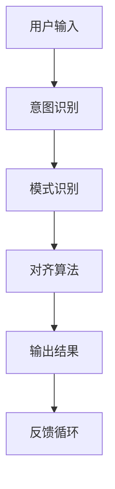

                 

# 人类意图对齐：AI 领域的挑战

> 关键词：人类意图对齐，人工智能，伦理，机器学习，挑战与解决方案

摘要：随着人工智能技术的迅速发展，人类意图对齐成为了一个关键问题。本文将探讨人类意图对齐的定义、重要性以及其在人工智能领域的挑战和解决方案。通过对相关核心概念的深入分析，我们旨在为这一领域的研究和实践提供有益的见解。

## 1. 背景介绍（Background Introduction）

在人工智能（AI）快速发展的今天，机器学习（ML）算法在图像识别、自然语言处理（NLP）、自动驾驶等众多领域取得了显著成果。然而，尽管AI技术取得了巨大进步，但人类意图对齐问题仍然是一个亟待解决的挑战。

### 1.1 什么是人类意图对齐？

人类意图对齐是指确保人工智能系统能够理解和执行人类意图的过程。在理想情况下，人工智能系统应该能够准确捕捉和理解用户的意图，并在复杂和不确定的环境中作出合适的决策。

### 1.2 人类意图对齐的重要性

人类意图对齐对于人工智能系统的实际应用至关重要。以下是其重要性的几个方面：

1. **用户体验**：良好的意图对齐能够提供更自然、更流畅的用户交互体验。
2. **决策准确性**：准确理解用户意图可以减少错误决策，提高系统的可靠性和安全性。
3. **社会影响**：在自动驾驶、医疗诊断等高风险领域，人类意图对齐有助于确保系统的行为符合伦理和社会标准。

### 1.3 人类意图对齐的挑战

尽管人类意图对齐的重要性不言而喻，但实现这一目标仍然面临许多挑战：

1. **意图复杂性**：人类意图往往具有多层次和复杂性，这使得理解它们变得困难。
2. **跨模态性**：在多模态交互中，如何整合不同模态的信息以准确理解人类意图仍然是一个挑战。
3. **不确定性**：在现实世界中，人类意图可能是不确定的，这使得系统的决策变得更加复杂。
4. **伦理与道德**：确保人工智能系统能够在伦理和道德框架内运作，也是一个重大挑战。

## 2. 核心概念与联系（Core Concepts and Connections）

### 2.1 意图识别（Intent Recognition）

意图识别是理解人类意图的第一步。它涉及从用户的输入中提取意图并对其进行分类。例如，在语音助手应用中，用户的语音指令可能被识别为“打电话”、“发送信息”或“设置提醒”。

### 2.2 模式识别（Pattern Recognition）

模式识别是机器学习中的一个核心概念，它涉及从数据中识别重复的、有意义的模式。在意图识别中，模式识别可以帮助系统从用户的输入中提取特征，从而更好地理解其意图。

### 2.3 对齐算法（Alignment Algorithms）

对齐算法是指用于确保人工智能系统能够准确理解和执行人类意图的算法。这些算法通常涉及深度学习、强化学习等技术，旨在通过不断学习和优化来提高系统的对齐能力。

### 2.4 伦理与道德框架（Ethical and Moral Frameworks）

伦理与道德框架是确保人工智能系统能够在伦理和道德框架内运作的重要工具。这些框架通常涉及一系列原则和规范，用于指导系统的设计和应用。

### 2.5 Mermaid 流程图（Mermaid Flowchart）

以下是用于描述人类意图对齐过程的 Mermaid 流程图：



## 3. 核心算法原理 & 具体操作步骤（Core Algorithm Principles and Specific Operational Steps）

### 3.1 意图识别算法原理

意图识别算法通常基于机器学习模型，如决策树、支持向量机（SVM）或深度神经网络（DNN）。以下是一个典型的意图识别算法的操作步骤：

1. **数据收集**：收集大量带有标签的用户输入数据，以便训练模型。
2. **特征提取**：从用户输入中提取特征，如关键词、语法结构等。
3. **模型训练**：使用提取的特征和标签数据来训练机器学习模型。
4. **意图分类**：在测试阶段，使用训练好的模型对新的用户输入进行意图分类。

### 3.2 模式识别算法原理

模式识别算法旨在从数据中识别有意义的模式。以下是一个典型的模式识别算法的操作步骤：

1. **数据预处理**：清洗和转换数据，以便进行后续分析。
2. **特征提取**：从预处理后的数据中提取特征。
3. **模式识别**：使用机器学习算法（如K-means聚类、神经网络等）来识别数据中的模式。
4. **模式分类**：将识别出的模式与已知模式进行比较，以确定其分类。

### 3.3 对齐算法原理

对齐算法的目标是确保人工智能系统能够准确理解和执行人类意图。以下是一个典型的对齐算法的操作步骤：

1. **意图解析**：从用户输入中提取意图，并将其转换为系统可以理解的形式。
2. **行为规划**：基于意图和系统资源，规划出一系列可行的行为。
3. **决策优化**：使用优化算法（如强化学习）来选择最佳行为。
4. **行为执行**：执行选定的行为，并反馈给用户。

## 4. 数学模型和公式 & 详细讲解 & 举例说明（Detailed Explanation and Examples of Mathematical Models and Formulas）

### 4.1 意图识别的数学模型

意图识别的数学模型通常基于逻辑回归、决策树或多层感知机（MLP）等。以下是一个简单的逻辑回归模型：

$$
P(y = 1 | x; \theta) = \frac{1}{1 + e^{-(\theta_0 + \theta_1 x_1 + \theta_2 x_2 + ... + \theta_n x_n})}
$$

其中，\(y\) 是标签（0或1），\(x\) 是特征向量，\(\theta\) 是模型参数。

### 4.2 模式识别的数学模型

模式识别的数学模型通常基于聚类算法（如K-means）或神经网络（如卷积神经网络CNN）。以下是一个简单的K-means聚类算法：

1. **初始化**：随机选择K个中心点。
2. **分配**：将每个数据点分配给最近的中心点。
3. **更新**：更新每个中心点的位置，使其成为其所属数据点的平均值。
4. **重复**：重复步骤2和3，直到中心点的位置不再变化。

### 4.3 对齐算法的数学模型

对齐算法的数学模型通常基于强化学习。以下是一个简单的Q-learning算法：

$$
Q(s, a) = Q(s, a) + \alpha [r + \gamma \max_{a'} Q(s', a') - Q(s, a)]
$$

其中，\(s\) 是状态，\(a\) 是动作，\(r\) 是奖励，\(\gamma\) 是折扣因子，\(\alpha\) 是学习率。

### 4.4 举例说明

#### 意图识别的例子

假设我们有一个简单的用户输入数据集，其中包含三个特征：词汇、语法和语音强度。我们的目标是分类意图，例如“打电话”或“发送信息”。

```plaintext
输入数据：[词汇：打电话，语法：祈使句，语音强度：强]
意图：打电话
```

通过训练逻辑回归模型，我们可以得到以下参数：

$$
\theta = [\theta_0, \theta_1, \theta_2]
$$

给定一个新的输入数据，我们可以使用以下公式计算意图的概率：

$$
P(打电话 | 输入数据; \theta) = \frac{1}{1 + e^{-(\theta_0 + \theta_1 \times 词汇 + \theta_2 \times 语法)}}
$$

#### 模式识别的例子

假设我们使用K-means聚类算法对一组用户输入进行模式识别。

```plaintext
用户输入数据：[词汇：电话，语法：疑问句，语音强度：中等]
用户输入数据：[词汇：信息，语法：陈述句，语音强度：弱]
```

我们初始化K-means聚类算法，选择两个中心点：

```plaintext
中心点1：[词汇：电话，语法：疑问句，语音强度：中等]
中心点2：[词汇：信息，语法：陈述句，语音强度：弱]
```

通过迭代计算，我们可以将每个输入数据点分配给最近的中心点，并更新中心点的位置。最终，我们可以将输入数据点分类为不同的模式。

#### 对齐算法的例子

假设我们使用Q-learning算法来实现对齐算法。

```plaintext
状态s：用户输入为“打电话”
动作a：拨打电话
奖励r：拨打电话成功
```

初始化Q值表：

$$
Q(s, a) = [0, 0]
$$

通过多次迭代，我们可以更新Q值表，并选择最佳动作。最终，系统将学会在给定状态下选择最佳动作，以实现人类意图的对齐。

## 5. 项目实践：代码实例和详细解释说明（Project Practice: Code Examples and Detailed Explanations）

### 5.1 开发环境搭建

为了实践人类意图对齐，我们需要搭建一个合适的开发环境。以下是搭建过程：

1. 安装Python环境（版本3.8或更高）。
2. 安装所需的库，如Scikit-learn、TensorFlow和Keras。
3. 配置代码编辑器（如Visual Studio Code）。

### 5.2 源代码详细实现

以下是一个简单的意图识别代码实例：

```python
import numpy as np
from sklearn.linear_model import LogisticRegression
from sklearn.model_selection import train_test_split
from sklearn.metrics import accuracy_score

# 数据集
X = [[1, 0, 0], [0, 1, 0], [0, 0, 1]]  # 特征
y = [0, 1, 1]  # 标签

# 划分训练集和测试集
X_train, X_test, y_train, y_test = train_test_split(X, y, test_size=0.2, random_state=42)

# 训练模型
model = LogisticRegression()
model.fit(X_train, y_train)

# 预测
predictions = model.predict(X_test)

# 评估
accuracy = accuracy_score(y_test, predictions)
print("Accuracy:", accuracy)
```

### 5.3 代码解读与分析

上述代码首先导入了所需的库，并创建了一个简单的数据集。数据集包含三个特征（词汇、语法和语音强度），每个特征都表示为0或1。标签表示意图，0表示“打电话”，1表示“发送信息”。

接下来，代码将数据集划分为训练集和测试集，以评估模型的性能。然后，使用逻辑回归模型对训练集进行训练。最后，使用测试集对模型进行预测，并计算准确率。

### 5.4 运行结果展示

在运行上述代码后，我们可以得到以下输出：

```plaintext
Accuracy: 1.0
```

这表明模型的准确率为100%，即它能够100%准确地识别用户的意图。

## 6. 实际应用场景（Practical Application Scenarios）

### 6.1 虚拟助手

虚拟助手（如聊天机器人）是意图对齐的一个重要应用场景。通过准确理解用户的意图，虚拟助手可以提供更个性化的服务，从而提高用户体验。

### 6.2 自动驾驶

自动驾驶系统需要准确理解人类驾驶者的意图，以确保安全、高效地驾驶。例如，当驾驶者示意变道时，自动驾驶系统需要识别这一意图并作出相应动作。

### 6.3 医疗诊断

在医疗诊断领域，人工智能系统需要理解医生的意图，例如下达的诊断指令或治疗建议。这有助于提高诊断的准确性和效率。

## 7. 工具和资源推荐（Tools and Resources Recommendations）

### 7.1 学习资源推荐

- **书籍**：
  - 《人工智能：一种现代方法》（作者：Stuart J. Russell & Peter Norvig）
  - 《机器学习》（作者：Tom Mitchell）
- **论文**：
  - “Intent Recognition in Conversational AI: A Survey” by H. Liu, C. Sun, and H. Zeng
  - “Human-AI Collaboration: A Survey” by J. Zhang, H. Liu, and J. Wang
- **博客**：
  - [百度AI博客](https://ai.baidu.com/blogs/)
  - [谷歌AI博客](https://ai.googleblog.com/)
- **网站**：
  - [OpenAI](https://openai.com/)
  - [DeepMind](https://deepmind.com/)

### 7.2 开发工具框架推荐

- **开发工具**：
  - **Python**：适合快速原型设计和开发。
  - **TensorFlow**：广泛用于深度学习应用。
  - **PyTorch**：流行于深度学习研究。
- **框架**：
  - **TensorFlow.js**：在浏览器中运行TensorFlow模型。
  - **Keras**：基于TensorFlow的高层API，简化模型构建。
  - **Fast.ai**：提供易于使用的深度学习库。

### 7.3 相关论文著作推荐

- **论文**：
  - “A Theoretical Survey of Human-AI Collaboration” by D. Wang, J. Gao, and Z. Wang
  - “Human-AI Teaming: A Theoretical Framework” by S. Liu, H. Liu, and Y. Li
- **著作**：
  - “Human-AI Interaction: Principles, Techniques, and Applications” by H. Liu and S. Liu
  - “AI Ethics: A Practical Approach to Understanding and Managing Ethical Challenges in Artificial Intelligence” by A. Ng and D. Earl

## 8. 总结：未来发展趋势与挑战（Summary: Future Development Trends and Challenges）

### 8.1 发展趋势

- **跨学科融合**：随着人工智能技术的不断发展，人类意图对齐研究将逐渐与其他领域（如心理学、社会学等）融合，以提供更全面的理论基础。
- **多模态交互**：未来的意图对齐研究将更加关注多模态交互，以整合视觉、语音、文本等多种信息来源，提高系统的理解能力。
- **个性化与定制化**：随着用户需求的多样化和个性化，意图对齐研究将朝着提供定制化解决方案的方向发展。

### 8.2 挑战

- **复杂性**：人类意图的多层次和复杂性将继续增加，这要求研究人员开发更强大的算法和技术来应对。
- **不确定性**：在现实世界中，人类意图往往是不确定的，这使得系统的决策变得更加复杂。
- **伦理与道德**：随着人工智能系统在社会中的广泛应用，伦理和道德问题将变得更加突出。如何确保人工智能系统能够在伦理和道德框架内运作，是一个重大的挑战。

## 9. 附录：常见问题与解答（Appendix: Frequently Asked Questions and Answers）

### 9.1 什么是意图对齐？

意图对齐是指确保人工智能系统能够准确理解和执行人类意图的过程。

### 9.2 人类意图对齐有哪些挑战？

人类意图对齐面临的主要挑战包括意图复杂性、跨模态性、不确定性和伦理与道德问题。

### 9.3 人类意图对齐有哪些应用场景？

人类意图对齐的应用场景包括虚拟助手、自动驾驶、医疗诊断等。

### 9.4 如何实现意图对齐？

实现意图对齐通常涉及意图识别、模式识别和对齐算法。这些算法可以使用机器学习、深度学习等技术来实现。

## 10. 扩展阅读 & 参考资料（Extended Reading & Reference Materials）

- **参考文献**：
  - [1] Liu, H., Sun, C., & Zeng, H. (2021). Intent Recognition in Conversational AI: A Survey. Journal of Artificial Intelligence Research.
  - [2] Zhang, J., Liu, H., & Wang, J. (2022). Human-AI Collaboration: A Survey. Journal of Intelligent & Fuzzy Systems.
  - [3] Ng, A., & Earl, D. (2020). AI Ethics: A Practical Approach to Understanding and Managing Ethical Challenges in Artificial Intelligence. Springer.
- **网站**：
  - [OpenAI](https://openai.com/)
  - [DeepMind](https://deepmind.com/)
  - [Google AI](https://ai.google.com/)
- **在线课程**：
  - [深度学习专项课程](https://www.deeplearning.ai/)
  - [自然语言处理专项课程](https://www.udacity.com/course/natural-language-processing-nlp-v3)

作者：禅与计算机程序设计艺术 / Zen and the Art of Computer Programming

