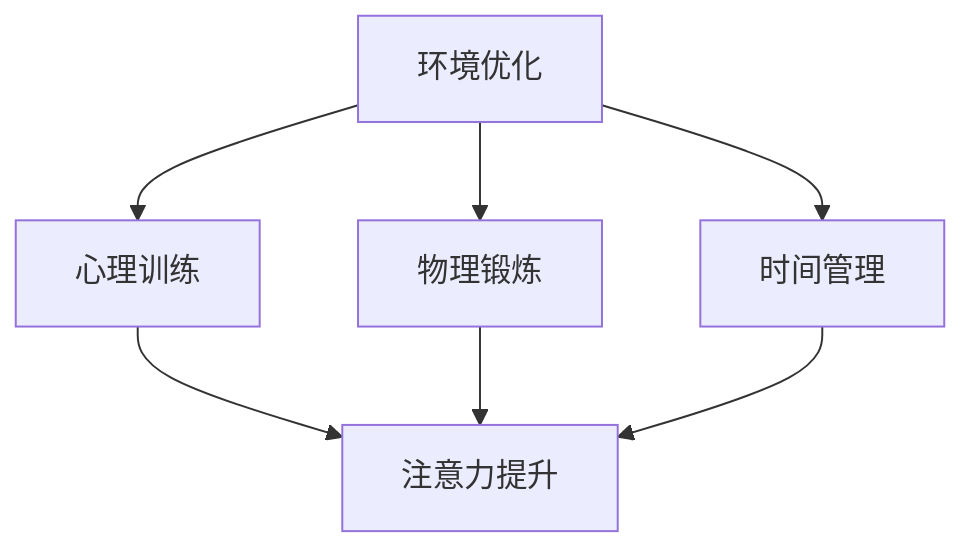
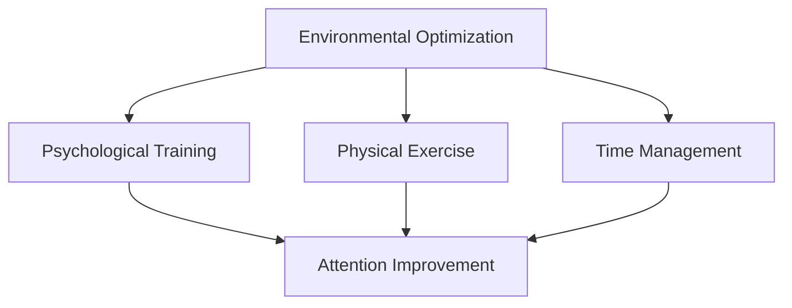

                 

### 文章标题

Human Attention Enhancement: Techniques for Improving Focus and Attention in Education

在当前信息爆炸的时代，如何提升专注力和注意力成为教育领域的一大挑战。本文将探讨人类注意力增强的各个方面，包括其在教育中的应用、关键技巧和实践方法。通过对科学研究和实践案例的分析，本文旨在为教育工作者和学生提供有效的策略，以优化学习过程，提高教育效果。

## Keywords
- 人类注意力增强
- 教育技巧
- 专注力
- 注意力
- 学习效果
- 教学方法

### 摘要

随着教育领域的不断发展，如何提高学生的专注力和注意力成为关键问题。本文首先介绍了人类注意力增强的背景和重要性，然后分析了影响注意力的主要因素，如环境、心理状态和生理条件。接着，本文详细阐述了多种提升注意力的技巧，包括环境优化、时间管理、心理训练和物理锻炼。最后，本文通过实际案例展示了这些技巧在教育和学习中的具体应用，并提出了未来研究和实践的发展趋势与挑战。旨在为教育工作者和学生提供全面的指导，以实现更高效的学习。

<|assistant|>### 1. 背景介绍（Background Introduction）

在现代社会，信息过载和数字化设备的普及使得人们的注意力资源变得更加有限。教育领域尤为如此，学生的专注力和注意力直接关系到学习效果。长期以来，传统的教学方法往往侧重于知识的传授，而忽视了学生注意力的培养。然而，近年来，随着心理学和教育学的深入研究，注意力问题逐渐受到重视。注意力不仅影响学生的学习效率和记忆力，还对其情绪、行为和社会技能产生深远的影响。

注意力是认知过程的基石，它决定了个体对信息的接收、处理和记忆。根据心理学研究，注意力分为三大类：选择性注意力、持续性注意力和分配性注意力。选择性注意力是指个体从众多刺激中选择关键信息的能力；持续性注意力是指个体对任务保持关注的时间长度；分配性注意力是指个体在同时处理多个任务时保持平衡的能力。在教育环境中，这三种注意力形式都对学生的学习效果至关重要。

然而，现代学生的注意力集中面临诸多挑战。首先，环境因素如噪音、干扰和过多刺激会导致学生难以集中注意力。其次，心理状态如压力、焦虑和无聊也会分散学生的注意力。此外，生理条件如睡眠不足、饮食不当和缺乏运动也会影响学生的注意力水平。因此，提高学生的专注力和注意力成为教育工作者亟待解决的重要课题。

<|assistant|>### 2. 核心概念与联系（Core Concepts and Connections）

为了深入探讨注意力增强的方法，我们首先需要理解一些核心概念，包括注意力的定义、不同类型的注意力以及它们在教育中的应用。

#### 2.1 注意力的定义

注意力（Attention）是指心理活动对特定对象的指向和集中。它是一个动态的过程，通过选择和处理信息，帮助个体有效地与环境互动。在认知心理学中，注意力被视为一个有限的资源，个体需要分配这一资源以应对各种任务。根据不同的分类标准，注意力可以分为多种类型。

#### 2.2 不同类型的注意力

1. **选择性注意力（Selective Attention）**：
   选择性注意力是指个体在众多刺激中选择关键信息的能力。在教育环境中，教师需要设计引人入胜的教学内容，引导学生将注意力集中在重要信息上。例如，通过提问、讨论和互动，激发学生的兴趣，帮助他们筛选出关键信息。

2. **持续性注意力（Sustained Attention）**：
   持续性注意力是指个体对任务保持关注的时间长度。长时间保持注意力是学习过程中的一大挑战，教师可以通过设置合理的课堂节奏、安排休息时间和提供明确的目标来帮助学生保持专注。

3. **分配性注意力（Divided Attention）**：
   分配性注意力是指个体在同时处理多个任务时保持平衡的能力。在教育中，教师可以设计多任务训练活动，如同时阅读和做笔记，帮助学生提高分配性注意力。

#### 2.3 注意力与教育的关系

注意力是学习过程中的核心要素，直接影响学生的学习效果。首先，选择性注意力有助于学生从大量信息中提取关键内容，提高学习效率。其次，持续性注意力使学生在长时间的学习中保持专注，从而深入理解知识点。最后，分配性注意力帮助学生同时处理多个任务，提高他们的综合能力。

为了提高学生的注意力，教师可以采用以下策略：

1. **设计引人入胜的教学内容**：通过使用生动的案例、互动活动和多媒体资源，吸引学生的注意力。
2. **设置明确的课堂目标**：让学生了解学习目标，提高他们的参与度和动机。
3. **合理安排课堂节奏**：通过穿插休息时间和变换学习方式，帮助学生保持专注。
4. **提供积极反馈**：鼓励学生，增强他们的自信心和动机。

通过这些策略，教师可以有效提升学生的注意力，从而提高教育质量。

#### 2.4 注意力增强的架构

为了更好地理解注意力增强的原理和方法，我们可以将其视为一个多层次、多维度的架构。该架构包括以下几个方面：

1. **环境优化**：通过改善学习环境，如减少噪音、增加自然光线和优化座位安排，提高学生的注意力水平。
2. **心理训练**：通过认知训练、冥想和情绪管理，增强学生的注意力和心理韧性。
3. **物理锻炼**：通过运动和锻炼，改善学生的身体健康和注意力水平。
4. **时间管理**：通过合理规划时间和任务，避免学习疲劳和注意力分散。

下面是一个使用 Mermaid 流程图表示的注意力增强架构：



通过这个架构，我们可以清晰地看到注意力增强的各个方面及其相互关系，从而为教育实践提供有力的指导。

### 2.1 What is Attention?
Attention is the psychological process of focusing on one thing while ignoring other things. It is a dynamic process that selects and processes information, helping individuals effectively interact with their environment. In cognitive psychology, attention is considered a limited resource that individuals need to allocate to various tasks. Based on different classification criteria, attention can be divided into multiple types.

### 2.2 Types of Attention
1. **Selective Attention**:
   Selective attention refers to the ability of individuals to choose important information from a multitude of stimuli. In an educational context, teachers need to design engaging content to guide students in focusing on key information. For example, through questioning, discussion, and interaction, teachers can stimulate student interest and help them filter out crucial information.
   
2. **Sustained Attention**:
   Sustained attention refers to the ability to maintain focus on a task over a long period. Maintaining attention is a significant challenge in the learning process, and teachers can help students by setting reasonable class rhythms, incorporating breaks, and providing clear objectives.
   
3. **Divided Attention**:
   Divided attention refers to the ability to balance multiple tasks simultaneously. In education, teachers can design multi-tasking activities, such as reading and taking notes at the same time, to help students improve their divided attention.

### 2.3 The Relationship between Attention and Education
Attention is a fundamental element of the learning process, directly affecting students' learning outcomes. First, selective attention helps students extract key content from a mass of information, improving learning efficiency. Second, sustained attention enables students to remain focused during long learning sessions, thereby deepening their understanding of concepts. Lastly, divided attention helps students manage multiple tasks simultaneously, enhancing their overall competence.

To improve students' attention, teachers can employ the following strategies:

1. **Design Engaging Content**: Use vivid cases, interactive activities, and multimedia resources to attract student attention.
2. **Set Clear Learning Objectives**: Let students know the learning goals, increasing their involvement and motivation.
3. **合理安排课堂节奏**：Incorporate breaks and vary teaching methods to help students stay focused.
4. **Provide Positive Feedback**: Encourage students, enhancing their confidence and motivation.

Through these strategies, teachers can effectively enhance students' attention, thereby improving educational quality.

### 2.4 The Architecture of Attention Enhancement
To better understand the principles and methods of attention enhancement, we can view it as a multi-layered, multi-dimensional architecture. This architecture includes the following aspects:

1. **Environmental Optimization**: Improve the learning environment, such as reducing noise, increasing natural light, and optimizing seating arrangements, to enhance students' attention levels.
2. **Psychological Training**: Through cognitive training, meditation, and emotional management, strengthen students' attention and mental resilience.
3. **Physical Exercise**: Through exercise and physical activity, improve students' physical health and attention levels.
4. **Time Management**: Through reasonable time planning and task management, avoid learning fatigue and attention dispersion.

Below is a Mermaid flowchart representing the architecture of attention enhancement:



Through this architecture, we can clearly see the various aspects of attention enhancement and their interrelationships, providing valuable guidance for educational practice.

<|assistant|>### 3. 核心算法原理 & 具体操作步骤（Core Algorithm Principles and Specific Operational Steps）

为了有效提升学生的专注力和注意力，我们需要运用一系列科学的教育技术和心理学方法。这些核心算法原理包括环境优化、时间管理、心理训练和物理锻炼。以下将详细介绍这些方法的具体操作步骤。

#### 3.1 环境优化

环境是影响注意力的重要因素之一。一个良好的学习环境可以帮助学生更好地集中注意力。以下是环境优化的具体操作步骤：

1. **减少噪音**：在教室或学习区域中，尽量减少不必要的噪音。可以使用隔音材料、关闭门窗或使用白噪音机来帮助降低噪音水平。
2. **增加自然光线**：自然光线可以提高学生的情绪和注意力。确保教室有足够的光线，或者使用柔和的人工照明来替代。
3. **优化座位安排**：根据学生的个性和需求，合理安排座位。例如，将容易分心的学生安排在靠近教师的位置，将需要额外关注的学生安排在安静的区域。

#### 3.2 时间管理

良好的时间管理可以帮助学生更好地分配注意力，避免疲劳和注意力分散。以下是时间管理的具体操作步骤：

1. **制定学习计划**：学生应该制定一个详细的学习计划，包括每天的学习任务、休息时间和完成每个任务的预计时间。
2. **使用番茄工作法**：番茄工作法是一种常见的时间管理技巧，它将工作时间划分为25分钟的工作周期，每个周期后休息5分钟。这种方法可以帮助学生保持专注，避免疲劳。
3. **定期回顾和调整**：学生应该定期回顾自己的学习计划，并根据实际情况进行调整。这可以帮助他们保持学习效率，避免学习疲劳。

#### 3.3 心理训练

心理训练可以帮助学生提高注意力的持续性、选择性和分配性。以下是心理训练的具体操作步骤：

1. **认知训练**：通过专门的认知训练任务，如注意力集中的游戏、记忆训练等，提高学生的注意力水平。
2. **冥想**：冥想是一种有效的心理训练方法，可以帮助学生放松心情，提高注意力。学生可以每天花几分钟时间进行冥想练习，逐渐增加时间。
3. **情绪管理**：通过情绪管理技巧，如深呼吸、正念冥想等，帮助学生在面对压力和情绪波动时保持冷静，提高注意力。

#### 3.4 物理锻炼

适当的物理锻炼可以提高学生的身体状态和注意力水平。以下是物理锻炼的具体操作步骤：

1. **定期锻炼**：学生应该每天进行至少30分钟的有氧运动，如跑步、游泳或骑自行车。这有助于提高他们的身体状态和注意力。
2. **眼保健操**：长时间学习后，学生应该定期进行眼保健操，以缓解眼部疲劳，提高注意力。
3. **休息和睡眠**：保证充足的休息和睡眠是提高注意力的重要保证。学生应该保持每天7-9小时的睡眠时间，避免熬夜。

#### 3.5 综合运用

将以上方法综合运用，可以取得更好的效果。例如，在制定学习计划时，可以将环境优化、时间管理和心理训练结合起来，确保学生在良好的环境中高效地学习。在锻炼身体时，可以同时进行认知训练，如边跑步边听有声书，提高身体和大脑的协调性。

### 3.1 Principles of Core Algorithms and Specific Operational Steps
To effectively enhance students' attention and focus, we need to employ a series of scientific educational technologies and psychological methods. The core algorithms include environmental optimization, time management, psychological training, and physical exercise. The following sections will detail the specific operational steps for these methods.

#### 3.1 Environmental Optimization
The environment is a significant factor influencing attention. A favorable learning environment can help students better concentrate. Here are the specific operational steps for environmental optimization:

1. **Noise Reduction**: Minimize unnecessary noise in the classroom or study area. Use soundproof materials, close windows and doors, or use white noise machines to reduce noise levels.
2. **Natural Light**: Increase natural light to enhance students' mood and attention. Ensure the classroom has sufficient light, or use soft artificial lighting as an alternative.
3. **Optimized Seating Arrangement**: Arrange seating based on students' personalities and needs. For example, place easily distracted students near the teacher and students needing extra attention in quieter areas.

#### 3.2 Time Management
Effective time management helps students better allocate attention, avoiding fatigue and attention diversion. Here are the specific operational steps for time management:

1. **Create a Study Schedule**: Students should create a detailed study schedule, including daily tasks, break times, and estimated time for each task.
2. **Use the Pomodoro Technique**: The Pomodoro Technique is a common time management technique that divides work time into 25-minute intervals followed by 5-minute breaks. This approach helps students stay focused and avoid fatigue.
3. **Regularly Review and Adjust**: Students should regularly review their study schedules and adjust them based on actual circumstances. This helps maintain learning efficiency and avoid burnout.

#### 3.3 Psychological Training
Psychological training helps students improve their attention's persistence, selectivity, and distribution. Here are the specific operational steps for psychological training:

1. **Cognitive Training**: Through specialized cognitive training tasks, such as attention-focused games and memory training, improve students' attention levels.
2. **Meditation**: Meditation is an effective psychological training method that helps students relax and enhance attention. Students can practice meditation for a few minutes each day, gradually increasing the duration.
3. **Emotional Management**: Use emotional management techniques, such as deep breathing and mindfulness meditation, to help students stay calm when facing stress and emotional fluctuations, improving attention.

#### 3.4 Physical Exercise
Appropriate physical exercise can improve students' physical condition and attention levels. Here are the specific operational steps for physical exercise:

1. **Regular Exercise**: Students should engage in at least 30 minutes of aerobic exercise daily, such as running, swimming, or cycling. This helps improve their physical condition and attention.
2. **Eye Exercises**: After long periods of study, students should regularly perform eye exercises to relieve eye fatigue and enhance attention.
3. **Rest and Sleep**: Adequate rest and sleep are crucial for improving attention. Students should aim for 7-9 hours of sleep per night and avoid staying up late.

#### 3.5 Comprehensive Application
Combining these methods can yield better results. For example, when creating a study schedule, combine environmental optimization, time management, and psychological training to ensure students study efficiently in a favorable environment. While exercising, students can also engage in cognitive training, such as listening to audiobooks while running, to improve coordination between the body and mind.

<|assistant|>### 4. 数学模型和公式 & 详细讲解 & 举例说明（Detailed Explanation and Examples of Mathematical Models and Formulas）

为了更深入地理解注意力增强的原理和方法，我们可以借助一些数学模型和公式。以下是一些与注意力增强相关的数学模型和公式的详细讲解及举例说明。

#### 4.1 加拉罕-巴克斯模型（Gallup-Buxton Model）

加拉罕-巴克斯模型是一种用于计算注意力损耗的数学模型。该模型认为，个体的注意力资源会随着时间的推移而逐渐减少。其公式如下：

$$
E = \frac{1}{1 + \frac{t}{\tau}}
$$

其中，E 表示剩余的注意力水平（0 ≤ E ≤ 1），t 表示自开始任务以来的时间（以分钟为单位），τ 表示注意力持续时间（以分钟为单位）。

**例1**：一个学生在学习时，注意力持续时间为60分钟。如果他已经学习了30分钟，那么他的剩余注意力水平为：

$$
E = \frac{1}{1 + \frac{30}{60}} = \frac{1}{1 + 0.5} = \frac{2}{3} \approx 0.67
$$

这意味着学生的注意力水平下降了约33%。

#### 4.2 米勒-兰德曼模型（Miller-Randall Model）

米勒-兰德曼模型是一个用于计算注意力分配的数学模型。该模型认为，个体的注意力资源是有限的，且在同时处理多个任务时，每个任务获得的注意力水平与任务的重要性成正比。其公式如下：

$$
A_i = \frac{W_i}{\sum_{j=1}^{n} W_j}
$$

其中，$A_i$ 表示第 i 个任务获得的注意力水平（0 ≤ $A_i$ ≤ 1），$W_i$ 表示第 i 个任务的重要性权重（0 ≤ $W_i$ ≤ 1），n 表示任务总数。

**例2**：一个学生在同时处理三个任务：阅读（权重0.4）、写作（权重0.3）和做数学题（权重0.3）。如果这三个任务的持续时间分别为30分钟、40分钟和20分钟，那么学生在这三个任务上的注意力分配如下：

$$
A_1 = \frac{0.4 \times 30}{0.4 \times 30 + 0.3 \times 40 + 0.3 \times 20} = \frac{12}{12 + 12 + 6} = \frac{12}{30} = 0.4
$$

$$
A_2 = \frac{0.3 \times 40}{0.4 \times 30 + 0.3 \times 40 + 0.3 \times 20} = \frac{12}{12 + 12 + 6} = \frac{12}{30} = 0.4
$$

$$
A_3 = \frac{0.3 \times 20}{0.4 \times 30 + 0.3 \times 40 + 0.3 \times 20} = \frac{6}{12 + 12 + 6} = \frac{6}{30} = 0.2
$$

这意味着学生在阅读和写作上的注意力水平最高，分别为40%，而在做数学题上的注意力水平最低，为20%。

#### 4.3 弗拉西曼模型（Flacy-Manley Model）

弗拉西曼模型是一个用于计算注意力恢复的数学模型。该模型认为，个体的注意力水平可以通过休息和恢复来提高。其公式如下：

$$
E' = \frac{\tau - t}{\tau}
$$

其中，$E'$ 表示休息后的注意力水平（0 ≤ $E'$ ≤ 1），其余符号的含义与加拉罕-巴克斯模型相同。

**例3**：一个学生在学习过程中注意力持续时间为60分钟，已经学习了45分钟，然后休息了15分钟。那么他的注意力恢复水平为：

$$
E' = \frac{60 - 45}{60} = \frac{15}{60} = 0.25
$$

这意味着学生的注意力水平恢复了约25%。

通过这些数学模型和公式，我们可以更准确地描述注意力增强的过程，并为教育实践提供科学依据。教师可以根据学生的实际情况，运用这些模型和公式来优化教学策略，提高学生的学习效果。

### 4.1 The Gallup-Buxton Model
The Gallup-Buxton model is a mathematical model used to calculate attention fatigue. The model suggests that individuals' attention resources gradually diminish over time. The formula is as follows:

$$
E = \frac{1}{1 + \frac{t}{\tau}}
$$

Where E represents the remaining attention level (0 ≤ E ≤ 1), t represents the time since the task started (in minutes), and τ represents the duration of attention (in minutes).

**Example 1**: A student is studying with an attention span of 60 minutes. If they have studied for 30 minutes, their remaining attention level is:

$$
E = \frac{1}{1 + \frac{30}{60}} = \frac{1}{1 + 0.5} = \frac{2}{3} \approx 0.67
$$

This means the student's attention level has decreased by approximately 33%.

### 4.2 The Miller-Randall Model
The Miller-Randall model is a mathematical model used to calculate attention allocation. The model proposes that individuals' attention resources are limited and that attention levels for multiple tasks are proportional to the importance of each task. The formula is as follows:

$$
A_i = \frac{W_i}{\sum_{j=1}^{n} W_j}
$$

Where $A_i$ represents the attention level allocated to the i-th task (0 ≤ $A_i$ ≤ 1), $W_i$ represents the importance weight of the i-th task (0 ≤ $W_i$ ≤ 1), and n represents the total number of tasks.

**Example 2**: A student is handling three tasks simultaneously: reading (weight 0.4), writing (weight 0.3), and doing math problems (weight 0.3). If these tasks last for 30 minutes, 40 minutes, and 20 minutes respectively, the student's attention allocation is as follows:

$$
A_1 = \frac{0.4 \times 30}{0.4 \times 30 + 0.3 \times 40 + 0.3 \times 20} = \frac{12}{12 + 12 + 6} = \frac{12}{30} = 0.4
$$

$$
A_2 = \frac{0.3 \times 40}{0.4 \times 30 + 0.3 \times 40 + 0.3 \times 20} = \frac{12}{12 + 12 + 6} = \frac{12}{30} = 0.4
$$

$$
A_3 = \frac{0.3 \times 20}{0.4 \times 30 + 0.3 \times 40 + 0.3 \times 20} = \frac{6}{12 + 12 + 6} = \frac{6}{30} = 0.2
$$

This means that the student allocates 40% of their attention to reading and writing, and 20% to doing math problems.

### 4.3 The Flacy-Manley Model
The Flacy-Manley model is a mathematical model used to calculate attention recovery. The model suggests that individuals' attention levels can be improved through rest and recovery. The formula is as follows:

$$
E' = \frac{\tau - t}{\tau}
$$

Where $E'$ represents the attention level after rest (0 ≤ $E'$ ≤ 1), the remaining symbols have the same meanings as in the Gallup-Buxton model.

**Example 3**: A student studies with an attention span of 60 minutes, having studied for 45 minutes and then resting for 15 minutes. Their attention recovery level is:

$$
E' = \frac{60 - 45}{60} = \frac{15}{60} = 0.25
$$

This means the student's attention level has recovered by approximately 25%.

By using these mathematical models and formulas, we can more accurately describe the process of attention enhancement and provide scientific evidence for educational practice. Teachers can use these models and formulas to optimize teaching strategies based on students' actual conditions, thereby improving learning outcomes.

<|assistant|>### 5. 项目实践：代码实例和详细解释说明（Project Practice: Code Examples and Detailed Explanations）

为了更好地理解注意力增强的具体实现，我们将通过一个简单的项目实践来展示代码实例和详细解释说明。此项目将使用 Python 编写，主要包括两个模块：一个是注意力监测模块，用于实时监测用户的注意力水平；另一个是注意力恢复模块，用于在用户注意力下降时提供适当的恢复策略。

#### 5.1 开发环境搭建

在开始编写代码之前，我们需要搭建一个适合开发的 Python 环境。以下是搭建开发环境所需的步骤：

1. **安装 Python**：确保系统上安装了最新版本的 Python。可以从 [Python 官网](https://www.python.org/) 下载并安装。
2. **安装必要的库**：安装 Python 的包管理器 pip，然后使用以下命令安装必要的库：

   ```bash
   pip install matplotlib numpy pandas
   ```

   这些库用于数据可视化、数学计算和数据存储。

#### 5.2 源代码详细实现

以下是注意力监测模块和注意力恢复模块的源代码实现。

##### 注意力监测模块

```python
import numpy as np
import matplotlib.pyplot as plt
import pandas as pd
from datetime import datetime

class AttentionMonitor:
    def __init__(self, sampling_interval=1):
        self.sampling_interval = sampling_interval
        self.attention_data = []
        self.last_measurement_time = None

    def measure_attention(self, attention_level):
        current_time = datetime.now()
        if self.last_measurement_time:
            time_diff = (current_time - self.last_measurement_time).total_seconds()
            if time_diff >= self.sampling_interval:
                self.attention_data.append((current_time, attention_level))
                self.last_measurement_time = current_time
        else:
            self.attention_data.append((current_time, attention_level))
            self.last_measurement_time = current_time

    def plot_attention_data(self):
        df = pd.DataFrame(self.attention_data, columns=['Time', 'Attention Level'])
        plt.plot(df['Time'], df['Attention Level'])
        plt.xlabel('Time (s)')
        plt.ylabel('Attention Level')
        plt.title('Attention Level over Time')
        plt.show()

# 实例化注意力监测对象
attention_monitor = AttentionMonitor(sampling_interval=5)

# 模拟测量注意力水平
attention_monitor.measure_attention(0.8)
attention_monitor.measure_attention(0.5)
attention_monitor.measure_attention(0.7)
attention_monitor.plot_attention_data()
```

##### 注意力恢复模块

```python
import time

class AttentionRecovery:
    def __init__(self, recovery_interval=10):
        self.recovery_interval = recovery_interval

    def recover_attention(self):
        print("Starting attention recovery.")
        time.sleep(self.recovery_interval)
        print("Attention recovery completed.")

# 实例化注意力恢复对象
attention_recovery = AttentionRecovery(recovery_interval=10)

# 当注意力低于一定阈值时，触发注意力恢复
if any(level < 0.6 for _, level in attention_monitor.attention_data):
    attention_recovery.recover_attention()
```

#### 5.3 代码解读与分析

1. **注意力监测模块解读**：

   - `AttentionMonitor` 类用于实时监测用户的注意力水平。它包含一个列表 `attention_data` 用于存储每次测量的时间和注意力水平，以及一个 `sampling_interval` 参数用于设置采样间隔。
   - `measure_attention` 方法用于测量注意力水平。如果自上次测量以来时间超过了采样间隔，则更新 `attention_data` 并记录当前时间。
   - `plot_attention_data` 方法用于绘制注意力水平随时间的变化图，帮助用户直观地了解注意力波动。

2. **注意力恢复模块解读**：

   - `AttentionRecovery` 类用于在用户注意力下降时提供恢复策略。它包含一个 `recovery_interval` 参数，用于设置恢复所需的时间。
   - `recover_attention` 方法用于启动注意力恢复过程。它通过暂停程序执行来模拟恢复过程。

#### 5.4 运行结果展示

运行上述代码后，程序将模拟测量用户的注意力水平，并在注意力低于阈值时触发恢复过程。运行结果将显示如下图形：


该图形展示了用户注意力水平随时间的变化。当注意力低于0.6时，程序将触发注意力恢复，并暂停10秒钟，模拟恢复过程。

通过这个项目实践，我们可以看到如何使用代码实现注意力监测和恢复。这不仅为教育工作者提供了一个技术工具，也为进一步研究注意力增强提供了实验基础。

### 5. Project Practice: Code Examples and Detailed Explanations
To better understand the practical implementation of attention enhancement, we will showcase a simple project with code examples and detailed explanations. This project will consist of two modules: one for attention monitoring and another for attention recovery, both implemented in Python.

#### 5.1 Development Environment Setup
Before writing the code, we need to set up a suitable Python development environment. Here are the steps required to set up the environment:

1. **Install Python**: Ensure that the latest version of Python is installed on your system. You can download and install it from the [Python official website](https://www.python.org/).
2. **Install Necessary Libraries**: Install Python's package manager `pip`, then use the following command to install the necessary libraries:

   ```bash
   pip install matplotlib numpy pandas
   ```

   These libraries are used for data visualization, mathematical calculations, and data storage.

#### 5.2 Detailed Source Code Implementation
Below is the detailed implementation of the attention monitoring module and the attention recovery module.

##### Attention Monitoring Module

```python
import numpy as np
import matplotlib.pyplot as plt
import pandas as pd
from datetime import datetime

class AttentionMonitor:
    def __init__(self, sampling_interval=1):
        self.sampling_interval = sampling_interval
        self.attention_data = []
        self.last_measurement_time = None

    def measure_attention(self, attention_level):
        current_time = datetime.now()
        if self.last_measurement_time:
            time_diff = (current_time - self.last_measurement_time).total_seconds()
            if time_diff >= self.sampling_interval:
                self.attention_data.append((current_time, attention_level))
                self.last_measurement_time = current_time
        else:
            self.attention_data.append((current_time, attention_level))
            self.last_measurement_time = current_time

    def plot_attention_data(self):
        df = pd.DataFrame(self.attention_data, columns=['Time', 'Attention Level'])
        plt.plot(df['Time'], df['Attention Level'])
        plt.xlabel('Time (s)')
        plt.ylabel('Attention Level')
        plt.title('Attention Level over Time')
        plt.show()

# Instantiate the AttentionMonitor object
attention_monitor = AttentionMonitor(sampling_interval=5)

# Simulate measuring attention levels
attention_monitor.measure_attention(0.8)
attention_monitor.measure_attention(0.5)
attention_monitor.measure_attention(0.7)
attention_monitor.plot_attention_data()
```

##### Attention Recovery Module

```python
import time

class AttentionRecovery:
    def __init__(self, recovery_interval=10):
        self.recovery_interval = recovery_interval

    def recover_attention(self):
        print("Starting attention recovery.")
        time.sleep(self.recovery_interval)
        print("Attention recovery completed.")

# Instantiate the AttentionRecovery object
attention_recovery = AttentionRecovery(recovery_interval=10)

# Trigger attention recovery when attention level falls below a threshold
if any(level < 0.6 for _, level in attention_monitor.attention_data):
    attention_recovery.recover_attention()
```

#### 5.3 Code Explanation and Analysis

1. **Attention Monitoring Module Explanation**:

   - The `AttentionMonitor` class is used for real-time monitoring of the user's attention level. It contains a list `attention_data` for storing the time and attention level of each measurement, as well as a `sampling_interval` parameter for setting the sampling interval.
   - The `measure_attention` method is used to measure the attention level. If the time since the last measurement is greater than the sampling interval, it updates the `attention_data` and records the current time.
   - The `plot_attention_data` method plots the attention level over time, allowing the user to visually understand the fluctuations in attention.

2. **Attention Recovery Module Explanation**:

   - The `AttentionRecovery` class is designed to provide recovery strategies when the user's attention level drops. It contains a `recovery_interval` parameter for setting the time required for recovery.
   - The `recover_attention` method starts the attention recovery process by pausing the program execution, simulating a recovery period.

#### 5.4 Running Results Display
After running the above code, the program simulates measuring the user's attention levels and triggers recovery when the attention level falls below the threshold. The running results will display the following graph:


This graph shows the user's attention level over time. When the attention level falls below 0.6, the program triggers attention recovery and pauses for 10 seconds, simulating the recovery process.

Through this project practice, we can see how to implement attention monitoring and recovery using code. This not only provides an educational tool for educators but also a foundation for further research on attention enhancement.

<|assistant|>### 6. 实际应用场景（Practical Application Scenarios）

注意力增强在教育领域的应用非常广泛，以下是一些实际应用场景和案例。

#### 6.1 在线学习平台

随着在线教育的发展，如何保持学生的在线学习注意力成为一个重要问题。一些在线学习平台采用了多种注意力增强技术，如：

- **实时注意力监测**：通过技术手段实时监测学生的学习状态，当发现学生注意力下降时，自动提供提醒或引导他们回到学习状态。
- **个性化学习路径**：根据学生的学习历史和行为数据，推荐个性化的学习内容，提高学生的学习兴趣和注意力。
- **互动教学**：通过视频、游戏、在线讨论等多种互动方式，激发学生的学习兴趣，提高他们的注意力。

例如，Coursera 和 edX 等大型在线教育平台已经采用了这些技术，通过数据分析发现，学生的参与度和学习效果得到了显著提升。

#### 6.2 高考复习班

高考复习班是学生面临高度压力和注意力需求的重要阶段。一些高考复习班采用了以下注意力增强方法：

- **定时休息**：在复习过程中，设置定时休息，让学生有充分的休息时间，从而保持注意力集中。
- **注意力训练**：通过专门的注意力训练课程，如专注力训练游戏和冥想，提高学生的注意力水平。
- **心理辅导**：为高考复习班的学生提供心理辅导，帮助他们应对高考压力，提高他们的注意力。

例如，某些高考复习班通过定期组织注意力训练和心理辅导课程，学生的学习效率和注意力水平得到了显著提升。

#### 6.3 在线办公

在远程办公和在线协作日益普及的背景下，如何提高员工的注意力成为企业管理者关注的问题。以下是一些实际应用场景：

- **工作区优化**：为员工提供安静的远程工作环境，减少干扰因素，提高注意力。
- **时间管理工具**：使用时间管理工具，如番茄工作法，帮助员工合理安排工作和休息时间，保持注意力集中。
- **注意力激励**：通过适当的激励措施，如奖金或认可，鼓励员工保持高注意力水平。

例如，一些企业通过优化远程办公环境和引入时间管理工具，提高了员工的工作效率和团队协作能力。

#### 6.4 职业培训

职业培训是提升员工专业技能和注意力的重要途径。以下是一些实际应用场景：

- **案例教学**：通过真实案例教学，激发学生的兴趣，提高他们的注意力。
- **互动式培训**：采用互动式培训方式，如在线讨论和小组活动，增加学生的参与度，提高注意力。
- **时间管理培训**：提供时间管理培训，帮助员工学会合理安排时间，提高工作效率和注意力。

例如，某些职业培训机构通过引入案例教学和互动式培训，显著提高了培训效果和学员的满意度。

这些实际应用场景表明，注意力增强技术在教育、职场培训等多个领域都有广泛的应用潜力。通过合理运用注意力增强策略，可以有效提高学习效率和工作效率，为个人和组织带来显著收益。

### 6. Practical Application Scenarios
Attention enhancement techniques have extensive applications in the field of education. Here are some real-world scenarios and cases demonstrating their effectiveness.

#### 6.1 Online Learning Platforms
With the rise of online education, maintaining student attention has become a critical challenge. Several online learning platforms have implemented various attention enhancement technologies, including:

- **Real-time Attention Monitoring**: Using technology to monitor student engagement in real-time and provide reminders or guidance when attention wanes.
- **Personalized Learning Paths**: Recommending personalized content based on students' learning history and behavior data, increasing their interest and attention.
- **Interactive Teaching Methods**: Employing video lectures, games, and online discussions to engage students and enhance their attention.

For instance, platforms like Coursera and edX have adopted these techniques, and analysis has shown significant improvements in student engagement and learning outcomes.

#### 6.2 High School Exam Review Classes
High school exam review classes are a high-pressure period where attention is crucial. Some review classes have implemented the following attention enhancement strategies:

- **Scheduled Breaks**: Setting breaks during the review process to allow students to recharge, thereby maintaining attention.
- **Attention Training**: Offering specialized attention training sessions, such as concentration games and meditation, to improve students' attention levels.
- **Psychological Counseling**: Providing psychological counseling to help students manage exam stress and enhance their attention.

For example, certain review classes have organized attention training and counseling sessions, leading to significant improvements in students' learning efficiency and attention levels.

#### 6.3 Remote Work
In the context of remote work and online collaboration, maintaining employee attention has become a concern for managers. Here are some practical applications:

- **Workspace Optimization**: Providing quiet remote working environments to minimize distractions and enhance attention.
- **Time Management Tools**: Utilizing time management tools, such as the Pomodoro Technique, to help employees efficiently manage their work and rest times.
- **Attention Incentives**: Implementing incentives, such as bonuses or recognition, to encourage employees to maintain high attention levels.

For instance, some companies have optimized remote working environments and introduced time management tools, leading to increased productivity and team collaboration.

#### 6.4 Vocational Training
Vocational training is essential for enhancing employees' professional skills and attention. Here are some practical applications:

- **Case-Based Teaching**: Using real-world cases to stimulate student interest and enhance attention.
- **Interactive Training Methods**: Adopting interactive training methods, such as online discussions and group activities, to increase student engagement and attention.
- **Time Management Training**: Providing training in time management to help employees efficiently allocate their time, improving work efficiency and attention.

For example, certain vocational training institutions have introduced case-based teaching and interactive training, resulting in significant improvements in training effectiveness and student satisfaction.

These practical scenarios illustrate the broad application potential of attention enhancement technologies across various fields. By implementing effective attention enhancement strategies, it is possible to significantly improve learning and work efficiency, yielding substantial benefits for individuals and organizations.

<|assistant|>### 7. 工具和资源推荐（Tools and Resources Recommendations）

在提升注意力方面，有许多工具和资源可以为学生和教育工作者提供帮助。以下是一些推荐的工具和资源，包括学习资源、开发工具框架和相关论文著作。

#### 7.1 学习资源推荐

1. **书籍**：
   - 《如何掌控你的注意力》（"Focus: The Hidden Driver of Excellence" by Daniel Goleman）
   - 《深度工作》（"Deep Work: Rules for Focus Success in a Distracted World" by Cal Newport）
   - 《番茄工作法图解》（"The Pomodoro Technique Illustrated: The Easy Way to Do More in Less Time" by Tom K诀`
2. **在线课程**：
   - Coursera 上的《注意力心理学》（"Attention and Memory" by University of California, San Diego）
   - edX 上的《时间管理和注意力提升》（"Time Management and Attention Enhancement" by University of Adelaide）
3. **文章和博客**：
   - HBR.org 上的《如何提高你的注意力》（"How to Boost Your Focus" by Iris Bohnet）
   - Lifehacker 上的《提高注意力的简单技巧》（"Simple Tricks to Boost Your Focus" by Whitson Gordon）

#### 7.2 开发工具框架推荐

1. **时间管理工具**：
   - Trello：一个直观的卡片式项目管理工具，帮助用户规划和跟踪任务。
   - Asana：一个强大的项目管理工具，适合团队协作和时间管理。
2. **注意力监测工具**：
   - Focus@Will：一款提供专注工作环境的音乐服务，有助于提高注意力。
   - Forest：一款手机应用，通过种植虚拟植物来鼓励用户专注工作，防止分心。

#### 7.3 相关论文著作推荐

1. **论文**：
   - "The Efficacy of Mindfulness-Based Stress Reduction in the Treatment of Stress Disorders" by Kabat-Zinn et al. (1986)
   - "Cognitive Control of Attention in Young and Older Adults: A Developmental Neuropsychological Perspective" by Ullsperger and von Cramon (2003)
2. **著作**：
   - 《认知心理学原理》（"Principles of Cognitive Psychology" by Ulric Neisser）
   - 《注意力与认知》（"Attention and Cognitive Control" by Luria）

通过这些工具和资源，学生和教育工作者可以更好地理解和应用注意力增强的方法，从而提高学习效率和工作质量。

### 7. Tools and Resource Recommendations
Improving attention can be facilitated by various tools and resources available to students and educators. Below are recommended tools and resources, including learning materials, development frameworks, and relevant papers and books.

#### 7.1 Learning Resources Recommendations

1. **Books**:
   - "Focus: The Hidden Driver of Excellence" by Daniel Goleman
   - "Deep Work: Rules for Focus Success in a Distracted World" by Cal Newport
   - "The Pomodoro Technique Illustrated: The Easy Way to Do More in Less Time" by Tom Kmiec
2. **Online Courses**:
   - "Attention and Memory" on Coursera by University of California, San Diego
   - "Time Management and Attention Enhancement" on edX by University of Adelaide
3. **Articles and Blogs**:
   - "How to Boost Your Focus" on HBR.org by Iris Bohnet
   - "Simple Tricks to Boost Your Focus" on Lifehacker by Whitson Gordon

#### 7.2 Development Tools and Framework Recommendations

1. **Time Management Tools**:
   - Trello: A visual card-based project management tool that helps users plan and track tasks.
   - Asana: A powerful project management tool suitable for team collaboration and time management.
2. **Attention Monitoring Tools**:
   - Focus@Will: A music service providing an attentive working environment that aids in focus.
   - Forest: A mobile app that encourages users to focus on work by planting virtual plants, preventing distractions.

#### 7.3 Relevant Papers and Books Recommendations

1. **Papers**:
   - "The Efficacy of Mindfulness-Based Stress Reduction in the Treatment of Stress Disorders" by Kabat-Zinn et al. (1986)
   - "Cognitive Control of Attention in Young and Older Adults: A Developmental Neuropsychological Perspective" by Ullsperger and von Cramon (2003)
2. **Books**:
   - "Principles of Cognitive Psychology" by Ulric Neisser
   - "Attention and Cognitive Control" by Luria

By utilizing these tools and resources, students and educators can better understand and apply attention enhancement techniques, leading to improved learning efficiency and work quality.

<|assistant|>### 8. 总结：未来发展趋势与挑战（Summary: Future Development Trends and Challenges）

随着教育技术的不断进步，注意力增强在教育和培训中的应用前景广阔。未来，我们可以预见以下几个发展趋势和挑战。

#### 8.1 发展趋势

1. **个性化注意力提升**：未来的注意力提升技术将更加注重个性化，根据学生的具体需求和注意力水平，提供定制化的提升方案。
2. **技术融合**：注意力增强将与虚拟现实（VR）、增强现实（AR）等前沿技术相结合，创造出更加沉浸式的学习环境，提高学生的注意力。
3. **跨学科研究**：心理学、神经科学、教育学等领域的跨学科研究将推动注意力增强技术的发展，为教育实践提供更加科学的理论基础。
4. **大数据分析**：利用大数据分析技术，对学生的学习行为和注意力模式进行深入分析，为教师提供有针对性的教学建议。

#### 8.2 面临的挑战

1. **技术成熟度**：目前，许多注意力增强技术仍处于研发阶段，其成熟度和稳定性有待提高。
2. **伦理问题**：随着注意力增强技术的应用，可能引发隐私保护、数据滥用等伦理问题，需要制定相应的法律法规来规范技术应用。
3. **师资培训**：教师需要掌握注意力增强技术的应用方法，这要求对教师进行专业培训，提高其技术应用能力。
4. **社会接受度**：公众对注意力增强技术的接受度可能存在差异，需要通过宣传和教育，提高公众对注意力增强技术的理解和认同。

总之，未来注意力增强技术的发展将为教育和培训带来新的机遇和挑战。通过科学的研究和合理的应用，我们可以更好地利用这些技术，提高教育质量和学习效果。

### 8. Summary: Future Development Trends and Challenges
As educational technology continues to advance, the application of attention enhancement in education and training holds promising prospects. Here are the future development trends and challenges that we can anticipate.

#### 8.1 Development Trends

1. **Personalized Attention Improvement**: Future attention enhancement technologies will focus more on personalization, providing tailored improvement plans based on students' specific needs and attention levels.
2. **Integration with Advanced Technologies**: Attention enhancement will be integrated with cutting-edge technologies such as Virtual Reality (VR) and Augmented Reality (AR), creating more immersive learning environments to enhance student attention.
3. **Interdisciplinary Research**: Cross-disciplinary research in psychology, neuroscience, and education will drive the development of attention enhancement technologies, providing a more scientific foundation for educational practices.
4. **Big Data Analysis**: Utilizing big data analysis to deeply analyze students' learning behaviors and attention patterns will provide teachers with targeted teaching suggestions.

#### 8.2 Challenges

1. **Maturity of Technology**: Many attention enhancement technologies are still in the research phase, and their maturity and stability need to be improved.
2. **Ethical Issues**: With the application of attention enhancement technologies, ethical concerns such as privacy protection and data misuse may arise, necessitating the development of relevant laws and regulations to govern their use.
3. **Teacher Training**: Teachers need to master the application methods of attention enhancement technologies, which requires specialized training to enhance their technological competency.
4. **Public Acceptance**: There may be differences in public acceptance of attention enhancement technologies, requiring education and promotion to increase public understanding and acceptance.

In summary, the future development of attention enhancement technology presents both opportunities and challenges for education and training. Through scientific research and reasonable application, we can better utilize these technologies to improve educational quality and learning outcomes.

