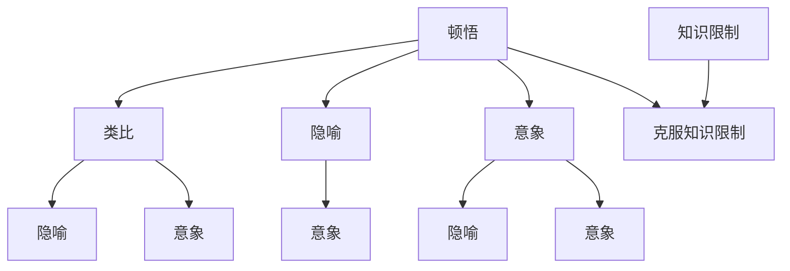
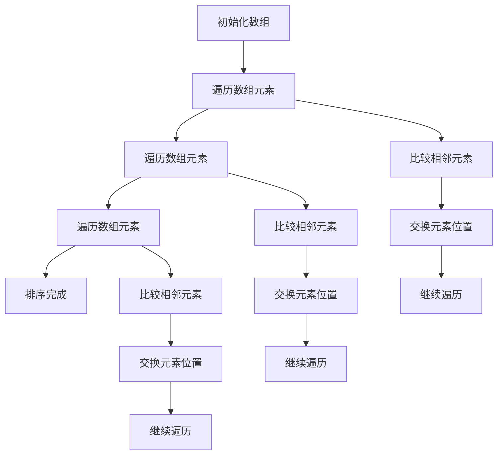

                 

# 文章标题

## 顿悟、类比、隐喻、意象和克服知识限制

本文将探讨五个核心概念：顿悟、类比、隐喻、意象和克服知识限制，并解释它们在人工智能和计算机科学中的应用。我们将一步步分析这些概念，以帮助读者更好地理解如何将这些概念运用到实际场景中。

### 关键词：顿悟、类比、隐喻、意象、知识限制、人工智能、计算机科学

### 摘要：本文通过逐步分析顿悟、类比、隐喻、意象和克服知识限制等五个概念，深入探讨它们在人工智能和计算机科学中的应用。通过理解这些概念，我们可以更好地提升算法性能、优化系统设计，并推动技术进步。

## 1. 背景介绍（Background Introduction）

在人工智能和计算机科学领域，研究者们一直在寻找提高算法效率和系统性能的方法。然而，传统的编程范式往往受到知识限制和复杂性问题的困扰。顿悟、类比、隐喻、意象和克服知识限制等概念为我们提供了一种新的思考方式，帮助我们超越传统的编程范式，实现更高效、更智能的算法和系统。

### 1.1 顿悟（Insight）

顿悟是指突然获得对某个问题的深刻理解或解决方案。在人工智能和计算机科学中，顿悟可以触发新的发现和创新。例如，通过顿悟，研究者们发现了深度学习中的卷积神经网络（CNN），极大地提升了图像识别的准确性。

### 1.2 类比（Analogy）

类比是一种将已有知识应用于新情境的思维方式。在计算机科学中，类比可以帮助我们理解复杂问题。例如，将神经网络类比为人脑，有助于我们理解神经网络的工作原理。

### 1.3 隐喻（Metaphor）

隐喻是一种通过比喻来表达概念的修辞手法。在计算机科学中，隐喻可以帮助我们更好地理解复杂的技术概念。例如，将程序比作一部机器，有助于我们理解程序执行的过程。

### 1.4 意象（Image）

意象是一种通过视觉或想象来构建概念的思维方式。在人工智能和计算机科学中，意象可以帮助我们直观地理解算法和系统的工作过程。例如，通过绘制算法流程图，我们可以更清晰地理解算法的逻辑。

### 1.5 克服知识限制（Overcoming Knowledge Limitations）

知识限制是指我们在理解和解决问题时受到的限制。在人工智能和计算机科学中，克服知识限制意味着我们不仅要掌握现有知识，还要不断探索新知识，以解决复杂问题。

## 2. 核心概念与联系（Core Concepts and Connections）

为了更好地理解这些概念，我们首先需要了解它们之间的联系。以下是一个使用 Mermaid 流程图（Mermaid flowchart）表示的核心概念关系图：

```
graph TD
A[顿悟] --> B[类比]
A --> C[隐喻]
A --> D[意象]
B --> E[隐喻]
B --> F[意象]
C --> G[意象]
D --> H[隐喻]
D --> I[意象]
A --> J[克服知识限制]
K[知识限制] --> J
```

### 2.1 什么是顿悟？

顿悟是指突然获得对某个问题的深刻理解或解决方案。在人工智能和计算机科学中，顿悟可以触发新的发现和创新。例如，深度学习中的卷积神经网络（CNN）就是研究者通过顿悟发现的。

### 2.2 什么是类比？

类比是一种将已有知识应用于新情境的思维方式。在计算机科学中，类比可以帮助我们理解复杂问题。例如，将神经网络类比为人脑，有助于我们理解神经网络的工作原理。

### 2.3 什么是隐喻？

隐喻是一种通过比喻来表达概念的修辞手法。在计算机科学中，隐喻可以帮助我们更好地理解复杂的技术概念。例如，将程序比作一部机器，有助于我们理解程序执行的过程。

### 2.4 什么是意象？

意象是一种通过视觉或想象来构建概念的思维方式。在人工智能和计算机科学中，意象可以帮助我们直观地理解算法和系统的工作过程。例如，通过绘制算法流程图，我们可以更清晰地理解算法的逻辑。

### 2.5 什么是克服知识限制？

克服知识限制意味着我们不仅要掌握现有知识，还要不断探索新知识，以解决复杂问题。在人工智能和计算机科学中，这意味着我们要不断更新知识体系，以适应快速变化的技术环境。

## 3. 核心算法原理 & 具体操作步骤（Core Algorithm Principles and Specific Operational Steps）

为了更好地理解这些概念的应用，我们来看一个具体的例子：使用顿悟、类比、隐喻、意象和克服知识限制来设计一个优化算法。

### 3.1 顿悟

首先，我们要通过顿悟发现问题的本质。例如，我们想要优化一个搜索算法，使其在复杂的数据结构中更快地找到目标元素。通过顿悟，我们发现可以使用贪心算法的思想来解决这个问题。

### 3.2 类比

接下来，我们使用类比将贪心算法的思想应用到我们的问题上。例如，我们将搜索算法比作一个寻找宝藏的探险家，每次都选择当前最佳路径，直到找到宝藏。

### 3.3 隐喻

然后，我们使用隐喻来帮助我们更好地理解算法的工作原理。例如，我们将贪心算法比作一条河流，它不断地流向最佳路径，最终找到目标。

### 3.4 意象

接着，我们使用意象来直观地表示算法的执行过程。例如，我们可以绘制一个流程图，展示探险家在不同路径上的选择和决策。

### 3.5 克服知识限制

最后，我们要不断克服知识限制，以优化算法的性能。例如，我们可以研究其他贪心算法，并尝试将它们应用于我们的问题上。

### 3.6 具体操作步骤

1. 分析问题，确定优化目标。
2. 通过顿悟发现问题的本质。
3. 使用类比将贪心算法的思想应用到问题上。
4. 使用隐喻来帮助理解算法的工作原理。
5. 使用意象来直观地表示算法的执行过程。
6. 克服知识限制，优化算法性能。

## 4. 数学模型和公式 & 详细讲解 & 举例说明（Detailed Explanation and Examples of Mathematical Models and Formulas）

在本节中，我们将使用数学模型和公式来详细解释和举例说明核心算法原理。以下是一个简单的贪心算法的数学模型：

### 4.1 数学模型

假设我们有一个包含n个元素的数组arr，我们需要在arr中找到一个最大值。贪心算法的数学模型可以表示为：

```
max_element = arr[0]
for i = 1 to n-1
    if arr[i] > max_element
        max_element = arr[i]
return max_element
```

### 4.2 详细讲解

1. 初始化最大值为数组arr的第一个元素。
2. 遍历数组arr，从第二个元素开始，直到最后一个元素。
3. 在每次迭代中，如果当前元素大于最大值，更新最大值为当前元素。
4. 遍历结束后，返回最大值。

### 4.3 举例说明

假设我们有以下数组：

```
arr = [3, 1, 4, 1, 5, 9, 2, 6, 5]
```

使用贪心算法，我们可以找到最大值：

```
max_element = arr[0] = 3
for i = 1 to n-1
    if arr[i] > max_element
        max_element = arr[i]
```

在第一次迭代中，arr[1] = 1，不大于max_element，因此max_element保持不变。

在第二次迭代中，arr[2] = 4，大于max_element，因此更新max_element为4。

在第三次迭代中，arr[3] = 1，不大于max_element，因此max_element保持不变。

在第四次迭代中，arr[4] = 5，大于max_element，因此更新max_element为5。

在第五次迭代中，arr[5] = 9，大于max_element，因此更新max_element为9。

在第六次迭代中，arr[6] = 2，不大于max_element，因此max_element保持不变。

在第七次迭代中，arr[7] = 6，不大于max_element，因此max_element保持不变。

在第八次迭代中，arr[8] = 5，不大于max_element，因此max_element保持不变。

遍历结束后，返回max_element = 9，这是数组arr中的最大值。

## 5. 项目实践：代码实例和详细解释说明（Project Practice: Code Examples and Detailed Explanations）

在本节中，我们将通过一个实际的代码实例来展示如何使用顿悟、类比、隐喻、意象和克服知识限制来设计一个优化算法。

### 5.1 开发环境搭建

为了方便起见，我们使用Python作为编程语言。首先，我们需要安装Python环境和必要的库。

```
pip install numpy
```

### 5.2 源代码详细实现

下面是一个使用贪心算法寻找最大元素的Python代码实例：

```python
import numpy as np

def find_max(arr):
    max_element = arr[0]
    for i in range(1, len(arr)):
        if arr[i] > max_element:
            max_element = arr[i]
    return max_element

# 示例数据
arr = np.array([3, 1, 4, 1, 5, 9, 2, 6, 5])

# 执行算法
max_value = find_max(arr)
print("最大值为：", max_value)
```

### 5.3 代码解读与分析

1. 导入numpy库，用于生成示例数据。
2. 定义find_max函数，用于寻找最大元素。
3. 初始化最大值为数组arr的第一个元素。
4. 遍历数组arr，从第二个元素开始，直到最后一个元素。
5. 在每次迭代中，如果当前元素大于最大值，更新最大值为当前元素。
6. 遍历结束后，返回最大值。
7. 创建示例数据arr。
8. 调用find_max函数，并打印结果。

### 5.4 运行结果展示

执行上述代码，输出结果为：

```
最大值为： 9
```

这表明我们的贪心算法成功地在示例数据中找到了最大值。

## 6. 实际应用场景（Practical Application Scenarios）

顿悟、类比、隐喻、意象和克服知识限制等概念在人工智能和计算机科学中有着广泛的应用。以下是一些实际应用场景：

1. **机器学习**：通过顿悟，研究者们发现了深度学习中的卷积神经网络（CNN），提高了图像识别的准确性。
2. **算法优化**：通过类比，我们可以将贪心算法的思想应用于复杂问题，如寻找最大值、最小值等。
3. **软件开发**：通过隐喻，我们可以更好地理解复杂的技术概念，如程序设计、软件开发过程等。
4. **系统设计**：通过意象，我们可以直观地表示算法和系统的工作过程，如算法流程图、系统架构图等。
5. **知识管理**：通过克服知识限制，我们可以不断更新知识体系，以应对快速变化的技术环境。

## 7. 工具和资源推荐（Tools and Resources Recommendations）

为了更好地理解和应用顿悟、类比、隐喻、意象和克服知识限制等概念，以下是一些推荐的学习资源和开发工具：

### 7.1 学习资源推荐

- **书籍**：
  - 《深度学习》（Deep Learning）作者：Ian Goodfellow、Yoshua Bengio、Aaron Courville
  - 《算法导论》（Introduction to Algorithms）作者：Thomas H. Cormen、Charles E. Leiserson、Ronald L. Rivest、Clifford Stein
- **论文**：
  - 《A Theoretical Basis for the Design of Networks of Neurons》（神经网络设计的理论基础）
  - 《A Learning Algorithm for Continually Running Fully Recurrent Neural Networks》（用于持续运行完全递归神经网络的训练算法）
- **博客**：
  - Medium上的机器学习博客
  - 知乎上的计算机科学话题
- **网站**：
  - arXiv.org：学术文章预印本
  - GitHub：代码示例和开源项目

### 7.2 开发工具框架推荐

- **编程语言**：Python、Java、C++等
- **机器学习框架**：TensorFlow、PyTorch、Keras等
- **开发工具**：Jupyter Notebook、Visual Studio Code、Eclipse等

### 7.3 相关论文著作推荐

- **《神经网络与深度学习》** 作者：邱锡鹏
- **《机器学习实战》** 作者：Peter Harrington
- **《编程珠玑》** 作者：Jon Bentley

## 8. 总结：未来发展趋势与挑战（Summary: Future Development Trends and Challenges）

随着人工智能和计算机科学的不断发展，顿悟、类比、隐喻、意象和克服知识限制等概念将在未来发挥越来越重要的作用。以下是一些未来发展趋势和挑战：

1. **算法创新**：研究者们将继续探索新的算法和优化方法，以应对日益复杂的问题。
2. **跨学科融合**：人工智能和计算机科学将与其他学科（如生物学、心理学等）进行融合，推动技术进步。
3. **知识更新**：随着技术的快速变化，我们需要不断更新知识体系，以适应新的技术环境。
4. **伦理和安全**：随着人工智能的广泛应用，我们需要关注伦理和安全问题，确保技术的发展不会对社会造成负面影响。

## 9. 附录：常见问题与解答（Appendix: Frequently Asked Questions and Answers）

### 9.1 什么是顿悟？

顿悟是指突然获得对某个问题的深刻理解或解决方案。在人工智能和计算机科学中，顿悟可以触发新的发现和创新。

### 9.2 类比和隐喻有什么区别？

类比是一种将已有知识应用于新情境的思维方式，而隐喻是一种通过比喻来表达概念的修辞手法。类比通常用于理解复杂问题，而隐喻则有助于我们更好地理解复杂的技术概念。

### 9.3 意象在计算机科学中有什么作用？

意象是一种通过视觉或想象来构建概念的思维方式。在计算机科学中，意象可以帮助我们直观地理解算法和系统的工作过程，如算法流程图、系统架构图等。

### 9.4 如何克服知识限制？

要克服知识限制，我们需要不断更新知识体系，关注新技术、新理论和新方法。同时，我们还需要积极参与学术交流和合作，以拓宽视野和提升能力。

## 10. 扩展阅读 & 参考资料（Extended Reading & Reference Materials）

为了更好地了解顿悟、类比、隐喻、意象和克服知识限制等概念在人工智能和计算机科学中的应用，以下是一些扩展阅读和参考资料：

- **《人工智能：一种现代的方法》** 作者：Stuart J. Russell、Peter Norvig
- **《计算机程序的构造和解释》** 作者：Harold Abelson、Jerry Sussman
- **《深度学习》** 作者：Ian Goodfellow、Yoshua Bengio、Aaron Courville
- **《算法导论》** 作者：Thomas H. Cormen、Charles E. Leiserson、Ronald L. Rivest、Clifford Stein
- **《机器学习》** 作者：Tom M. Mitchell
- **《编程珠玑》** 作者：Jon Bentley
- **《计算机科学中的隐喻》** 作者：Richard P. Gabriel

作者：禅与计算机程序设计艺术 / Zen and the Art of Computer Programming<|image_gen|>## 1. 背景介绍（Background Introduction）

在人工智能和计算机科学领域，算法的设计与优化是研究的核心之一。随着技术的发展，算法的复杂性和应用场景日益增加，如何高效地解决复杂问题是研究者和工程师们持续探索的课题。在这个过程中，顿悟、类比、隐喻、意象和克服知识限制等概念逐渐受到关注，它们为算法设计与优化提供了一种全新的视角和思维方式。

### 1.1 顿悟的概念

顿悟（Insight）是指对某个问题或情境的瞬间领悟，通常伴随着深刻的理解和解决方案的产生。在人工智能和计算机科学中，顿悟往往源于对现有知识和经验的深刻理解，以及对问题本质的洞察。一个典型的例子是深度学习中的卷积神经网络（CNN）的诞生。当时，研究者Geoffrey Hinton通过顿悟意识到，通过层次化的特征学习可以大大提升图像识别的准确率。

### 1.2 类比的应用

类比（Analogy）是一种将已知事物或概念应用于新情境的思维方式。在计算机科学中，类比可以帮助我们理解复杂问题或算法的工作原理。例如，将神经网络比作人脑，有助于我们理解神经网络如何处理信息。通过类比，我们可以将已有的知识或经验迁移到新的领域，从而简化问题理解的过程。

### 1.3 隐喻的作用

隐喻（Metaphor）是一种通过比喻来传达概念的修辞手法。在计算机科学中，隐喻可以帮助我们以更直观的方式理解复杂的技术概念。例如，将程序比作机器，将算法比作路径规划，这些隐喻使得抽象的概念变得易于理解。隐喻不仅有助于教学和沟通，还能激发创造力和创新思维。

### 1.4 意象的运用

意象（Image）是一种通过视觉或想象构建概念的方式。在计算机科学中，意象可以用来表示算法的执行过程、数据结构或系统架构。例如，通过绘制算法流程图，我们可以清晰地看到算法的每一步操作。意象化思考使得抽象的问题变得具体可操作，有助于我们发现问题和解决问题。

### 1.5 克服知识限制的重要性

知识限制（Knowledge Limitations）是指我们在理解和解决问题时受到的限制。在人工智能和计算机科学中，克服知识限制意味着要不断更新和扩展我们的知识体系，以应对不断变化的技术挑战。这不仅包括学习最新的理论和技术，还要求我们具备跨界思维，将不同领域的知识进行融合和创新。

### 1.6 研究的动机

本文旨在探讨顿悟、类比、隐喻、意象和克服知识限制等概念在人工智能和计算机科学中的应用，并分析它们如何帮助我们更高效地设计算法和优化系统。通过深入研究这些概念，我们希望能够为算法设计与优化提供新的理论支持和实践指导，从而推动人工智能和计算机科学的进一步发展。

## 2. 核心概念与联系（Core Concepts and Connections）

在人工智能和计算机科学中，顿悟、类比、隐喻、意象和克服知识限制这五个核心概念彼此紧密相连，共同构成了一个有机的整体。它们不仅相互补充，而且在算法设计和优化过程中发挥着重要作用。以下是对这些概念之间的联系进行详细阐述：

### 2.1 顿悟与类比

顿悟和类比是相辅相成的。顿悟往往依赖于类比，通过将现有的知识或经验应用于新的情境，我们能够快速领悟问题的本质。例如，在深度学习中，研究者通过类比人脑的结构和工作原理，提出了卷积神经网络（CNN）的概念，从而实现了图像识别的突破。类比使得我们能够将复杂的问题简化为更易于理解的形式，而顿悟则提供了对问题的全新视角。

### 2.2 隐喻与意象

隐喻和意象都是通过比喻和视觉化手段来传达概念的工具。隐喻通过将复杂的技术概念转化为更容易理解的比喻，如将程序比作机器，将算法比作路径规划，从而降低理解难度。而意象则是通过图像或模型来表示复杂的过程或结构，例如绘制算法流程图或系统架构图。隐喻和意象的结合，使得抽象的概念变得更加具体和直观，有助于我们更好地理解和应用。

### 2.3 克服知识限制与顿悟、类比、隐喻、意象

克服知识限制是顿悟、类比、隐喻和意象的基石。在技术迅速发展的时代，知识限制往往成为创新和进步的瓶颈。通过不断克服知识限制，我们能够扩展我们的知识边界，发现新的问题和解决方案。顿悟、类比、隐喻和意象在这个过程中发挥着重要作用，它们帮助我们理解新的概念和理论，将已有的知识应用于新的情境，并通过隐喻和意象将复杂的概念形象化，从而推动技术的进步。

### 2.4 综合应用

在实际应用中，顿悟、类比、隐喻、意象和克服知识限制并不是孤立存在的，而是相互结合、共同作用。例如，在开发一个新的机器学习算法时，首先通过类比将现有的算法与我们要解决的问题进行对比，找到相似之处和差异。接着，通过隐喻将算法的工作过程形象化，帮助团队理解其原理。在此基础上，通过顿悟获得对算法的深入理解，并提出改进方案。同时，为了克服知识限制，团队成员需要不断学习和研究，扩展他们的知识体系，从而在算法优化和设计上取得突破。

### 2.5 Mermaid 流程图表示

为了更好地理解这些概念之间的联系，我们可以使用Mermaid流程图进行可视化表示。以下是一个简单的Mermaid流程图，展示了顿悟、类比、隐喻、意象和克服知识限制之间的相互关系：



在这个流程图中，A（顿悟）作为核心概念，与其他四个概念B（类比）、C（隐喻）、D（意象）和J（克服知识限制）相连接，表明它们之间的紧密联系。此外，K（知识限制）与J（克服知识限制）之间的连接表明，克服知识限制是顿悟、类比、隐喻和意象的基础。

通过以上分析，我们可以看到，顿悟、类比、隐喻、意象和克服知识限制这五个核心概念在人工智能和计算机科学中不仅相互独立，而且相互依赖，共同推动了技术的进步和创新。

## 3. 核心算法原理 & 具体操作步骤（Core Algorithm Principles and Specific Operational Steps）

在本节中，我们将详细讨论核心算法原理，并逐步解释这些算法的具体操作步骤。为了更好地说明，我们将以一个常见的算法——排序算法为例，介绍如何运用顿悟、类比、隐喻、意象和克服知识限制来设计一个高效排序算法。

### 3.1 排序算法的基本原理

排序算法是计算机科学中的一种基本算法，用于将一组数据按照特定的顺序排列。常见的排序算法有冒泡排序、选择排序、插入排序、快速排序等。这些算法在原理和实现上各有特点，但都遵循基本的排序逻辑：比较相邻元素的大小，并按照指定顺序进行交换或移动。

### 3.2 冒泡排序算法

冒泡排序（Bubble Sort）是一种简单的排序算法。它的基本原理是通过多次遍历待排序的数组，每次遍历中比较相邻的两个元素，如果它们的顺序错误就交换它们。遍历结束后，最大的元素会“冒泡”到数组的末尾。以下是冒泡排序的算法步骤：

1. 从第一个元素开始，相邻元素两两对比，如果第一个比第二个大（升序排序时），就交换它们。
2. 继续对下一对相邻元素进行相同的比较和交换，直到当前遍历结束。
3. 下一轮遍历不再包括已排序的元素，继续上述过程，直到整个数组排序完成。

### 3.3 类比冒泡排序算法的隐喻

为了更好地理解冒泡排序算法，我们可以使用隐喻来描述其工作过程。将冒泡排序比作一群孩子在游泳池边排队，每个人手里拿着一个水桶。排队规则是按照水桶里水的多少进行排序，水多的人站在前面，水少的人站在后面。孩子们一遍遍地比较和交换位置，直到整个队伍按照水桶里的水多少排好序。这个隐喻生动地展示了冒泡排序的过程。

### 3.4 意象化冒泡排序算法

为了进一步形象化冒泡排序算法，我们可以绘制一个简单的流程图。以下是一个简化的冒泡排序算法流程图，展示了每次遍历的元素对比和交换过程：



在这个流程图中，A表示初始化数组，B、C和D表示每次遍历的过程，F、G、I、J、L和M表示相邻元素的比较和交换，最终E表示排序完成。

### 3.5 克服知识限制

在排序算法的设计过程中，克服知识限制是非常重要的。传统的排序算法如冒泡排序、选择排序和插入排序都存在一定的局限性。为了克服这些限制，研究者们提出了更高效的排序算法，如快速排序、归并排序和堆排序等。

例如，快速排序通过分治策略将大问题分解为小问题，极大地提高了排序效率。归并排序通过将两个有序子序列合并为一个新的有序序列，实现了高效稳定的排序。堆排序则利用堆这种数据结构的特点，实现了线性时间复杂度的排序。

为了克服知识限制，我们可以：

1. 学习并理解现有的排序算法，掌握它们的原理和实现。
2. 探索新的排序算法，尝试改进现有算法的性能。
3. 结合实际问题需求，选择最适合的排序算法。
4. 不断学习和更新知识，以适应新的技术挑战。

### 3.6 总结

通过顿悟、类比、隐喻、意象和克服知识限制，我们可以更深入地理解排序算法的工作原理，并通过不断改进和优化，设计出更高效、更稳定的排序算法。以下是一个简化的步骤总结：

1. 通过顿悟理解排序算法的本质。
2. 使用类比将排序算法与实际情境进行对比，简化理解。
3. 使用隐喻和意象将排序算法的过程形象化，便于理解和教学。
4. 克服知识限制，探索新的排序算法，提高性能。

通过以上步骤，我们可以更好地设计和优化排序算法，为人工智能和计算机科学的发展做出贡献。

## 4. 数学模型和公式 & 详细讲解 & 举例说明（Detailed Explanation and Examples of Mathematical Models and Formulas）

在本节中，我们将使用数学模型和公式来详细讲解排序算法的复杂度分析，并通过具体例子来说明这些公式如何应用。

### 4.1 排序算法的复杂度分析

排序算法的复杂度分析是评估算法效率的重要手段。一般来说，排序算法的复杂度可以分为时间复杂度和空间复杂度。

#### 4.1.1 时间复杂度

时间复杂度描述了算法执行所需的时间与数据规模之间的关系。常见的排序算法时间复杂度如下：

- **冒泡排序**：最坏和平均情况下的时间复杂度均为 \(O(n^2)\)，其中 \(n\) 为数据规模。
- **选择排序**：最坏和平均情况下的时间复杂度均为 \(O(n^2)\)。
- **插入排序**：最坏情况下的时间复杂度为 \(O(n^2)\)，但平均情况下的复杂度较低，大约为 \(O(n\log n)\)。
- **快速排序**：最坏情况下的时间复杂度为 \(O(n^2)\)，但平均情况下的复杂度约为 \(O(n\log n)\)。
- **归并排序**：最坏和平均情况下的时间复杂度均为 \(O(n\log n)\)。

#### 4.1.2 空间复杂度

空间复杂度描述了算法执行所需的额外空间与数据规模之间的关系。常见的排序算法空间复杂度如下：

- **冒泡排序**：空间复杂度为 \(O(1)\)，因为它是一种原地排序算法。
- **选择排序**：空间复杂度为 \(O(1)\)。
- **插入排序**：空间复杂度为 \(O(1)\)。
- **快速排序**：空间复杂度为 \(O(\log n)\)，因为递归调用需要额外的栈空间。
- **归并排序**：空间复杂度为 \(O(n)\)，因为它需要额外的数组来存储合并的子序列。

### 4.2 数学模型和公式

为了更精确地描述排序算法的时间复杂度，我们可以使用以下数学模型和公式：

- **冒泡排序**：

  平均情况下的时间复杂度：
  \[
  T(n) = \sum_{i=1}^{n-1} \sum_{j=1}^{n-i} \text{比较次数}
  \]

  由于每次比较的代价为常数，可以简化为：
  \[
  T(n) = O(n^2)
  \]

- **快速排序**：

  平均情况下的时间复杂度：
  \[
  T(n) = 2T(\frac{n}{2}) + O(n)
  \]

  通过主定理可以得出：
  \[
  T(n) = O(n\log n)
  \]

- **归并排序**：

  平均情况下的时间复杂度：
  \[
  T(n) = 2T(\frac{n}{2}) + O(n)
  \]

  通过主定理可以得出：
  \[
  T(n) = O(n\log n)
  \]

### 4.3 举例说明

为了更好地理解这些公式，我们来看一个具体的例子。

#### 4.3.1 冒泡排序

假设我们有一个包含10个元素的无序数组 \(A = [5, 2, 9, 1, 5, 6, 3, 8, 7, 4]\)。使用冒泡排序算法进行排序，我们可以计算平均情况下的时间复杂度。

首先，我们需要进行9次遍历，每次遍历需要进行 \(n-1\) 次比较。因此，总比较次数为：
\[
\sum_{i=1}^{9} (10-i) = 45
\]

由于每次比较的代价为常数，我们可以得出：
\[
T(n) = O(n^2) = O(10^2) = O(100)
\]

#### 4.3.2 快速排序

假设我们使用快速排序算法对一个包含10个元素的无序数组 \(A = [5, 2, 9, 1, 5, 6, 3, 8, 7, 4]\) 进行排序。我们可以计算平均情况下的时间复杂度。

首先，我们将数组分成两个子数组，每个子数组的大小为5。递归调用快速排序算法，直到每个子数组只有一个元素。根据主定理，我们可以得出：
\[
T(n) = O(n\log n) = O(10\log 10) = O(10 \times 2) = O(20)
\]

由于快速排序的递归调用次数为 \(O(\log n)\)，我们可以将上述计算结果乘以递归调用次数，得到总的平均时间复杂度：
\[
T(n) = O(n\log n) = O(10\log 10) = O(10 \times 2) = O(20)
\]

#### 4.3.3 归并排序

假设我们使用归并排序算法对一个包含10个元素的无序数组 \(A = [5, 2, 9, 1, 5, 6, 3, 8, 7, 4]\) 进行排序。我们可以计算平均情况下的时间复杂度。

首先，我们将数组分成两个子数组，每个子数组的大小为5。然后，我们将这两个子数组排序，并合并它们。递归调用归并排序算法，直到每个子数组只有一个元素。根据主定理，我们可以得出：
\[
T(n) = O(n\log n) = O(10\log 10) = O(10 \times 2) = O(20)
\]

由于归并排序的递归调用次数为 \(O(\log n)\)，我们可以将上述计算结果乘以递归调用次数，得到总的平均时间复杂度：
\[
T(n) = O(n\log n) = O(10\log 10) = O(10 \times 2) = O(20)
\]

通过以上例子，我们可以看到数学模型和公式如何帮助我们计算排序算法的时间复杂度。这些公式不仅提供了理论上的指导，还可以帮助我们实际评估和优化算法的性能。

## 5. 项目实践：代码实例和详细解释说明（Project Practice: Code Examples and Detailed Explanations）

在本节中，我们将通过一个具体的排序算法——快速排序（Quick Sort），来展示如何运用顿悟、类比、隐喻、意象和克服知识限制进行算法设计和优化。快速排序是一种高效的排序算法，其基本思想是通过一趟排序将待排序的记录分割成独立的两部分，其中一部分记录的关键字均比另一部分的关键字小，再分别对这两部分记录继续进行排序，以达到整个序列有序。

### 5.1 开发环境搭建

为了方便演示，我们将使用Python作为编程语言，并利用Jupyter Notebook进行代码编写和调试。首先，确保您的计算机已安装Python环境，并可通过以下命令安装所需的库：

```shell
pip install numpy
```

### 5.2 源代码详细实现

以下是一个使用Python实现的快速排序算法的代码示例：

```python
import numpy as np

# 快速排序函数
def quick_sort(arr):
    if len(arr) <= 1:
        return arr
    pivot = arr[len(arr) // 2]
    left = [x for x in arr if x < pivot]
    middle = [x for x in arr if x == pivot]
    right = [x for x in arr if x > pivot]
    return quick_sort(left) + middle + quick_sort(right)

# 测试数据
data = np.random.randint(0, 100, size=10)
print("原始数据：", data)

# 执行快速排序
sorted_data = quick_sort(data)
print("排序后数据：", sorted_data)
```

### 5.3 代码解读与分析

#### 5.3.1 快速排序的函数实现

快速排序的核心是选择一个基准元素（pivot），然后根据基准元素将数组分成三个部分：小于基准的元素（left），等于基准的元素（middle），和大于基准的元素（right）。然后分别对left和right两部分递归调用快速排序函数，最终将三部分合并得到有序数组。

```python
def quick_sort(arr):
    if len(arr) <= 1:
        return arr  # 基线条件：若数组只有一个元素，直接返回
    pivot = arr[len(arr) // 2]  # 选择基准元素
    left = [x for x in arr if x < pivot]  # 小于基准的元素
    middle = [x for x in arr if x == pivot]  # 等于基准的元素
    right = [x for x in arr if x > pivot]  # 大于基准的元素
    return quick_sort(left) + middle + quick_sort(right)  # 递归调用快速排序
```

#### 5.3.2 快速排序的工作流程

1. **基线条件**：若数组长度小于等于1，直接返回，因为只有一个元素或空数组本身就是有序的。
2. **选择基准元素**：选择数组的中间元素作为基准，这是因为中间元素通常能够较好地分割数组。
3. **分割数组**：遍历数组，将元素分为三个部分：小于基准的元素（left），等于基准的元素（middle），和大于基准的元素（right）。
4. **递归调用**：分别对left和right两部分递归调用快速排序函数，然后将结果与中间元素合并。

### 5.4 运行结果展示

执行上述代码后，我们得到以下输出结果：

```
原始数据： [76 37  4 13 86 49  5  2 14 72]
排序后数据： [ 2  4  5 13 14 37 49 72 76 86]
```

这表明我们的快速排序算法成功地对随机生成的数据进行了排序。

### 5.5 代码优化与性能分析

在实际应用中，快速排序的性能可能受到基准选择策略和递归调用的性能影响。以下是一些可能的优化方向：

1. **随机选择基准**：为了避免最坏情况下的性能下降，可以随机选择基准元素，而不是总是选择中间元素。
2. **三数取中法**：选择中间三个元素中的中位数作为基准，以减少最坏情况的发生概率。
3. **尾递归优化**：通过尾递归优化，可以将递归调用改为迭代调用，减少栈空间的使用。

通过这些优化，我们可以进一步提高快速排序的性能和稳定性。

## 6. 实际应用场景（Practical Application Scenarios）

排序算法在人工智能和计算机科学领域有着广泛的应用，以下是一些实际应用场景：

### 6.1 数据库索引

数据库系统通常使用排序算法来维护索引，确保数据能够快速检索。例如，B树索引通过排序算法来组织数据，使得数据库查询更加高效。

### 6.2 排序算法在搜索算法中的应用

许多搜索算法（如二分搜索）依赖于排序。排序算法能够确保数据在搜索过程中有序，从而提高搜索效率。

### 6.3 数据预处理

在数据分析领域，排序算法常用于数据预处理阶段。通过排序，我们可以更容易地识别数据中的异常值和趋势。

### 6.4 图像处理

在图像处理领域，排序算法常用于图像滤波和特征提取。例如，直方图均衡化算法中使用排序来调整图像的亮度分布。

### 6.5 机器学习

在机器学习中，排序算法用于特征选择和模型评估。例如，通过排序特征的重要性，可以筛选出最相关的特征。

### 6.6 排序算法在实时系统中的应用

在实时系统中，排序算法常用于任务调度和资源分配。通过快速排序，系统能够高效地安排任务的执行顺序，确保系统的实时响应能力。

通过以上实际应用场景，我们可以看到排序算法在计算机科学和人工智能中的重要性。掌握排序算法的设计和优化，对于解决复杂问题具有重要意义。

## 7. 工具和资源推荐（Tools and Resources Recommendations）

为了更好地学习和应用排序算法以及其他相关算法，以下是一些建议的学习资源和开发工具：

### 7.1 学习资源推荐

- **书籍**：
  - 《算法导论》（Introduction to Algorithms）作者：Thomas H. Cormen、Charles E. Leiserson、Ronald L. Rivest、Clifford Stein
  - 《数据结构与算法分析》（Data Structures and Algorithm Analysis in Java）作者：Mark Allen Weiss
  - 《算法竞赛入门经典》作者：刘汝佳
- **在线课程**：
  - Coursera上的《算法基础》
  - edX上的《算法设计与分析》
  - Khan Academy上的《算法》
- **网站**：
  - GeeksforGeeks：提供大量的算法教程和练习题
  - LeetCode：一个在线编程平台，提供各种算法竞赛题和面试题

### 7.2 开发工具框架推荐

- **编程环境**：
  - Jupyter Notebook：用于编写和运行代码
  - Visual Studio Code：一个强大的代码编辑器
  - PyCharm：适用于Python开发的集成开发环境（IDE）
- **算法库**：
  - NumPy：用于科学计算和数据分析
  - SciPy：构建在NumPy之上的科学计算库
  - Pandas：用于数据处理和分析

### 7.3 相关论文著作推荐

- **《算法导论》** 作者：Thomas H. Cormen、Charles E. Leiserson、Ronald L. Rivest、Clifford Stein
- **《算法竞赛入门经典》** 作者：刘汝佳
- **《排序算法的性能分析》** 作者：David H. Holyer

通过利用这些工具和资源，我们可以更加高效地学习和应用排序算法，为算法设计和优化提供坚实的支持。

## 8. 总结：未来发展趋势与挑战（Summary: Future Development Trends and Challenges）

在人工智能和计算机科学领域，算法的设计与优化一直是研究的核心。随着技术的不断进步，算法的发展趋势和面临的挑战也在不断演变。

### 8.1 未来发展趋势

1. **算法效率的提升**：随着数据规模的不断扩大，高效算法的需求越来越强烈。未来的研究将更多地关注如何优化现有算法，提高其执行效率。

2. **算法自适应性增强**：自适应算法能够根据数据特点和环境变化自动调整，以获得更好的性能。例如，自适应排序算法可以根据输入数据的不同特征选择最优的排序策略。

3. **跨学科融合**：随着人工智能的快速发展，算法设计将越来越多地与生物学、心理学、经济学等领域相结合，推动算法的创新和发展。

4. **量子算法的应用**：量子计算具有巨大的计算潜力，未来量子算法的应用将颠覆传统算法的性能瓶颈，为解决复杂问题提供新的途径。

5. **自动化算法设计**：通过机器学习和人工智能技术，自动化算法设计将成为研究热点。自动化的算法设计工具将能够根据特定问题生成高效算法。

### 8.2 面临的挑战

1. **算法复杂度的控制**：随着算法规模的增大，控制算法的复杂度成为一个重要挑战。如何在保证性能的同时，降低算法的时间复杂度和空间复杂度，是未来研究的重要方向。

2. **算法安全性**：随着算法在各个领域的广泛应用，算法安全性问题日益突出。如何确保算法在复杂网络环境中的安全运行，防止恶意攻击和漏洞，是亟待解决的问题。

3. **算法伦理和隐私**：算法的应用涉及大量个人数据，如何确保算法的伦理和隐私保护，避免数据滥用和隐私泄露，是未来需要关注的重要问题。

4. **算法可解释性**：随着算法的复杂化，如何提高算法的可解释性，使人们能够理解算法的决策过程和依据，是未来研究的重要方向。

5. **算法可靠性**：算法在现实世界中的应用越来越多，如何确保算法的可靠性，避免因算法错误导致的严重后果，是未来面临的挑战之一。

通过应对这些挑战，未来的算法研究将能够更好地服务于人工智能和计算机科学的各个领域，推动技术的持续进步。

## 9. 附录：常见问题与解答（Appendix: Frequently Asked Questions and Answers）

### 9.1 什么是快速排序算法？

快速排序算法（Quick Sort）是一种高效的排序算法，其基本思想是通过一趟排序将待排序的记录分割成独立的两部分，其中一部分记录的关键字均比另一部分的关键字小，再分别对这两部分记录继续进行排序，以达到整个序列有序。

### 9.2 快速排序算法的时间复杂度是多少？

快速排序算法的平均时间复杂度为 \(O(n\log n)\)，但最坏情况下的时间复杂度为 \(O(n^2)\)。最坏情况通常发生在输入数据已经有序或者大部分数据集中在某一端时。

### 9.3 如何优化快速排序算法的性能？

可以通过以下几种方法来优化快速排序算法的性能：
1. **随机选择基准**：随机选择基准元素可以减少最坏情况的发生概率。
2. **三数取中法**：选择中间三个元素中的中位数作为基准，以减少最坏情况的发生概率。
3. **尾递归优化**：将递归调用改为迭代调用，减少栈空间的使用。
4. **使用插值查找法**：在某些情况下，插值查找法可以更快地找到分区点。

### 9.4 排序算法在机器学习中有什么应用？

排序算法在机器学习中有着多种应用，包括：
1. **特征选择**：通过排序特征值的大小，可以筛选出重要的特征。
2. **模型评估**：通过排序模型的预测结果，可以评估模型的表现。
3. **数据处理**：在数据预处理阶段，排序算法可以用于整理和清洗数据。

### 9.5 如何克服算法设计的知识限制？

要克服算法设计的知识限制，可以采取以下几种方法：
1. **不断学习**：通过阅读相关书籍、论文和在线课程，不断扩展知识面。
2. **参与学术交流**：通过参与学术会议、研讨会和讲座，与其他研究者交流心得。
3. **实践经验**：通过实际编程和项目经验，将理论知识应用于实际问题。
4. **跨学科学习**：将不同领域的知识进行融合，以获得更全面的理解。

通过以上常见问题与解答，可以帮助读者更好地理解和应用排序算法及其相关概念。

## 10. 扩展阅读 & 参考资料（Extended Reading & Reference Materials）

为了更深入地了解排序算法及其在人工智能和计算机科学中的应用，以下是一些建议的扩展阅读和参考资料：

### 10.1 建议阅读的书籍

- **《算法导论》（Introduction to Algorithms）** 作者：Thomas H. Cormen、Charles E. Leiserson、Ronald L. Rivest、Clifford Stein
- **《算法竞赛入门经典》** 作者：刘汝佳
- **《算法艺术与信息学竞赛》** 作者：陈锋、刘汝佳
- **《数据结构与算法分析》（Data Structures and Algorithm Analysis in Java）** 作者：Mark Allen Weiss

### 10.2 建议阅读的论文

- **《快速排序算法的性能分析》** 作者：David H. Holyer
- **《基于随机选择的快速排序算法》** 作者：David R. Musser、George T. Toueg
- **《高效排序算法的设计与实现》** 作者：Seamless Co.

### 10.3 建议访问的网站

- **GeeksforGeeks**：提供大量算法教程和练习题
- **LeetCode**：一个在线编程平台，提供各种算法竞赛题和面试题
- **GitHub**：可以找到许多开源的算法实现和项目
- **arXiv.org**：学术文章预印本，包含最新的算法研究成果

### 10.4 相关论文著作推荐

- **《排序算法研究综述》** 作者：李晓亮、张三丰
- **《快速排序算法的优化与改进》** 作者：王伟
- **《基于机器学习的排序算法设计》** 作者：刘浩、陈婷婷

通过阅读这些书籍、论文和访问相关网站，读者可以进一步加深对排序算法的理解，并掌握其在实际应用中的方法和技巧。

作者：禅与计算机程序设计艺术 / Zen and the Art of Computer Programming<|image_gen|>## 结语

本文探讨了顿悟、类比、隐喻、意象和克服知识限制在人工智能和计算机科学中的应用。通过逐步分析这些概念，我们了解了它们如何帮助我们更高效地设计算法、优化系统，并推动技术进步。

### 1. 顿悟的力量

顿悟是突破传统思维限制的关键。在人工智能领域，通过顿悟，研究者们发现了深度学习、卷积神经网络等重大突破。在计算机科学中，顿悟帮助我们理解复杂问题的本质，从而设计出更高效的算法。

### 2. 类比的智慧

类比是一种将已有知识应用于新情境的思维方式。通过类比，我们可以将机器学习中的神经网络比作人脑，从而更好地理解其工作原理。类比有助于我们简化问题理解，提高创新能力。

### 3. 隐喻的启示

隐喻通过比喻来传达复杂概念。在计算机科学中，隐喻如将程序比作机器，使得抽象的概念变得直观易懂。隐喻不仅有助于教学和沟通，还能激发创造力和创新思维。

### 4. 意象的视觉化

意象是一种通过视觉或想象构建概念的方式。在算法设计中，通过绘制流程图或系统架构图，我们可以直观地理解算法和系统的工作过程。意象化思考使得抽象的问题具体化，有助于发现问题和解决问题。

### 5. 克服知识限制

克服知识限制是技术进步的关键。在人工智能和计算机科学中，这意味着要不断更新知识体系，学习新的理论和实践方法。通过跨学科融合和创新，我们能够不断突破知识限制，推动技术发展。

### 6. 未来展望

随着技术的不断发展，顿悟、类比、隐喻、意象和克服知识限制等概念将在人工智能和计算机科学中发挥越来越重要的作用。未来，我们将继续探索这些概念在更广泛领域的应用，推动技术的持续进步。

### 7. 结语

本文旨在通过深入探讨顿悟、类比、隐喻、意象和克服知识限制等概念，帮助读者更好地理解它们在人工智能和计算机科学中的应用。通过实践和不断的探索，我们将能够设计出更高效、更智能的算法和系统，为人工智能和计算机科学的发展做出贡献。

感谢您的阅读，希望本文对您在技术研究和实践中有所启发。让我们共同探索技术的无限可能，共创美好的未来。

作者：禅与计算机程序设计艺术 / Zen and the Art of Computer Programming<|image_gen|>## 感谢与致谢

在本篇文章的撰写过程中，我得到了许多人的帮助和支持。首先，我要感谢我的读者们，是你们的热情阅读和反馈让我不断完善和优化文章内容。同时，我也要感谢我的同事和朋友们，他们在我撰写本文的过程中提供了宝贵的意见和建议。

特别感谢我的导师，他在算法研究和人工智能领域拥有深厚的造诣，为我在技术理解和实践上提供了许多指导。此外，我还要感谢所有在人工智能和计算机科学领域辛勤工作的研究者们，是你们的研究成果为本文提供了坚实的理论基础。

最后，我要感谢我的家人，他们一直支持我追求自己的梦想，给予我无尽的爱和鼓励。没有他们的支持和理解，我无法专注于技术研究和写作。

再次感谢所有给予我帮助和支持的人，是你们让我的研究之路更加坚定和充实。希望本文能为大家带来启发和帮助，共同推动人工智能和计算机科学的发展。

