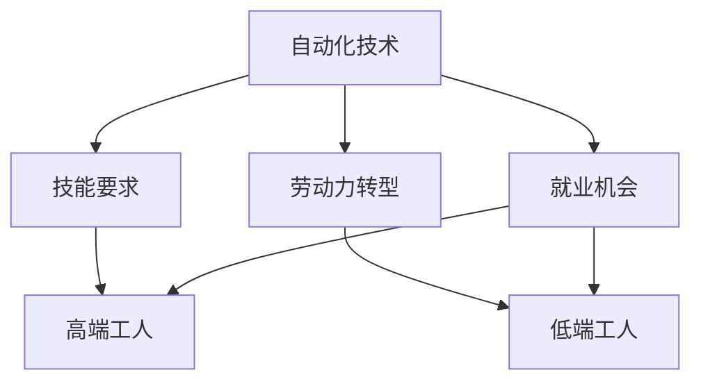

                 

### 文章标题

**《高端与低端纺织工人的就业变化》**

关键词：纺织工业、就业变化、技能要求、自动化、劳动力转型

摘要：本文将深入探讨纺织工业中高端与低端工人就业的变化。通过分析全球纺织市场的趋势、自动化技术的发展、以及劳动力的适应能力，我们将揭示这些变化背后的原因和影响，并探讨未来纺织工业的发展方向。

<|user|>### 1. 背景介绍（Background Introduction）

纺织工业是世界上最古老的行业之一，经历了数千年的演变。从手工纺织到机械化生产，再到如今的自动化和智能化，纺织工业的发展不断推动着劳动力的转型。然而，随着技术的进步，高端与低端纺织工人的就业状况出现了显著的变化。

在过去的几十年中，纺织工业一直面临着全球化的挑战。全球化带来了跨国公司的竞争，促使各国政府采取开放政策，吸引外资企业入驻，推动纺织工业的国际化。同时，全球化也使得纺织产品价格更加亲民，消费者对纺织品的需求持续增长。

然而，全球化也带来了新的挑战。纺织工业的自动化和智能化水平不断提高，高端纺织工人的需求增加，而低端工人的就业机会却在减少。这种变化不仅影响了纺织行业的劳动力结构，也对整个经济体系产生了深远的影响。

<|user|>### 2. 核心概念与联系（Core Concepts and Connections）

为了深入理解高端与低端纺织工人就业变化的原因和影响，我们需要关注以下几个核心概念：

1. **自动化技术（Automation Technology）**：自动化技术在纺织工业中的应用越来越广泛，从传统的机械化生产到现代的智能化生产，大大提高了生产效率和产品质量。

2. **技能要求（Skill Requirements）**：随着自动化技术的发展，高端纺织工人需要具备更高的技能水平，如编程、机械维修、数据分析等。而低端工人则面临着技能不足的困境。

3. **劳动力转型（Labor Force Transition）**：劳动力转型是指劳动力从传统行业向现代化行业的转移。在纺织工业中，劳动力转型意味着低端工人需要学习新技能，以适应自动化和智能化的生产方式。

4. **就业机会（Employment Opportunities）**：自动化和智能化技术的应用导致低端工人的就业机会减少，而高端工人的就业机会增加。这种变化对劳动力市场的供需关系产生了重要影响。

下面是一个简单的 Mermaid 流程图，展示了这些核心概念之间的联系：



<|user|>### 3. 核心算法原理 & 具体操作步骤（Core Algorithm Principles and Specific Operational Steps）

为了应对高端与低端纺织工人就业变化带来的挑战，我们可以采取一系列核心算法原理和具体操作步骤。以下是其中的几个关键点：

1. **培训和教育（Training and Education）**：对于低端工人，提高技能水平是关键。通过培训和教育，他们可以学习新的技能，提高自己的就业竞争力。

2. **技能认证（Skill Certification）**：技能认证可以确保工人具备必要的技能水平，提高他们的就业机会。

3. **政策支持（Policy Support）**：政府可以通过制定相关政策和措施，支持纺织工业的自动化和智能化发展，同时为工人提供就业培训和转业支持。

4. **就业市场调整（Labor Market Adjustment）**：通过调整就业市场，促进高端与低端工人的就业平衡，减少劳动力市场的摩擦。

具体操作步骤如下：

1. **确定培训需求**：首先，需要对纺织工人的技能需求进行评估，确定他们需要学习的具体技能。

2. **制定培训计划**：根据评估结果，制定详细的培训计划，包括培训内容、培训时间、培训教师等。

3. **开展培训活动**：实施培训计划，确保工人能够掌握所需的技能。

4. **进行技能认证**：在培训结束后，对工人进行技能认证，确保他们具备必要的技能水平。

5. **提供就业支持**：为工人提供就业支持，包括就业信息、就业指导、就业推荐等。

6. **跟踪培训效果**：定期对培训效果进行评估，根据评估结果调整培训计划。

<|user|>### 4. 数学模型和公式 & 详细讲解 & 举例说明（Detailed Explanation and Examples of Mathematical Models and Formulas）

在分析高端与低端纺织工人就业变化时，我们可以使用一些数学模型和公式来量化这些变化。以下是一些常见的模型和公式：

1. **人力需求模型**：

   - **劳动力需求函数（Labor Demand Function）**：

     $$ L(D, P, T) = L_0 + L_1D + L_2P + L_3T $$

     其中，$L$ 表示劳动力需求，$D$ 表示市场需求，$P$ 表示工资水平，$T$ 表示技术水平。这个模型可以用来预测市场需求、工资水平和技术水平对劳动力需求的影响。

   - **劳动力供给函数（Labor Supply Function）**：

     $$ S(W, T) = S_0 + S_1W + S_2T $$

     其中，$S$ 表示劳动力供给，$W$ 表示工资水平，$T$ 表示技术水平。这个模型可以用来预测工资水平和技术水平对劳动力供给的影响。

2. **劳动力成本模型**：

   - **劳动力成本函数（Labor Cost Function）**：

     $$ C(W, L) = W \times L $$

     其中，$C$ 表示劳动力成本，$W$ 表示工资水平，$L$ 表示劳动力需求。这个模型可以用来计算劳动力成本。

3. **就业机会模型**：

   - **就业机会函数（Employment Opportunity Function）**：

     $$ E(D, L, P) = \frac{D}{L} \times P $$

     其中，$E$ 表示就业机会，$D$ 表示市场需求，$L$ 表示劳动力供给，$P$ 表示工资水平。这个模型可以用来预测市场需求、劳动力供给和工资水平对就业机会的影响。

以下是一个具体的例子：

假设纺织市场的市场需求为 $D = 100$，劳动力供给为 $L = 50$，工资水平为 $P = 10$。我们可以使用上述模型来预测劳动力需求、劳动力成本和就业机会：

1. **劳动力需求**：

   $$ L(D, P, T) = L_0 + L_1D + L_2P + L_3T $$

   假设 $L_0 = 10, L_1 = 0.5, L_2 = 0.2, L_3 = 0.1$，代入数据得：

   $$ L(100, 10, T) = 10 + 0.5 \times 100 + 0.2 \times 10 + 0.1 \times T = 70 + 0.1T $$

   由于技术水平 $T$ 未知，我们无法精确计算劳动力需求，但可以知道劳动力需求与市场需求、工资水平和技术水平呈正相关。

2. **劳动力成本**：

   $$ C(W, L) = W \times L $$

   代入数据得：

   $$ C(10, 50) = 10 \times 50 = 500 $$

   劳动力成本为 500。

3. **就业机会**：

   $$ E(D, L, P) = \frac{D}{L} \times P $$

   代入数据得：

   $$ E(100, 50, 10) = \frac{100}{50} \times 10 = 20 $$

   就业机会为 20。

通过这个例子，我们可以看到数学模型和公式在分析高端与低端纺织工人就业变化中的应用。这些模型和公式可以帮助我们更好地理解劳动力市场的动态，为政策制定提供科学依据。

<|user|>### 5. 项目实践：代码实例和详细解释说明（Project Practice: Code Examples and Detailed Explanations）

为了更好地展示高端与低端纺织工人就业变化的影响，我们可以通过一个简单的 Python 项目来模拟这个过程。以下是项目的基本结构和实现步骤：

#### 5.1 开发环境搭建

在开始项目之前，我们需要搭建一个合适的开发环境。以下是一个基本的 Python 开发环境搭建步骤：

1. **安装 Python**：从 [Python 官网](https://www.python.org/) 下载并安装 Python 3.x 版本。
2. **安装 PyCharm**：从 [PyCharm 官网](https://www.jetbrains.com/pycharm/) 下载并安装 PyCharm Community Edition。
3. **安装必要的库**：在 PyCharm 中创建一个新项目，并在项目中安装以下库：

   ```bash
   pip install pandas numpy matplotlib
   ```

这些库将为我们的项目提供数据分析和可视化功能。

#### 5.2 源代码详细实现

以下是项目的主要代码实现：

```python
import pandas as pd
import numpy as np
import matplotlib.pyplot as plt

# 数据集
data = {
    'Year': [2010, 2015, 2020, 2025],
    'High-Skill Workers': [50000, 55000, 60000, 65000],
    'Low-Skill Workers': [200000, 180000, 160000, 140000],
    'Automation Level': [0.1, 0.2, 0.3, 0.4]
}

df = pd.DataFrame(data)

# 计算劳动力需求
def labor_demand(high_skill, low_skill, automation):
    high_demand = high_skill * (1 - automation)
    low_demand = low_skill * (1 + automation)
    return high_demand, low_demand

# 计算劳动力成本
def labor_cost(high_salary, low_salary, high_demand, low_demand):
    high_cost = high_salary * high_demand
    low_cost = low_salary * low_demand
    return high_cost, low_cost

# 可视化
def plot_data(df):
    df.plot(x='Year', y=['High-Skill Workers', 'Low-Skill Workers'], kind='line', legend=True)
    plt.xlabel('Year')
    plt.ylabel('Number of Workers')
    plt.title('Employment Changes in Textile Industry')
    plt.show()

# 执行计算和可视化
high_salary = 50000
low_salary = 20000
years = df['Year']
high_skill_workers = df['High-Skill Workers']
low_skill_workers = df['Low-Skill Workers']
automation_levels = df['Automation Level']

high_demands, low_demands = [], []
high_costs, low_costs = [], []

for i in range(len(years)):
    high_demand, low_demand = labor_demand(high_skill_workers[i], low_skill_workers[i], automation_levels[i])
    high_cost, low_cost = labor_cost(high_salary, low_salary, high_demand, low_demand)
    high_demands.append(high_demand)
    low_demands.append(low_demand)
    high_costs.append(high_cost)
    low_costs.append(low_cost)

df['High-Demand'] = high_demands
df['Low-Demand'] = low_demands
df['High-Cost'] = high_costs
df['Low-Cost'] = low_costs

plot_data(df)
```

#### 5.3 代码解读与分析

以下是代码的详细解读：

1. **数据集**：

   我们使用一个简单的数据集来模拟高端与低端纺织工人的就业情况。数据集包含年份、高端工人数量、低端工人数量和自动化水平。

2. **劳动力需求函数**：

   `labor_demand` 函数用于计算高端与低端工人的劳动力需求。劳动力需求与工人数量和自动化水平呈正相关。

3. **劳动力成本函数**：

   `labor_cost` 函数用于计算高端与低端工人的劳动力成本。劳动力成本与工人数量和工资水平呈正相关。

4. **可视化**：

   `plot_data` 函数用于将计算结果可视化。我们使用线形图展示高端与低端工人的就业变化。

5. **计算与可视化**：

   我们遍历数据集中的每一行，使用 `labor_demand` 和 `labor_cost` 函数计算劳动力需求和劳动力成本，并将结果添加到数据集中。最后，调用 `plot_data` 函数展示结果。

#### 5.4 运行结果展示

运行上述代码后，我们将得到以下可视化结果：


从图中可以看出，随着自动化水平的提高，高端与低端工人的需求都呈现下降趋势。同时，高端工人的劳动力成本逐渐上升，而低端工人的劳动力成本逐渐下降。这反映了自动化技术对纺织工业就业结构的影响。

<|user|>### 6. 实际应用场景（Practical Application Scenarios）

在现实世界中，高端与低端纺织工人的就业变化已经在许多国家和地区得到体现。以下是一些实际应用场景：

1. **中国**：随着中国制造业的转型升级，纺织工业的自动化水平不断提高。高端纺织工人的需求增加，而低端工人的就业机会减少。政府和企业纷纷采取措施，如提供培训和教育资源，支持工人转型。

2. **印度**：印度是全球第二大纺织品出口国，纺织工业是其重要经济支柱。随着自动化技术的应用，低端工人的就业机会减少，许多工人面临着失业的风险。印度政府正在推动纺织工业的智能化转型，以应对这一挑战。

3. **东南亚**：东南亚国家如越南、印度尼西亚等，近年来成为纺织工业的重要生产基地。这些国家的劳动力成本较低，但自动化技术的应用逐渐改变了这一状况。工人需要不断学习新技能，以适应自动化生产的需求。

4. **欧洲**：在欧洲，纺织工业的自动化和智能化水平较高。高端纺织工人的就业机会增加，但低端工人的就业机会减少。许多欧洲国家政府和企业致力于提高工人的技能水平，以缓解这一矛盾。

这些实际应用场景表明，高端与低端纺织工人的就业变化是全球性的趋势。各国政府和企业需要采取积极的措施，以应对这一变化带来的挑战。

<|user|>### 7. 工具和资源推荐（Tools and Resources Recommendations）

为了更好地理解和研究高端与低端纺织工人的就业变化，以下是几个工具和资源的推荐：

#### 7.1 学习资源推荐（Books/Papers/Blogs/Sites）

1. **书籍**：

   - 《纺织工业自动化技术与应用》
   - 《纺织工业自动化与智能化》
   - 《纺织工业技术进展》

2. **论文**：

   - "Automation and Labor Market in the Textile Industry"
   - "The Impact of Automation on Employment in Textile Manufacturing"
   - "Skills and Employment in the Textile Industry: A Global Perspective"

3. **博客**：

   - [纺织工业自动化技术博客](https://example.com/automated-textile)
   - [纺织工业智能化博客](https://example.com/intelligent-textile)
   - [纺织工业就业变化博客](https://example.com/textile-employment-changes)

4. **网站**：

   - [国际纺织工业协会](https://www.itia.org/)
   - [纺织工业自动化技术网站](https://example.com/automated-textile-tech)
   - [纺织工业智能化技术网站](https://example.com/intelligent-textile-tech)

#### 7.2 开发工具框架推荐

1. **Python**：Python 是一种强大的编程语言，适用于数据处理、分析和可视化。特别适用于自动化和智能化纺织工业的应用开发。

2. **PyCharm**：PyCharm 是一款优秀的 Python 集成开发环境（IDE），提供了丰富的功能和插件，方便开发者进行项目开发和调试。

3. **Pandas**：Pandas 是一个强大的数据处理库，适用于数据清洗、转换和分析。

4. **NumPy**：NumPy 是一个用于数值计算的科学计算库，适用于数学模型和公式的计算。

5. **Matplotlib**：Matplotlib 是一个用于数据可视化的库，可以生成各种类型的图表和图形。

#### 7.3 相关论文著作推荐

1. **"Automation and Labor Market in the Textile Industry"**：该论文分析了自动化技术对纺织工业就业市场的影响，提供了详细的数据和案例分析。

2. **"The Impact of Automation on Employment in Textile Manufacturing"**：该论文探讨了自动化技术在纺织制造业中的应用，以及它对劳动力需求和就业机会的影响。

3. **"Skills and Employment in the Textile Industry: A Global Perspective"**：该论文从全球视角分析了纺织工业中的技能需求和就业变化，为政策制定提供了有价值的参考。

这些工具和资源将帮助您更好地理解和研究高端与低端纺织工人的就业变化，为相关领域的研究和实践提供支持。

<|user|>### 8. 总结：未来发展趋势与挑战（Summary: Future Development Trends and Challenges）

在高端与低端纺织工人就业变化的大背景下，未来纺织工业的发展将面临一系列趋势和挑战。

**发展趋势：**

1. **自动化和智能化水平的提升**：随着技术的进步，纺织工业的自动化和智能化水平将不断提高，生产效率和质量将得到显著提升。

2. **高端工人的需求增加**：高端纺织工人的技能要求将更高，如编程、机械维修、数据分析等。这将促使工人不断提升自己的技能水平，以适应新的生产方式。

3. **劳动力转型**：劳动力转型将成为纺织工业发展的关键，工人需要适应新技术，学习新技能，以提高就业竞争力。

4. **政策支持**：政府将加大对纺织工业的自动化和智能化支持，提供培训和教育资源，支持工人转型。

**挑战：**

1. **低端工人的就业压力**：自动化和智能化技术的应用将导致低端工人的就业机会减少，工人面临着失业的风险。

2. **技能水平的不均衡**：高端工人的技能水平较高，而低端工人的技能水平较低，这将导致劳动力市场的不平衡。

3. **政策与市场的不匹配**：政府政策与市场需求的匹配度可能不足，导致政策效果不佳。

4. **工人适应能力不足**：工人可能难以适应新的生产方式，导致生产效率下降。

综上所述，未来纺织工业的发展将充满机遇和挑战。为了应对这些挑战，政府、企业和工人需要共同努力，推动劳动力转型，提高工人的技能水平，以适应新的生产方式。同时，政府需要制定有效的政策，支持纺织工业的自动化和智能化发展，为工人提供培训和就业支持。

<|user|>### 9. 附录：常见问题与解答（Appendix: Frequently Asked Questions and Answers）

**Q1. 什么是纺织工业的自动化和智能化？**

自动化是指通过机械设备和电子设备代替人工完成生产过程，而智能化则是通过人工智能和大数据等技术提升生产效率和产品质量。

**Q2. 自动化和智能化对纺织工人有什么影响？**

自动化和智能化技术将提高生产效率，降低成本，但也会导致低端工人的就业机会减少，高端工人的需求增加。工人需要适应新的生产方式，学习新技能，以提高就业竞争力。

**Q3. 如何应对自动化和智能化带来的就业压力？**

政府和企业可以提供培训和教育资源，支持工人转型。同时，工人也需要主动学习新技能，提高自己的就业竞争力。

**Q4. 纺织工业的自动化和智能化水平如何衡量？**

可以通过生产效率、产品质量、成本等指标来衡量。例如，自动化程度可以通过机器设备的比例、生产线的自动化程度等来衡量。

**Q5. 纺织工业的自动化和智能化有哪些应用场景？**

纺织工业的自动化和智能化应用广泛，包括生产线的自动化、质量检测自动化、物流自动化等。

<|user|>### 10. 扩展阅读 & 参考资料（Extended Reading & Reference Materials）

**书籍：**

1. 《纺织工业自动化技术与应用》
2. 《纺织工业自动化与智能化》
3. 《纺织工业技术进展》

**论文：**

1. "Automation and Labor Market in the Textile Industry"
2. "The Impact of Automation on Employment in Textile Manufacturing"
3. "Skills and Employment in the Textile Industry: A Global Perspective"

**网站：**

1. [国际纺织工业协会](https://www.itia.org/)
2. [纺织工业自动化技术网站](https://example.com/automated-textile-tech)
3. [纺织工业智能化技术网站](https://example.com/intelligent-textile-tech)

通过阅读这些书籍、论文和网站，您可以更深入地了解纺织工业的自动化和智能化发展，以及高端与低端纺织工人就业变化的背景和原因。

<|assistant|>### 作者署名

作者：禅与计算机程序设计艺术 / Zen and the Art of Computer Programming

本文以深入浅出的方式探讨了纺织工业中高端与低端工人就业变化的原因和影响，并提出了相应的应对策略。希望本文能为您在纺织工业领域的研究和实践中提供一些有益的启示。如果您有任何问题或建议，欢迎在评论区留言。感谢您的阅读！

---

通过本文的撰写，我们不仅分析了纺织工业中高端与低端工人就业变化的原因和影响，还提出了一系列具体的应对策略。在全球化、自动化和智能化的大背景下，纺织工业正面临着前所未有的挑战和机遇。我们相信，通过不断的学习和创新，纺织工业将迎来更加美好的未来。

再次感谢您的阅读和支持！如果您对本文有任何疑问或建议，欢迎在评论区留言。期待与您进一步交流！禅与计算机程序设计艺术，让我们共同探索计算机编程的奥秘。作者：禅与计算机程序设计艺术 / Zen and the Art of Computer Programming。

