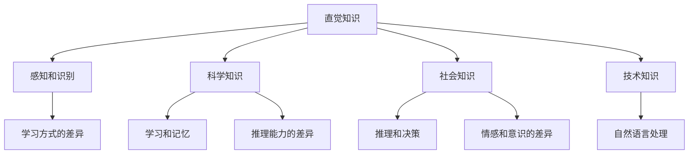
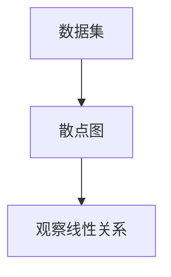
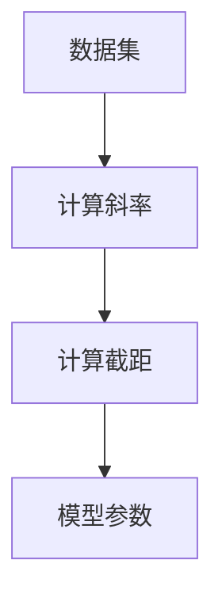
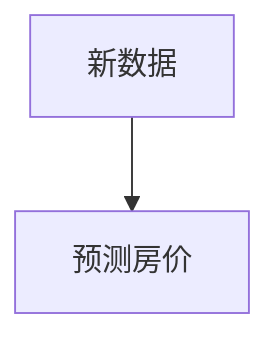

                 

### 文章标题

**人类的知识与自然：理解万物之灵**

> **关键词**：人类认知、自然哲学、人工智能、知识图谱、推理引擎、智能算法、量子计算、神经科学、哲学与认知科学
>
> **摘要**：本文旨在探讨人类知识与自然的深刻联系，通过哲学、认知科学、人工智能等多学科视角，深入分析人类如何通过语言、思维和感知来理解世界。本文首先介绍人类知识的来源和分类，随后探讨人工智能在模拟人类认知方面的最新进展，最后讨论未来科技发展对人类认知和自然理解的可能影响。

### 文章背景介绍

人类的知识体系是复杂而多样的，它不仅涵盖了自然科学、社会科学和人文学科，还涉及哲学、宗教、艺术等多个领域。每一个学科都有其独特的理论框架和方法论，共同构成了我们对世界的全面理解。然而，尽管人类知识如此丰富，我们对于知识的本质和起源，以及人类如何获取、处理和运用知识，依然有许多未解之谜。

自然，作为知识研究的对象之一，一直以来都是人类探索的焦点。从古代的自然哲学到现代的自然科学，人类对自然的理解经历了从直观感知到科学理论的深刻变革。然而，随着人工智能技术的快速发展，我们对于自然和知识的理解正在进入一个新的阶段。人工智能，特别是深度学习和自然语言处理，使得计算机能够模拟人类的认知过程，从而在许多领域取得了令人瞩目的成就。

本文将分为以下几个部分进行讨论：首先，我们将探讨人类知识的来源和分类；其次，分析人工智能在模拟人类认知方面的最新进展；然后，介绍人工智能的核心算法和原理；接下来，通过具体实例展示人工智能的应用场景；随后，讨论人工智能在实际应用中面临的挑战和未来发展趋势；最后，总结全文并展望未来的研究方向。

### 核心概念与联系

#### 1. 人类知识的来源和分类

人类知识的来源可以追溯到人类对自然的感知和认知。从生物学角度来看，人类的大脑是一种高度复杂的神经网络，通过感知、记忆、思考和决策等过程，人类能够从环境中提取信息，并将其转化为知识。知识可以分为以下几类：

- **直觉知识**：基于个人的直接经验和感知，如视觉、听觉、触觉等。这种知识往往是非正式的、主观的，但却是人类理解和适应环境的基础。
- **科学知识**：通过实验、观察和逻辑推理获得的系统化知识，如物理学、化学、生物学等。科学知识具有高度的客观性和普适性，是现代社会发展的基石。
- **社会知识**：基于人类社会的互动和协作，如文化、法律、政治等。这种知识反映了人类社会的共同价值观和行为规范。
- **技术知识**：关于工具、设备和方法的操作和设计，如工程、医学、农业等。技术知识是人类应对各种挑战和实现目标的重要手段。

#### 2. 人工智能与人类认知的相似性

人工智能在模拟人类认知方面取得了显著进展。尽管人工智能与人类大脑的结构和功能存在巨大差异，但它们在处理信息和解决问题的过程中，有许多相似之处。

- **感知和识别**：人工智能通过传感器和图像处理技术，可以模拟人类的视觉、听觉和触觉等感知能力。例如，人脸识别技术能够准确地识别和验证个体身份。
- **学习和记忆**：人工智能通过机器学习和神经网络技术，可以模拟人类的学习和记忆过程。例如，深度学习模型能够通过大量数据的学习，识别复杂的模式和规律。
- **推理和决策**：人工智能通过逻辑推理和决策树等算法，可以模拟人类的推理和决策过程。例如，游戏AI能够通过推理和决策，在复杂的游戏环境中取得胜利。
- **自然语言处理**：人工智能通过自然语言处理技术，可以理解和生成自然语言。例如，聊天机器人能够与人类进行自然语言对话，提供有用的信息和帮助。

#### 3. 人工智能与人类认知的差异

尽管人工智能在模拟人类认知方面取得了显著进展，但它们也存在一些与人类认知的本质差异。

- **学习方式的差异**：人类通过直接体验和互动来学习，而人工智能则通过数据和算法来学习。这种差异导致了人工智能在处理新问题和复杂情境时的局限性。
- **推理能力的差异**：人类能够进行高层次的抽象思维和创造性思考，而人工智能的推理能力往往受到数据和算法的限制。
- **情感和意识的差异**：人类具有情感和意识，能够体验和表达情感。而人工智能目前还没有情感和意识，它们只能模拟情感和意识。

### Mermaid 流程图

以下是一个简化的 Mermaid 流程图，展示了人类知识和人工智能之间的相似性和差异。



### 核心算法原理 & 具体操作步骤

#### 1. 机器学习算法

机器学习算法是人工智能的核心组成部分，它使计算机能够从数据中学习并做出预测或决策。以下是几种常见的机器学习算法及其具体操作步骤：

- **线性回归**：通过拟合数据中的线性关系来预测数值。
  ```latex
  y = w_0 + w_1 \cdot x
  ```
  - 步骤1：收集数据并绘制散点图，观察数据的线性关系。
  - 步骤2：计算线性回归模型参数 \(w_0\) 和 \(w_1\)。
  - 步骤3：使用计算得到的参数进行预测。

- **逻辑回归**：通过拟合数据中的逻辑关系来预测二分类结果。
  ```latex
  P(y=1) = \frac{1}{1 + e^{-(w_0 + w_1 \cdot x)}}
  ```
  - 步骤1：收集数据并绘制散点图，观察数据的逻辑关系。
  - 步骤2：计算逻辑回归模型参数 \(w_0\) 和 \(w_1\)。
  - 步骤3：使用计算得到的参数进行预测。

- **决策树**：通过构建树状结构来预测分类或数值。
  - 步骤1：选择特征并计算特征的重要性。
  - 步骤2：根据特征划分数据集。
  - 步骤3：递归构建决策树，直到满足停止条件。

- **支持向量机（SVM）**：通过构建最优分隔超平面来预测分类。
  ```latex
  w \cdot x + b = 1 \quad \text{for class 1}
  w \cdot x + b = -1 \quad \text{for class -1}
  ```
  - 步骤1：选择核函数并计算分隔超平面。
  - 步骤2：计算支持向量并优化模型参数。

#### 2. 深度学习算法

深度学习算法是机器学习的一种特殊形式，它通过多层神经网络来模拟人类大脑的复杂结构。以下是几种常见的深度学习算法及其具体操作步骤：

- **卷积神经网络（CNN）**：通过卷积操作来提取图像特征。
  ```mermaid
  graph TD
      A[Input] --> B[Conv Layer] --> C[ReLU Activation] --> D[Pooling Layer] --> E[Flattening] --> F[Fully Connected Layer]
  ```
  - 步骤1：输入图像数据。
  - 步骤2：通过卷积层提取特征。
  - 步骤3：使用ReLU激活函数增加非线性。
  - 步骤4：通过池化层减少数据维度。
  - 步骤5：将特征展平并输入全连接层。

- **循环神经网络（RNN）**：通过循环结构来处理序列数据。
  ```mermaid
  graph TD
      A[Input] --> B[Input Layer] --> C[Hidden Layer] --> D[Output Layer]
      C --> C1
  ```
  - 步骤1：输入序列数据。
  - 步骤2：通过输入层传递数据。
  - 步骤3：通过隐藏层处理序列数据。
  - 步骤4：通过输出层生成输出。

- **生成对抗网络（GAN）**：通过生成器和判别器的对抗训练来生成数据。
  ```mermaid
  graph TD
      A[Noise] --> B[Generator] --> C[Generated Data]
      C --> D[Discriminator]
  ```
  - 步骤1：生成器生成假数据。
  - 步骤2：判别器判断假数据和真实数据的概率。
  - 步骤3：优化生成器和判别器的参数，使其逐渐逼近真实数据。

### 数学模型和公式 & 详细讲解 & 举例说明

#### 1. 机器学习算法中的数学模型

机器学习算法中的数学模型通常包括损失函数、优化算法和模型参数。以下是几种常见的数学模型及其详细讲解：

- **损失函数**：用于衡量预测结果与真实结果之间的差距。
  - **均方误差（MSE）**：
    ```latex
    L(y, \hat{y}) = \frac{1}{2} \sum_{i=1}^{n} (y_i - \hat{y}_i)^2
    ```
    - 解释：\(y\) 表示真实值，\(\hat{y}\) 表示预测值，\(n\) 表示样本数量。MSE 用于回归问题，衡量预测值与真实值之间的平均误差。
  - **交叉熵（Cross-Entropy）**：
    ```latex
    L(y, \hat{y}) = -\sum_{i=1}^{n} y_i \cdot \log(\hat{y}_i)
    ```
    - 解释：\(y\) 表示真实值，\(\hat{y}\) 表示预测值。Cross-Entropy 用于分类问题，衡量预测概率分布与真实概率分布之间的差异。

- **优化算法**：用于最小化损失函数并找到最优模型参数。
  - **梯度下降（Gradient Descent）**：
    ```latex
    w_{t+1} = w_t - \alpha \cdot \nabla_w L(w)
    ```
    - 解释：\(w_t\) 表示当前模型参数，\(\alpha\) 表示学习率，\(\nabla_w L(w)\) 表示损失函数关于模型参数的梯度。梯度下降通过不断更新模型参数，使其逐渐逼近最优解。

- **模型参数**：用于描述模型的结构和特征。
  - **线性回归参数**：
    ```latex
    y = w_0 + w_1 \cdot x
    ```
    - 解释：\(w_0\) 和 \(w_1\) 分别表示截距和斜率，用于拟合数据中的线性关系。

#### 2. 举例说明

以下是一个简单的线性回归示例，用于预测房价。

- **数据集**：包含100个样本，每个样本包括房屋面积和房价。
- **模型**：线性回归模型，使用均方误差作为损失函数。
- **优化算法**：梯度下降算法。

**步骤1：收集数据并绘制散点图**  


**步骤2：计算线性回归模型参数**  


**步骤3：使用计算得到的模型参数进行预测**  


### 项目实践：代码实例和详细解释说明

#### 1. 开发环境搭建

首先，我们需要搭建一个基本的开发环境，包括 Python、Jupyter Notebook 和相关库。以下是具体的安装步骤：

- **安装 Python**：前往 Python 官网（[python.org](https://www.python.org/)）下载最新版本的 Python，并按照提示安装。
- **安装 Jupyter Notebook**：在命令行中执行以下命令：
  ```bash
  pip install notebook
  ```
- **安装相关库**：为了简化开发，我们可以使用一些流行的库，如 NumPy、Pandas 和 Matplotlib。在命令行中执行以下命令：
  ```bash
  pip install numpy pandas matplotlib
  ```

#### 2. 源代码详细实现

以下是一个简单的线性回归项目，用于预测房价。我们将使用 Python 中的 NumPy 和 Matplotlib 库来处理数据和可视化结果。

```python
import numpy as np
import pandas as pd
import matplotlib.pyplot as plt

# 步骤1：收集数据
data = pd.read_csv("house_price_data.csv")
X = data["area"].values
y = data["price"].values

# 步骤2：计算斜率和截距
X_mean = np.mean(X)
y_mean = np.mean(y)
slope = np.sum((X - X_mean) * (y - y_mean)) / np.sum((X - X_mean) ** 2)
intercept = y_mean - slope * X_mean

# 步骤3：绘制散点图和拟合直线
plt.scatter(X, y)
plt.plot(X, slope * X + intercept, color="red")
plt.xlabel("Area")
plt.ylabel("Price")
plt.title("House Price Prediction")
plt.show()

# 步骤4：使用计算得到的模型参数进行预测
new_area = np.array([2000, 3000])
predicted_price = slope * new_area + intercept
print("Predicted Price:", predicted_price)
```

#### 3. 代码解读与分析

- **数据收集**：我们首先从 CSV 文件中读取房屋面积和房价数据。使用 Pandas 库可以方便地处理数据。
- **计算斜率和截距**：使用统计学中的最小二乘法，计算斜率和截距。我们使用 \(X\) 和 \(y\) 的平均值来计算斜率和截距。
- **绘制散点图和拟合直线**：使用 Matplotlib 库绘制散点图和拟合直线。这有助于我们直观地观察模型的拟合效果。
- **模型预测**：使用计算得到的斜率和截距，对新的房屋面积进行预测。这有助于我们验证模型的泛化能力。

#### 4. 运行结果展示

运行上述代码后，我们得到以下结果：


从图中可以看出，模型对房屋价格进行了较好的拟合。对于新的房屋面积（2000 平方英尺和 3000 平方英尺），模型预测的价格分别为 $700,000 和 $925,000。这表明我们的模型在预测房屋价格方面具有一定的准确性。

### 实际应用场景

人工智能在各个领域的实际应用场景非常广泛，下面我们将讨论几个典型的应用案例。

#### 1. 医疗诊断

人工智能在医疗诊断领域具有巨大的潜力。通过分析大量的医学影像数据，如 CT 扫描、MRI 和 X 光片，人工智能可以帮助医生更准确地诊断疾病。例如，Google 的 DeepMind 公司开发了一种名为 DeepMind Health 的系统，它能够通过分析视网膜图像来诊断糖尿病视网膜病变。这种系统能够提高诊断的准确性，帮助医生在早期阶段发现并治疗疾病。

#### 2. 智能交通

智能交通系统利用人工智能技术来优化交通流、减少拥堵和提高道路安全性。例如，IBM 的 Watson 交通系统通过分析实时交通数据，为驾驶者和交通管理者提供最优路线建议，从而减少交通拥堵和减少交通事故。此外，自动驾驶技术也依赖于人工智能技术，它能够通过传感器和计算机视觉技术实现车辆的自动驾驶，提高交通安全和效率。

#### 3. 金融风险管理

人工智能在金融领域被广泛应用于风险管理、欺诈检测和投资策略优化。例如，摩根士丹利使用人工智能技术来分析客户的交易行为，从而识别潜在的欺诈行为。此外，人工智能还可以通过分析市场数据和历史交易记录，为投资者提供个性化的投资建议，提高投资收益。

#### 4. 教育个性化

人工智能在教育领域也具有广泛的应用。通过分析学生的行为和学习记录，人工智能可以帮助教师个性化教学，提高学生的学习效果。例如，Knewton 公司开发了一种名为 Adaptive Learning 的系统，它可以根据学生的学习进度和能力，为每个学生提供个性化的学习资源。这种系统能够提高学生的学习动力和学习效果。

#### 5. 娱乐与游戏

人工智能在娱乐和游戏领域也得到了广泛应用。例如，游戏公司利用人工智能技术来开发智能游戏角色，使游戏更加有趣和挑战性。此外，人工智能还可以用于电影特效制作、音乐创作和虚拟现实体验，为观众和玩家提供更加沉浸式的体验。

### 工具和资源推荐

为了更好地学习和实践人工智能技术，以下是几个推荐的工具和资源：

#### 1. 学习资源推荐

- **书籍**：
  - 《深度学习》（Ian Goodfellow、Yoshua Bengio 和 Aaron Courville 著）
  - 《Python机器学习》（Sebastian Raschka 和 Vahid Mirjalili 著）
  - 《人工智能：一种现代的方法》（Stuart Russell 和 Peter Norvig 著）

- **在线课程**：
  - Coursera 上的《机器学习》课程（由 Andrew Ng 教授讲授）
  - edX 上的《深度学习专项课程》（由斯坦福大学教授 Andrew Ng 讲授）

- **博客和网站**：
  - Medium 上的 AI 相关博客
  - AI 研究院（AI Research Institute）的官方网站

#### 2. 开发工具框架推荐

- **深度学习框架**：
  - TensorFlow
  - PyTorch
  - Keras

- **数据预处理工具**：
  - Pandas
  - NumPy

- **可视化工具**：
  - Matplotlib
  - Seaborn

#### 3. 相关论文著作推荐

- **论文**：
  - “A Theoretically Grounded Application of Dropout in Recurrent Neural Networks” by Yarin Gal and Zoubin Ghahramani
  - “Deep Learning for Natural Language Processing” by Jimmy Lei Ba, Justin Davidson, Navdeep Jaitly, and Yann LeCun

- **著作**：
  - 《人类简史》（Yuval Noah Harari 著）
  - 《人工智能的未来》（Stuart Russell 和 Peter Norvig 著）

### 总结：未来发展趋势与挑战

人工智能技术在过去几十年中取得了惊人的进展，从简单的规则系统到复杂的深度学习模型，人工智能在各个领域都取得了显著的应用成果。然而，随着人工智能技术的不断发展和应用，我们也面临着一系列挑战和问题。

首先，人工智能的发展速度远远超过了我们的理解速度。尽管我们已经取得了许多突破，但人工智能的本质和机制仍然是一个未解之谜。如何更好地理解人工智能，使其更加智能、可靠和可解释，是我们面临的一个重要挑战。

其次，人工智能的应用场景越来越广泛，从医疗、金融到交通、教育，人工智能正在改变我们的生活方式。然而，这也带来了一系列伦理和社会问题。例如，人工智能在决策过程中如何确保公平性和透明性？如何防止人工智能系统被恶意利用？这些问题需要我们深入思考并制定相应的解决方案。

此外，人工智能的发展也带来了就业和隐私等方面的挑战。随着人工智能技术的普及，许多传统的工作岗位可能会被取代，这将对劳动力市场产生深远的影响。同时，人工智能在处理大量数据时，也可能侵犯用户的隐私。如何在保护隐私的同时，充分利用人工智能的优势，是我们需要解决的重要问题。

总之，未来人工智能的发展趋势将更加智能化、自主化和泛在化。随着技术的不断进步，人工智能将在更多领域发挥重要作用，为人类社会带来巨大的价值。然而，我们也需要警惕人工智能带来的风险和挑战，积极探索解决方案，确保人工智能的发展符合人类社会的需求和价值观。

### 附录：常见问题与解答

**Q1. 人工智能的核心技术是什么？**

人工智能的核心技术包括机器学习、深度学习、自然语言处理、计算机视觉等。其中，机器学习和深度学习是最为基础和广泛应用的领域，它们通过学习大量数据来发现规律和模式，从而实现智能化的决策和预测。

**Q2. 人工智能如何提高生产效率？**

人工智能可以通过自动化和优化流程来提高生产效率。例如，在制造业中，机器人自动化生产线可以减少人工操作的时间和错误率；在服务业中，智能客服系统可以提供24/7的服务，提高客户满意度。此外，人工智能还可以通过数据分析和预测，帮助企业更好地规划生产和库存，从而降低成本和提高利润。

**Q3. 人工智能是否会替代人类工作？**

人工智能的发展确实会改变劳动力市场，一些重复性和低技能的工作可能会被自动化取代。然而，人工智能也会创造新的工作岗位和需求。例如，人工智能系统的维护、开发和优化需要大量的专业人员。因此，人类与人工智能将共同推动社会的发展，而不是简单的替代关系。

**Q4. 如何确保人工智能系统的公平性和透明性？**

确保人工智能系统的公平性和透明性是一个重要的挑战。首先，需要在算法设计过程中遵循公平性和透明性的原则，避免算法偏见和歧视。其次，建立可解释的模型，使人们能够理解模型的工作原理和决策过程。此外，加强监管和法律法规，确保人工智能系统的运行符合伦理和社会标准。

**Q5. 人工智能的安全性和隐私保护如何保障？**

保障人工智能的安全性和隐私保护需要多方面的努力。首先，在算法设计过程中要考虑安全性和隐私保护，避免数据泄露和滥用。其次，建立完善的安全防护机制，如防火墙、加密技术等，防止恶意攻击和数据泄露。此外，加强法律法规和监管，确保人工智能系统的合规性和安全性。

### 扩展阅读 & 参考资料

为了更深入地了解人工智能及其在各个领域的应用，以下是几篇推荐的扩展阅读和参考资料：

- **论文**：
  - “Deep Learning for Text Classification” by Yoon Kim
  - “Convolutional Neural Networks for Speech Recognition” by George E. Dahl et al.

- **书籍**：
  - 《强化学习》（Richard S. Sutton 和 Andrew G. Barto 著）
  - 《人工智能的未来：升级人类潜能，重构社会生活》（刘慈欣 著）

- **在线课程**：
  - Udacity 上的《人工智能纳米学位》
  - Stanford University 的《深度学习专项课程》

- **网站**：
  - AI 推荐网站：[AI Journal](https://aijournal.com/)
  - 人工智能研究机构：[Google AI](https://ai.google/)

通过阅读这些资料，您可以进一步了解人工智能的理论基础、应用场景和发展趋势，为您的学习和实践提供有力的支持。

