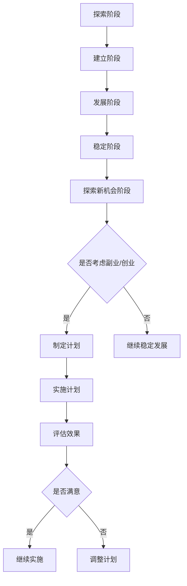

                 

### 文章标题

**从全职工作到副业创业的过渡**

> 关键词：全职工作、副业创业、职业发展、过渡策略、风险与收益

> 摘要：本文深入探讨了从全职工作向副业创业过渡的过程。通过分析职业发展的各个方面，提供了一系列策略和建议，帮助读者评估个人情况、制定计划，并成功过渡到副业创业。同时，本文也探讨了过渡过程中可能面临的风险和潜在的收益。

### <u>1. 背景介绍（Background Introduction）</u>

在现代职业环境中，越来越多的人寻求在全职工作之外开展副业或创业。这一趋势不仅反映了个人对于职业自由和财务独立的渴望，也是对快速变化的经济环境和技术进步的回应。然而，从全职工作向副业创业的过渡并非易事，它涉及到个人职业规划、资源管理、时间安排以及心理适应等多个方面。

对于许多人来说，全职工作的稳定性提供了经济保障和职业发展的平台，但同时也限制了探索新机会的自由。相反，副业或创业可能带来更高的不确定性和风险，但同时也提供了更大的自由度和潜在的财务回报。因此，如何平衡这两者之间的关系，实现平稳过渡，成为许多职场人士关注的焦点。

本文将系统地分析从全职工作到副业创业的过渡过程，提供实用的策略和案例分析，帮助读者在做出决策时具备更全面的认识。同时，本文也将讨论过渡过程中可能遇到的风险和挑战，以及如何最大化收益并降低风险。

### <u>2. 核心概念与联系（Core Concepts and Connections）</u>

#### 2.1 职业发展路径分析

在探讨从全职工作到副业创业的过渡之前，我们需要明确两个关键概念：职业发展和职业路径。职业发展是指个人在职业生涯中不断成长、学习、提升的过程，包括技能积累、职位晋升、收入增长等。而职业路径则是指个人在职业选择和决策过程中所经历的不同阶段和选择。

职业路径可以分为以下几个阶段：

1. **探索阶段**：个人在早期职业规划中，不断尝试不同的职业和行业，以了解自己的兴趣和优势。
2. **建立阶段**：在某个领域或行业内积累了一定的工作经验和技能，开始建立个人的职业品牌。
3. **发展阶段**：通过不断提升自身能力和扩展人脉网络，实现职业上的突破和晋升。
4. **稳定阶段**：在全职工作中达到一定的职位和收入水平，稳定发展。
5. **探索新机会阶段**：由于对现有工作环境的不满或渴望新的挑战，考虑开展副业或创业。

#### 2.2 副业创业的优势与挑战

副业创业作为一种职业路径选择，具有以下优势：

1. **经济自由**：通过副业或创业获得额外的收入来源，有助于实现财务独立。
2. **职业发展**：副业或创业过程中积累的新技能和经验，有助于提升个人职业竞争力。
3. **职业自由**：自主掌控工作时间和内容，实现工作与生活的平衡。

然而，副业创业也面临一系列挑战：

1. **时间管理**：需要平衡全职工作和副业创业的时间安排，避免过度劳累。
2. **资源分配**：有限的资源和精力需要合理分配，确保两个领域都能得到充分发展。
3. **风险承担**：副业创业存在一定的风险，包括资金风险、市场风险等。

#### 2.3 过渡策略与方法

为了实现从全职工作到副业创业的平稳过渡，以下是一些实用的策略和方法：

1. **评估个人情况**：在做出决策之前，仔细评估个人的职业目标、兴趣、技能和资源。
2. **制定详细计划**：明确副业创业的目标、时间表、预算和资源需求。
3. **时间管理**：合理安排时间和任务，确保全职工作和副业创业都能得到充分关注。
4. **风险管理**：制定风险应对策略，包括财务储备、市场调研、风险评估等。
5. **学习和适应**：不断学习和适应新的职业环境和角色，提升自身的综合素质。

通过以上核心概念的分析，我们可以更好地理解从全职工作到副业创业的过渡过程。接下来，本文将深入探讨具体的操作步骤和实施策略。

#### 2.4 图解：职业路径过渡过程

下面使用Mermaid流程图来展示职业路径过渡过程的关键节点：



通过这个流程图，我们可以清晰地看到从稳定阶段到探索新机会阶段，再到是否考虑副业或创业的决策过程。

### <u>3. 核心算法原理 & 具体操作步骤（Core Algorithm Principles and Specific Operational Steps）</u>

在从全职工作到副业创业的过渡过程中，核心算法原理可以类比为“战略规划”和“执行控制”。战略规划涉及设定目标、分析资源和制定计划，而执行控制则关注于实际操作的监控、调整和优化。以下是具体操作步骤：

#### 3.1 战略规划

**3.1.1 设定目标**

- **长期目标**：明确副业或创业的长远目标，如财务独立、职业发展或社会影响力。
- **短期目标**：制定实现长期目标的具体短期步骤，如学习新技能、积累客户资源或开发产品原型。

**3.1.2 分析资源**

- **时间资源**：评估全职工作和家庭生活的忙碌程度，确定可用于副业的实际时间。
- **财务资源**：考虑个人财务状况，确保有足够的资金支持副业创业的初期投入。
- **技能资源**：评估自身技能和经验，了解在副业或创业中需要补充哪些新技能。

**3.1.3 制定计划**

- **业务模式**：明确副业或创业的业务模式，包括产品或服务的定位、目标市场和收入来源。
- **时间表**：制定详细的行动计划，包括关键里程碑、任务分配和完成时间。
- **预算**：制定合理的财务预算，包括初始投资、运营成本和预期收益。

#### 3.2 执行控制

**3.2.1 时间管理**

- **平衡工作与生活**：合理分配时间，确保全职工作和家庭生活与副业创业之间保持平衡。
- **任务优先级**：确定任务优先级，优先处理重要且紧急的任务。
- **时间记录**：使用时间管理工具记录每天的工作时间和任务完成情况，以便进行评估和调整。

**3.2.2 资源管理**

- **财务监控**：定期监控财务状况，确保支出不超过预算，并及时调整财务计划。
- **技能提升**：持续学习新技能，通过在线课程、工作坊或实践项目提升自身能力。
- **人脉网络**：积极拓展人脉，通过社交活动、行业会议或线上社群建立有益的联系。

**3.2.3 实施与调整**

- **执行计划**：按照制定的时间表和任务分配，执行副业或创业计划。
- **监控进度**：定期检查计划执行情况，确保按计划推进。
- **调整策略**：根据实际情况和监控结果，及时调整计划和策略，以应对变化和挑战。

#### 3.3 实例说明

假设一位全职程序员想开展副业，他可以按照以下步骤进行：

**3.3.1 设定目标**

- **长期目标**：在未来五年内实现财务独立，拥有自己的软件开发公司。
- **短期目标**：在第一年内开发一款软件产品，积累一定客户资源。

**3.3.2 分析资源**

- **时间资源**：每周工作日晚上和周末可用于副业。
- **财务资源**：有5万元的储蓄作为初始投资。
- **技能资源**：精通编程，但需要学习市场营销和项目管理技能。

**3.3.3 制定计划**

- **业务模式**：开发一款针对中小企业的在线项目管理软件。
- **时间表**：在三个月内完成软件原型，六个月内进行市场推广。
- **预算**：初始投资5万元，包括软件开发、服务器租赁和市场推广费用。

**3.3.4 实施与调整**

- **时间管理**：每晚编程三小时，周末全天投入副业。
- **资源管理**：通过在线课程学习市场营销知识，定期记录财务状况。
- **执行计划**：按时完成软件原型，通过社交媒体和行业会议推广产品。
- **监控进度**：每周评估计划执行情况，根据客户反馈和市场变化调整推广策略。

通过以上步骤，这位程序员可以有条不紊地实现从全职工作到副业创业的过渡。

### <u>4. 数学模型和公式 & 详细讲解 & 举例说明（Detailed Explanation and Examples of Mathematical Models and Formulas）</u>

在从全职工作到副业创业的过渡过程中，数学模型和公式可以帮助我们更好地进行决策分析和风险评估。以下是一些常用的数学模型和公式，以及它们的详细讲解和实例说明。

#### 4.1 投资回报率（ROI）模型

投资回报率（ROI）是评估投资收益与成本之间关系的重要指标。其公式为：

\[ ROI = \frac{净利润}{投资成本} \]

其中，净利润是指投资收益减去投资成本后的余额。

**例子：**

假设一位程序员在副业创业中投入了10万元，第一年的净利润为3万元。那么他的ROI计算如下：

\[ ROI = \frac{30000}{100000} = 0.3 \]

即30%的投资回报率。

#### 4.2 风险评估模型

在副业创业中，风险评估是至关重要的一环。常用的风险评估模型包括概率-影响分析（P-I分析）和风险矩阵。

**概率-影响分析（P-I分析）**

概率-影响分析是一种基于事件发生概率和影响程度的分析方法。其公式为：

\[ 风险值 = 概率 \times 影响程度 \]

其中，概率是指事件发生的可能性，影响程度是指事件对目标的影响大小。

**例子：**

假设在副业创业中，有10%的概率遇到严重的市场萎缩，这将导致1万元的收入损失。那么这个风险值计算如下：

\[ 风险值 = 0.1 \times 10000 = 1000 \]

即1000元的风险值。

**风险矩阵**

风险矩阵是一种将风险按概率和影响程度进行分类的图形化工具。它通常包括以下四个象限：

1. **高概率、高影响**：这类风险需要立即关注和优先处理。
2. **高概率、低影响**：这类风险应给予关注，并制定相应的应对措施。
3. **低概率、高影响**：这类风险应进行监控，并制定应急预案。
4. **低概率、低影响**：这类风险可以不予过多关注，但需要定期评估。

**例子：**

以下是一个简化的风险矩阵示例：

| 风险类别       | 概率 | 影响程度 | 风险值  |
|--------------|------|----------|--------|
| 市场萎缩       | 0.1  | 10000    | 1000   |
| 竞争对手进入   | 0.2  | 5000     | 1000   |
| 技术难题       | 0.3  | 10000    | 3000   |
| 市场推广效果不好 | 0.4  | 2000     | 800    |

通过以上数学模型和公式，我们可以更科学、系统地评估副业创业的风险和收益，从而做出更明智的决策。

### <u>5. 项目实践：代码实例和详细解释说明（Project Practice: Code Examples and Detailed Explanations）</u>

为了更好地理解从全职工作到副业创业的过渡，我们通过一个实际的代码项目来演示整个流程。这个项目是一个简单的在线书店系统，我们将从开发环境搭建、源代码实现到代码解读与分析，完整地展示一个项目的生命周期。

#### 5.1 开发环境搭建

**5.1.1 环境准备**

1. **操作系统**：我们选择Linux操作系统，因为它在开发环境中具有更好的性能和灵活性。
2. **编程语言**：选择Python作为主要编程语言，因为它拥有丰富的库和框架，适合快速开发。
3. **数据库**：使用MySQL数据库来存储书籍信息、用户数据和订单信息。

**5.1.2 软件安装**

- 安装Linux操作系统：从官方网站下载Linux镜像，通过虚拟机或直接安装到物理机器上。
- 安装Python：通过包管理器（如APT）安装Python 3及其相关库。
- 安装MySQL：使用包管理器安装MySQL服务器和客户端工具。

**5.1.3 开发工具**

- **代码编辑器**：选择Visual Studio Code作为代码编辑器，因为它支持多种编程语言和具有丰富的插件。
- **集成开发环境**（IDE）：如果需要，可以使用PyCharm等专业IDE。
- **版本控制**：使用Git进行代码版本控制，便于多人协作和代码管理。

#### 5.2 源代码详细实现

**5.2.1 项目结构**

- **books**：存放书籍信息相关的模块。
- **users**：存放用户信息相关的模块。
- **orders**：存放订单信息相关的模块。
- **main.py**：主文件，用于启动应用程序。

**5.2.2 主要功能模块**

- **books模块**

  ```python
  # books.py
  def add_book(book_id, title, author, price):
      # 在MySQL数据库中添加书籍信息
      pass
  
  def list_books():
      # 从MySQL数据库中列出所有书籍信息
      pass
  ```

- **users模块**

  ```python
  # users.py
  def register_user(username, email, password):
      # 在MySQL数据库中注册新用户
      pass
  
  def login_user(username, password):
      # 用户登录验证
      pass
  ```

- **orders模块**

  ```python
  # orders.py
  def create_order(user_id, book_id, quantity):
      # 在MySQL数据库中创建订单
      pass
  
  def list_orders(user_id):
      # 从MySQL数据库中列出用户的所有订单
      pass
  ```

**5.2.3 主文件实现**

- **main.py**

  ```python
  # main.py
  from books import add_book, list_books
  from users import register_user, login_user
  from orders import create_order, list_orders
  
  def main():
      # 主程序入口
      pass
  
  if __name__ == "__main__":
      main()
  ```

#### 5.3 代码解读与分析

**5.3.1 模块职责**

- **books模块**：负责书籍信息的添加和列表功能。
- **users模块**：负责用户注册和登录功能。
- **orders模块**：负责订单的创建和列表功能。

**5.3.2 功能实现**

- **书籍管理**

  ```python
  # books.py
  def add_book(book_id, title, author, price):
      # 在MySQL数据库中添加书籍信息
      pass
  ```

  `add_book`函数通过参数传递书籍ID、标题、作者和价格，调用MySQL数据库的插入操作，将书籍信息存储在数据库中。

- **用户管理**

  ```python
  # users.py
  def register_user(username, email, password):
      # 在MySQL数据库中注册新用户
      pass
  ```

  `register_user`函数通过参数传递用户名、邮箱和密码，调用MySQL数据库的插入操作，将用户信息存储在数据库中。

- **订单管理**

  ```python
  # orders.py
  def create_order(user_id, book_id, quantity):
      # 在MySQL数据库中创建订单
      pass
  ```

  `create_order`函数通过参数传递用户ID、书籍ID和数量，调用MySQL数据库的插入操作，将订单信息存储在数据库中。

**5.3.3 交互流程**

- 用户通过注册模块创建账户，然后通过登录模块验证身份。
- 用户可以在书籍模块中浏览和添加书籍，并在订单模块中创建和查看订单。

#### 5.4 运行结果展示

**5.4.1 启动应用程序**

- 在命令行中运行`python main.py`，应用程序启动。

**5.4.2 用户注册**

- 用户通过浏览器访问应用程序的注册页面，填写用户名、邮箱和密码，点击“注册”按钮。

**5.4.3 用户登录**

- 用户通过浏览器访问应用程序的登录页面，填写用户名和密码，点击“登录”按钮。

**5.4.4 浏览书籍**

- 用户可以在书籍列表页面浏览所有书籍信息。

**5.4.5 添加书籍**

- 用户可以选择书籍，填写书籍详细信息，并点击“添加书籍”按钮。

**5.4.6 查看订单**

- 用户可以在订单列表页面查看所有订单信息。

通过这个在线书店系统的代码实例，我们可以看到从全职工作到副业创业的过渡是如何通过实际项目实现的。开发环境搭建、源代码实现、代码解读与分析以及运行结果展示，构成了一个完整的项目流程。

### <u>6. 实际应用场景（Practical Application Scenarios）</u>

从全职工作到副业创业的过渡，不仅涉及到个人职业规划，还涉及到实际应用场景中的各种问题和解决方案。以下是一些典型的实际应用场景：

#### 6.1 创业初期市场调研

**场景描述**：在决定开展副业或创业之后，初期市场调研是至关重要的。它可以帮助了解市场需求、竞争对手以及潜在客户。

**解决方案**：

- **线上调查**：利用在线调查工具（如Google表单、SurveyMonkey）收集潜在客户的需求和意见。
- **社交媒体分析**：通过分析社交媒体平台（如Facebook、Instagram）上相关行业的话题和趋势。
- **用户访谈**：直接与目标用户进行一对一访谈，了解他们的痛点和需求。

#### 6.2 时间管理挑战

**场景描述**：在全职工作和副业创业之间进行平衡，时间管理成为一个重大挑战。

**解决方案**：

- **时间日志**：记录每天的工作时间和任务，分析时间分配情况。
- **优先级排序**：根据任务的紧急程度和重要性，进行优先级排序，确保优先处理重要任务。
- **灵活工作安排**：与雇主沟通，争取灵活的工作时间，以便更好地平衡全职工作和副业。

#### 6.3 资源分配问题

**场景描述**：副业创业需要投入一定的资源和精力，但全职工作也可能需要大量的时间和精力。

**解决方案**：

- **财务预算**：制定详细的财务预算，确保有足够的资金支持副业创业的初期投入。
- **资源整合**：充分利用现有的资源，如人脉、知识和工具，以减少额外投入。
- **时间管理**：通过有效的时间管理，确保全职工作和副业创业都能得到充分的时间和资源。

#### 6.4 市场风险应对

**场景描述**：市场变化快，竞争激烈，如何应对市场风险是副业创业成功的关键。

**解决方案**：

- **市场研究**：定期进行市场研究，了解市场趋势和竞争对手动态。
- **多元化策略**：通过产品和服务多元化，减少对单一市场的依赖。
- **风险管理**：制定风险管理计划，包括资金储备、市场危机公关等。

通过以上实际应用场景的解决方案，我们可以看到从全职工作到副业创业的过渡过程中，如何应对各种问题和挑战，实现平稳过渡。

### <u>7. 工具和资源推荐（Tools and Resources Recommendations）</u>

#### 7.1 学习资源推荐

**书籍推荐**

- 《创业维艰》（“Hard Things About Hard Things” by Ben Horowitz）：这本书详细描述了创业过程中的挑战和应对策略，对于希望创业的人来说极具参考价值。
- 《精益创业》（“The Lean Startup” by Eric Ries）：介绍了精益创业的方法论，帮助创业者快速验证产品想法，降低风险。

**在线课程推荐**

- Coursera上的“创业与企业家精神”（“Entrepreneurship: Success, Failure, and Innovation”）：提供系统的创业知识和技能，涵盖从构思到市场推广的各个环节。
- edX上的“如何成为企业家”（“How to Be an Entrepreneur”）：教授如何发现商业机会、构建商业模式和团队管理。

**博客和网站推荐**

- Medium上的“Startup”分类：有许多优秀的创业文章和经验分享，适合创业初学者。
- Entrepreneur.com：提供丰富的创业资源和实用建议，包括市场趋势、融资策略等。

#### 7.2 开发工具框架推荐

**编程语言**

- Python：因其简洁的语法和丰富的库，成为许多创业者的首选编程语言。
- JavaScript：广泛应用于前端开发，是构建Web应用程序的重要语言。

**开发框架**

- Django：Python的一个全栈Web框架，适合快速开发复杂的应用程序。
- React：JavaScript的一个前端库，用于构建用户界面，非常适合创建动态的单页应用。

**数据库**

- MySQL：开源的关系型数据库，适合中小型应用程序。
- MongoDB：开源的NoSQL数据库，适合存储大量非结构化数据。

**版本控制**

- Git：分布式版本控制系统，广泛应用于软件开发协作。
- GitHub：提供Git的在线托管服务和社区交流平台，适合开源项目。

**项目管理工具**

- Trello：简单易用的项目管理工具，适合中小型团队。
- Asana：功能丰富的项目管理工具，适合复杂项目。

通过以上工具和资源的推荐，读者可以更好地准备和实施从全职工作到副业创业的过渡。

### <u>8. 总结：未来发展趋势与挑战（Summary: Future Development Trends and Challenges）</u>

从全职工作到副业创业的过渡，不仅是个体职业发展的关键节点，也是时代变迁的必然趋势。随着全球化和数字化的发展，以及新技术的不断涌现，这一过渡过程呈现出以下几个发展趋势和挑战：

#### 发展趋势

1. **多元化职业路径**：越来越多的人选择多元化职业路径，通过全职工作和副业创业相结合，实现个人兴趣和职业发展的平衡。
2. **技术驱动创新**：新兴技术，如人工智能、区块链和大数据，为副业创业提供了新的机遇和可能性，推动了创业模式的创新。
3. **灵活工作模式**：远程工作、灵活工作时间和自主创业成为主流，为个体提供了更多自由度和灵活性。
4. **共享经济**：共享经济平台和资源的普及，降低了创业的门槛，为更多人提供了创业的机会。

#### 挑战

1. **资源分配不均**：在时间和资源有限的情况下，如何合理分配并最大化利用资源，是许多创业者面临的挑战。
2. **市场不确定性**：市场环境的快速变化和竞争激烈，增加了创业失败的风险。
3. **个人健康与压力**：创业过程中可能面临巨大的压力和挑战，如何保持良好的心理和身体健康，是创业者需要重视的问题。
4. **法律和税收问题**：在创业过程中，遵守相关法律和税收规定，确保合规运营，是创业者需要面对的挑战。

总之，从全职工作到副业创业的过渡，既是机遇也是挑战。通过深入了解自身情况和市场需求，制定合理的策略和计划，创业者可以更好地应对各种挑战，实现职业发展和财务自由。

### <u>9. 附录：常见问题与解答（Appendix: Frequently Asked Questions and Answers）</u>

**Q1：如何评估是否适合创业？**

**A1**：首先，评估个人兴趣和热情。创业需要长时间的投入和坚持，对所从事的行业要有浓厚的兴趣。其次，评估个人技能和经验，确保具备必要的知识和技能。最后，考虑个人资源，包括财务、时间和人脉等，确保有足够的资源支持创业初期。

**Q2：全职工作与副业创业如何平衡？**

**A2**：制定详细的时间管理计划，确保全职工作和副业创业都能得到充分关注。合理安排时间，优先处理重要任务。同时，与雇主沟通，争取灵活的工作安排，以便更好地平衡两者。

**Q3：创业过程中可能遇到哪些法律和税务问题？**

**A3**：创业过程中可能遇到的企业注册、税务申报、劳动合同签订、知识产权保护等问题。建议咨询专业的法律和税务顾问，确保合法合规运营。

**Q4：如何降低创业风险？**

**A4**：进行充分的市场调研，了解市场需求和竞争状况。制定详细的商业计划和预算，确保财务可控。建立多元化的收入来源，降低单一市场的依赖。同时，保持良好的心态，灵活应对市场变化。

### <u>10. 扩展阅读 & 参考资料（Extended Reading & Reference Materials）</u>

**书籍推荐**

- 《创业实战》（“Start-Up Nation” by Dan Senor and Saul Singer）：详细描述了以色列创业生态系统，提供了许多成功创业的案例和经验。
- 《精益创业方法论》（“The Lean Startup” by Eric Ries）：介绍了精益创业的理念和实践，对于创业者具有极高的参考价值。

**论文与研究报告**

- "Entrepreneurship and Economic Growth" by Robert J. Warren and D. Clayson Randall，分析了创业对经济发展的贡献。
- "The Impact of Technology on Entrepreneurship" by Tim Porter，探讨了新技术对创业模式的影响。

**在线资源**

- Entrepreneurship Foundation（https://www.entrepreneurshipfoundation.org/）：提供丰富的创业教育资源。
- Inc.com（https://www.inc.com/）：提供创业新闻、案例和实用建议。

通过以上扩展阅读和参考资料，读者可以进一步深入了解创业相关的理论和实践，为从全职工作到副业创业的过渡提供更多支持和指导。

### 作者署名

**作者：禅与计算机程序设计艺术 / Zen and the Art of Computer Programming**

