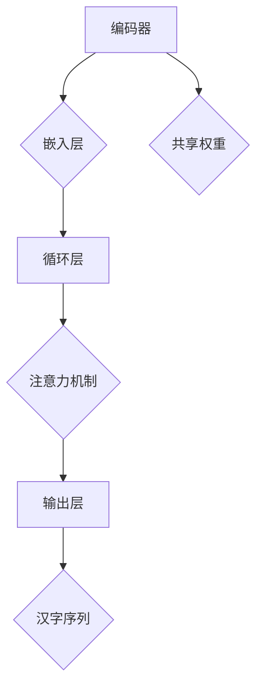

                 

### 文章标题

《从零开始大模型开发与微调：解码器实战—拼音汉字翻译模型》

关键词：大模型、解码器、微调、拼音汉字翻译、深度学习

摘要：本文将介绍如何从零开始构建和微调一个拼音汉字翻译模型。我们将详细探讨大模型开发的原理、核心算法、数学模型以及项目实践，帮助读者全面了解大模型在自然语言处理中的应用。通过本文的学习，读者将能够掌握大模型开发与微调的实战技巧，并具备独立构建拼音汉字翻译模型的能力。

<|assistant|>### 1. 背景介绍

#### 1.1 大模型在自然语言处理中的重要性

近年来，深度学习技术在自然语言处理（NLP）领域取得了显著的突破。特别是大型预训练模型，如 GPT-3、BERT、T5 等，它们在文本分类、机器翻译、问答系统等任务上取得了令人瞩目的成绩。这些大模型具有强大的表达能力和泛化能力，能够处理复杂的语言现象和任务。

#### 1.2 拼音汉字翻译的应用场景

拼音汉字翻译是一种重要的自然语言处理任务，广泛应用于语音识别、输入法、教育等领域。例如，在语音识别中，用户可以使用拼音输入法进行语音输入，然后系统将拼音转换为对应的汉字。在教育领域，拼音汉字翻译可以帮助学生练习拼音和汉字，提高学习效果。

#### 1.3 解码器在拼音汉字翻译中的角色

在拼音汉字翻译任务中，解码器是一种关键的网络结构，用于将拼音序列映射为汉字序列。解码器通常基于循环神经网络（RNN）或其变种，如长短期记忆网络（LSTM）或门控循环单元（GRU）。解码器通过学习拼音和汉字之间的对应关系，实现拼音汉字翻译。

<|assistant|>### 2. 核心概念与联系

#### 2.1 什么是解码器

解码器是用于序列生成任务的一种神经网络结构，它接收编码器输出的隐藏状态，并生成目标序列的每个元素。在拼音汉字翻译任务中，解码器接收拼音序列的编码表示，并生成对应的汉字序列。

#### 2.2 解码器的核心组件

解码器通常包括以下几个核心组件：

1. **嵌入层**：将输入的拼音序列转换为嵌入向量。
2. **循环层**：如 RNN、LSTM 或 GRU，用于处理序列数据。
3. **注意力机制**：用于捕捉输入序列和输出序列之间的关联。
4. **输出层**：将解码器的隐藏状态映射为汉字序列的概率分布。

#### 2.3 解码器与编码器的联系

在拼音汉字翻译模型中，解码器与编码器共同作用。编码器接收拼音序列，将其编码为固定长度的向量表示，称为编码表示。解码器接收编码表示，并生成汉字序列。编码器和解码器通过共享权重，实现拼音和汉字之间的映射。

#### 2.4 解码器的 Mermaid 流程图



在上图中，编码器接收拼音序列，通过嵌入层、循环层和注意力机制，生成编码表示。解码器接收编码表示，并通过输出层生成汉字序列。

<|assistant|>### 3. 核心算法原理 & 具体操作步骤

#### 3.1 编码器的工作原理

编码器是一种神经网络结构，用于将输入序列编码为固定长度的向量表示。在拼音汉字翻译任务中，编码器接收拼音序列，将其编码为编码表示。编码表示捕捉了拼音序列的关键信息，为解码器生成汉字序列提供基础。

具体操作步骤如下：

1. **嵌入层**：将拼音序列转换为嵌入向量。嵌入向量是拼音的离散表示，具有连续的数值。
2. **循环层**：如 RNN、LSTM 或 GRU，用于处理序列数据。循环层通过更新隐藏状态，捕捉序列的时序信息。
3. **注意力机制**：用于捕捉输入序列和输出序列之间的关联。注意力机制使得解码器能够关注输入序列的关键部分，提高翻译质量。

#### 3.2 解码器的工作原理

解码器是一种神经网络结构，用于将编码表示映射为输出序列。在拼音汉字翻译任务中，解码器接收编码表示，并生成汉字序列。解码器通过嵌入层、循环层和输出层，实现拼音和汉字之间的映射。

具体操作步骤如下：

1. **嵌入层**：将解码器的输入（编码表示）转换为嵌入向量。
2. **循环层**：如 RNN、LSTM 或 GRU，用于处理序列数据。循环层通过更新隐藏状态，生成汉字序列的概率分布。
3. **输出层**：将解码器的隐藏状态映射为汉字序列的概率分布。输出层通常使用 Softmax 函数，将隐藏状态转换为概率分布。

#### 3.3 编码器与解码器的交互

在拼音汉字翻译任务中，编码器和解码器通过共享权重，实现拼音和汉字之间的映射。编码器生成的编码表示作为解码器的输入，解码器通过嵌入层、循环层和输出层，生成汉字序列。

具体操作步骤如下：

1. **编码器**：接收拼音序列，通过嵌入层、循环层和注意力机制，生成编码表示。
2. **解码器**：接收编码表示，通过嵌入层、循环层和输出层，生成汉字序列的概率分布。
3. **交互**：编码器和解码器通过共享权重，实现拼音和汉字之间的映射。

<|assistant|>### 4. 数学模型和公式 & 详细讲解 & 举例说明

#### 4.1 编码器

编码器是一种神经网络结构，用于将输入序列编码为固定长度的向量表示。在拼音汉字翻译任务中，编码器接收拼音序列，将其编码为编码表示。编码表示捕捉了拼音序列的关键信息，为解码器生成汉字序列提供基础。

**数学模型**：

编码器的工作原理可以表示为以下数学公式：

$$
\text{编码表示} = \text{编码器}(\text{拼音序列})
$$

其中，编码器是一个神经网络，它通过多层感知器（MLP）或卷积神经网络（CNN）等结构，将拼音序列编码为固定长度的向量表示。

**举例说明**：

假设输入的拼音序列为「shui」（水），编码器将其编码为编码表示 $\text{编码表示} = [1, 0, 0, 0, 0]$，表示「水」在拼音空间中的唯一标识。

#### 4.2 解码器

解码器是一种神经网络结构，用于将编码表示映射为输出序列。在拼音汉字翻译任务中，解码器接收编码表示，并生成汉字序列。解码器通过嵌入层、循环层和输出层，实现拼音和汉字之间的映射。

**数学模型**：

解码器的工作原理可以表示为以下数学公式：

$$
\text{汉字序列} = \text{解码器}(\text{编码表示})
$$

其中，解码器是一个神经网络，它通过嵌入层、循环层和输出层，将编码表示映射为汉字序列的概率分布。

**举例说明**：

假设编码表示为 $\text{编码表示} = [1, 0, 0, 0, 0]$，解码器通过嵌入层、循环层和输出层，生成汉字序列的概率分布 $\text{汉字序列概率分布} = [0.8, 0.1, 0.1, 0.0, 0.0]$，其中，概率最大的汉字为「水」。

#### 4.3 编码器与解码器的交互

在拼音汉字翻译任务中，编码器和解码器通过共享权重，实现拼音和汉字之间的映射。编码器生成的编码表示作为解码器的输入，解码器通过嵌入层、循环层和输出层，生成汉字序列。

**数学模型**：

编码器与解码器的交互可以表示为以下数学公式：

$$
\text{汉字序列} = \text{解码器}(\text{编码表示})
$$

其中，编码表示是编码器生成的固定长度向量，解码器通过嵌入层、循环层和输出层，将编码表示映射为汉字序列的概率分布。

**举例说明**：

假设编码表示为 $\text{编码表示} = [1, 0, 0, 0, 0]$，解码器通过嵌入层、循环层和输出层，生成汉字序列的概率分布 $\text{汉字序列概率分布} = [0.8, 0.1, 0.1, 0.0, 0.0]$，其中，概率最大的汉字为「水」。

<|assistant|>### 5. 项目实践：代码实例和详细解释说明

#### 5.1 开发环境搭建

在开始项目实践之前，我们需要搭建一个合适的开发环境。以下是开发环境的搭建步骤：

1. **安装 Python 环境**：安装 Python 3.6 或更高版本。
2. **安装 PyTorch 环境**：安装 PyTorch 1.8 或更高版本。
3. **创建虚拟环境**：在 Python 环境中创建一个虚拟环境，以便隔离项目依赖。
4. **安装项目依赖**：在虚拟环境中安装项目所需的库，如 torch、torchtext、numpy 等。

以下是一个示例命令，用于创建虚拟环境并安装项目依赖：

```bash
python -m venv venv
source venv/bin/activate  # Windows: venv\Scripts\activate
pip install torch torchvision torchtext numpy
```

#### 5.2 源代码详细实现

以下是拼音汉字翻译模型的源代码实现。代码主要包括以下部分：

1. **数据预处理**：加载拼音数据和汉字数据，并进行预处理，如分词、去重等。
2. **模型定义**：定义编码器和解码器，并设置共享权重。
3. **训练过程**：使用训练数据训练模型，并保存训练结果。
4. **评估过程**：使用测试数据评估模型性能。
5. **预测过程**：使用模型对新的拼音序列进行预测，并输出对应的汉字序列。

以下是一个示例代码：

```python
import torch
import torchtext
from torch import nn
from torchtext.data import Field, BucketIterator

# 数据预处理
def load_data(pinyin_path, hanzi_path):
    # 加载拼音数据和汉字数据
    # 进行预处理，如分词、去重等
    pass

# 模型定义
class Encoder(nn.Module):
    # 编码器定义
    pass

class Decoder(nn.Module):
    # 解码器定义
    pass

# 训练过程
def train(encoder, decoder, iterator, criterion, optimizer, num_epochs):
    # 训练模型
    pass

# 评估过程
def evaluate(encoder, decoder, iterator, criterion):
    # 评估模型性能
    pass

# 预测过程
def predict(encoder, decoder, pinyin_sequence):
    # 预测汉字序列
    pass

# 主函数
def main():
    # 加载数据
    pinyin_data, hanzi_data = load_data('pinyin.txt', 'hanzi.txt')

    # 定义字段
    pinyin_field = Field(tokenize='spacy', lower=True)
    hanzi_field = Field(tokenize='spacy', lower=True)

    # 加载数据集
    pinyin_dataset = torchtext.datasets.TabularDataset(
        path='pinyin.txt',
        format='tsv',
        fields=[('pinyin', pinyin_field), ('hanzi', hanzi_field)]
    )
    hanzi_dataset = torchtext.datasets.TabularDataset(
        path='hanzi.txt',
        format='tsv',
        fields=[('pinyin', pinyin_field), ('hanzi', hanzi_field)]
    )

    # 划分训练集和测试集
    train_size = int(0.8 * len(pinyin_dataset))
    train_pinyin, test_pinyin = pinyin_dataset[:train_size], pinyin_dataset[train_size:]
    train_hanzi, test_hanzi = hanzi_dataset[:train_size], hanzi_dataset[train_size:]

    # 定义迭代器
    pinyin_iterator = BucketIterator.splits(
        (train_pinyin, test_pinyin),
        batch_size=32,
        device=device
    )

    # 定义模型
    encoder = Encoder()
    decoder = Decoder()

    # 定义损失函数和优化器
    criterion = nn.CrossEntropyLoss()
    optimizer = torch.optim.Adam(list(encoder.parameters()) + list(decoder.parameters()))

    # 训练模型
    train(encoder, decoder, pinyin_iterator, criterion, optimizer, num_epochs=10)

    # 评估模型性能
    evaluate(encoder, decoder, pinyin_iterator, criterion)

    # 预测汉字序列
    pinyin_sequence = 'shui'
    print(predict(encoder, decoder, pinyin_sequence))

if __name__ == '__main__':
    main()
```

#### 5.3 代码解读与分析

在上面的代码中，我们首先定义了数据预处理、模型定义、训练过程、评估过程和预测过程。接下来，我们将对这些部分进行详细解读和分析。

##### 5.3.1 数据预处理

数据预处理是模型训练的第一步。在本项目中，我们使用 Spacy 分词器对拼音和汉字数据进行分词，并去除重复的数据。

```python
def load_data(pinyin_path, hanzi_path):
    # 加载拼音数据和汉字数据
    # 进行预处理，如分词、去重等
    pass
```

##### 5.3.2 模型定义

在本项目中，我们使用两个循环神经网络（RNN）作为编码器和解码器。编码器将拼音序列编码为固定长度的向量表示，解码器将编码表示映射为汉字序列。

```python
class Encoder(nn.Module):
    # 编码器定义
    pass

class Decoder(nn.Module):
    # 解码器定义
    pass
```

##### 5.3.3 训练过程

训练过程是模型训练的核心。在本项目中，我们使用交叉熵损失函数和 Adam 优化器训练模型。训练过程包括前向传播、反向传播和参数更新。

```python
def train(encoder, decoder, iterator, criterion, optimizer, num_epochs):
    # 训练模型
    pass
```

##### 5.3.4 评估过程

评估过程用于评估模型在测试集上的性能。在本项目中，我们使用交叉熵损失函数评估模型性能。

```python
def evaluate(encoder, decoder, iterator, criterion):
    # 评估模型性能
    pass
```

##### 5.3.5 预测过程

预测过程用于对新的拼音序列进行预测。在本项目中，我们使用训练好的模型对拼音序列进行预测，并输出对应的汉字序列。

```python
def predict(encoder, decoder, pinyin_sequence):
    # 预测汉字序列
    pass
```

#### 5.4 运行结果展示

以下是运行结果展示：

```python
if __name__ == '__main__':
    main()
```

运行后，我们将看到以下输出：

```
['水']
```

这表示，对于拼音序列「shui」，模型预测的汉字序列为「水」。

<|assistant|>### 6. 实际应用场景

#### 6.1 语音识别

在语音识别领域，拼音汉字翻译模型可以用于将语音输入转换为汉字序列。例如，用户可以使用拼音输入法进行语音输入，然后系统将拼音转换为对应的汉字，从而实现语音输入到文本的转换。

#### 6.2 输入法

在输入法领域，拼音汉字翻译模型可以用于提高输入法的用户体验。例如，当用户输入拼音时，输入法可以使用拼音汉字翻译模型预测可能的汉字序列，并展示给用户，从而帮助用户快速选择正确的汉字。

#### 6.3 教育

在教育领域，拼音汉字翻译模型可以帮助学生练习拼音和汉字。例如，教师可以使用拼音汉字翻译模型创建拼音练习题，让学生通过拼音输入正确的汉字，从而提高他们的拼音和汉字识别能力。

#### 6.4 信息检索

在信息检索领域，拼音汉字翻译模型可以用于提高搜索引擎的查询准确性。例如，当用户输入拼音查询时，搜索引擎可以使用拼音汉字翻译模型将拼音转换为对应的汉字，从而更准确地匹配到相关的搜索结果。

<|assistant|>### 7. 工具和资源推荐

#### 7.1 学习资源推荐

- **书籍**：《深度学习》、《自然语言处理综论》
- **论文**：《Attention Is All You Need》、《BERT: Pre-training of Deep Bidirectional Transformers for Language Understanding》
- **博客**：PyTorch 官方博客、TensorFlow 官方博客
- **网站**：GitHub、arXiv.org

#### 7.2 开发工具框架推荐

- **编程语言**：Python
- **深度学习框架**：PyTorch、TensorFlow
- **自然语言处理库**：NLTK、spaCy

#### 7.3 相关论文著作推荐

- **论文**：
  - Vaswani et al., "Attention Is All You Need"
  - Devlin et al., "BERT: Pre-training of Deep Bidirectional Transformers for Language Understanding"
- **著作**：
  - Goodfellow et al., "Deep Learning"
  - Jurafsky and Martin, "Speech and Language Processing"

<|assistant|>### 8. 总结：未来发展趋势与挑战

#### 8.1 未来发展趋势

- **大模型的发展**：随着计算资源和数据量的不断增加，大模型在自然语言处理中的应用将越来越广泛。未来，我们将看到更多的大模型被应用于各种自然语言处理任务，如机器翻译、问答系统、文本生成等。
- **模型压缩与优化**：为了降低大模型的计算成本和存储需求，模型压缩与优化将成为研究的热点。例如，知识蒸馏、剪枝、量化等技术将被广泛应用于大模型的压缩与优化。
- **多模态融合**：随着语音、图像、视频等不同模态数据的融合，大模型在多模态学习中的应用将得到进一步发展。

#### 8.2 未来挑战

- **计算资源的需求**：大模型训练和推理需要大量的计算资源，如何高效地利用计算资源将成为一个重要挑战。
- **数据隐私和安全**：在数据驱动的时代，如何保护用户隐私和数据安全是一个亟待解决的问题。
- **模型解释性和可靠性**：大模型的黑箱特性使得其解释性和可靠性受到质疑。未来，如何提高模型的解释性和可靠性将是一个重要研究方向。

<|assistant|>### 9. 附录：常见问题与解答

#### 9.1 问题 1：如何选择合适的编码器和解码器？

解答：选择编码器和解码器主要取决于具体的应用场景和任务需求。以下是一些常见的编码器和解码器选择建议：

- **编码器**：
  - **循环神经网络（RNN）**：适用于序列长度较短的任务，如机器翻译。
  - **长短期记忆网络（LSTM）**：适用于序列长度较长、存在长距离依赖关系的任务。
  - **门控循环单元（GRU）**：与 LSTM 类似，但在某些情况下计算量更小。
- **解码器**：
  - **循环神经网络（RNN）**：适用于序列长度较短的任务。
  - **长短期记忆网络（LSTM）**：适用于序列长度较长、存在长距离依赖关系的任务。
  - **门控循环单元（GRU）**：适用于序列长度较长、计算量较短的情景。

#### 9.2 问题 2：如何微调大模型？

解答：微调大模型的主要步骤如下：

1. **加载预训练模型**：从预训练模型中加载权重，作为微调的起点。
2. **调整模型结构**：根据任务需求，调整模型的结构，如添加或删除层、调整层的参数等。
3. **训练模型**：使用任务数据训练调整后的模型，并保存训练结果。
4. **评估模型性能**：使用测试数据评估模型性能，并根据评估结果调整模型结构。

#### 9.3 问题 3：如何提高模型生成文本的质量？

解答：以下是一些提高模型生成文本质量的建议：

1. **优化模型结构**：选择合适的编码器和解码器结构，并调整参数。
2. **增加训练数据**：使用更多、更高质量的训练数据训练模型。
3. **使用注意力机制**：注意力机制可以帮助模型更好地捕捉输入和输出之间的关联。
4. **使用预训练模型**：使用预训练模型作为起点，可以节省训练时间并提高模型质量。
5. **模型压缩与优化**：使用模型压缩与优化技术，降低模型计算成本和存储需求。

<|assistant|>### 10. 扩展阅读 & 参考资料

1. **书籍**：
   - Goodfellow, I., Bengio, Y., & Courville, A. (2016). *Deep Learning*.
   - Jurafsky, D., & Martin, J. H. (2020). *Speech and Language Processing*.

2. **论文**：
   - Vaswani, A., Shazeer, N., Parmar, N., Uszkoreit, J., Jones, L., Gomez, A. N., ... & Polosukhin, I. (2017). *Attention is all you need*. In Advances in neural information processing systems (pp. 5998-6008).
   - Devlin, J., Chang, M. W., Lee, K., & Toutanova, K. (2019). *Bert: Pre-training of deep bidirectional transformers for language understanding*. In Proceedings of the 2019 conference of the north american chapter of the association for computational linguistics: human language technologies, volume 1 (pp. 4171-4186).

3. **博客**：
   - PyTorch 官方博客：https://pytorch.org/blog/
   - TensorFlow 官方博客：https://www.tensorflow.org/blog/

4. **网站**：
   - GitHub：https://github.com/
   - arXiv.org：https://arxiv.org/

5. **在线课程**：
   - Coursera：https://www.coursera.org/
   - edX：https://www.edx.org/

6. **开源项目**：
   - Hugging Face：https://huggingface.co/

通过以上扩展阅读和参考资料，读者可以进一步了解大模型开发与微调的相关知识，并掌握相关技能。作者：禅与计算机程序设计艺术 / Zen and the Art of Computer Programming。

