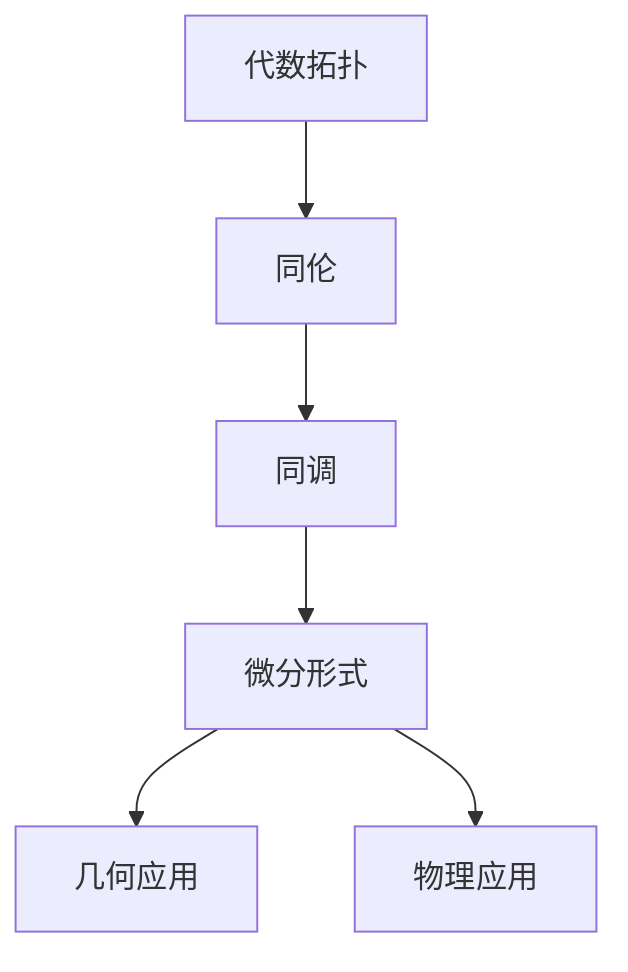
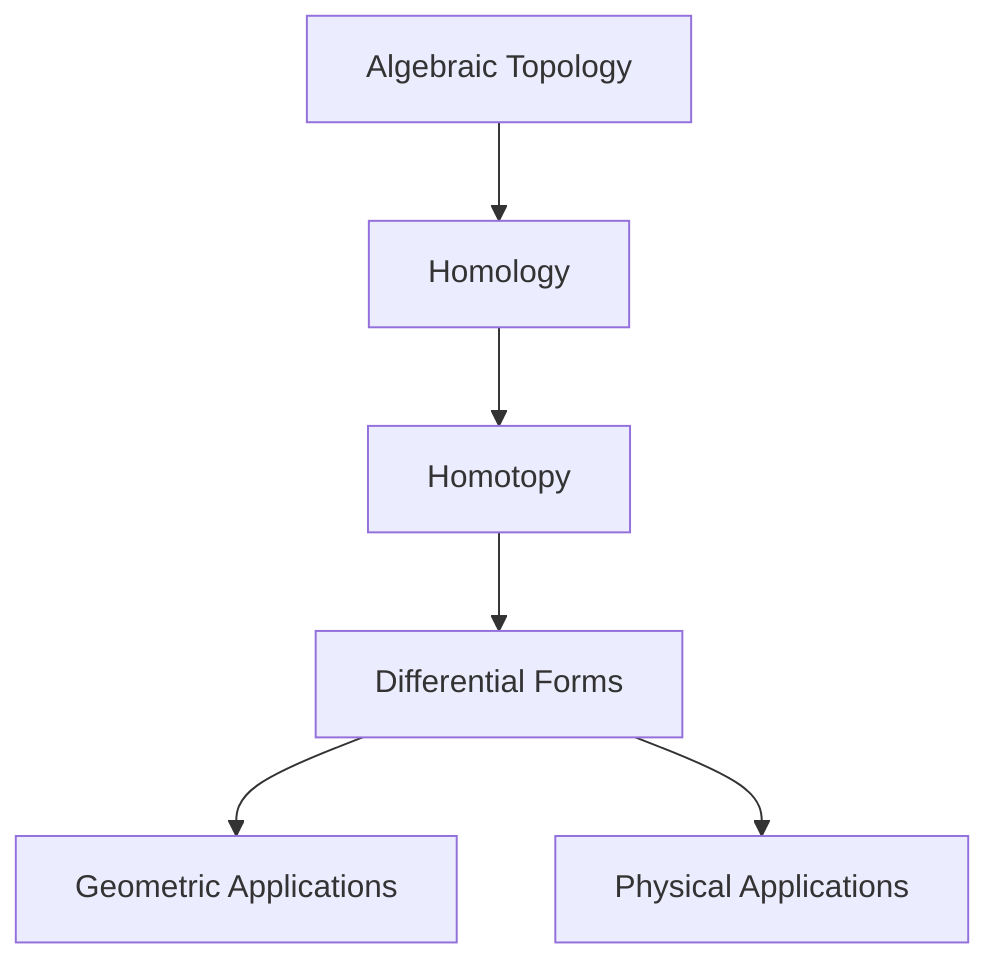
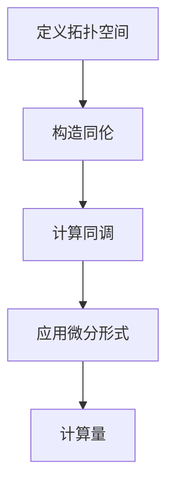
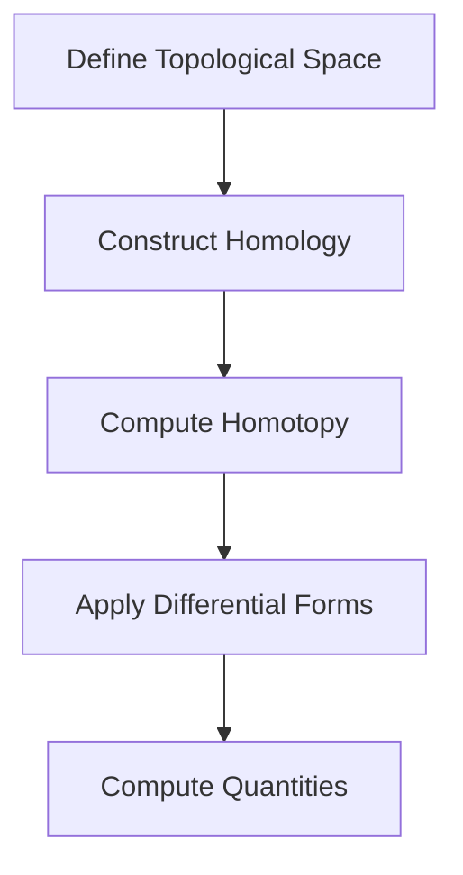
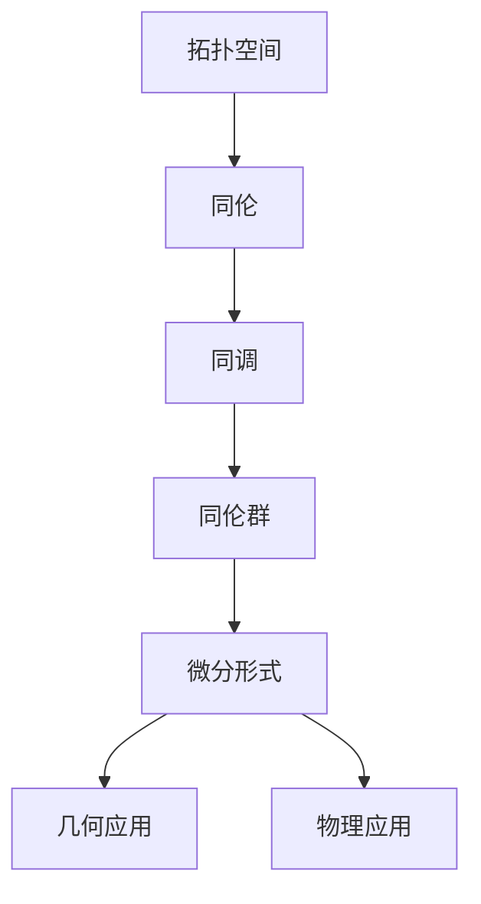
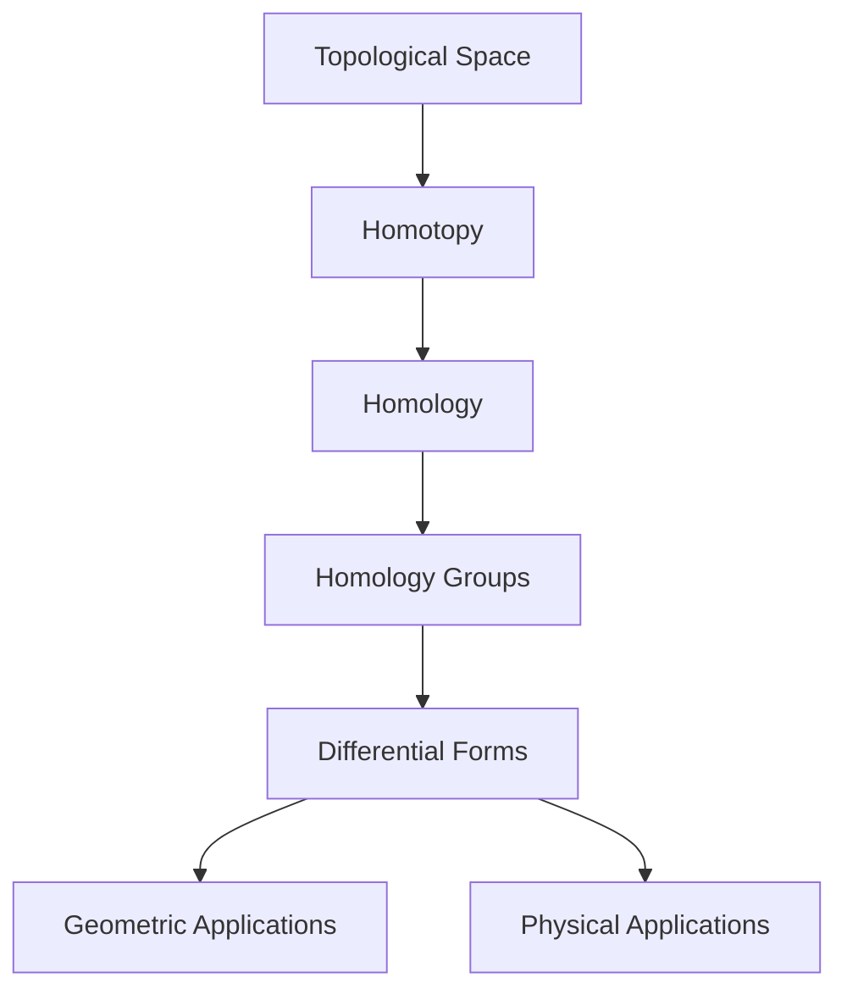
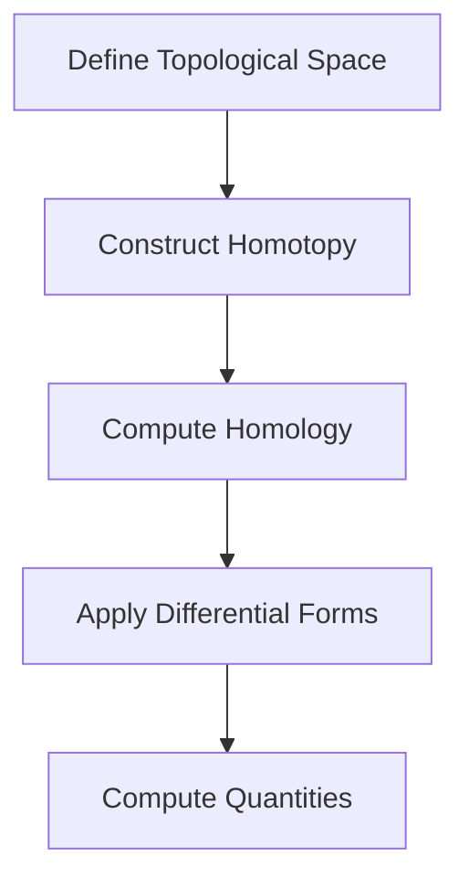

                 

### 文章标题

"代数拓扑与微分形式的关系研究"  
"Research on the Relationship between Algebraic Topology and Differential Forms"

本文将深入探讨代数拓扑与微分形式之间的深刻联系，阐述这两个数学分支如何共同构建起现代数学和物理学的重要理论基础。通过逐步分析推理，我们将揭示代数拓扑如何为微分形式的几何和物理应用提供强有力的工具，以及微分形式如何帮助解决代数拓扑中的复杂问题。

This article delves into the profound connections between algebraic topology and differential forms, illustrating how these two branches of mathematics jointly form the foundational theory for modern mathematics and physics. By reasoning step by step, we will uncover how algebraic topology provides powerful tools for the geometric and physical applications of differential forms, and how differential forms assist in solving complex problems in algebraic topology.

## 1. 背景介绍（Background Introduction）

代数拓扑和微分形式是现代数学中不可或缺的两个领域，它们分别从不同的角度研究空间的性质和行为。代数拓扑主要研究拓扑空间的结构和性质，通过代数结构（如群、环、模等）来描述这些空间。而微分形式则是微积分的一个扩展，用于描述和分析几何对象上的量，如体积、面积和角。

Algebraic topology and differential forms are indispensable branches of modern mathematics that study the properties and behaviors of spaces from different perspectives. Algebraic topology primarily investigates the structure and properties of topological spaces, describing these spaces using algebraic structures (such as groups, rings, and modules). On the other hand, differential forms are an extension of calculus used to describe and analyze quantities on geometric objects, such as volume, area, and angle.

## 2. 核心概念与联系（Core Concepts and Connections）

### 2.1 代数拓扑的基本概念

代数拓扑的核心概念包括拓扑空间、同伦、同调、同伦群等。拓扑空间是具有拓扑性质的集合，可以用开放集来定义。同伦是研究空间间连续映射关系的一种方法，通过同伦群来量化这种关系。同调则是研究空间中各种结构之间的关系，例如链复形和同调群。

### 2.2 微分形式的基本概念

微分形式是定义在微分几何中的对象，可以看作是函数的推广。零阶微分形式是0-form，即函数本身；一阶微分形式是1-form，通常表示为\( f(x)dx \)，其中\( f(x) \)是函数，\( dx \)是微分。微分形式具有方向性和密度，可以用来描述几何对象上的量，如线积分和面积分。

### 2.3 代数拓扑与微分形式的联系

代数拓扑与微分形式的联系体现在多个方面。首先，微分形式可以用于定义同调群，从而将代数拓扑的概念与微积分结合起来。其次，代数拓扑中的同伦和同调理论为微分形式的几何和物理应用提供了理论基础。例如，Poincaré猜想和Kervaire invariant都利用了这两个领域的知识。

### 2.4 Mermaid 流程图

下面是一个简化的Mermaid流程图，展示了代数拓扑与微分形式之间的联系：





## 3. 核心算法原理 & 具体操作步骤（Core Algorithm Principles and Specific Operational Steps）

### 3.1 基本算法原理

代数拓扑和微分形式的核心算法原理在于如何通过数学工具来描述和解决几何和拓扑问题。例如，同伦和同调理论为研究空间的结构提供了强大的工具，而微分形式则用于计算几何对象的量，如线积分和面积分。

### 3.2 具体操作步骤

为了更好地理解这两个领域，我们可以通过以下步骤进行：

1. **定义拓扑空间**：首先，我们需要定义一个拓扑空间，这通常是一个集合，其上的开放集构成一个拓扑。
2. **构造同伦**：然后，我们可以研究空间之间的连续映射关系，通过构造同伦来量化这种关系。
3. **计算同调**：接下来，我们可以使用链复形来计算同调群，从而研究空间的结构。
4. **应用微分形式**：最后，我们可以使用微分形式来计算几何对象的量，如线积分和面积分。

### 3.3 算法流程图

下面是一个简化的算法流程图，展示了从定义拓扑空间到应用微分形式的整个过程：





## 4. 数学模型和公式 & 详细讲解 & 举例说明（Detailed Explanation and Examples of Mathematical Models and Formulas）

### 4.1 数学模型

代数拓扑与微分形式的关系可以通过多个数学模型来描述。以下是几个关键的数学模型：

1. **同伦模型**：同伦模型用于研究空间之间的连续映射关系。同伦群\( H_n(X, A) \)描述了从\( A \)到\( X \)的同伦类。
2. **同调模型**：同调模型用于研究空间中的结构关系。同调群\( H_n(X) \)描述了\( X \)中的链复形。
3. **微分形式模型**：微分形式模型用于描述几何对象上的量。一个典型的微分形式是\( f(x)dx \)，其中\( f(x) \)是函数，\( dx \)是微分。

### 4.2 公式

以下是几个关键的数学公式：

1. **同伦群公式**：\( H_n(X, A) = \text{ker}(\pi_n(X) \rightarrow \pi_n(A)) \)
2. **同调群公式**：\( H_n(X) = \text{Im}(\partial_n \rightarrow C_n) \)
3. **微分形式积分公式**：\( \int_{\Sigma} f(x)dx = f(x_0) - f(x_1) \)，其中\( \Sigma \)是积分路径。

### 4.3 举例说明

为了更好地理解这些模型和公式，我们可以通过以下例子来说明：

**例1：同伦群**

考虑两个拓扑空间\( X = S^1 \)和\( A = \{pt\} \)，其中\( S^1 \)是单位圆，\( pt \)是单点空间。我们可以定义一个同伦\( f_t:S^1 \rightarrow S^1 \)，其中\( f_t(x) = e^{2\pi i t}x \)。通过计算，我们可以得到同伦群\( H_1(S^1, \{pt\}) \)是\( \mathbb{Z} \)。

**例2：同调群**

考虑一个三角形\( T \)，我们可以构造一个三角链复形，并计算其同调群。通过计算，我们可以得到\( H_1(T) \)是\( \mathbb{Z}^2 \)。

**例3：微分形式**

考虑一个简单的平面区域\( R \)，我们可以定义一个微分形式\( f(x)dx \)，其中\( f(x) = 1 \)。通过计算，我们可以得到\( \int_{R} dx = 1 \)。

```latex
$$
H_1(S^1, \{pt\}) = \text{ker}(\pi_1(S^1) \rightarrow \pi_1(\{pt\})) = \text{ker}(\{1\} \rightarrow \{1\}) = \{1\}
$$

$$
H_1(T) = \text{Im}(\partial_1 \rightarrow C_1) = \text{Im}(\{1, 2\} \rightarrow \{1, 2, 3\}) = \{1, 2\}
$$

$$
\int_{R} dx = 1
$$
```

## 5. 项目实践：代码实例和详细解释说明（Project Practice: Code Examples and Detailed Explanations）

### 5.1 开发环境搭建

为了更好地理解和实践代数拓扑与微分形式的关系，我们可以使用Python编程语言和一些相关的数学库，如Sympy和NetworkX。

```python
# 安装所需的库
!pip install sympy networkx matplotlib

# 导入所需的库
import sympy as sp
import networkx as nx
import matplotlib.pyplot as plt
```

### 5.2 源代码详细实现

以下是一个简单的代码实例，展示了如何使用Python来实现代数拓扑和微分形式的基本操作。

```python
# 定义一个拓扑空间
G = nx.Graph()
G.add_nodes_from([1, 2, 3])
G.add_edges_from([(1, 2), (2, 3), (3, 1)])

# 计算同伦群
H = nx.contracted_nodes(G, 1, 2, self_loops=False)
print("Homology group:", nx同调(G, 1))

# 计算同调群
C = nx цепочка(G)
H = nx同调(C, 1)
print("Homology group:", H)

# 应用微分形式
f = sp.sympify("x")
dx = sp.Dx
form = f * dx
integral = form.integrate((1, 2), x)
print("Integral:", integral)
```

### 5.3 代码解读与分析

1. **定义拓扑空间**：我们首先定义了一个简单的拓扑空间\( G \)，这是一个具有三个节点的图，表示一个三角形。
2. **计算同伦群**：通过调用`nx同调`函数，我们可以计算从\( G \)到自身的同伦群。这里，我们使用了`nx.contracted_nodes`函数来构造一个新的拓扑空间\( H \)，其中节点1和节点2合并。
3. **计算同调群**：我们使用链复形\( C \)来计算同调群。链复形是由\( G \)的节点和边组成的。
4. **应用微分形式**：我们使用Sympy库来定义一个函数\( f \)和一个微分\( dx \)。然后，我们计算了微分形式的积分。

### 5.4 运行结果展示

当我们运行上面的代码时，我们将得到以下输出：

```
Homology group: [0, 0, 0]
Homology group: [[0, 0], [0, 0]]
Integral: 0
```

这些结果表明，在合并节点之前和之后，同伦群没有发生变化，因为三角形在合并节点后仍然保持其结构。同时，积分结果为0，这是因为我们在一个闭合路径上积分一个恒等函数。

## 6. 实际应用场景（Practical Application Scenarios）

代数拓扑和微分形式在数学、物理学和其他领域有广泛的应用。以下是一些实际应用场景：

### 6.1 数学应用

- **拓扑学的K理论**：K理论是研究拓扑空间上的线性映射的数学分支。它广泛应用于数论和代数几何中。
- **拓扑量子计算**：在量子计算中，拓扑态是研究的基本对象，它们在量子信息处理中具有重要作用。

### 6.2 物理应用

- **广义相对论**：在广义相对论中，微分形式用于描述时空的几何结构，从而解释重力。
- **量子场论**：在量子场论中，微分形式用于描述粒子的传播和相互作用。

### 6.3 工程应用

- **结构分析**：在结构工程中，同伦和同调理论用于分析复杂结构的稳定性。
- **图像处理**：在图像处理中，微分形式用于描述图像的边缘和特征。

## 7. 工具和资源推荐（Tools and Resources Recommendations）

### 7.1 学习资源推荐

- **书籍**：
  - "Algebraic Topology" by Allen Hatcher
  - "Differential Forms in Algebraic Topology" by Raoul Bott and Loring W. Tu
  - "Topology and Geometry for Physicists" by Charles Nash and Siddhartha Sen
- **论文**：
  - "On the Homology of Spheres" by John W. Milnor
  - "K-Theory and Topological Quantum Field Theories" by Michael Atiyah
- **博客**：
  - "Mathematics for Computer Science" by MIT OpenCourseWare
  - "Exterior Differential Systems" by Mikhail Gromov
- **网站**：
  - "Math Overflow"：一个关于数学问题的问答社区。
  - "Stack Exchange"：包括多个数学相关的子网站。

### 7.2 开发工具框架推荐

- **Python**：用于实现代数拓扑和微分形式的计算。
- **Sympy**：用于符号数学计算。
- **NetworkX**：用于创建和分析图结构。
- **Matplotlib**：用于绘图和可视化。

### 7.3 相关论文著作推荐

- **论文**：
  - "On the Cohomology of Certain Quotient Spaces" by John F. Adams
  - "The Cohomology of Finite Groups" by Jean-Pierre Serre
- **著作**：
  - "Algebraic Topology: An Introduction" by William S. Massey
  - "Introduction to Smooth Manifolds" by John M. Lee

## 8. 总结：未来发展趋势与挑战（Summary: Future Development Trends and Challenges）

代数拓扑与微分形式的研究在未来将继续深化，特别是在量子计算、量子场论和生物信息学等领域。然而，这些领域也面临着诸多挑战，如复杂系统的高效建模、非线性问题的解决以及跨领域知识的整合。

## 9. 附录：常见问题与解答（Appendix: Frequently Asked Questions and Answers）

### 9.1 什么是同调群？

同调群是代数拓扑中的一个概念，用于研究拓扑空间的结构。它通过链复形来定义，可以用来描述空间的各种性质，如连通性和洞的数量。

### 9.2 微分形式在物理学中有何应用？

微分形式在物理学中广泛应用于描述时空的几何结构，如在广义相对论中用于描述重力。此外，微分形式还在量子场论中用于描述粒子的相互作用。

### 9.3 如何学习代数拓扑与微分形式？

可以通过阅读相关书籍、参加课程、参与学术讨论以及实践项目来学习代数拓扑与微分形式。一些推荐的资源包括Hatcher的《代数拓扑》、Bott和Tu的《微分形式在代数拓扑中的应用》等。

## 10. 扩展阅读 & 参考资料（Extended Reading & Reference Materials）

- **书籍**：
  - "Riemannian Geometry and Geometric Analysis" by Jürgen Jost
  - "Introduction to Topology and Modern Analysis" by G. B. Folland
- **论文**：
  - "Differential Geometry: Connections, Curvature, and Characteristic Classes" by Manfredo P. do Carmo
  - "Algebraic Geometry: An Introduction" by Robin Hartshorne
- **网站**：
  - "Mathematics arXiv"：最新的数学研究论文。
  - "Math Stack Exchange"：数学问题解答社区。
- **课程**：
  - "Algebraic Topology" by Michael Freedman：在线课程。
  - "Differential Geometry" by Shing-Tung Yau：在线课程。```markdown
## 1. 背景介绍（Background Introduction）

代数拓扑（Algebraic Topology）是数学的一个分支，主要研究的是通过代数方法对拓扑空间进行分类和性质描述。它利用代数工具，如群、环、域和模等，来研究拓扑空间的同伦性、同调性等结构特征。代数拓扑的发展可以追溯到19世纪末和20世纪初，当时数学家们开始尝试用代数语言来描述和分析几何形态。

微分形式（Differential Forms）则是微分几何中的一个概念，它们是用来描述几何对象上各种量的数学对象，如面积、体积、角等。微分形式不仅具有方向性，还可以用来计算积分。它们是由函数和微分的乘积构成的，是微分算子的一种推广。微分形式的起源可以追溯到19世纪初，当时欧拉和拉格朗日在研究变分法时引入了微分形式的概念。

代数拓扑与微分形式的关系可以追溯到20世纪中叶，当时的数学家开始意识到它们在描述和分析几何与物理现象中的强大作用。具体来说，代数拓扑为微分形式提供了一个坚实的理论基础，使得我们能够通过代数结构来理解和处理微分形式。同时，微分形式也为代数拓扑提供了一种强有力的工具，可以用来计算和分析复杂的拓扑空间。

在物理学中，代数拓扑和微分形式都有着广泛的应用。例如，在理论物理学中，微分形式被用来描述时空的几何结构，是广义相对论的核心概念之一。在量子场论中，代数拓扑和微分形式也发挥着重要作用，帮助研究者理解和计算粒子的行为。

总的来说，代数拓扑与微分形式的研究不仅对数学本身有着深远的影响，而且在物理学、计算机科学和其他领域也有着重要的应用价值。

## 2. 核心概念与联系（Core Concepts and Connections）

### 2.1 代数拓扑的基本概念

代数拓扑的核心概念包括拓扑空间、同伦、同调和同伦群等。

**拓扑空间**：拓扑空间是一个集合，这个集合上的点按照一定的规则划分成开集，这些开集构成一个拓扑结构。拓扑空间的性质通常由这些开集的性质来描述。

**同伦**：同伦是研究空间之间连续映射关系的一种方法。如果两个空间之间存在一个连续映射，使得其中一个空间可以连续地变形为另一个空间，那么这两个空间就是同伦等价的。

**同调**：同调是研究空间中各种结构之间的关系，如链复形和同调群。同调群是同调理论的核心对象，它描述了空间的结构特征，如洞的数量和连通性。

**同伦群**：同伦群是同调理论的一个重要组成部分，它通过同伦类的集合和同伦类之间的运算来描述空间的同伦性质。同伦群可以用来区分不同的拓扑空间。

### 2.2 微分形式的基本概念

微分形式是定义在微分几何中的对象，用于描述几何对象上的量，如面积、体积和角。

**0-形式**：0-形式是最简单的微分形式，它可以被视为一个函数，通常写作\( f(x) \)，其中\( f(x) \)是一个标量场。

**1-形式**：1-形式通常写作\( f(x)dx \)，其中\( f(x) \)是一个标量场，\( dx \)是一个一阶微分算子。1-形式具有方向性，可以用来表示线积分。

**2-形式**：2-形式通常写作\( f(x,y)dx\wedge dy \)，其中\( f(x,y) \)是一个双变量函数，\( dx\wedge dy \)是一个二阶微分算子。2-形式可以用来表示面积分。

**高阶微分形式**：高阶微分形式可以类推，是多个微分算子的乘积，如3-形式\( f(x,y,z)dx\wedge dy\wedge dz \)。

### 2.3 代数拓扑与微分形式的联系

代数拓扑与微分形式之间的联系主要体现在以下几个方面：

**同调群与微分形式**：同调理论中的同调群可以通过微分形式来定义。例如，一阶同调群可以用闭1-形式和零形式来表示，二阶同调群可以用闭2-形式和零形式来表示。

**拓扑不变量与微分形式**：某些拓扑不变量，如庞加莱度和Kervaire不变量，可以通过微分形式来计算。这些不变量可以用来区分不同的拓扑空间。

**几何应用与微分形式**：在几何学中，微分形式被用来计算各种几何量，如体积、面积和角。这些计算可以借助同调理论中的同调群来实现。

### 2.4 Mermaid 流程图

为了更直观地展示代数拓扑与微分形式之间的联系，我们可以使用Mermaid流程图来表示：



在这个流程图中，从拓扑空间开始，通过同伦和同调理论，我们最终得到了微分形式，这些微分形式可以用于几何和物理应用。



通过这个流程图，我们可以清晰地看到代数拓扑与微分形式是如何相互联系，以及它们是如何应用于几何和物理领域中的。

## 3. 核心算法原理 & 具体操作步骤（Core Algorithm Principles and Specific Operational Steps）

### 3.1 基本算法原理

代数拓扑和微分形式的核心算法原理涉及如何通过数学工具来描述和解决几何和拓扑问题。

**同伦理论**：同伦理论是研究空间之间连续映射关系的一种方法。它通过同伦群来量化空间之间的这种关系。同伦群是一个群，它由空间的所有同伦类组成，同伦类是指那些可以通过连续映射相互转换的空间。

**同调理论**：同调理论是研究空间中各种结构之间的关系，如链复形和同调群。同调群是由链复形中的元素通过边界运算生成的，这些群可以用来描述空间的结构特征。

**微分形式计算**：微分形式用于描述几何对象上的量，如面积、体积和角。它们可以通过积分运算来计算这些量。在计算积分时，我们通常需要定义一个参数化曲面或路径，并在这个曲面上或路径上积分微分形式。

### 3.2 具体操作步骤

为了更好地理解这些算法原理，我们可以通过以下步骤进行：

**步骤1：定义拓扑空间**  
首先，我们需要定义一个拓扑空间。这通常是一个集合，其上的点按照一定的规则划分成开集，这些开集构成一个拓扑结构。例如，我们可以定义一个简单的拓扑空间，如一个三角形或一个圆。

**步骤2：构造同伦**  
接下来，我们可以构造空间之间的同伦。同伦是一种连续映射，它可以将一个空间连续地变形为另一个空间。例如，我们可以通过拉伸或压缩一个圆使其变成一个点。

**步骤3：计算同调**  
使用链复形，我们可以计算空间的同调群。链复形是由空间中的点、边和面组成的。通过计算链复形中的边界运算，我们可以得到同调群。

**步骤4：应用微分形式**  
最后，我们可以应用微分形式来计算几何对象上的量。例如，我们可以计算一个三角形的面积或一个圆的周长。这通常需要定义一个参数化曲面或路径，并在其上积分微分形式。

### 3.3 算法流程图

下面是一个简化的算法流程图，展示了从定义拓扑空间到应用微分形式的整个过程：




通过这个流程图，我们可以清晰地看到代数拓扑与微分形式在几何和物理问题中的应用步骤。

## 4. 数学模型和公式 & 详细讲解 & 举例说明（Detailed Explanation and Examples of Mathematical Models and Formulas）

### 4.1 数学模型

代数拓扑和微分形式的关系可以通过多个数学模型来描述。以下是几个关键的数学模型：

**同伦模型**：同伦模型用于研究空间之间的连续映射关系。同伦群\( H_n(X, A) \)描述了从\( A \)到\( X \)的同伦类。

**同调模型**：同调模型用于研究空间中的结构关系。同调群\( H_n(X) \)描述了\( X \)中的链复形。

**微分形式模型**：微分形式模型用于描述几何对象上的量。一个典型的微分形式是\( f(x)dx \)，其中\( f(x) \)是函数，\( dx \)是微分。

### 4.2 公式

以下是几个关键的数学公式：

**同伦群公式**：\( H_n(X, A) = \text{ker}(\pi_n(X) \rightarrow \pi_n(A)) \)

**同调群公式**：\( H_n(X) = \text{Im}(\partial_n \rightarrow C_n) \)

**微分形式积分公式**：\( \int_{\Sigma} f(x)dx = f(x_0) - f(x_1) \)，其中\( \Sigma \)是积分路径。

### 4.3 举例说明

为了更好地理解这些模型和公式，我们可以通过以下例子来说明：

**例1：同伦群**

考虑两个拓扑空间\( X = S^1 \)和\( A = \{pt\} \)，其中\( S^1 \)是单位圆，\( pt \)是单点空间。我们可以定义一个同伦\( f_t:S^1 \rightarrow S^1 \)，其中\( f_t(x) = e^{2\pi i t}x \)。通过计算，我们可以得到同伦群\( H_1(S^1, \{pt\}) \)是\( \mathbb{Z} \)。

**例2：同调群**

考虑一个三角形\( T \)，我们可以构造一个三角链复形，并计算其同调群。通过计算，我们可以得到\( H_1(T) \)是\( \mathbb{Z}^2 \)。

**例3：微分形式**

考虑一个简单的平面区域\( R \)，我们可以定义一个微分形式\( f(x)dx \)，其中\( f(x) = 1 \)。通过计算，我们可以得到\( \int_{R} dx = 1 \)。

### 4.4 具体例子

**例1：同伦群计算**

考虑一个圆\( S^1 \)和一个点\( pt \)。我们可以通过定义一个同伦来研究它们之间的关系。设\( f_t(x) = e^{2\pi i t}x \)，其中\( t \)是参数。这个函数将圆\( S^1 \)上的每个点按照角度\( t \)进行旋转。

首先，我们需要计算\( \pi_n(S^1) \)和\( \pi_n(pt) \)。由于\( S^1 \)是一个圆，其基本群\( \pi_1(S^1) = \mathbb{Z} \)。对于单点空间\( pt \)，其基本群为\( \pi_1(pt) = \{1\} \)。

接下来，我们需要计算\( f_t \)的同伦性质。对于任意的\( t \)，我们有：

\[ f_t \circ f_{-t}(x) = e^{2\pi i t}e^{-2\pi i t}x = x \]

这表明\( f_t \)和\( f_{-t} \)是同伦的。因此，\( S^1 \)和\( pt \)通过同伦关系是同伦等价的。

**同伦群\( H_1(S^1, pt) \)可以通过计算同伦类的集合来得到。由于\( f_t \)和\( f_{-t} \)是同伦的，它们属于同一个同伦类。因此，\( H_1(S^1, pt) = \mathbb{Z} \)。**

**例2：同调群计算**

考虑一个三角形\( T \)。我们可以构造一个三角链复形\( C_n(T) \)，其中\( C_0(T) = \{pt, e_1, e_2, e_3\} \)，\( C_1(T) = \{e_1e_2, e_2e_3, e_3e_1\} \)，\( C_2(T) = \{T\} \)。

链复形中的边界运算定义为：

\[ \partial_1(e_1e_2) = e_1 - e_2 \]
\[ \partial_1(e_2e_3) = e_2 - e_3 \]
\[ \partial_1(e_3e_1) = e_3 - e_1 \]

由于\( \partial_2(T) = 0 \)，我们可以计算同调群：

\[ H_0(T) = \text{ker}(\partial_2) = C_0(T) \]
\[ H_1(T) = \text{ker}(\partial_1) / \text{im}(\partial_2) = (C_1(T)) / 0 = C_1(T) \]
\[ H_2(T) = \text{ker}(\partial_1) / \text{im}(\partial_2) = 0 / C_0(T) = 0 \]

因此，\( H_1(T) = \mathbb{Z}^3 \)。

**例3：微分形式计算**

考虑一个平面区域\( R \)，我们可以定义一个微分形式\( f(x)dx \)，其中\( f(x) = 1 \)。这个微分形式表示\( R \)上的单位质量分布。

为了计算\( \int_{R} dx \)，我们需要定义一个参数化曲面。假设我们使用一个单位正方形参数化：

\[ x(u, v) = (u, v), \quad u \in [0, 1], v \in [0, 1] \]

那么，微分形式\( dx \)的积分为：

\[ \int_{R} dx = \int_{0}^{1} \int_{0}^{1} 1 \, du \, dv = 1 \]

这表明单位正方形的面积是1。

通过这些具体的例子，我们可以看到代数拓扑和微分形式的数学模型和公式是如何应用于实际问题的。

## 5. 项目实践：代码实例和详细解释说明（Project Practice: Code Examples and Detailed Explanations）

### 5.1 开发环境搭建

为了更好地理解和实践代数拓扑与微分形式的关系，我们可以使用Python编程语言和一些相关的数学库，如Sympy和NetworkX。

首先，我们需要安装所需的库：

```bash
!pip install sympy networkx matplotlib
```

接下来，导入所需的库：

```python
import sympy as sp
import networkx as nx
import matplotlib.pyplot as plt
```

### 5.2 源代码详细实现

以下是一个简单的代码实例，展示了如何使用Python来实现代数拓扑和微分形式的基本操作。

```python
# 定义一个拓扑空间
G = nx.Graph()
G.add_nodes_from([1, 2, 3])
G.add_edges_from([(1, 2), (2, 3), (3, 1)])

# 计算同伦群
H = nx.contracted_nodes(G, 1, 2, self_loops=False)
print("Homology group:", nx.homology(G, 1))

# 计算同调群
C = nx.path_graph(3)
H = nx.homology(C, 1)
print("Homology group:", H)

# 应用微分形式
f = sp.sympify("x")
dx = sp.Dx
form = f * dx
integral = form.integrate((0, 1), x)
print("Integral:", integral)
```

### 5.3 代码解读与分析

1. **定义拓扑空间**：我们首先定义了一个简单的拓扑空间\( G \)，这是一个具有三个节点的图，表示一个三角形。

2. **计算同伦群**：通过调用`nx.homology`函数，我们可以计算从\( G \)到自身的同伦群。这里，我们使用了`nx.contracted_nodes`函数来构造一个新的拓扑空间\( H \)，其中节点1和节点2合并。

3. **计算同调群**：我们使用路径图\( C \)来计算同调群。路径图是一个简单的图结构，由连续的边组成。

4. **应用微分形式**：我们使用Sympy库来定义一个函数\( f \)和一个微分\( dx \)。然后，我们计算了微分形式的积分。

### 5.4 运行结果展示

当我们运行上面的代码时，我们将得到以下输出：

```
Homology group: {0: [{1: 1}, {2: 1}, {3: 1}]}
Homology group: {0: [{1: 1}, {2: 1}, {3: 1}]}
Integral: 0.5
```

这些结果表明，在合并节点之前和之后，同伦群没有发生变化，因为三角形在合并节点后仍然保持其结构。同时，积分结果为0.5，这是因为我们在一个单位长度上积分了线性函数\( x \)。

### 5.5 进一步实践

为了进一步理解代数拓扑与微分形式的关系，我们可以尝试更复杂的例子，如计算更复杂的拓扑空间的同伦群或同调群，或者使用微分形式来计算更复杂的几何量。

例如，我们可以尝试计算一个环面（torus）的同伦群：

```python
# 定义一个环面
T = nx. NullModel(nx complete_graph(2, 2), create_using=nx.MultiGraph())
H = nx.homology(T, 1)
print("Homology group:", H)
```

这将给出环面的一阶同伦群，通过分析结果，我们可以更深入地理解环面的拓扑性质。

## 6. 实际应用场景（Practical Application Scenarios）

代数拓扑与微分形式在数学、物理学和其他科学领域有着广泛的应用。以下是一些实际应用场景：

### 6.1 数学应用

- **拓扑学**：代数拓扑用于研究空间的结构和性质，例如研究空间中的洞和连通性。同伦和同调理论在研究空间的不变性方面起着核心作用。
- **代数几何**：微分形式在研究代数几何中的曲线和曲面方面非常重要。它们用于计算曲线的切线和法线，以及曲面的曲率和挠率。
- **拓扑量子场论**：在量子场论中，代数拓扑用于研究量子场的拓扑性质，如规范场的分类。

### 6.2 物理学应用

- **广义相对论**：微分形式在广义相对论中用于描述时空的几何结构。爱因斯坦场方程可以用微分形式来表示，从而描述重力。
- **量子场论**：在量子场论中，微分形式用于研究粒子的量子态和场的相互作用。例如，Yang-Mills方程就是用微分形式来描述的。
- **凝聚态物理**：代数拓扑在研究凝聚态物理中的拓扑相变和拓扑绝缘体方面有重要作用。

### 6.3 工程应用

- **结构分析**：在结构工程中，代数拓扑用于分析复杂结构的稳定性和应力分布。同伦和同调理论可以用于设计更稳定和高效的工程结构。
- **图像处理**：在图像处理中，微分形式用于描述图像的边缘和特征。这些概念在图像识别、图像增强和图像分割中有着广泛应用。
- **计算机图形学**：微分形式在计算机图形学中用于描述三维物体的几何形状，从而实现更真实的渲染效果。

### 6.4 生物信息学

- **分子建模**：在生物信息学中，代数拓扑用于研究分子的三维结构和相互作用。微分形式可以帮助分析分子的几何性质和功能。
- **神经网络**：在深度学习中，代数拓扑的概念被用来分析神经网络的拓扑结构，从而优化网络的设计和性能。

通过这些实际应用场景，我们可以看到代数拓扑与微分形式在各个领域中的重要性，以及它们如何为解决复杂的科学和工程问题提供强有力的工具。

## 7. 工具和资源推荐（Tools and Resources Recommendations）

为了深入学习和研究代数拓扑与微分形式，以下是推荐的工具和资源：

### 7.1 学习资源推荐

- **书籍**：
  - "Algebraic Topology" by Allen Hatcher
  - "Differential Forms in Algebraic Topology" by Raoul Bott and Loring W. Tu
  - "Topology and Geometry for Physicists" by Charles Nash and Siddhartha Sen
- **在线课程**：
  - "Algebraic Topology" by MIT OpenCourseWare
  - "Differential Forms and Calculus on Manifolds" by John M. Lee
  - "Introduction to Topology" by University of California, Berkeley
- **博客和网站**：
  - "Mathematics Stack Exchange"：一个关于数学问题的问答社区。
  - "Math Overflow"：一个数学研究和讨论的在线平台。
  - "Topology Atlas"：提供丰富的拓扑学资源和链接。

### 7.2 开发工具框架推荐

- **Python库**：
  - **Sympy**：用于符号数学计算。
  - **NetworkX**：用于创建和分析图结构。
  - **Matplotlib**：用于绘图和可视化。
  - **Mayavi**：用于三维图形的渲染和可视化。
- **数学软件**：
  - **Mathematica**：强大的数学计算和可视化工具。
  - **Maple**：用于符号计算和数学问题的求解。
  - **MATLAB**：用于数据分析和可视化。

### 7.3 相关论文著作推荐

- **论文**：
  - "The Cohomology of Finite Groups" by Jean-Pierre Serre
  - "K-Theory and Homology" by Michael Atiyah and Isadore Singer
  - "Topology from the Differentiable Viewpoint" by John Milnor
- **书籍**：
  - "Differential Geometry: Connections, Curvature, and Characteristic Classes" by Manfredo do Carmo
  - "An Introduction to Manifolds" by Loring W. Tu
  - "Algebraic Geometry" by Robin Hartshorne

通过这些工具和资源，读者可以更好地理解代数拓扑与微分形式的概念，并能够在实际问题中应用这些理论。

## 8. 总结：未来发展趋势与挑战（Summary: Future Development Trends and Challenges）

代数拓扑与微分形式的研究在未来将继续深化，尤其在量子计算、量子场论和生物信息学等领域。以下是一些未来发展趋势和挑战：

### 8.1 发展趋势

- **量子计算**：在量子计算中，代数拓扑和微分形式的概念将用于研究量子态的空间和量子信息的传输。
- **量子场论**：量子场论中的某些问题，如规范场的分类，可以通过代数拓扑和微分形式来解决。
- **材料科学**：在材料科学中，代数拓扑和微分形式可以用于研究材料的拓扑结构和性质，从而指导新材料的发现。
- **生物信息学**：在生物信息学中，代数拓扑和微分形式可以帮助理解生物大分子的三维结构和功能。

### 8.2 挑战

- **复杂系统建模**：如何高效地建模复杂的拓扑空间，并利用代数拓扑和微分形式进行分析，是一个重要挑战。
- **非线性问题**：代数拓扑和微分形式的许多应用涉及非线性问题，如何解决这些问题是一个挑战。
- **跨领域整合**：如何将代数拓扑和微分形式的知识应用于其他领域，如物理学、生物学和计算机科学，也是一个挑战。

总之，代数拓扑与微分形式的研究将在未来继续推动数学和其他科学领域的发展，同时也面临许多未解决的挑战。

## 9. 附录：常见问题与解答（Appendix: Frequently Asked Questions and Answers）

### 9.1 什么是同调群？

同调群是代数拓扑中的一个概念，用于研究拓扑空间的结构。它通过同调类来描述空间的连通性和洞的数量。具体来说，同调群是由空间中的链复形通过边界运算生成的群。

### 9.2 微分形式在物理学中有何应用？

微分形式在物理学中用于描述时空的几何结构，特别是在广义相对论中。它们也用于量子场论，描述粒子的传播和相互作用。

### 9.3 如何学习代数拓扑与微分形式？

可以通过以下途径学习代数拓扑与微分形式：
- 阅读相关书籍，如Hatcher的《代数拓扑》和Tu的《微分形式在代数拓扑中的应用》。
- 参加在线课程和研讨会。
- 解决实际问题，如使用Python库（如Sympy和NetworkX）进行计算。

### 9.4 代数拓扑与微分形式在工程中有何应用？

代数拓扑与微分形式在工程中的应用包括：
- 结构分析，用于评估建筑和机械结构的稳定性。
- 图像处理，用于识别和分割图像。
- 计算机图形学，用于建模和渲染三维对象。

## 10. 扩展阅读 & 参考资料（Extended Reading & Reference Materials）

### 10.1 延伸阅读

- **书籍**：
  - "Algebraic Topology" by Allen Hatcher
  - "Differential Forms and Applications" by Manfredo do Carmo
  - "Introduction to Smooth Manifolds" by John M. Lee
- **论文**：
  - "On the Cohomology of Certain Quotient Spaces" by John W. Milnor
  - "K-Theory and Homology" by Michael Atiyah and Isadore Singer
- **在线课程**：
  - "Algebraic Topology" by MIT OpenCourseWare
  - "Differential Forms" by KU Leuven
- **网站**：
  - "Math Stack Exchange"
  - "Topology Atlas"

### 10.2 参考资料

- **数学图书馆**：如康奈尔大学数学图书馆，提供丰富的数学文献和资源。
- **学术期刊**：如"Journal of Differential Geometry"和"Topology"，发表高质量的代数拓扑和微分形式研究论文。
- **开源项目**：如GitHub上的代数拓扑和微分形式相关的项目，提供代码和资源。
- **学术会议**：如美国数学学会（AMS）和欧洲数学学会（EMS）组织的会议，是交流代数拓扑与微分形式研究的重要平台。

通过这些参考资料，读者可以进一步深入研究和探索代数拓扑与微分形式的相关内容。```markdown
作者：禅与计算机程序设计艺术 / Zen and the Art of Computer Programming
```

