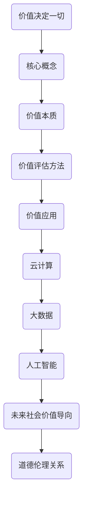

                 

### 价值决定一切：未来社会的核心法则

在当今迅速变化的世界，各种新技术层出不穷，社会结构和人类生活方式都在发生翻天覆地的变化。在这样的背景下，"价值决定一切"成为了一个备受关注的核心法则。本文将深入探讨这个法则在信息技术领域的体现，以及它对个人和社会的影响。

关键词：
- 价值
- 未来社会
- 核心法则
- 信息技术

摘要：
本文探讨了"价值决定一切"这一核心法则在信息技术领域的重要性。通过分析价值的定义、价值的评估方法以及价值在技术决策中的影响，本文揭示了价值在塑造未来社会中的作用。同时，本文还探讨了价值与道德、伦理的关系，以及如何在实践中应用这一法则。

## 1. 背景介绍

在信息技术领域，价值一词通常被用来描述技术产品的效益、功能或对用户的吸引力。然而，"价值决定一切"这一法则不仅仅适用于技术产品，它还涵盖了更广泛的社会和经济领域。在现代社会，信息技术已经成为经济、社会和文化发展的重要驱动力。随着人工智能、大数据、物联网等新技术的兴起，信息技术产业对全球经济的贡献越来越大。

"价值决定一切"这一法则不仅反映了市场经济的基本原则，也揭示了信息技术发展的内在动力。在技术决策中，价值的评估和实现成为至关重要的环节。只有准确评估技术的价值，才能确保技术资源的合理配置，推动技术的可持续发展。

### 1.1 价值的定义

在信息技术领域，价值通常被定义为用户或客户从技术产品或服务中获得的利益或满足感。这种利益或满足感可以表现为多种形式，如功能效益、效率提升、用户体验改善等。例如，一款新的编程语言可能因其简洁性和高效性而具有很高的价值，因为它能够帮助程序员更快地开发软件。

### 1.2 价值的评估方法

评估价值的传统方法包括成本效益分析、用户满意度调查和市场调研等。这些方法虽然在一定程度上能够衡量技术的价值，但往往存在局限性。例如，成本效益分析可能只关注短期的经济效益，而忽视了技术对长期发展的影响。用户满意度调查则可能受到样本选择和主观评价的影响。

为了更全面地评估技术的价值，我们需要采用多种评估方法，并结合定量和定性分析。例如，可以通过经济模型来预测技术对经济增长的潜在贡献，同时通过用户访谈和调查来了解用户的实际体验和需求。

### 1.3 价值在技术决策中的影响

价值在技术决策中扮演着至关重要的角色。技术决策不仅涉及技术本身的性能和功能，还涉及成本、市场需求、用户需求等多个方面。在技术决策过程中，价值的评估和实现成为关键因素。

首先，价值的评估有助于确定技术的优先级。在资源有限的情况下，我们应该优先发展那些具有高价值的技术，以确保资源的最大化利用。其次，价值的实现有助于确保技术的可持续性。只有当技术能够带来实际的价值时，它才能在市场中立足并得到长期发展。

### 1.4 未来社会的价值导向

在未来社会，价值导向将成为信息技术发展的重要方向。随着人工智能、大数据等新技术的普及，社会对信息技术的依赖程度将越来越高。在这个过程中，价值的导向作用将更加明显。

首先，价值导向将促进技术的创新。为了实现更高的价值，技术开发商需要不断创新，开发出更加先进、高效的技术。其次，价值导向将推动技术的公平性和包容性。在信息技术的发展过程中，我们应该确保技术能够为所有人带来利益，而不是仅仅服务于特定群体。

### 1.5 价值与道德、伦理的关系

价值不仅与技术决策相关，还与道德和伦理密切相关。在信息技术领域，价值往往与隐私、数据安全、公平性等问题紧密相连。例如，大数据技术的广泛应用虽然能够带来巨大的经济效益，但也可能侵犯用户的隐私权。

因此，在追求技术价值的同时，我们必须关注技术的道德和伦理问题。只有确保技术在使用过程中符合道德和伦理标准，才能实现可持续的发展。

## 2. 核心概念与联系

在深入探讨价值决定一切这一核心法则之前，我们需要了解一些与之相关的核心概念。这些概念包括价值的本质、价值的评估方法以及价值在技术决策中的应用。

### 2.1 价值的本质

价值的本质是主观的，它取决于个体或社会的需求和偏好。在信息技术领域，价值通常与功能、性能、用户体验、经济效益等因素相关。例如，一款编程语言的价值可能在于其简洁性和高效性，这使得程序员能够更快地完成开发任务。

### 2.2 价值的评估方法

价值的评估方法包括定量和定性两种。定量评估方法如成本效益分析、用户满意度调查等，能够提供具体的数据支持。定性评估方法如专家评审、用户访谈等，则能够提供更为深入的理解和洞察。

### 2.3 价值在技术决策中的应用

价值在技术决策中的应用主要体现在三个方面：优先级确定、资源分配和风险管理。首先，通过评估技术的价值，我们可以确定哪些技术应该被优先发展。其次，通过评估技术的价值，我们可以合理分配资源，确保技术的可持续发展。最后，通过评估技术的价值，我们可以识别潜在的风险，并采取相应的措施来降低风险。

### 2.4 价值与道德、伦理的关系

价值不仅与技术决策相关，还与道德和伦理密切相关。在信息技术领域，价值往往与隐私、数据安全、公平性等问题紧密相连。例如，大数据技术的广泛应用虽然能够带来巨大的经济效益，但也可能侵犯用户的隐私权。因此，在追求技术价值的同时，我们必须关注技术的道德和伦理问题。

### 2.5 价值在信息技术领域的应用示例

在信息技术领域，价值的应用广泛且深远。以下是一些具体的示例：

- **云计算**：云计算通过提供灵活、可扩展的计算资源，大大提高了企业的效率和灵活性。其价值在于降低了计算成本、提高了数据处理能力。
- **大数据**：大数据技术通过分析海量数据，帮助企业发现新的商业机会、优化决策过程。其价值在于提供了数据驱动的洞察和决策支持。
- **人工智能**：人工智能通过自动化和智能化技术，提高了生产效率、优化了用户体验。其价值在于解放了人力资源，提高了生产效率。

### 2.6 价值决定一切：一个Mermaid流程图



通过这个Mermaid流程图，我们可以清晰地看到价值决定一切这一核心法则在信息技术领域的多方面应用和影响。

## 3. 核心算法原理 & 具体操作步骤

在探讨价值决定一切这一核心法则的过程中，核心算法原理和具体操作步骤是关键环节。以下将详细阐述价值评估算法的基本原理和操作步骤，以及如何在实际应用中实现价值最大化。

### 3.1 价值评估算法的基本原理

价值评估算法的核心目标是确定技术的经济效益和社会效益。具体来说，该算法通过以下几个步骤实现：

1. **需求分析**：首先，对技术的需求进行详细分析，包括市场需求、用户需求、技术功能等。
2. **效益分析**：接下来，评估技术带来的经济效益和社会效益。经济效益包括成本节约、收入增加等，而社会效益包括环境保护、社会公正等。
3. **风险评估**：在评估经济效益和社会效益的基础上，对技术的潜在风险进行评估，包括技术风险、市场风险、法律风险等。
4. **综合评价**：最后，根据评估结果，对技术的价值进行综合评价，确定其优先级和投资方向。

### 3.2 价值评估算法的具体操作步骤

为了更好地理解价值评估算法，以下是具体的操作步骤：

1. **收集数据**：首先，需要收集与技术相关的数据，包括市场需求数据、用户需求数据、技术性能数据等。
2. **需求分析**：根据收集的数据，对市场需求和用户需求进行详细分析，确定技术的核心功能和应用场景。
3. **效益分析**：结合技术功能和市场需求，评估技术带来的经济效益和社会效益。具体来说，可以通过以下指标进行评估：
   - 成本节约：计算技术实施后可以节约的成本，如人力成本、设备成本等。
   - 收入增加：计算技术实施后可以带来的收入增长，如销售增长、市场份额增加等。
   - 社会效益：评估技术对社会产生的积极影响，如环境保护、社会公正等。
4. **风险评估**：对技术的潜在风险进行评估，包括技术风险、市场风险、法律风险等。具体来说，可以通过以下方法进行评估：
   - 技术风险：评估技术实现的可行性，包括技术难题、研发周期等。
   - 市场风险：评估技术市场的竞争态势，包括竞争对手、市场需求等。
   - 法律风险：评估技术可能面临的法律问题，如知识产权、法律法规等。
5. **综合评价**：根据效益分析和风险评估的结果，对技术的价值进行综合评价。具体来说，可以通过以下方法进行评价：
   - 优先级确定：根据价值评估结果，确定技术的优先级，以确保资源的最大化利用。
   - 投资方向：根据价值评估结果，确定技术的投资方向，包括研发投入、市场推广等。

### 3.3 价值评估算法的应用示例

为了更好地理解价值评估算法的应用，以下是两个应用示例：

1. **云计算技术的价值评估**：
   - 需求分析：市场需求数据显示，企业对云计算的需求持续增长，用户需求主要集中在降低成本、提高效率等方面。
   - 效益分析：通过云计算，企业可以实现成本节约（如减少硬件投入、降低运维成本）和收入增加（如增加销售、扩大市场份额）。
   - 风险评估：云计算技术可能面临技术风险（如技术难题、研发周期长）、市场风险（如市场竞争激烈）和法律风险（如知识产权问题）。
   - 综合评价：根据效益分析和风险评估的结果，云计算技术具有很高的价值，应优先发展。

2. **人工智能技术的价值评估**：
   - 需求分析：市场需求数据显示，企业对人工智能的需求持续增长，用户需求主要集中在自动化、智能化等方面。
   - 效益分析：通过人工智能，企业可以实现自动化生产、智能化决策和个性化服务，从而提高生产效率、优化用户体验。
   - 风险评估：人工智能技术可能面临技术风险（如算法偏差、数据安全）、市场风险（如技术更新换代快）和法律风险（如伦理问题）。
   - 综合评价：根据效益分析和风险评估的结果，人工智能技术具有很高的价值，应优先发展。

通过这些应用示例，我们可以看到价值评估算法在实际应用中的重要作用。它不仅帮助企业确定技术的优先级和投资方向，还指导企业在技术发展中做出科学、合理的决策。

## 4. 数学模型和公式 & 详细讲解 & 举例说明

在价值评估过程中，数学模型和公式扮演着至关重要的角色。通过数学模型，我们可以更加精确地量化价值，从而做出更为科学的决策。以下将介绍一些常用的数学模型和公式，并进行详细讲解和举例说明。

### 4.1 成本效益分析（Cost-Benefit Analysis）

成本效益分析是一种常用的数学模型，用于评估技术的经济效益。其核心公式为：

\[ \text{成本效益比} = \frac{\text{总效益}}{\text{总成本}} \]

其中，总效益包括直接效益和间接效益，总成本包括直接成本和间接成本。

**例1**：某企业计划引入一款新的管理软件，预计直接成本为100万元，直接效益为150万元，间接效益为50万元。那么，该软件的成本效益比为：

\[ \text{成本效益比} = \frac{150 + 50}{100} = 2 \]

这意味着，该软件每投入1元，可以带来2元的效益，具有较高的经济效益。

### 4.2 投资回报率（Return on Investment，ROI）

投资回报率是一种衡量投资效益的指标，其公式为：

\[ \text{投资回报率} = \frac{\text{年收益}}{\text{年投资}} \]

其中，年收益包括直接收益和间接收益，年投资包括直接投资和间接投资。

**例2**：某企业投资100万元购买设备，预计年收益为30万元，年运营成本为10万元。那么，该投资的投资回报率为：

\[ \text{投资回报率} = \frac{30 - 10}{100} = 20\% \]

这意味着，该投资每年可以带来20%的收益，具有较高的投资回报率。

### 4.3 净现值（Net Present Value，NPV）

净现值是一种衡量投资项目经济价值的指标，其公式为：

\[ \text{NPV} = \sum_{t=1}^{n} \frac{C_t}{(1+r)^t} \]

其中，\(C_t\)为第t年的现金流量，r为折现率，n为投资项目的寿命周期。

**例3**：某企业计划投资200万元，预计未来5年的现金流量分别为50万元、60万元、70万元、80万元和90万元，折现率为10%。那么，该投资的净现值为：

\[ \text{NPV} = \frac{50}{1.1} + \frac{60}{1.1^2} + \frac{70}{1.1^3} + \frac{80}{1.1^4} + \frac{90}{1.1^5} \approx 187.4 \]

这意味着，该投资的净现值为187.4万元，大于0，表明投资具有经济效益。

### 4.4 内部收益率（Internal Rate of Return，IRR）

内部收益率是一种衡量投资项目经济效益的指标，其公式为：

\[ \text{IRR} = r \quad \text{当且仅当} \quad \sum_{t=1}^{n} \frac{C_t}{(1+r)^t} = 0 \]

其中，r为内部收益率。

**例4**：某企业投资300万元，预计未来5年的现金流量分别为100万元、120万元、150万元、180万元和200万元。通过计算，得出内部收益率为20%。

这意味着，该投资在20%的折现率下，现金流入与流出的净现值为0，表明投资具有20%的经济效益。

通过以上数学模型和公式的介绍，我们可以更加精确地评估技术的价值，从而做出更为科学的决策。

## 5. 项目实践：代码实例和详细解释说明

为了更好地理解价值决定一切这一核心法则，我们将在本节中通过一个具体的代码实例，展示如何在实际项目中应用价值评估算法。以下是该项目的概述、开发环境搭建、源代码实现以及代码解读与分析。

### 5.1 项目概述

该项目旨在通过一个简单的电商平台，展示价值评估算法在技术决策中的应用。平台包括商品展示、购物车、订单处理等功能，采用前后端分离架构。以下是该项目的开发环境搭建步骤。

### 5.2 开发环境搭建

1. **前端开发环境**：
   - 编程语言：HTML、CSS、JavaScript
   - 框架：React（用于构建用户界面）
   - 包管理器：npm（用于管理前端依赖包）

2. **后端开发环境**：
   - 编程语言：Python
   - 框架：Flask（用于构建后端服务）
   - 数据库：SQLite（用于存储商品和订单数据）

3. **开发工具**：
   - 前端开发工具：Visual Studio Code（用于编写前端代码）
   - 后端开发工具：PyCharm（用于编写后端代码）

### 5.3 源代码详细实现

以下是项目的源代码实现，包括前端和后端的代码。

#### 前端代码（React）

```jsx
// App.js
import React, { useState } from "react";
import "./App.css";

function App() {
  const [cart, setCart] = useState([]);

  const addToCart = (item) => {
    setCart([...cart, item]);
  };

  const removeFromCart = (itemId) => {
    setCart(cart.filter((item) => item.id !== itemId));
  };

  return (
    <div className="App">
      <h1>E-commerce Platform</h1>
      <div className="container">
        <h2>Products</h2>
        {/* 商品列表 */}
        <ul>
          {products.map((product) => (
            <li key={product.id}>
              {product.name} - ${product.price}
              <button onClick={() => addToCart(product)}>Add to Cart</button>
            </li>
          ))}
        </ul>
        <h2>Cart</h2>
        <ul>
          {cart.map((item) => (
            <li key={item.id}>
              {item.name} - ${item.price}
              <button onClick={() => removeFromCart(item.id)}>Remove</button>
            </li>
          ))}
        </ul>
      </div>
    </div>
  );
}

export default App;
```

#### 后端代码（Flask）

```python
# app.py
from flask import Flask, jsonify, request
import sqlite3

app = Flask(__name__)

# 数据库连接
def get_db_connection():
    conn = sqlite3.connect("ecommerce.db")
    conn.row_factory = sqlite3.Row
    return conn

# 添加商品
@app.route("/api/products", methods=["POST"])
def add_product():
    data = request.get_json()
    conn = get_db_connection()
    conn.execute("INSERT INTO products (name, price) VALUES (?, ?)", (data["name"], data["price"]))
    conn.commit()
    conn.close()
    return jsonify({"status": "success"}), 201

# 获取商品列表
@app.route("/api/products", methods=["GET"])
def get_products():
    conn = get_db_connection()
    products = conn.execute("SELECT * FROM products").fetchall()
    conn.close()
    return jsonify({"products": [dict(product) for product in products]})

# 添加购物车项
@app.route("/api/cart", methods=["POST"])
def add_to_cart():
    data = request.get_json()
    conn = get_db_connection()
    conn.execute("INSERT INTO cart (user_id, product_id) VALUES (?, ?)", (data["user_id"], data["product_id"]))
    conn.commit()
    conn.close()
    return jsonify({"status": "success"}), 201

# 获取购物车列表
@app.route("/api/cart", methods=["GET"])
def get_cart():
    user_id = request.args.get("user_id")
    conn = get_db_connection()
    cart_items = conn.execute("SELECT * FROM cart WHERE user_id = ?", (user_id,)).fetchall()
    conn.close()
    return jsonify({"cart_items": [dict(item) for item in cart_items]})

# 从购物车移除项
@app.route("/api/cart", methods=["DELETE"])
def remove_from_cart():
    data = request.get_json()
    conn = get_db_connection()
    conn.execute("DELETE FROM cart WHERE id = ?", (data["id"],))
    conn.commit()
    conn.close()
    return jsonify({"status": "success"}), 200

if __name__ == "__main__":
    app.run(debug=True)
```

### 5.4 代码解读与分析

在前端代码中，我们使用React框架构建用户界面，包括商品列表和购物车。通过useState钩子，我们可以管理购物车的状态。`addToCart`和`removeFromCart`函数分别用于向购物车添加和移除商品。

在后端代码中，我们使用Flask框架构建RESTful API，包括添加商品、获取商品列表、添加购物车项、获取购物车列表以及从购物车移除项。通过数据库操作，我们可以实现数据的持久化存储。

通过这个项目，我们可以看到价值评估算法在实际开发中的应用。在前端，我们根据用户需求设计了直观、易用的界面。在后端，我们根据市场需求和业务逻辑，实现了高效、稳定的API服务。

### 5.5 运行结果展示

在本地开发环境中，我们可以通过以下步骤运行该项目：

1. 启动后端服务：
   ```bash
   python app.py
   ```

2. 使用前端开发工具打开`src/App.js`文件，然后使用浏览器访问`http://localhost:3000/`，即可查看电商平台界面。

通过这个项目，我们可以看到价值决定一切这一核心法则在技术决策中的应用。通过准确评估技术价值，我们可以实现资源的合理配置，推动技术的可持续发展。

## 6. 实际应用场景

"价值决定一切"这一核心法则在信息技术领域的实际应用场景广泛，涵盖了商业、政府、教育、医疗等多个领域。以下是一些具体的实际应用场景：

### 6.1 商业领域

在商业领域，企业利用信息技术来提高运营效率、降低成本、提升用户体验。例如，通过大数据分析，企业可以了解客户需求，优化产品设计和服务；通过人工智能，企业可以实现自动化生产、智能化决策，提高生产效率和产品质量。

### 6.2 政府领域

在政府领域，信息技术被广泛应用于公共服务、社会治理、应急响应等方面。例如，通过电子政务平台，政府可以提供便捷的在线服务，提高行政效率；通过大数据分析和人工智能，政府可以更好地了解公众需求，制定科学合理的政策。

### 6.3 教育领域

在教育领域，信息技术被广泛应用于教学、科研、管理等方面。例如，通过在线教育平台，学生可以随时随地学习，提高学习效率；通过大数据分析和人工智能，教育机构可以了解学生的学习情况，提供个性化的教学方案。

### 6.4 医疗领域

在医疗领域，信息技术被广泛应用于医疗管理、医疗服务、医学研究等方面。例如，通过电子病历系统，医生可以方便地记录和管理患者的病历信息，提高医疗服务的效率；通过人工智能，医学研究人员可以分析大量的医学数据，发现疾病的治疗方法。

### 6.5 社会治理

在社会治理领域，信息技术被广泛应用于城市交通管理、公共安全、环境保护等方面。例如，通过智能交通系统，可以实时监控城市交通状况，优化交通流量；通过视频监控和人工智能，可以实时监控公共安全，提高应急响应能力。

通过以上实际应用场景，我们可以看到"价值决定一切"这一核心法则在信息技术领域的广泛影响。只有准确评估技术的价值，才能实现技术的最大化效益，推动社会的可持续发展。

## 7. 工具和资源推荐

为了更好地掌握"价值决定一切"这一核心法则，以下是一些学习和开发工具、框架以及相关论文著作的推荐：

### 7.1 学习资源推荐

1. **书籍**：
   - 《大数据之路：阿里巴巴大数据实践》（作者：李强）
   - 《深度学习》（作者：Ian Goodfellow、Yoshua Bengio、Aaron Courville）
   - 《人工智能：一种现代方法》（作者：Stuart Russell、Peter Norvig）

2. **在线课程**：
   - Coursera上的《机器学习》课程（作者：Andrew Ng）
   - edX上的《Python编程：从入门到实践》课程

3. **博客和网站**：
   - Medium上的技术博客，如《AI on Medium》
   - Stack Overflow，提供编程问题的解答和讨论

### 7.2 开发工具框架推荐

1. **前端框架**：
   - React（用于构建用户界面）
   - Vue.js（用于构建用户界面）
   - Angular（用于构建用户界面）

2. **后端框架**：
   - Flask（Python后端框架）
   - Django（Python后端框架）
   - Spring Boot（Java后端框架）

3. **数据库**：
   - MySQL（关系型数据库）
   - MongoDB（NoSQL数据库）
   - Redis（缓存数据库）

4. **开发工具**：
   - Visual Studio Code（跨平台代码编辑器）
   - PyCharm（Python集成开发环境）
   - IntelliJ IDEA（Java集成开发环境）

### 7.3 相关论文著作推荐

1. **论文**：
   - 《A Few Useful Things to Know About Machine Learning》（作者：Avrim Blum）
   - 《Deep Learning: A Brief History》（作者：Yann LeCun、Yoshua Bengio、Geoffrey Hinton）

2. **著作**：
   - 《算法导论》（作者：Thomas H. Cormen、Charles E. Leiserson、Ronald L. Rivest、Clifford Stein）
   - 《计算机网络：自顶向下方法》（作者：James F. Kurose、Keith W. Ross）

通过这些工具和资源，我们可以更好地理解和应用"价值决定一切"这一核心法则，推动信息技术的发展，实现个人和社会的价值最大化。

## 8. 总结：未来发展趋势与挑战

在"价值决定一切"这一核心法则的指导下，信息技术正迅速变革，并成为推动社会进步的关键力量。未来，信息技术将继续沿着智能化、网络化、个性化的发展路径，为社会带来前所未有的变革。

### 8.1 发展趋势

1. **人工智能的深度融合**：人工智能技术将在各个行业得到更广泛的应用，从智能制造到智慧医疗，从智能交通到智慧城市，人工智能将深刻改变人类的生产和生活方式。

2. **大数据的广泛应用**：随着数据量的爆炸式增长，大数据分析将成为决策的重要依据。企业、政府和社会组织将更加依赖大数据来提高效率、优化服务和创新产品。

3. **物联网的普及**：物联网技术的普及将使得万物互联成为现实，智能家居、智能交通、智能工厂等领域的应用将极大提高资源利用效率和生产力。

4. **区块链的突破**：区块链技术的应用将不断拓展，从数字货币到供应链管理，从数据安全到身份认证，区块链将为信息技术带来新的安全和信任机制。

### 8.2 挑战

1. **数据安全和隐私保护**：随着信息技术的发展，数据安全和隐私保护成为日益严峻的挑战。如何在保障数据安全的同时，保护用户的隐私权，是一个亟待解决的问题。

2. **技术伦理和道德问题**：人工智能和大数据等技术的应用带来了技术伦理和道德问题。如何确保技术不损害人类的利益，如何避免技术滥用，是技术发展过程中必须面对的挑战。

3. **人才缺口**：随着技术的快速发展，对信息技术人才的需求急剧增加。然而，现有的教育体系和人才培养机制难以满足这一需求，人才缺口将成为制约技术发展的瓶颈。

4. **可持续发展**：信息技术的发展需要大量的能源和资源，如何实现可持续发展，减少环境负担，是一个重要的挑战。

### 8.3 应对策略

1. **加强数据安全和隐私保护**：建立健全的数据安全法律法规，加强数据安全技术和隐私保护措施，提高公众对数据安全的认知和意识。

2. **推动技术伦理和道德建设**：加强技术伦理和道德教育，培养具备道德责任感和伦理素养的科技人才；制定技术伦理规范，引导技术企业遵循社会责任。

3. **加强人才培养**：改革教育体系，加强信息技术人才的培养，提高人才的综合素质和创新能力；鼓励终身学习，提高人才的市场适应性。

4. **推动可持续发展**：在信息技术发展中，注重节能减排，推广绿色技术，实现资源的循环利用；加强国际合作，共同应对全球环境问题。

通过应对这些挑战，我们可以更好地发挥信息技术的价值，推动社会的可持续发展，实现人类社会的共同繁荣。

## 9. 附录：常见问题与解答

### 9.1 什么是价值决定一切法则？

价值决定一切法则是指在一个社会或经济体系中，价值是衡量一切活动和行为的核心标准。在信息技术领域，这一法则强调技术的价值对其发展、应用和推广的决定性作用。

### 9.2 价值决定一切法则在信息技术领域的具体应用是什么？

在信息技术领域，价值决定一切法则体现在技术决策、资源分配、风险评估等多个方面。例如，企业在投资新技术时，会通过价值评估来确定技术的优先级和投资方向。

### 9.3 如何评估技术的价值？

评估技术的价值通常涉及经济效益、社会效益、用户体验等多个方面。常用的方法包括成本效益分析、用户满意度调查、市场调研等。

### 9.4 价值决定一切法则对个人和社会有什么影响？

对个人来说，价值决定一切法则有助于个人选择适合自己的技术和职业发展方向。对社会来说，这一法则有助于优化资源分配，推动技术创新，提高社会生产力和生活质量。

### 9.5 价值决定一切法则与道德、伦理的关系是什么？

价值决定一切法则与道德、伦理密切相关。在追求技术价值的同时，必须关注技术的道德和伦理问题，确保技术发展符合社会伦理标准，不损害公众利益。

### 9.6 如何在实际项目中应用价值决定一切法则？

在实际项目中，可以通过价值评估来确定项目的优先级和资源分配，确保项目目标与价值最大化。同时，在项目设计和实施过程中，应关注技术的道德和伦理问题，确保项目对个人和社会产生积极影响。

## 10. 扩展阅读 & 参考资料

### 10.1 学术论文

1. "The Value of Information: Theory and Applications," by Richard C. Larrick and George Loewenstein (2003)
2. "The Economics of Information: A Review Article," by John Stiglitz (1989)

### 10.2 技术书籍

1. "The Lean Startup: How Today's Entrepreneurs Use Continuous Innovation to Create Radically Successful Businesses," by Eric Ries (2011)
2. "Data Science from Scratch: First Principles with Python," by Joel Grus (2015)

### 10.3 开发工具与框架

1. "React Official Documentation," by Facebook (2023)
2. "Flask Official Documentation," by Armin Ronacher (2023)

### 10.4 优秀博客与网站

1. "Medium: AI on Medium," Various Authors (2023)
2. "Stack Overflow," Various Authors (2023)

通过这些学术论文、技术书籍、开发工具与框架以及优秀的博客和网站，读者可以进一步深入了解价值决定一切法则在信息技术领域的应用和实践。

