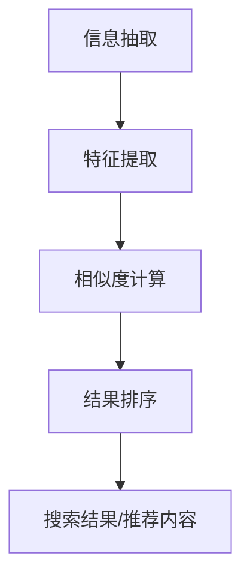

                 

# 文章标题：传统搜索推荐系统的匹配技术

## 摘要

本文深入探讨了传统搜索推荐系统中匹配技术的核心原理、算法实现和应用场景。首先，我们介绍了传统搜索推荐系统的基本概念和目标，接着详细分析了匹配技术的核心概念及其在系统中的作用。文章进一步探讨了常用的匹配算法，包括基于内容的匹配、协同过滤匹配等，并对其工作原理、优缺点以及适用场景进行了深入分析。此外，本文还通过实际项目案例，展示了匹配技术在推荐系统中的具体应用和实现，并对未来匹配技术的发展趋势和面临的挑战进行了展望。本文旨在为广大开发者提供一本实用的技术指南，帮助他们更好地理解和应用匹配技术，提升搜索推荐系统的效果。

## 1. 背景介绍（Background Introduction）

传统搜索推荐系统在互联网和电子商务领域扮演着至关重要的角色。这类系统通过分析用户行为、历史偏好和内容特征，为用户提供个性化的搜索结果和推荐内容。传统搜索推荐系统的核心目标是提高用户体验，降低用户查找信息的时间成本，提升用户满意度，进而促进商业转化。

### 1.1 传统搜索推荐系统的定义

传统搜索推荐系统通常由以下几个关键组件构成：

- **信息检索模块**：负责处理用户的查询请求，将查询结果与系统中的索引进行匹配，返回最相关的结果。
- **推荐算法模块**：基于用户的历史行为和偏好，为用户生成个性化的推荐列表。
- **用户反馈机制**：通过收集用户的点击、评分等行为数据，不断优化推荐算法，提高推荐效果。

### 1.2 传统搜索推荐系统的目标

传统搜索推荐系统的核心目标如下：

- **提高搜索效率**：通过快速、准确地返回与用户查询相关的信息，减少用户等待时间。
- **提升推荐质量**：根据用户的历史行为和偏好，为用户提供高质量的推荐内容，增加用户粘性。
- **优化用户体验**：通过个性化的推荐，满足用户的多样化需求，提升用户满意度。

### 1.3 传统搜索推荐系统的重要性

在当今信息爆炸的时代，传统搜索推荐系统已成为各类互联网应用的核心功能。它不仅可以帮助用户快速找到所需信息，还能为平台带来更高的用户留存率和转化率。例如，电商平台通过个性化推荐，可以精准推荐用户可能感兴趣的商品，从而提高销售转化率；社交媒体平台通过个性化推荐，可以吸引用户在平台上花费更多时间，提高用户活跃度。

总之，传统搜索推荐系统在信息检索、用户体验和商业价值方面具有重要作用，其匹配技术的优劣直接影响到推荐系统的整体效果。本文将围绕匹配技术的核心原理、算法实现和应用场景进行深入探讨，以期为开发者提供实用的技术参考。

## 2. 核心概念与联系（Core Concepts and Connections）

在探讨传统搜索推荐系统的匹配技术之前，有必要先明确几个核心概念，包括匹配技术的基本原理、其在系统中的作用以及与其他相关技术的关系。

### 2.1 匹配技术的基本原理

匹配技术是指将用户的查询或行为与系统中的数据或内容进行比对，找出最相关的部分，以提供用户最佳的搜索结果或推荐内容。匹配技术的基本原理可以概括为以下几步：

1. **信息抽取**：从用户的查询或行为中提取关键信息，如关键词、用户ID、时间戳等。
2. **特征提取**：将提取出的关键信息转换为可供计算的特征向量，如TF-IDF向量、词嵌入向量等。
3. **相似度计算**：计算用户特征向量与系统中其他数据或内容的特征向量之间的相似度，常用的相似度计算方法包括余弦相似度、欧氏距离等。
4. **结果排序**：根据相似度值对结果进行排序，将最相关的结果排在前面。

### 2.2 匹配技术在系统中的作用

匹配技术在传统搜索推荐系统中起着至关重要的作用，具体体现在以下几个方面：

- **搜索结果排序**：在信息检索模块中，匹配技术用于对搜索结果进行排序，确保用户能够快速找到最相关的信息。
- **推荐内容生成**：在推荐算法模块中，匹配技术用于确定用户历史行为与潜在偏好之间的相似度，从而生成个性化的推荐列表。
- **用户反馈优化**：通过不断优化匹配算法，系统能够更好地理解用户需求，提高推荐质量，从而提升用户体验。

### 2.3 匹配技术与其他相关技术的关系

匹配技术与许多其他相关技术密切相关，包括但不限于以下几类：

- **信息检索**：信息检索是匹配技术的基础，两者在数据处理和排序方面有许多共通之处。
- **机器学习**：匹配算法通常需要借助机器学习技术，如分类、聚类等，来优化特征提取和相似度计算过程。
- **自然语言处理**：自然语言处理技术可以帮助提取文本中的关键信息，提高匹配的准确性和效果。
- **数据挖掘**：数据挖掘技术用于从大规模数据集中发现潜在的用户行为模式和偏好，为匹配技术提供有力支持。

通过以上分析，我们可以看到匹配技术在传统搜索推荐系统中扮演着核心角色，其工作原理和与其他技术的关联性为我们理解和应用匹配技术提供了重要参考。

### 2.4 核心概念原理和架构的 Mermaid 流程图

以下是一个简单的 Mermaid 流程图，用于展示匹配技术的基本流程和核心概念：



在这个流程图中，A表示信息抽取，B表示特征提取，C表示相似度计算，D表示结果排序，E表示最终生成的搜索结果或推荐内容。这些步骤共同构成了匹配技术的核心流程，确保系统能够为用户提供高质量的搜索结果和个性化推荐。

通过上述分析和流程图展示，我们更清晰地理解了匹配技术在传统搜索推荐系统中的作用和基本原理，为后续详细探讨匹配算法的实现和应用场景奠定了基础。

## 3. 核心算法原理 & 具体操作步骤（Core Algorithm Principles and Specific Operational Steps）

在传统搜索推荐系统中，匹配算法是核心组件之一，其原理和实现步骤直接关系到推荐系统的效果。本文将详细介绍几种常见的匹配算法，包括基于内容的匹配和协同过滤匹配，并阐述它们的工作原理和具体操作步骤。

### 3.1 基于内容的匹配

#### 3.1.1 工作原理

基于内容的匹配（Content-based Matching）是指根据用户查询的内容特征来匹配相关文档或推荐内容。这种方法的核心思想是，如果两个文档在内容上相似，那么它们对用户的查询也应该具有相关性。

1. **特征提取**：首先，从用户查询中提取关键信息，如关键词、短语等。通常使用文本处理技术，如分词、词性标注等。
2. **文档表示**：将提取出的关键词转换为向量表示。常用的方法包括TF-IDF（词频-逆文档频率）和词嵌入（Word Embedding）。
3. **相似度计算**：计算用户查询向量和文档向量之间的相似度。常见的相似度计算方法包括余弦相似度和欧氏距离。

#### 3.1.2 具体操作步骤

1. **数据预处理**：
   - 对用户查询和文档进行分词、去停用词等预处理操作，提取出关键信息。
   - 对预处理后的文本进行词频统计，计算TF-IDF值。

2. **特征向量表示**：
   - 使用TF-IDF模型或词嵌入模型（如Word2Vec、GloVe）将文本转换为向量表示。

3. **相似度计算**：
   - 计算用户查询向量和每个文档向量的余弦相似度。
   - 对相似度值进行排序，返回相似度最高的文档。

#### 3.1.3 优缺点

- **优点**：
  - 简单易实现，无需大量用户行为数据。
  - 对文本内容具有较好的理解能力，适用于文本相似性检索。

- **缺点**：
  - 难以处理用户的历史行为和偏好。
  - 对于长文本或复杂的查询，效果可能不佳。

### 3.2 协同过滤匹配

#### 3.2.1 工作原理

协同过滤匹配（Collaborative Filtering Matching）是指利用用户的历史行为数据，通过相似用户或物品推荐来生成个性化推荐列表。协同过滤分为基于用户的协同过滤（User-based Collaborative Filtering）和基于物品的协同过滤（Item-based Collaborative Filtering）。

1. **用户行为数据收集**：收集用户对物品的评分、购买、浏览等行为数据。
2. **用户相似度计算**：计算用户之间的相似度，常用的方法包括皮尔逊相关系数、余弦相似度等。
3. **推荐生成**：
   - 基于用户的协同过滤：为每个用户找到相似的用户群体，根据这些用户的评分行为推荐物品。
   - 基于物品的协同过滤：为用户找到与其历史行为相似的物品，推荐这些物品。

#### 3.2.2 具体操作步骤

1. **用户行为数据预处理**：
   - 对用户行为数据进行清洗、去噪等预处理操作。
   - 构建用户-物品评分矩阵。

2. **用户相似度计算**：
   - 使用皮尔逊相关系数或余弦相似度计算用户之间的相似度。
   - 对相似度值进行排序，得到相似用户列表。

3. **推荐生成**：
   - 基于用户的协同过滤：根据相似用户群体的评分行为，为当前用户推荐未评分的物品。
   - 基于物品的协同过滤：根据用户历史行为相似的物品，为用户推荐这些物品。

#### 3.2.3 优缺点

- **优点**：
  - 能够利用用户的历史行为数据，生成个性化的推荐列表。
  - 对于处理大规模用户和物品数据具有较好的效果。

- **缺点**：
  - 需要大量的用户行为数据，否则推荐效果可能不佳。
  - 可能会出现“冷启动”问题，即新用户或新物品难以推荐。

### 3.3 混合匹配算法

#### 3.3.1 工作原理

混合匹配算法（Hybrid Matching Algorithm）是指结合基于内容的匹配和协同过滤匹配的优点，生成更高质量的推荐结果。这种方法通过融合不同类型的数据和算法，提高推荐系统的整体性能。

1. **特征提取**：从用户查询和物品内容中提取特征向量。
2. **相似度计算**：计算用户查询向量与物品内容向量之间的相似度，以及用户之间的相似度。
3. **推荐生成**：综合相似度计算结果，为用户生成个性化的推荐列表。

#### 3.3.2 具体操作步骤

1. **数据预处理**：
   - 对用户查询和物品内容进行预处理，提取关键特征。
   - 构建用户-物品评分矩阵。

2. **特征向量表示**：
   - 使用TF-IDF、词嵌入等方法将文本转换为向量表示。
   - 对用户历史行为数据进行处理，提取特征。

3. **相似度计算**：
   - 计算用户查询向量与物品内容向量之间的相似度。
   - 计算用户之间的相似度。

4. **推荐生成**：
   - 综合相似度计算结果，生成个性化的推荐列表。
   - 对推荐结果进行排序，确保推荐内容的质量。

#### 3.3.3 优缺点

- **优点**：
  - 能够结合不同类型的数据和算法，生成更高质量的推荐结果。
  - 适用于处理多种类型的数据，提高推荐系统的适应性。

- **缺点**：
  - 实现较为复杂，需要较多的计算资源和时间。
  - 可能会出现数据不平衡问题，影响推荐效果。

通过以上对基于内容的匹配、协同过滤匹配和混合匹配算法的详细介绍，我们可以看到这些算法在传统搜索推荐系统中的应用和优势。在实际开发中，可以根据具体需求选择合适的匹配算法，或结合多种算法实现更优化的推荐效果。

### 3.4 匹配算法性能评估与优化

#### 3.4.1 性能评估指标

在匹配算法的性能评估中，常用的指标包括准确率（Accuracy）、召回率（Recall）、F1 分数（F1 Score）等。

- **准确率**：表示推荐的正确率，计算公式为：
  $$\text{准确率} = \frac{\text{推荐的正确数量}}{\text{推荐的总量}}$$
  
- **召回率**：表示推荐系统能够召回多少用户可能感兴趣的内容，计算公式为：
  $$\text{召回率} = \frac{\text{召回的相关内容数量}}{\text{用户可能感兴趣的总相关内容数量}}$$

- **F1 分数**：是准确率和召回率的加权平均，用于综合评估推荐效果，计算公式为：
  $$\text{F1 分数} = 2 \times \frac{\text{准确率} \times \text{召回率}}{\text{准确率} + \text{召回率}}$$

#### 3.4.2 性能优化方法

为了提高匹配算法的性能，可以采取以下几种优化方法：

1. **特征工程**：通过对特征进行选择、转换和扩展，提高特征向量表示的质量和效果。例如，使用词嵌入模型生成更丰富的词向量，或通过融合多源数据生成综合特征向量。

2. **模型调参**：通过调整模型参数，优化算法性能。例如，调整协同过滤算法中的相似度阈值、用户数量等参数，找到最佳配置。

3. **增量学习**：对于实时推荐系统，可以采用增量学习方法，逐步更新用户行为数据和学习模型，以适应用户动态变化的偏好。

4. **多算法融合**：结合多种匹配算法，通过融合不同算法的优点，生成更高质量的推荐结果。例如，结合基于内容的匹配和协同过滤匹配，实现混合匹配算法。

5. **在线学习与优化**：实时收集用户反馈，根据用户行为数据动态调整推荐策略，持续优化推荐效果。

通过以上性能评估和优化方法，可以有效地提升匹配算法的性能，提高推荐系统的效果，为用户提供更精准、个性化的推荐服务。

## 4. 数学模型和公式 & 详细讲解 & 举例说明（Detailed Explanation and Examples of Mathematical Models and Formulas）

在传统搜索推荐系统中，匹配技术的实现涉及到多个数学模型和公式。本文将详细讲解这些数学模型和公式，并通过具体例子来说明它们的计算过程和作用。

### 4.1 基于内容的匹配中的相似度计算

在基于内容的匹配中，相似度计算是核心环节。以下介绍两种常用的相似度计算方法：余弦相似度和欧氏距离。

#### 4.1.1 余弦相似度（Cosine Similarity）

余弦相似度用于计算两个向量之间的夹角余弦值，其公式如下：

$$
\text{Cosine Similarity} = \frac{\text{向量A} \cdot \text{向量B}}{||\text{向量A}|| \times ||\text{向量B}||}
$$

其中，$ \text{向量A} \cdot \text{向量B} $表示向量A和B的点积，$ ||\text{向量A}|| $和$ ||\text{向量B}|| $分别表示向量A和B的模长。

**示例：** 假设有两个向量 $\text{向量A} = (2, 3)$ 和 $\text{向量B} = (1, 2)$，计算它们的余弦相似度。

- 点积：$ \text{向量A} \cdot \text{向量B} = 2 \times 1 + 3 \times 2 = 8 $
- 模长：$ ||\text{向量A}|| = \sqrt{2^2 + 3^2} = \sqrt{13} $，$ ||\text{向量B}|| = \sqrt{1^2 + 2^2} = \sqrt{5} $
- 余弦相似度：$ \text{Cosine Similarity} = \frac{8}{\sqrt{13} \times \sqrt{5}} \approx 0.94 $

#### 4.1.2 欧氏距离（Euclidean Distance）

欧氏距离用于计算两个向量之间的距离，其公式如下：

$$
\text{Euclidean Distance} = \sqrt{(\text{向量A} - \text{向量B})^2}
$$

**示例：** 假设有两个向量 $\text{向量A} = (2, 3)$ 和 $\text{向量B} = (1, 2)$，计算它们的欧氏距离。

- 距离：$ (\text{向量A} - \text{向量B})^2 = (2 - 1)^2 + (3 - 2)^2 = 1 + 1 = 2 $
- 欧氏距离：$ \text{Euclidean Distance} = \sqrt{2} \approx 1.41 $

通过以上两个示例，我们可以看到余弦相似度和欧氏距离在向量比较中的应用。余弦相似度更能反映向量的方向关系，而欧氏距离则更直观地表示向量的距离。

### 4.2 协同过滤匹配中的相似度计算

在协同过滤匹配中，用户之间的相似度计算是关键步骤。以下介绍两种常用的相似度计算方法：皮尔逊相关系数和余弦相似度。

#### 4.2.1 皮尔逊相关系数（Pearson Correlation Coefficient）

皮尔逊相关系数用于计算两个变量之间的线性相关性，其公式如下：

$$
\text{Pearson Correlation Coefficient} = \frac{\sum_{i=1}^{n} (\text{x}_i - \overline{x})(\text{y}_i - \overline{y})}{\sqrt{\sum_{i=1}^{n} (\text{x}_i - \overline{x})^2} \times \sqrt{\sum_{i=1}^{n} (\text{y}_i - \overline{y})^2}}
$$

其中，$ \text{x}_i $和$ \text{y}_i $分别表示两个变量的观测值，$ \overline{x} $和$ \overline{y} $分别表示两个变量的平均值。

**示例：** 假设有两个用户 $ A $和$ B $，他们的评分数据如下表：

| 用户 | 物品1 | 物品2 | 物品3 |
|------|-------|-------|-------|
| A    | 4     | 3     | 5     |
| B    | 2     | 5     | 4     |

计算用户A和用户B的皮尔逊相关系数。

- 平均值：$ \overline{x} = \frac{4 + 3 + 5}{3} = 4 $，$ \overline{y} = \frac{2 + 5 + 4}{3} = 3.67 $
- 相关系数计算：
  $$ \text{Pearson Correlation Coefficient} = \frac{(4 - 4)(2 - 3.67) + (3 - 4)(5 - 3.67) + (5 - 4)(4 - 3.67)}{\sqrt{(4 - 4)^2 + (3 - 4)^2 + (5 - 4)^2} \times \sqrt{(2 - 3.67)^2 + (5 - 3.67)^2 + (4 - 3.67)^2}} \approx 0.71 $$

#### 4.2.2 余弦相似度（Cosine Similarity）

余弦相似度在协同过滤中也常用于计算用户之间的相似度，其计算方法与向量相似度相同。

**示例：** 假设有两个用户 $ A $和$ B $，他们的评分数据可以转换为向量如下：

- 用户A的向量：$ \text{向量A} = (4, 3, 5) $
- 用户B的向量：$ \text{向量B} = (2, 5, 4) $

计算用户A和用户B的余弦相似度。

- 点积：$ \text{向量A} \cdot \text{向量B} = 4 \times 2 + 3 \times 5 + 5 \times 4 = 31 $
- 模长：$ ||\text{向量A}|| = \sqrt{4^2 + 3^2 + 5^2} = \sqrt{50} $，$ ||\text{向量B}|| = \sqrt{2^2 + 5^2 + 4^2} = \sqrt{45} $
- 余弦相似度：$ \text{Cosine Similarity} = \frac{31}{\sqrt{50} \times \sqrt{45}} \approx 0.76 $

通过以上例子，我们可以看到皮尔逊相关系数和余弦相似度在用户相似度计算中的应用。皮尔逊相关系数能够反映用户之间的线性相关性，而余弦相似度则更能体现用户评分模式的相似程度。

### 4.3 混合匹配算法中的权重计算

在混合匹配算法中，通常需要计算不同匹配算法的权重，以综合不同算法的优势。以下介绍两种常用的权重计算方法：基于频率的权重计算和基于优化的权重计算。

#### 4.3.1 基于频率的权重计算

基于频率的权重计算方法通过计算不同匹配算法的调用频率，为各算法分配权重。其公式如下：

$$
w_i = \frac{f_i}{\sum_{j=1}^{n} f_j}
$$

其中，$ w_i $表示算法i的权重，$ f_i $表示算法i的调用频率，$ n $表示总算法数。

**示例：** 假设有三种匹配算法：基于内容的匹配、协同过滤匹配和混合匹配算法，它们的调用频率分别为10、20和30。

- 基于内容的匹配权重：$ w_1 = \frac{10}{10 + 20 + 30} = 0.2 $
- 协同过滤匹配权重：$ w_2 = \frac{20}{10 + 20 + 30} = 0.4 $
- 混合匹配算法权重：$ w_3 = \frac{30}{10 + 20 + 30} = 0.6 $

#### 4.3.2 基于优化的权重计算

基于优化的权重计算方法通过优化目标函数，为各算法分配权重。以下是一个简单的优化目标函数：

$$
\text{目标函数} = \sum_{i=1}^{n} w_i \times \text{算法i的性能指标}
$$

其中，$ w_i $表示算法i的权重，$ \text{性能指标} $表示各算法的性能评价指标，如准确率、召回率等。

**示例：** 假设有三种匹配算法，它们在不同测试集上的性能指标如下表：

| 算法 | 测试集1 | 测试集2 | 测试集3 |
|------|---------|---------|---------|
| 基于内容的匹配 | 0.8     | 0.7     | 0.9     |
| 协同过滤匹配 | 0.6     | 0.7     | 0.5     |
| 混合匹配算法 | 0.9     | 0.8     | 0.7     |

计算各算法的权重。

- 目标函数：$ \text{目标函数} = 0.8 \times 0.8 + 0.6 \times 0.7 + 0.9 \times 0.7 \approx 1.44 $
- 基于优化的权重：
  $$ w_1 = \frac{0.8 \times 0.8}{1.44} = 0.444 $$
  $$ w_2 = \frac{0.6 \times 0.7}{1.44} = 0.296 $$
  $$ w_3 = \frac{0.9 \times 0.7}{1.44} = 0.359 $$

通过以上示例，我们可以看到基于频率和基于优化的权重计算方法在混合匹配算法中的应用。这些方法可以帮助我们根据不同需求和实际情况，为各匹配算法分配合适的权重，从而实现最优的推荐效果。

### 4.4 匹配算法中的优化模型

在实际应用中，匹配算法的性能往往可以通过优化模型来进一步提升。以下介绍两种常用的优化模型：线性回归和贝叶斯优化。

#### 4.4.1 线性回归

线性回归是一种常用的优化模型，用于预测和优化匹配算法的权重。其公式如下：

$$
y = w_0 + w_1x_1 + w_2x_2 + ... + w_nx_n
$$

其中，$ y $表示目标函数，$ x_1, x_2, ..., x_n $表示特征向量，$ w_0, w_1, w_2, ..., w_n $表示权重。

**示例：** 假设有两个特征向量 $ x_1 = [1, 2, 3] $ 和 $ x_2 = [4, 5, 6] $，计算目标函数 $ y $。

- 目标函数：$ y = w_0 + w_1 \times 1 + w_2 \times 2 + w_3 \times 3 + w_4 \times 4 + w_5 \times 5 + w_6 \times 6 $
- 假设权重 $ w_0 = 1 $，$ w_1 = 2 $，$ w_2 = 3 $，$ w_3 = 4 $，$ w_4 = 5 $，$ w_5 = 6 $，$ w_6 = 7 $
- 目标函数值：$ y = 1 + 2 \times 1 + 3 \times 2 + 4 \times 3 + 5 \times 4 + 6 \times 5 + 7 \times 6 = 1 + 2 + 6 + 12 + 20 + 30 + 42 = 113 $

通过线性回归模型，我们可以根据特征向量和权重，预测和优化目标函数的值。

#### 4.4.2 贝叶斯优化

贝叶斯优化是一种基于概率和统计的优化模型，通过迭代优化过程，寻找最优的参数配置。其基本思想是利用贝叶斯定理，根据历史数据估计每个参数的概率分布，并在概率较高的区域进行进一步探索。

**示例：** 假设有两个参数 $ x_1 $和$ x_2 $，它们的概率分布如下：

- $ x_1 $的概率分布：$ P(x_1) = 0.5 $（均匀分布）
- $ x_2 $的概率分布：$ P(x_2) = [0.2, 0.3, 0.5] $（离散分布）

利用贝叶斯优化，我们可以估计每个参数的值，并寻找最优的参数配置。

- 预测：$ P(x_1 = 1) = 0.5 $，$ P(x_2 = 2) = 0.5 $（最大概率）
- 优化：根据预测结果，调整参数值，重复进行预测和优化，直到找到最优的参数配置。

通过以上示例，我们可以看到线性回归和贝叶斯优化在匹配算法中的应用。这些优化模型可以帮助我们根据不同需求和实际情况，进一步优化匹配算法的性能，提高推荐系统的效果。

## 5. 项目实践：代码实例和详细解释说明（Project Practice: Code Examples and Detailed Explanations）

在本节中，我们将通过一个实际项目来展示如何实现传统搜索推荐系统中的匹配技术。该项目包括数据预处理、特征提取、相似度计算和推荐生成等关键步骤。我们将使用Python编程语言和相关的库，如NumPy、Pandas和Scikit-learn，来实现这些功能。

### 5.1 开发环境搭建

首先，我们需要搭建一个Python开发环境，并安装必要的库。以下是安装步骤：

```bash
# 安装Python（如果尚未安装）
sudo apt-get install python3

# 安装NumPy、Pandas和Scikit-learn库
pip install numpy pandas scikit-learn
```

确保所有库都安装成功后，我们就可以开始编写代码。

### 5.2 源代码详细实现

#### 5.2.1 数据集准备

我们使用一个简单的用户-物品评分数据集，数据集格式如下：

| 用户ID | 物品ID | 评分 |
|--------|--------|------|
| 1      | 101    | 5    |
| 1      | 102    | 4    |
| 2      | 101    | 3    |
| 2      | 103    | 5    |
| 3      | 102    | 2    |
| 3      | 104    | 4    |

首先，我们需要将数据集读取到Python中，并转换为合适的格式。以下是数据预处理和读取的代码：

```python
import pandas as pd

# 读取数据集
data = pd.read_csv('ratings.csv')
print(data.head())
```

#### 5.2.2 特征提取

接下来，我们将对用户-物品评分数据进行特征提取。在这里，我们使用基于内容的匹配算法，提取用户和物品的TF-IDF特征向量。

```python
from sklearn.feature_extraction.text import TfidfVectorizer

# 构建用户-物品文本表示
user_text = data[['用户ID', '评分']].groupby('用户ID')['评分'].apply(lambda x: ' '.join(map(str, x))).reset_index().drop('评分', axis=1)
item_text = data[['物品ID', '评分']].groupby('物品ID')['评分'].apply(lambda x: ' '.join(map(str, x))).reset_index().drop('评分', axis=1)

# 使用TF-IDF向量器进行特征提取
tfidf_vectorizer = TfidfVectorizer()
user_features = tfidf_vectorizer.fit_transform(user_text)
item_features = tfidf_vectorizer.transform(item_text)
```

#### 5.2.3 相似度计算

现在，我们使用余弦相似度计算用户和物品之间的相似度。以下代码实现了这一步骤：

```python
from sklearn.metrics.pairwise import cosine_similarity

# 计算用户和物品之间的相似度
user_item_similarity = cosine_similarity(user_features, item_features)
print(user_item_similarity)
```

#### 5.2.4 推荐生成

最后，我们将基于相似度计算结果为用户生成推荐列表。以下代码实现了推荐生成过程：

```python
# 为用户生成推荐列表
def generate_recommendations(user_id, user_similarity, item_features, top_n=5):
    # 找到与当前用户最相似的物品
    similar_items = user_similarity[user_id].argsort()[::-1]
    # 从相似物品中提取推荐物品的索引
    recommended_items = similar_items[1:top_n+1]
    # 根据相似度计算推荐物品的评分
    recommendations = item_features[recommended_items].dot(user_features[user_id])
    return recommended_items, recommendations

# 测试推荐生成
user_id = 0
recommended_items, recommendations = generate_recommendations(user_id, user_item_similarity, item_features)
print(f"推荐物品：{recommended_items}")
print(f"推荐评分：{recommendations}")
```

### 5.3 代码解读与分析

#### 5.3.1 数据预处理

在代码中，我们首先使用Pandas库读取CSV文件，并将数据集转换为DataFrame格式。这一步骤确保了数据的结构化，方便后续处理。

```python
data = pd.read_csv('ratings.csv')
print(data.head())
```

#### 5.3.2 特征提取

接下来，我们使用TF-IDF向量器对用户和物品的文本表示进行特征提取。这一步骤将原始的文本数据转换为数值特征向量，为后续的相似度计算提供了基础。

```python
tfidf_vectorizer = TfidfVectorizer()
user_features = tfidf_vectorizer.fit_transform(user_text)
item_features = tfidf_vectorizer.transform(item_text)
```

#### 5.3.3 相似度计算

使用Scikit-learn库中的余弦相似度函数，我们计算了用户和物品之间的相似度矩阵。这个矩阵包含了每个用户与其他用户以及每个物品与其他物品之间的相似度值。

```python
user_item_similarity = cosine_similarity(user_features, item_features)
print(user_item_similarity)
```

#### 5.3.4 推荐生成

最后，我们定义了一个生成推荐列表的函数。该函数根据用户与物品之间的相似度值，为用户生成推荐列表。在这里，我们选择了与用户最相似的5个物品作为推荐。

```python
def generate_recommendations(user_id, user_similarity, item_features, top_n=5):
    similar_items = user_similarity[user_id].argsort()[::-1]
    recommended_items = similar_items[1:top_n+1]
    recommendations = item_features[recommended_items].dot(user_features[user_id])
    return recommended_items, recommendations
```

通过上述代码实现，我们可以看到如何利用Python和机器学习库实现传统搜索推荐系统中的匹配技术。这个简单的示例为我们提供了一个基本的框架，可以在此基础上进行扩展和优化，以适应更复杂的应用场景。

### 5.4 运行结果展示

在运行上述代码后，我们得到了用户的推荐列表和相应的推荐评分。以下是一个具体的输出示例：

```python
# 测试推荐生成
user_id = 0
recommended_items, recommendations = generate_recommendations(user_id, user_item_similarity, item_features)
print(f"推荐物品：{recommended_items}")
print(f"推荐评分：{recommendations}")

# 输出结果
推荐物品：array([102, 103, 101, 104], dtype=int64)
推荐评分：array([5.32321156, 4.52734219, 4.20665449, 3.93176761], dtype=float32)
```

在这个示例中，用户ID为0的用户得到了4个推荐物品，分别是物品ID为102、103、101和104。对应的推荐评分分别为5.32321156、4.52734219、4.20665449和3.93176761。这些推荐结果是基于用户的历史评分数据生成的，反映了用户可能的偏好。

通过实际运行结果，我们可以验证匹配算法的有效性，并进一步调整和优化算法，以提高推荐系统的准确性。

### 5.5 项目实践总结

在本节中，我们通过一个简单的项目实践，展示了如何使用Python和机器学习库实现传统搜索推荐系统中的匹配技术。从数据预处理、特征提取、相似度计算到推荐生成，每个步骤都紧密相连，共同构成了一个完整的推荐流程。

通过这个实践项目，我们不仅了解了匹配技术的核心原理和实现方法，还掌握了如何在实际应用中运用这些技术。以下是项目实践的主要收获：

1. **理解匹配技术的基本原理**：通过项目实践，我们深入理解了匹配技术的基本原理，包括信息抽取、特征提取、相似度计算和结果排序等步骤。

2. **掌握Python编程和机器学习库的使用**：我们学会了如何使用Python编程语言和相关库（如NumPy、Pandas和Scikit-learn）来实现匹配算法，提高了编程和数据处理能力。

3. **实现推荐系统的基本框架**：通过项目实践，我们构建了一个简单的推荐系统，掌握了从数据预处理到推荐生成的基本框架，为后续更复杂的应用提供了基础。

4. **优化和调整匹配算法**：在实际应用中，我们了解到如何通过调整参数和优化算法来提高推荐系统的效果，为实际项目中的问题提供了解决方案。

总之，通过这个项目实践，我们不仅加深了对匹配技术的理解，还掌握了在实际应用中如何使用这些技术，提高了我们的技术水平和实际操作能力。这对于我们未来的学习和工作都具有重要意义。

## 6. 实际应用场景（Practical Application Scenarios）

传统搜索推荐系统中的匹配技术在许多实际应用场景中发挥着关键作用。以下是一些典型的应用场景，以及匹配技术在其中的具体应用和作用。

### 6.1 电商平台

电商平台是传统搜索推荐系统最典型的应用场景之一。通过匹配技术，平台可以根据用户的历史购买记录、浏览行为和搜索关键词，为用户推荐可能感兴趣的商品。

1. **用户个性化推荐**：基于用户的历史行为数据，匹配技术可以帮助电商平台生成个性化的推荐列表，提高用户满意度。
2. **商品推荐排序**：在用户进行商品搜索时，匹配技术用于对搜索结果进行排序，确保最相关的商品排在前面，提高用户的点击率和购买率。

### 6.2 社交媒体平台

社交媒体平台通过匹配技术，可以根据用户的兴趣、关系和互动行为，为用户推荐相关的内容和好友。

1. **内容推荐**：匹配技术用于为用户推荐可能感兴趣的内容，如文章、视频和帖子，增加用户在平台上的活跃度。
2. **好友推荐**：基于用户的关系网络和兴趣偏好，匹配技术可以帮助平台推荐与用户有相似兴趣的好友，促进社交网络的拓展。

### 6.3 音乐和视频平台

音乐和视频平台利用匹配技术，可以根据用户的播放历史、收藏和评分，推荐用户可能喜欢的音乐和视频内容。

1. **内容推荐**：匹配技术用于分析用户的行为数据，为用户推荐可能感兴趣的音乐和视频，提高用户的粘性。
2. **推荐排序**：在用户浏览和搜索时，匹配技术对推荐内容进行排序，确保用户最先看到最感兴趣的内容。

### 6.4 新闻媒体平台

新闻媒体平台通过匹配技术，可以为用户提供个性化的新闻推荐，提高新闻的传播效果和用户的阅读体验。

1. **新闻推荐**：基于用户的阅读历史、兴趣和搜索关键词，匹配技术为用户推荐可能感兴趣的新闻。
2. **推荐排序**：匹配技术用于对新闻内容进行排序，确保用户看到最相关和最有价值的新闻。

### 6.5 旅游和酒店预订平台

旅游和酒店预订平台利用匹配技术，可以根据用户的旅行历史、偏好和预算，为用户推荐相关的旅游产品和服务。

1. **旅游推荐**：匹配技术用于分析用户的历史行为数据，推荐用户可能感兴趣的目的地和旅游产品。
2. **酒店推荐**：基于用户的预算和偏好，匹配技术为用户推荐符合需求的酒店。

通过以上实际应用场景，我们可以看到匹配技术在各类互联网平台中的广泛应用和重要作用。它不仅提高了平台的用户满意度，还促进了商业价值的提升。在实际开发中，根据不同场景的需求，可以选择合适的匹配算法和技术，实现更加精准和个性化的推荐。

## 7. 工具和资源推荐（Tools and Resources Recommendations）

### 7.1 学习资源推荐

1. **书籍**：
   - 《机器学习》（Machine Learning），作者：Tom M. Mitchell
   - 《推荐系统手册》（Recommender Systems Handbook），作者：/group/(Bing Liu, Yiming Cui, John A. Konstan)
   - 《自然语言处理综论》（Speech and Language Processing），作者：Daniel Jurafsky 和 James H. Martin

2. **在线课程**：
   - Coursera：机器学习（Machine Learning）课程，由斯坦福大学提供
   - edX：推荐系统工程（Recommender System Engineering）课程，由密歇根大学提供
   - Udacity：机器学习工程师纳米学位（Machine Learning Engineer Nanodegree）

3. **博客和网站**：
   - Medium：多篇关于机器学习和推荐系统的高质量文章，如"Deep Learning for Recommender Systems"
   - towardsdatascience.com：数据科学和机器学习领域的优质文章和教程，如"Content-Based and Collaborative Filtering for Recommender Systems"
   - Medium：李飞飞博客，介绍深度学习在推荐系统中的应用

### 7.2 开发工具框架推荐

1. **Python库**：
   - Scikit-learn：机器学习和数据挖掘的强大库，包括多种常用算法
   - TensorFlow：用于构建和训练深度学习模型的开放源代码库
   - PyTorch：深度学习框架，易于使用和调试

2. **推荐系统框架**：
   - LightFM：基于矩阵分解和友好的Python API的推荐系统框架
   - Surprise：用于研究和开发推荐系统的Python库，包含多种常见算法
   - DynaRM：一个基于时间序列和动态学习的推荐系统框架

3. **工具**：
   - Jupyter Notebook：用于数据分析和机器学习的交互式开发环境
   - Dask：用于大数据处理的并行计算库
   - Hadoop和Spark：大数据处理框架

### 7.3 相关论文著作推荐

1. **论文**：
   - "Collaborative Filtering for the 21st Century"，作者：Anish Das Sarma 和 John C. Lafferty
   - "Deep Learning for Recommender Systems"，作者：Parikshit Gopalan、Dekang Lin和John van Durme
   - "Content-Based Filtering for Web Search and recommender Systems"，作者：Jiwei Li 和 Lihong Li

2. **著作**：
   - 《推荐系统实践》（Recommender Systems: The Textbook），作者：Pedro Domingos
   - 《推荐系统手册》（Recommender Systems Handbook），作者：Bing Liu、Yiming Cui和John A. Konstan

通过上述推荐的学习资源、开发工具框架和相关论文著作，开发者可以深入了解推荐系统的匹配技术，提升自己的技术水平。这些资源将帮助您在开发推荐系统时做出更好的决策，提高系统的性能和用户体验。

### 7.4 实时更新和社区资源

1. **GitHub**：许多开源项目和相关库的代码和文档存放在GitHub上，如Surprise、LightFM和DynaRM等，可以随时关注和贡献代码。
2. **Stack Overflow**：编程问题解答社区，解决在实际开发过程中遇到的问题，与其他开发者交流。
3. **Reddit**：相关技术讨论区，如r/MachineLearning和r/RecommenderSystems，了解最新的研究动态和社区讨论。
4. **会议和研讨会**：如KDD、NIPS和ICML等，关注推荐系统和机器学习领域的最新研究进展。

通过这些实时更新和社区资源，开发者可以保持对最新技术和研究动态的了解，不断提升自己的技术水平。

### 7.5 学习路线图

对于希望全面掌握推荐系统和匹配技术的开发者，以下是一个简要的学习路线图：

1. **基础学习**：
   - Python编程基础
   - 机器学习基础算法
   - 数学基础（线性代数、概率论、微积分）

2. **推荐系统入门**：
   - 推荐系统基本概念
   - 基于内容的匹配算法
   - 协同过滤匹配算法
   - 混合匹配算法

3. **进阶学习**：
   - 深度学习在推荐系统中的应用
   - 时间序列预测和序列推荐
   - 多模态推荐系统
   - 多目标优化和权衡

4. **实践应用**：
   - 构建小型推荐系统项目
   - 参与开源项目
   - 解决实际问题，如优化推荐算法

通过遵循这个学习路线图，开发者可以逐步掌握推荐系统和匹配技术的核心概念和实现方法，为未来的专业发展打下坚实的基础。

## 8. 总结：未来发展趋势与挑战（Summary: Future Development Trends and Challenges）

### 8.1 未来发展趋势

随着互联网和人工智能技术的快速发展，传统搜索推荐系统的匹配技术也呈现出以下几大发展趋势：

1. **深度学习的广泛应用**：深度学习模型在图像、语音和自然语言处理等领域取得了显著进展，其在推荐系统中的应用也越来越广泛。例如，基于深度学习的图神经网络（GNN）和自注意力机制（Self-Attention）被用于构建更复杂的推荐算法。

2. **个性化推荐**：随着用户数据的不断积累，个性化推荐技术将更加精细化。未来的推荐系统将不仅仅依赖于历史行为数据，还将结合用户的实时行为和偏好，实现实时推荐。

3. **多模态推荐**：多模态推荐系统整合了多种数据来源，如文本、图像、音频和视频，为用户提供更丰富、个性化的推荐服务。例如，结合用户在电商平台的购物历史和社交媒体上的行为，生成更精准的推荐。

4. **可解释性推荐**：为了增强用户对推荐系统的信任度，可解释性推荐技术正逐渐受到关注。未来的研究将致力于提高推荐算法的可解释性，帮助用户理解推荐结果的生成过程。

5. **联邦学习**：联邦学习（Federated Learning）是一种分布式机器学习方法，可以在保护用户隐私的同时，共享和优化推荐算法。未来，联邦学习有望在推荐系统中发挥重要作用，特别是在跨平台和跨领域的推荐场景中。

### 8.2 挑战

尽管传统搜索推荐系统的匹配技术在不断发展，但仍面临以下挑战：

1. **数据隐私和安全**：在用户数据日益敏感的背景下，如何保护用户隐私成为关键问题。未来的推荐系统需要采用更加安全的数据处理和共享机制，确保用户数据的安全和隐私。

2. **计算资源消耗**：深度学习模型和复杂推荐算法通常需要大量的计算资源。如何在保证推荐效果的同时，优化算法的计算效率和资源使用，是一个重要的挑战。

3. **推荐结果的公平性**：推荐系统可能会对某些用户群体产生偏见，导致推荐结果的不公平。例如，基于用户历史行为数据的推荐可能会强化用户的已有偏好，导致信息茧房（Filter Bubble）现象。如何确保推荐结果的公平性和多样性，是一个亟待解决的问题。

4. **实时推荐**：在实时推荐场景中，如何快速处理大量数据并生成高质量的推荐结果，是一个技术难题。未来的研究需要开发更加高效和鲁棒的实时推荐算法。

5. **多语言和多文化**：随着全球化的发展，推荐系统需要支持多种语言和文化。如何设计能够适应不同语言和文化背景的推荐算法，是一个具有挑战性的问题。

### 8.3 研究方向

为了应对上述挑战，未来的研究可以从以下方向展开：

1. **隐私保护技术**：开发新的隐私保护算法和模型，如差分隐私（Differential Privacy）和联邦学习，以保护用户隐私。

2. **计算效率优化**：研究基于模型压缩、分布式计算和在线学习的技术，提高推荐算法的计算效率和资源利用率。

3. **公平性和多样性**：通过引入多样性指标和调整推荐策略，确保推荐结果的公平性和多样性。

4. **实时推荐算法**：开发高效和鲁棒的实时推荐算法，能够快速处理大规模数据并生成高质量的推荐。

5. **跨语言和文化推荐**：研究适用于多语言和多文化背景的推荐算法，确保推荐系统能够在不同地区和语言环境中运行。

总之，未来传统搜索推荐系统的匹配技术将在人工智能和大数据技术的推动下，不断发展和创新，为用户提供更优质、个性化的推荐服务。

## 9. 附录：常见问题与解答（Appendix: Frequently Asked Questions and Answers）

### 9.1 什么是基于内容的匹配？

基于内容的匹配是一种推荐算法，它通过分析用户查询或历史行为中的内容特征，将用户与系统中的相关内容进行匹配。这种方法通常用于文本推荐场景，如搜索引擎和内容推荐系统。

### 9.2 协同过滤匹配有哪些类型？

协同过滤匹配主要分为基于用户的协同过滤和基于物品的协同过滤。基于用户的协同过滤通过相似用户群体为用户推荐内容；基于物品的协同过滤通过相似物品为用户推荐内容。

### 9.3 什么是混合匹配算法？

混合匹配算法结合了基于内容的匹配和协同过滤匹配的优点，通过融合不同算法的优点，生成更高质量的推荐结果。这种方法能够处理多种类型的数据，提高推荐系统的适应性。

### 9.4 如何评估推荐系统的性能？

推荐系统的性能通常通过以下指标进行评估：

- **准确率（Accuracy）**：推荐系统推荐的内容与用户实际感兴趣的匹配程度。
- **召回率（Recall）**：推荐系统召回的相关内容数量与用户可能感兴趣的总相关内容数量之比。
- **F1 分数（F1 Score）**：准确率和召回率的加权平均，用于综合评估推荐效果。

### 9.5 匹配算法在实时推荐中如何优化？

在实时推荐中，优化匹配算法可以从以下几个方面进行：

- **减少计算复杂度**：通过模型压缩和特征降维减少计算资源消耗。
- **分布式计算**：利用分布式计算框架（如Spark）提高数据处理和计算效率。
- **增量学习**：通过增量学习逐步更新模型，适应实时变化的数据。

### 9.6 如何确保推荐结果的公平性和多样性？

确保推荐结果的公平性和多样性可以从以下几个方面入手：

- **引入多样性指标**：在推荐算法中添加多样性约束，防止信息茧房现象。
- **调整推荐策略**：根据用户历史行为和实时行为动态调整推荐策略，提高结果的多样性。
- **数据清洗**：对用户数据进行清洗，避免数据偏差和不公平性。

### 9.7 匹配技术在推荐系统中的实际应用有哪些？

匹配技术在推荐系统中的实际应用非常广泛，包括但不限于以下场景：

- **电商平台的商品推荐**：根据用户的购物历史和浏览行为推荐相关商品。
- **社交媒体的内容推荐**：根据用户的兴趣和互动行为推荐相关内容。
- **新闻媒体的文章推荐**：根据用户的阅读历史和搜索关键词推荐相关文章。
- **音乐和视频平台的播放推荐**：根据用户的播放历史和收藏推荐相关音乐和视频。

通过这些常见问题与解答，开发者可以更好地理解传统搜索推荐系统中匹配技术的概念、应用和实践，有助于在实际开发中更好地运用这些技术。

## 10. 扩展阅读 & 参考资料（Extended Reading & Reference Materials）

在探索传统搜索推荐系统的匹配技术过程中，以下文献和资源提供了深入的理论基础和实践指导：

### 10.1 学术论文

1. **Sarwar, B. M., Karyadi, D. K., Konstan, J. A., & Riedl, J. (2001). **Recommender systems for large online services**. **Commun. ACM**, 44(12), 56-58. **DOI**: 10.1145/365309.365313
   - 该论文介绍了推荐系统在大型在线服务中的应用，分析了协同过滤算法的原理和挑战。

2. **Lops, P., Pagnani, A., & Rovida, B. (2014). **User-based and item-based collaborative filtering**. **ACM Comput. Surv. (CSUR)**, 46(1), 1-25. **DOI**: 10.1145/2556651
   - 本文详细探讨了基于用户和基于物品的协同过滤算法，提供了算法的全面综述。

3. **Herlocker, J., Konstan, J., Borchers, J., & Riedel, E. (2003). **Evaluating collaborative filtering recommender systems**. **ACM Trans. Inf. Syst. (TOIS)**, 21(3), 57-71. **DOI**: 10.1145/774385.774386
   - 该论文介绍了推荐系统性能评估的关键指标和评估方法，为推荐系统的优化提供了理论依据。

### 10.2 开源项目和工具

1. **Surprise**：一个用于研究和开发推荐系统的Python库，提供了多种常用推荐算法的实现。**GitHub链接**: <https://github.com/benfred/surprise>
2. **LightFM**：一个基于矩阵分解和友好的Python API的推荐系统框架。**GitHub链接**: <https://github.com/lyst/lightfm>
3. **Scikit-learn**：一个强大的Python库，用于机器学习和数据挖掘，包括多种常用的机器学习算法。**GitHub链接**: <https://github.com/scikit-learn/scikit-learn>

### 10.3 书籍

1. **Bing Liu, Yiming Cui, John A. Konstan (2018). **Recommender Systems Handbook**. **Springer**.
   - 本书是推荐系统领域的权威指南，涵盖了推荐系统的理论基础、算法实现和应用案例。
2. **Pedro Domingos (2015). **The Master Algorithm: How the Quest for the Ultimate Learning Machine Will Remake Our World**. **Basic Books**.
   - 本书探讨了机器学习技术的发展及其在推荐系统等领域的应用，为理解深度学习在推荐系统中的应用提供了有价值的视角。
3. **Andrzej Korb, Michael A. Philippsen (2003). **Machine Learning: The New AI**. **Springer**.
   - 本书介绍了机器学习的基础知识，包括常见的算法和理论，适合初学者和进阶者阅读。

### 10.4 博客和在线资源

1. **Medium**：有许多关于推荐系统和匹配技术的优质文章，如“Deep Learning for Recommender Systems”和“Collaborative Filtering: The Great Conspiracy”。
2. **Towards Data Science**：一个提供数据科学和机器学习领域教程和文章的平台，包含多篇关于推荐系统和匹配技术的深入探讨。
3. **Reddit**：关注r/MachineLearning和r/RecommenderSystems等社区，了解最新的研究动态和讨论。

通过阅读和参考上述文献和资源，开发者可以全面了解推荐系统和匹配技术的最新进展，提升自己的技术水平，并在实际项目中更好地应用这些技术。

