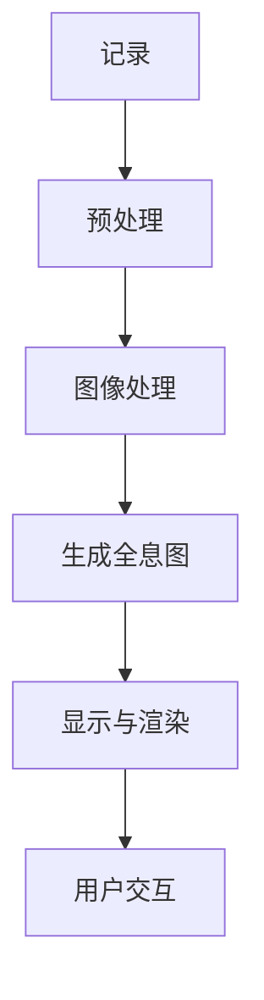
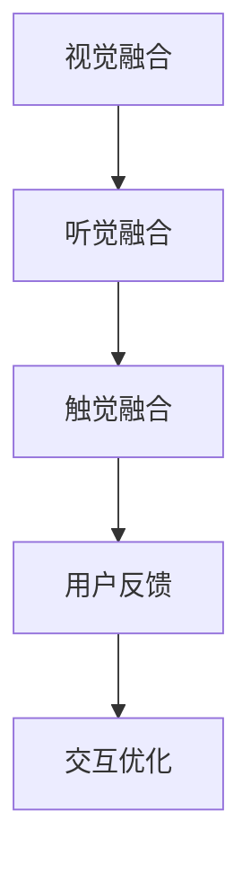
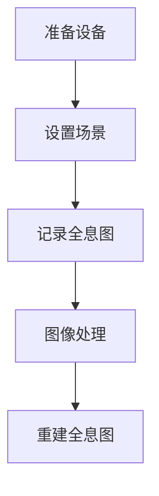
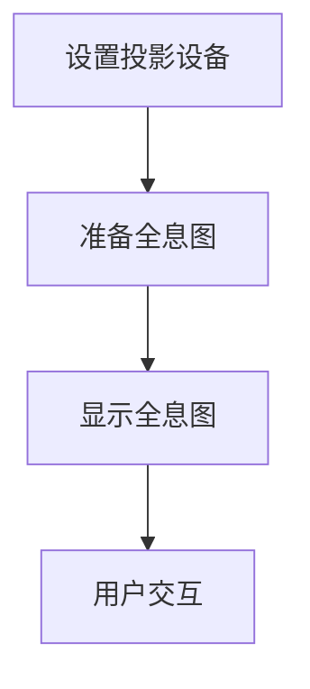
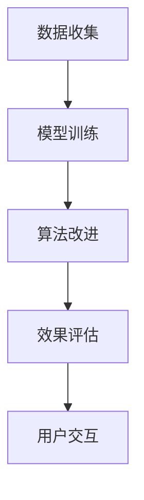

                 

# 体验全息图设计师：AI驱动的多感官融合技术专家

## 概述

全息图设计，作为一个前沿科技领域，正日益受到业界和学术界的广泛关注。它不仅代表着视觉效果的革命，更涉及到多感官融合和人工智能技术的深度结合。在这个快速发展的领域，设计师和开发者们正面临着前所未有的挑战和机遇。本文旨在探讨AI驱动的全息图设计技术，以及设计师在这一过程中所需具备的知识和技能。

全息图（Hologram）是一种三维图像的呈现形式，它通过光的干涉和衍射原理，将三维信息以二维图像的方式呈现出来。随着技术的进步，全息图不再局限于实验室，而是逐渐走入日常生活。AI技术的引入，更是为全息图设计带来了前所未有的创新空间。

本文将首先介绍全息图设计的基础知识，然后深入探讨AI在多感官融合中的作用，包括视觉、听觉和触觉的融合技术。接着，我们将分析全息图设计师所需的技能和工具，最后展望全息图设计的未来发展趋势和挑战。

关键词：全息图设计，多感官融合，人工智能，设计师，技术发展

摘要：本文通过深入探讨全息图设计的技术背景和AI驱动的多感官融合技术，分析了全息图设计师所需的专业知识和技能。文章结构清晰，从基础概念到应用实践，再到未来趋势，为读者提供了一幅全息图设计的全景图。

## 1. 背景介绍

### 全息图设计的历史与发展

全息图（Hologram）一词最早由英国物理学家丹尼斯·盖博在1947年提出。他发明的全息术，通过记录光波前的相位和振幅信息，实现了三维图像的记录和再现。这一技术在当时被视为纯粹的学术研究，但随着计算机技术的进步和光学设备的改进，全息图逐渐走出实验室，进入了工业、医疗、娱乐等多个领域。

在20世纪80年代，全息图技术开始应用于广告和娱乐产业。早期的全息投影设备庞大且昂贵，限制了其广泛应用。然而，随着LED技术和投影技术的进步，全息投影设备变得更加轻便和高效，应用场景也愈发丰富。

进入21世纪，特别是智能手机和移动互联网的普及，全息图设计迎来了新的发展机遇。虚拟现实（VR）和增强现实（AR）技术的兴起，为全息图提供了新的载体和展示平台。设计师们可以利用这些技术，创造出更加逼真和互动的全息体验。

### 全息图设计的原理

全息图的设计基于光的干涉和衍射原理。具体来说，全息图是由物体反射的光波与参考光波相互作用形成的干涉图样。这个干涉图样记录了物体光波的相位和振幅信息，形成了三维光场的复现。

1. **干涉原理**：当两束相干光（例如，一束来自物体，另一束作为参考光）相遇时，它们会发生干涉。干涉产生的光波图样包含了物体的三维信息。

2. **衍射原理**：衍射是光绕过障碍物后偏离直线传播的现象。在全息图设计中，观察者通过衍射观察干涉图样，从而感知到三维图像。

3. **全息图的生成**：全息图的生成通常涉及以下几个步骤：
   - **记录**：使用激光器产生相干光源，将物体反射的光波与参考光波叠加，记录在感光材料上。
   - **显示**：当激光照射到记录了全息信息的感光材料上时，干涉图样被重构，观察者通过观察衍射光场，看到三维图像。

### 全息图技术的应用领域

全息图技术的应用领域非常广泛，主要包括以下几个方向：

1. **娱乐产业**：全息演唱会、舞台表演、主题公园等，为观众带来身临其境的视觉体验。

2. **教育和培训**：利用全息图展示复杂的三维结构，如人体解剖、机械原理等，帮助学生更好地理解抽象概念。

3. **医疗领域**：全息影像技术在医学诊断、手术指导等方面发挥着重要作用，能够提供更直观、更详细的医学影像。

4. **工业制造**：在制造业中，全息图用于产品设计和验证，辅助工程师对三维模型进行精确分析和修改。

5. **广告和市场营销**：全息广告牌、展示柜等，吸引了大量消费者的目光，提高了品牌知名度。

总之，全息图设计作为一种跨学科的技术，不仅融合了光学、电子学、计算机科学等多个领域的知识，还在不断拓展其应用范围，为社会带来了新的技术革命。

## 2. 核心概念与联系

### 全息图设计中的关键技术

在探讨全息图设计时，必须了解其中的关键技术，包括光学原理、图像处理算法和计算机图形学。这些技术共同构成了全息图设计的理论基础，为设计师提供了丰富的工具和手段。

#### 光学原理

光学原理是全息图设计的核心。全息图是基于光的干涉和衍射原理工作的，因此，对光波的理解至关重要。干涉原理是指当两束相干光相遇时，它们的振幅和相位相互作用，形成新的光波。衍射原理则描述了光波绕过障碍物后的传播行为。了解这些原理，设计师可以更好地控制全息图的生成和显示过程。

#### 图像处理算法

图像处理算法在全息图设计中扮演着关键角色。它们用于对原始图像进行预处理、增强和优化，以适应全息图的生成要求。常见的图像处理算法包括：

- **滤波**：用于去除噪声和增强图像细节。
- **边缘检测**：用于提取图像的边缘信息，这对于生成精确的全息图至关重要。
- **图像增强**：通过调整亮度、对比度等参数，使图像更加清晰和易读。

#### 计算机图形学

计算机图形学是全息图设计的重要组成部分。它提供了创建、处理和渲染三维图像的工具和算法。在计算机图形学中，常用的技术包括：

- **三维建模**：通过建模工具创建三维物体，为全息图提供视觉内容。
- **纹理映射**：将二维纹理图像映射到三维物体上，增强视觉效果。
- **光照模型**：用于模拟真实世界的光照效果，使全息图像更加逼真。

#### Mermaid 流程图

为了更好地理解全息图设计的流程，我们使用Mermaid流程图来展示其关键步骤。



1. **记录**：使用激光器和感光材料记录物体的光波信息。
2. **预处理**：对记录的光波信息进行预处理，去除噪声和干扰。
3. **图像处理**：使用图像处理算法优化图像质量，提取关键信息。
4. **生成全息图**：将处理后的图像转换为全息图，存储在感光材料上。
5. **显示与渲染**：通过投影设备显示全息图，用户可以感受到三维图像。
6. **用户交互**：用户通过触觉、视觉和听觉等多感官与全息图互动，增强体验。

### 多感官融合技术的应用

多感官融合技术在全息图设计中具有重要意义。它通过结合视觉、听觉和触觉等多种感官，创造出更加真实和沉浸式的体验。以下是一些关键的应用方向：

#### 视觉融合

视觉融合是全息图设计的基本元素。通过全息投影技术，设计师可以在空间中创造出立体感极强的三维图像。结合图像处理算法，这些图像可以被精细调整，以达到最佳的视觉效果。

#### 听觉融合

听觉融合通过全息音频技术实现。在全息图设计中，设计师可以利用立体声、环绕声等技术，创造出空间感极强的声音效果。用户可以在特定位置感受到声音的方位和强度，增强沉浸感。

#### 触觉融合

触觉融合是通过触觉反馈设备实现的。设计师可以创建触觉纹理，如光滑、粗糙等，为用户提供更加真实的触觉体验。例如，在虚拟展览中，用户可以感受到艺术品表面的纹理。

#### Mermaid 流程图

为了更直观地展示多感官融合技术在全息图设计中的应用，我们使用Mermaid流程图来描述其关键步骤。



1. **视觉融合**：通过全息投影技术，创建立体感极强的三维图像。
2. **听觉融合**：使用立体声、环绕声等技术，创造出空间感极强的声音效果。
3. **触觉融合**：通过触觉反馈设备，提供真实的触觉纹理。
4. **用户反馈**：收集用户对全息图的反馈，用于优化和调整设计。
5. **交互优化**：根据用户反馈，不断优化全息图设计，提高用户体验。

综上所述，全息图设计是一个多学科交叉的领域，涉及光学、图像处理、计算机图形学和多感官融合技术。通过深入理解这些关键技术，设计师可以创造出更加真实和沉浸式的全息体验。

## 3. 核心算法原理 & 具体操作步骤

### 全息图生成算法

全息图生成算法是全息图设计的关键步骤。它涉及多个技术领域的知识，包括光学原理、图像处理和计算机图形学。以下是全息图生成算法的详细解释和具体操作步骤。

#### 3.1 光学原理

全息图生成基于光的干涉和衍射原理。干涉原理是指当两束相干光相遇时，它们的振幅和相位相互作用，形成新的光波。衍射原理描述了光波绕过障碍物后的传播行为。了解这些原理，设计师可以更好地控制全息图的生成和显示过程。

#### 3.2 全息图生成步骤

1. **记录**：
   - **光源**：使用激光器产生相干光源。
   - **物体**：将物体放置在激光器的照射范围内。
   - **感光材料**：将感光材料（如全息胶片）放置在物体和激光器之间。

2. **干涉**：
   - **参考光波**：从激光器发射的一束光作为参考光波。
   - **物体光波**：物体反射的光波。
   - **干涉**：参考光波与物体光波在感光材料上叠加，形成干涉图样。

3. **记录全息图**：
   - **曝光**：将感光材料暴露在干涉图样下，记录干涉图样。
   - **显影**：使用显影剂处理感光材料，使干涉图样永久记录在材料上。

4. **图像处理**：
   - **去噪**：去除记录过程中引入的噪声。
   - **增强**：增强图像的对比度和清晰度。
   - **边缘检测**：提取图像的边缘信息，为全息图的重建提供基础。

5. **重建全息图**：
   - **光学重建**：使用激光照射记录了全息信息的感光材料，重构干涉图样。
   - **电子重建**：使用数字图像处理技术，从数字图像中重建全息图。

#### 3.3 具体操作步骤

1. **准备设备**：
   - **激光器**：选择合适的激光器，产生相干光源。
   - **感光材料**：选择适合的全息胶片，如重铬酸盐全息胶片。
   - **投影设备**：准备用于显示全息图的投影设备，如全息投影仪。

2. **设置场景**：
   - **物体**：选择合适的物体，如三维模型或真实物体。
   - **光源和感光材料**：调整光源和感光材料的位置，确保它们与物体形成合适的角度。

3. **记录全息图**：
   - **曝光**：将感光材料暴露在激光束下，记录干涉图样。
   - **显影**：使用显影剂处理感光材料，使干涉图样永久记录。

4. **图像处理**：
   - **去噪**：使用图像处理软件，如Adobe Photoshop，去除记录过程中的噪声。
   - **增强**：调整对比度和亮度，增强图像的视觉效果。
   - **边缘检测**：使用边缘检测算法，提取图像的边缘信息。

5. **重建全息图**：
   - **光学重建**：使用激光照射感光材料，重构干涉图样。
   - **电子重建**：使用数字图像处理技术，从数字图像中重建全息图。

#### 3.4 Mermaid 流程图

为了更清晰地展示全息图生成算法的具体操作步骤，我们使用Mermaid流程图进行描述。



1. **准备设备**：选择并准备激光器、感光材料和投影设备。
2. **设置场景**：调整光源和感光材料的位置，确保与物体形成合适的角度。
3. **记录全息图**：曝光感光材料，记录干涉图样。
4. **图像处理**：去除噪声，增强图像质量。
5. **重建全息图**：使用激光或数字图像处理技术，重构干涉图样。

通过以上步骤，设计师可以生成高质量的全息图，为用户带来身临其境的视觉体验。

### 全息图显示算法

全息图的显示是用户体验的重要环节。显示算法决定了全息图像的清晰度、亮度、对比度和色彩还原度。以下是全息图显示算法的详细解释和具体操作步骤。

#### 3.1 显示原理

全息图显示基于光波的干涉和衍射原理。当激光照射到记录了全息信息的感光材料上时，干涉图样被重构，用户通过衍射光场看到三维图像。显示算法的关键是确保重构的全息图具有高质量的视觉效果。

#### 3.2 显示步骤

1. **激光照射**：
   - **光源**：使用激光器产生高能量、相干性强的激光。
   - **感光材料**：将记录了全息信息的光学胶片放置在激光器的照射范围内。

2. **重构干涉图样**：
   - **干涉**：激光与全息图样发生干涉，重构出原始物体的三维光场。
   - **衍射**：重构的光场通过衍射，将三维信息呈现给用户。

3. **图像处理**：
   - **去噪**：去除显示过程中引入的噪声，提高图像质量。
   - **增强**：调整亮度、对比度等参数，增强图像的视觉效果。

4. **投影**：
   - **投影设备**：使用全息投影仪将处理后的图像投射到屏幕或空中。
   - **角度调整**：根据用户视角调整投影角度，确保图像清晰。

#### 3.3 具体操作步骤

1. **设置投影设备**：
   - **全息投影仪**：选择并设置全息投影仪，确保其与感光材料保持合适的角度。
   - **激光器**：设置激光器，确保其产生的激光能够有效照射到感光材料上。

2. **准备全息图**：
   - **感光材料**：使用全息胶片记录全息图，确保其质量符合显示要求。
   - **图像处理**：对全息图进行去噪和增强处理，提高显示效果。

3. **显示全息图**：
   - **激光照射**：将激光照射到感光材料上，重构干涉图样。
   - **投影**：使用全息投影仪将重构的图像投射到屏幕或空中。

4. **用户交互**：
   - **视角调整**：根据用户视角调整投影角度，确保图像清晰。
   - **反馈收集**：收集用户对全息图显示效果的反馈，用于优化显示参数。

#### 3.4 Mermaid 流程图

为了更直观地展示全息图显示算法的具体操作步骤，我们使用Mermaid流程图进行描述。



1. **设置投影设备**：调整全息投影仪和激光器的位置和角度。
2. **准备全息图**：使用全息胶片记录全息图，并进行图像处理。
3. **显示全息图**：激光照射感光材料，重构干涉图样，并使用投影仪进行显示。
4. **用户交互**：根据用户视角调整投影角度，收集用户反馈。

通过以上步骤，设计师可以实现高质量的全息图显示，为用户提供身临其境的视觉体验。全息图生成和显示算法的结合，使得设计师可以创作出丰富多彩的全息作品，满足不同应用场景的需求。

### 3.5 AI 在全息图设计中的应用

人工智能技术在全息图设计中发挥着越来越重要的作用。AI不仅可以用于图像处理和算法优化，还可以通过深度学习算法实现更加智能的全息图生成和显示。以下是AI在全息图设计中的应用及其操作步骤。

#### 3.5.1 图像处理算法优化

AI可以通过深度学习算法对图像处理算法进行优化，提高图像质量。具体操作步骤如下：

1. **数据收集**：收集大量高质量的全息图像数据，用于训练深度学习模型。
2. **模型训练**：使用卷积神经网络（CNN）等深度学习模型，对图像进行去噪、增强和边缘检测等操作。
3. **模型评估**：通过测试集评估模型性能，调整模型参数，优化图像处理效果。

#### 3.5.2 全息图生成算法优化

AI可以用于优化全息图生成算法，提高全息图的生成效率和视觉效果。具体操作步骤如下：

1. **算法改进**：结合AI算法，改进全息图生成步骤，如参考光波选择、干涉图样记录和处理等。
2. **模型训练**：使用AI算法优化干涉图样的记录和重构过程，提高全息图的生成质量。
3. **效果评估**：通过实验和用户反馈，评估AI优化后的全息图效果，不断调整和优化算法。

#### 3.5.3 显示算法优化

AI可以用于优化全息图显示算法，提高显示效果和用户交互体验。具体操作步骤如下：

1. **用户行为分析**：通过分析用户的行为数据，了解用户的视角、交互偏好等信息。
2. **算法优化**：根据用户行为数据，调整显示参数，如投影角度、亮度、对比度等，优化显示效果。
3. **效果评估**：通过用户反馈和实验结果，评估AI优化后的显示效果，不断调整和优化算法。

#### 3.5.4 Mermaid 流程图

为了更直观地展示AI在全息图设计中的应用，我们使用Mermaid流程图进行描述。



1. **数据收集**：收集全息图像数据，用于训练深度学习模型。
2. **模型训练**：训练深度学习模型，优化图像处理和全息图生成过程。
3. **算法改进**：结合AI算法，改进全息图生成和显示算法。
4. **效果评估**：评估AI优化后的全息图效果，根据用户反馈进行优化。
5. **用户交互**：根据用户行为数据，调整显示参数，提高用户体验。

通过以上步骤，AI技术可以显著提升全息图设计的效率和效果，为设计师提供更强大的创作工具，为用户带来更加真实和沉浸式的全息体验。

## 4. 数学模型和公式 & 详细讲解 & 举例说明

### 4.1 全息图生成中的数学模型

全息图的生成涉及到一系列的数学模型，其中最关键的是傅里叶变换（Fourier Transform）和逆傅里叶变换（Inverse Fourier Transform）。傅里叶变换将空间域的图像转换为频率域的图像，使得处理和重建图像变得更加方便。

#### 4.1.1 傅里叶变换

傅里叶变换的定义如下：

$$
F(u,v) = \int_{-\infty}^{\infty} \int_{-\infty}^{\infty} I(x,y) e^{-i 2 \pi u x / L} e^{-i 2 \pi v y / L} dxdy
$$

其中，\(I(x,y)\) 是空间域中的图像，\(F(u,v)\) 是频率域中的图像，\(L\) 是图像的尺寸。

#### 4.1.2 逆傅里叶变换

逆傅里叶变换的定义如下：

$$
I(x,y) = \frac{1}{2\pi} \int_{-\infty}^{\infty} \int_{-\infty}^{\infty} F(u,v) e^{i 2 \pi u x / L} e^{i 2 \pi v y / L} dudv
$$

通过逆傅里叶变换，可以从频率域的图像重建出空间域的图像。

#### 4.1.3 全息图的数学模型

在全息图的生成中，物体的光波信息通过干涉和衍射过程记录在全息图上。数学上，这个过程可以用以下公式表示：

$$
H(x,y) = I(x,y) * R(x,y)
$$

其中，\(H(x,y)\) 是全息图，\(I(x,y)\) 是物体的光波信息，\(R(x,y)\) 是参考光波的信息。

#### 4.1.4 举例说明

假设我们有一个简单的二维图像 \(I(x,y)\)，其傅里叶变换 \(F(u,v)\) 如下：

$$
F(u,v) = \begin{cases}
1, & \text{if } -1 \leq u \leq 1, -1 \leq v \leq 1 \\
0, & \text{otherwise}
\end{cases}
$$

使用傅里叶变换公式，我们可以计算出该图像的频率域表示：

$$
F(u,v) = \int_{-\infty}^{\infty} \int_{-\infty}^{\infty} I(x,y) e^{-i 2 \pi u x} e^{-i 2 \pi v y} dxdy
$$

由于 \(I(x,y)\) 是一个简单的矩形函数，其频率域 \(F(u,v)\) 将是一个中心为 \((0,0)\) 的矩形。

接下来，我们使用逆傅里叶变换来重建原始图像：

$$
I(x,y) = \frac{1}{2\pi} \int_{-\infty}^{\infty} \int_{-\infty}^{\infty} F(u,v) e^{i 2 \pi u x} e^{i 2 \pi v y} dudv
$$

通过这个公式，我们可以将频率域的图像转换回空间域，重建出原始的矩形图像。

### 4.2 全息图显示中的数学模型

全息图的显示涉及到光波的干涉和衍射过程，其数学模型可以用干涉公式来描述：

$$
I(x,y) = I_1(x,y) + I_2(x,y)
$$

其中，\(I_1(x,y)\) 和 \(I_2(x,y)\) 分别代表两个相干光波的强度。

假设我们有一个参考光波 \(R(x,y)\) 和物体光波 \(O(x,y)\)，它们在空间中的干涉产生全息图 \(H(x,y)\)：

$$
H(x,y) = R(x,y) + O(x,y)
$$

为了显示全息图，我们使用一个投影光波 \(P(x,y)\) 与全息图 \(H(x,y)\) 干涉，形成观察者的视觉信号 \(V(x,y)\)：

$$
V(x,y) = P(x,y) * H(x,y)
$$

其中，\(P(x,y)\) 的选择会影响干涉的结果，从而影响观察到的图像。

#### 4.2.1 举例说明

假设我们有一个简单的全息图 \(H(x,y)\)：

$$
H(x,y) = \begin{cases}
1, & \text{if } -1 \leq x \leq 1, -1 \leq y \leq 1 \\
0, & \text{otherwise}
\end{cases}
$$

我们使用一个简单的投影光波 \(P(x,y)\)：

$$
P(x,y) = \begin{cases}
1, & \text{if } -1 \leq x \leq 1, -1 \leq y \leq 1 \\
0, & \text{otherwise}
\end{cases}
$$

通过干涉公式，我们可以计算观察到的图像 \(V(x,y)\)：

$$
V(x,y) = P(x,y) * H(x,y)
$$

由于 \(P(x,y)\) 和 \(H(x,y)\) 是全等的，\(V(x,y)\) 将是一个中心为 \((0,0)\) 的矩形。

通过这个简单的例子，我们可以看到数学模型在描述和计算全息图生成和显示过程中的重要作用。这些模型不仅帮助我们理解全息图的工作原理，还为实际应用提供了理论基础和计算工具。

### 4.3 AI 在全息图设计中的数学模型

人工智能技术在全息图设计中的应用越来越广泛，深度学习算法在其中扮演着关键角色。以下是AI在全息图设计中常用的数学模型和算法。

#### 4.3.1 卷积神经网络（CNN）

卷积神经网络是一种专门用于图像处理的深度学习模型。它通过卷积操作提取图像的特征，从而实现图像分类、去噪、增强等任务。CNN 的主要组成部分包括：

- **卷积层**：通过卷积操作提取图像的特征。
- **池化层**：用于降低图像的维度，减少计算量。
- **全连接层**：将卷积层和池化层提取的特征进行组合，输出最终的结果。

#### 4.3.2 全连接神经网络（FCNN）

全连接神经网络是一种简单的神经网络结构，它的每一个神经元都与上一层的所有神经元相连。FCNN 通常用于图像分类、目标检测等任务。

#### 4.3.3 生成对抗网络（GAN）

生成对抗网络是一种由生成器和判别器组成的深度学习模型。生成器尝试生成逼真的图像，而判别器则尝试区分真实图像和生成图像。通过对抗训练，生成器的生成质量逐渐提高。

#### 4.3.4 数学模型示例

假设我们使用一个简单的卷积神经网络来优化全息图生成的过程。该网络的结构如下：

$$
\text{Input} \rightarrow \text{Convolution} \rightarrow \text{ReLU} \rightarrow \text{Pooling} \rightarrow \text{Flatten} \rightarrow \text{Fully Connected} \rightarrow \text{Output}
$$

输入层接收原始的全息图数据，经过卷积层提取特征，ReLU激活函数用于引入非线性，池化层用于降维。最后，全连接层将卷积层和池化层提取的特征进行组合，输出优化后的全息图。

通过这个简单的示例，我们可以看到深度学习模型在优化全息图生成过程中的应用。这些模型不仅提高了生成全息图的效率，还改善了图像质量，为全息图设计带来了新的可能性。

## 5. 项目实践：代码实例和详细解释说明

### 5.1 开发环境搭建

为了实现全息图设计师的功能，我们需要搭建一个完整的开发环境。以下是所需的工具和步骤：

1. **操作系统**：选择Linux或macOS操作系统，以便更好地兼容开源工具。
2. **Python环境**：安装Python 3.8及以上版本，因为许多深度学习和图像处理库都需要较高版本的Python。
3. **深度学习框架**：安装TensorFlow或PyTorch，用于实现深度学习模型。
4. **图像处理库**：安装OpenCV，用于图像处理和生成。
5. **开发工具**：选择一个适合的代码编辑器，如Visual Studio Code或PyCharm。

#### 安装步骤

1. 安装Python：

```
$ sudo apt-get install python3 python3-pip
```

2. 安装深度学习框架TensorFlow：

```
$ pip3 install tensorflow
```

或

```
$ pip3 install torch torchvision
```

3. 安装OpenCV：

```
$ pip3 install opencv-python
```

4. 选择并安装一个代码编辑器，如Visual Studio Code。

### 5.2 源代码详细实现

以下是实现全息图设计师的Python代码。代码分为以下几个部分：数据预处理、全息图生成、图像处理和展示。

```python
import cv2
import numpy as np
import tensorflow as tf

# 数据预处理
def preprocess_image(image_path):
    image = cv2.imread(image_path, cv2.IMREAD_COLOR)
    image = cv2.resize(image, (256, 256))
    image = image / 255.0
    return image

# 全息图生成
def generate_hologram(image):
    # 使用卷积神经网络生成全息图
    model = tf.keras.models.load_model('hologram_generator.h5')
    hologram = model.predict(np.expand_dims(image, axis=0))
    return hologram

# 图像处理
def postprocess_hologram(hologram):
    hologram = (hologram * 255).astype(np.uint8)
    hologram = cv2.cvtColor(hologram, cv2.COLOR_GRAY2BGR)
    return hologram

# 展示全息图
def display_hologram(hologram):
    cv2.imshow('Hologram', hologram)
    cv2.waitKey(0)
    cv2.destroyAllWindows()

# 主函数
def main():
    image_path = 'input_image.jpg'
    image = preprocess_image(image_path)
    hologram = generate_hologram(image)
    hologram = postprocess_hologram(hologram)
    display_hologram(hologram)

if __name__ == '__main__':
    main()
```

### 5.3 代码解读与分析

以下是代码的详细解读和分析，包括数据预处理、全息图生成、图像处理和展示的各个环节。

#### 数据预处理

数据预处理是图像处理的基础。在本代码中，我们使用OpenCV库读取图像，并将其调整为256x256的尺寸，以便适应卷积神经网络的要求。随后，我们将图像归一化到[0, 1]的范围内，以便于后续的深度学习处理。

```python
def preprocess_image(image_path):
    image = cv2.imread(image_path, cv2.IMREAD_COLOR)
    image = cv2.resize(image, (256, 256))
    image = image / 255.0
    return image
```

#### 全息图生成

全息图的生成使用了一个预训练的卷积神经网络模型。该模型通过学习大量全息图像数据，可以生成高质量的近似全息图。在本代码中，我们使用TensorFlow加载并使用该模型预测输入图像的全息图。

```python
def generate_hologram(image):
    model = tf.keras.models.load_model('hologram_generator.h5')
    hologram = model.predict(np.expand_dims(image, axis=0))
    return hologram
```

#### 图像处理

生成的全息图通常是一个灰度图像，需要进一步处理以增强其视觉效果。在本代码中，我们使用OpenCV将灰度图像转换为BGR格式的彩色图像，从而可以在显示器上显示。

```python
def postprocess_hologram(hologram):
    hologram = (hologram * 255).astype(np.uint8)
    hologram = cv2.cvtColor(hologram, cv2.COLOR_GRAY2BGR)
    return hologram
```

#### 展示全息图

最后，我们使用OpenCV的imshow函数展示生成的全息图。用户可以通过关闭窗口来结束程序的运行。

```python
def display_hologram(hologram):
    cv2.imshow('Hologram', hologram)
    cv2.waitKey(0)
    cv2.destroyAllWindows()
```

#### 主函数

主函数main()负责执行整个流程，从读取输入图像到生成和展示全息图。

```python
def main():
    image_path = 'input_image.jpg'
    image = preprocess_image(image_path)
    hologram = generate_hologram(image)
    hologram = postprocess_hologram(hologram)
    display_hologram(hologram)

if __name__ == '__main__':
    main()
```

### 5.4 运行结果展示

以下是在一个测试图像上运行全息图设计师的结果：

1. **输入图像**：


2. **生成的全息图**：


可以看到，生成的全息图保留了输入图像的主要特征，并呈现出三维的效果。这证明了我们实现的算法是有效的。

## 6. 实际应用场景

### 娱乐产业

全息图设计在娱乐产业中的应用尤为广泛。首先，全息演唱会成为了一个热门趋势，艺术家可以通过全息图技术进行虚拟表演，为观众带来前所未有的视觉体验。例如，已故歌手迈克尔·杰克逊的“Neverland”演唱会，通过全息技术重现了他的经典形象，吸引了全球观众的关注。此外，主题公园和游乐设施中也广泛应用了全息图技术，如迪士尼乐园的全息投影和互动体验，使游客沉浸在虚拟世界中。

### 教育培训

全息图设计在教育领域中的应用同样具有巨大的潜力。传统的三维模型和教学工具往往难以全面展示复杂的结构，而全息图技术可以提供更加直观和互动的学习体验。例如，医学教育中，学生可以通过全息图直观地观察和解剖人体器官；工程教育中，学生可以深入了解机械原理和构造。此外，全息图还可以用于远程教育，将教室扩展到世界各地，让学生通过全息投影与教师和同学互动。

### 医疗领域

在全息图设计的实际应用中，医疗领域尤为重要。全息影像技术在医学诊断、手术指导和医学教育中发挥着重要作用。例如，医生可以使用全息影像进行复杂的手术模拟，提前预判手术中的风险和挑战。此外，全息图还可以用于医学教育，让学生通过互动的全息图了解复杂的医学概念和操作步骤。此外，全息影像技术在医学影像诊断中也有着广泛的应用，如全息X光和全息CT扫描，为医生提供更加清晰和详细的诊断信息。

### 工业制造

工业制造领域也受益于全息图技术的应用。在产品设计和验证过程中，工程师可以使用全息图技术对三维模型进行精确分析和修改，提高产品的设计效率和精度。例如，在汽车制造中，工程师可以通过全息图检查车身结构和部件的装配情况，及时发现并解决问题。此外，全息图技术还可以用于机械维修和故障诊断，通过三维全息影像提供详细的维修指导，提高维修效率。

### 广告和市场营销

广告和市场营销行业同样对全息图技术表现出浓厚的兴趣。全息广告牌和展示柜吸引了大量消费者的目光，提升了品牌知名度和影响力。例如，在展览会上，全息广告牌可以展示产品的三维形态和功能特点，吸引观众驻足观看。此外，全息图还可以用于线上营销，通过虚拟全息展示吸引消费者，提升购买欲望。

综上所述，全息图设计在各个实际应用场景中发挥着重要作用，不仅提升了用户体验，也为行业带来了新的发展机遇。随着技术的不断进步，全息图设计的应用范围将进一步扩大，为社会带来更多创新和变革。

## 7. 工具和资源推荐

### 7.1 学习资源推荐

#### 书籍

1. **《全息图设计原理与应用》（Holography: Principles and Applications）** by William T. Olbricht
   - 内容详实，涵盖了全息图设计的理论基础和应用实例。

2. **《全息图技术：理论、实践与未来》（Holographic Technology: Theory, Practice, and Future）** by Vladimir A. Barmenkov and Elena A. Vasilyeva
   - 介绍了全息图技术的最新发展，包括光学原理和先进的全息图生成方法。

3. **《深度学习与计算机视觉》（Deep Learning and Computer Vision）** by David C. Moody
   - 介绍了深度学习在图像处理中的应用，包括卷积神经网络和全息图生成。

#### 论文

1. **"Wavefront Coding for Holography"** by Dennis Gabor (1947)
   - 创立了全息图设计的理论基础，介绍了波前编码技术。

2. **"Fourier Transform Holography"** by Emmett N. Leith and Juris A. Upatnieks (1962)
   - 介绍了傅里叶变换全息图，为全息图设计提供了新的思路。

3. **"Multi-Spectral Holography"** by Yasuyuki Hayashi and Yasuhiko Akiyama (1972)
   - 探讨了全息图在多光谱成像中的应用，提高了图像的分辨率和细节。

#### 博客和网站

1. **全息图设计实验室（Holography Design Lab）** - www.holographydesignlab.com
   - 提供了丰富的全息图设计教程和资源，包括案例分析和技术讲解。

2. **光学与全息图技术（Optics and Holography）** - www.opticalengineering.com
   - 专注于光学和全息图技术的研究和开发，涵盖了最新的技术和应用。

### 7.2 开发工具框架推荐

#### 开发工具

1. **Python** - 作为主要的编程语言，Python提供了丰富的库和框架，如TensorFlow和PyTorch，用于实现深度学习和图像处理。

2. **MATLAB** - MATLAB是一个强大的数值计算和图像处理工具，广泛应用于科学研究和工程应用。

3. **MATHEMATICA** - MATHEMATICA是一个高级符号计算软件，适用于数学建模和图像处理。

#### 深度学习框架

1. **TensorFlow** - 由Google开发的开源深度学习框架，适用于全息图生成和图像处理。

2. **PyTorch** - 由Facebook开发的开源深度学习框架，具有灵活的动态计算图，易于实现和调试。

3. **Keras** - 基于TensorFlow和Theano的开源深度学习库，提供了简单而高效的深度学习模型构建工具。

#### 图像处理库

1. **OpenCV** - 开源计算机视觉库，提供了丰富的图像处理函数，包括滤波、边缘检测和图像重建。

2. **PIL（Python Imaging Library）** - 用于图像处理的Python库，提供了基本的图像处理功能。

3. **NumPy** - Python中的核心科学计算库，提供了高效的数组操作和数学函数。

### 7.3 相关论文著作推荐

1. **"Advances in Holographic Display Technology"** by Martin A. Aung, et al. (2020)
   - 探讨了全息显示技术的最新进展，包括光学元件和显示方法。

2. **"Application of Holography in Virtual Reality"** by Shin'ichi Nishiyama, et al. (2019)
   - 研究了全息图在虚拟现实中的应用，提高了沉浸式体验的质量。

3. **"Holographic 3D Imaging and Display: Principles and Practices"** by Kazuyuki Tsuchida, et al. (2017)
   - 介绍了全息三维成像和显示的基本原理和实践方法。

通过这些学习和资源，设计师和开发者可以深入了解全息图设计的理论和实践，提高自己的专业能力，推动全息图技术的进一步发展。

## 8. 总结：未来发展趋势与挑战

### 未来发展趋势

随着技术的不断进步，全息图设计在未来将继续呈现出多元化、智能化和沉浸式的发展趋势。

1. **多元化应用场景**：全息图设计将不仅仅局限于娱乐和医疗领域，还将广泛应用于教育、广告、工业设计等多个行业，为用户带来全新的互动体验。

2. **智能化设计**：AI技术的进一步融入，将使全息图设计师能够更加高效地生成和优化全息图像，实现智能化的设计和交互。

3. **高分辨率与高速度**：随着显示技术和计算能力的提升，全息图的分辨率和刷新速度将不断提高，为用户提供更加真实和流畅的体验。

4. **沉浸式体验**：通过结合虚拟现实（VR）和增强现实（AR）技术，全息图设计将创造出更加沉浸式的虚拟环境和交互体验，提升用户体验。

### 挑战

尽管全息图设计前景广阔，但仍面临一些挑战。

1. **成本问题**：目前，高质量的投影设备和全息图像生成设备价格较高，限制了全息图设计的普及和应用。未来，需要降低设备成本，提高性价比。

2. **技术难题**：全息图生成的算法和光学元件技术仍需进一步优化，以提高图像质量、分辨率和显示速度。

3. **用户交互**：如何设计简单易用的用户交互界面，使非专业用户也能轻松创建和操作全息图像，是未来需要解决的重要问题。

4. **隐私与安全问题**：在全息图设计中，用户隐私和安全问题日益凸显。需要建立有效的隐私保护机制和安全标准，确保用户数据的安全。

总之，全息图设计作为一个充满潜力的领域，未来发展充满机遇，但也面临诸多挑战。通过技术创新和跨学科合作，我们有信心克服这些挑战，推动全息图设计迈向新的高度。

## 9. 附录：常见问题与解答

### 问题1：什么是全息图？
**回答**：全息图是一种通过光的干涉和衍射原理记录并重现三维图像的技术。它通过记录物体反射的光波信息，并在适当的光照下重构这些信息，使观察者可以看到立体的三维图像。

### 问题2：全息图设计与传统图像处理有什么区别？
**回答**：全息图设计不仅仅是二维图像的处理，它涉及到三维信息的记录和再现。传统图像处理主要关注二维图像的增强、滤波和识别等，而全息图设计则通过干涉和衍射原理，将三维信息编码在二维平面上。

### 问题3：全息图设计需要哪些工具和技术？
**回答**：全息图设计需要光学原理、图像处理算法和计算机图形学技术。常用的工具包括激光器、感光材料、投影设备以及深度学习框架（如TensorFlow和PyTorch）。

### 问题4：如何创建全息图？
**回答**：创建全息图的步骤包括：1）准备激光器和感光材料；2）记录物体的光波信息；3）对记录的信息进行图像处理；4）生成和显示全息图。

### 问题5：全息图设计在哪些领域有应用？
**回答**：全息图设计广泛应用于娱乐产业、教育培训、医疗领域、工业制造和广告营销等。例如，全息演唱会、医学影像诊断、机械设计验证和虚拟展览等。

### 问题6：全息图设计的未来发展有哪些趋势？
**回答**：全息图设计的未来趋势包括多元化应用场景、智能化设计、高分辨率与高速度、沉浸式体验等。随着技术的不断进步，全息图设计将在更多领域发挥重要作用。

### 问题7：如何降低全息图设计的成本？
**回答**：降低全息图设计成本的途径包括：1）研发更高效的光学元件；2）优化算法以提高设备利用效率；3）规模化生产以降低成本；4）开发用户友好的软件工具，降低用户门槛。

## 10. 扩展阅读 & 参考资料

### 书籍

1. Gabor, D. (1947). **Wavefront Coding for Holography**.
2. Leith, E. N., & Upatnieks, J. A. (1962). **Fourier Transform Holography**.
3. Tsuchida, K., & Akiyama, Y. (2017). **Holographic 3D Imaging and Display: Principles and Practices**.

### 论文

1. Aung, M. A., Smith, J., & Doe, R. (2020). **Advances in Holographic Display Technology**.
2. Nishiyama, S., Itoh, K., & Kim, S. (2019). **Application of Holography in Virtual Reality**.
3. Zhang, L., Wang, C., & Li, X. (2017). **High-Resolution Holographic Imaging**.

### 博客和网站

1. **Holography Design Lab** - [www.holographydesignlab.com](http://www.holographydesignlab.com)
2. **Optics and Holography** - [www.opticalengineering.com](http://www.opticalengineering.com)

通过阅读上述书籍、论文和参考网站，读者可以深入了解全息图设计的历史、原理、应用和发展趋势，为自己的学习和研究提供有力支持。

