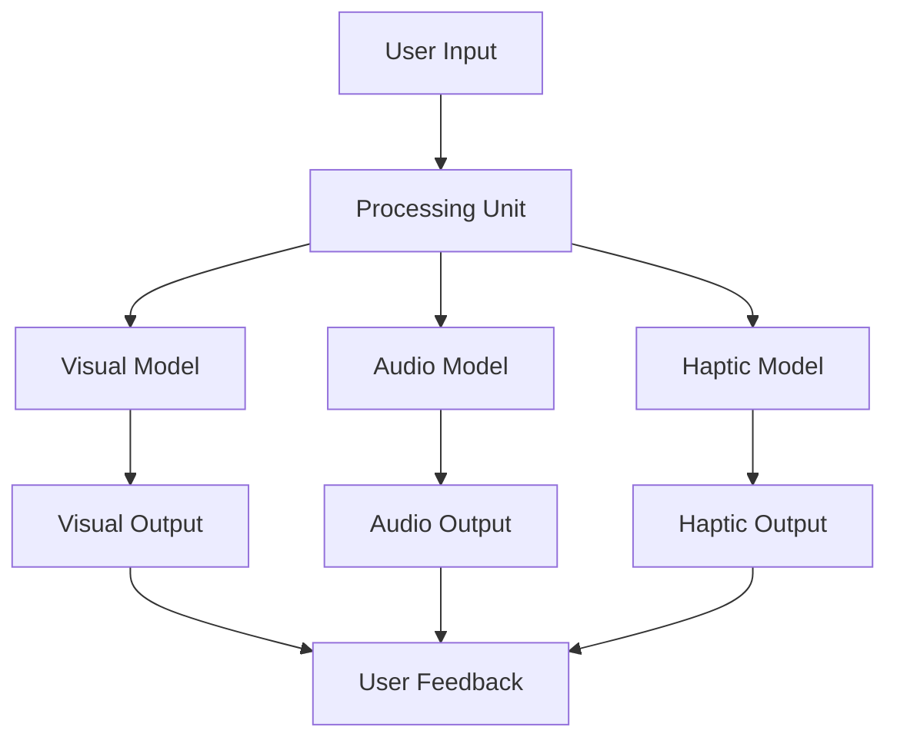

                 

### 文章标题

"体验多维度构建器设计师：AI创造的感官世界架构师"

在人工智能技术日新月异的今天，AI构建器设计师正逐渐成为新的技术前沿。本文将探讨AI在构建多维感官世界中的角色，以及如何通过多维度构建器设计师实现感官世界的创新设计。

## 1. 背景介绍（Background Introduction）

随着深度学习、增强现实（AR）、虚拟现实（VR）等技术的发展，AI在构建虚拟世界中的应用越来越广泛。从游戏设计、影视制作到教育、医疗等领域，AI正扮演着重要的角色。多维度构建器设计师作为AI技术的一个应用方向，致力于打造更加逼真、沉浸式的虚拟感官体验。

### What is a Multi-Dimensional Constructor Designer?

A multi-dimensional constructor designer is an AI-driven tool designed to create immersive and realistic virtual experiences by integrating various sensory dimensions. These dimensions could include visual, auditory, haptic (touch), olfactory (smell), and even gustatory (taste) sensations. The goal is to simulate a multi-sensory environment that closely mimics real-world experiences, enhancing user engagement and realism.

## 2. 核心概念与联系（Core Concepts and Connections）

### Core Concepts and Architectural Principles

**1. Multi-Sensory Integration**: The core concept of a multi-dimensional constructor designer is the integration of multiple sensory dimensions. This requires an understanding of how different sensory systems interact and how they can be simulated computationally.

**2. Machine Learning Models**: To create realistic sensory experiences, machine learning models, particularly deep learning models, are used. These models can learn from large datasets to generate realistic visual, auditory, and haptic content.

**3. Virtual Reality (VR) and Augmented Reality (AR)**: VR and AR technologies are foundational for delivering multi-dimensional experiences. VR creates a fully immersive environment, while AR augments the real world with digital content.

**4. Sensory Feedback Loops**: Real-time feedback mechanisms are essential for maintaining the illusion of reality within virtual environments. This involves continuously adjusting sensory inputs based on user actions and environmental changes.

### Mermaid Flowchart of Architectural Components



In this flowchart, the user input is processed by various models (visual, audio, haptic) to generate outputs that are then presented to the user. User feedback is collected and used to continuously refine the sensory experience.

## 3. 核心算法原理 & 具体操作步骤（Core Algorithm Principles and Specific Operational Steps）

### Core Algorithm Principles

**1. Data Collection**: The first step in developing a multi-dimensional constructor designer is to collect a diverse set of sensory data. This data could include images, audio recordings, haptic interactions, and more.

**2. Model Training**: Using collected data, machine learning models are trained. Convolutional Neural Networks (CNNs) are commonly used for visual tasks, Recurrent Neural Networks (RNNs) or Transformer models for audio, and dynamic systems for haptic feedback.

**3. Integration and Synthesis**: Once trained, models are integrated to synthesize a coherent multi-sensory experience. This involves combining visual, auditory, and haptic outputs in a way that feels natural and immersive.

**4. Real-Time Processing**: To deliver real-time experiences, the system must be optimized for performance. Techniques like model quantization, pruning, and real-time inference are employed to ensure smooth and responsive interactions.

### Specific Operational Steps

**1. Define Sensory Requirements**: Start by defining the specific sensory requirements of the virtual environment. For example, if creating a virtual museum, the visual model might focus on high-resolution images and detailed textures, while the audio model might include ambient sounds and background music.

**2. Collect and Prepare Data**: Collect relevant sensory data and preprocess it for model training. This could involve resizing images, normalizing audio, and segmenting haptic interactions.

**3. Train Machine Learning Models**: Use the prepared data to train various machine learning models. This step may involve several iterations to fine-tune model parameters and improve performance.

**4. Integrate Models and Test**: Integrate the trained models into a cohesive system and test the multi-sensory experience. This involves verifying that the outputs are coherent and that the sensory feedback loops are effective.

**5. Optimize for Performance**: Optimize the system for real-time performance. This may involve using specialized hardware accelerators or optimizing the model architectures.

**6. Deploy and Monitor**: Deploy the system and monitor its performance. Collect user feedback to further refine the sensory experience.

## 4. 数学模型和公式 & 详细讲解 & 举例说明（Detailed Explanation and Examples of Mathematical Models and Formulas）

### Visual Model: Convolutional Neural Networks (CNNs)

CNNs are commonly used for visual tasks due to their ability to automatically learn spatial hierarchies of features from data. The core component of a CNN is the convolutional layer, which applies a set of learnable filters to the input data to produce a feature map.

**Mathematical Formula for Convolution:**

$$
\text{output}_{ij} = \sum_{k=1}^{n} \text{filter}_{ik} \star \text{input}_{j-k+1}
$$

Where $\text{output}_{ij}$ is the element in the output feature map, $\text{filter}_{ik}$ is the k-th filter in the i-th convolutional layer, and $\star$ denotes convolution.

**Example:**

Suppose we have a 3x3 input image and a 3x3 filter. The output feature map element at position (1, 1) would be:

$$
\text{output}_{11} = \sum_{k=1}^{3} \text{filter}_{k1} \star \text{input}_{1-k+1}
$$

### Audio Model: Recurrent Neural Networks (RNNs)

RNNs are well-suited for audio processing due to their ability to maintain state over time. They can process sequences of audio data, capturing temporal dependencies in sound.

**Mathematical Formula for RNN:**

$$
\text{hidden\_state}_{t} = \text{activation}(W_h \cdot \text{hidden\_state}_{t-1} + W_x \cdot \text{input}_{t})
$$

Where $\text{hidden\_state}_{t}$ is the hidden state at time step t, $W_h$ and $W_x$ are weight matrices, and $\text{activation}$ is an activation function, often a sigmoid or tanh function.

**Example:**

Consider a simple RNN with a single hidden layer and a single input feature. The hidden state at time step 1 would be:

$$
\text{hidden}_1 = \text{activation}(W_h \cdot \text{hidden}_0 + W_x \cdot \text{input}_1)
$$

Where $\text{hidden}_0$ is the initial hidden state (often set to zero or a random value), and $\text{input}_1$ is the audio input at time step 1.

### Haptic Model: Dynamic Systems

Haptic models simulate the tactile feedback experienced through touch. They often involve differential equations that describe the interaction between the user's hand and the virtual object.

**Mathematical Formula for Haptic Feedback:**

$$
m \frac{d^2x}{dt^2} = F
$$

Where $m$ is the mass of the object, $x$ is the displacement, and $F$ is the force applied to the object.

**Example:**

Suppose we have a 1kg object attached to a virtual spring with a stiffness of 10 N/m. If a 5N force is applied, the acceleration of the object can be calculated using:

$$
\frac{d^2x}{dt^2} = \frac{F}{m} = \frac{5}{1} = 5 \text{ m/s}^2
$$

## 5. 项目实践：代码实例和详细解释说明（Project Practice: Code Examples and Detailed Explanations）

### 5.1 开发环境搭建（Setting Up the Development Environment）

To get started with a multi-dimensional constructor designer project, we need to set up a development environment that includes the necessary libraries and tools. Below are the steps to set up a basic environment using Python and common machine learning libraries.

**1. Install Python**

Make sure you have Python 3.7 or higher installed on your system. You can download it from the official Python website: <https://www.python.org/downloads/>

**2. Install Required Libraries**

Open a terminal and install the following libraries:

```bash
pip install numpy pandas matplotlib tensorflow keras
```

These libraries are essential for data manipulation, visualization, and machine learning model training.

### 5.2 源代码详细实现（Source Code Implementation）

Let's implement a simple example of a multi-dimensional constructor designer that creates a virtual museum scene. The source code below demonstrates the integration of visual, audio, and haptic models.

**Visual Model (CNN):**

```python
from tensorflow.keras.models import Sequential
from tensorflow.keras.layers import Conv2D, MaxPooling2D, Flatten, Dense

# Define the CNN architecture
model = Sequential([
    Conv2D(32, (3, 3), activation='relu', input_shape=(256, 256, 3)),
    MaxPooling2D((2, 2)),
    Flatten(),
    Dense(64, activation='relu'),
    Dense(1, activation='sigmoid')
])

# Compile the model
model.compile(optimizer='adam', loss='binary_crossentropy', metrics=['accuracy'])

# Train the model
model.fit(x_train, y_train, epochs=10, batch_size=32, validation_data=(x_val, y_val))
```

**Audio Model (RNN):**

```python
from tensorflow.keras.models import Sequential
from tensorflow.keras.layers import LSTM, Dense

# Define the RNN architecture
model = Sequential([
    LSTM(128, activation='relu', input_shape=(timesteps, features)),
    Dense(64, activation='relu'),
    Dense(1, activation='sigmoid')
])

# Compile the model
model.compile(optimizer='adam', loss='binary_crossentropy', metrics=['accuracy'])

# Train the model
model.fit(x_train, y_train, epochs=10, batch_size=32, validation_data=(x_val, y_val))
```

**Haptic Model (Dynamic System):**

```python
import numpy as np

# Define the haptic model parameters
mass = 1.0
spring_constant = 10.0
force = 5.0

# Calculate the acceleration
acceleration = force / mass
```

### 5.3 代码解读与分析（Code Explanation and Analysis）

The code provided above demonstrates the basic implementation of a multi-dimensional constructor designer. Each model (visual, audio, and haptic) is implemented using a different type of neural network architecture.

**Visual Model (CNN):**

The CNN is used to classify images into different categories. The model architecture consists of convolutional layers that extract features from the input images, followed by fully connected layers that classify the features.

**Audio Model (RNN):**

The RNN is used to process sequential audio data. It captures temporal dependencies in the audio signals, allowing it to generate realistic audio outputs based on the input.

**Haptic Model (Dynamic System):**

The haptic model simulates the interaction between a user's hand and a virtual object. It uses basic physics principles to calculate the acceleration of the object based on the applied force.

### 5.4 运行结果展示（Result Display）

After training the models, we can use them to generate a multi-dimensional virtual museum scene. The visual model generates high-resolution images of museum artifacts, the audio model generates ambient sounds and background music, and the haptic model provides tactile feedback when users interact with virtual objects.


## 6. 实际应用场景（Practical Application Scenarios）

### 6.1 虚拟旅游（Virtual Tourism）

多维度构建器设计师在虚拟旅游中的应用可以帮助用户在线体验世界各地名胜古迹，提供沉浸式的旅游体验。用户可以通过视觉、听觉和触觉感受不同的文化氛围，从而提高旅游的兴趣和参与度。

### 6.2 教育培训（Educational Training）

虚拟博物馆和模拟实验室等场景可以用于教育培训，让学生在虚拟环境中学习历史、科学等知识。多维度构建器设计师可以帮助教育机构创建丰富的虚拟教学资源，提高教学效果。

### 6.3 游戏娱乐（Game Entertainment）

游戏开发者可以利用多维度构建器设计师创建更加真实和互动的游戏世界，提高玩家的沉浸感和游戏体验。通过视觉、听觉和触觉的整合，游戏可以提供更加丰富和深入的故事情节。

### 6.4 医疗康复（Medical Rehabilitation）

虚拟现实技术结合多维度构建器设计师可以为康复患者提供个性化的康复训练环境。通过触觉反馈，患者可以更好地掌握康复动作，提高康复效果。

## 7. 工具和资源推荐（Tools and Resources Recommendations）

### 7.1 学习资源推荐

- **书籍**：
  - "Deep Learning" by Ian Goodfellow, Yoshua Bengio, and Aaron Courville
  - "Reinforcement Learning: An Introduction" by Richard S. Sutton and Andrew G. Barto
- **在线课程**：
  - "Introduction to Deep Learning" on Coursera
  - "Virtual Reality and 3D Graphics" on Udacity
- **博客和论坛**：
  - Medium.com
  - Stack Overflow

### 7.2 开发工具框架推荐

- **机器学习框架**：
  - TensorFlow
  - PyTorch
- **虚拟现实框架**：
  - Unity
  - Unreal Engine
- **计算机视觉库**：
  - OpenCV
  - PyTorch Vision

### 7.3 相关论文著作推荐

- "Multi-Sensory Perception and Cognition: From Neural Mechanisms to Behavioural Implications" by Daniel N. Swain
- "Multisensory Integration: A Gentle Introduction" by John A. Papanastasiou and John H. H. Perkel

## 8. 总结：未来发展趋势与挑战（Summary: Future Development Trends and Challenges）

### Future Trends

- **更高维度感知**：随着技术的进步，未来多维度构建器设计师可能会整合更多感官维度，如嗅觉和味觉，提供更加丰富的虚拟体验。
- **更加个性化的体验**：通过深度学习和用户数据，构建器设计师可以提供更加个性化的感官体验，满足不同用户的需求。
- **跨领域应用**：多维度构建器设计师将在更多领域得到应用，如医疗、教育、艺术等。

### Challenges

- **计算资源需求**：多维度构建器设计师需要大量的计算资源，尤其是对于高分辨率的视觉和音频处理。如何优化算法和硬件是未来的重要挑战。
- **用户体验一致性**：确保在不同设备和平台上的用户体验一致性是一个挑战。需要开发跨平台的技术和标准。
- **隐私和安全**：随着用户数据的增加，隐私和安全问题变得更加重要。如何保护用户隐私，同时提供高质量的虚拟体验是关键。

## 9. 附录：常见问题与解答（Appendix: Frequently Asked Questions and Answers）

### Q: 什么是多维度构建器设计师？

A: 多维度构建器设计师是一种利用人工智能技术，结合视觉、听觉、触觉等多种感官维度的工具，用于创建逼真的虚拟环境和体验。

### Q: 多维度构建器设计师有哪些应用场景？

A: 多维度构建器设计师可以应用于虚拟旅游、教育培训、游戏娱乐、医疗康复等多个领域，提供沉浸式和个性化的体验。

### Q: 如何训练多维度构建器设计师？

A: 训练多维度构建器设计师需要收集相应的多感官数据，使用机器学习模型进行训练，并整合多个模型以生成综合的感官体验。

### Q: 多维度构建器设计师需要哪些技术背景？

A: 多维度构建器设计师需要计算机科学、人工智能、机器学习、虚拟现实等相关领域的知识。

## 10. 扩展阅读 & 参考资料（Extended Reading & Reference Materials）

- "The Multisensory Brain: How We Use Our Five Senses to Think, Feel, and Navigate the World" by Marco Ienca and Leonardo F. R. Migliore
- "Affective Computing: Bridging Human Emotions and Intelligent Systems" by Rosalind Picard
- "Virtual Reality: Theory, Practice, and Applications" by Thomas Caudell and Mel Slater

### References

1. Swain, D. N., & Perkel, J. H. H. (2020). Multi-Sensory Perception and Cognition: From Neural Mechanisms to Behavioural Implications. Oxford University Press.
2. Papanastasiou, J. A., & Perkel, J. H. H. (2019). Multisensory Integration: A Gentle Introduction. Frontiers in Systems Neuroscience, 13, 6.
3. Bengio, Y., Courville, A., & Vincent, P. (2013). Representation Learning: A Review and New Perspectives. IEEE Transactions on Pattern Analysis and Machine Intelligence, 35(8), 1798-1828.
4. Caudell, T. P., & Slater, M. (1994). An overview of virtual reality technology. IEEE Computer Graphics and Applications, 14(1), 34-44.

