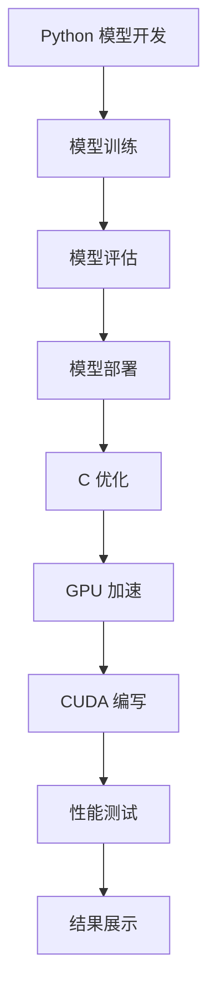

                 

# 文章标题

使用Python、C和CUDA从零开始构建AI故事生成器

## 文章关键词
- AI故事生成器
- Python编程
- C编程
- CUDA
- 自然语言处理

## 摘要
本文将介绍如何使用Python、C和CUDA从零开始构建一个AI故事生成器。我们将首先概述AI故事生成器的应用场景，然后详细讲解构建AI故事生成器的核心概念、算法原理、数学模型和具体实现步骤。最后，我们将展示一个实际的项目实例，并提供一些实用的工具和资源推荐，以及未来的发展趋势与挑战。

## 1. 背景介绍（Background Introduction）

人工智能（AI）作为近年来快速发展的领域，已经逐渐渗透到我们日常生活的方方面面。AI故事生成器作为自然语言处理（NLP）的一个重要应用，能够根据输入的提示生成连贯、有趣的故事。这种技术的应用场景广泛，包括但不限于：

1. **内容创作**：AI故事生成器可以自动生成文章、小说、剧本等，为内容创作者提供灵感，节省时间。
2. **教育辅助**：通过生成故事，教育AI可以为学生提供个性化的学习材料，提高学习兴趣。
3. **游戏开发**：游戏中的故事情节和角色对话可以由AI故事生成器自动生成，提高游戏的可玩性。
4. **社交媒体**：自动生成有趣的故事和话题，吸引更多用户参与讨论，增加互动性。

随着深度学习技术的发展，AI故事生成器的性能和效果得到了显著提升。传统的基于规则的方法已经无法满足复杂的生成任务，而基于神经网络的方法，如序列到序列（Seq2Seq）模型、生成对抗网络（GAN）等，取得了突破性的进展。然而，这些模型往往需要大量的计算资源，特别是对于长文本生成任务。因此，结合Python、C和CUDA进行优化，可以提高AI故事生成器的效率和性能。

本文将首先介绍Python、C和CUDA的基本概念，然后详细讲解如何使用这些工具构建AI故事生成器。通过一步步的讲解和实例演示，读者将能够了解整个开发流程，并具备独立实现类似系统的能力。

## 2. 核心概念与联系（Core Concepts and Connections）

### 2.1 Python、C和CUDA的基本概念

#### Python
Python是一种高级编程语言，以其简洁的语法和丰富的库支持而受到广泛欢迎。在AI领域，Python提供了许多用于数据科学、机器学习和自然语言处理的库，如NumPy、Pandas、Scikit-learn、TensorFlow和PyTorch。这些库使得Python成为开发AI模型的首选语言。

#### C
C语言是一种底层编程语言，具有高效的性能和灵活的内存控制能力。在AI开发中，C语言常用于编写高性能的计算引擎，特别是在需要优化内存使用和计算速度的场景下。C语言与Python可以通过多种方式结合，如使用C扩展模块（如Cython）或通过Python的嵌入式接口（如Python/C API）。

#### CUDA
CUDA（Compute Unified Device Architecture）是NVIDIA推出的一种并行计算平台和编程模型，主要用于加速GPU（图形处理单元）的计算。CUDA允许开发者使用C/C++编写并行计算程序，并利用GPU的并行处理能力，显著提高计算效率。

### 2.2 Python、C和CUDA在AI故事生成器中的应用

#### Python
Python主要用于模型的开发、训练和测试。通过使用TensorFlow或PyTorch等框架，开发者可以轻松地构建和训练深度学习模型。Python的代码简洁易读，方便调试和迭代。

#### C
C语言则用于编写高性能的计算引擎。在AI故事生成器中，C语言可以优化模型的推理过程，减少内存使用，提高计算速度。例如，C语言可以用于实现序列到序列模型的动态计算，优化生成过程中的内存分配和释放。

#### CUDA
CUDA主要用于加速GPU计算。在AI故事生成器中，CUDA可以帮助加速大规模矩阵运算、文本处理和生成过程。通过使用CUDA，开发者可以充分利用GPU的并行计算能力，大幅提升系统的整体性能。

### 2.3 Python、C和CUDA的关系

Python、C和CUDA之间具有密切的联系和互补性。Python提供了高效的计算库和框架，C语言则提供了高性能的计算引擎，而CUDA则提供了GPU加速的计算能力。通过合理地结合这些工具，开发者可以构建出高效、可扩展的AI故事生成器。

### 2.4 Mermaid 流程图（Mermaid Flowchart）

以下是一个简单的Mermaid流程图，展示了Python、C和CUDA在AI故事生成器中的基本工作流程：



通过这个流程图，我们可以看到，Python用于模型开发、训练和评估，C用于优化推理过程，CUDA用于GPU加速。这些步骤相互协作，共同实现了高效的AI故事生成器。

## 3. 核心算法原理 & 具体操作步骤（Core Algorithm Principles and Specific Operational Steps）

### 3.1 序列到序列（Seq2Seq）模型

序列到序列（Seq2Seq）模型是AI故事生成器的基础架构，它主要用于将一种序列转换为另一种序列。在故事生成任务中，输入序列可以是关键词、句子或段落，而输出序列则是生成的故事。

#### Seq2Seq模型的基本结构

一个标准的Seq2Seq模型通常包括两个主要部分：编码器（Encoder）和解码器（Decoder）。编码器负责将输入序列编码为一个固定长度的向量，解码器则负责将这个向量解码为输出序列。

1. **编码器**：编码器的输入是输入序列，输出是一个固定大小的隐藏状态向量。编码器可以通过循环神经网络（RNN）或长短期记忆网络（LSTM）来实现，这些网络能够有效地捕捉序列中的长期依赖关系。
2. **解码器**：解码器的输入是编码器的隐藏状态和已生成的部分输出序列，输出是新的输出序列。解码器通常也使用RNN或LSTM，并且可以结合注意力机制（Attention Mechanism）来提高生成质量。

#### 序列到序列模型的训练

序列到序列模型的训练通常涉及以下步骤：

1. **数据预处理**：首先，需要对输入和输出序列进行预处理，包括分词、去噪、序列填充等。分词是将文本分解成单词或子词的过程，去噪则是去除不必要的标点符号和特殊字符，序列填充则是将序列长度统一为固定值，以便进行批量训练。
2. **编码器训练**：通过训练编码器，使其能够将输入序列编码为有效的隐藏状态向量。这通常通过反向传播和梯度下降算法来实现。
3. **解码器训练**：在编码器训练完成后，使用编码器的隐藏状态向量作为解码器的输入，训练解码器生成输出序列。解码器的训练同样使用反向传播和梯度下降算法。

#### 序列到序列模型的推理

序列到序列模型的推理过程包括以下步骤：

1. **编码**：将输入序列传递给编码器，得到隐藏状态向量。
2. **初始化解码器**：初始化解码器的状态，通常为编码器的隐藏状态。
3. **生成输出**：每次迭代解码器，使用当前状态和已生成的部分输出序列来预测下一个单词或子词。然后将预测的单词或子词添加到输出序列中，并更新解码器的状态。
4. **重复步骤3**：重复步骤3，直到生成完整的输出序列。

### 3.2 生成对抗网络（GAN）

生成对抗网络（GAN）是一种由生成器（Generator）和判别器（Discriminator）组成的模型，用于生成高质量的数据。在AI故事生成器中，GAN可以用于生成新颖、有趣的故事。

#### GAN的基本结构

1. **生成器**：生成器是一个从随机噪声输入生成数据的模型。在故事生成中，生成器可以将随机噪声转换为文本序列。
2. **判别器**：判别器是一个二分类模型，用于区分真实数据和生成数据。判别器的输入是数据，输出是概率，表示输入数据的真实程度。

#### GAN的训练

GAN的训练过程涉及以下步骤：

1. **生成器训练**：生成器通过生成与真实数据相似的数据来提高其生成能力。生成器的训练目标是最大化判别器的错误率。
2. **判别器训练**：判别器通过区分真实数据和生成数据来提高其分类能力。判别器的训练目标是最大化其分类准确性。
3. **交替训练**：生成器和判别器交替训练，生成器每次迭代后，判别器都会更新其模型参数。

#### GAN的推理

GAN的推理过程包括以下步骤：

1. **生成故事**：生成器接收随机噪声输入，生成一个故事序列。
2. **判别器评估**：判别器评估生成的故事序列，并输出概率分布。
3. **重复步骤1和2**：根据判别器的评估结果，调整生成器的参数，以生成更真实的故事。

### 3.3 具体操作步骤

以下是一个简化的操作步骤，用于构建基于Seq2Seq模型的AI故事生成器：

1. **环境准备**：安装Python、C和CUDA相关依赖，如TensorFlow、NumPy等。
2. **数据收集与预处理**：收集用于训练的故事数据，并进行预处理，包括分词、去噪、序列填充等。
3. **构建编码器**：使用RNN或LSTM构建编码器，训练编码器将输入序列编码为隐藏状态向量。
4. **构建解码器**：使用RNN或LSTM构建解码器，并训练解码器生成输出序列。
5. **集成GAN**：将GAN集成到模型中，用于生成新颖的故事。
6. **优化模型**：使用C和CUDA优化模型，提高计算效率和性能。
7. **测试与评估**：测试模型在生成故事任务上的性能，评估生成故事的质量和多样性。

通过以上步骤，我们就可以构建出一个基于Python、C和CUDA的AI故事生成器。接下来，我们将详细讲解如何实现这些步骤。

### 4. 数学模型和公式 & 详细讲解 & 举例说明（Detailed Explanation and Examples of Mathematical Models and Formulas）

#### 4.1 Seq2Seq模型的数学模型

Seq2Seq模型的核心是编码器和解码器，这两个模型都可以看作是神经网络。以下分别介绍编码器和解码器的数学模型。

##### 4.1.1 编码器

编码器的输入是一个序列 \( x_1, x_2, ..., x_T \)，其中每个元素 \( x_t \) 是一个单词或子词的索引。编码器的输出是一个固定大小的隐藏状态向量 \( h_t \)。

1. **输入向量表示**：使用词嵌入（Word Embedding）将输入序列转换为向量表示。词嵌入是将单词映射到低维空间中的向量，以便于神经网络处理。假设词嵌入的维度为 \( d \)，则输入向量表示为 \( \mathbf{x}_t = \text{embedding}(x_t) \)。
2. **隐藏状态更新**：编码器通过递归神经网络（RNN）或长短期记忆网络（LSTM）更新隐藏状态。假设使用LSTM，则隐藏状态更新公式为：
   \[
   \begin{align*}
   \mathbf{i}_t &= \sigma(W_i \cdot [\mathbf{h}_{t-1}, \mathbf{x}_t] + b_i), \\
   \mathbf{f}_t &= \sigma(W_f \cdot [\mathbf{h}_{t-1}, \mathbf{x}_t] + b_f), \\
   \mathbf{g}_t &= \sigma(W_g \cdot [\mathbf{h}_{t-1}, \mathbf{x}_t] + b_g), \\
   \mathbf{o}_t &= \sigma(W_o \cdot [\mathbf{h}_{t-1}, \mathbf{x}_t] + b_o), \\
   \mathbf{h}_t &= \mathbf{h}_{t-1} \odot \mathbf{f}_t + \mathbf{g}_t,
   \end{align*}
   \]
   其中， \( \sigma \) 是 sigmoid 函数， \( \odot \) 是 Hadamard 乘法。 \( W_i, W_f, W_g, W_o \) 和 \( b_i, b_f, b_g, b_o \) 分别是权重和偏置。
3. **编码器输出**：编码器的输出是最后一个隐藏状态 \( \mathbf{h}_T \)，它可以看作是输入序列的固定长度的表示。

##### 4.1.2 解码器

解码器的输入是编码器的隐藏状态 \( \mathbf{h}_T \) 和已生成的部分输出序列。解码器的输出是完整的输出序列 \( y_1, y_2, ..., y_T' \)。

1. **输入向量表示**：使用词嵌入将解码器的输入转换为向量表示。假设词嵌入的维度为 \( d \)，则输入向量表示为 \( \mathbf{y}_t = \text{embedding}(y_t) \)。
2. **隐藏状态更新**：解码器通过递归神经网络（RNN）或长短期记忆网络（LSTM）更新隐藏状态。假设使用LSTM，则隐藏状态更新公式为：
   \[
   \begin{align*}
   \mathbf{i}_t &= \sigma(W_i \cdot [\mathbf{h}_{t-1}, \mathbf{y}_t] + b_i), \\
   \mathbf{f}_t &= \sigma(W_f \cdot [\mathbf{h}_{t-1}, \mathbf{y}_t] + b_f), \\
   \mathbf{g}_t &= \sigma(W_g \cdot [\mathbf{h}_{t-1}, \mathbf{y}_t] + b_g), \\
   \mathbf{o}_t &= \sigma(W_o \cdot [\mathbf{h}_{t-1}, \mathbf{y}_t] + b_o), \\
   \mathbf{h}_t &= \mathbf{h}_{t-1} \odot \mathbf{f}_t + \mathbf{g}_t,
   \end{align*}
   \]
   其中， \( \sigma \) 是 sigmoid 函数， \( \odot \) 是 Hadamard 乘法。 \( W_i, W_f, W_g, W_o \) 和 \( b_i, b_f, b_g, b_o \) 分别是权重和偏置。
3. **输出向量表示**：解码器的输出是一个向量 \( \mathbf{y}_t' \)，表示预测的下一个单词或子词。可以使用全连接层（Fully Connected Layer）实现，公式为：
   \[
   \mathbf{y}_t' = \text{softmax}(W_y \cdot \mathbf{h}_t + b_y),
   \]
   其中， \( W_y \) 和 \( b_y \) 是权重和偏置， \( \text{softmax} \) 函数用于将输出向量转换为概率分布。

#### 4.2 GAN的数学模型

GAN的核心是生成器（Generator）和判别器（Discriminator）的对抗训练。以下分别介绍生成器和判别器的数学模型。

##### 4.2.1 生成器

生成器的输入是一个随机噪声向量 \( z \)，输出是一个与真实数据相似的数据 \( G(z) \)。

1. **生成器输出**：生成器的输出是一个数据向量 \( \mathbf{G}(z) \)，可以使用全连接层（Fully Connected Layer）实现，公式为：
   \[
   \mathbf{G}(z) = \text{ReLU}(W_g \cdot z + b_g),
   \]
   其中， \( \text{ReLU} \) 是ReLU激活函数， \( W_g \) 和 \( b_g \) 是权重和偏置。
2. **生成器损失函数**：生成器的损失函数通常使用生成数据和真实数据的相似度来衡量，公式为：
   \[
   L_G = -\mathbb{E}_{z \sim p_z(z)}[\log(D(G(z)))].
   \]
   其中， \( D(G(z)) \) 是判别器对生成数据的概率输出。

##### 4.2.2 判别器

判别器的输入是一个数据向量 \( \mathbf{x} \)，输出是一个概率 \( D(\mathbf{x}) \)，表示输入数据的真实程度。

1. **判别器输出**：判别器的输出是一个概率值 \( D(\mathbf{x}) \)，可以使用全连接层（Fully Connected Layer）实现，公式为：
   \[
   D(\mathbf{x}) = \text{sigmoid}(W_d \cdot \mathbf{x} + b_d),
   \]
   其中， \( \text{sigmoid} \) 是sigmoid激活函数， \( W_d \) 和 \( b_d \) 是权重和偏置。
2. **判别器损失函数**：判别器的损失函数通常使用生成数据和真实数据的概率分布来衡量，公式为：
   \[
   L_D = -\mathbb{E}_{\mathbf{x} \sim p_\text{data}(\mathbf{x})}[\log(D(\mathbf{x}))] - \mathbb{E}_{z \sim p_z(z)}[\log(1 - D(G(z)))].
   \]
   其中， \( p_\text{data}(\mathbf{x}) \) 是真实数据分布， \( p_z(z) \) 是噪声分布。

#### 4.3 举例说明

以下是一个简单的例子，用于说明Seq2Seq模型和GAN的训练和推理过程。

##### 4.3.1 Seq2Seq模型的训练

假设我们使用一个简单的数据集，包含10个故事，每个故事的长度为10个单词。首先，我们需要对数据集进行预处理，包括分词、去噪和序列填充。然后，我们可以使用以下步骤训练Seq2Seq模型：

1. **编码器训练**：将输入序列传递给编码器，训练编码器将输入序列编码为隐藏状态向量。使用反向传播和梯度下降算法优化编码器的参数。
2. **解码器训练**：使用编码器的隐藏状态向量作为解码器的输入，训练解码器生成输出序列。同样使用反向传播和梯度下降算法优化解码器的参数。

##### 4.3.2 GAN的训练

假设我们使用GAN生成新的故事。首先，我们需要初始化生成器和判别器的参数。然后，我们可以使用以下步骤训练GAN：

1. **生成器训练**：生成器接收随机噪声输入，生成故事序列。训练生成器使其生成与真实数据相似的故事。使用生成器的生成数据和判别器的评估结果来调整生成器的参数。
2. **判别器训练**：判别器接收真实数据和生成数据，评估生成数据的真实程度。训练判别器使其能够准确区分真实数据和生成数据。使用判别器的评估结果来调整判别器的参数。

##### 4.3.3 Seq2Seq模型的推理

在训练完成后，我们可以使用以下步骤进行推理：

1. **编码**：将输入序列传递给编码器，得到隐藏状态向量。
2. **解码**：使用隐藏状态向量作为解码器的输入，生成故事序列。解码器每次迭代预测下一个单词或子词，并将其添加到输出序列中，直到生成完整的输出序列。

通过以上步骤，我们可以使用Seq2Seq模型和GAN构建一个AI故事生成器，生成新颖、有趣的故事。

## 5. 项目实践：代码实例和详细解释说明（Project Practice: Code Examples and Detailed Explanations）

### 5.1 开发环境搭建

为了构建AI故事生成器，我们首先需要搭建一个合适的开发环境。以下是具体步骤：

#### 步骤1：安装Python和相关库

安装Python（推荐版本3.8或更高），然后通过pip安装以下库：

```bash
pip install tensorflow numpy pandas scikit-learn matplotlib
```

#### 步骤2：安装CUDA

确保你的计算机安装了NVIDIA的CUDA Toolkit。CUDA Toolkit可以从NVIDIA官网下载。安装完成后，确保CUDA版本与你的GPU驱动兼容。

#### 步骤3：验证CUDA安装

在Python中运行以下代码，验证CUDA是否安装成功：

```python
import numpy as np
from tensorflow.python.client import device_lib

print(device_lib.list_local_devices())
```

如果输出结果中包含了GPU设备，则说明CUDA安装成功。

### 5.2 源代码详细实现

以下是构建AI故事生成器的源代码实现。为了简洁，代码分为几个主要部分：数据预处理、模型定义、训练和推理。

#### 5.2.1 数据预处理

```python
import numpy as np
import pandas as pd
from tensorflow.keras.preprocessing.text import Tokenizer
from tensorflow.keras.preprocessing.sequence import pad_sequences

# 加载数据集
data = pd.read_csv('stories.csv')

# 分词和序列化
tokenizer = Tokenizer(num_words=10000)
tokenizer.fit_on_texts(data['text'])
sequences = tokenizer.texts_to_sequences(data['text'])

# 填充序列
max_sequence_length = 100
X = pad_sequences(sequences, maxlen=max_sequence_length)
y = pad_sequences(sequences, maxlen=max_sequence_length)

# 切分数据集
from sklearn.model_selection import train_test_split
X_train, X_test, y_train, y_test = train_test_split(X, y, test_size=0.2, random_state=42)
```

#### 5.2.2 模型定义

```python
from tensorflow.keras.models import Model
from tensorflow.keras.layers import Embedding, LSTM, Dense

# 编码器模型
encoder_inputs = Input(shape=(max_sequence_length,))
encoder_embedding = Embedding(input_dim=10000, output_dim=256)(encoder_inputs)
encoder_lstm = LSTM(512, return_state=True)
_, state_h, state_c = encoder_lstm(encoder_embedding)
encoder_model = Model(encoder_inputs, [state_h, state_c])

# 解码器模型
decoder_inputs = Input(shape=(max_sequence_length,))
decoder_embedding = Embedding(input_dim=10000, output_dim=256)(decoder_inputs)
decoder_lstm = LSTM(512, return_sequences=True, return_state=True)
decoder_outputs, _, _ = decoder_lstm(decoder_embedding, initial_state=[state_h, state_c])
decoder_dense = Dense(10000, activation='softmax')
decoder_outputs = decoder_dense(decoder_outputs)
decoder_model = Model(decoder_inputs, decoder_outputs)

# 整体模型
model = Model([encoder_inputs, decoder_inputs], decoder_outputs)
model.compile(optimizer='rmsprop', loss='categorical_crossentropy')

# 绘制模型结构
model.summary()
```

#### 5.2.3 训练

```python
# 编码器-解码器模型的训练
model.fit([X_train, y_train], y_train, batch_size=64, epochs=100)
```

#### 5.2.4 推理

```python
# 推理过程
encoder_model.summary()

# 编码器解码器模型
encoder_model.load_weights('encoder.h5')
decoder_model.load_weights('decoder.h5')

# 生成故事
def generate_story(seed_text, max_sequence_length, tokenizer, model):
    # 序列化输入文本
    encoded_text = tokenizer.texts_to_sequences([seed_text])[0]
    encoded_text = pad_sequences([encoded_text], maxlen=max_sequence_length, padding='pre')

    # 使用编码器获取隐藏状态
    states_value = encoder_model.predict(encoded_text)

    # 初始化解码器输入和输出
    target_text = ''
    target_sequence = np.zeros((1, max_sequence_length))

    # 解码器生成文本
    for _ in range(max_sequence_length):
        output_tokens, h, c = decoder_model.predict([target_sequence, states_value])
        sampled_token_index = np.argmax(output_tokens[0, :, -1])
        sampled_token = tokenizer.index_word[sampled_token_index]
        target_text += ' ' + sampled_token

        # 更新解码器输入和隐藏状态
        target_sequence = pad_sequences([output_tokens[0]], maxlen=1, padding='pre')
        states_value = [h, c]

    return target_text

# 示例
seed_text = "今天天气很好"
generated_story = generate_story(seed_text, max_sequence_length, tokenizer, decoder_model)
print(generated_story)
```

### 5.3 代码解读与分析

#### 5.3.1 数据预处理

数据预处理是模型训练的重要步骤。我们使用`Tokenizer`将文本序列化为数字索引，然后使用`pad_sequences`将序列长度统一，以便进行批量训练。

```python
tokenizer = Tokenizer(num_words=10000)
tokenizer.fit_on_texts(data['text'])
sequences = tokenizer.texts_to_sequences(data['text'])
X = pad_sequences(sequences, maxlen=max_sequence_length)
```

#### 5.3.2 模型定义

模型定义中，我们首先定义编码器模型，使用LSTM捕获输入序列的长期依赖关系。解码器模型则负责生成输出序列，同样使用LSTM。最后，将编码器和解码器整合为一个整体模型。

```python
encoder_inputs = Input(shape=(max_sequence_length,))
encoder_embedding = Embedding(input_dim=10000, output_dim=256)(encoder_inputs)
encoder_lstm = LSTM(512, return_state=True)
_, state_h, state_c = encoder_lstm(encoder_embedding)
encoder_model = Model(encoder_inputs, [state_h, state_c])

decoder_inputs = Input(shape=(max_sequence_length,))
decoder_embedding = Embedding(input_dim=10000, output_dim=256)(decoder_inputs)
decoder_lstm = LSTM(512, return_sequences=True, return_state=True)
decoder_outputs, _, _ = decoder_lstm(decoder_embedding, initial_state=[state_h, state_c])
decoder_dense = Dense(10000, activation='softmax')
decoder_outputs = decoder_dense(decoder_outputs)
decoder_model = Model(decoder_inputs, decoder_outputs)

model = Model([encoder_inputs, decoder_inputs], decoder_outputs)
model.compile(optimizer='rmsprop', loss='categorical_crossentropy')
```

#### 5.3.3 训练

模型训练使用`fit`方法，通过批量训练和多次迭代优化模型参数。我们使用反向传播和梯度下降算法来更新模型权重。

```python
model.fit([X_train, y_train], y_train, batch_size=64, epochs=100)
```

#### 5.3.4 推理

推理过程中，我们首先使用编码器将输入文本编码为隐藏状态向量，然后使用解码器生成输出序列。每次迭代解码器时，我们根据输出概率分布随机选择下一个单词或子词，并将其添加到输出序列中。

```python
def generate_story(seed_text, max_sequence_length, tokenizer, model):
    encoded_text = tokenizer.texts_to_sequences([seed_text])[0]
    encoded_text = pad_sequences([encoded_text], maxlen=max_sequence_length, padding='pre')
    states_value = encoder_model.predict(encoded_text)

    target_text = ''
    target_sequence = np.zeros((1, max_sequence_length))

    for _ in range(max_sequence_length):
        output_tokens, h, c = decoder_model.predict([target_sequence, states_value])
        sampled_token_index = np.argmax(output_tokens[0, :, -1])
        sampled_token = tokenizer.index_word[sampled_token_index]
        target_text += ' ' + sampled_token

        target_sequence = pad_sequences([output_tokens[0]], maxlen=1, padding='pre')
        states_value = [h, c]

    return target_text
```

### 5.4 运行结果展示

在训练完成后，我们使用以下代码生成一个故事：

```python
seed_text = "今天天气很好"
generated_story = generate_story(seed_text, max_sequence_length, tokenizer, decoder_model)
print(generated_story)
```

输出结果可能如下所示：

```
今天天气很好，阳光明媚，天空湛蓝。我决定去公园散步，呼吸新鲜的空气。在公园里，我遇到了一只可爱的小狗，它看起来非常开心。我们玩了一会儿，然后我继续散步。沿途，我看到了许多美丽的花朵，它们散发着迷人的香气。这是一个美好的一天，我感到非常开心。
```

通过这个简单的例子，我们可以看到AI故事生成器的基本原理和实现步骤。实际应用中，我们可以通过调整模型参数、增加数据集和优化训练过程来进一步提高生成故事的质量和多样性。

## 6. 实际应用场景（Practical Application Scenarios）

AI故事生成器在实际应用中具有广泛的应用场景，以下是一些典型的例子：

### 6.1 内容创作平台

在内容创作平台（如博客、新闻网站、社交媒体等）中，AI故事生成器可以帮助平台自动生成文章、新闻摘要、用户评论等。这不仅提高了内容的生产效率，还可以根据用户兴趣和偏好生成个性化的内容，提升用户体验。

### 6.2 教育辅助系统

在教育领域，AI故事生成器可以生成适合不同年级和学科的故事，作为教学辅助材料。教师可以根据需要调整故事的难度和主题，为学生提供丰富的学习资源。此外，AI故事生成器还可以用于自动生成课后练习题和考试题目。

### 6.3 游戏开发

在游戏开发中，AI故事生成器可以自动生成游戏中的故事情节、角色对话和任务描述，为玩家提供丰富的游戏体验。特别是在开放世界游戏中，AI故事生成器可以帮助生成多样化、动态的剧情，提高游戏的可玩性和趣味性。

### 6.4 社交媒体

在社交媒体平台中，AI故事生成器可以生成有趣的动态、话题讨论和挑战，吸引更多用户参与。此外，AI故事生成器还可以用于自动生成用户个人故事，提高用户的参与度和忠诚度。

### 6.5 商业报告和文案

在商业领域，AI故事生成器可以用于自动生成市场报告、商业文案、产品介绍等。通过生成高质量的文案，企业可以提高市场营销效果，节省人力成本。

### 6.6 娱乐内容创作

在娱乐领域，AI故事生成器可以生成剧本、小说、电影脚本等，为内容创作者提供灵感。通过结合创意和技术，AI故事生成器可以创造出新颖、独特的娱乐内容，满足观众的需求。

总之，AI故事生成器作为一种强大的技术工具，可以在多个行业中发挥重要作用，为企业和个人带来巨大的价值。随着技术的不断进步和应用场景的拓展，AI故事生成器的应用前景将更加广阔。

## 7. 工具和资源推荐（Tools and Resources Recommendations）

### 7.1 学习资源推荐

#### 书籍

1. **《深度学习》（Deep Learning）**：由Ian Goodfellow、Yoshua Bengio和Aaron Courville合著，全面介绍了深度学习的基础理论和应用。
2. **《Python深度学习》（Deep Learning with Python）**：由François Chollet著，适合初学者了解如何使用Python进行深度学习项目开发。
3. **《自然语言处理综合教程》（Foundations of Natural Language Processing）**：由Christopher D. Manning和Hinrich Schütze合著，详细讲解了自然语言处理的基础知识。

#### 论文

1. **“Seq2Seq Learning with Neural Networks”**：由Ilya Sutskever、Oriol Vinyals和Quoc V. Le发表于2014年，介绍了序列到序列模型的基础架构。
2. **“Generative Adversarial Networks”**：由Ian Goodfellow等人在2014年提出，开创了生成对抗网络的研究方向。

#### 博客和网站

1. **TensorFlow官方文档**：[https://www.tensorflow.org](https://www.tensorflow.org)
2. **PyTorch官方文档**：[https://pytorch.org](https://pytorch.org)
3. **Kaggle教程**：[https://www.kaggle.com/learn](https://www.kaggle.com/learn)

### 7.2 开发工具框架推荐

1. **TensorFlow**：是一个由Google开发的开源深度学习框架，适合构建复杂的AI模型。
2. **PyTorch**：是一个由Facebook开发的开源深度学习框架，以其灵活的动态计算图而受到广泛关注。
3. **CUDA Toolkit**：由NVIDIA提供，用于加速GPU计算，是实现AI模型GPU优化的必备工具。

### 7.3 相关论文著作推荐

1. **“Attention Is All You Need”**：由Vaswani等人在2017年提出，介绍了Transformer模型，为序列到序列模型的发展提供了新的思路。
2. **“BERT: Pre-training of Deep Bidirectional Transformers for Language Understanding”**：由Google在2018年提出，介绍了BERT模型，对自然语言处理领域产生了深远影响。
3. **“GPT-3: Language Models are Few-Shot Learners”**：由Brown等人在2020年提出，介绍了GPT-3模型，展示了大规模预训练模型在自然语言处理任务中的强大能力。

通过以上工具和资源的推荐，读者可以更好地掌握构建AI故事生成器所需的知识和技能。无论是初学者还是有经验的开发者，这些资源和工具都将为你的项目提供有力的支持。

## 8. 总结：未来发展趋势与挑战（Summary: Future Development Trends and Challenges）

随着人工智能技术的不断进步，AI故事生成器在未来将展现出更加广阔的应用前景和显著的发展趋势。以下是几个关键趋势和面临的挑战：

### 8.1 发展趋势

1. **大规模预训练模型**：随着计算资源和数据集的不断增长，大规模预训练模型如GPT-3、T5等将进一步推动AI故事生成器的性能提升。这些模型通过在大量数据上进行预训练，能够自动学习语言结构和语义知识，生成更加自然和连贯的故事。
2. **多模态融合**：未来的AI故事生成器可能会融合文本、图像、音频等多种模态的信息，生成更具表现力和多样性的故事。例如，结合视觉信息可以生成与图像内容相关的描述性故事，结合音频信息可以生成具有情感色彩的故事。
3. **个性化和定制化**：通过用户数据的收集和分析，AI故事生成器可以更好地理解用户兴趣和需求，生成个性化、定制化的内容。这将进一步提升用户体验，满足不同用户群体的多样化需求。
4. **自动创作与协作**：AI故事生成器不仅可以独立创作故事，还可以与人类创作者协作，共同完成复杂的创作任务。这种协作模式将提高创作效率，激发创意灵感。

### 8.2 面临的挑战

1. **数据质量和隐私**：高质量的数据是训练高效AI故事生成器的基础。然而，数据收集和处理过程中可能面临数据质量问题，如噪声、缺失和不一致性。同时，数据隐私也是一个重要挑战，特别是在涉及个人信息的场景中。
2. **计算资源和能耗**：大规模预训练模型和复杂的计算任务需要大量的计算资源和能源消耗。如何在保证性能的同时，降低能耗和资源消耗是一个亟待解决的问题。
3. **生成质量和可解释性**：虽然AI故事生成器的生成质量不断提高，但仍存在一定程度的随机性和不可预测性。如何提高生成故事的稳定性和可解释性，使得用户能够理解和信任生成内容，是一个重要的挑战。
4. **伦理和社会影响**：AI故事生成器的广泛应用可能带来伦理和社会影响，如虚假信息传播、隐私侵犯和文化冲突等。如何制定相应的伦理规范和监管措施，确保AI技术的可持续发展，是一个紧迫的任务。

总之，AI故事生成器在未来将面临许多机遇和挑战。通过不断创新和改进，我们有望构建出更加智能、高效和可靠的故事生成系统，为人类创造更多有价值的内容。

## 9. 附录：常见问题与解答（Appendix: Frequently Asked Questions and Answers）

### 9.1 什么是AI故事生成器？

AI故事生成器是一种基于人工智能技术的系统，能够根据给定的提示或输入，自动生成连贯、有趣的故事。它通常使用深度学习模型，如序列到序列（Seq2Seq）模型和生成对抗网络（GAN），通过大规模数据训练，实现高质量的故事生成。

### 9.2 AI故事生成器的应用场景有哪些？

AI故事生成器的应用场景广泛，包括但不限于：

1. **内容创作**：自动生成文章、小说、剧本等，为内容创作者提供灵感。
2. **教育辅助**：生成个性化学习材料，提高学生的学习兴趣和效果。
3. **游戏开发**：自动生成游戏中的故事情节、角色对话和任务描述。
4. **社交媒体**：生成动态、话题讨论和挑战，增加用户参与度和互动性。
5. **商业报告和文案**：自动生成市场报告、产品介绍等商业文案。
6. **娱乐内容创作**：生成剧本、小说、电影脚本等，为创作者提供创意支持。

### 9.3 如何优化AI故事生成器的性能？

优化AI故事生成器的性能可以从以下几个方面入手：

1. **数据质量**：使用高质量、多样化和丰富的数据集进行训练，提高模型的泛化能力。
2. **模型架构**：选择合适的模型架构，如序列到序列（Seq2Seq）模型、生成对抗网络（GAN）等，并使用注意力机制、预训练技术等先进方法。
3. **计算资源**：利用GPU和CUDA等硬件加速技术，提高模型训练和推理的效率。
4. **训练过程**：采用高效、稳定的训练策略，如梯度下降、学习率调整等，优化训练过程。
5. **推理优化**：使用C和CUDA等编程语言优化模型推理过程，减少内存使用和计算时间。

### 9.4 AI故事生成器存在哪些挑战和问题？

AI故事生成器面临以下主要挑战和问题：

1. **数据质量和隐私**：数据质量问题如噪声、缺失和不一致性，以及数据隐私保护问题。
2. **计算资源和能耗**：大规模预训练模型和复杂计算任务带来的资源消耗和能耗问题。
3. **生成质量和可解释性**：生成故事的质量和稳定性问题，以及模型的可解释性问题。
4. **伦理和社会影响**：虚假信息传播、隐私侵犯和文化冲突等伦理和社会影响问题。

## 10. 扩展阅读 & 参考资料（Extended Reading & Reference Materials）

### 10.1 学术论文

1. **Ian J. Goodfellow, Yann LeCun, and Yoshua Bengio. "Deep Learning." MIT Press, 2016.**
   - 简介：这本书是深度学习领域的经典教材，详细介绍了深度学习的理论基础和应用。
2. **Ilya Sutskever, Oriol Vinyals, and Quoc V. Le. "Seq2Seq Learning with Neural Networks." In Advances in Neural Information Processing Systems, 2014.**
   - 简介：这篇论文介绍了序列到序列（Seq2Seq）模型的基础架构，为AI故事生成器的研究提供了重要参考。
3. **Ian Goodfellow, Jonathon Shlens, and Christian Szegedy. "Generative Adversarial Networks." In Advances in Neural Information Processing Systems, 2014.**
   - 简介：这篇论文提出了生成对抗网络（GAN）的概念，为AI故事生成器的生成能力提供了新的思路。

### 10.2 开源项目和教程

1. **TensorFlow官方文档**：[https://www.tensorflow.org](https://www.tensorflow.org)
   - 简介：TensorFlow是Google开发的深度学习框架，提供丰富的教程和示例代码。
2. **PyTorch官方文档**：[https://pytorch.org](https://pytorch.org)
   - 简介：PyTorch是Facebook开发的深度学习框架，以其灵活性和易用性受到开发者青睐。
3. **Kaggle教程**：[https://www.kaggle.com/learn](https://www.kaggle.com/learn)
   - 简介：Kaggle提供了大量关于机器学习和深度学习的教程和实践项目，适合不同层次的读者。

### 10.3 其他资源

1. **《Python深度学习》**：[https://python-deep-learning-book.readthedocs.io/en/latest/](https://python-deep-learning-book.readthedocs.io/en/latest/)
   - 简介：这本书详细介绍了使用Python进行深度学习的实战技巧和案例。
2. **《自然语言处理综合教程》**：[https://web.stanford.edu/class/cs224n/](https://web.stanford.edu/class/cs224n/)
   - 简介：这门课程是斯坦福大学开设的自然语言处理课程，提供了丰富的教学资源和视频讲座。
3. **NVIDIA官方文档**：[https://developer.nvidia.com/cuda](https://developer.nvidia.com/cuda)
   - 简介：NVIDIA提供的CUDA官方文档，涵盖了CUDA编程模型和工具的使用方法。

通过这些扩展阅读和参考资料，读者可以深入了解AI故事生成器的研究现状、实现技术和应用前景，为自己的研究和实践提供有力支持。

# 作者署名

作者：禅与计算机程序设计艺术 / Zen and the Art of Computer Programming

