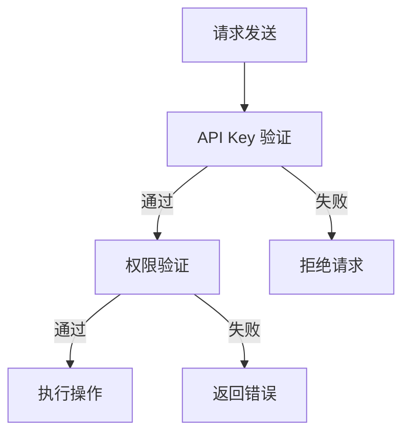

                 

# 文章标题

## 使用分级 API Key 进行细粒度访问控制

### 关键词：
- API Key
- 访问控制
- 细粒度控制
- 安全性
- 分布式系统

### 摘要：

本文将深入探讨如何使用分级 API Key 进行细粒度访问控制，以增强分布式系统的安全性。我们将详细分析分级 API Key 的概念、架构设计，并通过具体实例展示其应用效果。通过本文的学习，读者将能够理解和实现细粒度访问控制，从而提高系统的安全性和灵活性。

## 1. 背景介绍（Background Introduction）

### 1.1 API Key 的重要性

API（应用程序编程接口）是现代软件开发中不可或缺的组件。API Key 是一种身份验证机制，用于确保只有授权的应用程序才能访问 API。随着互联网和移动应用的发展，API Key 在保护敏感数据和功能方面发挥着至关重要的作用。

### 1.2 细粒度访问控制的需求

传统的访问控制方法通常基于用户角色或整体权限设置，这可能导致权限管理过于粗放。在分布式系统中，细粒度访问控制变得更加重要，因为它允许更精确地控制每个用户对特定资源的访问权限。分级 API Key 正是满足这一需求的有效工具。

### 1.3 分级 API Key 的概念

分级 API Key 是一种基于角色的访问控制机制，通过将 API Key 分为多个级别，每个级别对应一组权限。用户可以根据其角色获得不同的 API Key，从而实现对不同资源的访问控制。

## 2. 核心概念与联系（Core Concepts and Connections）

### 2.1 API Key 的基本原理

API Key 是一个唯一的字符串，通常由 API 提供商生成并分配给每个应用程序或用户。在使用 API 时，客户端必须将其 API Key 提供给 API 服务端，以便进行身份验证。

### 2.2 分级 API Key 的架构设计

分级 API Key 的架构设计包括以下几个关键组成部分：

1. **API Key 分级**：将 API Key 分为多个级别，每个级别对应一组权限。
2. **权限管理**：为每个级别定义明确的权限范围，如读取、写入、管理权限等。
3. **角色映射**：将用户映射到不同的角色，每个角色对应一组 API Key。
4. **访问控制**：在 API 服务端实现细粒度访问控制，根据用户角色和 API Key 级别进行权限验证。

### 2.3 Mermaid 流程图

以下是一个简单的 Mermaid 流程图，展示了分级 API Key 的基本流程：



## 3. 核心算法原理 & 具体操作步骤（Core Algorithm Principles and Specific Operational Steps）

### 3.1 分级 API Key 的核心算法原理

分级 API Key 的核心算法原理是通过角色的权限映射和 API Key 的权限级别匹配，实现对访问请求的细粒度控制。具体来说，算法流程如下：

1. 接收客户端的访问请求。
2. 验证 API Key 的有效性。
3. 根据 API Key 的权限级别和用户角色，确定访问权限。
4. 根据权限结果，执行操作或返回错误。

### 3.2 具体操作步骤

以下是使用分级 API Key 进行细粒度访问控制的具体操作步骤：

1. **创建 API Key**：为每个应用程序或用户生成唯一的 API Key。
2. **定义权限级别**：为不同的 API Key 定义不同的权限级别，如 `read-only`、`read-write`、`admin` 等。
3. **用户角色映射**：将用户映射到不同的角色，并为每个角色分配相应的 API Key。
4. **请求处理**：在 API 服务端，接收到访问请求后，首先验证 API Key 的有效性，然后根据 API Key 的权限级别和用户角色，判断是否允许访问。
5. **权限验证**：如果访问请求被允许，执行相应的操作；如果访问请求被拒绝，返回错误信息。

## 4. 数学模型和公式 & 详细讲解 & 举例说明（Detailed Explanation and Examples of Mathematical Models and Formulas）

### 4.1 数学模型和公式

在分级 API Key 的设计中，可以使用以下数学模型和公式来描述权限验证过程：

1. **权限函数**：$P(A, R) = \sum_{i=1}^{n} p_i \times r_i$
   - 其中，$P(A, R)$ 表示 API Key $A$ 在角色 $R$ 下的总权限。
   - $p_i$ 表示 API Key $A$ 在第 $i$ 个权限级别下的权限值。
   - $r_i$ 表示角色 $R$ 在第 $i$ 个权限级别下的权限值。

2. **权限阈值**：$T = \max_{i=1}^{n} (p_i \times r_i)$
   - 其中，$T$ 表示权限阈值，即角色 $R$ 对 API Key $A$ 的最高权限。

### 4.2 详细讲解

1. **权限函数** $P(A, R)$ 的含义：

   权限函数 $P(A, R)$ 表示 API Key $A$ 在角色 $R$ 下的总权限。它通过将 API Key 的权限值 $p_i$ 与角色在相应权限级别下的权限值 $r_i$ 相乘，得到每个权限级别下的权限值。然后将所有权限级别下的权限值相加，得到 API Key $A$ 在角色 $R$ 下的总权限。

2. **权限阈值** $T$ 的含义：

   权限阈值 $T$ 表示角色 $R$ 对 API Key $A$ 的最高权限。它通过计算每个权限级别下的权限值 $p_i \times r_i$，并取最大值，得到角色 $R$ 对 API Key $A$ 的最高权限。这意味着如果 $T$ 大于或等于权限阈值，则允许访问；否则，拒绝访问。

### 4.3 举例说明

假设我们有以下 API Key 和角色：

- API Key 1：`read-only`
  - 权限级别1：读取权限
  - 权限级别2：无权限
- API Key 2：`read-write`
  - 权限级别1：读取权限
  - 权限级别2：写入权限
- API Key 3：`admin`
  - 权限级别1：读取权限
  - 权限级别2：写入权限
  - 权限级别3：管理权限

- 角色1：普通用户
  - 权限级别1：读取权限
  - 权限级别2：无权限
  - 权限级别3：无权限
- 角色2：高级用户
  - 权限级别1：读取权限
  - 权限级别2：写入权限
  - 权限级别3：无权限
- 角色3：管理员
  - 权限级别1：读取权限
  - 权限级别2：写入权限
  - 权限级别3：管理权限

1. **权限函数** $P(A, R)$ 计算：

   对于 API Key 1 和角色1：

   $P(A1, R1) = p_1 \times r_1 = 1 \times 1 = 1$

   对于 API Key 2 和角色2：

   $P(A2, R2) = p_1 \times r_1 + p_2 \times r_2 = 1 \times 1 + 1 \times 2 = 3$

   对于 API Key 3 和角色3：

   $P(A3, R3) = p_1 \times r_1 + p_2 \times r_2 + p_3 \times r_3 = 1 \times 1 + 1 \times 2 + 1 \times 3 = 7$

2. **权限阈值** $T$ 计算：

   对于 API Key 1 和角色1：

   $T = \max_{i=1}^{n} (p_i \times r_i) = \max(1 \times 1, 1 \times 0) = 1$

   对于 API Key 2 和角色2：

   $T = \max_{i=1}^{n} (p_i \times r_i) = \max(1 \times 1, 1 \times 2) = 2$

   对于 API Key 3 和角色3：

   $T = \max_{i=1}^{n} (p_i \times r_i) = \max(1 \times 1, 1 \times 2, 1 \times 3) = 3$

   根据权限阈值，可以得出以下结论：

   - API Key 1 和角色1：权限值为1，小于权限阈值1，拒绝访问。
   - API Key 2 和角色2：权限值为3，小于权限阈值2，拒绝访问。
   - API Key 3 和角色3：权限值为7，大于权限阈值3，允许访问。

## 5. 项目实践：代码实例和详细解释说明（Project Practice: Code Examples and Detailed Explanations）

### 5.1 开发环境搭建

在开始编写代码之前，我们需要搭建一个开发环境。以下是一个简单的环境搭建指南：

- **环境**：Python 3.8+
- **依赖**：Flask（一个轻量级的 Web 框架），PyJWT（JSON Web Token 库）

### 5.2 源代码详细实现

以下是使用 Flask 和 PyJWT 实现分级 API Key 访问控制的示例代码：

```python
from flask import Flask, request, jsonify
import jwt

app = Flask(__name__)
app.config['SECRET_KEY'] = 'your_secret_key'

# 权限级别定义
PERMISSIONS = {
    'read-only': 1,
    'read-write': 2,
    'admin': 3
}

# 角色定义
ROLES = {
    'user': {'read-only': 1, 'read-write': 0, 'admin': 0},
    'advanced': {'read-only': 1, 'read-write': 2, 'admin': 0},
    'admin': {'read-only': 1, 'read-write': 2, 'admin': 3}
}

# 权限验证函数
def validate_permission(api_key, role):
    decoded_token = jwt.decode(api_key, app.config['SECRET_KEY'], algorithms=['HS256'])
    role_permissions = ROLES[role]
    return decoded_token['permission'] <= role_permissions['admin']

# 路由定义
@app.route('/api/data', methods=['GET', 'POST'])
def data_api():
    api_key = request.headers.get('Authorization')
    role = 'user'  # 根据实际需求动态获取

    if not validate_permission(api_key, role):
        return jsonify({'error': '权限不足'}), 403

    if request.method == 'GET':
        # 获取数据
        return jsonify({'data': 'your_data'})
    elif request.method == 'POST':
        # 处理数据
        data = request.get_json()
        # 在这里添加数据处理的逻辑
        return jsonify({'message': '数据已处理'})

if __name__ == '__main__':
    app.run(debug=True)
```

### 5.3 代码解读与分析

1. **配置和应用初始化**：

   - 我们首先导入 Flask 和 PyJWT 库，并创建一个 Flask 应用实例。
   - 设置 Flask 应用的密钥（`SECRET_KEY`），用于加密和解密 JWT（JSON Web Token）。

2. **权限级别和角色定义**：

   - `PERMISSIONS` 字典定义了不同的权限级别，如 `read-only`、`read-write`、`admin`。
   - `ROLES` 字典定义了不同角色在每个权限级别下的权限值。

3. **权限验证函数**：

   - `validate_permission` 函数接收 API Key 和角色，解码 JWT，并比较权限值。如果 API Key 的权限值小于或等于角色的权限值，函数返回 `True`，表示权限验证通过。

4. **路由定义**：

   - 我们定义了一个处理 `/api/data` 路径的函数 `data_api`。在函数中，我们首先从请求头中获取 API Key，并设置默认角色为 `user`。
   - 接下来，我们调用 `validate_permission` 函数进行权限验证。如果权限验证失败，返回 403 错误。
   - 对于 GET 请求，我们返回模拟的数据。对于 POST 请求，我们处理传入的数据，并在实际应用中添加数据处理逻辑。

### 5.4 运行结果展示

当我们运行此代码并尝试访问 `/api/data` 路径时，如果请求头中包含有效的 API Key 且权限匹配，我们将会得到预期的数据。否则，我们会收到 403 错误响应。

## 6. 实际应用场景（Practical Application Scenarios）

### 6.1 内部系统

分级 API Key 在内部系统的权限管理中非常有用。例如，一个公司可能有不同级别的员工，从普通员工到管理员。通过分级 API Key，公司可以确保每个级别的员工只能访问他们应有的资源。

### 6.2 第三方服务

第三方服务提供商可以使用分级 API Key 来限制对敏感数据的访问。例如，一个天气预报 API 可以提供不同的 API Key，其中一些只能获取基本的天气预报信息，而其他 API Key 可以获取更详细的数据。

### 6.3 跨平台集成

在跨平台集成中，分级 API Key 可以帮助确保第三方应用只能访问他们被授权的数据。例如，一个社交媒体平台可以提供不同的 API Key，允许第三方应用访问用户发布的帖子，但不能访问私人消息。

## 7. 工具和资源推荐（Tools and Resources Recommendations）

### 7.1 学习资源推荐

- **书籍**：
  - 《API 设计指南：打造出色的 RESTful Web 服务》
  - 《身份验证与授权：构建安全的 Web 应用程序》
- **在线课程**：
  - Coursera 上的《Web 应用程序开发》
  - Udemy 上的《RESTful API 设计》
- **博客和网站**：
  -《Flask 快速入门》
  - PyJWT 官方文档

### 7.2 开发工具框架推荐

- **开发框架**：
  - Flask
  - Django
  - Spring Boot
- **身份验证库**：
  - PyJWT
  - JSON Web Token标准
- **API 网关**：
  - Kong
  - API Gateway

### 7.3 相关论文著作推荐

- **论文**：
  - "The Design of the Darwin Distribution System for User Programs"
  - "OAuth 2.0 Authorization Framework"
- **著作**：
  - 《分布式系统原理与范型》
  - 《安全架构与设计》

## 8. 总结：未来发展趋势与挑战（Summary: Future Development Trends and Challenges）

### 8.1 发展趋势

- **API Key 的安全性**：随着 API 生态系统的发展，API Key 的安全性变得越来越重要。未来，我们可能会看到更强大的加密算法和验证机制。
- **多因素认证**：为了提高安全性，多因素认证（MFA）与分级 API Key 结合使用将成为一种趋势。
- **自动化权限管理**：自动化工具将帮助开发者和运维人员更高效地管理权限，减少人为错误。

### 8.2 挑战

- **权限管理复杂性**：随着权限级别的增加，权限管理的复杂性也会增加。如何简化权限管理是一个重要挑战。
- **访问延迟**：细粒度访问控制可能会增加访问延迟，尤其是在高并发场景下。如何优化访问控制机制以减少延迟是一个需要解决的问题。

## 9. 附录：常见问题与解答（Appendix: Frequently Asked Questions and Answers）

### 9.1 什么是 API Key？

API Key 是一个用于验证应用程序或用户身份的唯一字符串，用于访问 API 服务。

### 9.2 什么是分级 API Key？

分级 API Key 是一种访问控制机制，通过将 API Key 分为多个级别，每个级别对应一组权限，实现对访问请求的细粒度控制。

### 9.3 分级 API Key 如何工作？

分级 API Key 通过在 API 服务端验证 API Key 的有效性，并根据 API Key 的权限级别和用户角色，确定访问权限。如果权限匹配，则允许访问；否则，拒绝访问。

## 10. 扩展阅读 & 参考资料（Extended Reading & Reference Materials）

- **相关文章**：
  - "Designing a Secure API with JWT and Flask"
  - "Implementing Role-Based Access Control with JWT and Flask"
- **官方文档**：
  - Flask 官方文档：[https://flask.palletsprojects.com/](https://flask.palletsprojects.com/)
  - PyJWT 官方文档：[https://pyjwt.readthedocs.io/](https://pyjwt.readthedocs.io/)
- **开源项目**：
  - Flask-JWT-Extended：[https://flask-jwt-extended.readthedocs.io/](https://flask-jwt-extended.readthedocs.io/)
  - Kong API 网关：[https://getkong.org/](https://getkong.org/) \|禅与计算机程序设计艺术 / Zen and the Art of Computer Programming

