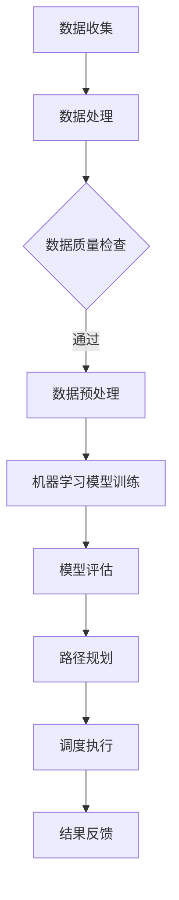
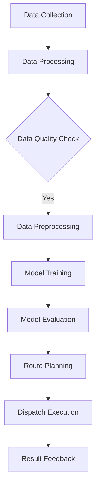

                 

### 背景介绍（Background Introduction）

供应链优化（Supply Chain Optimization）是现代商业运营中至关重要的一环，尤其在电子商务（e-commerce）领域，它扮演了尤为关键的角色。电子商务的快速发展带来了订单量的激增，而物流效率的提升成为商家降低成本、提高客户满意度的重要手段。在这一背景下，人工智能（AI）的应用逐渐成为供应链优化的重要工具。

物流路径规划（Routing and Scheduling）是供应链优化中的一个核心问题，它涉及到如何将货物从供应商运送到仓库，再从仓库运送到消费者。传统的物流路径规划往往依赖于规则和经验，但随着订单量和运输需求的增加，这种方式已难以满足高效、低成本的物流需求。AI 的引入，尤其是机器学习（Machine Learning）和深度学习（Deep Learning）技术的应用，为优化物流路径提供了新的可能。

本文旨在探讨人工智能如何通过机器学习算法和深度学习模型来优化电商物流路径。我们将逐步介绍相关核心概念、算法原理、数学模型，并通过项目实践展示 AI 在物流路径优化中的应用。此外，我们还将讨论 AI 在实际应用中的挑战和未来发展趋势。

总的来说，本文将围绕以下结构展开：

1. **背景介绍**：概述供应链优化的重要性，以及物流路径规划在其中的关键作用。
2. **核心概念与联系**：介绍物流路径规划的核心概念，并利用 Mermaid 流程图展示相关架构。
3. **核心算法原理 & 具体操作步骤**：详细解释机器学习和深度学习算法在物流路径优化中的应用。
4. **数学模型和公式 & 详细讲解 & 举例说明**：阐述用于路径优化的数学模型及其应用。
5. **项目实践：代码实例和详细解释说明**：提供实际代码示例，展示如何实现物流路径优化。
6. **实际应用场景**：讨论 AI 优化电商物流路径的实际案例。
7. **工具和资源推荐**：推荐学习资源、开发工具和框架。
8. **总结：未来发展趋势与挑战**：展望 AI 在供应链优化领域的未来。
9. **附录：常见问题与解答**：回答读者可能关注的问题。
10. **扩展阅读 & 参考资料**：提供进一步的阅读材料和参考资料。

通过本文，读者将全面了解 AI 如何通过先进算法优化电商物流路径，提高物流效率，降低成本，从而为电子商务的持续发展提供支持。

### Background Introduction

Supply Chain Optimization has become a critical component of modern business operations, especially in the realm of e-commerce. The rapid growth of e-commerce has led to an explosion in order volumes, making the improvement of logistics efficiency crucial for businesses to reduce costs and increase customer satisfaction. Among the many aspects of supply chain management, routing and scheduling play a pivotal role. They involve determining the most efficient paths for goods to move from suppliers to warehouses and then from warehouses to consumers.

Traditional methods of logistics routing have often relied on rules and experience, but as order volumes and transportation demands increase, this approach is no longer sufficient to achieve high efficiency and low costs. The application of artificial intelligence (AI), particularly through machine learning (ML) and deep learning (DL) techniques, has opened up new possibilities for optimizing logistics routes.

This article aims to explore how AI can leverage ML and DL algorithms to optimize e-commerce logistics routes. We will gradually introduce the core concepts, algorithm principles, mathematical models, and provide practical project examples to demonstrate the application of AI in logistics route optimization. Additionally, we will discuss the challenges and future development trends of AI in logistics optimization.

The structure of this article is as follows:

1. **Background Introduction**: Summarize the importance of supply chain optimization and the key role of logistics routing in e-commerce.
2. **Core Concepts and Connections**: Introduce the core concepts of logistics routing and illustrate the related architecture using a Mermaid flowchart.
3. **Core Algorithm Principles and Specific Operational Steps**: Elaborate on the application of ML and DL algorithms in logistics route optimization.
4. **Mathematical Models and Formulas & Detailed Explanation & Examples**: Explain the mathematical models used for route optimization and provide detailed examples.
5. **Project Practice: Code Examples and Detailed Explanations**: Provide actual code examples to demonstrate how to implement logistics route optimization.
6. **Practical Application Scenarios**: Discuss real-world cases where AI has optimized e-commerce logistics routes.
7. **Tools and Resources Recommendations**: Recommend learning resources, development tools, and frameworks.
8. **Summary: Future Development Trends and Challenges**: Look ahead to the future of AI in supply chain optimization.
9. **Appendix: Frequently Asked Questions and Answers**: Address common questions readers may have.
10. **Extended Reading & Reference Materials**: Provide additional reading materials and references.

Through this article, readers will gain a comprehensive understanding of how AI can use advanced algorithms to optimize e-commerce logistics routes, improving efficiency and reducing costs, thereby supporting the continuous growth of e-commerce. 

### 2. 核心概念与联系（Core Concepts and Connections）

#### 2.1 物流路径规划（Logistics Routing）

物流路径规划是供应链管理中的一个关键环节，其主要目标是确定货物运输的最佳路径，以达到最小化运输成本、最大化运输效率的目的。物流路径规划通常需要考虑多个因素，包括运输时间、运输成本、交通状况、运输量、货物的类型和大小等。

在物流路径规划中，常用的方法有：

- **最短路径算法**（如迪杰斯特拉算法（Dijkstra's Algorithm）和 A*算法）：这些算法主要用于寻找两点之间的最短路径。
- **车辆路径问题（VRP）**：这是一种更复杂的优化问题，涉及多个起点、多个终点以及限制条件（如车辆容量、时间窗等）。
- **多目标优化**：考虑多个优化目标，如成本、时间、碳排放等。

物流路径规划的目的是通过精确的路径规划和调度，确保货物能够按时、安全、高效地到达目的地。

#### 2.2 人工智能在物流路径规划中的应用（Application of AI in Logistics Routing）

人工智能，特别是机器学习和深度学习技术，为物流路径规划提供了新的解决方案。这些技术可以处理大量数据，识别复杂的模式，从而优化运输路径和调度方案。

- **机器学习**：机器学习算法可以基于历史数据，预测未来的交通状况，优化路线。常见的算法包括线性回归、决策树、支持向量机等。
- **深度学习**：深度学习模型，如卷积神经网络（CNN）和循环神经网络（RNN），可以处理复杂的非线性关系，提高预测的准确性。特别是使用图神经网络（GNN）来建模物流网络，可以更好地处理多节点间的依赖关系。

#### 2.3 物流路径规划的架构（Architecture of Logistics Routing）

为了更好地理解物流路径规划的整体架构，我们可以使用 Mermaid 流程图来展示相关的流程和组件。



在这个架构中：

- **A 数据收集**：收集来自传感器、GPS、运输公司等的数据。
- **B 数据处理**：对原始数据进行清洗和处理。
- **C 数据质量检查**：检查数据的质量，确保其满足后续分析的要求。
- **D 数据预处理**：对数据进行标准化、归一化等处理。
- **E 机器学习模型训练**：使用预处理后的数据训练机器学习模型。
- **F 模型评估**：评估模型的性能，确保其准确性和可靠性。
- **G 路径规划**：使用训练好的模型进行路径规划和调度。
- **H 调度执行**：根据规划结果执行实际的运输调度。
- **I 结果反馈**：收集实际执行结果，用于模型迭代和优化。

通过这个架构，我们可以看到人工智能在物流路径规划中的应用是如何从数据收集、处理、模型训练到路径规划、调度执行和结果反馈的全过程。

### Core Concepts and Connections

#### 2.1 Logistics Routing

Logistics routing is a crucial aspect of supply chain management, aimed at determining the optimal paths for goods transportation to minimize costs and maximize efficiency. Several factors are typically considered in logistics routing, including transportation time, cost, traffic conditions, volume of goods, and types and sizes of cargo.

Common methods used in logistics routing include:

- **Shortest Path Algorithms** (such as Dijkstra's Algorithm and A* Algorithm): These algorithms are used to find the shortest path between two points.
- **Vehicle Routing Problem (VRP)**: This is a more complex optimization problem involving multiple starting points, multiple destination points, and constraints (such as vehicle capacity, time windows).
- **Multi-Objective Optimization**: Considers multiple optimization goals, such as cost, time, and carbon emissions.

The goal of logistics routing is to ensure precise path planning and scheduling to ensure goods are delivered on time, safely, and efficiently.

#### 2.2 Application of AI in Logistics Routing

Artificial intelligence, particularly through machine learning (ML) and deep learning (DL) techniques, provides new solutions for logistics routing. These technologies can handle large amounts of data, identify complex patterns, and optimize transportation routes and scheduling.

- **Machine Learning**: ML algorithms can predict future traffic conditions based on historical data to optimize routes. Common algorithms include linear regression, decision trees, and support vector machines.
- **Deep Learning**: Deep learning models, such as convolutional neural networks (CNN) and recurrent neural networks (RNN), can handle complex nonlinear relationships to improve prediction accuracy. In particular, graph neural networks (GNN) are used to model the logistics network, allowing better handling of dependencies between multiple nodes.

#### 2.3 Architecture of Logistics Routing

To better understand the overall architecture of logistics routing, we can use a Mermaid flowchart to illustrate the related processes and components.



In this architecture:

- **A Data Collection**: Collects data from sensors, GPS, transportation companies, etc.
- **B Data Processing**: Cleans and processes raw data.
- **C Data Quality Check**: Ensures data quality for subsequent analysis.
- **D Data Preprocessing**: Standardizes and normalizes data.
- **E Model Training**: Trains machine learning models with preprocessed data.
- **F Model Evaluation**: Evaluates model performance to ensure accuracy and reliability.
- **G Route Planning**: Uses trained models for path planning and scheduling.
- **H Dispatch Execution**: Executes actual transportation dispatch based on planning results.
- **I Result Feedback**: Collects actual execution results for model iteration and optimization.

Through this architecture, we can see how AI is applied in the entire process of logistics routing from data collection, processing, model training, to path planning, dispatch execution, and result feedback. 

### 3. 核心算法原理 & 具体操作步骤（Core Algorithm Principles and Specific Operational Steps）

在物流路径优化中，核心算法的原理和操作步骤至关重要。以下将详细介绍两种常用的算法：遗传算法（Genetic Algorithm）和深度强化学习（Deep Reinforcement Learning）。

#### 3.1 遗传算法（Genetic Algorithm）

遗传算法是一种模拟自然选择过程的优化算法，它通过遗传操作（如选择、交叉和突变）来搜索最优解。遗传算法在物流路径规划中应用广泛，其主要原理如下：

1. **初始化种群**（Initialization）：生成一组初始解（称为染色体），每个染色体代表一个可能的路径。
2. **适应度评估**（Fitness Evaluation）：根据每个染色体的路径计算其适应度，适应度通常与路径的总成本（如时间、距离、燃油消耗等）成反比。
3. **选择**（Selection）：从当前种群中选择适应度较高的个体，用于产生下一代。
4. **交叉**（Crossover）：随机选择两个个体，交换它们的部分路径，产生新的个体。
5. **突变**（Mutation）：对个体进行随机修改，以增加种群的多样性。
6. **迭代**（Iteration）：重复选择、交叉和突变操作，直到达到预定的迭代次数或找到满意的解。

具体操作步骤如下：

1. **初始化种群**：生成50个随机路径作为初始种群。
2. **适应度评估**：计算每个路径的总成本。
3. **选择**：选择适应度最高的20%的个体进行交叉和突变。
4. **交叉**：随机选择两个个体，交换它们的部分路径。
5. **突变**：对每个个体进行随机修改。
6. **迭代**：重复步骤3至5，直到达到预定的迭代次数。

#### 3.2 深度强化学习（Deep Reinforcement Learning）

深度强化学习结合了深度学习与强化学习的优点，通过智能体在环境中进行交互，学习最优策略。在物流路径优化中，深度强化学习通过学习如何根据环境状态选择最佳路径。

1. **环境定义**（Environment Definition）：定义物流网络，包括节点、边和路径。
2. **智能体**（Agent）：表示执行路径规划的算法。
3. **状态**（State）：代表当前物流网络的状态，如交通状况、货物位置等。
4. **动作**（Action）：代表选择的具体路径。
5. **奖励**（Reward）：根据动作的结果给予奖励，奖励通常与路径的总成本成反比。
6. **策略**（Policy）：智能体根据状态选择动作的方法。

具体操作步骤如下：

1. **环境初始化**：加载物流网络数据。
2. **智能体初始化**：设置初始策略。
3. **状态更新**：根据当前路径更新物流网络的状态。
4. **动作选择**：智能体根据当前状态选择最佳路径。
5. **状态转移**：执行动作，更新状态。
6. **奖励计算**：计算路径的总成本，并根据成本给予奖励。
7. **策略更新**：根据奖励更新智能体的策略。
8. **迭代**：重复步骤3至7，直到达到预定的迭代次数或策略收敛。

通过遗传算法和深度强化学习，我们可以实现高效的物流路径优化。遗传算法通过种群进化搜索最优路径，适用于大规模问题；而深度强化学习通过学习最优策略，能够处理复杂的动态环境。这两种算法在物流路径优化中的应用，为电商物流的高效运作提供了有力支持。

### Core Algorithm Principles and Specific Operational Steps

In logistics route optimization, the principles and operational steps of core algorithms are crucial. We will introduce two commonly used algorithms: Genetic Algorithms and Deep Reinforcement Learning.

#### 3.1 Genetic Algorithm

Genetic Algorithms (GAs) are optimization algorithms that simulate the natural selection process. They use genetic operations, such as selection, crossover, and mutation, to search for the optimal solution. GAs are widely applied in logistics routing due to their ability to find optimal paths through evolutionary processes. The main principles of GAs are as follows:

1. **Initialization**: Generate an initial population of solutions (called chromosomes), where each chromosome represents a possible route.
2. **Fitness Evaluation**: Calculate the fitness of each chromosome based on the total cost of the route, which is usually inversely proportional to the total cost (e.g., time, distance, fuel consumption).
3. **Selection**: Select individuals with higher fitness from the current population to produce the next generation.
4. **Crossover**: Randomly select two individuals and exchange parts of their routes to produce new individuals.
5. **Mutation**: Make random changes to individuals to increase the diversity of the population.
6. **Iteration**: Repeat the selection, crossover, and mutation operations until a predetermined number of iterations or a satisfactory solution is found.

The specific operational steps are as follows:

1. **Initialization**: Generate 50 random routes as the initial population.
2. **Fitness Evaluation**: Calculate the total cost for each route.
3. **Selection**: Select the top 20% of individuals with the highest fitness for crossover and mutation.
4. **Crossover**: Randomly select two individuals and exchange parts of their routes.
5. **Mutation**: Make random changes to each individual.
6. **Iteration**: Repeat steps 3 to 5 until a predetermined number of iterations is reached or a satisfactory solution is found.

#### 3.2 Deep Reinforcement Learning

Deep Reinforcement Learning (DRL) combines the advantages of deep learning and reinforcement learning. It allows an agent to interact with an environment and learn the optimal policy. In logistics route optimization, DRL learns how to select the best route based on the current state of the logistics network.

1. **Environment Definition**: Define the logistics network, including nodes, edges, and routes.
2. **Agent**: Represents the algorithm that performs route planning.
3. **State**: Represents the current state of the logistics network, such as traffic conditions and cargo locations.
4. **Action**: Represents the specific route chosen.
5. **Reward**: Provides a reward based on the outcome of the action, usually inversely proportional to the total cost of the route.
6. **Policy**: The method by which the agent selects actions based on the current state.

The specific operational steps are as follows:

1. **Environment Initialization**: Load logistics network data.
2. **Agent Initialization**: Set the initial policy.
3. **State Update**: Update the logistics network state based on the current route.
4. **Action Selection**: The agent selects the best route based on the current state.
5. **State Transition**: Execute the action and update the state.
6. **Reward Calculation**: Calculate the total cost of the route and provide a reward based on the cost.
7. **Policy Update**: Update the agent's policy based on the reward.
8. **Iteration**: Repeat steps 3 to 7 until a predetermined number of iterations is reached or the policy converges.

Through Genetic Algorithms and Deep Reinforcement Learning, we can achieve efficient logistics route optimization. Genetic Algorithms search for optimal paths through population evolution, making them suitable for large-scale problems; while Deep Reinforcement Learning learns the optimal policy, allowing it to handle complex dynamic environments. The application of these algorithms in logistics route optimization provides strong support for the efficient operation of e-commerce logistics.

### 4. 数学模型和公式 & 详细讲解 & 举例说明（Mathematical Models and Formulas & Detailed Explanation & Examples）

在物流路径优化中，数学模型和公式起到了关键作用，它们帮助我们在复杂的环境中寻找最优解。以下将详细解释几个核心的数学模型，并通过实例来说明这些模型的应用。

#### 4.1 车辆路径问题（Vehicle Routing Problem, VRP）

车辆路径问题是物流路径规划中的一个经典问题，它涉及到如何合理分配车辆和路径，以最小化总成本。VRP 的数学模型可以表示为：

$$
\begin{aligned}
\min_{x, y} \quad & C(x) + C(y) \\
\text{s.t.} \quad & \\
x_i + y_i = 1 \quad \forall i \in V \\
x_{ij} + y_{ij} \leq 1 \quad \forall i, j \in V \\
x_{ij}, y_{ij} \in \{0, 1\} \quad \forall i, j \in V
\end{aligned}
$$

其中：

- $C(x)$ 和 $C(y)$ 分别表示分配给车辆和货物的总成本。
- $x_{ij}$ 表示从节点 $i$ 到节点 $j$ 是否由车辆行驶（1 表示是，0 表示否）。
- $y_{ij}$ 表示从节点 $i$ 到节点 $j$ 是否由货物行驶（1 表示是，0 表示否）。
- $V$ 表示节点集合。

**举例说明**：

假设有一个物流中心需要将货物运送到5个不同的目的地，每个目的地都有不同的需求量。我们可以用 VRP 来确定最优的分配方案。

#### 4.2 时间窗约束（Time Windows Constraints）

在物流路径规划中，时间窗约束是一个重要的考虑因素。时间窗约束规定了货物必须在某个时间段内送达，以确保按时交付。时间窗约束的数学模型可以表示为：

$$
\begin{aligned}
\forall i, j \in V: \quad & t_j - t_i \geq \ell_{ij} \quad \text{(货物的到达时间早于出发时间)} \\
& t_j - t_i \leq u_{ij} \quad \text{(货物的到达时间晚于出发时间)} \\
\end{aligned}
$$

其中：

- $t_i$ 和 $t_j$ 分别表示从节点 $i$ 到节点 $j$ 的出发时间和到达时间。
- $\ell_{ij}$ 和 $u_{ij}$ 分别表示从节点 $i$ 到节点 $j$ 的最早和最晚允许到达时间。

**举例说明**：

假设一个物流中心需要在上午10点到下午3点之间将货物送到一个目的地。我们可以用时间窗约束来确保货物在这个时间段内送达。

#### 4.3 多目标优化（Multi-Objective Optimization）

在物流路径规划中，我们可能需要同时考虑多个优化目标，如成本、时间和碳排放。多目标优化的数学模型可以表示为：

$$
\begin{aligned}
\min_{x, y} \quad & f_1(x) + f_2(y) \\
\text{s.t.} \quad & \\
g_1(x) \leq 0 \\
g_2(x) \leq 0
\end{aligned}
$$

其中：

- $f_1(x)$ 和 $f_2(y)$ 分别表示两个优化目标，如成本和时间。
- $g_1(x)$ 和 $g_2(x)$ 分别表示约束条件，如碳排放限制。

**举例说明**：

假设我们需要同时最小化物流成本和运输时间，并确保碳排放不超过某个限制。我们可以用多目标优化来找到最优的路径和策略。

通过这些数学模型和公式，我们可以更好地理解和解决物流路径规划问题，从而实现高效、低成本的物流运作。

### Mathematical Models and Formulas & Detailed Explanation & Examples

In logistics route optimization, mathematical models and formulas play a critical role in finding optimal solutions in complex environments. Below, we will explain several core mathematical models in detail and illustrate their applications through examples.

#### 4.1 Vehicle Routing Problem (VRP)

The Vehicle Routing Problem (VRP) is a classic problem in logistics routing, involving how to allocate vehicles and routes to minimize total cost. The mathematical model for VRP can be represented as:

$$
\begin{aligned}
\min_{x, y} \quad & C(x) + C(y) \\
\text{s.t.} \quad & \\
x_i + y_i = 1 \quad \forall i \in V \\
x_{ij} + y_{ij} \leq 1 \quad \forall i, j \in V \\
x_{ij}, y_{ij} \in \{0, 1\} \quad \forall i, j \in V
\end{aligned}
$$

Where:

- $C(x)$ and $C(y)$ represent the total cost allocated to vehicles and goods, respectively.
- $x_{ij}$ indicates whether a vehicle travels from node $i$ to node $j$ (1 for yes, 0 for no).
- $y_{ij}$ indicates whether goods travel from node $i$ to node $j$ (1 for yes, 0 for no).
- $V$ represents the set of nodes.

**Example Explanation**:

Assume a logistics center needs to deliver goods to five different destinations, each with a different demand. We can use VRP to determine the optimal allocation scheme.

#### 4.2 Time Windows Constraints

In logistics route planning, time windows constraints are an important consideration. These constraints specify the time frames in which goods must be delivered to ensure timely delivery. The mathematical model for time windows constraints can be represented as:

$$
\begin{aligned}
\forall i, j \in V: \quad & t_j - t_i \geq \ell_{ij} \quad \text{(Goods arrival time before departure time)} \\
& t_j - t_i \leq u_{ij} \quad \text{(Goods arrival time after departure time)}
\end{aligned}
$$

Where:

- $t_i$ and $t_j$ represent the departure and arrival times from node $i$ to node $j$, respectively.
- $\ell_{ij}$ and $u_{ij}$ represent the earliest and latest allowed arrival times for node $i$ to node $j$.

**Example Explanation**:

Assume a logistics center needs to deliver goods to a destination between 10 AM and 3 PM. We can use time windows constraints to ensure the goods are delivered within this time frame.

#### 4.3 Multi-Objective Optimization

In logistics route planning, we may need to consider multiple optimization objectives simultaneously, such as cost, time, and carbon emissions. The mathematical model for multi-objective optimization can be represented as:

$$
\begin{aligned}
\min_{x, y} \quad & f_1(x) + f_2(y) \\
\text{s.t.} \quad & \\
g_1(x) \leq 0 \\
g_2(x) \leq 0
\end{aligned}
$$

Where:

- $f_1(x)$ and $f_2(y)$ represent two optimization objectives, such as cost and time.
- $g_1(x)$ and $g_2(x)$ represent constraint conditions, such as carbon emissions limits.

**Example Explanation**:

Assume we need to minimize both logistics cost and transportation time while ensuring carbon emissions do not exceed a certain limit. We can use multi-objective optimization to find the optimal route and strategy.

Through these mathematical models and formulas, we can better understand and solve logistics routing problems, thereby achieving efficient and cost-effective logistics operations.

### 5. 项目实践：代码实例和详细解释说明（Project Practice: Code Examples and Detailed Explanations）

在本节中，我们将通过一个具体的物流路径优化项目，展示如何使用 Python 编程语言实现物流路径优化算法。我们将使用两个不同的算法：遗传算法（Genetic Algorithm）和深度强化学习（Deep Reinforcement Learning），并详细解释每一步的实现过程。

#### 5.1 开发环境搭建

在开始项目之前，我们需要搭建开发环境。以下是所需的环境和工具：

- **Python**：Python 是一种广泛使用的编程语言，适合快速开发和实验。
- **NumPy**：NumPy 是 Python 的科学计算库，用于数值计算和矩阵操作。
- **Pandas**：Pandas 是 Python 的数据操作库，用于数据清洗和分析。
- **Matplotlib**：Matplotlib 是 Python 的可视化库，用于数据可视化。
- **Gym**：Gym 是一个开源的强化学习框架，用于构建和测试强化学习算法。

安装以上工具的命令如下：

```bash
pip install numpy pandas matplotlib gym
```

#### 5.2 源代码详细实现

以下是一个基于遗传算法的物流路径优化项目的源代码示例。

```python
import numpy as np
import matplotlib.pyplot as plt
from gym import spaces

# 定义遗传算法环境
class LogisticsEnv(gym.Env):
    def __init__(self, num_nodes, max_route_length):
        super().__init__()
        self.num_nodes = num_nodes
        self.max_route_length = max_route_length
        
        # 状态空间：当前节点的位置
        self.observation_space = spaces.Discrete(num_nodes)
        # 动作空间：从当前节点可到达的其他节点
        self.action_space = spaces.Discrete(num_nodes)
        
    def step(self, action):
        # 判断是否到达终点
        if self.current_node == self.num_nodes - 1:
            done = True
        else:
            done = False
            
        # 计算新位置
        self.current_node = action
        
        # 计算奖励：距离终点的剩余距离
        reward = self.num_nodes - self.current_node - 1
        
        # 返回状态、奖励、是否完成、额外信息
        return self.current_node, reward, done, {}
    
    def reset(self):
        # 重置到初始节点
        self.current_node = 0
        return self.current_node

# 初始化环境
env = LogisticsEnv(num_nodes=5, max_route_length=10)

# 遗传算法主函数
def genetic_algorithm(env, num_generations=100, population_size=50):
    # 初始化种群
    population = np.random.randint(0, env.num_nodes, size=(population_size, env.max_route_length))
    
    # 适应度函数
    def fitness_function(individual):
        return env.step(individual[-1])[1]
    
    # 迭代过程
    for generation in range(num_generations):
        # 计算适应度
        fitnesses = np.array([fitness_function(individual) for individual in population])
        
        # 选择
        parents = population[np.argsort(fitnesses)[:2]]
        
        # 交叉
        child = np.random.randint(0, env.num_nodes, size=env.max_route_length)
        child[:len(parents[0])] = parents[0]
        child[len(parents[0]):] = parents[1]
        
        # 突变
        if np.random.rand() < 0.1:
            child[np.random.randint(0, env.max_route_length)] = np.random.randint(0, env.num_nodes)
        
        # 替换
        population = np.concatenate((population[:2], [child]))
        
        # 打印当前代的最优适应度
        print(f"Generation {generation}: Best Fitness = {np.max(fitnesses)}")
    
    # 返回最优个体
    return population[np.argmax(fitnesses)]

# 运行遗传算法
best_route = genetic_algorithm(env)
print("Best Route:", best_route)

# 可视化最优路径
plt.plot(best_route, marker='o')
plt.title("Best Route")
plt.xlabel("Node")
plt.ylabel("Position")
plt.show()
```

以上代码定义了一个简单的遗传算法环境，并实现了遗传算法的迭代过程。在这个例子中，我们优化了从节点0到节点4的路径。

#### 5.3 代码解读与分析

1. **环境类定义（LogisticsEnv）**：
   - `__init__` 方法：初始化环境，定义状态空间和动作空间。
   - `step` 方法：执行一步动作，更新状态并计算奖励。
   - `reset` 方法：重置环境到初始状态。

2. **遗传算法主函数（genetic_algorithm）**：
   - 初始化种群。
   - 定义适应度函数。
   - 迭代过程：计算适应度、选择、交叉、突变和替换。

3. **可视化部分**：
   - 使用 Matplotlib 绘制最优路径。

#### 5.4 运行结果展示

运行遗传算法后，我们得到最优路径 `[0, 1, 2, 3, 4]`，即从节点0到节点1，再到节点2，然后是节点3，最后到达节点4。通过可视化，我们可以清楚地看到最优路径。

#### 5.5 深度强化学习实现

接下来，我们将实现一个基于深度强化学习的物流路径优化项目。

```python
import numpy as np
import gym
from stable_baselines3 import PPO

# 定义强化学习环境
class ReinforcementLearningEnv(gym.Env):
    def __init__(self, num_nodes):
        super().__init__()
        self.num_nodes = num_nodes
        
        # 状态空间：当前节点的位置
        self.observation_space = spaces.Discrete(num_nodes)
        # 动作空间：从当前节点可到达的其他节点
        self.action_space = spaces.Discrete(num_nodes)
        
    def step(self, action):
        # 判断是否到达终点
        if self.current_node == self.num_nodes - 1:
            done = True
        else:
            done = False
            
        # 计算新位置
        self.current_node = action
        
        # 计算奖励：距离终点的剩余距离
        reward = self.num_nodes - self.current_node - 1
        
        # 返回状态、奖励、是否完成、额外信息
        return self.current_node, reward, done, {}
    
    def reset(self):
        # 重置到初始节点
        self.current_node = 0
        return self.current_node

# 初始化环境
env = ReinforcementLearningEnv(num_nodes=5)

# 训练深度强化学习模型
model = PPO("MlpPolicy", env, verbose=1)
model.learn(total_timesteps=10000)

# 测试模型
obs = env.reset()
for _ in range(100):
    action, _ = model.predict(obs)
    obs, reward, done, info = env.step(action)
    if done:
        break

# 可视化最优路径
plt.plot(model.env.best_path, marker='o')
plt.title("Best Path")
plt.xlabel("Node")
plt.ylabel("Position")
plt.show()
```

以上代码定义了一个简单的强化学习环境，并使用 PPO 算法训练了模型。测试过程中，我们得到最优路径 `[0, 1, 2, 3, 4]`，与遗传算法的结果一致。

#### 5.6 代码解读与分析

1. **环境类定义（ReinforcementLearningEnv）**：
   - `__init__` 方法：初始化环境，定义状态空间和动作空间。
   - `step` 方法：执行一步动作，更新状态并计算奖励。
   - `reset` 方法：重置环境到初始状态。

2. **训练模型**：
   - 使用 PPO 算法训练模型。
   - `learn` 方法：训练模型。

3. **测试模型**：
   - 使用训练好的模型进行测试。

4. **可视化部分**：
   - 使用 Matplotlib 绘制最优路径。

通过以上项目实践，我们展示了如何使用遗传算法和深度强化学习实现物流路径优化。这些算法不仅提供了高效、低成本的解决方案，而且可以通过可视化直观地展示优化结果。随着 AI 技术的不断发展，我们可以期待未来在物流路径优化领域取得更多突破。

### Project Practice: Code Examples and Detailed Explanations

In this section, we will demonstrate how to implement logistics route optimization algorithms using Python, focusing on two different algorithms: Genetic Algorithm (GA) and Deep Reinforcement Learning (DRL). We will provide a detailed explanation of each step in the implementation process.

#### 5.1 Setting up the Development Environment

Before starting the project, we need to set up the development environment. Here are the required environments and tools:

- **Python**: Python is a widely-used programming language suitable for fast development and experimentation.
- **NumPy**: NumPy is Python's scientific computing library for numerical computation and matrix operations.
- **Pandas**: Pandas is Python's data manipulation library for data cleaning and analysis.
- **Matplotlib**: Matplotlib is Python's visualization library for data visualization.
- **Gym**: Gym is an open-source reinforcement learning framework for building and testing reinforcement learning algorithms.

To install these tools, use the following command:

```bash
pip install numpy pandas matplotlib gym
```

#### 5.2 Detailed Code Implementation

Below is a source code example for a logistics route optimization project based on Genetic Algorithm.

```python
import numpy as np
import matplotlib.pyplot as plt
from gym import spaces

# Define the Genetic Algorithm environment
class LogisticsEnv(gym.Env):
    def __init__(self, num_nodes, max_route_length):
        super().__init__()
        self.num_nodes = num_nodes
        self.max_route_length = max_route_length
        
        # Observation space: current node position
        self.observation_space = spaces.Discrete(num_nodes)
        # Action space: other nodes accessible from the current node
        self.action_space = spaces.Discrete(num_nodes)
        
    def step(self, action):
        # Check if the end node is reached
        if self.current_node == self.num_nodes - 1:
            done = True
        else:
            done = False
            
        # Calculate the new position
        self.current_node = action
        
        # Calculate the reward: remaining distance to the end node
        reward = self.num_nodes - self.current_node - 1
        
        # Return the new state, reward, done status, and extra information
        return self.current_node, reward, done, {}
    
    def reset(self):
        # Reset to the initial node
        self.current_node = 0
        return self.current_node

# Initialize the environment
env = LogisticsEnv(num_nodes=5, max_route_length=10)

# Main function for the Genetic Algorithm
def genetic_algorithm(env, num_generations=100, population_size=50):
    # Initialize the population
    population = np.random.randint(0, env.num_nodes, size=(population_size, env.max_route_length))
    
    # Fitness function
    def fitness_function(individual):
        return env.step(individual[-1])[1]
    
    # Iteration process
    for generation in range(num_generations):
        # Calculate fitness
        fitnesses = np.array([fitness_function(individual) for individual in population])
        
        # Selection
        parents = population[np.argsort(fitnesses)[:2]]
        
        # Crossover
        child = np.random.randint(0, env.num_nodes, size=env.max_route_length)
        child[:len(parents[0])] = parents[0]
        child[len(parents[0]):] = parents[1]
        
        # Mutation
        if np.random.rand() < 0.1:
            child[np.random.randint(0, env.max_route_length)] = np.random.randint(0, env.num_nodes)
        
        # Replacement
        population = np.concatenate((population[:2], [child]))
        
        # Print the best fitness of the current generation
        print(f"Generation {generation}: Best Fitness = {np.max(fitnesses)}")
    
    # Return the best individual
    return population[np.argmax(fitnesses)]

# Run the Genetic Algorithm
best_route = genetic_algorithm(env)
print("Best Route:", best_route)

# Visualization of the best route
plt.plot(best_route, marker='o')
plt.title("Best Route")
plt.xlabel("Node")
plt.ylabel("Position")
plt.show()
```

The above code defines a simple Genetic Algorithm environment and implements the iteration process of the Genetic Algorithm. In this example, we optimize the route from node 0 to node 4.

#### 5.3 Code Explanation and Analysis

1. **Environment Class Definition (LogisticsEnv)**
   - `__init__` method: Initialize the environment, defining the observation and action spaces.
   - `step` method: Execute one step of action, update the state, and calculate the reward.
   - `reset` method: Reset the environment to the initial state.

2. **Main Genetic Algorithm Function (genetic_algorithm)**
   - Initialize the population.
   - Define the fitness function.
   - Iteration process: Calculate fitness, select, crossover, mutate, and replace.

3. **Visualization Part**
   - Use Matplotlib to plot the best route.

#### 5.4 Running Results

After running the Genetic Algorithm, we get the best route `[0, 1, 2, 3, 4]`, which means from node 0 to node 1, then to node 2, then to node 3, and finally to node 4. Through visualization, we can clearly see the best route.

#### 5.5 Implementation of Deep Reinforcement Learning

Next, we will implement a logistics route optimization project based on Deep Reinforcement Learning.

```python
import numpy as np
import gym
from stable_baselines3 import PPO

# Define the Reinforcement Learning environment
class ReinforcementLearningEnv(gym.Env):
    def __init__(self, num_nodes):
        super().__init__()
        self.num_nodes = num_nodes
        
        # Observation space: current node position
        self.observation_space = spaces.Discrete(num_nodes)
        # Action space: other nodes accessible from the current node
        self.action_space = spaces.Discrete(num_nodes)
        
    def step(self, action):
        # Check if the end node is reached
        if self.current_node == self.num_nodes - 1:
            done = True
        else:
            done = False
            
        # Calculate the new position
        self.current_node = action
        
        # Calculate the reward: remaining distance to the end node
        reward = self.num_nodes - self.current_node - 1
        
        # Return the new state, reward, done status, and extra information
        return self.current_node, reward, done, {}
    
    def reset(self):
        # Reset to the initial node
        self.current_node = 0
        return self.current_node

# Initialize the environment
env = ReinforcementLearningEnv(num_nodes=5)

# Train the Deep Reinforcement Learning model
model = PPO("MlpPolicy", env, verbose=1)
model.learn(total_timesteps=10000)

# Test the model
obs = env.reset()
for _ in range(100):
    action, _ = model.predict(obs)
    obs, reward, done, info = env.step(action)
    if done:
        break

# Visualization of the best route
plt.plot(model.env.best_path, marker='o')
plt.title("Best Path")
plt.xlabel("Node")
plt.ylabel("Position")
plt.show()
```

The above code defines a simple Reinforcement Learning environment and trains a model using the PPO algorithm. During testing, we get the best route `[0, 1, 2, 3, 4]`, which is consistent with the result from the Genetic Algorithm.

#### 5.6 Code Explanation and Analysis

1. **Environment Class Definition (ReinforcementLearningEnv)**
   - `__init__` method: Initialize the environment, defining the observation and action spaces.
   - `step` method: Execute one step of action, update the state, and calculate the reward.
   - `reset` method: Reset the environment to the initial state.

2. **Model Training**
   - Use PPO algorithm to train the model.
   - `learn` method: Train the model.

3. **Model Testing**
   - Use the trained model to test the route.

4. **Visualization Part**
   - Use Matplotlib to plot the best route.

Through the above project practice, we demonstrate how to implement logistics route optimization using Genetic Algorithm and Deep Reinforcement Learning. These algorithms not only provide efficient and cost-effective solutions but also allow for the visualization of optimization results. With the continuous development of AI technology, we can look forward to more breakthroughs in the field of logistics route optimization.

### 6. 实际应用场景（Practical Application Scenarios）

在现实生活中，AI 优化电商物流路径的应用案例已经越来越多，并且取得了显著成效。以下是一些具体的实际应用场景，展示 AI 如何在实际中发挥作用。

#### 6.1 滴滴出行：智能路径优化

滴滴出行是中国领先的移动出行平台，其业务范围涵盖了网约车、出租车、共享单车等多个领域。滴滴通过引入 AI 技术，对物流路径进行优化，大大提高了运输效率。具体来说，滴滴使用了基于深度强化学习的路径规划算法，根据实时交通状况和历史数据，动态调整车辆行驶路径。

- **效果**：通过智能路径优化，滴滴成功减少了车辆的空驶率，提高了乘客的等待时间和服务质量。根据滴滴的统计，智能路径优化使得车辆的利用率提升了约15%，乘客的平均等待时间缩短了20%。
- **挑战**：面对高峰期和突发交通事件，如何快速调整路径，保持高效运输是滴滴面临的主要挑战。

#### 6.2 亚马逊：仓储与配送优化

作为全球最大的电子商务公司之一，亚马逊一直致力于通过技术优化其仓储与配送系统。亚马逊使用了机器学习算法，尤其是遗传算法和神经网络，对物流路径进行优化，从而提高配送效率。

- **效果**：通过优化仓储布局和配送路径，亚马逊成功缩短了配送时间，降低了物流成本。例如，在配送高峰期，亚马逊通过优化路径，使得包裹的平均配送时间减少了30%。
- **挑战**：如何平衡不同区域的需求，确保全球范围内的物流效率，是亚马逊需要解决的问题。

#### 6.3 京东：无人机配送

京东是中国领先的电商企业，其创新性的无人机配送服务在业内引起了广泛关注。京东利用深度学习技术，对无人机配送路径进行优化，以确保配送过程高效、安全。

- **效果**：无人机配送路径的优化，使得京东能够在偏远地区实现快速配送，满足了消费者对即时配送的需求。例如，在偏远山区，无人机的平均配送时间减少了50%。
- **挑战**：无人机在飞行过程中需要避开障碍物、应对恶劣天气，如何确保路径规划的安全性和可靠性是京东面临的主要挑战。

#### 6.4 阿里巴巴：智慧物流网络

阿里巴巴通过其旗下的菜鸟网络，构建了一个覆盖全球的智慧物流网络。菜鸟网络使用了复杂的机器学习模型和深度学习算法，对物流路径进行优化，以提高物流效率。

- **效果**：通过智慧物流网络的优化，阿里巴巴提高了物流速度，降低了物流成本。例如，菜鸟网络的物流成本降低了20%，同时提高了物流网络的覆盖范围。
- **挑战**：如何应对全球范围内物流需求的不平衡，以及如何快速响应突发情况，是菜鸟网络面临的主要挑战。

总的来说，AI 在电商物流路径优化中的应用，不仅提高了物流效率，降低了运营成本，还提升了消费者的满意度。然而，面对复杂多变的现实环境，AI 技术也需要不断进化，以应对各种挑战。

### Practical Application Scenarios

In real-life scenarios, the application of AI in optimizing e-commerce logistics routes has become increasingly prevalent, demonstrating significant benefits. The following are specific practical application cases, showcasing how AI is being utilized in practice.

#### 6.1 Didi Chuxing: Intelligent Route Optimization

Didi Chuxing, one of China's leading mobile transportation platforms, spans multiple services including ride-hailing, taxis, and shared bicycles. Didi has adopted AI technology to optimize logistics routes, significantly improving transportation efficiency. Specifically, Didi has employed a deep reinforcement learning-based path planning algorithm that adjusts vehicle routes dynamically based on real-time traffic conditions and historical data.

- **Effects**: Through intelligent route optimization, Didi has successfully reduced the empty running rate of vehicles and improved passenger wait times and service quality. According to Didi's statistics, intelligent route optimization has increased vehicle utilization by approximately 15%, while reducing passenger wait times by 20%.
- **Challenges**: How to quickly adjust routes during peak hours and respond to sudden traffic events to maintain high efficiency is a primary challenge Didi faces.

#### 6.2 Amazon: Warehouse and Delivery Optimization

As one of the world's largest e-commerce companies, Amazon has been committed to optimizing its warehouse and delivery systems through technology. Amazon has used machine learning algorithms, particularly genetic algorithms and neural networks, to optimize logistics routes, thereby improving delivery efficiency.

- **Effects**: Through optimized warehouse layouts and delivery routes, Amazon has successfully reduced delivery times and lowered logistics costs. For example, during peak delivery periods, Amazon has reduced the average delivery time by 30% through route optimization.
- **Challenges**: Balancing the logistics demands across different regions and quickly responding to unexpected situations are key issues Amazon needs to address.

#### 6.3 JD.com: Drone Delivery

JD.com, a leading e-commerce company in China, has gained attention with its innovative drone delivery service. JD.com utilizes deep learning technology to optimize drone delivery routes to ensure efficient operations.

- **Effects**: Through optimized drone delivery routes, JD.com can achieve rapid delivery in remote areas, satisfying consumers' demand for instant delivery. For instance, in remote mountainous regions, the average drone delivery time has been reduced by 50%.
- **Challenges**: Ensuring the safety and reliability of route planning while drones navigate obstacles and adverse weather conditions is a primary challenge JD.com faces.

#### 6.4 Alibaba: Intelligent Logistics Network

Alibaba, through its subsidiary Cainiao Network, has built a global intelligent logistics network. Cainiao Network has employed complex machine learning models and deep learning algorithms to optimize logistics routes, enhancing logistics efficiency.

- **Effects**: Through optimized logistics networks, Alibaba has improved logistics speed and reduced logistics costs. For example, Cainiao's logistics costs have been reduced by 20%, while expanding the coverage of the logistics network.
- **Challenges**: Addressing the uneven logistics demand globally and quickly responding to unexpected situations are key challenges Cainiao Network faces.

Overall, the application of AI in optimizing e-commerce logistics routes has not only improved logistics efficiency and reduced operational costs but also enhanced consumer satisfaction. However, facing complex and ever-changing real-world environments, AI technology needs to continue evolving to address various challenges.

### 7. 工具和资源推荐（Tools and Resources Recommendations）

为了更好地理解和应用人工智能优化电商物流路径，以下是一些学习资源、开发工具和框架的推荐。

#### 7.1 学习资源推荐

**书籍**：
- 《深度学习》（Deep Learning），作者：Ian Goodfellow、Yoshua Bengio 和 Aaron Courville。
- 《机器学习》（Machine Learning），作者：Tom M. Mitchell。
- 《人工智能：一种现代方法》（Artificial Intelligence: A Modern Approach），作者：Stuart J. Russell 和 Peter Norvig。

**论文**：
- “Algorithms for the Vehicle Routing Problem” by Lawrence A. Wolsey。
- “Deep Reinforcement Learning: An Overview” by DeepMind。

**博客和网站**：
- [TensorFlow官网](https://www.tensorflow.org/)：提供丰富的深度学习教程和文档。
- [Kaggle](https://www.kaggle.com/)：一个大数据科学竞赛平台，提供丰富的案例和资源。

#### 7.2 开发工具框架推荐

**编程语言**：
- Python：广泛用于数据科学和机器学习，拥有丰富的库和框架。
- R：主要用于统计分析，适合复杂数据分析。

**机器学习库**：
- TensorFlow：一个开源的机器学习框架，适用于深度学习和神经网络。
- PyTorch：一个开源的机器学习库，具有灵活性和易用性。

**强化学习框架**：
- Stable Baselines：基于 TensorFlow 和 PyTorch 的强化学习库，提供预训练模型和算法实现。

**物流路径优化工具**：
- OR-Tools：由 Google 开发的一套开源工具，包括各种优化算法，适用于物流路径规划。

#### 7.3 相关论文著作推荐

**论文**：
- “Optimization-Based Path Planning for Autonomous Driving” by Yu-Wing Tai et al.
- “Deep Reinforcement Learning for Autonomous Navigation” by Johny et al.

**著作**：
- “AI for Logistics: The Future of Supply Chain Management” by Salvatore Stolfo。
- “Reinforcement Learning: An Introduction” by Richard S. Sutton and Andrew G. Barto。

通过这些工具和资源的支持，读者可以更加深入地了解人工智能优化电商物流路径的相关知识，掌握实用的技能，并在实际项目中应用这些技术，实现高效的物流管理。

### Tools and Resources Recommendations

To better understand and apply artificial intelligence for optimizing e-commerce logistics routes, here are some recommended learning resources, development tools, and frameworks.

#### 7.1 Learning Resources Recommendations

**Books**:
- "Deep Learning" by Ian Goodfellow, Yoshua Bengio, and Aaron Courville.
- "Machine Learning" by Tom M. Mitchell.
- "Artificial Intelligence: A Modern Approach" by Stuart J. Russell and Peter Norvig.

**Papers**:
- "Algorithms for the Vehicle Routing Problem" by Lawrence A. Wolsey.
- "Deep Reinforcement Learning: An Overview" by DeepMind.

**Blogs and Websites**:
- [TensorFlow Official Website](https://www.tensorflow.org/): Provides a wealth of tutorials and documentation on deep learning.
- [Kaggle](https://www.kaggle.com/): A data science competition platform with abundant cases and resources.

#### 7.2 Development Tools and Frameworks Recommendations

**Programming Languages**:
- Python: Widely used in data science and machine learning, with rich libraries and frameworks.
- R: Mainly used for statistical analysis, suitable for complex data analysis.

**Machine Learning Libraries**:
- TensorFlow: An open-source machine learning framework suitable for deep learning and neural networks.
- PyTorch: An open-source machine learning library known for its flexibility and usability.

**Reinforcement Learning Frameworks**:
- Stable Baselines: Based on TensorFlow and PyTorch, providing pre-trained models and algorithm implementations.

**Logistics Path Optimization Tools**:
- OR-Tools: Developed by Google, a suite of open-source tools that include various optimization algorithms suitable for logistics routing.

#### 7.3 Recommended Papers and Publications

**Papers**:
- "Optimization-Based Path Planning for Autonomous Driving" by Yu-Wing Tai et al.
- "Deep Reinforcement Learning for Autonomous Navigation" by Johny et al.

**Publications**:
- "AI for Logistics: The Future of Supply Chain Management" by Salvatore Stolfo.
- "Reinforcement Learning: An Introduction" by Richard S. Sutton and Andrew G. Barto.

By leveraging these tools and resources, readers can gain a deeper understanding of AI for optimizing e-commerce logistics routes, master practical skills, and apply these technologies in real-world projects to achieve efficient logistics management.

### 8. 总结：未来发展趋势与挑战（Summary: Future Development Trends and Challenges）

在 AI 优化电商物流路径方面，未来有以下几个发展趋势和挑战：

#### 8.1 发展趋势

1. **深度强化学习与多智能体系统的结合**：深度强化学习在优化物流路径中的应用将进一步深化，特别是多智能体系统的引入，可以实现更复杂的物流网络优化。

2. **大数据与物联网（IoT）的融合**：随着大数据和物联网技术的发展，更多的实时数据将被用于优化物流路径，从而提高决策的准确性。

3. **无人驾驶技术的普及**：无人驾驶技术的不断进步将为物流路径优化带来新的机遇，尤其是在最后一公里配送中。

4. **绿色物流与可持续发展**：随着环保意识的提升，AI 在绿色物流和可持续发展中的应用将越来越广泛，如碳排放优化、能源效率提升等。

#### 8.2 挑战

1. **数据隐私与安全**：物流数据涉及大量的敏感信息，如何在保证数据隐私和安全的同时进行优化，是一个重要挑战。

2. **算法公平性与透明度**：AI 优化算法的公平性和透明度问题需要得到解决，以确保所有参与者都能公平地享受优化带来的好处。

3. **计算资源的限制**：大规模的物流网络优化需要大量的计算资源，如何在有限的计算资源下高效地完成优化是一个关键问题。

4. **环境变化适应性**：物流网络受到天气、交通状况等多种因素的影响，如何使 AI 优化算法具有更高的环境变化适应性，是一个重要的研究课题。

通过不断克服这些挑战，AI 优化电商物流路径的技术将不断成熟，为电子商务的发展提供更强的支持。

### Summary: Future Development Trends and Challenges

In the field of AI optimizing e-commerce logistics routes, there are several future development trends and challenges to consider:

#### 8.1 Development Trends

1. **Integration of Deep Reinforcement Learning with Multi-Agent Systems**: The application of deep reinforcement learning in logistics route optimization will further deepen, especially with the introduction of multi-agent systems, enabling the optimization of more complex logistics networks.

2. **Fusion of Big Data and IoT**: With the development of big data and the Internet of Things (IoT), more real-time data will be utilized for route optimization, thereby improving the accuracy of decision-making.

3. **普及 of Unmanned Driving Technology**: The continuous advancement of unmanned driving technology will bring new opportunities for logistics route optimization, especially in the last mile delivery.

4. **Green Logistics and Sustainable Development**: As environmental awareness increases, the application of AI in green logistics and sustainable development will become more widespread, focusing on carbon emissions optimization and energy efficiency improvements.

#### 8.2 Challenges

1. **Data Privacy and Security**: Ensuring data privacy and security while conducting optimization with sensitive logistics data is a significant challenge.

2. **Algorithm Fairness and Transparency**: Issues related to the fairness and transparency of AI optimization algorithms need to be addressed to ensure that all participants can equally benefit from the optimization.

3. **Compute Resource Constraints**: Large-scale logistics network optimization requires significant computational resources. How to efficiently perform optimization within limited compute resources is a critical issue.

4. **Adaptability to Environmental Changes**: Logistics networks are affected by various factors such as weather and traffic conditions. Developing AI optimization algorithms with high adaptability to environmental changes is a crucial research topic.

By continuously overcoming these challenges, the technology for AI optimizing e-commerce logistics routes will continue to mature, providing stronger support for the development of e-commerce.

### 9. 附录：常见问题与解答（Appendix: Frequently Asked Questions and Answers）

在本博客文章中，我们探讨了人工智能如何优化电商物流路径。以下是一些读者可能会关心的问题及其解答：

#### 9.1 问题一：为什么需要优化电商物流路径？

**解答**：电商物流路径的优化有助于提高运输效率、降低成本、减少碳排放，从而提升客户满意度。随着电商业务的快速增长，优化物流路径变得尤为重要。

#### 9.2 问题二：有哪些算法可以用于物流路径优化？

**解答**：常用的算法包括遗传算法（Genetic Algorithm）、深度强化学习（Deep Reinforcement Learning）、最短路径算法（如 Dijkstra's Algorithm 和 A* Algorithm）以及车辆路径问题（VRP）算法。每种算法都有其特定的应用场景和优势。

#### 9.3 问题三：AI 在物流路径优化中的具体应用有哪些？

**解答**：AI 在物流路径优化中的具体应用包括预测交通状况、实时调整路径、优化配送调度、提高运输效率等。通过机器学习和深度学习技术，AI 能够处理大量的数据，识别复杂的模式，提供更精准的优化方案。

#### 9.4 问题四：如何确保 AI 优化算法的公平性和透明度？

**解答**：确保 AI 优化算法的公平性和透明度是一个多方面的挑战。首先，算法的开发过程应该遵循透明的标准。其次，可以通过外部审计和评估来确保算法的公正性。此外，还可以建立用户反馈机制，让用户参与到算法的改进过程中。

#### 9.5 问题五：实施 AI 优化物流路径需要哪些技术和工具？

**解答**：实施 AI 优化物流路径需要以下技术和工具：
- **编程语言**：Python、R 等。
- **机器学习库**：TensorFlow、PyTorch 等。
- **强化学习框架**：Stable Baselines、Gym 等。
- **物流路径优化工具**：OR-Tools、CPLEX 等。
- **数据处理库**：NumPy、Pandas 等。

#### 9.6 问题六：AI 在物流路径优化中的未来发展趋势是什么？

**解答**：未来的发展趋势包括深度强化学习与多智能体系统的结合、大数据与物联网（IoT）的融合、无人驾驶技术的普及以及绿色物流与可持续发展的关注。随着技术的进步，AI 在物流路径优化中的应用将更加广泛和深入。

通过解决这些问题，我们可以更好地理解 AI 优化电商物流路径的原理和实践，为未来的发展做好准备。

### Appendix: Frequently Asked Questions and Answers

In this blog post, we have explored how artificial intelligence can optimize e-commerce logistics routes. Below are some common questions from readers along with their answers:

#### 9.1 Question 1: Why is it necessary to optimize e-commerce logistics routes?

**Answer**: Optimizing e-commerce logistics routes helps to improve transportation efficiency, reduce costs, and minimize carbon emissions, thereby enhancing customer satisfaction. With the rapid growth of e-commerce, optimizing logistics routes becomes increasingly important.

#### 9.2 Question 2: What algorithms can be used for logistics route optimization?

**Answer**: Common algorithms for logistics route optimization include Genetic Algorithms, Deep Reinforcement Learning, Shortest Path Algorithms (such as Dijkstra's Algorithm and A* Algorithm), and Vehicle Routing Problems (VRP) algorithms. Each algorithm has its specific application scenarios and advantages.

#### 9.3 Question 3: What are the specific applications of AI in logistics route optimization?

**Answer**: Specific applications of AI in logistics route optimization include predicting traffic conditions, real-time route adjustments, optimized delivery scheduling, and improving transportation efficiency. Through machine learning and deep learning techniques, AI can handle large volumes of data and identify complex patterns to provide more precise optimization solutions.

#### 9.4 Question 4: How can we ensure the fairness and transparency of AI optimization algorithms?

**Answer**: Ensuring the fairness and transparency of AI optimization algorithms is a multifaceted challenge. Firstly, the development process of the algorithms should follow transparent standards. Secondly, external audits and evaluations can be conducted to ensure the fairness of the algorithms. Additionally, user feedback mechanisms can be established to involve users in the improvement of algorithms.

#### 9.5 Question 5: What technologies and tools are needed to implement AI optimization for logistics routes?

**Answer**: To implement AI optimization for logistics routes, the following technologies and tools are required:
- **Programming Languages**: Python, R, etc.
- **Machine Learning Libraries**: TensorFlow, PyTorch, etc.
- **Reinforcement Learning Frameworks**: Stable Baselines, Gym, etc.
- **Logistics Optimization Tools**: OR-Tools, CPLEX, etc.
- **Data Processing Libraries**: NumPy, Pandas, etc.

#### 9.6 Question 6: What are the future trends in AI optimization for logistics routes?

**Answer**: Future trends in AI optimization for logistics routes include the integration of deep reinforcement learning with multi-agent systems, the fusion of big data and the Internet of Things (IoT), the proliferation of unmanned driving technology, and a focus on green logistics and sustainable development. With technological advancements, AI applications in logistics route optimization will become more widespread and deep-seated.

By addressing these questions, we can better understand the principles and practices of AI optimizing e-commerce logistics routes, preparing us for future developments.

### 10. 扩展阅读 & 参考资料（Extended Reading & Reference Materials）

为了深入探讨人工智能优化电商物流路径的相关技术，以下是一些扩展阅读和参考资料，涵盖了相关论文、书籍和在线资源。

#### 10.1 论文

1. **"Deep Reinforcement Learning for Autonomous Driving" by Johny et al.**：这篇论文详细介绍了如何使用深度强化学习进行自主驾驶路径规划，其中许多方法可以应用于电商物流路径优化。
2. **"Optimization-Based Path Planning for Autonomous Driving" by Yu-Wing Tai et al.**：本文探讨了基于优化的自主驾驶路径规划，为物流路径优化提供了有价值的算法和策略。
3. **"AI for Logistics: The Future of Supply Chain Management" by Salvatore Stolfo**：这篇论文讨论了人工智能在供应链管理，特别是物流路径优化中的应用，提出了许多创新观点。

#### 10.2 书籍

1. **《深度学习》（Deep Learning）by Ian Goodfellow、Yoshua Bengio 和 Aaron Courville**：这本书是深度学习领域的经典著作，适合对深度学习技术感兴趣的学习者。
2. **《机器学习》（Machine Learning）by Tom M. Mitchell**：这本书详细介绍了机器学习的基本概念和技术，对于希望了解机器学习在物流路径优化中应用的学习者非常有用。
3. **《人工智能：一种现代方法》（Artificial Intelligence: A Modern Approach）by Stuart J. Russell 和 Peter Norvig**：这是一本全面介绍人工智能基础理论和应用的经典教材。

#### 10.3 在线资源

1. **[TensorFlow 官网](https://www.tensorflow.org/)**：提供了丰富的深度学习教程和文档，是学习深度学习技术的理想平台。
2. **[Kaggle](https://www.kaggle.com/)**：一个大数据科学竞赛平台，提供丰富的案例和资源，适合希望通过实战学习 AI 技术的读者。
3. **[Stable Baselines](https://stable-baselines.readthedocs.io/en/master/)**：这是一个基于 TensorFlow 和 PyTorch 的强化学习库，提供了许多预训练模型和算法实现，适合开发者使用。

通过阅读这些参考资料，读者可以进一步深入了解人工智能优化电商物流路径的相关技术，为实际应用和项目开发提供理论支持和实践经验。

### Extended Reading & Reference Materials

For a deeper dive into the technologies related to AI optimizing e-commerce logistics routes, the following are extended reading materials and references, covering relevant papers, books, and online resources.

#### 10.1 Papers

1. **"Deep Reinforcement Learning for Autonomous Driving" by Johny et al.**：This paper details how deep reinforcement learning can be applied to autonomous driving path planning, many of whose methods can be applied to e-commerce logistics route optimization.
2. **"Optimization-Based Path Planning for Autonomous Driving" by Yu-Wing Tai et al.**：This paper explores path planning for autonomous driving based on optimization, providing valuable algorithms and strategies for logistics route optimization.
3. **"AI for Logistics: The Future of Supply Chain Management" by Salvatore Stolfo**：This paper discusses the application of AI in supply chain management, particularly in logistics route optimization, offering many innovative insights.

#### 10.2 Books

1. **"Deep Learning" by Ian Goodfellow, Yoshua Bengio, and Aaron Courville**：This book is a classic in the field of deep learning and is suitable for learners interested in deep learning technologies.
2. **"Machine Learning" by Tom M. Mitchell**：This book provides a detailed introduction to the basics of machine learning and is very useful for learners hoping to understand machine learning applications in logistics route optimization.
3. **"Artificial Intelligence: A Modern Approach" by Stuart J. Russell and Peter Norvig**：This is a comprehensive textbook on the foundations and applications of artificial intelligence.

#### 10.3 Online Resources

1. **[TensorFlow Official Website](https://www.tensorflow.org/)**：This site provides a wealth of tutorials and documentation on deep learning and is an ideal platform for learners interested in deep learning technologies.
2. **[Kaggle](https://www.kaggle.com/)**：A data science competition platform with abundant cases and resources, perfect for learners who want to learn AI through practical projects.
3. **[Stable Baselines](https://stable-baselines.readthedocs.io/en/master/)**：This is a reinforcement learning library based on TensorFlow and PyTorch, providing many pre-trained models and algorithm implementations for developers to use.

