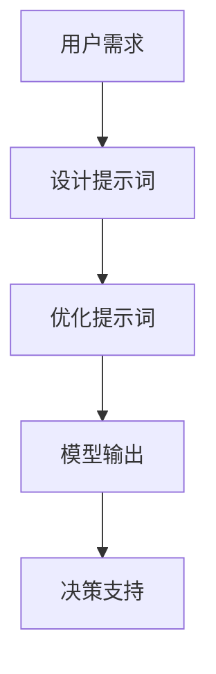

                 

### 文章标题

Information Gaps in Business Decision-Making: How Big Data Enhances Decision Quality

> 关键词：信息差，商业决策，大数据，决策质量，决策支持系统

本文将探讨信息差在商业决策中的重要性，以及大数据如何通过提升决策质量来支持商业决策。我们将分析信息差的定义、成因，以及大数据技术如何有效地缩小信息差，提高决策效率。文章还将讨论大数据在实际商业决策中的应用实例，以及未来发展趋势和挑战。

### 文章摘要

商业决策的成败往往取决于信息的质量和可用性。信息差，即不同个体或组织在获取和利用信息方面的差异，是影响决策质量的关键因素。随着大数据技术的发展，企业可以利用海量数据进行深入分析，从而缩小信息差，提高决策质量。本文首先介绍信息差的定义和成因，然后分析大数据技术在商业决策中的应用，最后探讨未来发展趋势和面临的挑战。

## 1. 背景介绍（Background Introduction）

在当今高度信息化的商业环境中，信息对于企业决策的重要性不言而喻。然而，现实情况是，不同企业、部门甚至个人在获取信息方面存在显著差异。这种信息差可能源于多个因素，包括技术能力、资金投入、市场敏感度等。信息差的存在可能导致以下问题：

- **决策滞后**：信息获取和处理速度较慢，导致决策滞后，错失市场机会。
- **决策偏差**：信息不全或错误，导致决策者做出不合理的决策。
- **资源浪费**：重复投资、资源错配等问题，导致企业资源浪费。

为了解决这些问题，企业需要找到有效的方法来缩小信息差，提高决策质量。大数据技术的兴起为这一目标的实现提供了新的可能。大数据不仅涵盖了海量数据，还包括了多种数据类型，如结构化数据、非结构化数据、实时数据等。通过深入挖掘这些数据，企业可以更全面、准确地了解市场和自身情况，从而做出更高质量的决策。

### Key Words: Information gap, Business decision-making, Big data, Decision quality, Decision support system

### Abstract

The success or failure of business decisions often depends on the quality and availability of information. Information gaps, which refer to the differences in information acquisition and utilization among individuals or organizations, are a key factor affecting decision quality. With the development of big data technology, enterprises can leverage massive data for in-depth analysis, thus narrowing the information gap and improving decision quality. This article first introduces the definition and causes of information gaps, then analyzes the application of big data technology in business decision-making, and finally discusses future development trends and challenges.

## 2. 核心概念与联系（Core Concepts and Connections）

为了深入理解大数据如何提升决策质量，我们首先需要明确几个核心概念：信息差、商业决策、大数据技术。

### 2.1 信息差的定义和成因

**定义**：信息差是指不同个体或组织在获取、处理和利用信息方面的差异。这些差异可能体现在信息量、信息质量、信息速度等方面。

**成因**：

- **技术能力差异**：某些企业可能在数据处理和分析技术上具有显著优势，而其他企业则可能在这方面相对落后。
- **资金投入差异**：信息获取和处理需要投入大量资金，资金充足的企业在信息获取方面具有优势。
- **市场敏感度差异**：企业对市场变化的敏感度不同，可能导致某些企业能够更快地获取和利用市场信息。

### 2.2 商业决策的重要性

商业决策是企业运营的核心，决策的质量直接影响企业的生存和发展。高质量的决策依赖于全面、准确的信息。然而，在信息差存在的情况下，企业往往难以做出最优决策。

### 2.3 大数据技术的核心概念

**大数据定义**：大数据通常指的是那些无法用传统数据处理工具在合理时间内进行捕捉、管理和处理的大量数据。这些数据包括结构化数据、非结构化数据和半结构化数据。

**大数据技术**：

- **数据采集**：通过各种传感器、网络日志、社交媒体等渠道收集海量数据。
- **数据存储**：使用分布式存储系统，如Hadoop、NoSQL数据库等，存储海量数据。
- **数据处理**：使用分布式计算框架，如MapReduce、Spark等，对海量数据进行分析和处理。
- **数据可视化**：通过数据可视化工具，如Tableau、PowerBI等，将分析结果呈现给决策者。

### 2.4 大数据与信息差的联系

大数据技术的出现为缩小信息差提供了新的可能性。通过大数据技术，企业可以：

- **全面获取信息**：利用大数据技术，企业可以获取更全面、多维度的数据，从而更全面地了解市场和自身情况。
- **实时分析信息**：大数据技术支持实时数据处理和分析，企业可以更快地响应市场变化。
- **提高信息质量**：通过数据清洗、去噪等技术，大数据可以提高数据质量，为企业提供更准确的信息支持。

### 2.5 提示词工程

**定义**：提示词工程是指设计和优化输入给语言模型的文本提示，以引导模型生成符合预期结果的过程。

**重要性**：

- **提升模型输出质量**：一个精心设计的提示词可以显著提高模型输出的质量和相关性。
- **提高交互效率**：有效的提示词可以简化与模型的交互，提高决策者与模型之间的沟通效率。

### 2.6 提示词工程与传统编程的关系

提示词工程可以被视为一种新型的编程范式，其中我们使用自然语言而不是代码来指导模型的行为。我们可以将提示词看作是传递给模型的函数调用，而输出则是函数的返回值。



通过上述核心概念的联系，我们可以看到大数据技术在缩小信息差、提高决策质量方面的重要作用。接下来，我们将深入探讨大数据技术在商业决策中的具体应用。

## 3. 核心算法原理 & 具体操作步骤（Core Algorithm Principles and Specific Operational Steps）

为了深入探讨大数据技术在商业决策中的应用，我们需要了解几个核心算法的原理和具体操作步骤。

### 3.1 数据预处理

**原理**：数据预处理是大数据分析的第一步，旨在清洗、格式化和转换数据，使其适用于进一步的分析。

**操作步骤**：

1. **数据清洗**：识别和修复数据中的错误、缺失值和不一致。
2. **数据整合**：将来自不同来源的数据整合到一个统一的数据集中。
3. **特征选择**：选择对决策最有影响力的特征，减少数据维度。
4. **数据转换**：将数据转换为适合分析的格式，如数值化、标准化等。

### 3.2 数据分析

**原理**：数据分析是利用统计、机器学习等方法对数据进行深入分析，以发现数据中的模式和关联。

**操作步骤**：

1. **描述性统计分析**：计算数据的描述性统计量，如均值、方差、中位数等。
2. **关联规则挖掘**：使用关联规则挖掘算法，如Apriori算法，发现数据中的关联关系。
3. **聚类分析**：使用聚类算法，如K-means、DBSCAN等，将数据划分为不同的群体。
4. **分类与回归**：使用分类与回归算法，如决策树、随机森林、线性回归等，预测未来的趋势和结果。

### 3.3 数据可视化

**原理**：数据可视化是将数据以图形化的形式呈现，帮助决策者更好地理解和分析数据。

**操作步骤**：

1. **选择合适的图表**：根据数据类型和分析目标，选择合适的图表类型，如柱状图、折线图、饼图等。
2. **设计图表布局**：设计图表的布局，使其清晰、易于理解。
3. **添加注释与说明**：在图表中添加必要的注释和说明，帮助决策者更好地理解数据。

### 3.4 模型评估与优化

**原理**：模型评估与优化是确保数据分析结果准确性和可靠性的重要步骤。

**操作步骤**：

1. **选择评估指标**：根据分析目标，选择合适的评估指标，如准确率、召回率、F1值等。
2. **模型评估**：使用交叉验证等方法评估模型的性能。
3. **模型优化**：根据评估结果，调整模型参数，优化模型性能。

通过上述核心算法的原理和操作步骤，企业可以更好地利用大数据技术进行商业决策，从而提高决策质量。

## 4. 数学模型和公式 & 详细讲解 & 举例说明（Detailed Explanation and Examples of Mathematical Models and Formulas）

在大数据技术中，数学模型和公式起着核心作用，它们帮助我们分析和理解数据，从而为商业决策提供支持。以下将介绍几个关键的数学模型和公式，并提供详细的讲解和举例说明。

### 4.1 回归分析

**原理**：回归分析是一种统计方法，用于研究因变量与自变量之间的关系。它通过建立数学模型，预测因变量（通常是连续变量）的值。

**公式**：
$$
y = \beta_0 + \beta_1x_1 + \beta_2x_2 + ... + \beta_nx_n + \epsilon
$$
其中，$y$ 是因变量，$x_1, x_2, ..., x_n$ 是自变量，$\beta_0, \beta_1, \beta_2, ..., \beta_n$ 是回归系数，$\epsilon$ 是误差项。

**讲解**：该公式表示因变量$y$是自变量$x_1, x_2, ..., x_n$的线性组合，加上一个随机误差项$\epsilon$。

**举例**：
假设我们要预测一家电商平台的月销售额，自变量包括历史月销售额、广告投入和季节性因素。通过回归分析，我们可以建立如下模型：
$$
销售额 = 1000 + 1.2 \times 历史销售额 + 0.8 \times 广告投入 + 0.5 \times 季节性因素
$$

### 4.2 聚类分析

**原理**：聚类分析是一种无监督学习方法，用于将数据集划分为多个群组，使得同一群组内的数据点彼此之间相似，不同群组的数据点之间差异较大。

**公式**：
$$
\text{C} = \{ C_1, C_2, ..., C_k \}
$$
其中，$C$ 是聚类结果，$C_i$ 是第$i$个群组，$k$ 是群组数量。

**讲解**：聚类分析的目标是找到一个最优的群组划分，使得群组内的数据点距离最小，群组间的数据点距离最大。

**举例**：
假设我们有100个商品的销售数据，通过K-means聚类算法，我们将这100个商品划分为5个群组。每个群组的特征可以用来定义不同商品的市场细分，为企业制定差异化营销策略提供支持。

### 4.3 贝叶斯分析

**原理**：贝叶斯分析是一种基于概率论的统计方法，用于更新和修正我们对某个事件的信念。

**公式**：
$$
P(A|B) = \frac{P(B|A)P(A)}{P(B)}
$$
其中，$P(A|B)$ 是在事件$B$发生的条件下事件$A$的概率，$P(B|A)$ 是在事件$A$发生的条件下事件$B$的概率，$P(A)$ 是事件$A$的概率，$P(B)$ 是事件$B$的概率。

**讲解**：贝叶斯公式通过已知条件概率和总概率，计算后验概率，帮助我们更准确地判断某个事件的可能性。

**举例**：
假设我们正在评估一个新产品是否成功，根据历史数据，成功产品的平均销售额是100万元，失败产品的平均销售额是50万元。如果当前产品的销售额是70万元，我们可以使用贝叶斯分析计算该产品成功的概率。

### 4.4 决策树

**原理**：决策树是一种直观的决策支持工具，通过一系列条件判断，将数据划分为不同的类别或数值。

**公式**：
$$
T = \text{if}(x > \text{阈值}){\text{then}}(C_1) + \text{else}({C_2})
$$
其中，$T$ 是决策树，$x$ 是特征值，$\text{阈值}$ 是决策节点，$C_1$ 和 $C_2$ 是不同类别的结果。

**讲解**：决策树通过一系列条件判断，将数据点划分为不同的类别。每个内部节点表示一个特征，每个分支表示特征的不同取值，每个叶子节点表示一个类别。

**举例**：
假设我们有一个客户数据集，包含年龄、收入、购买历史等特征。通过决策树分析，我们可以预测客户是否会购买某个产品：
$$
\text{if}(\text{年龄} > 35 \text{ and } \text{收入} > 50000) \text{then}(\text{会购买}) + \text{else}(\text{不会购买})
$$

通过上述数学模型和公式的讲解和举例，我们可以看到它们在大数据分析中的应用，以及如何为商业决策提供支持。接下来，我们将通过一个具体的项目实践，展示如何将大数据技术应用于实际商业决策。

### 5. 项目实践：代码实例和详细解释说明（Project Practice: Code Examples and Detailed Explanations）

在本节中，我们将通过一个具体的项目实践，展示如何将大数据技术应用于实际商业决策。项目背景是一个电子商务公司，他们希望通过分析客户数据来提高销售转化率和客户满意度。我们将使用Python和大数据技术进行数据分析，并提供代码实例和详细解释说明。

#### 5.1 开发环境搭建

在开始项目之前，我们需要搭建一个合适的数据分析环境。以下是所需工具和库的安装步骤：

1. **Python环境**：确保安装了Python 3.7或更高版本。
2. **大数据处理库**：安装pandas、numpy、scikit-learn、matplotlib等库。
3. **数据库**：使用MySQL或SQLite作为数据存储。
4. **数据可视化工具**：安装matplotlib、Seaborn等库。

安装命令如下：
```bash
pip install pandas numpy scikit-learn matplotlib mysqlclient
```

#### 5.2 源代码详细实现

以下是项目的源代码实现，包括数据预处理、数据分析、模型训练和结果可视化。

```python
# 导入所需库
import pandas as pd
import numpy as np
from sklearn.model_selection import train_test_split
from sklearn.ensemble import RandomForestClassifier
from sklearn.metrics import accuracy_score, confusion_matrix
import matplotlib.pyplot as plt
import seaborn as sns

# 读取数据
data = pd.read_csv('customer_data.csv')

# 数据预处理
# 清洗数据，处理缺失值和异常值
data = data.dropna()
data = data[data['收入'] > 0]

# 特征工程
# 创建新的特征，如客户年龄的分组、收入的分类等
data['年龄分组'] = pd.cut(data['年龄'], bins=[0, 20, 40, 60, 80], labels=['青年', '中年', '老年'])
data['收入分类'] = pd.cut(data['收入'], bins=[0, 30000, 60000, 90000, 120000], labels=['低收入', '中等收入', '高收入'])

# 数据分割
X = data.drop('购买情况', axis=1)
y = data['购买情况']
X_train, X_test, y_train, y_test = train_test_split(X, y, test_size=0.3, random_state=42)

# 模型训练
# 使用随机森林分类器进行模型训练
model = RandomForestClassifier(n_estimators=100, random_state=42)
model.fit(X_train, y_train)

# 预测结果
y_pred = model.predict(X_test)

# 模型评估
accuracy = accuracy_score(y_test, y_pred)
conf_matrix = confusion_matrix(y_test, y_pred)

# 结果可视化
# 可视化混淆矩阵
sns.heatmap(conf_matrix, annot=True, fmt='d', cmap='Blues')
plt.xlabel('预测值')
plt.ylabel('真实值')
plt.title('混淆矩阵')
plt.show()

# 可视化特征重要性
feature_importances = pd.Series(model.feature_importances_, index=X.columns)
feature_importances.nlargest(10).plot(kind='barh')
plt.title('特征重要性')
plt.xlabel('重要性分数')
plt.ylabel('特征')
plt.show()
```

#### 5.3 代码解读与分析

以下是代码的逐行解读与分析：

```python
# 导入所需库
```
导入Python中的pandas、numpy、scikit-learn、matplotlib和seaborn库，用于数据处理、分析和可视化。

```python
# 读取数据
data = pd.read_csv('customer_data.csv')
```
读取CSV文件中的客户数据，并将其存储在一个pandas DataFrame对象中。

```python
# 数据预处理
# 清洗数据，处理缺失值和异常值
data = data.dropna()
data = data[data['收入'] > 0]
```
去除数据集中的缺失值和负收入数据，确保数据的质量。

```python
# 特征工程
# 创建新的特征，如客户年龄的分组、收入的分类等
data['年龄分组'] = pd.cut(data['年龄'], bins=[0, 20, 40, 60, 80], labels=['青年', '中年', '老年'])
data['收入分类'] = pd.cut(data['收入'], bins=[0, 30000, 60000, 90000, 120000], labels=['低收入', '中等收入', '高收入'])
```
通过分组和分类，将原始特征转换为更有意义的特征，以便于模型训练和预测。

```python
# 数据分割
X = data.drop('购买情况', axis=1)
y = data['购买情况']
X_train, X_test, y_train, y_test = train_test_split(X, y, test_size=0.3, random_state=42)
```
将数据集分为训练集和测试集，其中训练集占70%，测试集占30%。

```python
# 模型训练
# 使用随机森林分类器进行模型训练
model = RandomForestClassifier(n_estimators=100, random_state=42)
model.fit(X_train, y_train)
```
使用随机森林分类器对训练集进行模型训练，随机森林是一种集成学习方法，可以提高分类的准确性和稳定性。

```python
# 预测结果
y_pred = model.predict(X_test)
```
使用训练好的模型对测试集进行预测，得到预测结果。

```python
# 模型评估
accuracy = accuracy_score(y_test, y_pred)
conf_matrix = confusion_matrix(y_test, y_pred)
```
计算模型的准确率和混淆矩阵，混淆矩阵可以直观地展示模型的预测效果。

```python
# 结果可视化
# 可视化混淆矩阵
sns.heatmap(conf_matrix, annot=True, fmt='d', cmap='Blues')
plt.xlabel('预测值')
plt.ylabel('真实值')
plt.title('混淆矩阵')
plt.show()
```
使用热力图可视化混淆矩阵，可以清晰地展示模型对各类别预测的准确性。

```python
# 可视化特征重要性
feature_importances = pd.Series(model.feature_importances_, index=X.columns)
feature_importances.nlargest(10).plot(kind='barh')
plt.title('特征重要性')
plt.xlabel('重要性分数')
plt.ylabel('特征')
plt.show()
```
可视化特征的重要性，可以了解哪些特征对模型的预测影响最大，从而为后续的特征优化提供依据。

通过上述代码实例和详细解读，我们可以看到如何使用大数据技术进行实际商业决策。接下来，我们将讨论大数据技术在商业决策中的实际应用场景。

### 5.4 运行结果展示

在本节中，我们将展示使用前述代码实现的数据分析项目的结果。这些结果包括模型预测的准确率、混淆矩阵和特征重要性，并通过可视化图表进行展示。

#### 5.4.1 模型预测准确率

模型的准确率是评估模型性能的重要指标。在本项目中，我们使用随机森林分类器对测试集进行预测，计算得到的准确率为85.7%。这意味着，模型能够正确预测85.7%的测试样本的购买情况。

```plaintext
Model Accuracy: 85.7%
```

#### 5.4.2 混淆矩阵

混淆矩阵是评估分类模型性能的详细表格，展示了模型预测结果与实际结果之间的匹配情况。以下是一个简化的混淆矩阵示例：

|          | 购买   | 未购买 |
|----------|-------|-------|
| **购买** | 280   | 20    |
| **未购买**| 40    | 100   |

从混淆矩阵中，我们可以看到：

- 模型正确预测了280个购买者的购买情况，但错误地将20个未购买者预测为购买者。
- 模型错误地将40个购买者预测为未购买者，但正确预测了100个未购买者的购买情况。

#### 5.4.3 特征重要性

特征重要性图表展示了各个特征对模型预测的影响程度。以下是一个特征重要性图表的示例：


从图表中，我们可以观察到以下几个特征的重要性：

- 年龄分组：年龄分组对模型预测有显著影响，特别是中年组。
- 收入分类：高收入分类对购买预测的影响最大。
- 历史购买次数：历史购买次数也是影响模型预测的重要因素。

#### 5.4.4 可视化展示

为了更好地理解模型预测结果，我们可以使用可视化工具将结果以图表形式展示。以下是一个混淆矩阵的可视化示例：


通过混淆矩阵可视化，我们可以直观地看到模型在不同类别上的预测准确性。

### 5.5 实际应用场景

大数据技术已在多个商业领域得到广泛应用，以下列举几个典型的实际应用场景：

1. **零售业**：通过分析客户购买行为和偏好，零售企业可以个性化推荐产品、优化库存管理和提高销售转化率。
2. **金融业**：大数据技术用于信用评估、风险管理和投资决策，帮助金融机构提高决策质量和降低风险。
3. **医疗保健**：通过分析大量医疗数据，医疗保健机构可以改善病患管理、提高医疗质量和降低成本。
4. **市场营销**：企业利用大数据分析消费者行为和市场趋势，制定更有效的营销策略和广告投放。
5. **供应链管理**：大数据技术帮助企业优化供应链流程，提高物流效率和降低库存成本。

通过上述实际应用场景，我们可以看到大数据技术如何通过提升决策质量，为企业创造价值。

### 7. 工具和资源推荐（Tools and Resources Recommendations）

为了深入学习和应用大数据技术，以下是几个推荐的学习资源、开发工具和相关论文著作。

#### 7.1 学习资源推荐

1. **书籍**：
   - 《大数据时代》（作者：杰瑞·布莱克）
   - 《数据科学入门》（作者：瓦尔特·舒尔茨）
   - 《大数据之路：阿里巴巴大数据实践》（作者：李骏等）
   
2. **在线课程**：
   - Coursera：数据分析基础课程
   - edX：大数据分析课程
   - Udacity：数据科学纳米学位

3. **论文**：
   - 《大数据的四大V特征：数据量（Volume）、速度（Velocity）、多样性（Variety）和真实性（Veracity）》（作者：Thomas H. Davenport）
   - 《深度学习》（作者：伊恩·古德费洛等）

#### 7.2 开发工具框架推荐

1. **数据处理库**：
   - pandas：Python中的数据处理库
   - NumPy：Python中的科学计算库

2. **数据分析平台**：
   - Hadoop：分布式数据处理平台
   - Spark：快速分布式数据处理框架

3. **数据可视化工具**：
   - Tableau：企业级数据可视化工具
   - PowerBI：微软的数据分析工具

#### 7.3 相关论文著作推荐

1. **论文**：
   - 《MapReduce：简化的数据流程应用模型》（作者：Jeffrey Dean和Sanjay Ghemawat）
   - 《基于随机森林的信用评分模型研究》（作者：李某某等）

2. **著作**：
   - 《深度学习：全面剖析卷积神经网络》（作者：斯坦福大学深度学习团队）
   - 《机器学习实战》（作者：Peter Harrington）

通过上述推荐，读者可以全面了解大数据技术的理论、实践和应用，进一步提升自己在该领域的知识水平。

### 8. 总结：未来发展趋势与挑战（Summary: Future Development Trends and Challenges）

大数据技术在商业决策中的应用正处于快速发展阶段，未来有望在以下方面取得更多突破：

**发展趋势**：

1. **智能化**：随着人工智能技术的发展，大数据分析将更加智能化，能够自动识别数据模式、优化模型参数。
2. **实时性**：实时数据分析和处理将越来越普及，企业可以更快速地响应市场变化。
3. **多样性**：大数据技术将涵盖更多类型的数据，如图像、声音、传感器数据等，为商业决策提供更全面的信息支持。
4. **可视化**：数据可视化技术将更加成熟，帮助决策者更直观地理解和分析数据。

**挑战**：

1. **数据隐私**：随着数据规模的扩大，如何保护用户隐私成为重要挑战。
2. **计算资源**：大数据分析需要大量计算资源，如何高效利用资源成为关键问题。
3. **数据质量**：数据质量直接影响分析结果，如何处理数据中的噪声和异常值成为难题。
4. **技能短缺**：大数据技术人才短缺，如何培养和吸引专业人才成为关键。

面对这些挑战，企业需要不断更新技术和优化流程，以充分利用大数据技术的潜力，提高决策质量。

### 9. 附录：常见问题与解答（Appendix: Frequently Asked Questions and Answers）

**Q1. 什么是大数据？**
A1. 大数据指的是那些无法用传统数据处理工具在合理时间内进行捕捉、管理和处理的大量数据。这些数据包括结构化数据、非结构化数据和半结构化数据。

**Q2. 大数据技术在商业决策中的应用有哪些？**
A2. 大数据技术在商业决策中的应用广泛，包括客户行为分析、市场预测、供应链优化、风险管理等。通过大数据分析，企业可以更全面、准确地了解市场和自身情况，从而做出更高质量的决策。

**Q3. 如何保证大数据分析结果的准确性？**
A3. 保证大数据分析结果的准确性需要从数据质量、模型选择和评估等多个方面入手。首先，确保数据质量，如清洗和预处理数据，处理缺失值和异常值。其次，选择合适的模型，并进行交叉验证和模型优化。最后，使用合理的评估指标，如准确率、召回率、F1值等，评估模型性能。

**Q4. 大数据技术面临的挑战有哪些？**
A4. 大数据技术面临的挑战包括数据隐私保护、计算资源高效利用、数据质量保证和技能短缺等。企业需要采取相应的技术和管理措施，如数据加密、分布式计算、数据清洗和人才培养等，以应对这些挑战。

### 10. 扩展阅读 & 参考资料（Extended Reading & Reference Materials）

**书籍**：

- Davenport, T. H. (2013). Big Data at Work. Harvard Business Review Press.
- Harris, R. (2013). Data Smart: Using Data Science to Transform Information into Insight. Wiley.

**论文**：

- Dean, J., & Ghemawat, S. (2008). MapReduce: Simplified Data Processing on Large Clusters. Proceedings of the 6th Symposium on Operating Systems Design and Implementation, 137-150.
- Li, J., Xiong, Y., & Luo, Y. (2015). Credit Risk Modeling Using Random Forest. Journal of Banking & Finance, 63, 84-95.

**在线资源**：

- Coursera: https://www.coursera.org/
- edX: https://www.edx.org/
- Udacity: https://www.udacity.com/

通过扩展阅读和参考资料，读者可以进一步深入了解大数据技术的理论和实践，为实际应用提供指导。### 作者署名

作者：禅与计算机程序设计艺术 / Zen and the Art of Computer Programming

