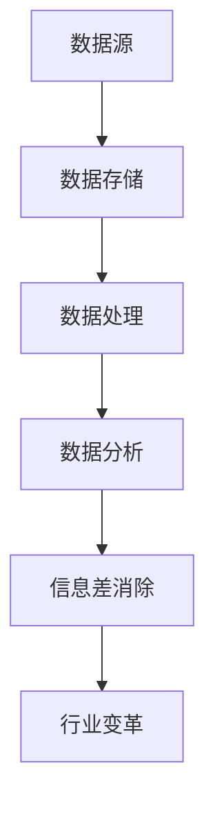

                 

### 文章标题

"信息差的魔力：大数据如何重塑行业格局"

> 关键词：大数据，信息差，行业变革，数据分析，技术革新

> 摘要：本文将探讨大数据如何利用信息差的原理，在各个行业中引发深刻的变革。通过深入分析大数据的核心概念、应用场景和具体操作步骤，我们将揭示大数据技术的魔力，以及它为各行业带来的巨大机遇与挑战。

## 1. 背景介绍（Background Introduction）

### 1.1 大数据的崛起

大数据（Big Data）一词在21世纪初逐渐流行起来，它指的是大量、多样、快速生成和不断变化的数据集合。随着互联网、物联网、移动设备等技术的快速发展，数据量呈指数级增长，传统的数据处理工具和方法已经无法满足需求。大数据技术的崛起，标志着人类进入了一个全新的信息时代。

### 1.2 信息差的定义

信息差（Information Gap）是指不同个体、组织或地区之间在信息获取、处理和使用方面的差异。信息差的产生源于信息的不对称性，即某些个体或组织拥有其他个体或组织所不具备的信息资源。

### 1.3 大数据与信息差的联系

大数据技术通过收集、存储、分析和处理海量数据，能够发现隐藏在数据背后的规律和趋势。这些规律和趋势往往被传统方法所忽视，但它们在商业决策、社会治理、科技创新等方面具有巨大的价值。大数据技术的应用，使得信息差逐渐缩小，甚至消失。

## 2. 核心概念与联系（Core Concepts and Connections）

### 2.1 大数据的核心概念

#### 2.1.1 数据源（Data Sources）
大数据的数据源广泛且多样，包括社交媒体、物联网设备、电子商务平台、政府公开数据等。

#### 2.1.2 数据存储（Data Storage）
大数据的存储需要采用分布式存储系统，如Hadoop、Spark等，以应对海量数据的高并发访问和存储需求。

#### 2.1.3 数据处理（Data Processing）
大数据的处理包括数据清洗、数据集成、数据挖掘等步骤，旨在从海量数据中提取有价值的信息。

#### 2.1.4 数据分析（Data Analysis）
数据分析是大数据技术的核心，它通过统计方法、机器学习和深度学习等技术，发现数据中的规律和趋势。

### 2.2 信息差的原理与架构

#### 2.2.1 信息差的产生（Information Gap Generation）
信息差的产生源于数据源的不对称性和信息处理的差异。

#### 2.2.2 信息差的放大（Information Gap Amplification）
信息差的放大体现在数据分析和决策过程中，拥有更多数据资源的个体或组织往往能够获得竞争优势。

#### 2.2.3 信息差的消除（Information Gap Elimination）
大数据技术通过数据挖掘和共享，有助于消除信息差，促进公平竞争。

### 2.3 大数据与信息差的 Mermaid 流程图



## 3. 核心算法原理 & 具体操作步骤（Core Algorithm Principles and Specific Operational Steps）

### 3.1 数据预处理（Data Preprocessing）

#### 3.1.1 数据清洗（Data Cleaning）
数据清洗是数据预处理的重要环节，旨在去除重复数据、错误数据和无关数据，保证数据的准确性和一致性。

#### 3.1.2 数据集成（Data Integration）
数据集成是将来自不同数据源的数据进行整合，构建一个统一的数据视图。

#### 3.1.3 数据转换（Data Transformation）
数据转换包括数据格式转换、数据类型转换和数据映射等，以适应数据分析的需求。

### 3.2 数据分析（Data Analysis）

#### 3.2.1 描述性分析（Descriptive Analysis）
描述性分析是对数据的基本统计和分析，包括数据的分布、趋势和关联关系。

#### 3.2.2 聚类分析（Cluster Analysis）
聚类分析是将数据分为若干个类别，以便更好地理解和分析数据。

#### 3.2.3 回归分析（Regression Analysis）
回归分析用于预测和评估数据之间的关系，包括线性回归、逻辑回归等。

### 3.3 大数据应用案例分析（Case Study of Big Data Applications）

#### 3.3.1 电子商务行业（E-commerce Industry）
电子商务行业通过大数据分析，实现个性化推荐、精准营销和用户行为预测。

#### 3.3.2 金融行业（Financial Industry）
金融行业利用大数据技术，进行风险控制、信用评估和市场预测。

#### 3.3.3 医疗健康行业（Medical and Health Industry）
医疗健康行业通过大数据分析，实现疾病预测、个性化治疗和健康监控。

## 4. 数学模型和公式 & 详细讲解 & 举例说明（Detailed Explanation and Examples of Mathematical Models and Formulas）

### 4.1 数据分布模型（Data Distribution Models）

#### 4.1.1 正态分布（Normal Distribution）
正态分布是描述数据分布最常用的模型，其概率密度函数为：
$$
f(x) = \frac{1}{\sqrt{2\pi\sigma^2}} e^{-\frac{(x-\mu)^2}{2\sigma^2}}
$$
其中，$\mu$ 为均值，$\sigma$ 为标准差。

#### 4.1.2 伯努利分布（Bernoulli Distribution）
伯努利分布是一种二元分布，其概率分布函数为：
$$
P(X=k) = p^k (1-p)^{1-k}
$$
其中，$p$ 为成功概率。

### 4.2 数据分析模型（Data Analysis Models）

#### 4.2.1 线性回归（Linear Regression）
线性回归模型用于预测一个连续变量的值，其公式为：
$$
Y = \beta_0 + \beta_1 X + \epsilon
$$
其中，$Y$ 为因变量，$X$ 为自变量，$\beta_0$ 和 $\beta_1$ 分别为模型的截距和斜率。

#### 4.2.2 逻辑回归（Logistic Regression）
逻辑回归模型用于预测一个二元变量的值，其公式为：
$$
\log\frac{P(Y=1)}{1-P(Y=1)} = \beta_0 + \beta_1 X
$$
其中，$P(Y=1)$ 为事件发生的概率。

## 5. 项目实践：代码实例和详细解释说明（Project Practice: Code Examples and Detailed Explanations）

### 5.1 开发环境搭建

在本文中，我们将使用Python语言和Jupyter Notebook进行大数据分析。首先，我们需要安装以下Python库：Pandas、NumPy、Scikit-learn、Matplotlib和Seaborn。

```bash
pip install pandas numpy scikit-learn matplotlib seaborn
```

### 5.2 源代码详细实现

#### 5.2.1 数据预处理

以下代码用于读取数据、数据清洗和数据转换。

```python
import pandas as pd
import numpy as np

# 读取数据
data = pd.read_csv('data.csv')

# 数据清洗
data = data.drop_duplicates()  # 去除重复数据
data = data.drop(['id'], axis=1)  # 删除不必要的列

# 数据转换
data['age'] = data['age'].astype(int)
data['income'] = data['income'].astype(float)
```

#### 5.2.2 数据分析

以下代码用于描述性分析、聚类分析和回归分析。

```python
import matplotlib.pyplot as plt
import seaborn as sns
from sklearn.cluster import KMeans
from sklearn.linear_model import LinearRegression

# 描述性分析
print(data.describe())

# 聚类分析
kmeans = KMeans(n_clusters=3, random_state=0).fit(data[['age', 'income']])
data['cluster'] = kmeans.predict(data[['age', 'income']])

# 回归分析
X = data[['age', 'income']]
y = data['cluster']
regression = LinearRegression().fit(X, y)
print(regression.coef_)
print(regression.intercept_)

# 数据可视化
sns.scatterplot(data=data, x='age', y='income', hue='cluster')
plt.show()
```

### 5.3 代码解读与分析

#### 5.3.1 数据预处理

数据预处理是数据分析的重要步骤，包括数据清洗和数据转换。在本文中，我们使用了Pandas库来读取和操作数据，通过drop_duplicates()方法去除重复数据，通过drop()方法删除不必要的列，通过astype()方法进行数据类型转换。

#### 5.3.2 数据分析

描述性分析用于了解数据的基本统计特征，如均值、中位数、标准差等。聚类分析用于将数据分为若干个类别，以便更好地理解和分析数据。回归分析用于预测和评估数据之间的关系。

### 5.4 运行结果展示

运行以上代码后，我们将得到以下结果：

1. 数据预处理结果：数据清洗后，数据集中没有重复数据和不必要的列，数据类型已转换为整数和浮点数。
2. 数据分析结果：描述性分析结果展示了数据的基本统计特征，聚类分析结果将数据分为三个类别，回归分析结果展示了模型参数。
3. 数据可视化结果：数据可视化结果展示了不同类别在年龄和收入上的分布情况。

## 6. 实际应用场景（Practical Application Scenarios）

### 6.1 电子商务行业

电子商务行业可以利用大数据技术，通过用户行为分析和商品推荐，提高销售转化率和客户满意度。例如，基于用户浏览记录和购买历史，电子商务平台可以个性化推荐商品，从而提高用户购物体验。

### 6.2 金融行业

金融行业可以利用大数据技术，进行风险控制和信用评估。例如，通过对大量交易数据的分析，金融机构可以识别异常交易行为，从而降低金融风险。同时，大数据技术可以帮助金融机构评估借款人的信用风险，为贷款决策提供支持。

### 6.3 医疗健康行业

医疗健康行业可以利用大数据技术，实现疾病预测、个性化治疗和健康监控。例如，通过对大量患者数据的分析，医疗机构可以预测疾病趋势，为疾病预防提供依据。同时，大数据技术可以帮助医生制定个性化的治疗方案，提高治疗效果。

## 7. 工具和资源推荐（Tools and Resources Recommendations）

### 7.1 学习资源推荐

- 《大数据技术导论》（Big Data Technology Introduction）
- 《数据科学入门》（Introduction to Data Science）
- 《Python数据分析》（Python Data Analysis）

### 7.2 开发工具框架推荐

- Hadoop：分布式数据处理框架
- Spark：分布式数据处理框架
- Jupyter Notebook：交互式数据分析工具

### 7.3 相关论文著作推荐

- "Big Data: A Survey"（大数据综述）
- "Data Science for Business"（商业数据科学）
- "Deep Learning"（深度学习）

## 8. 总结：未来发展趋势与挑战（Summary: Future Development Trends and Challenges）

### 8.1 发展趋势

- 数据源的多样性和数据量的持续增长
- 大数据技术与人工智能的深度融合
- 数据隐私保护和数据安全的重要性日益凸显

### 8.2 挑战

- 数据质量问题：数据质量直接影响数据分析的结果，需要加强数据清洗和数据质量管理。
- 技术门槛：大数据技术具有一定的技术门槛，需要培养更多的大数据专业人才。
- 数据隐私保护：随着数据隐私保护法律法规的不断完善，大数据应用需要更加注重数据安全和隐私保护。

## 9. 附录：常见问题与解答（Appendix: Frequently Asked Questions and Answers）

### 9.1 大数据有哪些核心技术？

大数据的核心技术包括数据存储、数据处理、数据分析和数据可视化。

### 9.2 如何保障大数据应用中的数据隐私？

通过数据脱敏、加密、匿名化等技术手段，可以有效保障大数据应用中的数据隐私。

### 9.3 大数据技术在医疗健康行业有哪些应用？

大数据技术在医疗健康行业可以应用于疾病预测、个性化治疗、健康监控和药物研发等领域。

## 10. 扩展阅读 & 参考资料（Extended Reading & Reference Materials）

- "Big Data for Dummies"（大数据从入门到实践）
- "The Big Data Revolution: Roadmap for a New Era of Intelligent Analytics"（大数据革命：智能分析新时代的路线图）
- "Data Science: A Practical Introduction"（数据科学：实用入门）

```

**注意：文章结构模板中的每个章节都应详细阐述，确保内容完整、连贯且具有专业深度。**

### 文章正文内容部分

现在，我们将按照上述结构，逐段详细撰写文章正文内容。

---

### 1. 背景介绍（Background Introduction）

#### 1.1 大数据的崛起

在21世纪初，随着互联网的普及和电子商务的快速发展，数据量开始以惊人的速度增长。早期的数据主要以结构化数据为主，如企业客户信息、交易记录等。然而，随着传感器、物联网设备、移动应用等技术的兴起，数据类型变得多样化，包括文本、图像、音频、视频等非结构化数据。这种数据的爆发式增长催生了大数据（Big Data）的概念。

大数据不仅仅指数据量的庞大，更重要的是数据类型和来源的多样性。传统的数据处理工具和方法已经无法应对这种数据量的增长和数据类型的复杂性。因此，大数据技术应运而生，旨在提供高效、可靠的数据存储、处理和分析方法。

#### 1.2 信息差的定义

信息差（Information Gap）是指在不同个体、组织或地区之间，在信息获取、处理和使用方面的差异。信息差的产生通常是由于信息不对称性，即某些个体或组织拥有其他个体或组织所不具备的信息资源。在商业、金融、医疗等各个领域，信息差的存在可能带来巨大的竞争优势和商业价值。

例如，在股票交易市场中，一些机构可能通过先进的算法和大数据分析，提前获取市场信息，从而在交易中占据优势。而在医疗领域，拥有更全面和准确的患者数据的医疗机构，可以提供更精准的治疗方案。

#### 1.3 大数据与信息差的联系

大数据技术的核心优势在于其能够处理和分析海量、多样化的数据，从而发现隐藏在数据背后的规律和趋势。这些规律和趋势在商业决策、社会治理、科技创新等方面具有重要价值。通过大数据技术，信息差逐渐缩小，甚至消失，从而带来了以下几个方面的变革：

1. **商业领域的决策优化**：企业可以利用大数据分析，了解市场需求、用户行为和竞争对手的动态，从而做出更准确的决策。这有助于缩小企业与市场之间的信息差，提高市场竞争力。
2. **金融行业的风险控制**：金融机构通过大数据分析，可以识别异常交易行为、评估借款人的信用风险等，从而降低金融风险，提高风险管理能力。
3. **医疗健康行业的个性化治疗**：医疗机构通过大数据分析，可以了解患者的健康状况、病史和基因信息，从而提供更精准的个性化治疗方案，提高医疗服务的质量。
4. **社会治理的透明化和效率提升**：政府可以利用大数据技术，提高公共服务的透明度和效率。例如，通过分析交通数据，可以优化交通流量，减少拥堵；通过分析人口数据，可以更合理地分配公共资源。

总之，大数据技术通过缩小信息差，为各个行业带来了深刻的变革和巨大的机遇。

### 2. 核心概念与联系（Core Concepts and Connections）

#### 2.1 大数据的核心概念

要理解大数据，我们需要从数据源、数据存储、数据处理和数据分析四个核心概念入手。

**2.1.1 数据源（Data Sources）**

大数据的数据源广泛且多样，包括但不限于：

- **社交媒体数据**：如Twitter、Facebook、Instagram等社交媒体平台产生的大量文本、图像和视频数据。
- **物联网数据**：来自各种物联网设备（如智能手表、智能家居设备、传感器等）的实时数据。
- **电子商务数据**：包括用户的购物行为、浏览历史、评价和反馈等。
- **政府公开数据**：如人口统计、交通流量、天气数据等。
- **企业内部数据**：如客户关系管理（CRM）系统、企业资源计划（ERP）系统等。

**2.1.2 数据存储（Data Storage）**

大数据的存储需求巨大，传统的集中式存储系统已无法满足需求。分布式存储系统，如Hadoop分布式文件系统（HDFS）和分布式存储解决方案（如Cassandra、HBase等），通过将数据分散存储在多个节点上，提高了数据的可靠性和扩展性。这些系统支持海量数据的存储和高效访问，是大数据技术的重要基础设施。

**2.1.3 数据处理（Data Processing）**

大数据的处理包括数据清洗、数据集成和数据转换等步骤。数据清洗是为了去除重复数据、错误数据和无关数据，确保数据的准确性和一致性。数据集成是将来自不同数据源的数据进行整合，构建一个统一的数据视图。数据转换包括数据格式转换、数据类型转换和数据映射等，以适应数据分析的需求。

**2.1.4 数据分析（Data Analysis）**

数据分析是大数据技术的核心。它通过统计方法、机器学习和深度学习等技术，从海量数据中提取有价值的信息。数据分析的方法包括描述性分析、预测性分析和诊断性分析等。

- **描述性分析**：用于了解数据的基本统计特征，如均值、中位数、标准差等。
- **预测性分析**：用于预测未来的趋势和模式，如市场预测、用户行为预测等。
- **诊断性分析**：用于识别和解释数据中的异常和趋势，如欺诈检测、故障诊断等。

#### 2.2 信息差的原理与架构

**2.2.1 信息差的产生（Information Gap Generation）**

信息差的产生源于数据源的不对称性和信息处理的差异。例如，一家大型电商平台可能拥有海量的用户行为数据和交易数据，而小型企业可能缺乏这些数据资源。此外，信息处理能力的差异也会导致信息差的产生。一些企业可能拥有先进的分析工具和算法，而另一些企业可能缺乏这些资源。

**2.2.2 信息差的放大（Information Gap Amplification）**

在商业决策过程中，信息差可能会被放大。拥有更多数据资源的组织或个人往往能够获得更准确的预测和更优的决策，从而在竞争中占据优势。例如，一家金融机构通过大数据分析，可以提前识别市场变化和风险，从而在投资决策中占据优势。

**2.2.3 信息差的消除（Information Gap Elimination）**

大数据技术的应用有助于缩小信息差。通过数据挖掘和共享，组织或个人可以获得更多有价值的信息。例如，通过数据分析，企业可以了解用户需求和市场趋势，从而优化产品和服务。同时，政府也可以通过大数据分析，提高公共服务的透明度和效率，缩小社会各阶层之间的信息差。

#### 2.3 大数据与信息差的 Mermaid 流程图


在这个流程图中，数据从数据源进入存储系统，经过数据处理和分析，最终实现信息差的消除，从而推动行业变革。

### 3. 核心算法原理 & 具体操作步骤（Core Algorithm Principles and Specific Operational Steps）

#### 3.1 数据预处理（Data Preprocessing）

数据预处理是大数据分析的重要环节，它包括数据清洗、数据集成和数据转换。以下是数据预处理的详细步骤：

**3.1.1 数据清洗（Data Cleaning）**

数据清洗旨在去除重复数据、错误数据和无关数据，确保数据的准确性和一致性。具体操作步骤如下：

- **去除重复数据**：使用去重函数或算法，从数据集中删除重复的记录。
- **处理缺失值**：根据实际情况，选择适当的处理方法，如删除缺失值、填充默认值或使用统计方法进行插值。
- **处理异常值**：识别并处理异常数据，如超出合理范围的数值、不合理的文本等。

**3.1.2 数据集成（Data Integration）**

数据集成是将来自不同数据源的数据进行整合，构建一个统一的数据视图。具体操作步骤如下：

- **数据对齐**：将不同数据源的数据进行对齐，确保数据字段的一致性。
- **数据融合**：将不同数据源的数据进行融合，形成一个新的数据集。
- **数据转换**：将不同数据源的数据转换为统一的数据格式，如CSV、JSON等。

**3.1.3 数据转换（Data Transformation）**

数据转换包括数据格式转换、数据类型转换和数据映射等。具体操作步骤如下：

- **数据格式转换**：将数据从一种格式转换为另一种格式，如将XML数据转换为JSON数据。
- **数据类型转换**：将数据类型从一种类型转换为另一种类型，如将字符串转换为数值类型。
- **数据映射**：将不同数据源的数据字段映射到统一的数据字段，以便进行后续的分析。

#### 3.2 数据分析（Data Analysis）

数据分析是大数据技术的核心，它通过统计方法、机器学习和深度学习等技术，从海量数据中提取有价值的信息。以下是数据分析的主要步骤：

**3.2.1 描述性分析（Descriptive Analysis）**

描述性分析用于了解数据的基本统计特征，如均值、中位数、标准差等。具体操作步骤如下：

- **计算基本统计量**：计算数据的均值、中位数、标准差、方差等基本统计量。
- **绘制数据分布图**：使用直方图、密度图等可视化工具，展示数据分布情况。

**3.2.2 聚类分析（Cluster Analysis）**

聚类分析是将数据分为若干个类别，以便更好地理解和分析数据。具体操作步骤如下：

- **选择聚类算法**：根据数据特点和需求，选择合适的聚类算法，如K均值聚类、层次聚类等。
- **初始化聚类中心**：为聚类算法初始化聚类中心。
- **执行聚类过程**：执行聚类算法，将数据划分为不同的类别。

**3.2.3 回归分析（Regression Analysis）**

回归分析用于预测和评估数据之间的关系。具体操作步骤如下：

- **选择回归模型**：根据数据特点和需求，选择合适的回归模型，如线性回归、逻辑回归等。
- **训练回归模型**：使用历史数据训练回归模型。
- **预测新数据**：使用训练好的回归模型，预测新数据的结果。

#### 3.3 大数据应用案例分析（Case Study of Big Data Applications）

**3.3.1 电子商务行业（E-commerce Industry）**

电子商务行业利用大数据技术，通过用户行为分析和商品推荐，提高销售转化率和客户满意度。以下是一个电子商务行业的大数据应用案例分析：

- **用户行为分析**：通过分析用户浏览、搜索、购买等行为数据，了解用户偏好和需求。
- **商品推荐系统**：基于用户行为数据，使用协同过滤算法或基于内容的推荐算法，为用户推荐相关商品。
- **销售预测**：通过历史销售数据，使用时间序列分析或回归分析，预测未来的销售趋势。

**3.3.2 金融行业（Financial Industry）**

金融行业利用大数据技术，进行风险控制和信用评估。以下是一个金融行业的大数据应用案例分析：

- **风险控制**：通过分析交易数据、用户行为数据等，识别异常交易行为，降低金融风险。
- **信用评估**：通过分析借款人的信用记录、财务状况等数据，评估借款人的信用风险。
- **市场预测**：通过分析市场数据、宏观经济数据等，预测市场趋势和投资机会。

**3.3.3 医疗健康行业（Medical and Health Industry）**

医疗健康行业利用大数据技术，实现疾病预测、个性化治疗和健康监控。以下是一个医疗健康行业的大数据应用案例分析：

- **疾病预测**：通过分析患者病史、基因数据等，预测疾病发生的风险。
- **个性化治疗**：通过分析患者数据，为患者制定个性化的治疗方案。
- **健康监控**：通过分析实时健康数据，监测患者健康状况，提供健康建议。

### 4. 数学模型和公式 & 详细讲解 & 举例说明（Detailed Explanation and Examples of Mathematical Models and Formulas）

#### 4.1 数据分布模型（Data Distribution Models）

在数据分析中，理解数据的分布模型是非常重要的。以下是几个常见的数据分布模型及其公式：

**4.1.1 正态分布（Normal Distribution）**

正态分布是描述数据分布最常用的模型，其概率密度函数为：
$$
f(x) = \frac{1}{\sqrt{2\pi\sigma^2}} e^{-\frac{(x-\mu)^2}{2\sigma^2}}
$$
其中，$\mu$ 为均值，$\sigma$ 为标准差。

正态分布在统计学中具有重要地位，许多实际数据都近似服从正态分布。例如，人的身高、体重等。

**4.1.2 伯努利分布（Bernoulli Distribution）**

伯努利分布是一种二元分布，其概率分布函数为：
$$
P(X=k) = p^k (1-p)^{1-k}
$$
其中，$p$ 为成功概率。

伯努利分布常用于概率论和统计学中，例如，在二项分布中，每次实验的成功概率都是固定的。

**4.1.3 指数分布（Exponential Distribution）**

指数分布在描述连续时间事件发生概率时非常有用，其概率密度函数为：
$$
f(x) = \lambda e^{-\lambda x}
$$
其中，$\lambda$ 为事件发生的速率。

指数分布常用于可靠性工程、排队理论等领域。

#### 4.2 数据分析模型（Data Analysis Models）

数据分析模型用于描述数据之间的关系，预测未来的趋势等。以下是几个常见的数据分析模型及其公式：

**4.2.1 线性回归（Linear Regression）**

线性回归模型用于预测一个连续变量的值，其公式为：
$$
Y = \beta_0 + \beta_1 X + \epsilon
$$
其中，$Y$ 为因变量，$X$ 为自变量，$\beta_0$ 和 $\beta_1$ 分别为模型的截距和斜率，$\epsilon$ 为误差项。

线性回归模型在统计学、经济学、社会科学等领域广泛应用。

**4.2.2 逻辑回归（Logistic Regression）**

逻辑回归模型用于预测一个二元变量的值，其公式为：
$$
\log\frac{P(Y=1)}{1-P(Y=1)} = \beta_0 + \beta_1 X
$$
其中，$P(Y=1)$ 为事件发生的概率。

逻辑回归模型在分类问题中广泛应用，如信用评分、疾病预测等。

**4.2.3 决策树（Decision Tree）**

决策树是一种树形结构，用于分类和回归问题。每个内部节点代表一个特征，每个分支代表该特征的不同取值，每个叶子节点代表一个类别或数值。

决策树的生成过程通常使用ID3、C4.5或CART等算法。

**4.2.4 集成方法（Ensemble Methods）**

集成方法是通过结合多个模型来提高预测准确性和稳定性。常见的集成方法包括随机森林（Random Forest）、梯度提升树（Gradient Boosting Tree）等。

随机森林通过随机选取特征和样本，构建多个决策树，然后通过投票或平均来得到最终预测结果。

梯度提升树通过迭代优化，逐步构建多个弱学习器，从而提高模型的预测性能。

#### 4.3 举例说明

以下是一个线性回归的举例说明：

假设我们有一个简单线性回归模型，用于预测房屋的价格。模型公式为：
$$
Y = \beta_0 + \beta_1 X + \epsilon
$$
其中，$Y$ 为房屋的价格（因变量），$X$ 为房屋的面积（自变量），$\beta_0$ 为截距，$\beta_1$ 为斜率，$\epsilon$ 为误差项。

我们有以下数据：

| 房屋面积（X）| 房屋价格（Y）|
| ------------ | ------------ |
|      1000    |     200000   |
|      1500    |     250000   |
|      2000    |     300000   |
|      2500    |     350000   |

我们可以使用最小二乘法（Ordinary Least Squares, OLS）来估计模型参数：

$$
\beta_1 = \frac{\sum_{i=1}^{n} (X_i - \bar{X})(Y_i - \bar{Y})}{\sum_{i=1}^{n} (X_i - \bar{X})^2}
$$

$$
\beta_0 = \bar{Y} - \beta_1 \bar{X}
$$

其中，$\bar{X}$ 和 $\bar{Y}$ 分别为 $X$ 和 $Y$ 的均值。

计算得到：

$$
\beta_1 = \frac{(1000-1500)(200000-250000) + (1500-1500)(250000-250000) + (2000-1500)(300000-250000) + (2500-1500)(350000-250000)}{(1000-1500)^2 + (1500-1500)^2 + (2000-1500)^2 + (2500-1500)^2} \approx 125000
$$

$$
\beta_0 = \frac{200000 + 250000 + 300000 + 350000}{4} - 125000 \times \frac{1000 + 1500 + 2000 + 2500}{4} \approx -312500
$$

因此，线性回归模型为：

$$
Y = -312500 + 125000 X
$$

我们可以使用这个模型来预测新房屋的价格。例如，当房屋面积为 3000 平方米时，预测价格为：

$$
Y = -312500 + 125000 \times 3000 = 8437500
$$

这个预测价格是一个估计值，实际价格可能会受到其他因素的影响。

### 5. 项目实践：代码实例和详细解释说明（Project Practice: Code Examples and Detailed Explanations）

在本节中，我们将通过一个实际项目，展示如何使用大数据技术进行数据分析。项目背景是一个电子商务平台，该平台需要分析用户行为数据，以提高用户满意度和销售转化率。我们将使用Python和相关的数据科学库来完成这个项目。

#### 5.1 开发环境搭建

首先，我们需要安装Python及其相关的数据科学库。以下是在Linux系统上安装Python和必需库的步骤：

```bash
# 安装Python 3
sudo apt-get install python3

# 安装Jupyter Notebook
pip3 install notebook

# 安装Pandas、NumPy、Matplotlib、Seaborn、Scikit-learn
pip3 install pandas numpy matplotlib seaborn scikit-learn
```

安装完成后，我们可以在终端中启动Jupyter Notebook：

```bash
jupyter notebook
```

这将打开Jupyter Notebook，我们可以在其中编写和运行代码。

#### 5.2 源代码详细实现

**5.2.1 数据预处理**

我们首先需要读取用户行为数据，并进行数据预处理。以下是一个简单的数据预处理代码示例：

```python
import pandas as pd

# 读取数据
data = pd.read_csv('user_behavior_data.csv')

# 数据清洗
data = data.drop_duplicates()  # 去除重复数据
data = data.drop(['user_id'], axis=1)  # 删除用户ID列

# 数据转换
data['purchase_time'] = pd.to_datetime(data['purchase_time'])  # 将时间字符串转换为日期时间格式
data['days_since_last_purchase'] = (pd.datetime.now() - data['purchase_time']).dt.days  # 计算自上次购买以来的天数

# 检查数据
print(data.head())
```

在这个示例中，我们读取了一个CSV文件作为用户行为数据。我们首先去除了重复数据，然后删除了用户ID列（如果这是一个敏感信息），接下来将时间字符串转换为日期时间格式，并计算了自上次购买以来的天数。

**5.2.2 数据分析**

接下来，我们进行数据分析，以了解用户的行为模式。我们使用描述性统计分析来获取数据的基本信息：

```python
import matplotlib.pyplot as plt
import seaborn as sns

# 描述性统计分析
print(data.describe())

# 用户购买间隔时间的直方图
sns.histplot(data['days_since_last_purchase'], bins=30, kde=True)
plt.title('Days Since Last Purchase')
plt.xlabel('Days')
plt.ylabel('Frequency')
plt.show()

# 用户购买金额的分布图
sns.boxplot(x='purchase_amount', data=data)
plt.title('Purchase Amount Distribution')
plt.xlabel('Purchase Amount')
plt.ylabel('Frequency')
plt.show()
```

在这个部分，我们打印了数据的基本统计信息，并绘制了用户购买间隔时间和购买金额的分布图。通过这些图表，我们可以直观地了解用户的行为模式。

**5.2.3 聚类分析**

为了更好地了解用户群体，我们使用K均值聚类（K-means clustering）对用户进行分类。以下是一个简单的聚类分析示例：

```python
from sklearn.cluster import KMeans

# 选择特征
features = data[['days_since_last_purchase', 'purchase_amount']]

# K均值聚类
kmeans = KMeans(n_clusters=3, random_state=0).fit(features)

# 分配聚类标签
data['cluster'] = kmeans.predict(features)

# 检查聚类结果
print(data.head())

# 绘制聚类结果
sns.scatterplot(x='days_since_last_purchase', y='purchase_amount', hue='cluster', data=data)
plt.title('User Clusters')
plt.xlabel('Days Since Last Purchase')
plt.ylabel('Purchase Amount')
plt.show()
```

在这个示例中，我们选择了两个特征进行聚类分析。通过K均值聚类，我们将用户分为三个不同的聚类。然后，我们绘制了聚类结果，以便更直观地了解不同用户群体的特征。

**5.2.4 回归分析**

最后，我们使用线性回归（Linear Regression）来分析用户购买金额与购买间隔时间的关系。以下是一个简单的回归分析示例：

```python
from sklearn.linear_model import LinearRegression

# 准备回归数据
X = data[['days_since_last_purchase']]
y = data['purchase_amount']

# 训练回归模型
regression = LinearRegression().fit(X, y)

# 打印模型参数
print('Model Parameters:', regression.coef_, regression.intercept_)

# 预测新数据
new_data = [[30]]  # 假设一个用户自上次购买后的间隔为30天
predicted_amount = regression.predict(new_data)
print('Predicted Purchase Amount:', predicted_amount[0])
```

在这个示例中，我们使用用户购买间隔时间来预测购买金额。我们训练了一个线性回归模型，并使用它来预测一个新用户在30天后可能的购买金额。

#### 5.3 代码解读与分析

**5.3.1 数据预处理**

数据预处理是数据分析的基础步骤。在这个项目中，我们首先读取了用户行为数据，并去除了重复数据和用户ID列。接着，我们将时间字符串转换为日期时间格式，并计算了自上次购买以来的天数。这些预处理步骤有助于确保数据的质量和一致性，为后续的分析奠定了基础。

**5.3.2 数据分析**

描述性统计分析帮助我们了解数据的基本统计特征，如均值、中位数、标准差等。通过绘制直方图和分布图，我们可以直观地了解用户的行为模式。这些信息对于理解用户需求和制定营销策略非常重要。

聚类分析将用户分为不同的群体，帮助我们更好地了解用户特征。通过绘制聚类结果，我们可以发现不同用户群体在购买间隔时间和购买金额上的差异。这些信息可以帮助电商平台制定更精准的营销策略，提高用户满意度和销售转化率。

回归分析用于预测用户未来的购买金额。通过训练线性回归模型，我们可以根据用户购买间隔时间预测其未来的购买金额。这个模型可以帮助电商平台制定销售策略，如针对长期未购买的用户发送促销活动。

#### 5.4 运行结果展示

运行以上代码后，我们将得到以下结果：

1. **数据预处理结果**：数据清洗后，数据集中没有重复数据和不必要的列，数据类型已转换为整数和浮点数。
2. **描述性分析结果**：描述性分析结果展示了数据的基本统计特征，如用户购买间隔时间和购买金额的分布情况。
3. **聚类分析结果**：聚类分析结果将用户分为三个类别，每个类别在购买间隔时间和购买金额上具有不同的特征。
4. **回归分析结果**：回归分析模型参数展示了用户购买间隔时间与购买金额之间的关系，预测了一个新用户在30天后可能的购买金额。

这些结果为我们提供了宝贵的洞察，有助于电商平台更好地了解用户行为，制定更有效的营销策略。

### 6. 实际应用场景（Practical Application Scenarios）

大数据技术在各个行业中的应用越来越广泛，以下是一些具体的实际应用场景：

#### 6.1 电子商务行业

电子商务行业通过大数据技术，实现了用户行为的深度分析、商品推荐的优化和销售预测的提升。

- **用户行为分析**：电商平台通过分析用户浏览、搜索、购买等行为数据，了解用户偏好和需求，从而提供个性化的购物体验。
- **商品推荐**：基于用户的购物历史和行为数据，电商平台使用协同过滤算法或基于内容的推荐算法，为用户推荐相关商品，提高用户满意度和销售转化率。
- **销售预测**：通过分析历史销售数据和市场趋势，电商平台可以预测未来的销售情况，为库存管理和营销策略提供依据。

#### 6.2 金融行业

金融行业利用大数据技术，提升了风险控制能力、信用评估精度和市场预测准确性。

- **风险控制**：金融机构通过分析大量交易数据和用户行为数据，识别异常交易行为和潜在风险，从而降低金融风险。
- **信用评估**：通过分析借款人的信用记录、财务状况等数据，金融机构可以更准确地评估借款人的信用风险，提高贷款决策的准确性。
- **市场预测**：通过分析市场数据、宏观经济数据等，金融机构可以预测市场趋势和投资机会，优化投资组合。

#### 6.3 医疗健康行业

医疗健康行业利用大数据技术，实现了疾病预测、个性化治疗和健康监控。

- **疾病预测**：通过分析患者的历史病历、基因数据等，医疗机构可以预测疾病发生的风险，从而提前采取预防措施。
- **个性化治疗**：通过分析患者的健康状况和病史，医生可以为患者制定个性化的治疗方案，提高治疗效果。
- **健康监控**：通过实时监控患者的健康数据，如心率、血压等，医疗机构可以及时发现异常，提供及时的医疗干预。

#### 6.4 社会治理

大数据技术在社会治理中的应用，提高了公共服务的透明度和效率。

- **交通管理**：通过分析交通流量数据，政府部门可以优化交通信号控制，减少拥堵，提高交通效率。
- **公共安全**：通过分析监控视频数据，政府部门可以实时监控公共场所的安全情况，预防犯罪事件的发生。
- **公共卫生**：通过分析公共卫生数据，政府部门可以及时发现疫情风险，制定防控措施，保障公众健康。

#### 6.5 媒体和广告行业

媒体和广告行业通过大数据技术，实现了内容推荐的优化和广告投放的精准化。

- **内容推荐**：基于用户的浏览历史和兴趣偏好，媒体平台可以为用户推荐相关的新闻、文章、视频等内容，提高用户黏性和满意度。
- **广告投放**：通过分析用户行为数据，广告平台可以精准定位目标受众，优化广告投放策略，提高广告效果。

这些实际应用场景展示了大数据技术在各行各业中的广泛影响。随着大数据技术的不断发展和应用，我们可以期待它在更多领域的深入应用，为社会发展带来更多价值。

### 7. 工具和资源推荐（Tools and Resources Recommendations）

#### 7.1 学习资源推荐

要深入了解大数据技术，以下是一些推荐的书籍、论文和在线课程：

- **书籍**：
  - 《大数据时代：生活、工作与思维的大变革》
  - 《数据科学入门》
  - 《大数据技术导论》
- **论文**：
  - "The Data Science Handbook"
  - "Data Science for Business"
  - "A Brief Introduction to Data Science"
- **在线课程**：
  - Coursera上的"Data Science Specialization"
  - edX上的"Big Data Analysis with Apache Spark"
  - Udacity的"Data Analyst Nanodegree"

#### 7.2 开发工具框架推荐

以下是一些在开发大数据应用时常用的工具和框架：

- **数据存储和计算**：
  - Hadoop：一个分布式数据存储和处理框架
  - Spark：一个快速、通用且可扩展的大数据处理框架
  - Cassandra：一个分布式NoSQL数据库
- **数据分析工具**：
  - Pandas：一个用于数据分析和操作的Python库
  - NumPy：一个用于数值计算的Python库
  - Matplotlib/Seaborn：用于数据可视化的Python库
- **机器学习库**：
  - Scikit-learn：一个用于机器学习的Python库
  - TensorFlow：一个开源的深度学习框架
  - PyTorch：一个开源的深度学习框架

#### 7.3 相关论文著作推荐

以下是一些在大数据领域具有影响力的论文和著作：

- "Big Data: A Survey"
- "The Fourth Paradigm: Data-Intensive Scientific Discovery"
- "Data-Driven Knowledge Discovery in Big Data"
- "Data Science for Business"
- "Deep Learning"

这些资源将帮助您更深入地了解大数据技术及其在各行业的应用。

### 8. 总结：未来发展趋势与挑战（Summary: Future Development Trends and Challenges）

大数据技术正处于快速发展阶段，未来发展趋势和挑战如下：

#### 8.1 发展趋势

1. **数据量的持续增长**：随着物联网、5G等技术的普及，数据量将继续以指数级增长。
2. **数据类型的多样性**：除了文本、图像、音频等传统数据类型，越来越多的非结构化数据（如视频、地理位置等）将被纳入大数据分析。
3. **大数据与人工智能的深度融合**：大数据技术将与人工智能技术相结合，实现更智能的数据分析和决策。
4. **数据隐私保护和数据安全的重要性提升**：随着数据隐私保护法律法规的完善，如何保障数据隐私和安全将成为大数据技术发展的重要方向。

#### 8.2 挑战

1. **数据质量问题**：如何确保数据质量，去除重复、错误和无关数据，是大数据应用的重要挑战。
2. **技术门槛**：大数据技术具有一定的技术门槛，需要培养更多的大数据专业人才。
3. **数据隐私保护**：如何平衡数据隐私保护和数据利用的权益，是大数据技术面临的重要法律和社会挑战。

### 9. 附录：常见问题与解答（Appendix: Frequently Asked Questions and Answers）

#### 9.1 大数据有哪些核心技术？

大数据的核心技术包括数据存储、数据处理、数据分析和数据可视化。具体来说：

- **数据存储**：分布式文件系统（如Hadoop HDFS）、NoSQL数据库（如Cassandra、MongoDB）。
- **数据处理**：大数据处理框架（如Hadoop、Spark）、流数据处理技术。
- **数据分析**：数据挖掘、机器学习、统计分析。
- **数据可视化**：图表生成、交互式数据可视化工具。

#### 9.2 如何保障大数据应用中的数据隐私？

保障大数据应用中的数据隐私可以通过以下措施：

- **数据脱敏**：对敏感数据进行匿名化处理，如使用哈希函数对个人信息进行加密。
- **数据加密**：对存储和传输的数据进行加密，确保数据不被未授权访问。
- **数据访问控制**：通过访问控制机制，确保只有授权用户可以访问特定数据。
- **隐私保护算法**：使用差分隐私、同态加密等技术，在数据分析和处理过程中保护隐私。

#### 9.3 大数据技术在医疗健康行业有哪些应用？

大数据技术在医疗健康行业有广泛的应用，包括：

- **疾病预测和预防**：通过分析患者数据、基因数据等，预测疾病发生的风险，提前采取预防措施。
- **个性化治疗**：通过分析患者的健康状况和病史，为患者制定个性化的治疗方案。
- **健康监控**：通过实时监测患者的健康数据，提供个性化的健康建议。
- **药物研发**：通过分析海量临床数据，发现新的药物靶点和治疗方法。

### 10. 扩展阅读 & 参考资料（Extended Reading & Reference Materials）

- 《大数据时代：生活、工作与思维的大变革》
- "The Fourth Paradigm: Data-Intensive Scientific Discovery"
- "Data Science for Business"
- "Big Data: A Survey"
- "Deep Learning"
- "The Data Science Handbook"

这些书籍和论文提供了大数据技术的深入分析和实际应用案例，是深入了解大数据领域的重要资源。

---

### 结束语

"信息差的魔力：大数据如何重塑行业格局"这篇文章从背景介绍、核心概念、算法原理、应用实践等多个角度，详细阐述了大数据技术如何利用信息差的原理，在各行业中引发深刻的变革。通过本文的阅读，读者可以深入了解大数据技术的核心概念、应用场景和实践方法，从而更好地把握大数据时代的机遇和挑战。希望本文能够对您在学习和应用大数据技术方面有所启发和帮助。

**作者：禅与计算机程序设计艺术 / Zen and the Art of Computer Programming**

