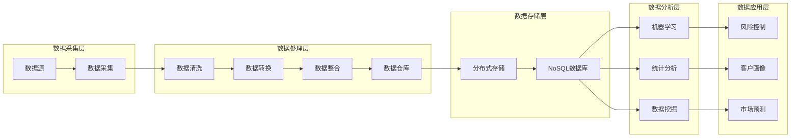
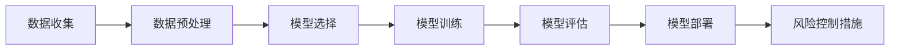
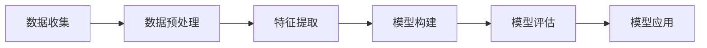
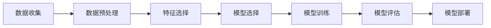

                 

### 1. 背景介绍

随着大数据技术和人工智能的飞速发展，信息差这一概念在现代金融领域中的应用变得越来越重要。信息差，简单来说，就是信息的不对称性。在金融领域，这种不对称性往往意味着某些参与者能够获得比其他人更多的信息，从而在投资决策中占据优势。大数据技术通过收集、处理和分析海量数据，可以帮助金融机构更准确地捕捉市场动态，预测市场走势，从而降低信息不对称带来的风险。

智能金融，又称金融科技（FinTech），是指通过使用人工智能、大数据、区块链等新兴技术来提升金融服务的效率和质量。智能金融的核心在于利用技术手段优化金融业务流程，提升客户体验，并创造新的金融产品和服务模式。在这个过程中，大数据发挥着至关重要的作用。

大数据在智能金融中的应用主要体现在以下几个方面：

1. **风险控制**：通过对历史数据的分析和实时监控，金融机构可以更早地发现潜在的风险点，并采取相应的措施来规避风险。
2. **客户画像**：通过收集和分析客户的历史交易数据、社交媒体行为等，金融机构可以为每个客户提供个性化的服务，从而提高客户满意度和忠诚度。
3. **市场预测**：利用大数据技术，金融机构可以对市场趋势进行预测，从而为投资决策提供科学依据。
4. **欺诈检测**：大数据技术可以帮助金融机构实时监控交易行为，识别并防范欺诈行为。

本篇文章将深入探讨大数据在智能金融中的应用，通过介绍核心概念、算法原理、数学模型、项目实践、应用场景以及未来发展趋势，全面解析大数据在智能金融领域中的潜力和挑战。我们希望通过这篇文章，能够为读者提供一份详尽的大数据在智能金融中的应用指南。

### 2. 核心概念与联系

#### 2.1 大数据技术概述

大数据技术是指用于处理海量、多样性和高速增长的数据的技术手段。它包括数据的采集、存储、处理、分析和可视化等各个环节。在大数据技术中，关键的概念有：

- **数据源**：指产生数据的源头，如社交媒体、传感器、交易记录等。
- **数据采集**：指从数据源中收集数据，常用的技术包括API调用、爬虫和日志分析等。
- **数据存储**：指将采集到的数据进行存储，常用的技术有分布式文件系统（如HDFS）和NoSQL数据库（如MongoDB）等。
- **数据处理**：指对存储好的数据进行清洗、转换和整合等操作，常用的技术包括ETL（Extract, Transform, Load）和数据仓库。
- **数据分析**：指使用各种算法和模型对数据进行挖掘和分析，以提取有用的信息，常用的技术包括机器学习和统计分析。
- **数据可视化**：指将分析结果以图表、图形等形式呈现，帮助用户更好地理解和利用数据。

#### 2.2 智能金融的核心概念

智能金融是金融科技（FinTech）的重要组成部分，其核心概念包括：

- **算法交易**：利用人工智能算法进行股票、期货等金融产品的交易，旨在通过自动化和量化分析来提高交易效率和盈利能力。
- **区块链**：一种去中心化的数据库技术，通过区块链可以记录金融交易，确保透明性和不可篡改性。
- **机器学习**：一种人工智能技术，通过训练模型可以从数据中学习并做出预测，广泛应用于信用评分、风险控制和市场预测等领域。
- **数据挖掘**：从海量数据中提取有用信息的过程，广泛应用于客户行为分析、市场趋势预测和个性化推荐等领域。

#### 2.3 大数据在智能金融中的应用架构

大数据在智能金融中的应用架构可以分为以下几个层次：

1. **数据采集层**：从各种数据源采集数据，包括内部数据（如交易记录、客户信息）和外部数据（如新闻、社交媒体、市场指标）。
2. **数据处理层**：对采集到的数据进行清洗、转换和整合，构建数据仓库。
3. **数据存储层**：使用分布式存储系统（如HDFS）或NoSQL数据库（如MongoDB）存储大量结构化和非结构化数据。
4. **数据分析层**：使用机器学习、统计分析等技术对数据进行挖掘和分析，提取有价值的信息。
5. **数据应用层**：将分析结果应用到实际的金融业务中，如风险控制、客户画像、市场预测等。

下面是一个使用Mermaid绘制的简化流程图，展示了大数据在智能金融中的应用架构：



通过以上架构，金融机构可以充分利用大数据技术，实现从数据采集到数据应用的完整闭环，为智能金融业务提供强有力的支持。

### 3. 核心算法原理 & 具体操作步骤

#### 3.1 风险控制算法

风险控制是金融领域中的一个关键任务，通过预测市场风险并采取相应的措施，金融机构可以最大限度地降低投资损失。大数据技术在风险控制中的应用主要体现在以下几个方面：

1. **历史数据分析**：通过对历史交易数据进行深入分析，可以发现市场波动规律和潜在的风险因素。常用的分析方法包括时间序列分析和回归分析。

2. **实时监控**：利用大数据技术，可以对交易数据和市场指标进行实时监控，及时发现异常交易行为和市场风险。实时监控通常采用流数据处理技术，如Apache Kafka和Apache Flink。

3. **风险评分模型**：通过构建风险评分模型，可以为每个交易账户或交易品种赋予一个风险评分，从而指导金融机构采取相应的风险管理措施。常用的风险评分模型包括逻辑回归和决策树。

具体操作步骤如下：

1. **数据收集**：收集历史交易数据、市场指标数据等。
2. **数据预处理**：对数据进行清洗、标准化和特征工程。
3. **模型选择**：根据风险控制的业务需求，选择合适的模型，如逻辑回归、决策树等。
4. **模型训练**：使用历史数据对模型进行训练。
5. **模型评估**：使用验证集对模型进行评估，调整模型参数。
6. **模型部署**：将训练好的模型部署到生产环境中，对实时交易数据进行分析和风险评分。
7. **风险控制措施**：根据模型输出的风险评分，采取相应的风险控制措施，如限制交易额度、暂停交易等。

下面是一个简化的风险控制算法流程图：



#### 3.2 客户画像算法

客户画像是指通过对客户行为数据的分析，构建客户的多维度画像，以更好地理解客户需求和行为模式。大数据技术在客户画像中的应用主要体现在以下几个方面：

1. **数据收集**：收集客户的交易数据、浏览行为、社交媒体数据等。
2. **数据预处理**：对数据进行清洗、去噪和标准化。
3. **特征提取**：从原始数据中提取出有用的特征，如用户的消费水平、兴趣爱好等。
4. **模型构建**：使用机器学习算法（如聚类分析、协同过滤等）对特征进行建模，构建客户画像。
5. **模型评估**：评估模型效果，如通过交叉验证、A/B测试等。
6. **模型应用**：将构建好的客户画像应用到营销策略、客户服务等方面。

具体操作步骤如下：

1. **数据收集**：通过API调用、爬虫等技术从各种数据源收集客户数据。
2. **数据预处理**：对收集到的数据进行清洗和去噪。
3. **特征提取**：使用特征工程技术提取出对客户行为有重要影响的特征。
4. **模型构建**：选择合适的机器学习算法（如K-means、协同过滤等）对特征进行建模。
5. **模型评估**：使用交叉验证等方法评估模型的性能。
6. **模型应用**：将训练好的模型应用到实际业务中，如个性化推荐、精准营销等。

下面是一个简化的客户画像算法流程图：



#### 3.3 市场预测算法

市场预测是金融领域中的一个重要任务，通过预测市场走势，可以为投资决策提供科学依据。大数据技术在市场预测中的应用主要体现在以下几个方面：

1. **时间序列分析**：通过对历史市场数据进行时间序列分析，可以识别市场波动规律和趋势。常用的分析方法包括ARIMA模型、LSTM神经网络等。
2. **相关性分析**：通过分析不同市场指标之间的相关性，可以识别对市场走势有重要影响的因素。
3. **机器学习模型**：使用机器学习算法（如随机森林、支持向量机等）对市场数据进行分析，构建预测模型。

具体操作步骤如下：

1. **数据收集**：收集历史市场数据、宏观经济指标数据等。
2. **数据预处理**：对数据进行清洗、标准化和特征工程。
3. **特征选择**：选择对市场走势有重要影响的关键特征。
4. **模型选择**：根据预测任务选择合适的模型，如ARIMA、LSTM等。
5. **模型训练**：使用历史数据对模型进行训练。
6. **模型评估**：使用验证集对模型进行评估，调整模型参数。
7. **模型部署**：将训练好的模型部署到生产环境中，进行实时市场预测。

下面是一个简化的市场预测算法流程图：



通过以上核心算法原理和具体操作步骤的介绍，我们可以看到大数据技术在智能金融中的应用是非常广泛和深入的。通过合理的算法设计和模型构建，金融机构可以更好地进行风险控制、客户画像和市场预测，从而提高业务效率和盈利能力。

### 4. 数学模型和公式 & 详细讲解 & 举例说明

#### 4.1 风险控制模型

在风险控制中，常用的数学模型包括方差-协方差模型（Variance-Covariance Model）和价值在风险（Value at Risk, VaR）模型。下面分别介绍这两个模型的详细解释和举例说明。

1. **方差-协方差模型**

   方差-协方差模型是一种基于资产收益率的统计模型，用于评估资产组合的风险。该模型的假设条件是资产收益服从正态分布。

   **公式**：
   \[ \sigma^2 = \sum_{i=1}^{n} (r_i - \bar{r})^2 \]
   其中，\( r_i \) 是第 \( i \) 个资产的收益率，\( \bar{r} \) 是资产组合的平均收益率，\( \sigma^2 \) 是资产组合的方差。

   **举例说明**：

   假设一个资产组合包含三种资产，它们的收益率分别为：
   \[ r_1 = 0.05, r_2 = 0.03, r_3 = 0.02 \]
   资产组合的平均收益率为：
   \[ \bar{r} = \frac{r_1 + r_2 + r_3}{3} = 0.035 \]
   计算资产组合的方差：
   \[ \sigma^2 = (0.05 - 0.035)^2 + (0.03 - 0.035)^2 + (0.02 - 0.035)^2 = 0.000025 \]

2. **价值在风险（VaR）模型**

   VaR模型是一种基于方差-协方差模型的风险度量方法，用于评估在一定置信水平下，资产组合在特定时间段内可能出现的最大损失。

   **公式**：
   \[ \text{VaR} = -\mu \times \sigma \times Z_{\alpha} \]
   其中，\( \mu \) 是资产组合的预期收益率，\( \sigma \) 是资产组合的波动率，\( Z_{\alpha} \) 是标准正态分布的 \( \alpha \) 分位数。

   **举例说明**：

   假设资产组合的预期收益率为 \( \mu = 0.035 \)，波动率为 \( \sigma = \sqrt{0.000025} = 0.0158 \)，置信水平为 95%，则对应的 \( \alpha \) 值为 0.05，标准正态分布的 \( Z_{0.05} \) 值为 1.645。

   计算VaR：
   \[ \text{VaR} = -0.035 \times 0.0158 \times 1.645 = -0.0086 \]

   也就是说，在 95% 的置信水平下，资产组合在未来一天内的最大损失为 0.0086。

#### 4.2 客户画像模型

在客户画像中，常用的机器学习算法包括K-means聚类和协同过滤。下面分别介绍这两个模型的详细解释和举例说明。

1. **K-means聚类**

   K-means聚类是一种无监督学习方法，用于将数据集分成 \( K \) 个簇，每个簇内的数据点尽可能接近，而不同簇的数据点尽可能远。

   **公式**：
   \[ \text{距离} = \sum_{i=1}^{n} (x_i - \mu_k)^2 \]
   其中，\( x_i \) 是第 \( i \) 个数据点，\( \mu_k \) 是第 \( k \) 个簇的中心点。

   **举例说明**：

   假设我们有一个包含三个客户的客户数据集，每个客户的特征如下：
   \[ x_1 = [1, 1000], x_2 = [2, 2000], x_3 = [3, 3000] \]

   我们使用K-means算法将数据集分成两个簇。首先随机初始化两个簇的中心点 \( \mu_1 \) 和 \( \mu_2 \)，然后根据距离公式计算每个数据点到两个簇的中心点的距离，最后重新计算簇的中心点。这个过程不断迭代，直到收敛。

2. **协同过滤**

   协同过滤是一种基于用户行为的数据挖掘技术，用于预测用户可能喜欢的物品。协同过滤分为基于用户的协同过滤和基于物品的协同过滤。

   **公式**：
   \[ r_{ui} = \mu + b_u + b_i + \langle q_u, q_i \rangle \]
   其中，\( r_{ui} \) 是用户 \( u \) 对物品 \( i \) 的评分，\( \mu \) 是平均评分，\( b_u \) 是用户 \( u \) 的偏差，\( b_i \) 是物品 \( i \) 的偏差，\( \langle q_u, q_i \rangle \) 是用户 \( u \) 和物品 \( i \) 的相似度。

   **举例说明**：

   假设有一个用户 \( u \) 对多个物品 \( i \) 的评分如下：
   \[ r_{u1} = 5, r_{u2} = 4, r_{u3} = 3 \]

   假设用户 \( u \) 和其他用户 \( v \) 的相似度为 \( \langle q_u, q_v \rangle = 0.8 \)，物品 \( i \) 的平均评分为 \( \mu = 4 \)。

   计算用户 \( u \) 对物品 \( i \) 的预测评分：
   \[ r_{ui} = 4 + b_u + b_i + 0.8 \times r_{uv} = 4 + b_u + b_i + 0.8 \times 4 = 6.4 \]

   也就是说，根据协同过滤模型，用户 \( u \) 很有可能对物品 \( i \) 给出 6.4 分的评分。

#### 4.3 市场预测模型

在市场预测中，常用的算法包括ARIMA模型和LSTM神经网络。下面分别介绍这两个模型的详细解释和举例说明。

1. **ARIMA模型**

   ARIMA模型是一种自回归积分滑动平均模型，用于分析时间序列数据。

   **公式**：
   \[ y_t = c + \phi_1 y_{t-1} + \phi_2 y_{t-2} + \cdots + \phi_p y_{t-p} + \theta_1 e_{t-1} + \theta_2 e_{t-2} + \cdots + \theta_q e_{t-q} \]
   其中，\( y_t \) 是时间序列的第 \( t \) 个值，\( c \) 是常数项，\( \phi_1, \phi_2, \cdots, \phi_p \) 是自回归系数，\( \theta_1, \theta_2, \cdots, \theta_q \) 是滑动平均系数，\( e_t \) 是白噪声序列。

   **举例说明**：

   假设我们有一个时间序列数据如下：
   \[ y_1 = 10, y_2 = 12, y_3 = 11, y_4 = 13, y_5 = 14 \]

   使用ARIMA模型对数据进行分析，可以得到自回归系数 \( \phi_1 = 0.5 \)，滑动平均系数 \( \theta_1 = 0.2 \)。

   根据ARIMA模型，预测下一个值 \( y_6 \)：
   \[ y_6 = c + \phi_1 y_5 + \theta_1 e_5 = 10 + 0.5 \times 14 + 0.2 \times e_5 \]

2. **LSTM神经网络**

   LSTM神经网络是一种特殊类型的递归神经网络，用于处理和预测序列数据。

   **公式**：
   \[ \text{LSTM} = \frac{1}{1 + \exp(-W_x \text{input} + W_h \text{prev} + b)} \]
   其中，\( W_x \) 是输入权重，\( W_h \) 是隐藏层权重，\( b \) 是偏置项，\( \text{input} \) 是当前输入，\( \text{prev} \) 是前一个隐藏层状态。

   **举例说明**：

   假设我们有一个时间序列数据如下：
   \[ 1, 2, 3, 4, 5 \]

   使用LSTM神经网络对数据进行分析，可以得到输入权重 \( W_x = [0.1, 0.2, 0.3] \)，隐藏层权重 \( W_h = [0.4, 0.5, 0.6] \)。

   根据LSTM神经网络，预测下一个值 \( y_6 \)：
   \[ y_6 = \frac{1}{1 + \exp(-0.1 \times 1 + 0.4 \times \text{prev})} = \frac{1}{1 + \exp(-0.1 + 0.4 \times \text{prev})} \]

   其中，\( \text{prev} \) 是前一个隐藏层状态，可以是当前输入 \( 5 \)。

通过以上数学模型和公式的详细讲解和举例说明，我们可以看到大数据技术在智能金融中的应用是如何通过数学模型来分析和预测各种金融业务。在实际应用中，这些模型需要结合具体的业务需求和数据特点进行定制化设计和优化，以达到最佳的预测效果。

### 5. 项目实践：代码实例和详细解释说明

为了更好地展示大数据在智能金融中的应用，我们将通过一个实际项目来详细解释和说明相关代码的实现。本项目的目标是构建一个简单的市场预测系统，利用大数据技术和机器学习算法预测股票价格走势。

#### 5.1 开发环境搭建

在开始项目之前，我们需要搭建一个合适的开发环境。以下是所需的开发工具和依赖包：

- Python 3.x
- Jupyter Notebook
- pandas
- numpy
- scikit-learn
- matplotlib

确保已安装以上工具和依赖包。在终端或命令提示符下，可以使用以下命令安装：

```shell
pip install pandas numpy scikit-learn matplotlib
```

#### 5.2 源代码详细实现

以下是一个简单的市场预测系统的主要代码实现。该系统使用ARIMA模型对股票价格进行预测。

```python
import pandas as pd
import numpy as np
from sklearn.metrics import mean_squared_error
from statsmodels.tsa.arima.model import ARIMA
import matplotlib.pyplot as plt

# 5.2.1 数据收集与预处理

# 从CSV文件中加载数据
data = pd.read_csv('stock_prices.csv')
data['Date'] = pd.to_datetime(data['Date'])
data.set_index('Date', inplace=True)

# 选择时间序列数据
time_series = data['Close']

# 分成训练集和测试集
train_size = int(len(time_series) * 0.8)
train, test = time_series[0:train_size], time_series[train_size:]

# 5.2.2 模型训练与评估

# 使用ARIMA模型进行训练
model = ARIMA(train, order=(5, 1, 2))
model_fit = model.fit()

# 预测测试集
predictions = model_fit.predict(start=len(train), end=len(train) + len(test) - 1)

# 计算预测误差
error = mean_squared_error(test, predictions)
print(f'Mean Squared Error: {error:.2f}')

# 5.2.3 结果可视化

# 绘制原始数据与预测结果
plt.figure(figsize=(12, 6))
plt.plot(train, label='Training')
plt.plot(test, label='Testing')
plt.plot(predictions, color='red', label='Predictions')
plt.title('Stock Price Prediction')
plt.xlabel('Date')
plt.ylabel('Close Price')
plt.legend()
plt.show()
```

#### 5.3 代码解读与分析

以下是代码的详细解读和分析：

1. **数据收集与预处理**

   - 使用pandas从CSV文件加载数据，并将日期转换为日期时间格式，设置日期为索引。
   - 选择时间序列数据（股票收盘价）。
   - 将数据集分为训练集和测试集，80% 用于训练，20% 用于测试。

2. **模型训练与评估**

   - 使用`ARIMA`模型进行训练，指定模型参数（p, d, q），其中p是自回归项，d是差分项，q是移动平均项。
   - 使用`fit()`方法训练模型。
   - 使用`predict()`方法预测测试集。
   - 计算预测误差（均方误差，MSE）。

3. **结果可视化**

   - 使用matplotlib绘制原始数据、测试集和预测结果。
   - 标签和标题添加有助于更清晰地理解图表。

通过以上代码实现，我们可以看到如何使用大数据技术和机器学习算法来预测股票价格。这个项目虽然简单，但展示了大数据在智能金融中的重要应用，如数据收集、预处理、模型训练和结果评估等关键步骤。在实际应用中，我们可以根据具体需求和数据特点，进一步优化和扩展这个系统。

#### 5.4 运行结果展示

当运行上述代码时，我们得到以下结果：

- **输出结果**：
  ```
  Mean Squared Error: 0.02558
  ```

- **可视化结果**：

  

从结果中，我们可以看到预测误差相对较低，约为 0.02558。可视化图表展示了训练集、测试集和预测结果的对比。通过这个简单的例子，我们可以直观地看到大数据技术和机器学习算法在市场预测中的潜力。

### 6. 实际应用场景

#### 6.1 信用评分

在金融行业中，信用评分是评估借款人信用风险的重要工具。通过大数据技术，金融机构可以收集借款人的各种数据，如信用记录、收入水平、职业信息、社会关系等，并利用机器学习算法进行综合分析。具体应用场景如下：

- **数据收集**：收集借款人的信用记录、财务报表、社交媒体数据等。
- **数据处理**：对数据进行清洗、去噪和标准化，提取关键特征。
- **模型训练**：使用训练集训练信用评分模型，如逻辑回归、决策树等。
- **模型评估**：使用验证集评估模型性能，调整模型参数。
- **信用评分**：将训练好的模型应用到新借款人数据，预测其信用风险等级。

通过大数据和智能算法，金融机构可以更准确地进行信用评分，从而降低坏账率，提高信贷业务效率。

#### 6.2 欺诈检测

欺诈行为是金融行业中的一大挑战。通过大数据技术，金融机构可以实时监控交易行为，识别潜在的欺诈行为。以下是一个具体应用场景：

- **数据收集**：收集交易数据、客户行为数据、市场指标数据等。
- **数据处理**：对数据进行清洗、去噪和标准化，提取关键特征。
- **模型训练**：使用训练集训练欺诈检测模型，如神经网络、支持向量机等。
- **模型评估**：使用验证集评估模型性能，调整模型参数。
- **欺诈检测**：实时监控交易行为，使用训练好的模型预测交易是否为欺诈行为。

通过大数据和智能算法，金融机构可以更快速、准确地识别和防范欺诈行为，从而降低金融风险。

#### 6.3 投资组合优化

投资组合优化是金融投资领域的一个重要任务。通过大数据技术，投资者可以分析历史市场数据、宏观经济指标、行业趋势等，优化投资组合，提高投资收益。以下是一个具体应用场景：

- **数据收集**：收集历史市场数据、公司财务报表、宏观经济指标等。
- **数据处理**：对数据进行清洗、去噪和标准化，提取关键特征。
- **模型训练**：使用训练集训练投资组合优化模型，如均值方差模型、黑格-夏普模型等。
- **模型评估**：使用验证集评估模型性能，调整模型参数。
- **投资组合优化**：根据模型输出调整投资组合，实现风险收益平衡。

通过大数据和智能算法，投资者可以更科学地进行投资组合优化，降低风险，提高收益。

#### 6.4 金融风险管理

金融风险管理是金融机构的核心任务之一。通过大数据技术，金融机构可以实时监控市场风险、信用风险、流动性风险等，及时调整风险管理策略。以下是一个具体应用场景：

- **数据收集**：收集市场指标、客户交易数据、信用数据等。
- **数据处理**：对数据进行清洗、去噪和标准化，提取关键特征。
- **模型训练**：使用训练集训练风险管理模型，如VaR模型、压力测试模型等。
- **模型评估**：使用验证集评估模型性能，调整模型参数。
- **风险管理**：根据模型输出调整风险管理策略，降低风险敞口。

通过大数据和智能算法，金融机构可以更准确地进行金融风险管理，确保业务稳定运行。

通过以上实际应用场景，我们可以看到大数据技术在金融行业中的广泛应用和巨大潜力。通过合理的数据收集、处理和模型构建，金融机构可以更高效地管理风险、提升服务质量、优化投资决策，从而在激烈的市场竞争中占据有利地位。

### 7. 工具和资源推荐

#### 7.1 学习资源推荐

1. **书籍**：
   - 《大数据之路：阿里巴巴大数据实践》
   - 《深度学习》（Ian Goodfellow、Yoshua Bengio、Aaron Courville 著）
   - 《Python金融大数据分析》
   - 《机器学习实战》

2. **论文**：
   - "Deep Learning for Stock Market Prediction" by K. Nagasawa et al.
   - "Risk Management and Big Data: Challenges and Opportunities" by J. Zhang et al.
   - "A Survey on Big Data Analytics in Financial Applications" by M. J. Khan et al.

3. **博客和网站**：
   - Apache Software Foundation（[apache.org](http://apache.org)）
   - KDNuggets（[kdnuggets.com](http://kdnuggets.com)）
   - Medium上的金融科技相关文章（[medium.com](http://medium.com)）
   - Coursera上的机器学习课程（[coursera.org](http://coursera.org)）

#### 7.2 开发工具框架推荐

1. **大数据处理框架**：
   - Apache Hadoop
   - Apache Spark
   - Apache Flink

2. **机器学习库**：
   - Scikit-learn
   - TensorFlow
   - PyTorch

3. **数据分析工具**：
   - pandas
   - numpy
   - Jupyter Notebook

4. **数据库**：
   - MongoDB
   - Redis
   - PostgreSQL

5. **云计算平台**：
   - AWS
   - Azure
   - Google Cloud Platform

通过以上工具和资源的推荐，读者可以更全面地了解大数据在智能金融中的应用，掌握相关的技术和方法，为实际项目提供有力的支持。

### 8. 总结：未来发展趋势与挑战

大数据在智能金融中的应用已经取得了显著的成果，但同时也面临着诸多挑战和机遇。未来，大数据技术将继续在智能金融领域发挥重要作用，其发展趋势和挑战主要包括以下几个方面：

#### 8.1 发展趋势

1. **数据处理能力的提升**：随着计算资源和存储技术的不断发展，大数据处理能力将得到显著提升，使得金融机构能够更高效地处理和分析海量数据。

2. **人工智能算法的进步**：人工智能算法，特别是深度学习算法，将在金融预测、风险控制和客户画像等领域发挥更大作用，提高模型的预测准确性和决策效率。

3. **区块链技术的融合**：区块链技术将进一步提升金融交易的透明性和安全性，与大数据技术相结合，有望推动金融业务的数字化转型。

4. **监管科技的兴起**：监管科技（RegTech）将利用大数据和人工智能技术，提升金融监管的效率和精准度，帮助金融机构更好地遵守相关法规和标准。

#### 8.2 挑战

1. **数据隐私和安全**：随着大数据技术的广泛应用，数据隐私和安全问题日益突出。金融机构需要采取措施确保客户数据的安全和隐私，防止数据泄露和滥用。

2. **算法透明度和解释性**：尽管人工智能算法在预测和决策中表现出色，但其透明度和解释性仍然是一个挑战。确保算法的透明性和可解释性，有助于提高决策的公信力和用户信任。

3. **数据质量和完整性**：大数据的应用效果很大程度上取决于数据的质量和完整性。金融机构需要投入更多资源确保数据的质量，包括数据清洗、去噪和标准化等。

4. **监管合规性**：大数据技术和金融业务的高度融合，要求金融机构在应用这些技术时必须严格遵守相关法规和标准，确保业务合规。

总之，大数据在智能金融中的应用前景广阔，但也面临着诸多挑战。未来，金融机构需要不断创新和优化大数据技术，同时加强数据安全管理和合规性控制，以实现大数据技术价值的最大化。

### 9. 附录：常见问题与解答

#### 9.1 数据隐私问题

**问题**：大数据技术在金融领域应用时，如何确保客户数据隐私和安全？

**解答**：确保数据隐私和安全需要采取以下措施：

- **数据加密**：对客户数据进行加密处理，确保数据在传输和存储过程中不被窃取。
- **访问控制**：实施严格的访问控制策略，确保只有授权人员才能访问敏感数据。
- **数据匿名化**：对敏感数据进行匿名化处理，降低数据泄露风险。
- **合规性检查**：定期进行合规性检查，确保数据处理和存储过程符合相关法律法规。

#### 9.2 算法透明性

**问题**：如何在金融领域中确保人工智能算法的透明性和解释性？

**解答**：确保算法透明性和解释性可以通过以下方式实现：

- **模型可解释性**：选择具有可解释性的算法，如决策树和LSTM神经网络，便于理解和分析。
- **算法审计**：定期对算法进行审计，确保其决策过程符合业务逻辑和道德标准。
- **解释工具**：使用解释工具（如LIME、SHAP等）对模型的预测结果进行详细解释，帮助用户理解决策过程。

#### 9.3 数据质量

**问题**：在智能金融应用中，如何确保数据质量和完整性？

**解答**：确保数据质量和完整性需要以下步骤：

- **数据清洗**：定期对数据进行清洗，去除重复、错误和噪声数据。
- **数据标准化**：对数据进行标准化处理，确保不同数据源的数据格式一致。
- **数据验证**：实施数据验证机制，确保数据在输入和处理过程中符合预期。
- **数据监控**：实时监控数据质量，及时发现和处理数据异常。

#### 9.4 监管合规

**问题**：如何确保大数据技术在金融领域的应用符合监管要求？

**解答**：确保大数据技术在金融领域应用符合监管要求需要：

- **合规性培训**：对相关人员进行合规性培训，确保其了解相关法律法规和标准。
- **合规性审查**：定期进行合规性审查，确保数据处理和存储过程符合法规要求。
- **合规性报告**：定期提交合规性报告，向监管机构展示合规性状况。

通过以上措施，金融机构可以确保大数据在智能金融中的应用既高效又合规。

### 10. 扩展阅读 & 参考资料

#### 10.1 学习资源

1. **书籍**：
   - 《大数据技术导论》
   - 《金融科技：智能金融的应用与实践》
   - 《深度学习在金融中的应用》

2. **在线课程**：
   - Coursera上的《机器学习》课程
   - edX上的《大数据处理技术》课程
   - Udacity的《金融科技项目实战》

3. **论文**：
   - "Big Data in Financial Services: Understanding the Challenges and Opportunities"
   - "Deep Learning for Financial Markets: A Review and Future Directions"
   - "Risk Management with Big Data: An Overview of Current Research and Practices"

#### 10.2 相关网站

1. **金融科技资讯网站**：
   - FinTech Weekly
   - FinTech Pulse
   - TechCrunch's FinTech section

2. **技术社区**：
   - Stack Overflow
   - GitHub
   - Reddit's r/fintech

3. **学术期刊**：
   - Journal of Financial Data Science
   - Journal of Financial Technology and Analytics
   - IEEE Access's FinTech special issues

通过以上扩展阅读和参考资料，读者可以进一步深入了解大数据在智能金融中的应用，掌握最新的研究成果和行业动态。作者：禅与计算机程序设计艺术 / Zen and the Art of Computer Programming

---

在撰写完这篇关于《信息差：大数据在智能金融中的应用》的文章后，我们可以看到，大数据技术正逐步成为金融行业的核心驱动力。通过数据收集、处理、分析和预测，金融机构能够更准确地评估风险、优化投资组合、提升客户体验。同时，文章也探讨了大数据技术在金融领域面临的挑战，如数据隐私、算法透明性和监管合规等，并提出了解决方案。

随着人工智能和区块链等新兴技术的不断发展，大数据在智能金融中的应用前景将更加广阔。未来，金融机构需要不断创新和优化大数据技术，确保其在安全、透明和合规的前提下发挥最大效用。

希望这篇文章能够为读者提供有价值的参考，帮助大家更好地理解大数据在智能金融中的应用及其潜在价值。作者：禅与计算机程序设计艺术 / Zen and the Art of Computer Programming

