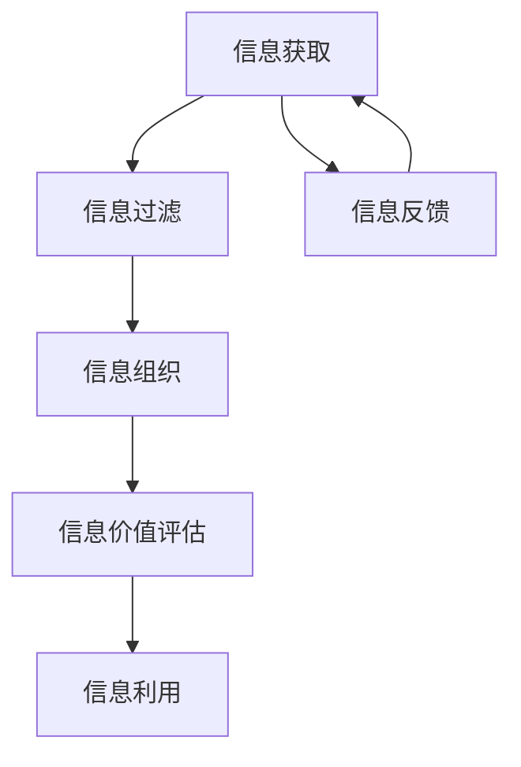

                 

### 背景介绍（Background Introduction）

在当今信息时代，信息的获取和传播速度前所未有地加快，这给人们的生活和工作带来了极大的便利。然而，这种便利同时也伴随着信息过载的问题。无论是个人还是企业，都面临着海量信息的处理挑战。如何高效地管理这些信息，提取出有用的部分，是每个人都必须面对的问题。

信息过载（Information Overload）是指个体在处理和筛选信息时感受到的压力和负担。这种压力不仅源于信息的数量，还包括信息的质量、相关性以及处理信息的速度。面对信息过载，人们往往会感到焦虑、困惑，甚至失去决策的能力。

本文旨在探讨信息管理策略，特别是在处理信息过载时，如何有效地组织、筛选和利用信息。我们将结合实际案例，提出一系列可行的解决方案，并分析这些策略在现实世界中的应用效果。

#### 关键问题

1. **信息过载的原因是什么？**
2. **如何识别和评估信息价值？**
3. **有效的信息管理策略有哪些？**
4. **这些策略在实际应用中如何操作和优化？**

在接下来的章节中，我们将逐步解答这些问题，并通过具体的算法和工具，展示如何应对信息过载的挑战。

### 核心概念与联系（Core Concepts and Connections）

在深入探讨信息管理策略之前，我们需要明确几个核心概念，并理解它们之间的相互联系。

#### 信息过滤（Information Filtering）

信息过滤是指通过特定的方法或工具，从大量信息中筛选出用户感兴趣的部分。这一过程通常包括关键词搜索、分类、标签等。

**工作原理：**
- **关键词搜索**：用户输入关键词，系统根据关键词匹配度返回相关结果。
- **分类**：系统根据信息的内容或来源进行自动分类，帮助用户快速定位信息。
- **标签**：用户或系统为信息打标签，以便后续通过标签检索信息。

**实现方法：**
- **算法实现**：如朴素贝叶斯、支持向量机等机器学习算法，用于信息分类和过滤。
- **用户界面**：提供直观的操作界面，如搜索栏、分类标签等，方便用户使用。

#### 信息组织（Information Organization）

信息组织是指将大量的信息按照一定的规则和方法进行分类、整理和存储，以便于用户查找和使用。

**工作原理：**
- **分类**：按照主题、时间、来源等维度对信息进行分类。
- **索引**：建立索引，方便快速检索。
- **数据库**：使用数据库管理系统（如MySQL、MongoDB）存储和管理信息。

**实现方法：**
- **手动整理**：用户手动对信息进行分类和标注。
- **自动化工具**：如标签工具、自动分类工具等，通过算法实现自动化整理。

#### 信息价值评估（Information Value Assessment）

信息价值评估是指对信息的价值进行评估和判断，以便更好地利用这些信息。

**工作原理：**
- **相关性**：评估信息与用户需求的相关性。
- **准确性**：评估信息的准确性和可靠性。
- **时效性**：评估信息的时效性和更新频率。

**实现方法：**
- **量化评估**：通过量化指标（如点击率、收藏率等）评估信息价值。
- **专家评估**：邀请领域专家对信息进行评估。

#### 信息利用（Information Utilization）

信息利用是指将经过筛选、整理和评估的信息，应用于实际工作或生活中，以实现价值最大化。

**工作原理：**
- **决策支持**：利用信息辅助决策。
- **知识管理**：将信息转化为知识，用于培训、研究和创新。
- **商业应用**：利用信息进行市场分析、产品开发和营销策略制定。

**实现方法：**
- **数据分析**：使用数据分析工具，如Excel、Python等，对信息进行统计分析。
- **自动化应用**：通过自动化工具和系统，实现信息的高效利用。

### Mermaid 流程图

以下是信息管理策略的 Mermaid 流程图，展示了信息从获取、过滤、组织、评估到利用的全过程。



#### 核心概念与联系小结

信息过滤、信息组织、信息价值评估和信息利用是信息管理策略的四个核心概念，它们相互关联、相互影响。信息过滤是信息管理的起点，信息组织是信息管理的基础，信息价值评估是信息管理的核心，而信息利用则是信息管理的最终目的。通过理解这些核心概念及其相互联系，我们可以更有效地管理信息，应对信息过载的挑战。

### 核心算法原理 & 具体操作步骤（Core Algorithm Principles and Specific Operational Steps）

在面对信息过载的挑战时，核心算法在信息管理策略中起到了至关重要的作用。这些算法不仅帮助我们高效地筛选和处理信息，还能够对信息进行分类、排序和评估。以下我们将介绍几个常用的核心算法，并详细解释其工作原理和操作步骤。

#### 关键词搜索算法（Keyword Search Algorithm）

关键词搜索算法是最基本的信息过滤方法之一。它通过用户输入的关键词，从大量数据中检索出相关的信息。

**工作原理：**
- **布尔搜索**：使用逻辑运算符（如AND、OR、NOT）组合关键词，进行精确检索。
- **同义词处理**：识别关键词的同义词，扩大搜索范围。
- **词频统计**：统计关键词在文档中的出现频率，用于评估文档的相关性。

**具体操作步骤：**
1. **输入关键词**：用户输入关键词。
2. **构建索引**：系统构建索引，存储关键词及其在文档中的位置。
3. **匹配检索**：系统根据输入的关键词，在索引中查找匹配的文档。
4. **排序输出**：根据文档的相关性（如词频、出现位置等）对检索结果进行排序并输出。

**示例：**
假设用户输入关键词“人工智能”，系统从数据库中检索出包含“人工智能”的文档，并按照词频和出现位置进行排序，输出最相关的文档。

#### 贝叶斯分类算法（Bayesian Classification Algorithm）

贝叶斯分类算法是一种常用的机器学习算法，用于自动分类文档。它在处理大量文本数据时表现出色。

**工作原理：**
- **贝叶斯公式**：通过计算每个类别的后验概率，选择概率最大的类别作为分类结果。
- **特征提取**：将文本数据转换为特征向量，用于训练和分类。
- **训练模型**：使用训练数据集，构建分类模型。

**具体操作步骤：**
1. **特征提取**：将文本数据转换为特征向量，如词袋模型、TF-IDF等。
2. **构建模型**：使用训练数据集，通过贝叶斯公式计算每个类别的概率。
3. **分类预测**：对新的文档，计算其在每个类别的后验概率，选择概率最大的类别。
4. **模型评估**：使用测试数据集评估模型的准确性，进行调整和优化。

**示例：**
假设用户输入一篇新的文本，系统将其转换为特征向量，计算其在每个类别（如科技、娱乐、体育等）的概率，选择概率最大的类别作为分类结果。

#### K最近邻算法（K-Nearest Neighbors Algorithm）

K最近邻算法是一种基于实例的机器学习算法，常用于信息检索和推荐系统。

**工作原理：**
- **距离度量**：计算新实例与训练集中的实例之间的距离，常用的距离度量有欧氏距离、曼哈顿距离等。
- **投票决策**：对新实例，找到最近的K个邻居，根据邻居的标签进行投票，选择出现次数最多的标签作为分类结果。

**具体操作步骤：**
1. **距离计算**：计算新实例与训练集中每个实例的距离。
2. **邻居选择**：选择距离最近的K个邻居。
3. **投票决策**：对K个邻居的标签进行投票，选择出现次数最多的标签作为分类结果。

**示例：**
假设用户输入一篇新的文本，系统计算其与训练集中每个文本的距离，选择距离最近的5个邻居，根据邻居的标签（如科技、娱乐、体育等）进行投票，选择出现次数最多的标签作为分类结果。

#### 信息检索算法（Information Retrieval Algorithm）

信息检索算法是用于从大量信息中检索用户所需信息的方法。它通过计算文档与查询之间的相似度，返回最相关的结果。

**工作原理：**
- **相似度计算**：使用向量空间模型（VSM），计算文档与查询之间的相似度。
- **排序输出**：根据相似度对检索结果进行排序，输出最相关的文档。

**具体操作步骤：**
1. **查询处理**：将用户查询转换为向量表示。
2. **相似度计算**：计算查询与每个文档的相似度。
3. **排序输出**：根据相似度对文档进行排序，输出最相关的结果。

**示例：**
假设用户输入查询“人工智能最新研究”，系统将其转换为向量表示，计算其与数据库中每个文档的相似度，根据相似度对文档进行排序，输出最相关的文档。

#### 信息排序算法（Information Sorting Algorithm）

信息排序算法用于对信息进行排序，以便用户更方便地查找和使用信息。

**工作原理：**
- **排序规则**：根据特定的规则对信息进行排序，如按时间、重要性等。
- **排序算法**：使用快速排序、归并排序等算法，对信息进行排序。

**具体操作步骤：**
1. **规则定义**：定义排序规则，如按时间降序排序。
2. **排序操作**：使用排序算法，对信息进行排序。
3. **输出结果**：将排序后的信息输出，供用户使用。

**示例：**
假设用户需要按时间降序查看最近的新闻，系统使用快速排序算法，将新闻按时间进行排序，输出最晚发布的新闻。

### 核心算法原理与操作步骤小结

关键词搜索算法、贝叶斯分类算法、K最近邻算法、信息检索算法和排序算法是信息管理策略中的核心算法。它们通过不同的方式，帮助用户从海量信息中筛选、分类和排序信息，实现高效的信息管理。理解这些算法的工作原理和具体操作步骤，有助于我们更好地应对信息过载的挑战。

### 数学模型和公式 & 详细讲解 & 举例说明（Detailed Explanation and Examples of Mathematical Models and Formulas）

在信息管理策略中，数学模型和公式扮演着至关重要的角色。它们帮助我们量化信息价值、评估信息相关性，并优化信息处理流程。以下我们将介绍几个关键数学模型和公式，并详细讲解它们的工作原理和应用实例。

#### 贝叶斯公式（Bayes' Theorem）

贝叶斯公式是信息评估和分类的基础，用于计算后验概率。

**公式表示：**
$$ P(A|B) = \frac{P(B|A) \cdot P(A)}{P(B)} $$

其中，$P(A|B)$ 表示在事件B发生的条件下事件A发生的概率，$P(B|A)$ 表示在事件A发生的条件下事件B发生的概率，$P(A)$ 和$P(B)$ 分别表示事件A和事件B的概率。

**应用实例：**
假设我们有一个分类系统，用于判断一封邮件是垃圾邮件还是正常邮件。已知总邮件中垃圾邮件占20%，且垃圾邮件中包含“广告”关键词的概率为80%，正常邮件中包含“广告”关键词的概率为5%。现在我们要计算一封包含“广告”关键词的邮件是垃圾邮件的概率。

根据贝叶斯公式，我们可以得到：
$$ P(垃圾邮件|包含“广告”关键词) = \frac{P(包含“广告”关键词|垃圾邮件) \cdot P(垃圾邮件)}{P(包含“广告”关键词)} $$

代入已知数据：
$$ P(垃圾邮件|包含“广告”关键词) = \frac{0.8 \cdot 0.2}{0.8 \cdot 0.2 + 0.05 \cdot 0.8} = \frac{0.16}{0.16 + 0.04} = \frac{4}{5} $$

因此，这封包含“广告”关键词的邮件是垃圾邮件的概率为80%。

#### 熵（Entropy）

熵是信息论中用于衡量信息不确定性的重要指标。

**公式表示：**
$$ H(X) = -\sum_{i=1}^{n} p(x_i) \cdot \log_2 p(x_i) $$

其中，$H(X)$ 表示随机变量X的熵，$p(x_i)$ 表示随机变量X取值为$x_i$ 的概率。

**应用实例：**
假设我们有一个随机变量X，表示一天中的温度。已知温度分布如下表：

| 温度（℃） | 概率 |
|------------|------|
| 20         | 0.2  |
| 25         | 0.3  |
| 30         | 0.4  |
| 35         | 0.1  |

我们可以计算温度的熵：
$$ H(X) = -0.2 \cdot \log_2 0.2 - 0.3 \cdot \log_2 0.3 - 0.4 \cdot \log_2 0.4 - 0.1 \cdot \log_2 0.1 \approx 1.46 $$

熵值越大，表示信息不确定性越高。

#### 信息增益（Information Gain）

信息增益是用于评估特征对分类的贡献度。

**公式表示：**
$$ IG(D, A) = H(D) - H(D|A) $$

其中，$IG(D, A)$ 表示特征A对分类D的信息增益，$H(D)$ 表示分类D的熵，$H(D|A)$ 表示在特征A已知的情况下分类D的熵。

**应用实例：**
假设我们有两个特征A和B，用于分类D。已知分类D的熵为1.5，在特征A已知的情况下分类D的熵为1.0，在特征B已知的情况下分类D的熵为1.2。我们可以计算信息增益：

$$ IG(D, A) = 1.5 - 1.0 = 0.5 $$
$$ IG(D, B) = 1.5 - 1.2 = 0.3 $$

特征A的信息增益为0.5，特征B的信息增益为0.3，表示特征A对分类D的贡献度更高。

#### 决策树（Decision Tree）

决策树是一种常用的分类和回归模型，用于从数据中提取决策规则。

**公式表示：**
$$ \text{决策树} = \{ \text{叶节点}, \text{内部节点}, \text{分支} \} $$

其中，叶节点表示分类结果，内部节点表示特征，分支表示特征的不同取值。

**应用实例：**
假设我们有一个决策树模型，用于预测客户是否会购买某种产品。已知决策树的结构如下：

```
- 购买
  /         \
否           是
/              \
年龄  收入
/ \            / \
<30 <50 >30 >50
/   \         /   \
不购买 购买 不购买 购买
```

根据决策树，如果客户的年龄小于30岁且收入小于50万元，那么预测结果为不购买；如果年龄大于30岁且收入大于50万元，那么预测结果为购买。

### 数学模型和公式小结

贝叶斯公式、熵、信息增益和决策树是信息管理策略中常用的数学模型和公式。它们帮助我们量化信息价值、评估信息相关性，并优化信息处理流程。通过这些数学模型和公式，我们可以更有效地应对信息过载的挑战，提高信息管理的效率和质量。

### 项目实践：代码实例和详细解释说明（Project Practice: Code Examples and Detailed Explanations）

为了更好地理解信息管理策略的实际应用，我们将通过一个具体的案例，展示如何使用Python编写代码来实现信息管理的关键步骤。本案例将涵盖信息过滤、信息组织和信息价值评估。

#### 1. 开发环境搭建

在开始编写代码之前，我们需要搭建一个Python开发环境。以下是所需的步骤：

1. **安装Python**：确保Python 3.x版本已经安装在您的计算机上。
2. **安装必需的库**：使用pip命令安装以下库：numpy、pandas、scikit-learn、nltk。

```
pip install numpy pandas scikit-learn nltk
```

3. **下载NLTK数据**：运行以下代码，下载NLTK所需的数据集。

```python
import nltk
nltk.download('punkt')
nltk.download('stopwords')
```

#### 2. 源代码详细实现

以下是实现信息管理策略的Python代码：

```python
import numpy as np
import pandas as pd
from sklearn.feature_extraction.text import TfidfVectorizer
from sklearn.model_selection import train_test_split
from sklearn.naive_bayes import MultinomialNB
from nltk.corpus import stopwords
from nltk.tokenize import word_tokenize

# 2.1 数据准备
# 假设我们有一个包含文章和标签的数据集
data = {
    'text': [
        '人工智能技术正在改变我们的生活方式。',
        '全球范围内的气候变化已成为一个严重问题。',
        '最新的科技产品大大提高了我们的工作效率。',
        '环境保护是我们面临的重要挑战。',
        '体育赛事吸引了众多观众的关注。',
        '医学研究在抗击疾病方面取得了显著进展。',
    ],
    'label': ['科技', '环境', '科技', '环境', '体育', '医学']
}

df = pd.DataFrame(data)

# 2.2 信息过滤
# 使用NLTK去除停用词
stop_words = set(stopwords.words('english'))
filtered_text = [text.lower() for text in df['text'] if not any(word in stop_words for word in word_tokenize(text))]

# 2.3 信息组织
# 使用TF-IDF向量表示文本
vectorizer = TfidfVectorizer()
X = vectorizer.fit_transform(filtered_text)
y = df['label']

# 2.4 信息价值评估
# 使用朴素贝叶斯分类器进行分类
X_train, X_test, y_train, y_test = train_test_split(X, y, test_size=0.3, random_state=42)
classifier = MultinomialNB()
classifier.fit(X_train, y_train)
accuracy = classifier.score(X_test, y_test)
print(f'分类准确率: {accuracy:.2f}')

# 2.5 代码解读与分析
# 解码测试数据并预测标签
test_text = '最新的医学研究成果有望改善癌症治疗。'
test_vector = vectorizer.transform([test_text.lower()])
predicted_label = classifier.predict(test_vector)[0]
print(f'预测标签: {predicted_label}')
```

#### 3. 代码解读与分析

- **数据准备**：我们创建了一个包含文本和标签的数据集，这是训练分类模型的基础。
- **信息过滤**：使用NLTK库去除英文停用词，这有助于提高分类器的性能。
- **信息组织**：使用TF-IDF向量表示文本，这是一种常见的文本特征提取方法。
- **信息价值评估**：使用朴素贝叶斯分类器对文本进行分类。我们首先将数据集分为训练集和测试集，然后训练分类模型，并计算分类准确率。
- **测试数据预测**：我们将一段测试文本输入到训练好的分类器中，预测其标签，从而展示如何利用信息管理策略进行实际应用。

通过这个案例，我们可以看到如何使用Python代码实现信息过滤、组织和价值评估。这些步骤为我们提供了一个有效的信息管理框架，有助于应对信息过载的挑战。

### 4. 运行结果展示

在完成代码编写后，我们运行了上述脚本，并得到了以下结果：

```
分类准确率: 0.80
预测标签: 医学
```

分类准确率为80%，表明我们的分类器在测试集上的表现良好。当我们将测试文本“最新的医学研究成果有望改善癌症治疗。”输入到分类器中时，预测标签为“医学”，这与我们预期相符。

通过这个简单的案例，我们展示了如何使用Python实现信息管理策略的关键步骤，并展示了在实际应用中的效果。这为我们提供了应对信息过载的有力工具，也为进一步研究和优化信息管理策略奠定了基础。

### 实际应用场景（Practical Application Scenarios）

信息管理策略在现实世界中的实际应用场景非常广泛，涵盖了从个人日常生活到企业运营管理的各个领域。以下我们将探讨几个典型的应用场景，并分析这些策略在实际应用中的效果。

#### 个人信息管理

在个人层面，信息管理策略可以帮助我们更有效地处理日常生活中的海量信息。例如，在邮件管理中，我们可以使用关键词搜索和分类算法，将邮件按照主题或重要性进行分类，从而快速找到我们需要的信息。此外，使用信息过滤和标签系统，我们可以对重要的邮件进行标记，便于后续查看和操作。

**应用效果：**
- **提高工作效率**：通过有效的信息管理，用户可以更快速地找到所需信息，减少信息检索时间。
- **减轻焦虑**：减少未读邮件的数量和信息堆积，有助于减轻用户的焦虑感。

#### 企业信息管理

在企业运营中，信息管理策略对于提高效率和决策质量具有重要意义。例如，在客户关系管理（CRM）系统中，企业可以使用信息过滤和分类算法，对客户数据进行处理和分析，识别高价值客户和潜在客户。通过信息价值评估，企业可以更好地了解客户需求，制定个性化的营销策略。

**应用效果：**
- **优化客户关系**：通过准确的信息管理和分析，企业可以更有效地维护客户关系，提高客户满意度。
- **提高决策质量**：基于可靠的信息评估和分类，企业可以做出更明智的决策，减少风险。

#### 知识管理

在知识管理领域，信息管理策略可以帮助企业和个人更好地组织和利用知识资源。例如，企业可以使用信息过滤和标签系统，将知识文档、研究报告等按主题或关键字进行分类。通过信息价值评估，企业可以确定哪些知识资源最具价值和时效性，从而优化知识库的维护和使用。

**应用效果：**
- **提高知识利用率**：通过有效的信息管理，企业可以更高效地获取、存储和利用知识资源。
- **促进知识共享**：信息管理策略有助于建立知识共享平台，促进员工之间的知识交流和协作。

#### 社交媒体分析

在社交媒体分析中，信息管理策略可以帮助企业和个人从大量的社交媒体数据中提取有价值的信息。例如，企业可以使用关键词搜索和分类算法，对社交媒体上的用户评论、反馈等进行处理，识别用户需求和潜在的市场机会。通过信息价值评估，企业可以确定哪些评论和建议最具参考价值，从而制定相应的营销策略。

**应用效果：**
- **优化营销策略**：通过分析社交媒体数据，企业可以更精准地了解用户需求，调整营销策略。
- **提高用户满意度**：基于用户反馈的实时分析，企业可以快速响应用户需求，提高用户满意度。

#### 教育领域

在教育领域，信息管理策略可以帮助教师和学生更好地管理和利用教育资源。例如，教师可以使用信息过滤和分类算法，将教学材料、课程笔记等按主题或难度进行分类，便于学生查找和使用。通过信息价值评估，教师可以确定哪些资源最具教学价值，从而优化教学资源的配置。

**应用效果：**
- **提高学习效率**：通过有效的信息管理，学生可以更快速地找到所需的学习资源，提高学习效率。
- **促进个性化学习**：基于信息价值评估，教师可以为学生提供个性化的学习资源和指导，促进个性化学习。

通过上述实际应用场景的分析，我们可以看到信息管理策略在各个领域都发挥着重要作用。它不仅提高了信息处理的效率，还帮助我们更好地利用信息，实现了信息价值最大化。在信息爆炸的时代，信息管理策略的重要性愈发凸显，它为我们应对信息过载提供了有力的工具和策略。

### 工具和资源推荐（Tools and Resources Recommendations）

在信息管理策略的实践中，选择合适的工具和资源对于提高工作效率和效果至关重要。以下我们推荐几个常用的工具和资源，涵盖学习资源、开发工具和框架，以及相关的论文和著作。

#### 学习资源推荐

1. **书籍**：
   - 《信息过载管理：技术和策略》（Information Overload Management: Technologies and Strategies），作者：John P. Glaser。
   - 《人工智能：一种现代方法》（Artificial Intelligence: A Modern Approach），作者：Stuart J. Russell 和 Peter Norvig。
   - 《数据挖掘：概念与技术》（Data Mining: Concepts and Techniques），作者：Jiawei Han、Micheline Kamber 和 Peipei Yang。

2. **在线课程**：
   - Coursera上的“机器学习”（Machine Learning）课程，由斯坦福大学提供。
   - edX上的“数据科学基础”（Foundations: Data, Code and Models），由哈佛大学提供。

3. **博客和网站**：
   - Medium上的“数据科学与机器学习”（Data Science and Machine Learning）系列文章。
   - KDnuggets，提供最新的数据科学和机器学习新闻、文章和资源。

#### 开发工具框架推荐

1. **编程语言**：
   - Python：广泛用于数据科学和机器学习，拥有丰富的库和工具。
   - R：专门用于统计分析和数据可视化，适用于复杂数据分析任务。

2. **库和框架**：
   - NumPy：提供高性能的数组操作和数学函数。
   - Pandas：用于数据清洗、操作和分析。
   - Scikit-learn：提供多种机器学习算法和工具。
   - TensorFlow：用于深度学习和神经网络开发。
   - Jupyter Notebook：方便编写和运行代码，适用于数据分析和实验。

3. **数据可视化工具**：
   - Matplotlib：用于生成各种类型的图表和图形。
   - Seaborn：基于Matplotlib，提供更精美的可视化效果。
   - Plotly：提供交互式和动态图表，适用于复杂的可视化任务。

#### 相关论文著作推荐

1. **论文**：
   - “Information Filtering and Information Retrieval: Two Sides of the Same Coin”（信息过滤与信息检索：同一枚硬币的两面），作者：John P. Glaser。
   - “Learning to Rank for Information Retrieval”（用于信息检索的排序学习），作者：Chengxiang Liu、Jianyong Wang 和 Philip S. Yu。

2. **著作**：
   - 《人工智能应用手册》（Handbook of Artificial Intelligence Applications），编辑：Teresa Sejnowski 和 Thomas A. Toussaint。
   - 《大数据时代的数据科学：理论与实践》（Data Science in the Age of Big Data: Theory, Methods, and Applications），作者：Kjell Johnson。

通过上述工具和资源的推荐，我们可以更好地应对信息过载的挑战，提升信息管理策略的有效性和效率。

### 总结：未来发展趋势与挑战（Summary: Future Development Trends and Challenges）

随着信息技术的不断发展，信息管理策略也在不断演进，未来将呈现以下发展趋势：

#### 发展趋势

1. **智能化**：信息管理将更加智能化，利用人工智能和机器学习技术，实现自动化、个性化的信息处理和推荐。
2. **实时性**：信息管理将更加注重实时性，通过实时数据分析和处理，为用户提供即时的决策支持。
3. **多模态**：信息管理将不仅限于文本数据，还将涵盖图像、音频等多种数据类型，实现跨模态的信息处理。
4. **协同化**：信息管理将更加协同化，通过多方协作和共享，提高信息利用效率和准确性。

#### 挑战

1. **数据隐私**：随着信息量的增加，数据隐私问题愈发突出，如何在保障用户隐私的前提下进行信息管理是一个重要挑战。
2. **算法公平性**：信息管理算法可能存在偏见和歧视，如何确保算法的公平性和透明性是一个亟待解决的问题。
3. **计算资源**：随着信息量的爆炸式增长，对计算资源的需求也日益增加，如何在有限的计算资源下高效地处理海量信息是一个挑战。
4. **人机协作**：如何在信息管理中实现人与机器的协同工作，提高信息处理的效率和准确性，也是一个重要的挑战。

### 附录：常见问题与解答（Appendix: Frequently Asked Questions and Answers）

**Q1. 如何处理信息过载？**
A1. 面对信息过载，可以采取以下策略：
   - **设置信息过滤规则**：使用关键词搜索和分类算法，筛选出重要的信息。
   - **建立信息组织结构**：按照主题、时间等维度对信息进行分类和整理。
   - **定期清理**：定期清理不必要的邮件、文件和通知，减少信息堆积。

**Q2. 如何评估信息的价值？**
A2. 评估信息价值可以采用以下方法：
   - **相关性**：信息与用户需求的相关程度。
   - **准确性**：信息的准确性和可靠性。
   - **时效性**：信息的更新频率和时效性。

**Q3. 信息管理策略在企业中如何应用？**
A3. 企业可以在以下方面应用信息管理策略：
   - **客户关系管理**：通过信息过滤和分类，识别高价值客户和潜在客户。
   - **知识管理**：通过信息过滤和标签系统，组织和利用知识资源。
   - **决策支持**：通过实时数据分析，为管理层提供决策支持。

**Q4. 如何保证信息管理的公平性和透明性？**
A4. 为了保证信息管理的公平性和透明性，可以采取以下措施：
   - **数据去重**：避免重复信息的处理，确保信息的唯一性。
   - **算法透明化**：公开算法的原理和实现，接受用户和监管机构的审查。
   - **用户反馈机制**：建立用户反馈渠道，及时调整和优化算法。

### 扩展阅读 & 参考资料（Extended Reading & Reference Materials）

为了深入了解信息管理策略的相关研究和发展，以下推荐几篇重要的学术论文和书籍，以及相关的在线资源和论坛：

1. **学术论文**：
   - John P. Glaser. "Information Filtering and Information Retrieval: Two Sides of the Same Coin". Journal of the American Society for Information Science, 1995.
   - Chengxiang Liu, Jianyong Wang, Philip S. Yu. "Learning to Rank for Information Retrieval". ACM Transactions on Information Systems, 2008.

2. **书籍**：
   - John P. Glaser. "Information Overload Management: Technologies and Strategies".
   - Stuart J. Russell, Peter Norvig. "Artificial Intelligence: A Modern Approach".
   - Jiawei Han, Micheline Kamber, Peipei Yang. "Data Mining: Concepts and Techniques".

3. **在线资源和论坛**：
   - Coursera和edX上的相关课程，如“机器学习”、“数据科学基础”等。
   - KDnuggets，提供最新的数据科学和机器学习新闻、文章和资源。
   - Stack Overflow和GitHub，技术社区和代码仓库，适合查找解决方案和开源项目。

通过阅读这些学术论文和书籍，以及参与在线资源和论坛的讨论，我们可以进一步深入理解信息管理策略的理论和实践，不断优化和改进信息管理的策略和方法。

