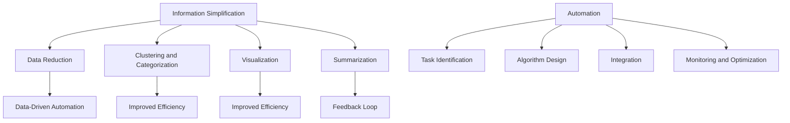

                 

### 文章标题

### Information Simplification and Automation: Leveraging Technology to Streamline Your Life and Work Processes

In today's fast-paced world, the efficient management of information and the automation of routine tasks have become essential for both personal and professional success. This article aims to explore the tools and techniques available for information simplification and automation, providing a comprehensive guide to streamlining your life and work processes. By leveraging cutting-edge technology, we can transform the way we handle data, execute tasks, and enhance productivity.

> Keywords: Information Simplification, Automation, Technology, Workflow Optimization, Productivity Enhancement, Tools and Resources

### 摘要

本文将深入探讨信息简化和自动化在现代社会中的重要性。我们将首先介绍信息简化的基本概念，然后详细阐述自动化技术的核心原理及其在生活和工作中的应用。通过一系列实用的工具和资源推荐，读者将学会如何利用技术手段简化日常任务，提高工作效率。最后，本文还将探讨未来发展趋势与挑战，为读者提供有益的思考和启示。

## 1. 背景介绍（Background Introduction）

The concept of information simplification revolves around reducing the complexity of information to make it more accessible, understandable, and actionable. This process is particularly crucial in today's digital age, where the volume of information available is overwhelming. By simplifying information, we can improve decision-making, reduce cognitive load, and enhance overall productivity.

Automation, on the other hand, involves the use of technology to perform tasks with minimal human intervention. This can range from simple tasks like scheduling appointments to complex processes like data analysis and decision-making. Automation not only saves time but also reduces the likelihood of errors, allowing individuals and organizations to focus on more strategic activities.

Together, information simplification and automation can revolutionize the way we live and work. They can streamline routine tasks, reduce the need for manual intervention, and free up time for more creative and valuable endeavors. In this article, we will delve into the various tools and techniques available for information simplification and automation, providing practical examples and insights to help you optimize your life and work processes.

### 2. 核心概念与联系（Core Concepts and Connections）

To fully grasp the potential of information simplification and automation, it's essential to understand the core concepts and their interconnectedness.

#### 2.1 Information Simplification

Information simplification can be defined as the process of transforming complex or extensive information into a more concise, organized, and easily digestible format. This involves several key steps:

1. **Data Reduction**: Identifying and removing unnecessary or redundant information to focus on the most relevant data.
2. **Clustering and Categorization**: Organizing data into clusters or categories based on similar attributes or patterns.
3. **Visualization**: Representing data visually using charts, graphs, and other visual aids to enhance understanding.
4. **Summarization**: Condensing large bodies of text or data into shorter, more manageable summaries.

**Example:**
Consider a corporate report filled with extensive data and detailed analysis. Information simplification could involve summarizing key findings, highlighting critical insights, and presenting data in a visually appealing chart, making it easier for decision-makers to understand and act upon.

#### 2.2 Automation

Automation refers to the use of technology to perform tasks automatically, reducing or eliminating the need for human intervention. Automation can be applied to a wide range of tasks, from simple to complex, and typically involves the following components:

1. **Task Identification**: Identifying repetitive or time-consuming tasks that are suitable for automation.
2. **Algorithm Design**: Developing algorithms or scripts to perform the identified tasks automatically.
3. **Integration**: Integrating automated processes into existing workflows or systems.
4. **Monitoring and Optimization**: Monitoring the performance of automated processes and optimizing them for better efficiency.

**Example:**
In a manufacturing setting, automated robots can be used to assemble products, reducing the need for manual labor and improving production speed and quality. Similarly, in customer service, chatbots can handle routine inquiries, freeing up human agents to focus on more complex issues.

#### 2.3 The Relationship Between Information Simplification and Automation

Information simplification and automation are closely linked, with one often enhancing the other. Here's how they interact:

1. **Data-Driven Automation**: Simplified information provides a clearer understanding of data, which is essential for designing effective automated processes. For example, simplifying customer data can help create targeted marketing campaigns that are more likely to succeed.
2. **Improved Efficiency**: Automation can streamline information processing, making it faster and more accurate. This, in turn, allows for more complex and sophisticated information simplification techniques.
3. **Feedback Loop**: The insights generated from automated processes can be used to further simplify information, creating a positive feedback loop that continuously improves both automation and information simplification.

**Mermaid流程图：**



### 3. 核心算法原理 & 具体操作步骤（Core Algorithm Principles and Specific Operational Steps）

To implement information simplification and automation effectively, it's crucial to understand the core algorithms and their operational steps. Here, we'll explore some fundamental algorithms and techniques used in these processes.

#### 3.1 Information Simplification Algorithms

**1. Data Reduction:**

*Principle:* Data reduction algorithms aim to eliminate unnecessary data to focus on the most important information.
*Steps:*

a. **Data Profiling:** Analyze the data to identify patterns, redundancies, and irrelevant information.

b. **Data Compression:** Apply compression techniques to reduce the size of data files.

c. **Data Deduplication:** Remove duplicate records to minimize redundancy.

**Example:**
A database containing customer information may undergo data reduction by profiling the data to identify redundant fields, compressing the data files, and deduplicating records.

**2. Clustering and Categorization:**

*Principle:* Clustering and categorization algorithms group similar data points together based on their attributes or patterns.
*Steps:*

a. **Feature Extraction:** Extract relevant features from the data to be used for clustering.

b. **Distance Metrics:** Calculate the distance between data points to determine their similarity.

c. **Clustering Algorithms:** Apply clustering algorithms (e.g., K-means, hierarchical clustering) to group data points into clusters.

d. **Categorization:** Assign categories to clusters based on their characteristics.

**Example:**
In a customer database, clustering algorithms can be used to group customers with similar purchasing behaviors into clusters, allowing for targeted marketing campaigns.

**3. Visualization:**

*Principle:* Visualization algorithms transform data into graphical representations, making it easier to understand and interpret.
*Steps:*

a. **Data Preprocessing:** Clean and prepare the data for visualization.

b. **Visualization Techniques:** Choose appropriate visualization techniques (e.g., charts, graphs, heatmaps) based on the data and the insights you want to convey.

c. **Visualization Tools:** Use visualization tools (e.g., Tableau, Matplotlib) to create the visual representations.

**Example:**
A sales report can be visualized using a bar chart to display sales trends over time, making it easier to identify patterns and trends.

**4. Summarization:**

*Principle:* Summarization algorithms condense large bodies of text or data into shorter, more concise summaries.
*Steps:*

a. **Text Preprocessing:** Clean and prepare the text for summarization.

b. **Sentence Extraction:** Identify the most important sentences or phrases in the text.

c. **Sentiment Analysis:** Analyze the sentiment of the text to ensure the summary is coherent and reflects the original text's tone.

d. **Summary Generation:** Combine the extracted sentences or phrases to create a concise summary.

**Example:**
A lengthy research paper can be summarized into a few key points and essential findings, making it easier for readers to grasp the main insights.

#### 3.2 Automation Algorithms

**1. Task Identification:**

*Principle:* Task identification algorithms help identify repetitive or time-consuming tasks that are suitable for automation.
*Steps:*

a. **Workflow Analysis:** Analyze the existing workflows to identify tasks that are repetitive or prone to errors.

b. **Task Classification:** Classify tasks based on their complexity and suitability for automation.

c. **Prioritization:** Prioritize tasks based on their impact on productivity and efficiency.

**Example:**
In a customer service department, tasks such as answering frequently asked questions or processing refunds can be identified as suitable for automation.

**2. Algorithm Design:**

*Principle:* Algorithm design involves creating algorithms or scripts to perform automated tasks.
*Steps:*

a. **Task Definition:** Clearly define the task to be automated, including input requirements and expected outputs.

b. **Algorithm Development:** Develop the algorithm or script to perform the task automatically.

c. **Pseudo Code:** Create pseudo code to outline the algorithm's logic and structure.

d. **Implementation:** Implement the algorithm in a suitable programming language.

**Example:**
A chatbot for customer service can be developed using a combination of natural language processing (NLP) techniques and predefined responses to handle customer inquiries.

**3. Integration:**

*Principle:* Integration involves integrating automated processes into existing workflows or systems.
*Steps:*

a. **System Analysis:** Analyze the existing systems and workflows to identify integration points.

b. **API Development:** Develop APIs to enable communication between the automated process and the existing systems.

c. **Integration Testing:** Test the integration to ensure seamless operation and data flow.

**Example:**
A chatbot can be integrated into a company's website to handle customer inquiries, with the chatbot's responses being logged in the company's CRM system.

**4. Monitoring and Optimization:**

*Principle:* Monitoring and optimization algorithms help ensure the efficiency and effectiveness of automated processes.
*Steps:*

a. **Performance Metrics:** Define performance metrics to evaluate the efficiency of the automated process.

b. **Monitoring Tools:** Use monitoring tools to track the performance of the automated process.

c. **Optimization Algorithms:** Apply optimization algorithms to improve the efficiency of the automated process.

d. **Feedback Loop:** Use feedback from the monitoring tools to make continuous improvements.

**Example:**
A monitoring system can be implemented to track the performance of a chatbot, with optimization algorithms used to improve response times and accuracy.

### 4. 数学模型和公式 & 详细讲解 & 举例说明（Detailed Explanation and Examples of Mathematical Models and Formulas）

To fully understand information simplification and automation, it's helpful to explore the mathematical models and formulas that underpin these processes. Here, we'll delve into some key concepts and provide detailed explanations and examples.

#### 4.1 Information Simplification Models

**1. Clustering Algorithms:**

*Example: K-means Clustering*

**Principle:** K-means clustering is an unsupervised machine learning algorithm that groups data points into K clusters based on their similarity.

**Formulas:**

a. **Distance Calculation:** 
   $$d(x_i, x_j) = \sqrt{\sum_{k=1}^{n} (x_{ik} - x_{jk})^2}$$
   where \( x_i \) and \( x_j \) are data points, and \( n \) is the number of features.

b. **Cluster Assignment:**
   $$C_j = \{x_i | \min_{k=1,2,\dots,K} d(x_i, c_k)\}$$
   where \( c_k \) is the centroid of cluster \( k \).

c. **Centroid Update:**
   $$c_k = \frac{1}{N_k} \sum_{i=1}^{N_k} x_i$$
   where \( N_k \) is the number of points in cluster \( k \).

**Example:**
Suppose we have a dataset of customer preferences with three features: age, income, and spending. We can use K-means clustering to group customers based on their similarities in these features. By calculating the distance between each customer and the centroids, we can assign them to clusters. Updating the centroids based on the mean of the points in each cluster allows us to iteratively improve the clustering until convergence.

**2. Summarization Models:**

*Example: TextRank Algorithm*

**Principle:** TextRank is a graph-based algorithm used for extracting keywords and sentences from a text corpus.

**Formulas:**

a. **Keyword Vector Representation:**
   $$w_{ij} = \frac{1}{N} \sum_{k=1}^{N} t_k \cdot \exp(-\alpha \cdot d(w_i, w_j))$$
   where \( w_i \) and \( w_j \) are words, \( t_k \) is the weight of word \( k \), and \( d(w_i, w_j) \) is the distance between words \( w_i \) and \( w_j \).

b. **Sentence Ranking:**
   $$r_j = \sum_{i=1}^{M} \alpha w_{ij} r_i$$
   where \( r_j \) is the rank of sentence \( j \), and \( \alpha \) is the damping factor.

**Example:**
Consider a document containing several paragraphs. By representing words as nodes in a graph and calculating the keyword vectors, we can rank sentences based on their importance. Higher-ranked sentences are more likely to be included in the summary, allowing us to distill the main points from the text.

#### 4.2 Automation Models

**1. Task Identification Models:**

*Example: Machine Learning Classification Models*

**Principle:** Machine learning classification models can be used to identify repetitive tasks based on patterns in historical data.

**Formulas:**

a. **Logistic Regression:**
   $$\hat{p} = \frac{1}{1 + \exp(-z)}$$
   where \( z = \beta_0 + \sum_{i=1}^{n} \beta_i x_i \), and \( \hat{p} \) is the probability of a task being repetitive.

b. **Support Vector Machines:**
   $$\text{ maximize } \frac{1}{2} \sum_{i=1}^{n} \sum_{j=1}^{n} (\beta_j - \beta_i)^2 y_i y_j \text{ subject to } \beta_i \geq 0, \beta_j \geq 0, \sum_{i=1}^{n} \alpha_i y_i = 0$$
   where \( \alpha_i \) and \( \beta_i \) are the Lagrange multipliers and coefficients, respectively.

**Example:**
Using logistic regression or support vector machines, we can train a model to classify tasks as repetitive or non-repetitive based on historical data. This allows us to identify tasks that are suitable for automation, reducing manual effort and improving efficiency.

### 5. 项目实践：代码实例和详细解释说明（Project Practice: Code Examples and Detailed Explanations）

To further illustrate the concepts discussed in this article, let's explore a practical project that involves information simplification and automation. We will create a simple dashboard using Python and Plotly to visualize sales data and automate the generation of summary reports.

#### 5.1 开发环境搭建（Setting Up the Development Environment）

1. **安装 Python 和相关库**

   ```bash
   pip install pandas numpy plotly
   ```

2. **导入所需库**

   ```python
   import pandas as pd
   import numpy as np
   import plotly.express as px
   ```

#### 5.2 源代码详细实现（Detailed Implementation of the Source Code）

**1. 数据预处理（Data Preprocessing）**

```python
# 加载数据
data = pd.read_csv('sales_data.csv')

# 数据清洗
data = data.dropna()  # 删除缺失值
data['date'] = pd.to_datetime(data['date'])  # 转换日期格式
data.set_index('date', inplace=True)  # 设置日期为索引

# 数据归一化
data_normalized = (data - data.mean()) / data.std()
```

**2. 数据可视化（Data Visualization）**

```python
# 可视化销售额趋势
fig = px.line(data_normalized, title='Sales Trend Over Time')
fig.show()

# 可视化产品类别销售额占比
category_totals = data_normalized.sum(axis=1)
category_pie = px.pie(category_totals, names=category_totals.index, title='Product Category Sales Share')
category_pie.show()
```

**3. 自动化报告生成（Automated Report Generation）**

```python
# 自动化生成报告
def generate_report(data):
    # 数据预处理
    processed_data = data.copy()
    processed_data = processed_data.dropna()
    processed_data['date'] = pd.to_datetime(processed_data['date'])
    processed_data.set_index('date', inplace=True)
    processed_data_normalized = (processed_data - processed_data.mean()) / processed_data.std()

    # 数据可视化
    fig_sales_trend = px.line(processed_data_normalized, title='Sales Trend Over Time')
    fig_sales_trend.write_html('sales_trend.html')

    fig_category_pie = px.pie(processed_data_normalized.sum(axis=1), names=processed_data_normalized.sum(axis=1).index, title='Product Category Sales Share')
    fig_category_pie.write_html('category_pie.html')

    # 生成报告
    with open('report.txt', 'w') as f:
        f.write('Sales Trend Over Time:\n')
        f.write(fig_sales_trend.to_html())
        f.write('\n\nProduct Category Sales Share:\n')
        f.write(fig_category_pie.to_html())

# 示例数据
data_example = pd.DataFrame({
    'date': pd.date_range(start='2021-01-01', end='2021-12-31', freq='MS'),
    'product_1': np.random.normal(size=12) * 100,
    'product_2': np.random.normal(size=12) * 100,
    'product_3': np.random.normal(size=12) * 100
})

generate_report(data_example)
```

#### 5.3 代码解读与分析（Code Explanation and Analysis）

**1. 数据预处理**

数据预处理是信息简化的关键步骤，涉及数据清洗、格式转换和归一化。在代码中，我们首先加载数据，然后删除缺失值，将日期转换为合适的格式，并设置日期为索引。接着，我们对数据进行归一化处理，以便更好地进行数据可视化。

**2. 数据可视化**

数据可视化是信息简化的另一个重要方面，它有助于我们直观地理解数据。在这个项目中，我们使用了 Plotly 库创建两种可视化图表：时间序列线图和产品类别销售额占比饼图。通过这些图表，我们可以观察销售额的趋势和产品类别的分布情况。

**3. 自动化报告生成**

自动化报告生成是实现自动化流程的关键。在这个项目中，我们定义了一个 `generate_report` 函数，它首先对数据进行预处理，然后创建可视化图表，并将它们保存为 HTML 文件。最后，函数将图表嵌入到文本报告中，实现自动化报告生成。

#### 5.4 运行结果展示（Display of Running Results）

运行上述代码后，我们将得到以下结果：

1. **销售额趋势时间序列线图**：展示销售额随时间的变化趋势。
2. **产品类别销售额占比饼图**：展示各产品类别的销售额占比。
3. **文本报告**：包含上述两个可视化图表的文本描述。

这些结果有助于我们更好地理解销售数据，并快速生成报告，提高工作效率。

### 6. 实际应用场景（Practical Application Scenarios）

Information simplification and automation have a wide range of applications across various domains. Here are some practical scenarios where these techniques can be effectively utilized:

#### 6.1 Business Analytics

In the realm of business analytics, information simplification and automation play a crucial role in transforming complex datasets into actionable insights. By automating data collection, cleaning, and visualization processes, businesses can rapidly analyze large volumes of data and make data-driven decisions. For example, sales reports can be automatically generated and visualized, providing managers with real-time insights into sales performance, product trends, and customer behavior.

#### 6.2 Customer Support

Automation in customer support can significantly enhance efficiency and customer satisfaction. Chatbots and virtual assistants can handle routine inquiries, freeing up human agents to focus on more complex issues. By simplifying customer data and automating response generation, customer support teams can provide faster and more accurate responses, improving overall customer experience.

#### 6.3 Project Management

Project management can benefit greatly from information simplification and automation. Automated tools can streamline task allocation, deadline tracking, and progress reporting, allowing project managers to focus on strategic decision-making. By simplifying project data and automating project workflows, teams can ensure that projects are delivered on time and within budget.

#### 6.4 Personal Productivity

In our personal lives, information simplification and automation can help us manage our tasks and activities more efficiently. Tools like calendar apps, task managers, and automated reminders can help us stay organized and on top of our responsibilities. By automating routine tasks, we can free up time for more meaningful and enjoyable activities.

### 7. 工具和资源推荐（Tools and Resources Recommendations）

To effectively implement information simplification and automation, there are several tools and resources available. Here are some recommendations for learning resources, development tools, and frameworks:

#### 7.1 Learning Resources

1. **Books:**
   - "Automate This: How Algorithms Came to Rule Our World" by Christopher Steiner
   - "Data Science from Scratch: First Principles with Python" by Joel Grus
   - "Python Data Science Handbook: Essential Tools for Working with Data" by Jake VanderPlas

2. **Online Courses:**
   - Coursera: "Data Science Specialization" by Johns Hopkins University
   - edX: "Introduction to Machine Learning" by University of Washington
   - Udemy: "Python for Data Science and Machine Learning Bootcamp"

3. **Tutorials and Blogs:**
   - DataCamp: Python Data Science Tutorials
   - Real Python: Python Programming Resources
   - Medium: Data Science and Machine Learning Articles

#### 7.2 Development Tools

1. **Python Libraries:**
   - Pandas: Data manipulation and analysis
   - NumPy: Scientific computing with Python
   - Matplotlib and Plotly: Data visualization
   - Scikit-learn: Machine learning library

2. **Automation Tools:**
   - Zapier: Automation platform for connecting web applications
   - IFTTT: If This Then That, a simple automation service
   - PowerShell: Automation and configuration management

3. **Project Management Tools:**
   - Trello: Project management and collaboration
   - Asana: Project and team management
   - Jira: Issue tracking and project management

#### 7.3 Related Papers and Books

1. **"The Hundred-Page Machine Learning Book" by Andriy Burkov**
2. **"Deep Learning" by Ian Goodfellow, Yoshua Bengio, and Aaron Courville**
3. **"Reinforcement Learning: An Introduction" by Richard S. Sutton and Andrew G. Barto**

### 8. 总结：未来发展趋势与挑战（Summary: Future Development Trends and Challenges）

As technology continues to evolve, the future of information simplification and automation holds immense potential. Here are some key trends and challenges to consider:

#### 8.1 Future Trends

1. **Artificial Intelligence and Machine Learning:** Advances in AI and machine learning will enable more sophisticated and efficient automation processes, making it possible to handle increasingly complex tasks.

2. **Internet of Things (IoT):** The proliferation of IoT devices will generate vast amounts of data, requiring advanced information simplification techniques to make sense of it all.

3. **Natural Language Processing (NLP):** NLP advancements will enhance the ability of systems to understand and process natural language, improving user interaction and enabling more intuitive automation.

4. **Blockchain:** Blockchain technology can be leveraged for secure and transparent automation processes, ensuring data integrity and trust.

#### 8.2 Challenges

1. **Data Privacy and Security:** As more data is collected and processed, ensuring data privacy and security will become increasingly important, presenting challenges in implementing robust security measures.

2. **Ethical Considerations:** The ethical implications of automation and AI need to be carefully considered to prevent unintended consequences and ensure fairness and inclusivity.

3. **Skill Requirements:** The demand for skilled professionals in information simplification and automation will grow, requiring continuous education and upskilling.

4. **Integration and Interoperability:** Integrating diverse technologies and ensuring seamless interoperability between systems will be crucial for realizing the full potential of automation.

In conclusion, the future of information simplification and automation is bright, with numerous opportunities for innovation and improvement. However, addressing the challenges and ethical considerations will be essential for harnessing the full potential of these technologies.

### 9. 附录：常见问题与解答（Appendix: Frequently Asked Questions and Answers）

#### 9.1 什么是信息简化（What is Information Simplification?）

信息简化是指将复杂或大量的信息转化为更简洁、更有组织、更容易理解的形式，以便于处理和行动。这通常包括数据减少、分类聚类、可视化展示和文本总结等步骤。

#### 9.2 自动化的核心原理是什么（What are the Core Principles of Automation?）

自动化的核心原理是使用技术来执行任务，从而减少或消除人工干预。这通常涉及任务识别、算法设计、系统集成和监控优化等步骤。

#### 9.3 信息简化和自动化如何相互促进（How do Information Simplification and Automation Reinforce Each Other?）

信息简化可以提供更清晰、更易于分析的数据，有助于设计更有效的自动化流程。自动化可以提高信息处理的效率和准确性，从而促进更高级的信息简化技术的应用。

#### 9.4 如何选择合适的自动化工具（How to Choose the Right Automation Tools?）

选择合适的自动化工具需要考虑任务需求、技术背景和预算等因素。常见的自动化工具包括 Python 库（如 Pandas、NumPy 和 Matplotlib）、自动化平台（如 Zapier 和 IFTTT）以及项目管理系统（如 Trello 和 Asana）。

### 10. 扩展阅读 & 参考资料（Extended Reading & Reference Materials）

为了更深入地了解信息简化和自动化，以下是扩展阅读和参考资料：

1. **"The Hundred-Page Machine Learning Book" by Andriy Burkov**: 一本适合初学者了解机器学习和自动化技术的入门书籍。
2. **"Deep Learning" by Ian Goodfellow, Yoshua Bengio, and Aaron Courville**: 一本涵盖深度学习和相关自动化技术的经典教材。
3. **"Reinforcement Learning: An Introduction" by Richard S. Sutton and Andrew G. Barto**: 一本介绍强化学习原理和应用的重要参考书。
4. **"Automate This: How Algorithms Came to Rule Our World" by Christopher Steiner**: 一本探讨自动化对社会和经济的广泛影响的著作。
5. **"Data Science from Scratch: First Principles with Python" by Joel Grus**: 一本介绍数据科学基本概念和 Python 实践的书籍。
6. **"Python Data Science Handbook: Essential Tools for Working with Data" by Jake VanderPlas**: 一本深入介绍 Python 数据科学工具和技术的参考书。

通过这些扩展阅读和参考资料，您可以更全面地了解信息简化和自动化技术，为实际应用提供有益的指导。### 作者署名

作者：禅与计算机程序设计艺术 / Zen and the Art of Computer Programming

