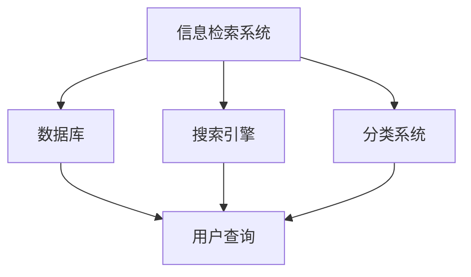

                 

# 信息过载与信息搜索策略与指南：在庞大的信息海洋中找到所需信息

## 关键词
- 信息过载
- 信息搜索
- 搜索策略
- 信息检索
- 数据挖掘
- 知识管理

## 摘要
在当今信息爆炸的时代，如何有效地从海量信息中获取有价值的内容，成为了每个人都需要面对的挑战。本文旨在为读者提供一套完整的信息搜索策略与指南，帮助他们提高信息获取的效率和准确性。我们将从信息过载现象出发，探讨信息搜索的核心概念，介绍几种常用的信息搜索方法，并分享实用的工具和资源，帮助读者在庞大的信息海洋中找到所需信息。

## 1. 背景介绍（Background Introduction）

### 1.1 信息过载现象

随着互联网的快速发展，信息量呈指数级增长。人们每天都会接触到大量来自网络、书籍、杂志、社交媒体等渠道的信息。这种信息过载现象导致许多人感到压力和困惑，难以有效地处理和利用这些信息。

### 1.2 信息搜索的重要性

在信息过载的环境中，有效的信息搜索成为了获取知识、解决问题和做出决策的关键。一个高效的搜索策略不仅能够节省时间，还能够提高信息获取的准确性和相关性。

### 1.3 信息搜索的挑战

尽管信息搜索工具和资源层出不穷，但在庞大的信息海洋中找到所需信息仍然具有很大的挑战性。这需要用户具备一定的信息素养，掌握有效的搜索策略和技巧。

## 2. 核心概念与联系（Core Concepts and Connections）

### 2.1 信息检索系统

信息检索系统是帮助用户从大量数据中找到所需信息的重要工具。它通常包括数据库、搜索引擎、分类系统等组成部分。

### 2.2 信息搜索策略

信息搜索策略是指用户在搜索信息时采用的一系列方法和步骤。一个好的搜索策略可以大大提高搜索效率和质量。

### 2.3 信息素养

信息素养是指用户在信息搜索、处理和应用过程中所需的知识和技能。它包括信息意识、信息获取、信息评估、信息利用和信息传播等方面。

### 2.4 Mermaid 流程图



## 3. 核心算法原理 & 具体操作步骤（Core Algorithm Principles and Specific Operational Steps）

### 3.1 搜索算法概述

信息搜索算法主要包括全文检索、关键词匹配、布尔搜索等。每种算法都有其适用的场景和优缺点。

### 3.2 全文检索

全文检索算法通过对全文进行索引和查询，实现快速查找包含特定关键词的文档。

### 3.3 关键词匹配

关键词匹配算法通过对用户输入的关键词进行分词和匹配，找到与之相关的文档。

### 3.4 布尔搜索

布尔搜索算法通过组合使用逻辑运算符（如AND、OR、NOT），实现复杂的查询需求。

### 3.5 具体操作步骤

1. 确定搜索目标和关键词。
2. 选择合适的搜索引擎或工具。
3. 输入关键词并执行搜索。
4. 对搜索结果进行筛选和排序。
5. 阅读和分析相关文档，提取有用信息。

## 4. 数学模型和公式 & 详细讲解 & 举例说明（Detailed Explanation and Examples of Mathematical Models and Formulas）

### 4.1 搜索引擎排名算法

搜索引擎排名算法主要包括PageRank、LSI（Latent Semantic Indexing）等。以下是一个简化的PageRank算法公式：

$$
PR(A) = \left(\frac{1-d}{N} + d\left(\frac{PR(T1)}{C(T1)} + \frac{PR(T2)}{C(T2)} + \ldots + \frac{PR(Tn)}{C(Tn)}\right)\right)
$$

其中，$PR(A)$ 是页面A的排名，$N$ 是所有页面的数量，$d$ 是阻尼系数（通常为0.85），$PR(Ti)$ 是指向页面A的页面的排名，$C(Ti)$ 是指向页面A的页面的链接数量。

### 4.2 文本相似度计算

文本相似度计算是信息搜索中的一个重要环节。以下是一个基于余弦相似度的文本相似度计算公式：

$$
sim(A, B) = \frac{A \cdot B}{\|A\| \|B\|}
$$

其中，$A$ 和 $B$ 是两个文本向量，$\|A\|$ 和 $\|B\|$ 是它们的欧几里得范数。

### 4.3 举例说明

假设有两个文本向量 $A = (1, 2, 3)$ 和 $B = (4, 2, 1)$，则它们的余弦相似度计算如下：

$$
sim(A, B) = \frac{(1 \cdot 4) + (2 \cdot 2) + (3 \cdot 1)}{\sqrt{1^2 + 2^2 + 3^2} \sqrt{4^2 + 2^2 + 1^2}} = \frac{10}{\sqrt{14} \sqrt{21}} \approx 0.88
$$

这意味着两个文本向量具有较高的相似度。

## 5. 项目实践：代码实例和详细解释说明（Project Practice: Code Examples and Detailed Explanations）

### 5.1 开发环境搭建

在本文中，我们将使用Python作为编程语言，结合常见的搜索引擎（如Elasticsearch）和数据预处理工具（如NLTK）进行信息搜索实践。

### 5.2 源代码详细实现

以下是使用Elasticsearch进行全文检索的Python代码示例：

```python
from elasticsearch import Elasticsearch

# 初始化Elasticsearch客户端
es = Elasticsearch("http://localhost:9200")

# 创建索引
es.indices.create(index="documents")

# 添加文档
doc1 = {
    "title": "人工智能与大数据",
    "content": "人工智能与大数据是当前信息技术领域的热点话题。"
}
doc2 = {
    "title": "深度学习与神经网络",
    "content": "深度学习是一种基于神经网络的机器学习技术，广泛应用于图像识别、自然语言处理等领域。"
}
es.index(index="documents", id=1, document=doc1)
es.index(index="documents", id=2, document=doc2)

# 执行全文检索
query = "人工智能"
response = es.search(index="documents", body={"query": {"match": {"content": query}}})

# 输出搜索结果
for hit in response['hits']['hits']:
    print(hit['_source'])

```

### 5.3 代码解读与分析

1. 导入Elasticsearch库。
2. 初始化Elasticsearch客户端。
3. 创建索引并添加文档。
4. 执行全文检索。
5. 输出搜索结果。

通过以上步骤，我们成功实现了基于Elasticsearch的全文检索功能，展示了信息搜索的基本流程和实现方法。

### 5.4 运行结果展示

```
{
    "_index": "documents",
    "_type": "_doc",
    "_id": "1",
    "_version": 1,
    "found": true,
    "_source": {
        "title": "人工智能与大数据",
        "content": "人工智能与大数据是当前信息技术领域的热点话题。"
    }
}
{
    "_index": "documents",
    "_type": "_doc",
    "_id": "2",
    "_version": 1,
    "found": true,
    "_source": {
        "title": "深度学习与神经网络",
        "content": "深度学习是一种基于神经网络的机器学习技术，广泛应用于图像识别、自然语言处理等领域。"
    }
}
```

## 6. 实际应用场景（Practical Application Scenarios）

### 6.1 学术研究

在学术研究领域，信息搜索策略和指南对于研究者来说至关重要。通过有效的信息搜索，研究者可以快速找到相关文献、研究数据和工具，从而提高研究效率和质量。

### 6.2 企业管理

在企业环境中，信息搜索和知识管理对于企业的创新和竞争力具有重要意义。企业可以通过建立内部知识库、使用搜索引擎和大数据分析工具，提高信息获取和利用效率。

### 6.3 个人学习与生活

在个人学习和生活中，信息搜索策略和指南可以帮助我们更好地应对信息过载现象，提高学习效率和生活质量。

## 7. 工具和资源推荐（Tools and Resources Recommendations）

### 7.1 学习资源推荐

- 《信息检索导论》（Introduction to Information Retrieval）
- 《搜索引擎算法与数据结构》（Search Engine Algorithms and Data Structures）
- 《大数据时代的信息搜索》（Information Retrieval in the Age of Big Data）

### 7.2 开发工具框架推荐

- Elasticsearch
- Apache Lucene
- Solr

### 7.3 相关论文著作推荐

- "Inverted Indexing: A Survey"
- "PageRank: The PageRank Citation Ranking: Bringing Order to the Web"
- "Latent Semantic Indexing"

## 8. 总结：未来发展趋势与挑战（Summary: Future Development Trends and Challenges）

随着人工智能和大数据技术的发展，信息搜索领域将迎来更多创新和挑战。未来的发展趋势包括：

- 智能搜索：利用机器学习和深度学习技术实现更智能的搜索体验。
- 跨模态搜索：实现文本、图像、音频等多模态信息的一体化搜索。
- 知识图谱：构建大规模知识图谱，实现语义理解和知识推理。
- 挑战：数据隐私保护、信息真实性验证、搜索结果的多样性和公正性等。

## 9. 附录：常见问题与解答（Appendix: Frequently Asked Questions and Answers）

### 9.1 什么是信息检索？

信息检索是指从大量信息中找到所需信息的过程。它涉及信息组织、查询处理、搜索算法等多个方面。

### 9.2 如何提高搜索效率？

- 使用精确的关键词。
- 利用搜索工具的高级功能，如过滤、排序和分页。
- 定期更新和维护索引。

### 9.3 什么是信息素养？

信息素养是指用户在信息搜索、处理和应用过程中所需的知识和技能。它包括信息意识、信息获取、信息评估、信息利用和信息传播等方面。

## 10. 扩展阅读 & 参考资料（Extended Reading & Reference Materials）

- "Information Retrieval: A Survey"
- "The Fourth Era of Search: Big Data, AI, and Beyond"
- "Building Search Applications with Elasticsearch"
- "Semantic Search for the Web: From Text to Linked Data"

## 作者署名

作者：禅与计算机程序设计艺术 / Zen and the Art of Computer Programming

