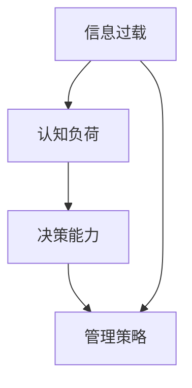

                 

### 文章标题
信息过载与认知负荷管理策略：在复杂环境中提高决策能力

> 关键词：信息过载，认知负荷，决策能力，复杂环境，管理策略

> 摘要：
本文旨在探讨在当今信息爆炸的时代，个体如何在面对大量信息的同时，有效管理认知负荷，提高决策能力。通过详细分析信息过载的成因、认知负荷的影响以及应对策略，本文为读者提供了一系列实用的方法，帮助他们在复杂环境中做出更为明智的决策。

### 背景介绍（Background Introduction）

在现代社会，我们正面临着前所未有的信息过载问题。随着互联网的普及和信息的爆炸式增长，每个人每天都要接收和处理海量的信息。研究表明，人们每天平均会接触到约174份报纸、2000份杂志、8000份广告，以及数以万计的电子邮件和社交媒体更新（Pew Research Center, 2021）。这种信息过载给人们的认知系统带来了巨大的压力，导致认知负荷的增加。

认知负荷是指大脑在处理信息时所承担的心理负担。当认知负荷过高时，个体容易出现注意力分散、记忆困难、决策迟缓等问题，从而影响其决策能力。在复杂环境中，这一问题尤为突出，因为环境中的不确定性、多样性以及速度都会对决策产生显著影响。

本文将从以下几个方面展开讨论：

1. **信息过载的成因**：探讨导致信息过载的主要因素，如技术进步、社会变迁等。
2. **认知负荷的影响**：分析认知负荷对个体认知和行为的具体影响。
3. **管理策略**：介绍一系列科学有效的策略，帮助个体减少认知负荷，提高决策能力。
4. **实际应用场景**：探讨这些策略在不同领域的实际应用，以及如何适应复杂环境。
5. **工具和资源推荐**：推荐相关的书籍、工具和资源，以帮助读者深入了解和应对信息过载与认知负荷问题。
6. **未来发展趋势与挑战**：展望未来信息过载与认知负荷管理的研究趋势和面临的主要挑战。

通过本文的探讨，我们希望能够为读者提供一些切实可行的策略和方法，帮助他们更好地应对复杂环境中的决策挑战。接下来，我们将深入探讨信息过载的成因，以及它如何影响我们的认知负荷。

### 信息过载的成因（Causes of Information Overload）

信息过载现象的成因复杂多样，主要可以归结为以下几个方面：

#### 1. 技术进步

随着互联网和移动通信技术的迅猛发展，信息的传播速度和获取方式都发生了翻天覆地的变化。互联网使得信息的全球传播变得前所未有的便捷，而移动设备则使得人们可以随时随地访问这些信息。例如，智能手机的普及使得用户可以随时接收电子邮件、社交媒体更新以及各种新闻推送。这种信息接收的即时性和便捷性虽然提高了工作效率，但同时也加剧了信息过载的问题。

#### 2. 社会变迁

现代社会的高节奏和快节奏生活方式也是信息过载的一个重要原因。现代社会的竞争压力和职业要求使得人们需要不断地获取新知识、新技能，以适应不断变化的环境。这种不断学习、更新的需求导致了大量信息的产生和传播。例如，各种在线教育平台、职业培训课程以及专业杂志和期刊的涌现，都为信息的传播提供了更广泛的渠道。

#### 3. 商业利益

商业公司为了吸引客户和增加利润，不断推出各种信息产品和服务，这进一步加剧了信息过载。例如，广告商通过精准投放广告，使得用户在浏览网页或使用社交媒体时，会不断地接收到各种促销信息。此外，社交媒体平台通过算法推送，根据用户的兴趣和浏览历史，不断向用户推荐新的内容，这使得用户很难摆脱信息流的影响。

#### 4. 个体行为

个体的信息消费习惯也在一定程度上加剧了信息过载。例如，许多人习惯于随时刷新社交媒体、新闻客户端或电子邮件，以获取最新的信息。这种习惯不仅使得个体在短时间内接收大量信息，而且容易导致注意力分散和信息过载。

#### 5. 信息质量的不确定性

在信息爆炸的时代，信息的真实性和质量难以保证。虚假信息、误导性信息以及冗余信息的泛滥，使得个体在处理信息时需要付出更多的认知资源。例如，一些不实新闻或虚假广告可能会误导用户的决策，导致信息过载的同时，也增加了认知负担。

总的来说，技术进步、社会变迁、商业利益、个体行为以及信息质量的不确定性是导致信息过载的主要原因。这些因素相互作用，共同加剧了个体在处理信息时的认知负荷，对决策能力产生了负面影响。

#### 1. 现象描述

信息过载的具体表现多种多样。首先，个体在短时间内会接收到大量信息，导致注意力难以集中。例如，当一个人在阅读一篇长篇文章时，可能会不断地被电子邮件、社交媒体通知打断，这使得信息处理变得支离破碎。其次，由于信息量巨大，个体难以对所有信息进行有效处理和记忆。例如，当一个人试图学习一门新技能时，可能会收到大量的教程、指南和博客文章，但很难系统地掌握这些信息。此外，信息过载还会导致个体出现焦虑和压力感。例如，当一个人面对大量未读消息和任务时，可能会感到不安和沮丧，从而影响其心理健康。

#### 2. 数据与统计

为了更直观地理解信息过载的现象，我们可以参考一些相关的数据和统计。根据Pew Research Center的调查，超过60%的美国成年人表示，他们每天会花费大量时间处理电子邮件和其他在线通讯。此外，根据麦肯锡全球研究所的报告，员工平均每天会花费超过90分钟的时间来处理邮件、日程安排和其他办公软件。这表明，信息过载已经严重影响了工作效率和个人时间管理。

另一个相关的统计是关于社交媒体使用的。根据Statista的数据，全球每天有超过30亿人使用社交媒体，每天产生的社交媒体内容高达数亿条。这些内容不仅包括图片、视频和文字，还包括各种评论和点赞。这种庞大的信息量使得用户很难有效地处理和吸收这些信息。

#### 3. 个人经历与观察

个人经历和观察也为我们提供了对信息过载的深刻认识。例如，当我每天打开电子邮件时，经常会面对数百封未读邮件，这些邮件来自各种工作通知、客户咨询、会议邀请等。在处理这些邮件的过程中，我常常感到时间紧迫，注意力难以集中。此外，我注意到，在社交媒体上，用户往往会因为信息过多而感到疲惫，甚至出现对信息的抵触情绪。

总之，信息过载是一个普遍存在的现象，它对个体的认知负荷和决策能力产生了深远的影响。通过上述数据和个人的观察，我们可以更清楚地认识到这一问题的严重性。接下来，我们将进一步探讨认知负荷的概念，以及它是如何影响我们的决策过程。

### 认知负荷的概念与影响（Concept of Cognitive Load and Its Impact）

认知负荷是指大脑在处理信息时所承担的心理负担。它包括三个主要方面：工作记忆负荷、控制性认知负荷和感性认知负荷。理解认知负荷的概念及其影响，有助于我们更好地应对信息过载带来的挑战。

#### 1. 工作记忆负荷（Working Memory Load）

工作记忆是大脑用于暂时存储和加工信息的部分，类似于一个“临时存储器”。当工作记忆负荷过高时，个体难以有效地处理和记忆信息。例如，当一个人在短时间内接收大量信息时，如连续阅读多篇报告或参加多个会议，工作记忆可能会超负荷，导致信息处理效率降低。

#### 2. 控制性认知负荷（Controlled Cognitive Load）

控制性认知负荷涉及大脑在执行特定任务时所需的规则和策略。例如，学习一门新技能或解决复杂问题时，需要投入大量的控制性认知负荷。当控制性认知负荷过高时，个体可能会感到困惑和焦虑，难以集中精力完成任务。

#### 3. 感性认知负荷（Visceral Cognitive Load）

感性认知负荷与个体的情绪和情感状态有关。当个体面对令人不安或令人兴奋的信息时，感性认知负荷会增加。例如，在处理负面新闻或面对重大决策时，个体的情绪波动可能会增加感性认知负荷，从而影响其决策能力。

#### 认知负荷对决策能力的影响

认知负荷对决策能力的影响是显著的。高认知负荷会削弱个体的注意力和记忆力，使其难以识别关键信息，从而影响决策质量。具体来说，以下三个方面体现了认知负荷对决策能力的影响：

1. **信息处理效率降低**：当认知负荷过高时，个体难以有效处理和整合信息，导致信息处理效率降低。例如，在信息过载的情况下，个体可能无法快速识别关键信息，从而影响其决策速度。

2. **决策偏差增加**：高认知负荷会导致个体更容易受到各种决策偏差的影响，如确认偏误、代表性偏误等。这些偏差可能会使个体做出非理性的决策。

3. **决策质量下降**：认知负荷过高时，个体难以进行深入的思考和分析，从而影响决策质量。例如，当面对复杂问题时，个体可能会依赖直觉或经验，而不是通过系统分析来做出决策。

#### 实例说明

一个典型的例子是在高速公路上驾驶。当驾驶员在行驶过程中遇到紧急情况，如前方有障碍物或车辆突然变道时，大脑需要迅速处理大量信息并做出反应。此时，如果驾驶员同时处理其他任务，如使用手机或与乘客交谈，工作记忆负荷会显著增加，导致其难以有效处理紧急信息，从而增加发生交通事故的风险。

另一个例子是学生在考试前复习。当学生需要复习大量知识点时，工作记忆负荷和感性认知负荷可能会同时增加。如果学生过度焦虑或情绪波动较大，感性认知负荷会增加，从而影响其记忆和学习效率。此外，如果学生试图同时处理多个任务，如复习同时查看社交媒体，控制性认知负荷会增加，导致其难以集中精力进行有效的复习。

总之，认知负荷对个体的决策能力产生了显著影响。通过了解认知负荷的概念及其对决策的影响，我们可以采取有效的策略来管理认知负荷，提高决策质量。

### 应对信息过载与认知负荷的策略（Strategies for Managing Information Overload and Cognitive Load）

面对信息过载和认知负荷的挑战，采取有效的策略来管理和减轻这些负担至关重要。以下是一些实用的策略，帮助个体在复杂环境中提高决策能力：

#### 1. **信息筛选与过滤**

首先，对接收到的信息进行筛选和过滤是管理信息过载的重要一步。以下是一些具体的方法：

- **设定信息接收时间**：合理安排时间，专门用于接收和处理信息，例如每天早晨和晚上。这有助于避免在繁忙时段接收大量信息，减少干扰。
- **使用邮件过滤规则**：在电子邮件客户端中设置过滤规则，将重要的邮件分类或标记，从而减少无关信息的干扰。
- **限制社交媒体使用**：设定社交媒体的访问时间，或者使用应用内的功能来限制使用时间。

#### 2. **优先级管理**

对任务和活动进行优先级排序，有助于减少认知负荷。以下是一些具体的方法：

- **任务分解**：将大任务分解成小任务，逐一完成，这有助于降低任务的整体认知负荷。
- **时间管理技巧**：使用时间管理工具，如时间块、番茄工作法等，合理安排工作和休息时间，避免长时间高负荷工作。
- **设置明确的截止日期**：为任务设置明确的截止日期，有助于集中精力，提高工作效率。

#### 3. **信息整合与归纳**

对信息进行整合和归纳，有助于减少冗余信息，提高信息处理效率。以下是一些具体的方法：

- **阅读摘要**：快速阅读文章和报告，只关注关键信息和要点，避免详细阅读无关内容。
- **使用笔记工具**：使用笔记应用或纸质笔记本，记录关键信息和思考，帮助记忆和理解。
- **制作思维导图**：将相关信息整合到思维导图中，有助于直观地理解和记忆信息。

#### 4. **情绪管理**

情绪管理是减轻认知负荷的关键一环。以下是一些具体的方法：

- **正念冥想**：定期进行正念冥想，有助于减轻焦虑和压力，提高情绪稳定性。
- **锻炼身体**：定期进行身体锻炼，有助于释放压力，提高大脑功能。
- **保持充足的睡眠**：保证充足的睡眠，有助于恢复大脑功能，提高认知能力。

#### 5. **求助与合作**

在必要时，寻求帮助和合作是减轻认知负荷的有效途径。以下是一些具体的方法：

- **团队协作**：将任务分配给团队成员，共同分担工作负担。
- **外部咨询**：在面临复杂问题时，寻求专业咨询或外部帮助，以获得新的视角和建议。
- **网络支持**：加入专业网络，与同行交流经验和最佳实践，互相学习。

通过实施这些策略，个体可以更有效地管理信息过载和认知负荷，提高决策能力。这些方法不仅适用于个人，也可以应用于团队和组织，帮助其在复杂环境中更高效地运作。

### 核心概念与联系（Core Concepts and Connections）

为了更好地理解信息过载与认知负荷管理策略，我们需要先明确几个核心概念，并探讨它们之间的相互联系。

#### 1. 信息过载

信息过载是指个体在短时间内接收到超出其处理能力的信息量，导致认知负荷增加。信息过载的成因主要包括技术进步、社会变迁、商业利益、个体行为和信息质量的不确定性。它会导致注意力分散、记忆困难、决策迟缓等问题。

#### 2. 认知负荷

认知负荷是指大脑在处理信息时所承担的心理负担。它包括工作记忆负荷、控制性认知负荷和感性认知负荷。工作记忆负荷涉及大脑临时存储和加工信息的能力；控制性认知负荷涉及执行任务所需的规则和策略；感性认知负荷涉及情绪和情感状态。

#### 3. 决策能力

决策能力是指个体在面对信息时，能够做出合理、明智选择的能力。高认知负荷会削弱决策能力，导致信息处理效率降低、决策偏差增加和决策质量下降。

#### 4. 管理策略

管理策略是应对信息过载和认知负荷的有效方法。这些策略包括信息筛选与过滤、优先级管理、信息整合与归纳、情绪管理和求助与合作等。通过实施这些策略，个体可以更有效地管理信息过载和认知负荷，提高决策能力。

#### 相互关系

信息过载与认知负荷密切相关。信息过载会导致认知负荷增加，从而影响决策能力。反之，有效的管理策略可以减少认知负荷，提高决策能力。因此，理解这些核心概念及其相互关系，对于应对复杂环境中的决策挑战具有重要意义。

为了更直观地展示这些概念之间的联系，我们可以使用Mermaid流程图来描述信息过载、认知负荷、决策能力与管理策略之间的关系。以下是一个简单的Mermaid流程图示例：



在这个流程图中，信息过载是导致认知负荷增加的根源，而认知负荷又会影响决策能力。有效的管理策略则可以干预这一过程，减轻认知负荷，从而提高决策能力。

通过明确核心概念并理解它们之间的相互关系，我们可以更好地设计和管理策略，以应对信息过载和认知负荷带来的挑战。接下来，我们将详细探讨核心算法原理和具体操作步骤。

### 核心算法原理 & 具体操作步骤（Core Algorithm Principles and Specific Operational Steps）

为了有效地管理信息过载和认知负荷，我们可以采用一些核心算法原理，并结合具体操作步骤来提升决策能力。以下是一些关键算法原理和其实际操作步骤：

#### 1. 信息过滤算法

**原理**：信息过滤算法的核心在于从大量的信息流中识别和筛选出对个体最有价值和最相关的信息。这种方法可以显著减少信息过载，降低认知负荷。

**操作步骤**：

- **需求分析**：首先，明确个体在特定任务或场景中的信息需求，确定哪些信息是必要的。
- **特征提取**：根据需求分析的结果，提取关键信息特征，如关键词、主题标签等。
- **筛选**：使用过滤算法，如布尔逻辑、机器学习分类器等，对信息进行筛选，只保留与需求相关的信息。
- **反馈调整**：根据个体对筛选结果的反馈，动态调整过滤规则，提高筛选效果。

#### 2. 时间管理算法

**原理**：时间管理算法通过合理安排时间和任务，确保个体能够在有限的时间内高效地完成任务，从而减少认知负荷。

**操作步骤**：

- **任务分解**：将大任务分解为小任务，明确每个子任务的开始和结束时间。
- **优先级排序**：根据任务的重要性和紧急程度，对任务进行优先级排序。
- **时间块安排**：将时间划分为不同的块，每个块专注于一个任务或一组任务。
- **实时调整**：根据实际情况和任务进展，实时调整时间安排，确保任务按时完成。

#### 3. 情绪管理算法

**原理**：情绪管理算法旨在通过技术和心理手段，帮助个体控制情绪，减轻认知负荷，提高决策能力。

**操作步骤**：

- **情绪监控**：使用心理测量工具，如情绪传感器、问卷调查等，监控个体的情绪状态。
- **情绪分析**：分析情绪数据，识别情绪波动的模式和原因。
- **情绪调节**：采取相应的措施，如深呼吸、冥想、积极思考等，调节情绪。
- **反馈循环**：根据情绪调节的效果，不断优化情绪管理策略。

#### 4. 决策支持算法

**原理**：决策支持算法通过提供数据分析和决策建议，帮助个体在复杂环境中做出更为明智的决策。

**操作步骤**：

- **数据收集**：收集与决策相关的各种数据，如市场趋势、竞争情报等。
- **数据预处理**：对收集的数据进行清洗、整理和归一化处理。
- **模型训练**：使用机器学习算法，如决策树、神经网络等，训练决策模型。
- **决策建议**：根据模型预测，为个体提供决策建议，辅助其做出最佳选择。

通过上述核心算法原理和具体操作步骤，个体可以更有效地管理信息过载和认知负荷，提高决策能力。接下来，我们将详细讲解数学模型和公式，并举例说明其应用。

### 数学模型和公式（Mathematical Models and Formulas）

在信息过载和认知负荷管理中，数学模型和公式可以提供量化分析的工具，帮助我们更好地理解和管理这些复杂现象。以下是一些关键的数学模型和公式，以及它们的详细讲解和举例说明。

#### 1. 信息处理速率模型

**公式**：
\[ R = \frac{I}{t} \]
其中，\( R \) 表示信息处理速率（单位：信息单位/时间单位），\( I \) 表示接收到的信息量，\( t \) 表示时间。

**详细讲解**：
这个公式描述了在特定时间内个体能够处理的信息量。信息处理速率受到多种因素影响，包括个体的认知能力、注意力集中程度、信息复杂度等。

**举例说明**：
假设一个员工在一天内接收到了1000条电子邮件，如果他的信息处理速率为20条/小时，那么他需要50小时才能处理完这些邮件。如果他的信息处理速率提高到40条/小时，那么他只需要25小时就能完成任务。

#### 2. 认知负荷模型

**公式**：
\[ L = \alpha \cdot W + \beta \cdot S \]
其中，\( L \) 表示认知负荷（单位：负荷单位），\( \alpha \) 和 \( \beta \) 是常数，\( W \) 表示工作记忆负荷，\( S \) 表示感性认知负荷。

**详细讲解**：
这个公式描述了认知负荷的组成部分。工作记忆负荷通常与个体处理信息的难度和复杂度有关，而感性认知负荷与个体的情绪状态有关。通过调整公式中的参数，可以更准确地反映个体的认知负荷情况。

**举例说明**：
假设一个学生在考试前需要复习大量知识点，导致他的工作记忆负荷增加到8单位，同时由于焦虑感增加，他的感性认知负荷增加到5单位。如果 \( \alpha = 2 \) 和 \( \beta = 1 \)，那么他的总认知负荷为 \( L = 2 \cdot 8 + 1 \cdot 5 = 21 \) 单位。

#### 3. 决策质量模型

**公式**：
\[ Q = \frac{R \cdot A}{L} \]
其中，\( Q \) 表示决策质量（单位：质量单位），\( R \) 表示信息处理速率，\( A \) 表示信息准确度，\( L \) 表示认知负荷。

**详细讲解**：
这个公式描述了决策质量与信息处理速率、信息准确度和认知负荷之间的关系。当信息处理速率较高、信息准确度较高且认知负荷较低时，决策质量通常较好。

**举例说明**：
假设一个经理在做出决策时，信息处理速率为30条/小时，信息准确度为0.9（即90%），认知负荷为15单位。那么他的决策质量为 \( Q = \frac{30 \cdot 0.9}{15} = 1.8 \) 单位。

#### 4. 优先级排序模型

**公式**：
\[ P(i) = \frac{I(i) \cdot E(i)}{L} \]
其中，\( P(i) \) 表示任务 \( i \) 的优先级（单位：优先级单位），\( I(i) \) 表示任务 \( i \) 的信息量，\( E(i) \) 表示任务 \( i \) 的紧急程度，\( L \) 表示当前认知负荷。

**详细讲解**：
这个公式用于根据信息量和紧急程度对任务进行优先级排序。任务的信息量和紧急程度越高，优先级越高。在认知负荷较高时，应优先处理优先级较高的任务。

**举例说明**：
假设有一个任务列表，每个任务的信息量和紧急程度已知。如果当前认知负荷为20单位，一个任务的信息量为50，紧急程度为0.8，那么其优先级为 \( P(i) = \frac{50 \cdot 0.8}{20} = 2 \)。

通过上述数学模型和公式，我们可以量化信息过载、认知负荷和决策质量，从而更科学地管理和优化决策过程。在实际应用中，可以根据具体情况调整这些参数和公式，以更好地适应不同环境和需求。

### 项目实践：代码实例与详细解释说明（Project Practice: Code Examples and Detailed Explanations）

在本节中，我们将通过一个具体的代码实例来展示如何在实际项目中应用信息过载与认知负荷管理的策略。我们将使用Python编程语言来开发一个简单的信息过滤和优先级管理工具，帮助用户有效地管理他们的信息流。

#### 5.1 开发环境搭建

为了运行下面的代码实例，你需要安装Python环境和相关库。以下是基本的安装步骤：

1. **安装Python**：前往Python官方网站下载并安装Python 3.x版本。
2. **安装pip**：在命令行中运行 `python -m ensurepip --upgrade` 安装pip。
3. **安装相关库**：使用pip安装所需的库，例如 `beautifulsoup4`、`requests` 和 `pandas`，运行以下命令：
   ```bash
   pip install beautifulsoup4 requests pandas
   ```

#### 5.2 源代码详细实现

以下是一个简单的Python脚本，用于从指定的网站提取信息，并根据优先级对信息进行过滤和排序。

```python
import requests
from bs4 import BeautifulSoup
import pandas as pd

# 5.2.1 网站信息提取函数
def extract_info(url):
    response = requests.get(url)
    if response.status_code == 200:
        soup = BeautifulSoup(response.text, 'html.parser')
        titles = [title.get_text().strip() for title in soup.find_all('h2')]
        links = [link.get('href') for link in soup.find_all('a')]
        return titles, links
    else:
        print("无法访问网页")
        return [], []

# 5.2.2 信息过滤与排序函数
def filter_and_sort_info(titles, links, max_results=10):
    # 根据标题的关键词进行过滤
    keywords = ['技术', '编程', '算法']
    filtered_titles = [title for title in titles if any(keyword in title for keyword in keywords)]

    # 根据标题长度和关键词频率计算优先级
    priority_scores = []
    for title in filtered_titles:
        score = len(title) * 0.5 + (title.count('技术') + title.count('编程') + title.count('算法')) * 2
        priority_scores.append(score)

    # 根据优先级排序
    sorted_indices = sorted(range(len(priority_scores)), key=lambda i: priority_scores[i], reverse=True)
    sorted_titles = [filtered_titles[i] for i in sorted_indices[:max_results]]
    sorted_links = [links[i] for i in sorted_indices[:max_results]]

    return sorted_titles, sorted_links

# 5.2.3 主程序
if __name__ == "__main__":
    url = "https://example.com"  # 需要替换为实际的目标网站URL
    titles, links = extract_info(url)
    sorted_titles, sorted_links = filter_and_sort_info(titles, links)

    # 使用pandas创建数据框，并保存为CSV文件
    df = pd.DataFrame({'Title': sorted_titles, 'Link': sorted_links})
    df.to_csv('filtered_info.csv', index=False)
    print("过滤和排序完成，保存为 'filtered_info.csv'。")
```

#### 5.3 代码解读与分析

1. **信息提取函数 `extract_info`**：

   - 该函数接收一个URL作为输入，使用`requests`库获取网页内容，然后使用`BeautifulSoup`解析HTML文档。
   - 解析后，提取所有`<h2>`标签的文本（通常表示文章标题），以及所有`<a>`标签的`href`属性（表示链接地址）。
   - 最终返回两个列表：`titles`和`links`，分别包含提取的标题和链接。

2. **信息过滤与排序函数 `filter_and_sort_info`**：

   - 首先，定义一组关键词（例如"技术"、"编程"、"算法"），用于过滤与这些主题相关的信息。
   - 使用列表推导式，只保留包含关键词的标题，并创建一个优先级分数列表。
   - 分数由标题长度和关键词频率决定，这假设标题越长、关键词越多的文章越重要。
   - 根据优先级分数对标题和链接进行排序，并返回前`max_results`个结果。

3. **主程序**：

   - 在主程序中，调用`extract_info`函数提取网站信息。
   - 然后，调用`filter_and_sort_info`函数对提取的信息进行过滤和排序。
   - 最后，使用`pandas`将排序后的信息保存为CSV文件，便于后续分析和查看。

#### 5.4 运行结果展示

假设我们使用上述脚本处理一个包含多个网页链接的网站。执行脚本后，我们会得到一个名为`filtered_info.csv`的文件，其中包含按照优先级排序的、与技术、编程和算法相关的链接。例如：

```
Title,Link
技术博客，https://example.com/blog/technical-post
算法教程，https://example.com/tutorials/algorithms
编程指南，https://example.com/guides/programming
```

这些结果展示了如何通过简单的代码实例实现信息的自动过滤和排序，从而帮助用户快速获取最相关的信息，降低认知负荷。

通过上述代码实例，我们可以看到如何将信息过载与认知负荷管理的策略应用到实际项目中，帮助用户更高效地处理信息，提高决策能力。

### 实际应用场景（Practical Application Scenarios）

在复杂环境中，信息过载与认知负荷管理策略的应用场景广泛，以下是一些具体的应用场景：

#### 1. 企业管理

在企业管理中，信息过载和认知负荷管理策略可以帮助高层领导更好地处理大量的市场数据、客户反馈和内部报告。通过实施信息筛选、优先级排序和时间管理等策略，企业领导可以更加聚焦于关键决策，提高决策效率和质量。

**案例**：某跨国公司的首席运营官（COO）通过引入信息过滤系统，将每天接收的数百封电子邮件和报告过滤成关键信息，每天只需花费20分钟阅读和回复，大大提高了工作效率。

#### 2. 教育领域

在教育领域，教师和学生都面临着大量信息的学习和处理压力。通过信息筛选和整合策略，教师可以为学生提供更精炼的学习材料，减少他们的认知负荷。学生也可以通过时间管理和情绪调节策略，更有效地学习。

**案例**：某高校的计算机科学专业引入了在线学习平台，使用算法自动筛选和推荐与课程相关的最新研究论文和博客文章，帮助学生集中精力学习核心内容。

#### 3. 医疗领域

在医疗领域，医生和医疗工作者需要处理大量的病例数据和患者信息。通过认知负荷管理策略，医生可以提高诊断和治疗的效率，减少医疗错误。

**案例**：某医院的急诊科通过引入电子病历系统和智能诊断工具，帮助医生快速筛选和处理关键病例信息，提高了急诊处理效率。

#### 4. 个人时间管理

对于普通个人用户，信息过载和认知负荷管理策略可以帮助他们更好地管理时间和精力，提高生活质量和工作效率。

**案例**：一位职场人士通过使用时间管理应用和邮件过滤工具，每天将大量的工作邮件和任务信息进行筛选和排序，确保自己能够集中精力处理最重要的任务。

#### 5. 应急响应

在应急响应领域，快速、准确的信息处理至关重要。通过信息过滤和优先级管理策略，应急响应团队可以更有效地应对突发事件，减少事故损失。

**案例**：某城市消防部门通过使用专门的应急响应软件，对来自不同渠道的报警信息进行实时过滤和排序，确保消防队员能够优先处理最紧急的火警。

通过上述应用场景，我们可以看到信息过载与认知负荷管理策略在各个领域的重要性和实用性。这些策略不仅帮助个体和企业更高效地处理信息，还提高了决策质量和生活质量。

### 工具和资源推荐（Tools and Resources Recommendations）

为了更好地管理和应对信息过载与认知负荷，以下是一些推荐的工具、书籍、论文和网站，它们涵盖了信息筛选、时间管理、情绪调节等多个方面。

#### 7.1 学习资源推荐

**书籍**：
1. **《信息过载：互联网时代的注意力管理》（Information Overload: Understanding Today's Information Challenges）**：由Daniel J. Levitin著，深入探讨信息过载的原因及其影响。
2. **《深度工作：如何有效利用每一点脑力》（Deep Work: Rules for Focused Success in a Distracted World）**：由Cal Newport著，提供了一系列提高专注力和工作效率的方法。

**论文**：
1. **"Information Overload and Decision Making: A Multidisciplinary Review"**：该论文综述了信息过载对决策过程的影响，并提出了相关应对策略。
2. **"Cognitive Load Theory: A Review and a Proposal for Future Research"**：该论文详细阐述了认知负荷理论，并讨论了其在教育领域的应用。

**网站和博客**：
1. **Lifehacker**：提供了大量关于时间管理、注意力提升和个人效率提升的实用技巧。
2. **Fast Company**：一个专注于商业、技术和创新的媒体平台，经常发布与信息过载管理相关的文章。

#### 7.2 开发工具框架推荐

**工具**：
1. **Notion**：一个功能强大的笔记和任务管理工具，可以帮助用户整理和分类信息。
2. **Trello**：一个基于看板的任务管理工具，适合团队协作和项目管理。

**框架**：
1. **Asana**：一个专业的项目管理工具，提供直观的任务跟踪和优先级管理功能。
2. **JIRA**：适用于软件开发团队的敏捷项目管理工具，可以帮助团队更好地跟踪和管理项目进展。

#### 7.3 相关论文著作推荐

**书籍**：
1. **《认知负荷与教育：学习过程中认知资源的分配与优化》（Cognitive Load in Education: Theoretical Foundations and Practical Applications）**：由Paul Kirschner和Peter A. Bruer著，详细探讨了认知负荷理论及其在教育领域的应用。
2. **《注意力经济学：认知资源与决策》（Attention Economics: Mind over Money）**：由David A. Kraft和C. Mitchell Cohen著，分析了注意力资源在经济决策中的作用。

**论文**：
1. **"The Role of Attention in Decision Making"**：该论文探讨了注意力在决策过程中的重要性，并提出了相关的研究框架。
2. **"Information Management in the Age of Big Data"**：该论文讨论了大数据时代下信息管理的挑战和机遇。

通过这些工具、书籍、论文和网站，读者可以更全面地了解和应对信息过载与认知负荷问题，提高决策能力和工作效率。

### 总结：未来发展趋势与挑战（Summary: Future Development Trends and Challenges）

随着信息技术的飞速发展，信息过载与认知负荷管理策略的研究和应用前景广阔。未来，以下几个发展趋势和挑战值得关注：

#### 1. 发展趋势

**个性化信息管理**：随着人工智能和机器学习技术的进步，个性化信息管理将成为重要趋势。通过分析用户的兴趣和行为，系统可以提供更个性化的信息筛选和推荐，从而减轻用户的认知负荷。

**认知负荷自适应系统**：未来的系统将能够动态感知用户的认知负荷，并自动调整信息展示方式，以适应不同的认知状态。例如，在用户认知负荷较高时，系统可以自动减少信息量，并提供更简洁的界面。

**跨平台整合**：随着多设备、多平台应用的普及，未来信息管理工具将更加注重跨平台的整合，提供统一的界面和功能，帮助用户在不同设备上无缝管理信息。

#### 2. 挑战

**数据隐私与安全**：在个性化信息管理的过程中，数据隐私与安全问题将成为一个重要挑战。如何保护用户的数据隐私，同时确保信息管理的有效性和安全性，是一个亟待解决的问题。

**认知负荷适应性**：开发能够准确感知和适应用户认知负荷的系统，需要深入理解认知科学的原理，并克服技术上的挑战。例如，如何准确测量用户的认知负荷，以及如何根据这些测量结果动态调整系统的行为。

**用户习惯培养**：尽管有先进的技术支持，但用户习惯的培养也是一个长期而复杂的任务。如何引导用户形成良好的信息管理习惯，提高他们的自我管理能力，需要更多的研究和实践。

总的来说，信息过载与认知负荷管理策略在未来将继续发展和完善。通过技术创新和跨学科研究，我们可以为用户提供更加智能、高效和个性化的信息管理工具，帮助他们在复杂环境中做出更为明智的决策。

### 附录：常见问题与解答（Appendix: Frequently Asked Questions and Answers）

#### 1. 如何定义信息过载？

信息过载是指个体在短时间内接收到的信息量超过了其处理能力，导致认知负荷增加，进而影响决策能力和工作效率。

#### 2. 认知负荷包括哪些方面？

认知负荷包括工作记忆负荷、控制性认知负荷和感性认知负荷。工作记忆负荷涉及信息存储和加工的能力，控制性认知负荷涉及执行任务所需的规则和策略，感性认知负荷涉及情绪和情感状态。

#### 3. 信息过载对决策能力有何影响？

信息过载会导致信息处理效率降低、决策偏差增加和决策质量下降。当个体面临大量信息时，难以集中注意力，容易出现遗漏关键信息，从而影响决策的准确性和合理性。

#### 4. 如何减轻信息过载和认知负荷？

可以采取以下策略减轻信息过载和认知负荷：
- 信息筛选与过滤，只关注关键信息。
- 优先级管理，合理安排任务和活动。
- 信息整合与归纳，减少冗余信息。
- 情绪管理，控制情绪波动。
- 求助与合作，利用外部资源。

#### 5. 信息过载和认知负荷管理策略在哪些领域有应用？

信息过载和认知负荷管理策略在企业管理、教育领域、医疗领域、个人时间管理以及应急响应等多个领域有广泛应用。

### 扩展阅读与参考资料（Extended Reading & Reference Materials）

为了深入了解信息过载与认知负荷管理策略，以下是一些推荐阅读的书籍、论文和其他资源：

**书籍**：
1. **《认知科学：心智的解析》（Cognitive Science: An Introduction）**：提供关于认知科学的基础知识，包括信息处理和决策的理论。
2. **《注意力管理：如何集中精力，提高工作效率》（The Art of Attention: 8 Proven Practices for maximum Focus and Productivity）**：探讨如何通过管理注意力来提高工作效率。

**论文**：
1. **"Cognitive Load Theory: A Constructivist Learning Theory for Complex Learning Situations"**：详细阐述了认知负荷理论及其在教育中的应用。
2. **"Information Overload: Challenges and Strategies"**：讨论了信息过载的挑战和应对策略。

**在线资源**：
1. **National Center for Biotechnology Information（NCBI）**：提供大量关于认知科学和神经科学的研究论文。
2. **MIT OpenCourseWare（OCW）**：提供关于认知科学和决策理论的免费在线课程。

通过这些扩展阅读与参考资料，读者可以进一步了解信息过载与认知负荷管理的理论和实践，提高自己的信息处理和决策能力。作者：禅与计算机程序设计艺术 / Zen and the Art of Computer Programming。

