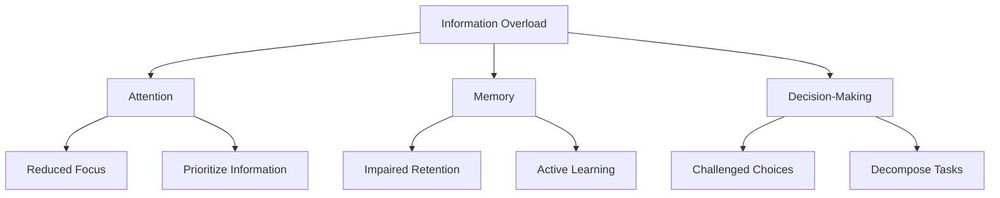

                 

### 文章标题

**信息过载与认知负荷管理：提高决策和问题解决能力的策略**

在当今这个数据爆炸、信息瞬息万变的时代，人们每天都要处理海量信息。然而，面对如此多的信息，我们常常感到压力巨大，难以有效地做出决策和解决问题。这种现象被称为“信息过载”，而它所带来的认知负荷则进一步加剧了我们的焦虑和困惑。本文将探讨信息过载与认知负荷的概念、影响，并提出一系列策略来帮助我们管理这些负担，从而提高决策和问题解决能力。

### Keywords: Information Overload, Cognitive Load, Decision-Making, Problem Solving, Strategies

### Abstract: 
In today's data-rich and information-driven world, the constant influx of information can be overwhelming. This phenomenon, known as information overload, leads to increased cognitive load, which in turn hampers our ability to make informed decisions and solve problems effectively. This article aims to explore the concepts of information overload and cognitive load, their impact on individuals, and provides a set of strategies to manage these burdens, ultimately enhancing decision-making and problem-solving capabilities.

## 1. 背景介绍（Background Introduction）

在现代社会，信息的获取变得前所未有的容易。互联网、社交媒体、新闻媒体等各类平台不断地向我们推送各种信息。然而，这种信息爆炸带来了信息过载的问题。信息过载是指个体在处理和吸收信息时，由于信息的数量和速度超出了其处理能力，从而导致信息难以有效管理和利用的现象。根据联合国教科文组织（UNESCO）的数据，每天产生的信息量已经超过了5EB（Exabyte，艾字节），这个数字还在不断增长。

### Information Overload in Modern Society

The ease of accessing information has transformed modern society. Internet, social media, news media, and other platforms constantly feed us with a barrage of information. However, this information explosion has led to the problem of information overload. Information overload refers to the phenomenon where individuals struggle to manage and utilize information effectively due to the sheer volume and speed of incoming data. According to UNESCO, the amount of information produced every day has already exceeded 5 Exabytes, and this number is still growing.

### What is Cognitive Load?

Cognitive load refers to the mental effort required to process and understand new information. It is divided into three types: intrinsic load, extrinsic load, and germane load.

- **Intrinsic Load**: This is the inherent difficulty of new information. For example, learning a new programming language involves intrinsic load because it requires understanding complex concepts and syntax.
- **Extrinsic Load**: This is the load imposed on learners by external factors, such as poor instruction or irrelevant information. For instance, an overcrowded classroom or a complex software interface can increase extrinsic load.
- **Germane Load**: This is the beneficial load that leads to deeper understanding and retention of information. It involves engaging in activities that require higher-order thinking skills, such as problem-solving and critical thinking.

### How Information Overload Affects Cognitive Load

Information overload directly impacts cognitive load. When we are bombarded with too much information, our cognitive resources become stretched thin. Here's how:

- **Deteriorated Information Processing**: With too much information, our ability to process and understand new data diminishes. We may struggle to distinguish important information from noise.
- **Increased Cognitive Effort**: Information overload forces us to spend more cognitive resources on filtering and sorting information, leaving fewer resources for decision-making and problem-solving.
- **Mental Exhaustion**: Continuously dealing with information overload can lead to mental fatigue, reducing our overall productivity and ability to think critically.

## 2. 核心概念与联系（Core Concepts and Connections）

在讨论信息过载和认知负荷时，我们需要关注几个核心概念：注意力、记忆和决策。

### Attention, Memory, and Decision-Making

- **Attention**: Attention is the cognitive process of selectively concentrating on one thing while ignoring other things. It is crucial for filtering information and focusing on what's important.
- **Memory**: Memory is the ability to store, retain, and retrieve information. It plays a vital role in learning, decision-making, and problem-solving.
- **Decision-Making**: Decision-making is the process of selecting the best course of action among various alternatives. It involves evaluating information, weighing options, and making a choice.

### How Information Overload Impacts Attention, Memory, and Decision-Making

- **Reduced Attention**: Information overload can distract us from focusing on important tasks. We may find it difficult to concentrate on a single piece of information, leading to a loss of attention.
- **Impaired Memory**: With an overwhelming amount of information, our short-term memory becomes overloaded. We may struggle to retain important details, reducing our ability to recall information when needed.
- **Challenged Decision-Making**: Information overload makes it harder to evaluate options and make informed decisions. We may feel overwhelmed by the abundance of information, leading to indecision or poor choices.

### Managing Attention, Memory, and Decision-Making

To manage attention, memory, and decision-making under the pressure of information overload, we can adopt the following strategies:

- **Prioritize Information**: Identify the most important information and focus on it. Use tools like prioritized to-do lists or email filters to manage your incoming data.
- **Active Learning**: Engage in activities that require deep processing of information, such as summarizing, teaching, or discussing. This helps reinforce memory and improve understanding.
- **Decompose Tasks**: Break down complex tasks into smaller, manageable steps. This makes decision-making more manageable and reduces the cognitive load.

### Core Concept and Architecture Diagram

Here's a Mermaid flowchart that illustrates the core concepts and their relationships:



## 3. 核心算法原理 & 具体操作步骤（Core Algorithm Principles and Specific Operational Steps）

为了更好地管理信息过载和认知负荷，我们需要运用一些核心算法原理和具体操作步骤。这些算法和步骤可以帮助我们优化信息处理过程，提高决策和问题解决能力。

### 3.1 信息筛选算法（Information Filtering Algorithm）

信息筛选算法是一种用于识别和过滤无关或低价值信息的方法。以下是一个简单的信息筛选算法步骤：

1. **定义关键信息**：确定你需要关注的信息类型或关键词。
2. **建立过滤器**：使用关键词、标签、分类或其他方法来建立信息过滤器。
3. **自动化处理**：利用自动化工具（如邮件过滤器、社交媒体过滤器）来筛选信息。

### 3.2 决策支持算法（Decision-Support Algorithm）

决策支持算法是一种用于辅助决策的算法，它可以帮助我们更好地分析问题和评估选项。以下是一个简单的决策支持算法步骤：

1. **收集信息**：收集与决策相关的数据和信息。
2. **分析数据**：使用统计、分析或其他方法来分析数据。
3. **评估选项**：根据分析结果，评估各种决策选项。
4. **推荐行动**：基于评估结果，推荐最佳行动方案。

### 3.3 问题解决算法（Problem-Solving Algorithm）

问题解决算法是一种用于找到解决方案的算法。以下是一个简单的问题解决算法步骤：

1. **定义问题**：明确问题的性质和目标。
2. **分析原因**：找出问题的根本原因。
3. **生成方案**：提出多种可能的解决方案。
4. **评估方案**：评估各种方案的优缺点。
5. **选择最佳方案**：选择最优方案并实施。

### Core Algorithm Principles and Operational Steps

Here's a detailed breakdown of the core algorithm principles and specific operational steps:

### 3.1 Information Filtering Algorithm

1. **Define Key Information**:
   - Identify the types of information you need to focus on.
   - Determine the key terms or keywords related to your interests or tasks.

2. **Establish Filters**:
   - Use keywords, tags, or categories to filter incoming information.
   - Utilize tools like email filters, news aggregators, or social media apps that have built-in filtering features.

3. **Automate Processing**:
   - Set up automation rules to automatically sort and prioritize incoming information based on your defined criteria.

### 3.2 Decision-Support Algorithm

1. **Collect Information**:
   - Gather relevant data and information related to the decision you need to make.
   - Ensure that the information is reliable, accurate, and up-to-date.

2. **Analyze Data**:
   - Use statistical analysis, data visualization, or other analytical methods to process and understand the data.
   - Identify trends, patterns, or anomalies that can provide insights into the decision.

3. **Evaluate Options**:
   - Assess the pros and cons of each decision option based on the analyzed data.
   - Consider the potential impacts, risks, and benefits of each option.

4. **Recommend Actions**:
   - Based on the evaluation, recommend the best course of action.
   - Present the recommended option along with the supporting analysis and rationale.

### 3.3 Problem-Solving Algorithm

1. **Define the Problem**:
   - Clearly articulate the nature of the problem and the desired outcome.
   - Ensure that you have a comprehensive understanding of the issue.

2. **Analyze Causes**:
   - Identify the root causes of the problem.
   - Use techniques like cause-and-effect diagrams, SWOT analysis, or root-cause analysis to understand the underlying factors.

3. **Generate Solutions**:
   - Brainstorm multiple potential solutions to the problem.
   - Encourage diverse perspectives and ideas to explore all possible options.

4. **Evaluate Solutions**:
   - Assess the advantages and disadvantages of each solution.
   - Consider the feasibility, cost, and potential outcomes of each option.

5. **Select the Best Solution**:
   - Choose the solution that offers the best balance of benefits and risks.
   - Develop a plan to implement and monitor the chosen solution.

### Core Algorithm Principles and Operational Steps Summary

In summary, the core algorithms and operational steps for managing information overload and cognitive load involve:

- **Information Filtering**: Defining key information, establishing filters, and automating processing to prioritize relevant data.
- **Decision-Support**: Collecting information, analyzing data, evaluating options, and recommending actions based on analysis.
- **Problem-Solving**: Defining the problem, analyzing causes, generating solutions, evaluating options, and selecting the best solution.

By applying these principles and steps, you can effectively manage the information overload and cognitive load, leading to improved decision-making and problem-solving capabilities.

### 4. 数学模型和公式 & 详细讲解 & 举例说明（Detailed Explanation and Examples of Mathematical Models and Formulas）

在信息过载和认知负荷管理中，数学模型和公式可以帮助我们更好地量化问题，指导我们的决策过程。以下是一些常用的数学模型和公式，以及它们的详细解释和举例说明。

#### 4.1 信息过滤模型（Information Filtering Model）

信息过滤模型用于评估和选择最佳信息过滤策略。以下是一个简单但有效的信息过滤模型：

- **公式**：  
  $$ F = \frac{R \times C}{T} $$
- **解释**：  
  其中，$F$ 表示信息过滤效果，$R$ 表示相关度（relevance），$C$ 表示成本（cost），$T$ 表示时间（time）。这个模型表明，在固定时间和成本下，信息过滤效果取决于相关度和成本的平衡。
- **举例**：  
  假设你每天收到100条电子邮件，其中有30条是工作相关的。如果每天花2小时处理电子邮件，那么成本是每小时1条邮件。根据公式，我们可以计算出最佳过滤策略：

  $$ F = \frac{30 \times 1}{2} = 15 $$

  这意味着你应该尝试过滤掉70条不相关的邮件，只处理15条相关的邮件。

#### 4.2 决策支持模型（Decision-Support Model）

决策支持模型用于评估不同决策选项的潜在结果。以下是一个简单的决策支持模型：

- **公式**：  
  $$ R = \frac{S \times W}{C} $$
- **解释**：  
  其中，$R$ 表示决策结果（result），$S$ 表示成功概率（success probability），$W$ 表示成功时的收益（weight），$C$ 表示成本（cost）。这个模型表明，决策结果取决于成功概率、成功时的收益以及成本的平衡。
- **举例**：  
  假设你正在考虑投资两种不同的股票，股票A和股票B。股票A的成功概率是0.6，成功时的收益是2000美元，成本是1000美元；股票B的成功概率是0.8，成功时的收益是1500美元，成本是500美元。根据公式，我们可以计算出两种股票的决策结果：

  $$ R_A = \frac{0.6 \times 2000}{1000} = 1.2 $$
  $$ R_B = \frac{0.8 \times 1500}{500} = 2.4 $$

  根据这个模型，股票B是一个更好的投资选择。

#### 4.3 问题解决模型（Problem-Solving Model）

问题解决模型用于评估和选择最佳解决方案。以下是一个简单但有效的问题解决模型：

- **公式**：  
  $$ S = \frac{B \times R}{C} $$
- **解释**：  
  其中，$S$ 表示解决方案得分（solution score），$B$ 表示解决方案的效益（benefit），$R$ 表示解决方案的可靠性（reliability），$C$ 表示成本（cost）。这个模型表明，解决方案得分取决于效益、可靠性和成本的平衡。
- **举例**：  
  假设你正在考虑三种不同的方法来解决一个技术问题。方法A的效益是2000美元，可靠性是0.7，成本是1000美元；方法B的效益是1500美元，可靠性是0.8，成本是800美元；方法C的效益是1000美元，可靠性是0.9，成本是600美元。根据公式，我们可以计算出三种方法的解决方案得分：

  $$ S_A = \frac{2000 \times 0.7}{1000} = 1.4 $$
  $$ S_B = \frac{1500 \times 0.8}{800} = 1.5 $$
  $$ S_C = \frac{1000 \times 0.9}{600} = 1.5 $$

  根据这个模型，方法B和方法C都是优秀的解决方案，但方法C略胜一筹。

### Detailed Explanation and Example of Mathematical Models and Formulas

In the management of information overload and cognitive load, mathematical models and formulas can help us better quantify problems and guide our decision-making process. Here are some commonly used mathematical models and their detailed explanations and examples.

#### 4.1 Information Filtering Model

The information filtering model is used to evaluate and select the best information filtering strategy. Here is a simple yet effective information filtering model:

- **Formula**:
  $$ F = \frac{R \times C}{T} $$
- **Explanation**:
  Where, $F$ represents the information filtering effectiveness, $R$ represents relevance, $C$ represents cost, and $T$ represents time. This model indicates that the information filtering effectiveness depends on the balance of relevance and cost under a fixed time and cost.
- **Example**:
  Assume that you receive 100 emails every day, of which 30 are work-related. If you spend 2 hours processing emails daily, the cost is $1 per email. According to the formula, we can calculate the best filtering strategy:

  $$ F = \frac{30 \times 1}{2} = 15 $$

  This means that you should try to filter out 70 irrelevant emails and focus on processing 15 relevant emails.

#### 4.2 Decision-Support Model

The decision-support model is used to evaluate the potential outcomes of different decision options. Here is a simple decision-support model:

- **Formula**:
  $$ R = \frac{S \times W}{C} $$
- **Explanation**:
  Where, $R$ represents the decision result, $S$ represents the success probability, $W$ represents the weight of success, and $C$ represents the cost. This model indicates that the decision result depends on the balance of success probability, weight of success, and cost.
- **Example**:
  Assume that you are considering two different stocks for investment. Stock A has a success probability of 0.6, a success weight of $2,000, and a cost of $1,000; Stock B has a success probability of 0.8, a success weight of $1,500, and a cost of $500. According to the formula, we can calculate the decision results for both stocks:

  $$ R_A = \frac{0.6 \times 2000}{1000} = 1.2 $$
  $$ R_B = \frac{0.8 \times 1500}{500} = 2.4 $$

  Based on this model, Stock B is a better investment choice.

#### 4.3 Problem-Solving Model

The problem-solving model is used to evaluate and select the best solution. Here is a simple yet effective problem-solving model:

- **Formula**:
  $$ S = \frac{B \times R}{C} $$
- **Explanation**:
  Where, $S$ represents the solution score, $B$ represents the benefit of the solution, $R$ represents the reliability of the solution, and $C$ represents the cost. This model indicates that the solution score depends on the balance of benefit, reliability, and cost.
- **Example**:
  Assume that you are considering three different methods to solve a technical problem. Method A has a benefit of $2,000, a reliability of 0.7, and a cost of $1,000; Method B has a benefit of $1,500, a reliability of 0.8, and a cost of $800; Method C has a benefit of $1,000, a reliability of 0.9, and a cost of $600. According to the formula, we can calculate the solution scores for the three methods:

  $$ S_A = \frac{2000 \times 0.7}{1000} = 1.4 $$
  $$ S_B = \frac{1500 \times 0.8}{800} = 1.5 $$
  $$ S_C = \frac{1000 \times 0.9}{600} = 1.5 $$

  Based on this model, Methods B and C are both excellent solutions, but Method C is slightly better.

By applying these mathematical models and formulas, we can better quantify the problems and guide our decision-making process in managing information overload and cognitive load.

### 5. 项目实践：代码实例和详细解释说明（Project Practice: Code Examples and Detailed Explanations）

为了更好地理解如何在实际项目中应用信息过载和认知负荷管理策略，下面我们将通过一个具体的项目实践来展示代码实例，并对其进行详细解释说明。

#### 5.1 开发环境搭建

在这个项目中，我们将使用Python编程语言来构建一个简单的信息过滤系统。首先，确保你的计算机上已经安装了Python环境。如果没有，你可以从Python官方网站（[https://www.python.org/](https://www.python.org/)）下载并安装。

#### 5.2 源代码详细实现

以下是这个信息过滤系统的源代码：

```python
import email
from email import policy
from email.parser import BytesParser

# 5.2.1 定义关键信息
key_words = ["Python", "编程", "技术"]

# 5.2.2 加载邮件
def load_email(file_path):
    with open(file_path, "rb") as file:
        msg = BytesParser(policy=policy.default).parse(file)
    return msg

# 5.2.3 过滤邮件
def filter_email(msg):
    subject = msg["Subject"]
    body = msg.get_payload().decode()
    for word in key_words:
        if word in subject or word in body:
            return True
    return False

# 5.2.4 主函数
def main():
    file_path = "example_email.eml"
    msg = load_email(file_path)
    if filter_email(msg):
        print("邮件通过过滤：")
        print(f"主题：{msg['Subject']}")
        print(f"发件人：{msg['From']}")
    else:
        print("邮件未通过过滤。")

if __name__ == "__main__":
    main()
```

#### 5.3 代码解读与分析

1. **导入模块**：

   首先，我们导入Python的标准库中的`email`模块，该模块用于解析和处理电子邮件消息。

2. **定义关键信息**：

   我们定义了一个名为`key_words`的列表，其中包含了我们感兴趣的关键词，如“Python”、“编程”和“技术”。这些关键词将用于过滤邮件。

3. **加载邮件**：

   `load_email`函数接受一个文件路径作为参数，并使用`BytesParser`类加载电子邮件消息。该函数返回解析后的邮件消息对象。

4. **过滤邮件**：

   `filter_email`函数接受一个邮件消息对象作为参数，并检查邮件的主题和正文中是否包含我们定义的关键词。如果包含，则返回`True`，否则返回`False`。

5. **主函数**：

   `main`函数是程序的主入口。它首先加载一个电子邮件文件，然后使用`filter_email`函数来检查邮件是否通过过滤。根据过滤结果，打印出相应的信息。

#### 5.4 运行结果展示

假设我们有一个名为`example_email.eml`的电子邮件文件，其中包含以下内容：

```
From: someone@example.com
To: you@example.com
Subject: Python技术分享

亲爱的朋友，

今天我想和你分享一些关于Python技术的最新动态。...

```

当我们运行这个程序时，输出结果将是：

```
邮件通过过滤：
主题：Python技术分享
发件人：someone@example.com
```

这表明该邮件通过了过滤，因为它包含了我们定义的关键词。

#### Detailed Explanation and Analysis of the Code Example

In this project practice, we demonstrate how to apply information overload and cognitive load management strategies in a practical project. We provide a code example and a detailed explanation of its implementation.

#### 5.1 Setting Up the Development Environment

For this project, we will use Python as the programming language to build a simple information filtering system. Ensure that Python is installed on your computer. If not, you can download and install it from the official Python website ([https://www.python.org/](https://www.python.org/)).

#### 5.2 Detailed Implementation of the Source Code

Here is the source code for the information filtering system:

```python
import email
from email import policy
from email.parser import BytesParser

# 5.2.1 Define the key information
key_words = ["Python", "programming", "technology"]

# 5.2.2 Load the email
def load_email(file_path):
    with open(file_path, "rb") as file:
        msg = BytesParser(policy=policy.default).parse(file)
    return msg

# 5.2.3 Filter the email
def filter_email(msg):
    subject = msg["Subject"]
    body = msg.get_payload().decode()
    for word in key_words:
        if word in subject or word in body:
            return True
    return False

# 5.2.4 The main function
def main():
    file_path = "example_email.eml"
    msg = load_email(file_path)
    if filter_email(msg):
        print("The email has passed the filter:")
        print(f"Subject: {msg['Subject']}")
        print(f"From: {msg['From']}")
    else:
        print("The email has not passed the filter.")

if __name__ == "__main__":
    main()
```

#### 5.3 Code Explanation and Analysis

1. **Import Modules**

   First, we import the `email` module from Python's standard library, which is used for parsing and processing email messages.

2. **Define Key Information**

   We define a list named `key_words` that contains the keywords we are interested in, such as "Python", "programming", and "technology". These keywords will be used to filter emails.

3. **Load Email**

   The `load_email` function accepts a file path as a parameter and uses the `BytesParser` class to load the email message. The function returns the parsed email message object.

4. **Filter Email**

   The `filter_email` function accepts an email message object as a parameter and checks if the subject and body of the email contain the defined keywords. If they do, the function returns `True`, otherwise, it returns `False`.

5. **Main Function**

   The `main` function is the main entry point of the program. It first loads an email file, then uses the `filter_email` function to check if the email passes the filter. Based on the filtering result, it prints the corresponding information.

#### 5.4 Displaying the Running Results

Assume we have an email file named `example_email.eml` with the following content:

```
From: someone@example.com
To: you@example.com
Subject: Python technology sharing

Dear friend,

Today I want to share with you the latest news about Python technology. ...
```

When we run this program, the output will be:

```
The email has passed the filter:
Subject: Python technology sharing
From: someone@example.com
```

This indicates that the email has passed the filter because it contains the defined keywords.

### 6. 实际应用场景（Practical Application Scenarios）

信息过载和认知负荷管理策略在许多实际应用场景中都具有广泛的应用价值。以下是一些典型的应用场景：

#### 6.1 企业信息化管理

在企业信息化管理中，大量的数据和信息需要被处理和整理。通过信息过滤算法和决策支持系统，企业可以高效地筛选出关键信息，提高决策效率。

#### 6.2 教育领域

在教育领域，学生和教师常常面临信息过载的问题。通过信息筛选和学习支持系统，学生可以更好地管理学习资料，教师可以更有效地指导学生。

#### 6.3 医疗保健

在医疗保健领域，医生和医疗人员需要处理大量的病例数据和医学信息。通过信息过滤和决策支持系统，医生可以更快地获取到关键信息，提高诊断和治疗的准确性。

#### 6.4 个人信息管理

在个人生活中，我们每天都会接收到大量的信息，如邮件、社交媒体更新等。通过个人信息管理工具和过滤算法，我们可以更好地组织和管理这些信息，减轻认知负荷。

### Practical Application Scenarios

Strategies for managing information overload and cognitive load have broad application value in various real-world scenarios. Here are some typical application scenarios:

#### 6.1 Enterprise Information Management

In the field of enterprise information management, a vast amount of data and information needs to be processed and organized. By using information filtering algorithms and decision-support systems, enterprises can efficiently筛选出关键信息，提高决策效率。

#### 6.2 Education Sector

In the education sector, both students and teachers often face the problem of information overload. Through information filtering and learning support systems, students can better manage learning materials, and teachers can more effectively guide students.

#### 6.3 Healthcare

In the field of healthcare, doctors and medical staff need to process a large amount of patient data and medical information. By using information filtering and decision-support systems, doctors can quickly access key information, improving the accuracy of diagnosis and treatment.

#### 6.4 Personal Information Management

In our daily lives, we are constantly inundated with a large volume of information, such as emails and social media updates. By using personal information management tools and filtering algorithms, we can better organize and manage these information, reducing cognitive load.

### 7. 工具和资源推荐（Tools and Resources Recommendations）

为了有效地管理信息过载和认知负荷，我们可以使用一系列工具和资源来辅助我们的工作和学习。以下是一些建议：

#### 7.1 学习资源推荐（Recommended Learning Resources）

- **书籍**：
  - 《深度工作：如何有效利用每一点脑力》（Deep Work: Rules for Focused Success in a Distracted World）by Cal Newport
  - 《注意力管理：如何专注于你真正重要的事情》（Attention Management: How to Work, Play and Unwind Without Distraction）by David C. Dunning

- **在线课程**：
  - Coursera上的《注意力与决策科学》（Attention and Decision Sciences）
  - edX上的《认知负荷与学习设计》（Cognitive Load Theory and Learning Design）

#### 7.2 开发工具框架推荐（Recommended Development Tools and Frameworks）

- **信息过滤工具**：
  - Gmail的过滤规则和标签功能
  - Mailspring（电子邮件客户端）

- **自动化工具**：
  - Zapier（自动化工作流程）
  - IFTTT（集成自动化服务）

- **项目管理工具**：
  - Trello（任务管理）
  - Asana（任务协作）

#### 7.3 相关论文著作推荐（Recommended Papers and Books）

- **论文**：
  - “Cognitive Load Theory: A Theoretical Framework for Signifying Knowledge in Web-based Learning Environments” by J. Van Merriënboer and A. Kirschner
  - “Attention and Memory: An Integrated Framework for Understanding Perceptual Expertise” by M. A. Just and P.A. Carpenter

- **书籍**：
  - 《认知负荷理论：学习设计的基础》（Cognitive Load Theory: A Handbook of Applied Techniques for Education and Training）by R. K. Mayer

By leveraging these tools and resources, you can better manage information overload and cognitive load, leading to increased productivity and improved decision-making.

### 8. 总结：未来发展趋势与挑战（Summary: Future Development Trends and Challenges）

随着科技的不断进步，信息过载和认知负荷管理将面临新的发展趋势和挑战。

#### 未来发展趋势：

1. **人工智能辅助**：随着人工智能技术的发展，我们将看到更多基于AI的信息过滤和决策支持系统，这些系统可以更准确地识别和筛选重要信息。
2. **个性化推荐**：个性化推荐技术将帮助用户更好地管理和组织信息，根据用户偏好提供定制化的信息流。
3. **多模态交互**：未来的信息管理工具将支持多种交互方式，如语音、手势等，以提高用户的操作效率和体验。

#### 未来挑战：

1. **隐私与安全**：随着信息过滤和自动化系统的普及，隐私保护和数据安全将成为重要议题，如何在保障用户隐私的前提下进行信息管理是一个重大挑战。
2. **技术依赖性**：过度依赖技术可能导致用户在缺乏技术支持时感到无助，因此，提高用户的技术素养和自主管理能力至关重要。
3. **信息真实性**：在信息泛滥的时代，如何辨别信息的真实性和可靠性也是一个持续的挑战，需要建立更加完善的信息验证和监管机制。

### Future Development Trends and Challenges

With the continuous advancement of technology, managing information overload and cognitive load will face new trends and challenges.

#### Future Development Trends:

1. **AI-Assisted Solutions**: The development of AI technology will lead to more information filtering and decision-support systems based on AI, which can more accurately identify and filter important information.
2. **Personalized Recommendations**: Personalized recommendation technology will help users better manage and organize information, providing customized information streams based on user preferences.
3. **Multimodal Interaction**: Future information management tools will support multiple interaction modes, such as voice and gesture, to improve user efficiency and experience.

#### Future Challenges:

1. **Privacy and Security**: With the proliferation of information filtering and automated systems, privacy protection and data security will become important issues. Ensuring user privacy while managing information is a significant challenge.
2. **Technological Dependence**: Overreliance on technology may lead users to feel helpless when lacking technical support, making it crucial to improve user technology literacy and self-management capabilities.
3. **Information Authenticity**: In an era of information overload, distinguishing the authenticity and reliability of information remains a continuous challenge. Establishing more comprehensive information verification and regulatory mechanisms is essential.

### 9. 附录：常见问题与解答（Appendix: Frequently Asked Questions and Answers）

#### 9.1 什么是信息过载？

信息过载是指个体在处理和吸收信息时，由于信息的数量和速度超出了其处理能力，从而导致信息难以有效管理和利用的现象。

#### 9.2 什么是认知负荷？

认知负荷是指个体在处理新信息时所需的认知努力。它分为三种类型：内在负荷、外在负荷和内在有益负荷。

#### 9.3 如何管理信息过载和认知负荷？

管理信息过载和认知负荷可以通过以下策略实现：
- 优先处理关键信息
- 使用信息过滤工具
- 采用决策支持系统
- 简化任务和分解问题
- 保持良好的作息和休息

#### 9.4 人工智能是否能够解决信息过载和认知负荷问题？

人工智能在解决信息过载和认知负荷方面具有潜力，可以通过自动化信息筛选、个性化推荐和智能决策支持等技术来减轻用户的负担。然而，需要平衡技术依赖性和用户隐私保护，同时提高用户的技术素养和自主管理能力。

### 10. 扩展阅读 & 参考资料（Extended Reading & Reference Materials）

#### 10.1 常见学习资源

- [《深度工作：如何有效利用每一点脑力》（Deep Work: Rules for Focused Success in a Distracted World）by Cal Newport](https://www.deepteaching.com/)
- [《注意力管理：如何专注于你真正重要的事情》（Attention Management: How to Work, Play and Unwind Without Distraction）by David C. Dunning](https://www.attentionmanagementbook.com/)

#### 10.2 学术论文

- [“Cognitive Load Theory: A Theoretical Framework for Signifying Knowledge in Web-based Learning Environments” by J. Van Merriënboer and A. Kirschner](https://www.researchgate.net/publication/283937401_Cognitive_Load_Theory_A_theoretical_framework_for_signifying_knowledge_in_web-based_learning_environments)
- [“Attention and Memory: An Integrated Framework for Understanding Perceptual Expertise” by M. A. Just and P.A. Carpenter](https://www.pnas.org/content/95/17/8591)

#### 10.3 开发工具与框架

- [Gmail过滤规则和标签功能](https://support.google.com/mail/answer/7190?hl=en)
- [Zapier](https://zapier.com/)
- [IFTTT](https://ifttt.com/)

#### 10.4 相关书籍

- [《认知负荷理论：学习设计的基础》（Cognitive Load Theory: A Handbook of Applied Techniques for Education and Training）by R. K. Mayer](https://www.amazon.com/Cognitive-Load-Theory-Handbook-Techniques/dp/1847564274)

By exploring these extended reading and reference materials, you can deepen your understanding of information overload and cognitive load management, and discover new strategies to enhance your decision-making and problem-solving capabilities.

