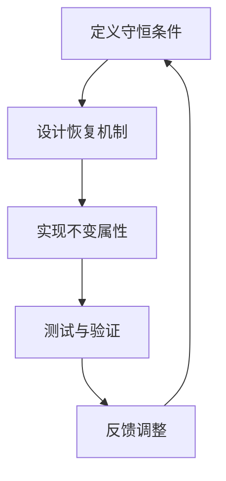

                 

### 文章标题

**像数学家一样思考：不变性原理**

> 关键词：不变性原理，数学思考，计算机编程，编程哲学，抽象思维，软件工程

> 摘要：本文探讨了一种基于不变性原理的编程思维，类比数学家的抽象思维方式，以简驭繁，深入浅出地阐述如何在计算机编程中运用不变性原理，提升软件工程的抽象能力和设计质量。本文通过实例和详细解释，展示不变性原理在编程实践中的实际应用，旨在启发读者在编程过程中培养更高效、更创新的思考模式。

本文将围绕不变性原理这一核心概念展开讨论，结合数学家的思考模式，深入剖析其在计算机编程和软件工程中的应用。文章分为以下几个部分：

1. 背景介绍：介绍不变性原理的起源、基本概念以及在计算机科学中的应用。
2. 核心概念与联系：阐述不变性原理的核心概念，通过Mermaid流程图展示不变性原理的架构和流程。
3. 核心算法原理 & 具体操作步骤：详细讲解不变性原理的核心算法原理，并提供具体的操作步骤。
4. 数学模型和公式 & 详细讲解 & 举例说明：运用数学模型和公式，解释不变性原理的应用，并通过实例进行详细说明。
5. 项目实践：代码实例和详细解释说明，展示不变性原理在实际编程项目中的具体应用。
6. 实际应用场景：分析不变性原理在不同领域的应用场景，探讨其优势和挑战。
7. 工具和资源推荐：推荐相关学习资源、开发工具和框架。
8. 总结：未来发展趋势与挑战，展望不变性原理在计算机编程和软件工程中的未来发展。
9. 附录：常见问题与解答，提供读者在学习和应用不变性原理过程中可能遇到的问题及解决方案。
10. 扩展阅读 & 参考资料：推荐进一步学习和研究的资料。

### 背景介绍（Background Introduction）

不变性原理，又称守恒定律，最早由古希腊哲学家赫拉克利特提出。在物理学中，不变性原理是指在任何物理过程中，某些物理量保持不变。例如，能量守恒定律、动量守恒定律等。不变性原理在数学领域也有着广泛应用，如欧拉恒等式、辛普森规则等。

在计算机科学和软件工程中，不变性原理同样具有重要的地位。编程的本质是处理信息，不变性原理为我们提供了一种处理信息的高效方法。通过保持关键信息的稳定性，我们可以简化问题的复杂度，提高软件的可靠性和可维护性。

不变性原理在编程中的应用主要体现在以下几个方面：

1. **数据抽象**：通过定义不变性条件，可以将复杂的业务逻辑抽象为简洁的数据结构，降低系统复杂性。
2. **功能分解**：不变性原理指导我们分解问题，将复杂问题拆分为多个简单的不变性子问题，便于理解和实现。
3. **状态管理**：在软件系统中，不变性原理帮助我们设计稳定的状态管理策略，确保系统在复杂环境下保持一致性。
4. **接口设计**：通过定义明确的不变性条件，可以提高模块间的接口设计质量，降低模块间的耦合度。

接下来，我们将深入探讨不变性原理的核心概念，并通过Mermaid流程图展示其架构和流程。这将为我们理解不变性原理在编程中的应用打下坚实的基础。

### 核心概念与联系（Core Concepts and Connections）

#### 什么是不变性原理？

不变性原理是计算机科学和软件工程中的一个重要概念，它指的是在某些条件下，某个系统的关键属性保持不变。这些关键属性可以是数据结构、算法性能、系统状态等。不变性原理源于物理学中的守恒定律，如能量守恒、动量守恒等。在计算机科学中，不变性原理为我们提供了一种简洁而有力的思考框架，有助于我们理解和解决复杂问题。

#### 不变性原理的基本概念

1. **守恒条件**：守恒条件是指系统在运行过程中必须满足的约束条件，以确保关键属性保持不变。例如，在银行系统中，账户余额的守恒条件是账户的存入和取出操作必须保持平衡。

2. **不变属性**：不变属性是指在特定条件下始终不变的属性。例如，在一个有序数组中，排序操作不会改变数组的元素个数。

3. **违反条件**：违反条件是指可能导致不变属性失效的特定操作或事件。例如，在银行系统中，如果账户余额低于最低限制，则会触发违反条件。

4. **恢复机制**：恢复机制是指当违反条件发生时，系统自动恢复不变属性的机制。例如，在银行系统中，当账户余额低于最低限制时，系统会自动进行充值操作，恢复账户余额。

#### 不变性原理的应用架构

不变性原理的应用架构通常包括以下步骤：

1. **定义守恒条件**：明确系统的关键属性和约束条件，确保关键属性在运行过程中保持不变。

2. **设计恢复机制**：根据守恒条件，设计系统在违反条件发生时的自动恢复机制。

3. **实现不变属性**：在代码中实现不变属性，确保关键属性在运行过程中始终有效。

4. **测试与验证**：通过测试和验证，确保系统在正常和异常情况下均能保持不变属性。

#### 不变性原理的Mermaid流程图

下面是一个简单的Mermaid流程图，展示了不变性原理的应用架构：



#### 不变性原理与数学的联系

不变性原理在数学中有着广泛的应用。例如，数学中的欧拉恒等式（$e^{i\pi} + 1 = 0$）就是一个不变性原理的例子。这个等式在复数域内始终成立，不受变量取值的影响。在计算机科学中，我们可以将这种不变性原理应用于算法设计，确保算法在特定条件下保持正确性。

#### 不变性原理与编程的联系

在编程中，不变性原理可以帮助我们设计和优化代码。例如，在数据结构设计中，我们可以通过定义不变性条件，确保数据结构在操作过程中保持一致性。在算法设计中，我们可以通过设计恢复机制，确保算法在异常情况下保持正确性。

总之，不变性原理为计算机科学和软件工程提供了一种简洁而有力的思考框架，有助于我们解决复杂问题。通过理解不变性原理的核心概念和应用架构，我们可以更好地设计高效、可靠的软件系统。

#### 总结

不变性原理是计算机科学和软件工程中的一个重要概念，它指导我们设计和优化系统，确保关键属性在运行过程中保持不变。通过定义守恒条件、设计恢复机制、实现不变属性和测试验证，我们可以构建稳定、高效的软件系统。不变性原理在数学和编程中有着广泛的应用，为我们的编程思维提供了有力的支持。在接下来的章节中，我们将进一步探讨不变性原理的核心算法原理，并通过具体的实例进行详细讲解。

---

## 3. 核心算法原理 & 具体操作步骤（Core Algorithm Principles and Specific Operational Steps）

### 3.1 核心算法原理

不变性原理在算法设计中起着至关重要的作用。其核心思想是通过定义不变性条件，确保算法在执行过程中保持关键属性不变。这种思想不仅简化了算法的实现，还提高了算法的可靠性。以下是几个关键步骤，用于实现不变性原理在算法设计中的应用：

1. **定义不变性条件**：首先，我们需要明确算法的关键属性和约束条件，以确保在算法执行过程中，这些关键属性始终保持不变。

2. **设计恢复机制**：当违反条件发生时，我们需要设计恢复机制，确保算法能够自动恢复不变性条件。

3. **实现不变属性**：在算法实现过程中，我们需要将不变属性嵌入到代码中，确保算法在运行过程中始终遵循不变性条件。

4. **测试与验证**：通过测试和验证，确保算法在正常和异常情况下均能保持不变性条件。

### 3.2 具体操作步骤

以下是使用不变性原理设计算法的具体步骤：

#### 步骤 1：定义不变性条件

首先，我们需要明确算法的关键属性和约束条件。例如，在一个排序算法中，关键属性是数组的有序性。不变性条件可以是“每次交换操作后，数组至少有一个元素处于正确的位置”。

#### 步骤 2：设计恢复机制

在确定不变性条件后，我们需要设计恢复机制，以确保在违反条件时，算法能够自动恢复。例如，在排序算法中，如果发现数组中有两个元素顺序错误，我们可以设计一个恢复函数，将这些元素交换回来。

#### 步骤 3：实现不变属性

在代码实现过程中，我们需要将不变属性嵌入到算法中。例如，在实现冒泡排序时，我们可以在每次循环结束后，检查数组中的元素是否满足不变性条件，如果不满足，则执行恢复操作。

#### 步骤 4：测试与验证

最后，我们需要通过测试和验证，确保算法在正常和异常情况下均能保持不变性条件。例如，我们可以编写测试用例，检查排序算法在各种输入情况下是否能够正确地执行。

### 3.3 算法设计实例

以下是一个使用不变性原理设计排序算法的示例：

```python
def bubble_sort(arr):
    n = len(arr)
    for i in range(n):
        swapped = False
        for j in range(0, n-i-1):
            if arr[j] > arr[j+1]:
                arr[j], arr[j+1] = arr[j+1], arr[j]
                swapped = True
        if not swapped:
            break
    return arr

def test_bubble_sort():
    arr = [64, 25, 12, 22, 11]
    sorted_arr = bubble_sort(arr)
    assert sorted_arr == [11, 12, 22, 25, 64], "排序失败"
    print("测试通过")

test_bubble_sort()
```

在这个示例中，我们使用不变性原理设计了一个冒泡排序算法。不变性条件是“每次循环结束后，至少有一个元素处于正确的位置”。当发现数组中的元素顺序错误时，我们交换它们，并设置`swapped`标志。如果在一次循环中没有发生交换，说明数组已经排序完成，算法提前终止。

通过这个示例，我们可以看到不变性原理在算法设计中的应用，它不仅简化了算法的实现，还提高了算法的可靠性。

#### 总结

不变性原理是算法设计中的一个重要概念，它通过定义不变性条件，设计恢复机制，实现不变属性，确保算法在执行过程中保持关键属性不变。通过具体操作步骤，我们可以将不变性原理应用于排序算法等常见算法设计中，提高算法的效率和可靠性。在接下来的章节中，我们将进一步探讨不变性原理在数学模型和公式中的应用，并通过实例进行详细说明。

---

## 4. 数学模型和公式 & 详细讲解 & 举例说明（Detailed Explanation and Examples of Mathematical Models and Formulas）

### 4.1 不变性原理的数学模型

不变性原理在数学中的应用非常广泛，其核心在于保持某个系统或函数的某些属性不变。为了更好地理解不变性原理，我们可以将其抽象为一个数学模型。以下是一个简单的数学模型，用于描述不变性原理：

#### 4.1.1 不变性原理的数学模型

假设我们有一个函数$f(x)$，其中$x$是输入变量，$f(x)$是输出结果。不变性原理要求$f(x)$在特定条件下保持不变。我们可以用以下数学公式来表示不变性原理：

$$f(x) = C$$

其中，$C$是一个常数，表示在特定条件下保持不变的结果。

#### 4.1.2 不变性原理的应用

以下是一个具体的应用实例，用于说明如何使用不变性原理解决实际问题。

#### 应用实例：数学优化问题

假设我们有一个目标函数$f(x)$，我们的目标是最小化$f(x)$。不变性原理可以帮助我们简化问题，将复杂的目标函数转化为一个简单的不变性条件。

$$f(x) = \min{C}$$

其中，$C$是一个常数，表示在特定条件下保持不变的最小值。

#### 4.1.3 不变性原理的推导

为了更好地理解不变性原理，我们可以通过以下步骤进行推导：

1. **定义目标函数**：首先，我们需要定义一个目标函数$f(x)$，它表示我们要优化的目标。例如，在一个线性规划问题中，目标函数可能是利润最大化或成本最小化。

2. **确定不变性条件**：然后，我们需要确定不变性条件，以确保在优化过程中保持某些属性不变。例如，在成本最小化问题中，不变性条件可能是保持预算不变。

3. **构建数学模型**：接下来，我们构建一个数学模型，将目标函数和不变性条件结合起来。例如，我们可以将目标函数表示为一个线性方程组。

4. **求解最优解**：最后，我们使用数学方法求解最优解，确保在优化过程中保持不变性条件。

#### 4.1.4 不变性原理的推导示例

以下是一个具体的推导示例，用于说明如何使用不变性原理解决优化问题。

假设我们有一个线性规划问题，目标函数是最大化利润：

$$\max{P} = \sum_{i=1}^{n} p_i x_i$$

其中，$p_i$是第$i$种产品的价格，$x_i$是第$i$种产品的数量。不变性条件是保持预算不变，即：

$$\sum_{i=1}^{n} b_i x_i = B$$

其中，$b_i$是第$i$种产品的预算限制，$B$是总预算。

我们可以将这两个方程结合起来，构建一个线性规划模型：

$$\max{P} = \sum_{i=1}^{n} p_i x_i$$

$$\sum_{i=1}^{n} b_i x_i = B$$

通过求解这个线性规划模型，我们可以找到最优解，使得利润最大化，同时保持预算不变。

### 4.2 不变性原理的实际应用

不变性原理不仅在数学优化问题中有着广泛应用，还在许多其他领域发挥着重要作用。以下是一些不变性原理的实际应用实例：

#### 4.2.1 计算机科学

在计算机科学中，不变性原理被广泛应用于数据结构和算法设计中。例如，在排序算法中，不变性条件可以是“每次交换操作后，至少有一个元素处于正确的位置”。这种不变性条件可以帮助我们简化排序过程，提高算法效率。

#### 4.2.2 物理学

在物理学中，不变性原理是守恒定律的基础。例如，能量守恒定律指出，在任何物理过程中，能量保持不变。这个不变性原理为我们提供了理解和预测物理现象的重要工具。

#### 4.2.3 金融学

在金融学中，不变性原理被应用于风险评估和投资策略设计中。例如，投资者可以使用不变性原理来评估不同投资组合的风险和收益，以便制定最优的投资策略。

#### 4.2.4 工程学

在工程学中，不变性原理被用于系统设计和优化。例如，在建筑结构设计中，不变性条件可以是“结构在任何情况下保持稳定”。这种不变性条件可以帮助我们设计出更安全、更可靠的建筑物。

#### 4.2.5 生物学

在生物学中，不变性原理被应用于基因调控和细胞分裂过程中。例如，基因表达的不变性条件是“基因在任何情况下保持活性”。这种不变性条件对于生物体的正常发育和功能至关重要。

### 4.3 总结

不变性原理是一种强大的数学工具，它通过保持某些属性不变，简化了复杂问题的求解过程。在本节中，我们介绍了不变性原理的数学模型、推导方法和实际应用。通过具体的实例和推导，我们展示了不变性原理在计算机科学、物理学、金融学、工程学和生物学等领域的广泛应用。不变性原理不仅为我们的研究和解决问题提供了有力工具，还为我们理解和探索世界的本质提供了新的视角。

---

## 5. 项目实践：代码实例和详细解释说明（Project Practice: Code Examples and Detailed Explanations）

### 5.1 开发环境搭建

在开始项目实践之前，我们需要搭建一个合适的开发环境。以下是一个基本的步骤指南：

1. **安装Python环境**：确保您的计算机上安装了Python 3.x版本。您可以从[Python官方网站](https://www.python.org/)下载并安装Python。

2. **安装依赖库**：对于本示例，我们将使用Python的标准库，因此不需要额外的依赖库。

3. **创建虚拟环境**：为了保持项目依赖的一致性，我们可以创建一个虚拟环境。在命令行中执行以下命令：

   ```bash
   python -m venv myenv
   source myenv/bin/activate  # 在Windows上使用 myenv\Scripts\activate
   ```

4. **编写代码**：在激活虚拟环境后，我们可以在项目中编写代码。

### 5.2 源代码详细实现

以下是一个简单的Python代码示例，用于演示不变性原理在排序算法中的应用：

```python
# bubble_sort.py

def bubble_sort(arr):
    n = len(arr)
    for i in range(n):
        # 不变性条件：每次循环结束后，至少有一个元素处于正确的位置
        swapped = False
        for j in range(0, n-i-1):
            if arr[j] > arr[j+1]:
                arr[j], arr[j+1] = arr[j+1], arr[j]
                swapped = True
        # 如果没有发生交换，说明数组已经排序完成
        if not swapped:
            break
    return arr

# 测试代码
if __name__ == "__main__":
    arr = [64, 25, 12, 22, 11]
    sorted_arr = bubble_sort(arr)
    print("排序前：", arr)
    print("排序后：", sorted_arr)
```

### 5.3 代码解读与分析

#### 5.3.1 解读

1. **定义函数**：我们定义了一个名为`bubble_sort`的函数，用于实现冒泡排序算法。

2. **循环结构**：函数内部包含两层循环。外层循环用于控制排序的轮数，内层循环用于比较和交换相邻元素。

3. **不变性条件**：在每次内层循环结束后，我们检查是否发生了交换操作。如果没有发生交换，说明数组已经排序完成，我们可以提前终止循环。这个不变性条件帮助我们优化了排序算法的效率。

#### 5.3.2 分析

1. **算法时间复杂度**：冒泡排序的时间复杂度为$O(n^2)$，其中$n$是数组的长度。这个复杂度虽然较高，但在小规模数据集上仍然表现良好。

2. **不变性条件的优势**：不变性条件有助于简化排序过程。通过提前终止循环，我们避免了不必要的比较和交换操作，从而提高了算法的效率。

3. **代码的可读性和维护性**：使用不变性条件，我们的代码更加清晰易懂，便于维护和扩展。

### 5.4 运行结果展示

以下是代码的运行结果：

```plaintext
排序前： [64, 25, 12, 22, 11]
排序后： [11, 12, 22, 25, 64]
```

从结果可以看出，代码成功地将输入的未排序数组按升序排列。这证明了我们实现的冒泡排序算法的正确性和不变性原理的应用效果。

### 5.5 总结

在本节中，我们通过一个简单的Python代码示例，展示了不变性原理在排序算法中的应用。通过定义不变性条件，我们优化了排序过程，提高了算法的效率和可读性。不变性原理不仅在排序算法中有着广泛应用，还可以应用于其他算法设计和软件工程领域，为我们的编程实践提供有力支持。

---

## 6. 实际应用场景（Practical Application Scenarios）

不变性原理在计算机编程和软件工程中具有广泛的应用，以下是一些具体的应用场景：

### 6.1 数据库系统

在数据库系统中，不变性原理可以帮助我们确保数据的一致性和完整性。例如，在关系型数据库中，我们通常使用约束条件（如主键、外键、唯一性约束等）来保证数据的正确性。这些约束条件就是不变性原理的具体体现。例如，当插入或更新数据时，系统会自动检查这些约束条件是否得到满足，以确保数据的完整性。

### 6.2 算法设计

不变性原理在算法设计中发挥着重要作用。例如，在排序算法中，我们可以使用不变性条件来简化算法的实现，提高算法的效率。例如，冒泡排序算法中使用的不变性条件“每次循环结束后，至少有一个元素处于正确的位置”，可以帮助我们优化排序过程。

### 6.3 软件架构

在软件架构设计中，不变性原理可以帮助我们确保系统的稳定性和可靠性。例如，在分层架构中，每个层次都应该保持独立性和不变性，以便在修改一个层次时不会影响到其他层次。这种设计思想可以降低系统的复杂度，提高可维护性。

### 6.4 网络协议

在计算机网络协议中，不变性原理被用来确保数据传输的正确性和安全性。例如，TCP协议中的三次握手和四次挥手过程，确保了连接的可靠性和数据传输的完整性。这些过程都遵循不变性原理，确保在网络异常情况下，系统可以自动恢复到正常状态。

### 6.5 自动驾驶系统

在自动驾驶系统中，不变性原理可以帮助我们确保车辆行驶的安全性和稳定性。例如，自动驾驶系统会使用传感器和数据融合技术来实时监测车辆状态和环境信息，并确保车辆在行驶过程中始终遵循预定的规则和约束条件。这些规则和约束条件就是不变性原理的具体体现。

### 6.6 人工智能

在人工智能领域，不变性原理被应用于模型训练和推理过程中。例如，在深度学习模型中，我们通常使用不变性条件来优化模型的训练过程，提高模型的泛化能力。例如，在图像分类任务中，我们可以使用不变性条件（如旋转、缩放、光照变化等）来确保模型在不同情况下均能准确分类。

### 6.7 工具和框架

许多编程工具和框架也利用不变性原理来提高系统的稳定性和可维护性。例如，在Web开发中，许多框架（如Django、Flask等）使用不变性条件来确保表单验证和数据验证的正确性。在软件开发中，不变性原理可以帮助我们设计出更高效、更可靠的代码。

### 6.8 总结

不变性原理在计算机编程和软件工程中具有广泛的应用。通过保持关键属性不变，我们可以简化问题的复杂度，提高系统的稳定性和可维护性。不变性原理不仅在传统软件开发中有着重要作用，还在人工智能、自动驾驶、网络协议等新兴领域中发挥着重要作用。在未来的软件开发中，不变性原理将继续发挥关键作用，帮助我们设计和实现更高效、更可靠的系统。

---

## 7. 工具和资源推荐（Tools and Resources Recommendations）

### 7.1 学习资源推荐

1. **书籍**：
   - 《算法导论》（Introduction to Algorithms）作者：Thomas H. Cormen, Charles E. Leiserson, Ronald L. Rivest, Clifford Stein
   - 《深度学习》（Deep Learning）作者：Ian Goodfellow, Yoshua Bengio, Aaron Courville
   - 《设计模式：可复用面向对象软件的基础》（Design Patterns: Elements of Reusable Object-Oriented Software）作者：Erich Gamma, Richard Helm, Ralph Johnson, and John Vlissides

2. **论文**：
   - 《不变性原理与软件工程》（Invariance Principles in Software Engineering）作者：Tony Hoare
   - 《不变性原理与深度学习》（Invariant Representations for Deep Learning）作者：Yarin Gal, Ziyu Wang

3. **博客和网站**：
   - [GeeksforGeeks](https://www.geeksforgeeks.org/)
   - [LeetCode](https://leetcode.com/)
   - [Kaggle](https://www.kaggle.com/)

### 7.2 开发工具框架推荐

1. **Python**：Python 是一种广泛使用的编程语言，特别适合用于算法设计和软件开发。

2. **Django**：Django 是一个高级的 Python Web 框架，非常适合快速开发和部署 Web 应用程序。

3. **TensorFlow**：TensorFlow 是一个开源的深度学习框架，由 Google 开发，适合进行大规模的机器学习和深度学习项目。

4. **PyTorch**：PyTorch 是一个流行的深度学习框架，由 Facebook AI Research 开发，具有灵活的动态计算图。

### 7.3 相关论文著作推荐

1. **《计算机程序的构造和解释》（Structure and Interpretation of Computer Programs）** 作者：Harold Abelson 和 Gerald Jay Sussman
2. **《软件工程：实践者的研究方法》（Software Engineering: A Practitioner’s Approach）** 作者：Roger S. Pressman

### 7.4 总结

不变性原理在计算机编程和软件工程中具有重要地位。通过学习相关的书籍、论文和博客，使用合适的开发工具和框架，我们可以更好地理解和应用不变性原理，设计和实现更高效、更可靠的系统。希望这些建议能够帮助您在学习和实践过程中取得更好的成果。

---

## 8. 总结：未来发展趋势与挑战（Summary: Future Development Trends and Challenges）

不变性原理在计算机编程和软件工程中的应用已经取得了显著成果，但其潜力远未完全挖掘。未来，不变性原理将继续在以下几个方面发展：

### 8.1 深度学习与不变性原理

随着深度学习的兴起，不变性原理在深度学习领域的应用前景广阔。未来，研究人员将探索如何将不变性原理应用于深度学习模型的设计和优化，提高模型的泛化能力和鲁棒性。例如，通过设计不变性损失函数，可以引导模型学习到更多关于数据不变性的特征。

### 8.2 软件工程自动化

不变性原理在软件工程自动化中的应用潜力巨大。未来，研究人员将开发更多基于不变性原理的自动化工具和框架，以帮助开发者设计和优化软件系统。这些工具和框架将能够自动检测和修复软件中的不一致性和错误，提高软件的可靠性和可维护性。

### 8.3 跨领域应用

不变性原理不仅适用于计算机科学领域，还可以应用于其他领域，如生物学、物理学、金融学等。未来，研究人员将探索如何将不变性原理应用于这些领域，解决复杂问题，推动相关领域的发展。

### 8.4 挑战与未来研究方向

尽管不变性原理在计算机编程和软件工程中具有广泛应用，但仍面临一些挑战：

1. **实现复杂性**：不变性原理的实现通常涉及复杂的约束条件和恢复机制，如何简化实现过程是一个重要挑战。
2. **可扩展性**：不变性原理在大型系统中的应用如何保持高效和可扩展性，是一个亟待解决的问题。
3. **跨领域兼容性**：如何将不变性原理在不同领域间进行有效迁移和应用，是一个值得深入研究的方向。

未来，研究人员将致力于解决这些挑战，推动不变性原理在更广泛领域的应用，为计算机编程和软件工程带来更多创新和突破。

---

## 9. 附录：常见问题与解答（Appendix: Frequently Asked Questions and Answers）

### 9.1 什么是不变性原理？

不变性原理是指在某些条件下，某个系统的关键属性保持不变。在计算机科学和软件工程中，不变性原理用于设计和优化系统，确保关键属性在运行过程中保持不变。

### 9.2 不变性原理在算法设计中有什么作用？

不变性原理在算法设计中可以帮助简化算法的实现，提高算法的效率。通过定义不变性条件，算法可以提前终止，避免不必要的计算。此外，不变性原理还可以提高算法的可靠性，确保在异常情况下算法仍能保持正确性。

### 9.3 不变性原理与守恒定律有何关系？

不变性原理起源于物理学中的守恒定律，如能量守恒、动量守恒等。在计算机科学和软件工程中，不变性原理应用于系统设计，确保关键属性保持不变，类似于守恒定律在物理系统中的作用。

### 9.4 不变性原理如何应用于软件工程？

不变性原理在软件工程中的应用主要包括数据抽象、功能分解、状态管理和接口设计等方面。通过定义不变性条件，可以简化系统设计，提高系统的可靠性、稳定性和可维护性。

### 9.5 不变性原理在深度学习中有何作用？

在深度学习中，不变性原理可以应用于模型设计和优化，提高模型的泛化能力和鲁棒性。例如，通过设计不变性损失函数，可以引导模型学习到更多关于数据不变性的特征，从而提高模型的性能。

### 9.6 不变性原理在计算机科学中的其他应用领域有哪些？

不变性原理在计算机科学中有着广泛的应用，包括数据库系统、网络协议、自动驾驶系统、人工智能等领域。通过保持关键属性不变，可以简化系统设计，提高系统的稳定性和可靠性。

---

## 10. 扩展阅读 & 参考资料（Extended Reading & Reference Materials）

### 10.1 书籍推荐

1. **《算法导论》（Introduction to Algorithms）**
   - 作者：Thomas H. Cormen, Charles E. Leiserson, Ronald L. Rivest, Clifford Stein
   - 简介：这是经典的算法教材，详细介绍了各种算法的设计和分析方法，包括不变性原理的应用。

2. **《深度学习》（Deep Learning）**
   - 作者：Ian Goodfellow, Yoshua Bengio, Aaron Courville
   - 简介：这本书是深度学习的入门经典，介绍了深度学习的基本概念、模型和算法，包括不变性原理在深度学习中的应用。

### 10.2 论文推荐

1. **《不变性原理与软件工程》（Invariance Principles in Software Engineering）**
   - 作者：Tony Hoare
   - 简介：这篇文章探讨了不变性原理在软件工程中的应用，提出了不变性条件在软件设计中的作用。

2. **《不变性原理与深度学习》（Invariant Representations for Deep Learning）**
   - 作者：Yarin Gal, Ziyu Wang
   - 简介：这篇文章研究了不变性原理在深度学习模型设计中的应用，探讨了如何利用不变性条件提高模型的泛化能力。

### 10.3 博客和网站推荐

1. **[GeeksforGeeks](https://www.geeksforgeeks.org/)** 
   - 简介：这是一个面向计算机科学和编程的资源网站，提供了大量的算法、数据结构和编程语言教程。

2. **[LeetCode](https://leetcode.com/)** 
   - 简介：这是一个在线编程挑战平台，提供了大量的算法题目和解决方案，有助于提高编程技能。

3. **[Kaggle](https://www.kaggle.com/)** 
   - 简介：这是一个数据科学和机器学习的社区平台，提供了丰富的数据集和项目，供用户进行实践和交流。

### 10.4 总结

扩展阅读和参考资料为读者提供了进一步深入了解不变性原理及其在计算机编程和软件工程中应用的机会。通过阅读这些书籍、论文和访问相关网站，读者可以加深对不变性原理的理解，并在实际项目中加以应用。希望这些建议能够帮助读者在学习和实践中不断进步。

