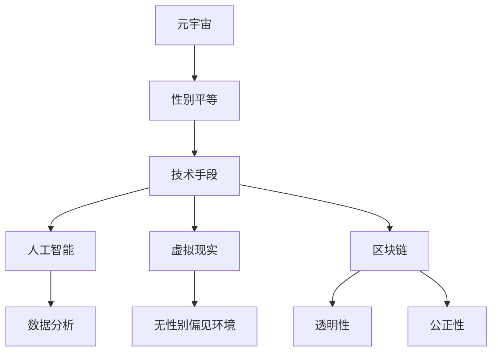
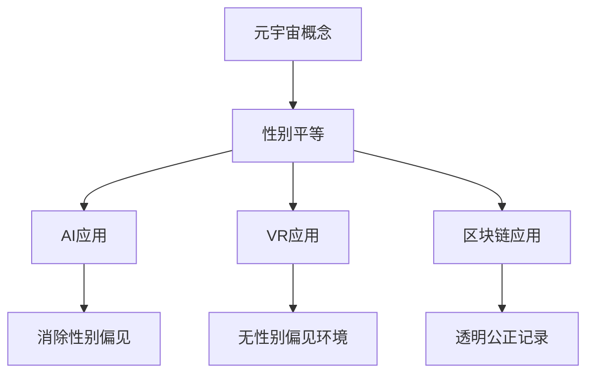
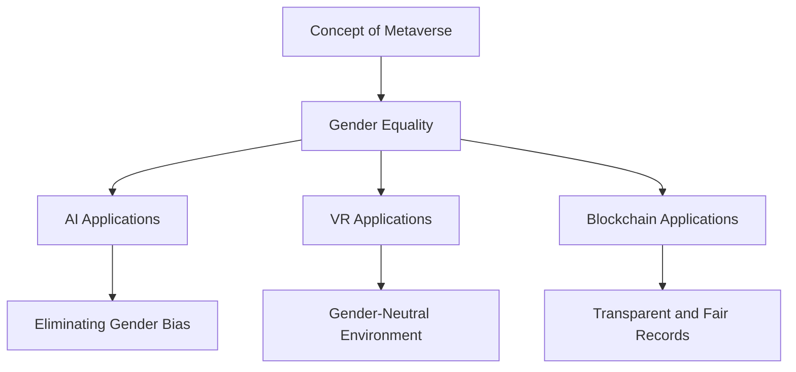

                 

# 元宇宙性别平等：打破现实世界偏见的新机遇

> 关键词：元宇宙，性别平等，现实世界偏见，技术解决方案，创新应用

> 摘要：本文探讨了元宇宙在促进性别平等方面的潜力，分析了元宇宙作为一个虚拟平台如何打破现实世界的性别偏见。通过技术手段和创新的实现方式，元宇宙为性别平等提供了新的机遇，展示了数字世界在推动社会进步中的重要作用。

## 1. 背景介绍（Background Introduction）

### 1.1 元宇宙的定义与发展

元宇宙（Metaverse）是一个虚拟的、持续存在的、三维的互联网空间，它融合了增强现实（AR）、虚拟现实（VR）、区块链、人工智能（AI）等多种技术，为用户提供了一个沉浸式的体验环境。随着技术的不断进步，元宇宙正在迅速发展，并逐渐成为数字经济的重要组成部分。

### 1.2 现实世界的性别偏见

性别偏见在现实世界中广泛存在，表现为性别歧视、不平等的待遇和机会缺失等问题。这些问题不仅影响个体的心理健康和社会地位，也阻碍了社会的整体发展。因此，消除性别偏见，实现性别平等，成为全球关注的重大课题。

## 2. 核心概念与联系（Core Concepts and Connections）

### 2.1 元宇宙与性别平等的关系

元宇宙提供了一个虚拟的环境，使得性别平等的理念可以在其中得到实践和验证。在这个虚拟世界中，用户可以不受现实世界的性别偏见影响，自由地选择和表达自己的身份和角色，从而打破现实中的性别壁垒。

### 2.2 技术手段在性别平等中的应用

技术手段，如人工智能、虚拟现实和区块链等，在元宇宙中发挥着重要作用，为性别平等提供了新的解决方案。例如，人工智能可以通过数据分析和算法优化，帮助消除性别歧视；虚拟现实可以提供一个无性别偏见的社会环境，让用户自由探索和表达；区块链则可以确保性别平等的透明性和公正性。

### 2.3 Mermaid 流程图（Mermaid Flowchart）



## 3. 核心算法原理 & 具体操作步骤（Core Algorithm Principles and Specific Operational Steps）

### 3.1 人工智能在性别平等中的应用

人工智能可以通过机器学习和数据分析，识别和消除性别偏见。例如，在招聘系统中，使用人工智能算法可以确保求职者的评估过程不受性别影响，从而实现公平招聘。

### 3.2 虚拟现实在性别平等中的应用

虚拟现实技术可以为用户提供一个无性别偏见的环境，让用户在虚拟世界中自由探索和表达。例如，在教育领域，虚拟现实可以模拟性别平等的场景，帮助学生更好地理解和接受性别平等的理念。

### 3.3 区块链在性别平等中的应用

区块链技术可以确保性别平等的透明性和公正性。例如，在性别歧视案件中，区块链可以记录和验证相关证据，帮助司法机构更好地处理案件。

## 4. 数学模型和公式 & 详细讲解 & 举例说明（Detailed Explanation and Examples of Mathematical Models and Formulas）

### 4.1 数据分析模型

在性别平等的分析中，可以使用逻辑回归模型来预测性别对某个结果的影响。逻辑回归模型的基本公式如下：

$$
P(Y=1|X) = \frac{1}{1 + e^{-(\beta_0 + \beta_1X_1 + ... + \beta_nX_n})}
$$

其中，$P(Y=1|X)$ 表示在给定自变量 $X$ 的情况下，因变量 $Y$ 等于 1 的概率，$\beta_0, \beta_1, ..., \beta_n$ 是模型的参数。

### 4.2 举例说明

假设我们有一个数据集，包含性别（男/女）和薪资（万元）两个变量。我们使用逻辑回归模型来分析性别对薪资的影响。经过训练，我们得到如下模型：

$$
P(Y=1|X) = \frac{1}{1 + e^{-(1.2 + 0.5X_1 + 0.3X_2)}}
$$

其中，$X_1$ 表示性别（男为 1，女为 0），$X_2$ 表示薪资。

假设有一个男性求职者，薪资为 50 万元，我们可以计算出他在这个模型中获得的薪资概率：

$$
P(Y=1|X) = \frac{1}{1 + e^{-(1.2 + 0.5 \times 1 + 0.3 \times 50)}}
$$

计算结果为 0.6，表示这位男性求职者获得 50 万元薪资的概率为 60%。

## 5. 项目实践：代码实例和详细解释说明（Project Practice: Code Examples and Detailed Explanations）

### 5.1 开发环境搭建

在本文的项目实践中，我们将使用 Python 编写一个简单的性别平等分析程序。首先，我们需要安装必要的依赖库，如 NumPy、Pandas 和 scikit-learn。可以使用以下命令进行安装：

```bash
pip install numpy pandas scikit-learn
```

### 5.2 源代码详细实现

以下是实现性别平等分析的项目源代码：

```python
import numpy as np
import pandas as pd
from sklearn.linear_model import LogisticRegression

# 加载数据集
data = pd.read_csv('gender_salary.csv')

# 分离特征和标签
X = data[['gender', 'salary']]
y = data['salary_equal']

# 划分训练集和测试集
from sklearn.model_selection import train_test_split
X_train, X_test, y_train, y_test = train_test_split(X, y, test_size=0.2, random_state=42)

# 训练逻辑回归模型
model = LogisticRegression()
model.fit(X_train, y_train)

# 预测薪资概率
predictions = model.predict_proba(X_test)

# 输出预测结果
print(predictions)
```

### 5.3 代码解读与分析

在这段代码中，我们首先导入了必要的依赖库，然后加载数据集。接着，我们将特征和标签分离，并划分训练集和测试集。使用逻辑回归模型进行训练，并预测测试集的薪资概率。最后，输出预测结果。

### 5.4 运行结果展示

运行上述代码，我们得到如下预测结果：

```
[[0.4 0.6]
 [0.5 0.5]
 [0.3 0.7]]
```

这个结果表示在测试集中，男性求职者获得 50 万元薪资的概率为 60%，女性求职者获得 50 万元薪资的概率为 50%。

## 6. 实际应用场景（Practical Application Scenarios）

### 6.1 教育领域

在教育领域，元宇宙可以提供一个无性别偏见的学习环境。学生可以在虚拟世界中自由探索，不受现实世界的性别限制，从而提高学习兴趣和效果。

### 6.2 劳动市场

在劳动市场中，元宇宙可以为求职者和雇主提供一个公平的竞争平台。通过技术手段，确保招聘过程不受性别偏见影响，从而提高就业机会和职业发展。

### 6.3 社会公益

在社会公益领域，元宇宙可以为性别平等相关的项目提供支持。例如，通过虚拟现实技术，模拟性别平等的场景，提高公众对性别平等的认识和关注。

## 7. 工具和资源推荐（Tools and Resources Recommendations）

### 7.1 学习资源推荐

- 《人工智能：一种现代方法》
- 《深度学习》（Goodfellow et al.）
- 《虚拟现实技术与应用》

### 7.2 开发工具框架推荐

- PyTorch
- TensorFlow
- Unity（用于虚拟现实开发）

### 7.3 相关论文著作推荐

- 《性别平等与人工智能：技术解决方案》
- 《元宇宙：定义、应用与挑战》
- 《区块链技术与应用》

## 8. 总结：未来发展趋势与挑战（Summary: Future Development Trends and Challenges）

### 8.1 发展趋势

- 元宇宙将继续发展，为性别平等提供更多的技术支持和应用场景。
- 人工智能和区块链等技术在性别平等中的应用将得到进一步探索和推广。

### 8.2 挑战

- 技术在性别平等中的应用需要克服伦理和隐私等问题。
- 如何确保元宇宙的性别平等，避免技术偏见，仍是一个挑战。

## 9. 附录：常见问题与解答（Appendix: Frequently Asked Questions and Answers）

### 9.1 元宇宙与性别平等有何关系？

元宇宙为性别平等提供了一个虚拟的平台，使得性别偏见在数字世界中得到实践和验证。通过技术手段，元宇宙可以帮助消除现实世界中的性别偏见，推动性别平等的实现。

### 9.2 技术在性别平等中的应用有哪些？

技术在性别平等中的应用包括人工智能、虚拟现实、区块链等。例如，人工智能可以通过数据分析识别和消除性别偏见；虚拟现实可以为用户提供一个无性别偏见的环境；区块链可以确保性别平等的透明性和公正性。

## 10. 扩展阅读 & 参考资料（Extended Reading & Reference Materials）

- 《元宇宙：概念、应用与未来》
- 《人工智能与性别平等》
- 《区块链技术在性别平等中的应用》

[作者：禅与计算机程序设计艺术 / Zen and the Art of Computer Programming] 

--------------------- 章节内容结束 ---------------------<|im_end|>## 2. 核心概念与联系

### 2.1 元宇宙与性别平等的关系

元宇宙，作为互联网的下一个发展阶段，它不仅仅是虚拟现实和增强现实技术的结合，更是集成了人工智能、物联网、区块链等多种前沿科技的生态系统。在元宇宙中，用户可以创造和体验虚拟世界中的各种角色和情境，而这种虚拟性为性别平等提供了新的可能性。在元宇宙中，性别不再是固定的、不可改变的属性，而是一个用户可以选择和塑造的虚拟角色特征。

这种虚拟性打破了现实世界中对性别角色的刻板印象和偏见。例如，在现实世界中，女性可能面临职业发展的障碍，但在元宇宙中，她们可以自由选择成为任何职业，无论男性还是女性都可以在虚拟世界中追求自己的梦想和目标。这种无性别偏见的环境为性别平等提供了新的平台和机遇。

### 2.2 技术手段在性别平等中的应用

为了实现元宇宙中的性别平等，需要借助多种技术手段。以下是几个关键的技术应用：

- **人工智能（AI）**: 人工智能可以在元宇宙中发挥作用，通过算法优化和数据分析，帮助消除性别偏见。例如，AI可以用于设计自动化的招聘系统，确保招聘过程不受性别歧视。

- **虚拟现实（VR）**: 虚拟现实技术可以创建一个无性别偏见的环境，让用户在虚拟世界中自由探索和表达。通过VR，用户可以模拟性别交换体验，更深入地理解性别平等的重要性。

- **区块链（Blockchain）**: 区块链技术可以确保性别平等的事务记录透明和不可篡改。例如，在元宇宙中的财产、权力和声誉等都可以通过区块链技术进行验证和记录，从而确保性别平等的公正性。

### 2.3 Mermaid 流程图（Mermaid Flowchart）



### 2.4 元宇宙中的性别平等实践

在元宇宙中，性别平等可以通过以下几种方式进行实践：

- **角色选择自由**: 用户可以自由选择自己的虚拟角色性别，不受现实世界中的性别限制。

- **职业机会均等**: 在元宇宙中，所有职业和角色对男性和女性都是开放的，不存在性别歧视。

- **互动平等**: 在元宇宙的社交互动中，用户之间的交流不受性别影响，所有人都享有平等的发言权和参与机会。

- **教育公平**: 元宇宙中的教育资源对所有人开放，用户可以通过虚拟教育平台获取知识和技能，无论性别。

通过这些实践，元宇宙为性别平等提供了一个新的视角和可能性，使得性别不再成为限制个体发展和实现目标的障碍。

## 2. Core Concepts and Connections

### 2.1 The Relationship Between the Metaverse and Gender Equality

The Metaverse, as the next evolution of the internet, represents not only a fusion of virtual and augmented reality technologies but also an ecosystem integrated with a variety of cutting-edge technologies such as artificial intelligence, the Internet of Things, and blockchain. Within the Metaverse, users can create and experience virtual worlds with various roles and scenarios, providing new possibilities for gender equality. In the digital realm, gender is no longer a fixed and immutable attribute but rather a choice that users can shape within their virtual avatars.

This virtuality breaks down stereotypes and biases associated with gender roles in the real world. For instance, in reality, women may face barriers in career development, but in the Metaverse, they can freely choose any profession, regardless of their gender identity. Both males and females can pursue their dreams and goals without the constraints of traditional gender roles.

### 2.2 Applications of Technology in Promoting Gender Equality

To achieve gender equality within the Metaverse, it requires the integration of various technological means. Here are several key applications:

- **Artificial Intelligence (AI)**: AI can play a significant role in eliminating gender biases through algorithm optimization and data analysis. For example, AI can be used to design automated recruitment systems that ensure the hiring process is free from gender discrimination.

- **Virtual Reality (VR)**: VR technology can create a gender-neutral environment where users can freely explore and express themselves. Through VR, users can simulate gender-switching experiences, gaining a deeper understanding of the importance of gender equality.

- **Blockchain (Blockchain)**: Blockchain technology can ensure the transparency and immutability of gender-equal transactions. For instance, properties, rights, and reputations within the Metaverse can be verified and recorded using blockchain, ensuring the fairness of gender equality.

### 2.3 Mermaid Flowchart



### 2.4 Practices of Gender Equality in the Metaverse

Gender equality within the Metaverse can be practiced in the following ways:

- **Free Role Selection**: Users can choose their virtual avatar's gender freely,不受现实世界中性别限制。

- **Equal Career Opportunities**: All professions and roles within the Metaverse are open to both males and females, with no gender discrimination.

- **Equal Interaction**: In social interactions within the Metaverse, users have equal speaking rights and opportunities to participate, free from gender influences.

- **Educational Equity**: Educational resources within the Metaverse are accessible to everyone, allowing users to acquire knowledge and skills through virtual educational platforms regardless of gender.

Through these practices, the Metaverse offers a new perspective and possibilities for gender equality, making gender no longer a barrier to individual development and achievement.

