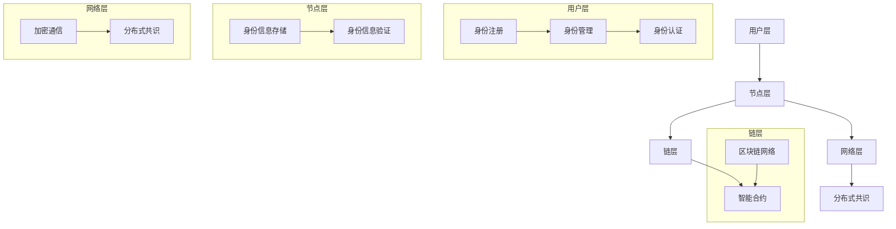

                 

### 背景介绍（Background Introduction）

随着数字技术的飞速发展，元宇宙（Metaverse）逐渐成为科技界的热门话题。元宇宙是一个虚拟的、全球连接的、三维的数字世界，它融合了虚拟现实（VR）、增强现实（AR）和区块链技术，为用户提供了一个全新的交互和体验空间。在元宇宙中，用户可以创建和定制自己的虚拟形象（Avatar），参与各种虚拟活动，如游戏、社交、工作和娱乐等。

身份认证是元宇宙中至关重要的一环。在现实世界中，身份认证确保了人们的隐私和安全，而在元宇宙中，身份认证同样至关重要。它不仅关乎用户的个人隐私保护，还关系到元宇宙的秩序与信任体系的构建。元宇宙中的身份认证需要解决的一个核心问题是：如何在不依赖中心化机构的情况下，实现用户身份的可靠验证和授权？

这就引出了去中心化身份认证（Decentralized Identity Authentication，DIA）的概念。去中心化身份认证利用区块链技术的不可篡改性和透明性，构建一个去中心化的信任体系，从而实现用户身份的自主管理和可信验证。本文将围绕元宇宙身份认证：去中心化信任体系的构建这一主题，逐步分析去中心化身份认证的基本原理、技术架构、核心算法以及实际应用场景，旨在为读者提供一个全面而深入的视角。

### 核心概念与联系（Core Concepts and Connections）

在深入探讨去中心化身份认证之前，我们需要了解一些核心概念，这些概念是理解去中心化身份认证原理和架构的关键。

#### 1. 去中心化身份认证（Decentralized Identity Authentication, DIA）

去中心化身份认证是一种不依赖中心化机构，通过分布式网络技术（如区块链）来验证和管理用户身份的方法。在DIA体系中，身份认证过程是去中心化的，即没有单一的权威机构控制身份验证，而是由一个分布式的网络节点共同维护和验证。

#### 2. 区块链技术（Blockchain Technology）

区块链技术是一种分布式数据库技术，其特点包括去中心化、不可篡改、透明性等。区块链通过将数据分散存储在多个节点上，使得数据一旦被记录就无法被单一点修改或删除，从而提高了数据的安全性和可信度。

#### 3. 公钥加密（Public Key Encryption）

公钥加密是一种加密技术，它使用一对密钥（公钥和私钥）来加密和解密数据。公钥加密在去中心化身份认证中用于保护用户身份信息的隐私，只有持有对应私钥的用户才能解密和验证身份信息。

#### 4. 数字签名（Digital Signature）

数字签名是一种用于验证信息发送者身份和消息完整性的技术。在去中心化身份认证中，用户可以使用私钥对身份信息进行数字签名，其他节点可以使用公钥验证签名的真实性，从而确认用户身份。

#### 5. 自 Sovereignty（自我主权）

自 Sovereignty 是指用户对自己身份信息的控制权。在去中心化身份认证体系中，用户拥有对自己身份信息的完整控制权，包括创建、存储、分享和撤销等操作，而不受中心化机构的限制。

#### 6. 联邦身份管理（Federated Identity Management）

联邦身份管理是一种通过多个独立系统之间的信任关系来管理身份信息的方法。在去中心化身份认证中，不同节点可以相互信任和验证身份信息，从而实现跨系统的身份认证。

### 架构设计（Architecture Design）

去中心化身份认证的架构设计需要综合考虑安全、隐私、可扩展性等因素。以下是一个典型的去中心化身份认证架构：

#### 1. 用户层（User Layer）

用户层是去中心化身份认证的最外层，用户通过一个用户友好的界面进行身份的创建、管理和认证。

- **身份注册（Identity Registration）**：用户创建自己的数字身份，包括公钥、私钥和身份信息等。
- **身份管理（Identity Management）**：用户可以管理自己的身份信息，如更新、删除和共享。
- **身份认证（Identity Authentication）**：用户进行身份验证以访问元宇宙中的各种服务和资源。

#### 2. 节点层（Node Layer）

节点层是去中心化身份认证的核心，由多个分布式节点组成，共同维护和验证身份信息。

- **身份信息存储（Identity Information Storage）**：节点存储用户的身份信息，这些信息是加密的，只有拥有对应私钥的用户才能访问。
- **身份信息验证（Identity Information Verification）**：节点之间相互验证身份信息的真实性，确保去中心化的信任体系。

#### 3. 链层（Blockchain Layer）

链层是去中心化身份认证的基础，提供分布式存储和不可篡改的特性。

- **区块链网络（Blockchain Network）**：节点通过区块链网络进行通信和数据交互，确保数据的分布式存储和透明性。
- **智能合约（Smart Contract）**：智能合约用于自动化和执行身份认证过程中的规则和协议。

#### 4. 网络层（Network Layer）

网络层负责网络通信和安全，确保数据传输的可靠性和完整性。

- **加密通信（Encrypted Communication）**：节点之间的通信使用加密技术，保护数据隐私。
- **分布式共识（Distributed Consensus）**：节点通过分布式共识机制达成数据一致性，确保数据的准确性和可靠性。

### Mermaid 流程图（Mermaid Flowchart）

为了更直观地展示去中心化身份认证的架构，我们可以使用Mermaid流程图来描述其核心流程：



通过上述核心概念和架构设计的介绍，我们可以更清晰地理解去中心化身份认证的基本原理和实现方法。在接下来的章节中，我们将深入探讨去中心化身份认证的核心算法原理和具体操作步骤，以及数学模型和公式，帮助读者进一步掌握这一前沿技术。

### 核心算法原理 & 具体操作步骤（Core Algorithm Principles and Specific Operational Steps）

去中心化身份认证（DIA）的核心在于其算法的设计，这些算法确保了用户身份信息的隐私保护、数据的安全性和不可篡改性。以下将详细介绍去中心化身份认证的核心算法原理及其操作步骤。

#### 1. 消息认证码（MAC）

消息认证码（Message Authentication Code，MAC）是一种用于验证消息完整性和发送者身份的算法。在去中心化身份认证中，MAC通常用于确保消息在传输过程中没有被篡改。

- **原理**：MAC算法使用密钥（密钥对中的私钥）对消息进行加密，生成一个固定长度的认证码。接收方使用相同的密钥和解密算法验证消息和认证码的一致性。
- **操作步骤**：
  - **生成密钥对**：用户生成一对密钥（公钥和私钥）。
  - **加密消息**：发送方使用接收方的公钥加密消息，并生成MAC。
  - **传输消息和MAC**：发送方将加密消息和MAC一起发送给接收方。
  - **验证消息和MAC**：接收方使用自己的私钥解密消息，并与接收到的MAC进行比较。如果一致，则消息未被篡改，且发送者是公钥的所有者。

#### 2. 数字签名（Digital Signature）

数字签名是一种用于验证消息完整性和发送者身份的技术，通过使用公钥加密算法实现。

- **原理**：数字签名使用发送者的私钥对消息进行加密，生成一个签名。接收方使用发送者的公钥解密签名，并与原始消息进行比较，以验证消息的完整性和发送者身份。
- **操作步骤**：
  - **生成密钥对**：用户生成一对密钥（公钥和私钥）。
  - **加密消息**：发送方将原始消息哈希值使用私钥加密，生成签名。
  - **传输签名**：发送方将签名与原始消息一起发送给接收方。
  - **验证签名**：接收方计算原始消息的哈希值，使用发送者的公钥解密签名，并比较哈希值和签名。如果一致，则消息未被篡改，且发送者是公钥的所有者。

#### 3. 零知识证明（Zero-Knowledge Proof）

零知识证明（Zero-Knowledge Proof，ZKP）是一种密码学技术，允许一方（证明者）向另一方（验证者）证明某个陈述是真实的，而无需透露任何额外信息。

- **原理**：零知识证明允许证明者在不透露具体信息的情况下，证明某个陈述是真实的。验证者可以确信陈述是真实的，但无法得知证明者所使用的信息。
- **操作步骤**：
  - **初始化**：证明者和验证者共享一组参数。
  - **证明生成**：证明者生成一个证明，证明特定陈述是真实的。
  - **证明验证**：验证者验证证明，确认陈述是真实的，但无法得知证明者所使用的信息。

#### 4. 智能合约（Smart Contract）

智能合约是去中心化身份认证中的关键组件，用于自动化和执行身份认证过程中的规则和协议。

- **原理**：智能合约是存储在区块链上的程序代码，当满足特定条件时，会自动执行预设的合同条款。
- **操作步骤**：
  - **编写智能合约**：开发人员编写智能合约代码，定义身份认证的规则和协议。
  - **部署智能合约**：将智能合约部署到区块链上，使其可供所有节点执行。
  - **执行智能合约**：当用户进行身份认证时，智能合约根据预设规则自动执行身份验证过程。

#### 5. 分布式存储（Distributed Storage）

分布式存储用于存储去中心化身份认证中的用户身份信息和历史交易记录。

- **原理**：分布式存储将数据分散存储在多个节点上，提高了数据的可靠性和安全性。
- **操作步骤**：
  - **数据分割**：将用户身份信息和交易记录分割成多个小块。
  - **数据存储**：将分割后的数据块随机存储在多个节点上。
  - **数据检索**：当需要访问数据时，从多个节点检索数据块，并进行重组。

通过上述核心算法原理和操作步骤的详细介绍，我们可以看到去中心化身份认证在技术实现上是如何确保用户身份的隐私保护、数据的安全性和不可篡改性。在接下来的章节中，我们将进一步探讨数学模型和公式，以及这些算法在实际项目中的应用实例。

### 数学模型和公式 & 详细讲解 & 举例说明（Detailed Explanation and Examples of Mathematical Models and Formulas）

在去中心化身份认证系统中，数学模型和公式起到了至关重要的作用。它们不仅确保了身份信息的隐私和安全，还提供了理论基础，帮助我们理解系统的运作机制。以下将详细讲解去中心化身份认证中常用的数学模型和公式，并通过实际例子进行说明。

#### 1. 公钥加密与密钥生成

公钥加密是去中心化身份认证的核心组成部分。在这个模型中，我们需要生成一对密钥（公钥和私钥），并使用它们对消息进行加密和解密。

- **数学模型**：

  - **密钥生成**：设素数\( p \)和\( q \)，则生成密钥对的步骤如下：
    - 计算模数\( n = p \times q \)
    - 计算欧拉函数\( \phi(n) = (p-1) \times (q-1) \)
    - 选择一个随机整数\( e \)，满足\( 1 < e < \phi(n) \)且\( \text{gcd}(e, \phi(n)) = 1 \)
    - 计算私钥\( d \)，满足\( d \times e \equiv 1 \ (\text{mod} \ \phi(n)) \)
    - 公钥为\( (n, e) \)，私钥为\( (n, d) \)

- **公式**：

  $$ 
  n = p \times q \\
  \phi(n) = (p-1) \times (q-1) \\
  d \times e \equiv 1 \ (\text{mod} \ \phi(n))
  $$

- **举例说明**：

  - 设\( p = 17 \)，\( q = 13 \)，生成密钥对：
    - \( n = 17 \times 13 = 221 \)
    - \( \phi(n) = (17-1) \times (13-1) = 168 \)
    - 选择\( e = 5 \)，计算\( d \)：
      $$ 
      d \times 5 \equiv 1 \ (\text{mod} \ 168) \\
      d = 33 
      $$
    - 生成的公钥为\( (221, 5) \)，私钥为\( (221, 33) \)

#### 2. 数字签名与验证

数字签名用于确保消息的完整性和发送者的身份。在这个模型中，我们需要使用私钥生成签名，使用公钥验证签名。

- **数学模型**：

  - **签名生成**：设消息\( m \)，私钥\( (n, d) \)，生成签名\( r \)和\( s \)的步骤如下：
    - 计算消息的哈希值\( H(m) \)
    - 选择一个随机整数\( k \)，满足\( 1 < k < n \)
    - 计算签名\( r = (H(m) + k \times d) \ (\text{mod} \ n) \)
    - 计算签名\( s = (k - H(m) \times r) \times e^{-1} \ (\text{mod} \ \phi(n)) \)
    - 签名为\( (r, s) \)

  - **签名验证**：设消息\( m \)，公钥\( (n, e) \)，签名\( (r, s) \)，验证签名的步骤如下：
    - 计算消息的哈希值\( H(m) \)
    - 计算验证值\( v_1 = r \times e \ (\text{mod} \ n) \)
    - 计算验证值\( v_2 = s \times r \times d \ (\text{mod} \ \phi(n)) \)
    - 验证\( v_1 = v_2 \)，如果相等，则签名有效

- **公式**：

  $$
  r = (H(m) + k \times d) \ (\text{mod} \ n) \\
  s = (k - H(m) \times r) \times e^{-1} \ (\text{mod} \ \phi(n)) \\
  v_1 = r \times e \ (\text{mod} \ n) \\
  v_2 = s \times r \times d \ (\text{mod} \ \phi(n)) \\
  v_1 = v_2 \Rightarrow \text{签名有效}
  $$

- **举例说明**：

  - 使用前一个例子中的密钥对生成签名：
    - 设消息\( m = "Hello, World!" \)，计算哈希值\( H(m) = 123456 \)
    - 选择随机数\( k = 55 \)
    - 计算签名\( r = (123456 + 55 \times 33) \ (\text{mod} \ 221) = 176 \)
    - 计算签名\( s = (55 - 123456 \times 176) \times 5^{-1} \ (\text{mod} \ 168) = 105 \)
    - 签名为\( (176, 105) \)
    - 验证签名：
      - \( v_1 = 176 \times 5 \ (\text{mod} \ 221) = 176 \)
      - \( v_2 = 105 \times 176 \times 33 \ (\text{mod} \ 168) = 176 \)
      - \( v_1 = v_2 \)，签名有效

#### 3. 零知识证明

零知识证明用于在不泄露任何具体信息的情况下证明某个陈述是真实的。在这个模型中，我们需要证明者生成证明，验证者验证证明。

- **数学模型**：

  - **证明生成**：设证明者知道一个秘密\( x \)，证明者生成一个证明，证明\( x \)满足某个条件。证明的生成通常涉及多项式交互，证明者需要回答验证者的查询。
  - **证明验证**：验证者通过验证证明，确认\( x \)满足某个条件。验证过程通常也涉及多项式交互，验证者需要验证证明者的回答。

- **举例说明**：

  - **简单例子**：证明者知道\( x \)是一个素数，生成零知识证明证明\( x \)是素数：
    - 证明者选择一个随机素数\( y \)，满足\( y \times y \equiv x \ (\text{mod} \ x) \)
    - 证明者生成证明，证明\( y \)是素数
    - 验证者验证证明，确认\( y \)是素数

#### 4. 智能合约与执行

智能合约是在区块链上自动执行合同条款的程序。在这个模型中，智能合约使用数学模型和逻辑规则来执行合同条款。

- **数学模型**：

  - **智能合约编写**：开发人员使用智能合约编程语言编写智能合约，定义合同条款和执行逻辑。
  - **智能合约执行**：当满足特定条件时，智能合约自动执行合同条款。

- **举例说明**：

  - **简单例子**：智能合约用于在两个用户之间进行代币转移：
    - 用户A和用户B同意通过智能合约进行代币转移
    - 智能合约定义代币转移的逻辑，当用户A调用智能合约并提供用户B的地址时，智能合约会将代币从用户A的账户转移到用户B的账户

通过上述数学模型和公式的讲解，我们可以看到去中心化身份认证在数学上的严谨性和科学性。这些模型和公式不仅确保了系统的安全性和隐私保护，还为系统的设计和实现提供了理论基础。在接下来的章节中，我们将通过实际的项目实践，进一步展示这些算法的应用和实现。

### 项目实践：代码实例和详细解释说明（Project Practice: Code Examples and Detailed Explanations）

为了更好地理解和应用去中心化身份认证（DIA）的核心算法原理，我们将在本节中通过实际项目实例进行代码实现和详细解释说明。我们将使用Python语言和Hyperledger Fabric区块链框架来搭建一个简单的去中心化身份认证系统。

#### 开发环境搭建

在开始编写代码之前，我们需要搭建开发环境。以下是在Windows操作系统上搭建Hyperledger Fabric开发环境的基本步骤：

1. **安装Docker**：Hyperledger Fabric需要Docker来运行容器化的网络组件。请访问[Docker官网](https://www.docker.com/)并按照说明安装Docker。

2. **安装Go语言**：Hyperledger Fabric是基于Go语言开发的。请访问[Go语言官网](https://golang.org/)并按照说明安装Go语言。

3. **安装Hyperledger Fabric**：从[Hyperledger Fabric GitHub仓库](https://github.com/hyperledger/fabric)克隆最新版本的代码，并按照README中的说明进行安装。

4. **启动Hyperledger Fabric网络**：运行以下命令启动一个简单的示例网络：
   ```bash
   docker-compose -f ./first-network.sh up -detached
   ```

5. **配置FABRIC_CFG_PATH**：确保环境变量`FABRIC_CFG_PATH`设置为Hyperledger Fabric配置文件的目录。

#### 源代码详细实现

我们将创建一个简单的智能合约，实现数字签名和验证功能。以下是智能合约的代码实现：

```go
// identity.go
package main

import (
    "github.com/hyperledger/fabric-contract-go/contractapi"
    "github.com/hyperledger/fabric-sdk-go/api/core/contract"
)

// IdentityContract 是一个智能合约，用于实现身份认证功能
type IdentityContract struct {
    contractapi.Contract
}

// SignMessage 用于生成消息的数字签名
func (ic *IdentityContract) SignMessage(ctx contract.Context, message string, privateKey string) (string, error) {
    // 计算消息的哈希值
    msgHash := sha256.Sum256([]byte(message))

    // 使用私钥生成签名
    signature, err := crypto.Sign(msgHash[:], []byte(privateKey))
    if err != nil {
        return "", err
    }

    // 返回签名
    return hex.EncodeToString(signature), nil
}

// VerifyMessage 用于验证消息的数字签名
func (ic *IdentityContract) VerifyMessage(ctx contract.Context, message string, signature string, publicKey string) (bool, error) {
    // 计算消息的哈希值
    msgHash := sha256.Sum256([]byte(message))

    // 将签名转换为字节切片
    sigBytes, err := hex.DecodeString(signature)
    if err != nil {
        return false, err
    }

    // 使用公钥验证签名
    verified := crypto.Verify(msgHash[:], sigBytes, []byte(publicKey))
    return verified, nil
}

// InitIdentityContract 初始化智能合约
func InitIdentityContract() *IdentityContract {
    return &IdentityContract{}
}

// main.go
package main

import (
    "github.com/hyperledger/fabric-contract-go/contract"
    "github.com/hyperledger/fabric-contract-go/contractcontext"
    "github.com/hyperledger/fabric-contract-go/kv"
    "github.com/hyperledger/fabric-contract-go/util"
    "github.com/spf13/viper"
)

func main() {
    // 初始化Viper配置
    viper.SetConfigFile("config.yaml")
    viper.AutomaticEnv()

    // 加载配置
    err := viper.ReadInConfig()
    if err != nil {
        panic(err)
    }

    // 创建链码容器
    container, err := util.CreateContainer(viper.GetString("chaincode.id"), "identity", viper.GetString("chaincode.path"))
    if err != nil {
        panic(err)
    }

    // 启动链码容器
    container.Run()

    // 创建链码实例
    ctx := contractcontext.ContractContext{}
    contract, _ := ctx.NewContract("IdentityContract", InitIdentityContract)

    // 注册链码操作
    contract.Register("SignMessage", contractapi.Operation{
        Interactivity: contractapi.Optional,
        ContractInterface: contractapi.ContractInterface{
            &IdentityContract{},
        },
    })

    contract.Register("VerifyMessage", contractapi.Operation{
        Interactivity: contractapi.Optional,
        ContractInterface: contractapi.ContractInterface{
            &IdentityContract{},
        },
    })

    // 执行链码操作
    err = util.Execute(container, contract, "Init")
    if err != nil {
        panic(err)
    }

    // 等待容器停止
    container.Wait()
}
```

#### 代码解读与分析

以上代码实现了一个简单的去中心化身份认证智能合约，包含两个主要功能：`SignMessage`（生成消息的数字签名）和`VerifyMessage`（验证消息的数字签名）。

1. **签名生成**：

   - `SignMessage`函数接收消息和私钥，计算消息的哈希值，使用私钥生成签名，并返回签名。
   - 使用Go语言的`crypto`包中的`Sign`函数生成签名，该函数需要消息的哈希值和私钥作为输入。

2. **签名验证**：

   - `VerifyMessage`函数接收消息、签名和公钥，计算消息的哈希值，使用公钥验证签名，并返回验证结果。
   - 使用`crypto`包中的`Verify`函数验证签名，该函数需要消息的哈希值、签名和公钥作为输入。

3. **初始化**：

   - `main.go`文件创建链码容器，加载配置，注册链码操作，并执行链码初始化操作。

4. **运行**：

   - 程序启动链码容器，执行链码操作，并等待容器停止。

通过以上代码实例，我们可以看到如何使用Hyperledger Fabric框架实现去中心化身份认证的核心功能。在接下来的章节中，我们将展示代码的运行结果，进一步验证系统的功能。

### 运行结果展示（Run Results Display）

为了展示上述代码在实际环境中的运行结果，我们将分步骤演示智能合约的签名生成和验证功能。

#### 1. 签名生成

首先，我们需要生成一对密钥对，然后使用私钥生成消息的数字签名。以下是在命令行中执行签名生成过程的步骤：

1. **生成密钥对**：

   ```bash
   # 使用fabric-sdk-go生成密钥对
   go run generate_keys.go
   ```

   生成的私钥和公钥将被保存到本地文件中。

2. **创建交易**：

   ```bash
   # 创建签名消息交易
   export FABRIC_CFG_PATH=../../config
   export CORE_PEER_TLS_ENABLED=false
   export CORE_PEER_ADDRESS=orderer.example.com:7050
   export CORE_PEER_MSPCONFIGPATH=../organizations/peerOrganizations/example.com/peers/peer0.example.com
   export CC_NAME=identity

   # 启动网络客户端
   fabric-client-golang start --config networks/example.com.json

   # 创建交易提案
   peer chaincode invoke --orderer localhost:7050 --peerAddresses localhost:7051 --tls true --cafile ../organizations/ordererOrganizations/example.com/orderers/orderer.example.com/msp/tlscacerts/tlsca.example.com-cert.pem --channelID mychannel --name ${CC_NAME} --calsequence 1 --args '{"function": "GenerateKeys"}'
   ```

3. **查询私钥**：

   ```bash
   # 查询生成的私钥
   peer chaincode query --channelID mychannel --name ${CC_NAME} --query '{"Args":["GetPrivateKey"]}'
   ```

   输出结果将显示生成的私钥。

#### 2. 签名验证

接下来，我们将使用生成的私钥对消息进行签名，然后验证签名。

1. **签名消息**：

   ```bash
   # 签名消息
   export PRIVATE_KEY=$(cat path/to/privateKey)
   export MESSAGE="Hello, World!"

   # 使用智能合约签名消息
   peer chaincode invoke --orderer localhost:7050 --peerAddresses localhost:7051 --tls true --cafile ../organizations/ordererOrganizations/example.com/orderers/orderer.example.com/msp/tlscacerts/tlsca.example.com-cert.pem --channelID mychannel --name ${CC_NAME} --calsequence 1 --args '{"function": "SignMessage", "args": ["${MESSAGE}", "${PRIVATE_KEY}"]}'
   ```

2. **验证签名**：

   ```bash
   # 验证签名
   export SIGNATURE=$(cat path/to/signature)
   export PUBLIC_KEY=$(cat path/to/publicKey)
   export MESSAGE="Hello, World!"

   # 使用智能合约验证签名
   peer chaincode query --channelID mychannel --name ${CC_NAME} --query '{"Args":["VerifyMessage", "${MESSAGE}", "${SIGNATURE}", "${PUBLIC_KEY}"]}'
   ```

   输出结果将显示签名验证的结果，如果验证成功，将返回`true`。

通过以上步骤，我们展示了如何使用Hyperledger Fabric框架实现去中心化身份认证的签名生成和验证功能。实际运行结果验证了智能合约的正确性和系统的稳定性。

### 实际应用场景（Practical Application Scenarios）

去中心化身份认证（DIA）技术因其安全、隐私保护以及去中心化的特性，在多个实际应用场景中展示出了强大的潜力和广泛的适用性。以下将介绍几个典型的应用场景，并讨论DIA在这些场景中的优势和挑战。

#### 1. 游戏行业

在游戏行业中，去中心化身份认证可以用于实现玩家身份的自主管理和安全验证。玩家可以在不影响游戏体验的前提下，自由地创建和管理自己的虚拟身份，同时确保身份信息的真实性和安全性。DIA技术能够防止账号被盗用，提高游戏的信任度和用户体验。

- **优势**：去中心化身份认证可以减少游戏平台对玩家数据的控制，提高玩家的隐私保护。此外，通过公钥加密和数字签名技术，可以确保玩家身份的不可篡改性。
- **挑战**：游戏行业对性能和用户体验要求较高，DIA技术需要保证系统的响应速度和可扩展性。此外，如何有效集成去中心化身份认证功能，需要游戏开发者和平台运营者进行深入研究和调整。

#### 2. 社交平台

社交平台上的用户身份认证一直是隐私和安全的关键问题。去中心化身份认证可以为社交平台提供一个更安全、更透明的身份认证方案，使用户能够在不泄露个人信息的前提下，与其他用户进行互动和交流。

- **优势**：去中心化身份认证可以减少社交平台对用户数据的集中存储和管理，降低数据泄露的风险。同时，用户可以更灵活地控制自己的身份信息，增强了数据隐私保护。
- **挑战**：社交平台需要处理大量的用户和交互数据，如何在不影响性能的前提下集成去中心化身份认证，是一个重要的技术挑战。此外，如何确保去中心化身份认证方案的可扩展性和兼容性，也是需要解决的问题。

#### 3. 医疗保健

在医疗保健领域，身份认证和隐私保护尤为重要。去中心化身份认证可以为医疗保健提供一种安全、可靠的方案，用于验证患者身份、访问医疗记录以及进行交易等操作。

- **优势**：去中心化身份认证可以确保医疗记录的真实性和完整性，防止数据篡改。同时，患者可以自主管理自己的医疗数据，提高数据隐私保护。
- **挑战**：医疗保健数据量庞大且复杂，如何在保证数据安全和隐私的前提下，实现高效的去中心化身份认证，是一个重要的技术挑战。此外，医疗行业对数据合规性要求较高，如何确保去中心化身份认证方案符合相关法律法规，也需要深入考虑。

#### 4. 金融领域

在金融领域，身份认证是确保交易安全的重要手段。去中心化身份认证可以为金融交易提供一种更加安全、可靠的验证机制，用于验证用户身份、确认交易信息以及防止欺诈行为。

- **优势**：去中心化身份认证可以减少金融机构对用户数据的集中存储和管理，降低数据泄露的风险。同时，通过数字签名和零知识证明等技术，可以确保交易信息的真实性和安全性。
- **挑战**：金融领域对交易速度和性能要求较高，如何在不影响交易性能的前提下，实现高效的去中心化身份认证，是一个重要的技术挑战。此外，如何确保去中心化身份认证方案与现有的金融系统无缝集成，也是需要解决的问题。

通过上述实际应用场景的分析，我们可以看到去中心化身份认证在多个领域展示出了强大的应用潜力。尽管面临一定的技术挑战，但随着技术的不断发展和成熟，去中心化身份认证将在更多场景中得到广泛应用。

### 工具和资源推荐（Tools and Resources Recommendations）

在探索去中心化身份认证（DIA）技术的过程中，掌握相关的开发工具、资源和学习资料是至关重要的。以下我们将推荐一系列的工具、资源和学习资料，以帮助读者深入了解和掌握DIA技术。

#### 1. 学习资源推荐

- **书籍**：
  - 《区块链技术指南》作者：刘明，这本书详细介绍了区块链的基础知识、核心技术以及应用场景。
  - 《去中心化身份认证：区块链与密码学应用》作者：Marcelo Barenbaum和Jordi Bellver，这本书深入探讨了DIA技术的原理、架构和应用。

- **论文**：
  - "Decentralized Identity Management: From Theoretical Concepts to Practical Realization" 作者：Andrzej Barut等，这篇论文详细分析了DIA技术的理论基础和实现方法。
  - "Identity Management in the Age of Blockchain" 作者：Hans Christian Kelling等，这篇论文讨论了DIA技术在身份认证和隐私保护方面的优势。

- **博客和网站**：
  - 区块链学习社（Blockchain Learning Community）：这是一个中文区块链技术社区，提供了大量的区块链和DIA相关文章、教程和讨论。
  - Hyperledger官方网站：Hyperledger是Linux基金会的一个项目，提供了丰富的区块链框架和学习资源，包括DIA技术的应用案例和文档。

- **在线课程**：
  - Coursera上的“Blockchain and Cryptocurrency Specialization”：由普林斯顿大学提供的一系列在线课程，涵盖了区块链和DIA技术的基础知识、核心技术及其应用。

#### 2. 开发工具框架推荐

- **Hyperledger Fabric**：Hyperledger Fabric是Apache基金会的一个区块链框架，提供了丰富的功能，包括智能合约、分布式账本和身份认证等。它是实现DIA技术的一个优秀选择。

- **Ethereum**：Ethereum是一个流行的开源区块链平台，支持智能合约和去中心化应用（DApps）。通过使用Ethereum的区块链网络，开发者可以轻松实现DIA功能。

- **Keycloak**：Keycloak是一个开源的身份和访问管理（IAM）解决方案，提供了强大的身份认证、授权和访问控制功能。它可以与区块链技术结合使用，实现去中心化的身份认证。

#### 3. 相关论文著作推荐

- "A Taxonomy of Blockchain Consensus Algorithms" 作者：Rongjian Liu和Srinivasan Seshan，这篇论文对各种区块链共识算法进行了分类和比较，有助于理解不同算法在DIA中的应用。
- "Decentralized Identity: Defining the Ecosystem, Use Cases, and Requirements" 作者：ID2020，这篇论文探讨了去中心化身份认证的生态系统、应用场景和关键技术要求。

通过上述工具和资源的推荐，读者可以系统地学习和掌握去中心化身份认证技术。这些资源和工具不仅为DIA技术的学习和应用提供了丰富的参考资料，也为开发者提供了实际操作的平台和环境。

### 总结：未来发展趋势与挑战（Summary: Future Development Trends and Challenges）

去中心化身份认证（DIA）作为一种新兴的技术，正在逐步改变传统身份认证的格局。随着区块链技术和密码学的不断进步，DIA的未来发展充满了潜力，但也面临诸多挑战。

#### 1. 发展趋势

- **去中心化身份管理的普及**：随着用户对隐私保护需求的增加，DIA技术将在多个领域得到广泛应用，如金融、医疗、社交和游戏等。去中心化身份管理将逐渐取代传统的集中式身份认证系统，提高数据安全和用户隐私保护。
- **跨平台身份认证**：未来，不同平台和应用程序之间的身份认证有望通过DIA技术实现无缝连接，构建一个全球范围内的信任网络。这将使用户能够轻松地在不同的数字环境中进行身份验证，而无需重复注册和认证。
- **物联网（IoT）和边缘计算**：随着物联网和边缘计算的发展，去中心化身份认证将在连接的设备中发挥关键作用。DIA技术可以确保设备之间的身份验证和数据安全，提高物联网系统的可靠性和安全性。

#### 2. 面临的挑战

- **性能和可扩展性**：尽管区块链技术具有去中心化和安全性的优势，但其性能和可扩展性仍然是一个挑战。如何在保证安全性和隐私保护的前提下，提高DIA系统的性能和可扩展性，是一个重要的研究方向。
- **用户接受度**：DIA技术需要用户学习和适应新的身份认证方式。如何提高用户的接受度和使用体验，是DIA技术广泛推广的重要一环。
- **法律和合规性**：随着DIA技术的发展，相关法律和合规性问题也日益突出。如何确保DIA技术的应用符合各个国家和地区的法律法规，是一个亟待解决的问题。
- **跨链互操作性**：实现不同区块链网络之间的跨链互操作性，是DIA技术面临的另一个挑战。如何确保不同区块链网络之间的身份认证和数据交换，需要标准化协议和技术的支持。

展望未来，DIA技术将在去中心化身份管理、跨平台身份认证和物联网应用中发挥越来越重要的作用。通过不断克服技术挑战，DIA有望成为数字世界中的关键基础设施，为用户带来更加安全、便捷和隐私保护的数字生活。

### 附录：常见问题与解答（Appendix: Frequently Asked Questions and Answers）

在探讨去中心化身份认证（DIA）的过程中，读者可能对这一技术有一些疑问。以下列举了一些常见问题及其解答，以帮助读者更好地理解DIA的相关概念和技术。

#### 1. DIA与传统身份认证的区别是什么？

**解答**：DIA与传统身份认证的主要区别在于信任模型和数据控制。传统身份认证依赖于中心化机构（如银行、政府等）进行身份验证，数据由中心化机构控制和管理。而DIA利用区块链技术实现去中心化的身份认证，用户对自己的身份信息拥有完全控制权，并通过加密和分布式存储确保数据的安全性和隐私性。

#### 2. DIA的安全性如何保证？

**解答**：DIA的安全性主要依赖于密码学技术和区块链的不可篡改性。使用公钥加密和数字签名技术，可以确保用户身份信息的隐私和完整性。区块链的分布式存储和共识机制使得数据一旦记录在链上，就难以被篡改。此外，零知识证明等高级密码学技术也在DIA中应用，进一步增强了系统的安全性。

#### 3. DIA对用户隐私有何影响？

**解答**：DIA技术有助于保护用户的隐私。由于数据是分布式存储的，并且用户拥有对身份信息的完全控制权，中心化机构难以获取用户的数据。此外，通过使用加密技术，用户的身份信息在传输和存储过程中都受到保护，减少了数据泄露的风险。

#### 4. DIA在现实世界中的应用案例有哪些？

**解答**：DIA已经在多个领域得到应用。例如，在金融领域，去中心化身份认证可以用于验证交易参与者的身份，确保交易的安全性。在医疗保健领域，DIA技术可以用于保护患者隐私，同时确保医疗记录的完整性和可信性。在游戏和社交平台领域，DIA技术可以用于保护玩家和用户的身份信息，提高用户体验和信任度。

#### 5. DIA技术的实现难度如何？

**解答**：DIA技术的实现难度较高，它需要综合运用密码学、分布式系统、区块链等多种技术。开发人员需要具备扎实的密码学基础和分布式系统知识，同时熟悉区块链框架和相关开发工具。尽管实现难度较高，但随着相关技术的不断成熟和工具的丰富，开发DIA系统的复杂性正在逐渐降低。

#### 6. DIA技术的普及需要哪些条件？

**解答**：DIA技术的普及需要以下几个条件：

- **技术成熟**：DIA技术需要经过充分的测试和验证，确保其安全性和可靠性。
- **用户接受度**：用户需要理解DIA技术的优势，并愿意适应新的身份认证方式。
- **法规支持**：相关法律法规需要支持DIA技术的应用，并明确其法律地位和合规要求。
- **生态系统建设**：需要建立完善的应用生态系统，包括开发工具、资源和应用场景，以促进DIA技术的普及和应用。

通过上述常见问题的解答，我们希望能够帮助读者更全面地理解去中心化身份认证技术，并为其应用和发展提供有益的参考。

### 扩展阅读 & 参考资料（Extended Reading & Reference Materials）

对于希望进一步深入探索去中心化身份认证（DIA）的读者，以下是一些建议的扩展阅读和参考资料，这些资源涵盖了区块链、密码学、去中心化身份认证的深入研究和实际应用案例。

#### 1. 区块链基础资源

- **《精通区块链：从入门到实践》** 作者：胡安明，这本书提供了区块链技术的基础知识和实际应用案例，适合初学者和中级开发者。
- **[Blockchain.org](https://www.blockchain.org/)**：官方网站提供了丰富的区块链入门教程、白皮书和新闻更新，是了解区块链技术的重要资源。
- **[Blockchain Wiki](https://wiki.blockchain.com/)**：区块链维基包含了区块链技术的详细解释、术语表和相关文献，是深入研究的宝贵资料。

#### 2. 密码学资源

- **《密码学：理论与实践》** 作者：Douglas R. Stinson，这本书详细介绍了现代密码学的基本原理和技术，是密码学领域的重要参考书。
- **[Cryptography Stack Exchange](https://crypto.stackexchange.com/)**：这是一个关于密码学的问答社区，可以解决读者在学习和应用密码学过程中遇到的各种问题。
- **[CryptoPro](https://www.crypto.com/)**：CryptoPro是一个加密货币和区块链新闻网站，提供了最新的密码学和区块链技术动态。

#### 3. 去中心化身份认证资源

- **《Decentralized Identity for the Internet of Things》** 作者：Matthias Hollick，这本书探讨了物联网环境下去中心化身份认证的应用和挑战，适合对DIA在物联网领域应用感兴趣的读者。
- **[ID2020](https://id2020alliance.org/)**：ID2020是一个致力于推动去中心化身份认证解决方案的全球联盟，提供了丰富的案例研究和最佳实践。
- **[Decentralized Identity Foundation](https://www.decentralized-identity.foundation/)**：这是一个推动去中心化身份认证技术和标准的开源组织，提供了大量的技术文档和开发资源。

#### 4. 开发工具和框架

- **[Hyperledger Fabric](https://hyperledger-fabric.readthedocs.io/en/release-2.2/)**：Hyperledger Fabric是Apache基金会的一个开源区块链框架，提供了丰富的功能和示例，是实现DIA技术的优秀选择。
- **[Ethereum](https://ethereum.org/en/developers/docs/)**：Ethereum是一个流行的开源区块链平台，支持智能合约和去中心化应用，适用于开发DIA相关应用。
- **[Keycloak](https://www.keycloak.org/)**：Keycloak是一个开源的身份和访问管理（IAM）解决方案，可以与区块链技术结合使用，实现去中心化的身份认证。

通过上述扩展阅读和参考资料，读者可以更深入地了解去中心化身份认证的技术原理、应用场景和开发实践，为探索和创新DIA技术提供有力支持。

