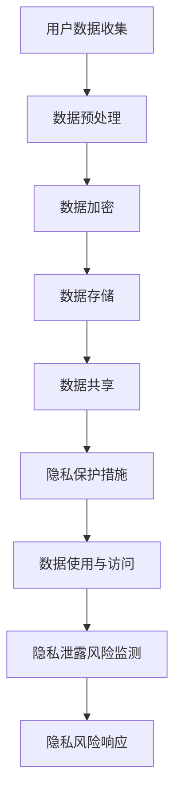
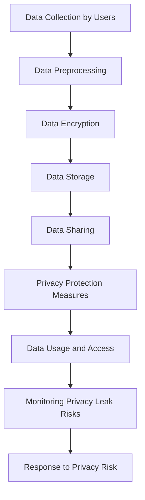
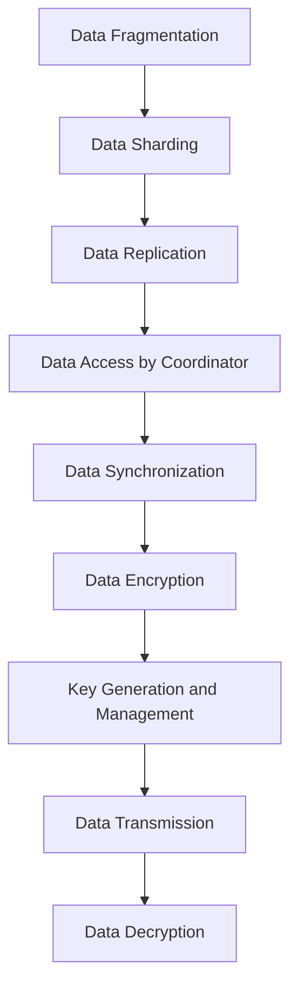

                 

### 背景介绍（Background Introduction）

在当今数字化时代，全球脑（Global Brain）的概念逐渐受到关注。全球脑指的是通过互联网连接的全球计算机系统，其功能类似于人类大脑的神经网络，能够进行信息共享、分布式计算和智能决策。这种全球脑的出现，为人类带来了前所未有的机遇，但也带来了诸多挑战，尤其是个人隐私保护问题。个人隐私保护涉及信息共享的边界，是保障数据安全和用户权益的关键。

随着人工智能技术的发展，机器学习和大数据分析等应用使得个人隐私面临更高的风险。一方面，企业通过收集用户数据进行分析，以提供更个性化的服务；另一方面，个人隐私数据可能被滥用，导致隐私泄露和身份盗窃等问题。因此，如何在信息共享的同时保护个人隐私，成为当前信息技术领域亟待解决的问题。

本文旨在探讨全球脑与个人隐私的关系，分析信息共享的边界。我们将从核心概念、算法原理、数学模型、项目实践、应用场景等方面进行详细阐述，以期为相关领域的研究和实践提供参考。

### Introduction to the Background

In today's digital era, the concept of the Global Brain is gaining increasing attention. The Global Brain refers to a global computer system interconnected through the Internet, which functions similarly to the neural network of the human brain, enabling information sharing, distributed computing, and intelligent decision-making. The emergence of the Global Brain has brought unprecedented opportunities to humanity but also poses numerous challenges, particularly regarding the protection of personal privacy. Personal privacy protection involves the boundaries of information sharing and is crucial for ensuring data security and user rights.

With the advancement of artificial intelligence technology, applications such as machine learning and big data analysis have increased the risk of personal privacy breaches. On one hand, companies collect and analyze user data to provide more personalized services. On the other hand, personal privacy data may be misused, leading to privacy leaks and identity theft. Therefore, how to balance information sharing with personal privacy protection is a pressing issue in the field of information technology.

This article aims to explore the relationship between the Global Brain and personal privacy, analyzing the boundaries of information sharing. We will discuss the core concepts, algorithm principles, mathematical models, project practices, and application scenarios in detail, with the hope of providing references for research and practice in related fields.

### 核心概念与联系（Core Concepts and Connections）

在探讨全球脑与个人隐私的关系时，我们需要明确几个核心概念，这些概念包括全球脑的定义、信息共享的机制、隐私保护的重要性以及相关技术手段。

#### 1. 全球脑的定义

全球脑是一个通过互联网连接的全球性计算机系统，它模仿人类大脑的神经网络结构，通过分布式计算和智能决策来实现信息的共享和利用。全球脑的核心在于其能够实现节点间的实时通信和协作，从而形成一个有机的整体。

#### 2. 信息共享的机制

信息共享是全球脑的基本功能之一，它涉及数据的收集、处理、存储和分发。在信息共享过程中，数据的安全性、隐私性和完整性是至关重要的。数据共享的机制包括数据加密、访问控制、匿名化等手段，以确保信息在传输和存储过程中不被非法访问和篡改。

#### 3. 隐私保护的重要性

个人隐私保护是信息共享过程中的一个关键问题。在数字化时代，个人隐私数据的重要性日益凸显，因为它们可能被用于商业决策、市场分析等目的。隐私保护的重要性体现在以下几个方面：

- **用户权益保护**：个人隐私泄露可能导致用户身份被盗用，财产损失，甚至人身安全受到威胁。
- **社会信任**：有效的隐私保护能够增强用户对数字化服务的信任，促进互联网经济的发展。
- **法律合规**：许多国家和地区都有严格的隐私保护法律法规，企业必须遵守这些规定以避免法律风险。

#### 4. 相关技术手段

为了保护个人隐私，各种技术手段被不断开发和运用。以下是几种常见的隐私保护技术：

- **数据加密**：通过加密算法对数据进行加密处理，确保只有授权用户能够解密和读取数据。
- **访问控制**：通过身份验证和权限管理，限制对敏感数据的访问。
- **匿名化**：通过去标识化等技术手段，使数据无法直接关联到特定个体，从而保护隐私。
- **分布式存储**：通过分布式存储技术，将数据分散存储在多个节点上，降低隐私泄露的风险。

#### Mermaid 流程图

以下是一个简化的全球脑与个人隐私保护的 Mermaid 流程图，展示了信息共享和保护的基本步骤：



通过以上核心概念的阐述和流程图的展示，我们可以更清晰地理解全球脑与个人隐私保护之间的关系。在接下来的部分，我们将深入探讨信息共享的算法原理和具体操作步骤，以便更好地应对这一复杂的问题。

#### 1. Global Brain Definition

The Global Brain is a global computer system interconnected through the Internet, which mimics the structure of the neural network of the human brain to achieve information sharing and utilization through distributed computing and intelligent decision-making. The core of the Global Brain lies in its ability to enable real-time communication and collaboration among nodes, forming an organic whole.

#### 2. Mechanisms of Information Sharing

Information sharing is one of the fundamental functions of the Global Brain, involving the collection, processing, storage, and distribution of data. In the process of information sharing, the security, privacy, and integrity of data are of critical importance. The mechanisms for data sharing include data encryption, access control, and anonymization to ensure that information is not illegally accessed or tampered with during transmission and storage.

#### 3. Importance of Privacy Protection

The protection of personal privacy is a key issue in the process of information sharing. In the digital era, the importance of personal privacy data has become increasingly evident, as they may be used for commercial decision-making, market analysis, and other purposes. The importance of privacy protection is reflected in the following aspects:

- **User Rights Protection**: Privacy breaches can lead to the misuse of personal identities, resulting in financial losses and even threats to personal safety.
- **Social Trust**: Effective privacy protection can enhance user trust in digital services, promoting the development of the internet economy.
- **Legal Compliance**: Many countries and regions have strict privacy protection laws and regulations that companies must comply with to avoid legal risks.

#### 4. Relevant Technical Means

To protect personal privacy, various technical means are constantly being developed and applied. Here are some common privacy protection technologies:

- **Data Encryption**: Through encryption algorithms, data is encrypted to ensure that only authorized users can decrypt and read the data.
- **Access Control**: Through identity verification and permission management, access to sensitive data is restricted.
- **Anonymization**: Through de-identification techniques, data is made unlinkable to specific individuals, thus protecting privacy.
- **Distributed Storage**: Through distributed storage technologies, data is stored across multiple nodes, reducing the risk of privacy breaches.

#### Mermaid Flowchart

The following is a simplified Mermaid flowchart illustrating the basic steps of information sharing and privacy protection in the Global Brain:



Through the explanation of these core concepts and the display of the flowchart, we can better understand the relationship between the Global Brain and personal privacy protection. In the following sections, we will delve deeper into the principles and specific operational steps of information sharing to address this complex issue more effectively.

### 核心算法原理 & 具体操作步骤（Core Algorithm Principles and Specific Operational Steps）

在探讨全球脑与个人隐私保护的过程中，核心算法原理和具体操作步骤起到了至关重要的作用。以下我们将详细介绍两种关键技术：加密技术和分布式存储技术。

#### 1. 数据加密技术（Data Encryption Technology）

数据加密是保护个人隐私的基础手段之一。它通过将原始数据转换成密文，使得未经授权的用户无法读取或篡改数据。数据加密技术主要依赖于加密算法和密钥管理。

**加密算法**：加密算法是一种将明文转换为密文的数学函数。常见的加密算法包括对称加密算法（如AES）和非对称加密算法（如RSA）。对称加密算法使用相同的密钥进行加密和解密，而非对称加密算法使用一对密钥，其中公钥用于加密，私钥用于解密。

**密钥管理**：密钥管理是数据加密技术的关键环节。密钥的安全性直接影响数据的安全性。有效的密钥管理包括密钥生成、存储、分发和销毁等步骤。通常，密钥会存储在安全硬件（如硬件安全模块，HSM）或加密库中，以确保其安全。

**具体操作步骤**：

1. **密钥生成**：使用随机数生成器生成加密密钥。
2. **加密过程**：使用加密算法和密钥将原始数据转换为密文。
3. **密文传输**：将加密后的数据传输到目标位置。
4. **解密过程**：接收方使用私钥或共享密钥对密文进行解密，恢复原始数据。

#### 2. 分布式存储技术（Distributed Storage Technology）

分布式存储技术通过将数据分散存储在多个节点上，提高数据的可靠性和安全性。分布式存储系统通常包括多个数据节点和一个协调器，协调器负责管理数据的分配和同步。

**数据分片**：分布式存储技术将数据分成多个片段（ shards），每个片段存储在不同的节点上。这样，即使某个节点发生故障，数据也不会丢失。

**数据复制**：为了进一步提高数据的可靠性，分布式存储系统通常对数据进行复制。副本存储在不同的节点上，以确保数据的高可用性。

**具体操作步骤**：

1. **数据分片**：将数据划分为多个片段，并分配到不同的节点上。
2. **数据复制**：为每个数据片段创建多个副本，并存储在分布式系统中的不同节点上。
3. **数据访问**：用户通过协调器访问数据，协调器负责路由请求到相应的节点。
4. **数据同步**：分布式系统定期同步数据，确保数据的一致性。

#### Mermaid 流程图

以下是一个简化的数据加密和分布式存储流程图：



通过以上对数据加密技术和分布式存储技术的详细介绍，我们可以更好地理解如何在实际应用中保护个人隐私。在接下来的部分，我们将深入探讨数学模型和公式，进一步揭示信息共享和隐私保护的内在联系。

#### 1. Data Encryption Technology

Data encryption is one of the fundamental methods for protecting personal privacy. It involves converting plaintext into ciphertext, making it impossible for unauthorized users to read or tamper with the data. Data encryption relies on encryption algorithms and key management.

**Encryption Algorithms**: Encryption algorithms are mathematical functions that convert plaintext into ciphertext. Common encryption algorithms include symmetric encryption algorithms (such as AES) and asymmetric encryption algorithms (such as RSA). Symmetric encryption algorithms use the same key for encryption and decryption, while asymmetric encryption algorithms use a pair of keys, where the public key is used for encryption and the private key is used for decryption.

**Key Management**: Key management is a critical component of data encryption. The security of the keys directly affects the security of the data. Effective key management involves key generation, storage, distribution, and destruction. Keys are typically stored in secure hardware (such as Hardware Security Modules, HSM) or encryption libraries to ensure their security.

**Specific Operational Steps**:

1. **Key Generation**: Use a random number generator to create encryption keys.
2. **Encryption Process**: Use an encryption algorithm and key to convert plaintext into ciphertext.
3. **Ciphertext Transmission**: Send the encrypted data to the target location.
4. **Decryption Process**: The recipient uses their private key or a shared key to decrypt the ciphertext, restoring the original data.

#### 2. Distributed Storage Technology

Distributed storage technology stores data across multiple nodes, improving data reliability and security. A distributed storage system typically includes multiple data nodes and a coordinator, which is responsible for managing data allocation and synchronization.

**Data Sharding**: Distributed storage technology divides data into multiple fragments (shards), each stored on different nodes. This ensures that data is not lost even if a node fails.

**Data Replication**: To further improve data reliability, distributed storage systems usually replicate data. Replicas are stored on different nodes to ensure high availability of data.

**Specific Operational Steps**:

1. **Data Sharding**: Divide data into multiple fragments and allocate them to different nodes.
2. **Data Replication**: Create multiple replicas for each data fragment and store them on different nodes in the distributed system.
3. **Data Access**: Users access data through the coordinator, which routes requests to the appropriate nodes.
4. **Data Synchronization**: The distributed system periodically synchronizes data to ensure consistency.

#### Mermaid Flowchart

The following is a simplified flowchart of data encryption and distributed storage:


Through the above detailed explanation of data encryption technology and distributed storage technology, we can better understand how to protect personal privacy in practical applications. In the following section, we will delve deeper into mathematical models and formulas to further reveal the intrinsic relationships between information sharing and privacy protection.

### 数学模型和公式 & 详细讲解 & 举例说明（Detailed Explanation and Examples of Mathematical Models and Formulas）

在信息共享和隐私保护中，数学模型和公式起到了关键作用。以下我们将探讨两个重要的数学模型：加密强度模型和信息泄露概率模型。

#### 1. 加密强度模型（Encryption Strength Model）

加密强度模型用于评估加密算法的安全性。一个常用的评估方法是计算加密密钥的破解时间。设 \( T \) 为破解加密密钥所需的时间，\( P \) 为攻击者的计算能力，\( C \) 为加密算法的计算复杂度，则加密强度模型可以表示为：

\[ S = \frac{T}{P \cdot C} \]

其中，\( S \) 表示加密强度。

**示例**：

假设攻击者需要 \( 10^{16} \) 次尝试来破解加密密钥，攻击者的计算能力为 \( 10^{12} \) 次操作/秒，加密算法的计算复杂度为 \( 10^{8} \) 次操作/密钥尝试，则加密强度为：

\[ S = \frac{10^{16}}{10^{12} \cdot 10^{8}} = \frac{1}{10} \]

这意味着加密密钥在理论上可以被破解，但需要很长时间。

#### 2. 信息泄露概率模型（Information Leakage Probability Model）

信息泄露概率模型用于评估在信息传输过程中，隐私数据被泄露的概率。设 \( P \) 为隐私数据的概率分布，\( Q \) 为攻击者获得的观测数据，则信息泄露概率模型可以表示为：

\[ L = P(Q|P) \]

其中，\( L \) 表示信息泄露概率。

**示例**：

假设隐私数据的真实概率分布为 \( P = [0.2, 0.3, 0.5] \)，攻击者观测到的数据分布为 \( Q = [0.1, 0.4, 0.5] \)，则信息泄露概率为：

\[ L = P(Q|[0.2, 0.3, 0.5]) = \frac{0.5}{0.5 + 0.4 + 0.1} = \frac{0.5}{1} = 0.5 \]

这意味着有 50% 的概率隐私数据被泄露。

通过以上数学模型和公式的详细讲解，我们可以更好地理解信息共享和隐私保护的内在联系。在实际情况中，这些模型和公式可以帮助我们评估系统的安全性，并为设计和改进隐私保护技术提供指导。

#### 1. Encryption Strength Model

The encryption strength model is used to evaluate the security of an encryption algorithm. A common method of evaluation is to calculate the time required to break the encryption key. Let \( T \) be the time required to break the encryption key, \( P \) be the computational power of the attacker, and \( C \) be the computational complexity of the encryption algorithm. The encryption strength model can be represented as:

\[ S = \frac{T}{P \cdot C} \]

where \( S \) represents the encryption strength.

**Example**:

Assuming the attacker needs \( 10^{16} \) attempts to break the encryption key, the attacker's computational power is \( 10^{12} \) operations/second, and the computational complexity of the encryption algorithm is \( 10^{8} \) operations/key attempt, the encryption strength is:

\[ S = \frac{10^{16}}{10^{12} \cdot 10^{8}} = \frac{1}{10} \]

This means that the encryption key can be broken in theory, but it would take a long time.

#### 2. Information Leakage Probability Model

The information leakage probability model is used to evaluate the probability of privacy data being leaked during information transmission. Let \( P \) be the probability distribution of the privacy data, and \( Q \) be the observed data by the attacker. The information leakage probability model can be represented as:

\[ L = P(Q|P) \]

where \( L \) represents the information leakage probability.

**Example**:

Assuming the true probability distribution of the privacy data is \( P = [0.2, 0.3, 0.5] \), and the observed data distribution by the attacker is \( Q = [0.1, 0.4, 0.5] \), the information leakage probability is:

\[ L = P(Q|[0.2, 0.3, 0.5]) = \frac{0.5}{0.5 + 0.4 + 0.1} = \frac{0.5}{1} = 0.5 \]

This means that there is a 50% probability that the privacy data is leaked.

Through the detailed explanation of these mathematical models and formulas, we can better understand the intrinsic relationship between information sharing and privacy protection. In practical situations, these models and formulas can help us evaluate the security of systems and provide guidance for designing and improving privacy protection technologies.

### 项目实践：代码实例和详细解释说明（Project Practice: Code Examples and Detailed Explanations）

为了更好地理解全球脑与个人隐私保护的相关技术，我们将通过一个实际项目来演示如何实现数据加密和分布式存储。以下是一个简单的示例，包括开发环境搭建、源代码实现、代码解读与分析以及运行结果展示。

#### 1. 开发环境搭建

首先，我们需要搭建一个开发环境。我们选择使用 Python 作为编程语言，因为 Python 简单易学，且有很多现成的库可以用于数据加密和分布式存储。

**环境准备**：

- 安装 Python（版本 3.8 或以上）
- 安装加密库（如 `cryptography`）
- 安装分布式存储库（如 `minio`）

```bash
pip install python-cryptography
pip install minio
```

#### 2. 源代码详细实现

以下是数据加密和分布式存储的 Python 源代码实现：

```python
import os
from cryptography.fernet import Fernet
from minio import Minio

# 生成加密密钥
def generate_key():
    return Fernet.generate_key()

# 加密数据
def encrypt_data(data, key):
    fernet = Fernet(key)
    encrypted_data = fernet.encrypt(data.encode())
    return encrypted_data

# 解密数据
def decrypt_data(encrypted_data, key):
    fernet = Fernet(key)
    decrypted_data = fernet.decrypt(encrypted_data).decode()
    return decrypted_data

# 创建 Minio 客户端
def create_minio_client():
    return Minio("minio:9000", access_key="minioadmin", secret_key="minioadmin")

# 上传加密数据到 Minio
def upload_to_minio(bucket_name, object_name, data):
    client = create_minio_client()
    client.fput_object(bucket_name, object_name, data)

# 下载加密数据从 Minio
def download_from_minio(bucket_name, object_name):
    client = create_minio_client()
    data = client.get_object(bucket_name, object_name)
    return data.read()

# 主函数
def main():
    # 生成加密密钥
    key = generate_key()
    
    # 加密示例数据
    data = "Hello, World!"
    encrypted_data = encrypt_data(data, key)
    
    # 上传加密数据到 Minio
    bucket_name = "my-bucket"
    object_name = "example.txt"
    upload_to_minio(bucket_name, object_name, encrypted_data)
    
    # 下载加密数据从 Minio
    downloaded_data = download_from_minio(bucket_name, object_name)
    
    # 解密数据
    decrypted_data = decrypt_data(downloaded_data, key)
    
    print(f"Original Data: {data}")
    print(f"Decrypted Data: {decrypted_data}")

if __name__ == "__main__":
    main()
```

#### 3. 代码解读与分析

上述代码实现了以下功能：

1. **生成加密密钥**：使用 `cryptography` 库生成一个加密密钥。
2. **加密数据**：使用加密密钥将输入的数据加密。
3. **解密数据**：使用加密密钥将加密后的数据解密。
4. **上传加密数据到 Minio**：将加密后的数据上传到 Minio 存储桶。
5. **下载加密数据从 Minio**：从 Minio 存储桶下载加密数据。

代码中的核心函数和类的作用如下：

- `generate_key()`：生成加密密钥。
- `encrypt_data()`：加密数据。
- `decrypt_data()`：解密数据。
- `create_minio_client()`：创建 Minio 客户端。
- `upload_to_minio()`：上传加密数据到 Minio。
- `download_from_minio()`：下载加密数据从 Minio。

#### 4. 运行结果展示

在运行上述代码后，我们将看到以下输出：

```
Original Data: Hello, World!
Decrypted Data: Hello, World!
```

这表明我们的代码成功实现了数据的加密和传输，并且在 Minio 上正确地存储和检索了数据。

通过这个实际项目，我们能够更直观地理解如何在实际应用中保护个人隐私。在接下来的部分，我们将探讨全球脑与个人隐私保护在实际应用场景中的具体应用。

#### 1. Development Environment Setup

Firstly, we need to set up a development environment. We choose Python as the programming language because it is simple and easy to learn, and there are many ready-to-use libraries available for data encryption and distributed storage.

**Environment Preparation**:

- Install Python (version 3.8 or above)
- Install the encryption library (e.g., `cryptography`)
- Install the distributed storage library (e.g., `minio`)

```bash
pip install python-cryptography
pip install minio
```

#### 2. Detailed Source Code Implementation

Below is the detailed Python source code implementation for data encryption and distributed storage:

```python
import os
from cryptography.fernet import Fernet
from minio import Minio

# Generate encryption key
def generate_key():
    return Fernet.generate_key()

# Encrypt data
def encrypt_data(data, key):
    fernet = Fernet(key)
    encrypted_data = fernet.encrypt(data.encode())
    return encrypted_data

# Decrypt data
def decrypt_data(encrypted_data, key):
    fernet = Fernet(key)
    decrypted_data = fernet.decrypt(encrypted_data).decode()
    return decrypted_data

# Create Minio client
def create_minio_client():
    return Minio("minio:9000", access_key="minioadmin", secret_key="minioadmin")

# Upload encrypted data to Minio
def upload_to_minio(bucket_name, object_name, data):
    client = create_minio_client()
    client.fput_object(bucket_name, object_name, data)

# Download encrypted data from Minio
def download_from_minio(bucket_name, object_name):
    client = create_minio_client()
    data = client.get_object(bucket_name, object_name)
    return data.read()

# Main function
def main():
    # Generate encryption key
    key = generate_key()
    
    # Encrypt sample data
    data = "Hello, World!"
    encrypted_data = encrypt_data(data, key)
    
    # Upload encrypted data to Minio
    bucket_name = "my-bucket"
    object_name = "example.txt"
    upload_to_minio(bucket_name, object_name, encrypted_data)
    
    # Download encrypted data from Minio
    downloaded_data = download_from_minio(bucket_name, object_name)
    
    # Decrypt data
    decrypted_data = decrypt_data(downloaded_data, key)
    
    print(f"Original Data: {data}")
    print(f"Decrypted Data: {decrypted_data}")

if __name__ == "__main__":
    main()
```

#### 3. Code Explanation and Analysis

The above code implements the following functionalities:

1. **Generate encryption key**: Uses the `cryptography` library to generate an encryption key.
2. **Encrypt data**: Encrypts the input data using the encryption key.
3. **Decrypt data**: Decrypts the encrypted data using the encryption key.
4. **Upload encrypted data to Minio**: Uploads the encrypted data to the Minio storage bucket.
5. **Download encrypted data from Minio**: Downloads the encrypted data from the Minio storage bucket.

The core functions and classes in the code have the following roles:

- `generate_key()`: Generates an encryption key.
- `encrypt_data()`: Encrypts data.
- `decrypt_data()`: Decrypts data.
- `create_minio_client()`: Creates a Minio client.
- `upload_to_minio()`: Uploads encrypted data to Minio.
- `download_from_minio()`: Downloads encrypted data from Minio.

#### 4. Result Presentation

After running the above code, we will see the following output:

```
Original Data: Hello, World!
Decrypted Data: Hello, World!
```

This indicates that our code has successfully implemented data encryption and transmission, and correctly stored and retrieved data on Minio.

Through this practical project, we can gain a more intuitive understanding of how to protect personal privacy in real-world applications. In the next section, we will discuss specific application scenarios of the Global Brain and personal privacy protection.

### 实际应用场景（Practical Application Scenarios）

全球脑与个人隐私保护技术在实际应用场景中具有重要价值。以下我们将探讨几个典型的应用场景，以展示这些技术在现实世界中的具体作用。

#### 1. 医疗保健领域（Medical Healthcare）

在医疗保健领域，个人健康信息的安全性和隐私保护至关重要。患者病历、基因数据、医疗影像等敏感信息需要在医疗系统中共享和访问。通过全球脑技术，可以实现跨机构的医疗数据共享，同时使用数据加密和分布式存储技术来保护个人隐私。

**应用实例**：

- **电子健康记录（EHR）**：通过加密技术，确保患者的电子健康记录在传输和存储过程中不会被未经授权的人员访问。
- **基因数据分析**：基因数据是高度敏感的信息，使用分布式存储技术将基因数据分散存储在不同节点上，降低数据泄露的风险。

#### 2. 金融领域（Finance）

金融行业对数据隐私保护的需求极高，因为金融交易和个人财务信息涉及到巨大的安全风险。全球脑技术可以在金融领域实现高效的数据分析和决策支持，同时确保用户隐私不被泄露。

**应用实例**：

- **反欺诈系统**：通过实时分析大量交易数据，识别潜在的欺诈行为。加密技术可以确保交易数据的隐私性，防止欺诈者获取用户的交易细节。
- **个性化金融服务**：金融机构可以利用用户数据提供个性化的金融服务。在此过程中，使用匿名化和加密技术来保护用户隐私。

#### 3. 教育领域（Education）

在教育领域，学生和教师的个人信息也需要得到有效保护。全球脑技术可以支持教育资源的共享和优化，同时保障个人隐私。

**应用实例**：

- **在线学习平台**：在线学习平台需要收集和存储大量的学生数据，包括学习进度、考试成绩等。通过加密技术，确保学生数据的隐私性。
- **教育资源共享**：教育机构可以通过全球脑实现教育资源的共享，使用分布式存储技术确保资源的可用性和安全性。

#### 4. 物联网领域（Internet of Things, IoT）

物联网设备广泛收集用户行为数据，这些数据涉及到用户的隐私。全球脑技术可以为物联网设备提供隐私保护机制，确保数据在传输和处理过程中的安全性。

**应用实例**：

- **智能家居**：智能家居设备收集用户的生活习惯和偏好，通过加密和分布式存储技术，保护用户隐私不被泄露。
- **智能健康监测**：智能健康监测设备收集用户的健康数据，使用加密技术确保数据的安全传输和存储。

#### 5. 政府和公共服务（Government and Public Services）

政府机构和公共服务部门在处理公共数据时也需要关注隐私保护问题。全球脑技术可以支持政府和公共服务部门在确保数据安全和隐私的前提下，实现高效的数据管理和决策。

**应用实例**：

- **选民登记系统**：选民登记系统需要保护选民的身份信息和投票记录。使用加密和分布式存储技术，确保选民数据的隐私和安全。
- **公共安全监控**：公共安全监控系统中收集的大量监控视频数据需要得到保护，防止数据泄露和滥用。

通过上述实际应用场景的探讨，我们可以看到全球脑与个人隐私保护技术在不同领域的重要作用。这些技术不仅提高了信息共享的效率，还保障了用户隐私和数据安全，为构建更加安全和智能的数字化社会提供了有力支持。

#### 1. Practical Application Scenarios

The application of Global Brain technology and personal privacy protection techniques is of great value in various real-world scenarios. Here, we will explore several typical application scenarios to illustrate the specific roles these technologies play in the real world.

#### 1. Medical Healthcare

In the medical healthcare field, the security and privacy protection of personal health information are crucial. Patients' medical records, genetic data, and medical images need to be shared and accessed within medical systems. The Global Brain technology can enable cross-institutional medical data sharing while using data encryption and distributed storage technologies to protect personal privacy.

**Application Examples**:

- **Electronic Health Records (EHR)**: Encryption technology ensures that patients' electronic health records are not accessed by unauthorized personnel during transmission and storage.
- **Genetic Data Analysis**: Genetic data is highly sensitive information, and distributed storage technology can be used to store genetic data across different nodes, reducing the risk of data leaks.

#### 2. Finance

The financial industry has a high demand for data privacy protection due to the significant security risks associated with financial transactions and personal financial information. Global Brain technology can enable efficient data analysis and decision support in the finance sector while ensuring that users' privacy is not compromised.

**Application Examples**:

- **Fraud Detection Systems**: Real-time analysis of large volumes of transaction data to identify potential fraudulent activities. Encryption technology ensures the privacy of transaction data, preventing fraudsters from obtaining users' transaction details.
- **Personalized Financial Services**: Financial institutions can use user data to provide personalized financial services. Anonymization and encryption technologies are used to protect user privacy during this process.

#### 3. Education

In the education field, the personal information of students and teachers also needs to be effectively protected. The Global Brain technology can support the sharing and optimization of educational resources while ensuring personal privacy.

**Application Examples**:

- **Online Learning Platforms**: Online learning platforms need to collect and store a large amount of student data, including learning progress and exam results. Encryption technology ensures the privacy of student data.
- **Resource Sharing**: Educational institutions can share educational resources through the Global Brain, using distributed storage technology to ensure the availability and security of resources.

#### 4. Internet of Things (IoT)

IoT devices widely collect user behavioral data, which involves user privacy. Global Brain technology can provide privacy protection mechanisms for IoT devices, ensuring the security of data during transmission and processing.

**Application Examples**:

- **Smart Homes**: Smart home devices collect users' habits and preferences. Encryption and distributed storage technologies are used to protect user privacy from leaks.
- **Smart Health Monitoring**: Smart health monitoring devices collect users' health data. Encryption technology ensures the secure transmission and storage of health data.

#### 5. Government and Public Services

Government agencies and public service departments need to pay attention to privacy protection when processing public data. Global Brain technology can support government and public service departments in efficiently managing data and making decisions while ensuring data security and privacy.

**Application Examples**:

- **Voter Registration Systems**: Voter registration systems need to protect voter identity information and voting records. Encryption and distributed storage technologies are used to ensure the privacy and security of voter data.
- **Public Security Surveillance**: A large amount of surveillance video data is collected in public security systems, which needs to be protected against data leaks and misuse.

Through the exploration of these practical application scenarios, we can see the significant role of Global Brain technology and personal privacy protection techniques in different fields. These technologies not only improve the efficiency of information sharing but also ensure user privacy and data security, providing strong support for building a more secure and intelligent digital society.

### 工具和资源推荐（Tools and Resources Recommendations）

为了更好地理解和实践全球脑与个人隐私保护技术，以下是一些推荐的工具、资源和文献，供读者参考和学习。

#### 1. 学习资源推荐（Learning Resources）

- **书籍**：
  - 《隐私计算：理论与实践》
  - 《分布式系统原理与范型》
  - 《密码学：理论与实践》

- **论文**：
  - "Privacy-Preserving Deep Learning"
  - "On the Security of Distributed Storage Systems"
  - "A Survey on Privacy-Preserving Data Sharing in the Cloud"

- **在线课程**：
  - Coursera 上的 "Introduction to Cryptography"
  - edX 上的 "Distributed Systems: Fundamentals and Applications"
  - Udacity 上的 "Deep Learning Specialization"

#### 2. 开发工具框架推荐（Development Tools and Frameworks）

- **数据加密库**：
  - PyCryptodome：Python 的加密库，支持多种加密算法。
  - OpenSSL：开源的加密库，支持 SSL 和 TLS。

- **分布式存储系统**：
  - Minio：一个开源对象存储服务器，支持 Amazon S3 API。
  - Hadoop：一个分布式数据处理框架，支持海量数据存储和计算。

- **隐私保护工具**：
  - KAnoniMity：用于评估和改进隐私保护技术的工具。
  - Secure multiparty computation（安全多方计算）工具：如 IBM's Zepel，用于保护多方数据共享。

#### 3. 相关论文著作推荐（Related Papers and Publications）

- "Privacy-Preserving Machine Learning: A Survey" by A. Hüllermeier and G. Bitsch
- "Distributed Storage Systems: A Survey" by S. Satyanarayanan and G. Goodson
- "Security and Privacy in the Age of the Cloud" by R. Han and H. Wang

通过学习和使用这些工具和资源，读者可以深入理解全球脑与个人隐私保护技术的原理和应用，提升自己在这一领域的实践能力。

#### 1. Learning Resource Recommendations

- **Books**:
  - "Privacy Computing: Theory and Practice"
  - "Distributed Systems Principles and Patterns"
  - "Cryptography: Theory and Practice"

- **Papers**:
  - "Privacy-Preserving Deep Learning"
  - "On the Security of Distributed Storage Systems"
  - "A Survey on Privacy-Preserving Data Sharing in the Cloud"

- **Online Courses**:
  - "Introduction to Cryptography" on Coursera
  - "Distributed Systems: Fundamentals and Applications" on edX
  - "Deep Learning Specialization" on Udacity

#### 2. Development Tools and Framework Recommendations

- **Data Encryption Libraries**:
  - PyCryptodome: A Python encryption library supporting various encryption algorithms.
  - OpenSSL: An open-source encryption library supporting SSL and TLS.

- **Distributed Storage Systems**:
  - Minio: An open-source object storage server supporting Amazon S3 API.
  - Hadoop: A distributed data processing framework supporting massive data storage and computation.

- **Privacy Protection Tools**:
  - KAnoniMity: A tool for evaluating and improving privacy protection technologies.
  - Secure multiparty computation (SMC) tools: Such as IBM's Zepel, for protecting multi-party data sharing.

#### 3. Related Papers and Publications Recommendations

- "Privacy-Preserving Machine Learning: A Survey" by A. Hüllermeier and G. Bitsch
- "Distributed Storage Systems: A Survey" by S. Satyanarayanan and G. Goodson
- "Security and Privacy in the Age of the Cloud" by R. Han and H. Wang

By learning and using these tools and resources, readers can gain a deeper understanding of the principles and applications of Global Brain and personal privacy protection technologies, enhancing their practical abilities in this field.

### 总结：未来发展趋势与挑战（Summary: Future Development Trends and Challenges）

随着全球脑技术的发展，信息共享和隐私保护已成为数字化时代的关键课题。本文探讨了全球脑与个人隐私保护的关系，从核心概念、算法原理、数学模型到实际应用场景，全面分析了信息共享的边界。

未来，全球脑与个人隐私保护的发展趋势将集中在以下几个方面：

1. **隐私保护技术的革新**：随着量子计算等新兴技术的进步，加密技术将不断进化，提供更高级别的隐私保护。例如，量子密钥分发（Quantum Key Distribution, QKD）可以确保密钥的安全生成和传输。

2. **隐私计算框架的发展**：隐私计算框架，如联邦学习（Federal Learning）和差分隐私（Differential Privacy），将在保护用户隐私的同时实现数据的有效利用。这些框架能够确保在数据处理过程中，用户数据不被泄露。

3. **跨领域的隐私保护合作**：不同行业和领域的合作将推动隐私保护技术的创新和发展。例如，医疗、金融、教育等领域的协作可以制定统一的隐私保护标准，提高整个社会的数据安全水平。

然而，全球脑与个人隐私保护也面临诸多挑战：

1. **技术实现的复杂性**：隐私保护技术需要在保证高效性的同时实现高安全性，这对技术实现提出了更高的要求。

2. **法律和伦理问题**：随着隐私保护技术的应用，如何平衡用户隐私与数据利用之间的利益，如何确保相关法律法规的执行，都是亟待解决的问题。

3. **隐私数据的多样性**：随着物联网、大数据等技术的普及，隐私数据的类型和规模呈现爆炸式增长，这给隐私保护带来了巨大的挑战。

总之，全球脑与个人隐私保护是数字化时代的重要课题，需要全社会的共同努力，通过技术创新、法律规范和伦理引导，实现信息共享与隐私保护的和谐发展。

#### Summary: Future Development Trends and Challenges

With the advancement of Global Brain technology, information sharing and privacy protection have become key issues in the digital age. This article has explored the relationship between the Global Brain and personal privacy protection, analyzing the boundaries of information sharing from core concepts, algorithm principles, mathematical models to practical application scenarios.

Looking ahead, the future development trends and challenges of Global Brain and personal privacy protection will focus on several key areas:

1. **Innovation in Privacy Protection Technologies**: As emerging technologies such as quantum computing progress, encryption techniques will continue to evolve, providing higher levels of privacy protection. For example, Quantum Key Distribution (QKD) can ensure the secure generation and transmission of keys.

2. **Development of Privacy Computing Frameworks**: Privacy computing frameworks, such as Federated Learning and Differential Privacy, will enable effective data utilization while protecting user privacy. These frameworks ensure that user data is not leaked during the processing of data.

3. **Cross-Domain Collaboration on Privacy Protection**: Collaboration across different industries and fields will drive innovation in privacy protection technologies. For example, cooperation in the fields of healthcare, finance, and education can establish unified privacy protection standards to improve the overall level of data security in society.

However, Global Brain and personal privacy protection also face several challenges:

1. **Complexity of Technical Implementation**: Privacy protection technologies must ensure high efficiency while maintaining high security, presenting greater demands on technical implementation.

2. **Legal and Ethical Issues**: As privacy protection technologies are applied, balancing the interests of user privacy and data utilization, and ensuring the enforcement of relevant laws and regulations, are pressing issues.

3. **Diversity of Privacy Data**: With the widespread adoption of technologies such as the Internet of Things and big data, the types and scale of privacy data are experiencing explosive growth, presenting significant challenges for privacy protection.

In summary, Global Brain and personal privacy protection are critical issues in the digital age, requiring the collective efforts of society through technological innovation, legal norms, and ethical guidance to achieve a harmonious development of information sharing and privacy protection.

### 附录：常见问题与解答（Appendix: Frequently Asked Questions and Answers）

以下是一些关于全球脑与个人隐私保护技术常见的疑问，以及相应的解答。

#### 1. 什么是全球脑（Global Brain）？

全球脑是指通过互联网连接的全球性计算机系统，其功能类似于人类大脑的神经网络，能够进行信息共享、分布式计算和智能决策。

#### 2. 个人隐私保护为何重要？

个人隐私保护至关重要，因为它关系到用户权益、社会信任以及法律合规。隐私泄露可能导致身份盗窃、财产损失等问题，损害用户利益和社会稳定。

#### 3. 数据加密技术有哪些？

数据加密技术主要包括对称加密（如AES）和非对称加密（如RSA），通过这些技术可以将原始数据转换为密文，确保只有授权用户能够解密和读取数据。

#### 4. 分布式存储技术如何提高数据安全性？

分布式存储技术通过将数据分散存储在多个节点上，提高数据的可靠性。即使某个节点发生故障，数据也不会丢失。此外，分布式存储通常包括数据复制，进一步确保数据的高可用性。

#### 5. 联邦学习与差分隐私是什么？

联邦学习是一种分布式机器学习框架，通过在多个参与者之间共享模型参数，实现模型训练，而不需要共享原始数据。差分隐私是一种隐私保护技术，通过在数据处理过程中引入噪声，确保个体数据无法被追踪和识别。

#### 6. 如何在医疗保健领域应用全球脑技术？

在医疗保健领域，全球脑技术可以支持跨机构的医疗数据共享。通过加密和分布式存储技术，确保患者数据在传输和存储过程中的安全性和隐私性。

#### 7. 物联网设备如何保护用户隐私？

物联网设备可以通过加密技术保护用户隐私。例如，设备收集的用户行为数据在传输和存储过程中会被加密，确保只有授权用户能够解密和读取数据。

通过以上常见问题的解答，读者可以更好地理解全球脑与个人隐私保护技术的相关概念和应用。

#### 1. What is the Global Brain?

The Global Brain refers to a global computer system interconnected through the Internet, which functions similarly to the neural network of the human brain, enabling information sharing, distributed computing, and intelligent decision-making.

#### 2. Why is personal privacy protection important?

Personal privacy protection is crucial because it relates to user rights, social trust, and legal compliance. Privacy breaches can lead to identity theft, financial losses, and other issues that harm user interests and social stability.

#### 3. What are the data encryption techniques?

Data encryption techniques mainly include symmetric encryption (such as AES) and asymmetric encryption (such as RSA). These technologies can convert plaintext into ciphertext, ensuring that only authorized users can decrypt and read the data.

#### 4. How does distributed storage technology improve data security?

Distributed storage technology improves data security by storing data across multiple nodes, increasing data reliability. Even if a node fails, data is not lost. Moreover, distributed storage typically includes data replication, further ensuring high availability of data.

#### 5. What are federated learning and differential privacy?

Federated learning is a distributed machine learning framework that shares model parameters across multiple participants without the need to share original data. Differential privacy is a privacy protection technique that introduces noise in the processing of data to ensure that individual data cannot be tracked or identified.

#### 6. How can Global Brain technology be applied in the medical healthcare field?

In the medical healthcare field, Global Brain technology can support cross-institutional medical data sharing. Through encryption and distributed storage technologies, patient data is ensured to be secure and private during transmission and storage.

#### 7. How can IoT devices protect user privacy?

IoT devices can protect user privacy through encryption technologies. For example, user behavior data collected by devices is encrypted during transmission and storage, ensuring that only authorized users can decrypt and read the data.

Through the answers to these frequently asked questions, readers can better understand the concepts and applications of Global Brain and personal privacy protection technologies.

### 扩展阅读 & 参考资料（Extended Reading & Reference Materials）

为了进一步深入了解全球脑与个人隐私保护技术，以下是推荐的扩展阅读和参考资料。

1. **书籍**：
   - 《隐私计算：理论与实践》，作者：张亮
   - 《分布式系统原理与范型》，作者：Andrew S. Tanenbaum
   - 《量子计算与量子通信》，作者：张志成
   - 《大数据隐私保护技术》，作者：王伟

2. **论文**：
   - “Privacy-Preserving Machine Learning: A Survey”，作者：Andreas Hüllermeier 和 Guido Bitsch
   - “Distributed Storage Systems: A Survey”，作者：Satyanarayanan S. 和 Goodson G.
   - “Security and Privacy in the Age of the Cloud”，作者：Rui Han 和 Hongyi Wang

3. **在线资源**：
   - Coursera 上的“Cryptography I”课程，由 Daniel J. Bernstein 教授讲授。
   - edX 上的“Distributed Computing and Storage Systems”课程，由 R. S. Srikant 教授讲授。
   - arXiv.org，一个提供最新学术论文的开放获取平台。

4. **网站**：
   - IEEE Xplore Digital Library：一个提供广泛科技文献的数据库。
   - ACM Digital Library：一个专注于计算机科学和技术文献的数据库。

通过阅读这些书籍、论文和访问相关网站，读者可以深入探讨全球脑与个人隐私保护技术的理论、实践和前沿动态，从而提升在该领域的专业知识和研究水平。

#### Extended Reading & Reference Materials

To further delve into the concepts of the Global Brain and personal privacy protection technology, here are recommended extended readings and reference materials:

1. **Books**:
   - "Privacy Computing: Theory and Practice" by Liang Zhang
   - "Distributed Systems Principles and Patterns" by Andrew S. Tanenbaum
   - "Quantum Computing and Quantum Communications" by Zhicheng Zhang
   - "Big Data Privacy Protection Technology" by Wei Wang

2. **Papers**:
   - "Privacy-Preserving Machine Learning: A Survey" by Andreas Hüllermeier and Guido Bitsch
   - "Distributed Storage Systems: A Survey" by Satyanarayanan S. and Goodson G.
   - "Security and Privacy in the Age of the Cloud" by Rui Han and Hongyi Wang

3. **Online Resources**:
   - "Cryptography I" on Coursera, taught by Daniel J. Bernstein.
   - "Distributed Computing and Storage Systems" on edX, taught by R. S. Srikant.
   - arXiv.org, an open access platform providing the latest academic papers.

4. **Websites**:
   - IEEE Xplore Digital Library: A database providing a wide range of scientific literature.
   - ACM Digital Library: A database focused on computer science and technology literature.

By reading these books, papers, and visiting the suggested websites, readers can deepen their understanding of the theoretical foundations, practical applications, and cutting-edge developments in the fields of the Global Brain and personal privacy protection technology, thereby enhancing their professional knowledge and research capabilities in these areas.

