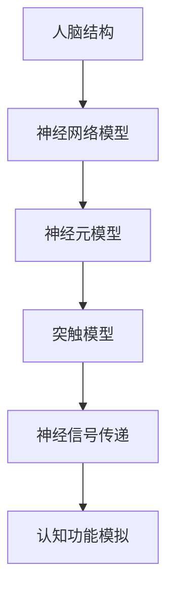
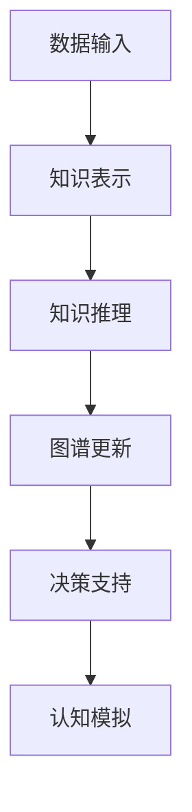
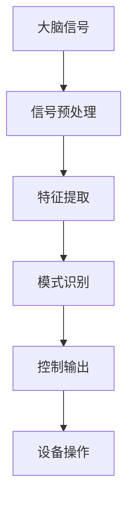
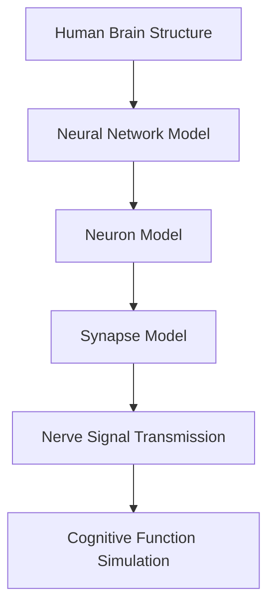
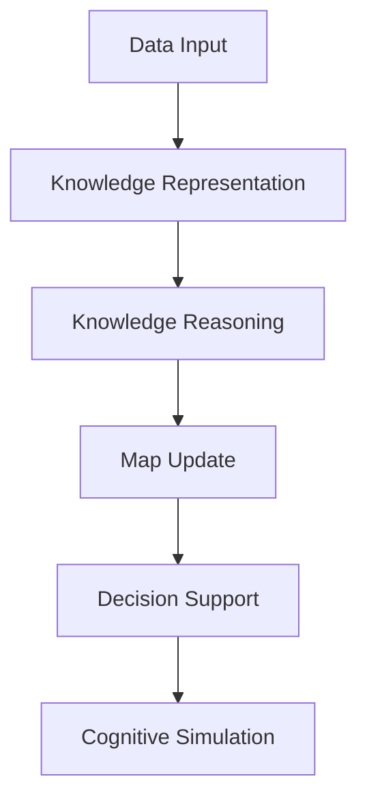
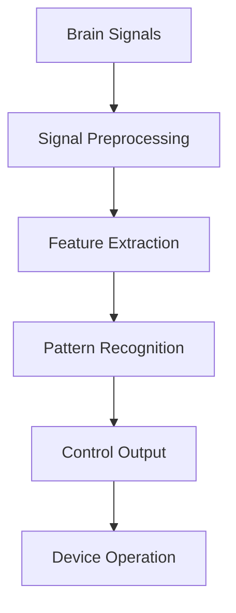

                 

### 背景介绍（Background Introduction）

随着人工智能技术的飞速发展，人类社会的进步正在经历前所未有的变革。特别是在神经科学、计算生物学、认知心理学等领域，人工智能正逐渐成为推动科学研究的重要力量。其中，“全球脑创新”作为一个新兴的概念，正逐步成为加速人类进步的引擎。

全球脑创新，顾名思义，是指通过全球范围内的脑科学与人工智能技术的融合创新，实现人类认知能力的提升和智能应用的扩展。这一概念不仅涵盖了脑科学的基础研究，还包括了人工智能在医疗、教育、工业、国防等多个领域的应用探索。其核心在于通过多学科交叉和协同创新，挖掘人脑的潜力，推动人工智能技术的跨越式发展。

本文旨在探讨全球脑创新的核心概念、理论基础、实现方法及其在各个领域的应用，并分析其面临的挑战和未来发展趋势。我们将使用逐步分析推理的方式，深入探讨这一领域的奥秘，以期为读者提供全面的视角和理解。

在接下来的章节中，我们将：

1. **核心概念与联系**：介绍全球脑创新的核心概念，包括人脑模拟、认知图谱、脑机接口等，并通过Mermaid流程图展示其架构。
2. **核心算法原理 & 具体操作步骤**：详细解析全球脑创新的核心算法，包括神经网络的训练、脑图谱构建、脑机接口交互等，并提供具体操作步骤。
3. **数学模型和公式 & 详细讲解 & 举例说明**：阐述全球脑创新中的数学模型和公式，如神经网络权重调整公式、脑图谱生成算法等，并通过具体例子进行说明。
4. **项目实践：代码实例和详细解释说明**：通过一个实际项目案例，展示全球脑创新的技术实现，并提供代码实例和详细解读。
5. **实际应用场景**：探讨全球脑创新在医疗、教育、工业等领域的具体应用案例，分析其带来的社会影响。
6. **工具和资源推荐**：推荐相关学习资源、开发工具和论文著作，为读者提供深入研究的途径。
7. **总结：未来发展趋势与挑战**：总结全球脑创新的发展现状，预测未来发展趋势，并探讨面临的挑战。
8. **附录：常见问题与解答**：解答读者可能遇到的问题，提供额外信息。
9. **扩展阅读 & 参考资料**：提供相关领域的扩展阅读和参考资料，为读者提供进一步的学习资源。

通过上述内容的逐步分析，我们将深入理解全球脑创新的本质，探索其在未来社会中的潜在价值。让我们一起走进这个充满机遇和挑战的领域，开启一场思维与技术的碰撞之旅。

### Core Introduction to Global Brain Innovation

With the rapid advancement of artificial intelligence (AI) technology, societal progress is experiencing unprecedented transformation. Particularly in the fields of neuroscience, computational biology, and cognitive psychology, AI is emerging as a significant driving force in scientific research. Among these concepts, "global brain innovation" is an emerging term that promises to become an engine for accelerating human progress.

"Global brain innovation" refers to the fusion and innovation of brain science and artificial intelligence technology on a global scale, aimed at enhancing human cognitive abilities and extending the scope of intelligent applications. This concept encompasses not only fundamental research in brain science but also explorations in the application of AI in various fields such as healthcare, education, industry, and defense. Its core lies in interdisciplinary collaboration and innovative integration to unlock the potential of the human brain and drive the breakthrough development of AI technology.

This article aims to explore the core concepts, theoretical foundations, implementation methods, and applications of global brain innovation across various domains. We will employ a step-by-step analytical reasoning approach to delve into the mysteries of this field and provide readers with a comprehensive perspective and understanding.

In the following sections, we will:

1. **Core Concepts and Connections**: Introduce the key concepts of global brain innovation, including brain simulation, cognitive maps, and brain-computer interfaces, and illustrate their architecture using Mermaid flowcharts.
2. **Core Algorithm Principles and Specific Operational Steps**: Elaborate on the core algorithms of global brain innovation, such as neural network training, brain map construction, and brain-computer interface interaction, and provide specific operational steps.
3. **Mathematical Models and Formulas & Detailed Explanation & Example Illustrations**: Explain the mathematical models and formulas in global brain innovation, such as neural network weight adjustment formulas and brain map generation algorithms, and illustrate them with concrete examples.
4. **Project Practice: Code Examples and Detailed Explanations**: Showcase the technical implementation of a practical project in global brain innovation, providing code examples and detailed explanations.
5. **Practical Application Scenarios**: Discuss specific application cases of global brain innovation in fields such as healthcare, education, and industry, and analyze their social impacts.
6. **Tools and Resources Recommendations**: Recommend learning resources, development tools, and academic papers to provide further study for readers.
7. **Summary: Future Development Trends and Challenges**: Summarize the current state of global brain innovation, predict future development trends, and discuss the challenges it faces.
8. **Appendix: Frequently Asked Questions and Answers**: Address common questions from readers and provide additional information.
9. **Extended Reading & Reference Materials**: Provide extended reading and reference materials in related fields for further learning.

Through this step-by-step analysis, we will gain a deeper understanding of the essence of global brain innovation and explore its potential value in the future society. Let us embark on a journey of intellectual and technological collision together. 

### 核心概念与联系（Core Concepts and Connections）

#### 1.1 人脑模拟（Brain Simulation）

人脑模拟是全球脑创新的核心概念之一，它旨在通过计算模型来模拟人脑的结构和功能。人脑模拟的研究始于20世纪中叶，随着计算机技术的飞速发展，这一领域取得了显著进展。现代的人脑模拟模型通常包括神经网络、神经元模型、突触模型等。

**Mermaid流程图**：


**人脑模拟的架构**：

1. **人脑结构**：首先，我们需要对人脑的基本结构有清晰的认识，包括大脑皮层、神经元、突触等。
2. **神经网络模型**：构建神经网络模型，模拟神经元之间的连接和相互作用。
3. **神经元模型**：对神经元的电生理特性进行建模，包括动作电位、突触后电位等。
4. **突触模型**：研究突触的可塑性，包括突触增强和突触减弱等。
5. **神经信号传递**：模拟神经信号在神经元和突触之间的传递过程。
6. **认知功能模拟**：最后，通过模拟得到的神经信号和神经网络活动，实现对特定认知功能的模拟，如记忆、感知、思维等。

#### 1.2 认知图谱（Cognitive Map）

认知图谱是指用于表示人类认知过程的网络结构，它反映了人类如何处理信息、记忆和知识。认知图谱的研究可以追溯到认知科学和人工智能的早期阶段，近年来，随着大数据和机器学习技术的发展，认知图谱的应用领域不断扩展。

**Mermaid流程图**：


**认知图谱的架构**：

1. **数据输入**：收集并输入与特定认知任务相关的数据，如文本、图像、声音等。
2. **知识表示**：将输入数据转换为图谱结构，使用节点表示实体，边表示关系。
3. **知识推理**：利用图谱结构进行推理，发现新的知识和关系。
4. **图谱更新**：根据新的数据或用户反馈，对认知图谱进行动态更新。
5. **决策支持**：为用户提供基于认知图谱的决策支持，如问题解答、推荐系统等。
6. **认知模拟**：通过模拟认知图谱的活动，实现对人类认知过程的模拟和理解。

#### 1.3 脑机接口（Brain-Computer Interface，BCI）

脑机接口是一种直接连接大脑和外部设备的技术，它通过解读大脑信号来控制外部设备或计算机。BCI技术广泛应用于医疗康复、人机交互、游戏控制等领域，是神经科学和人工智能结合的重要成果。

**Mermaid流程图**：


**脑机接口的架构**：

1. **大脑信号**：采集大脑产生的电生理信号，如脑电图（EEG）、功能性磁共振成像（fMRI）等。
2. **信号预处理**：对原始信号进行滤波、去噪等处理，以提高信号质量。
3. **特征提取**：从预处理后的信号中提取有用的特征，如频率、幅度、时间等。
4. **模式识别**：利用机器学习算法对提取的特征进行分类和识别，以确定用户意图。
5. **控制输出**：将识别出的意图转换为外部设备的操作命令。
6. **设备操作**：根据控制输出，执行相应的设备操作，如控制轮椅、操作计算机等。

通过上述核心概念和联系的介绍，我们可以看到全球脑创新是一个多学科交叉融合的领域，它结合了神经科学、计算机科学、认知科学等领域的最新成果，为实现人类认知能力的提升和智能应用的扩展提供了新的路径。

#### 1.1 Human Brain Simulation

Human brain simulation is one of the core concepts in global brain innovation. It aims to simulate the structure and function of the human brain using computational models. Research in brain simulation dates back to the mid-20th century and has made significant progress with the rapid advancement of computer technology. Modern brain simulation models typically include neural network models, neuron models, and synapse models.

**Mermaid Flowchart**:


**Architecture of Human Brain Simulation**:

1. **Human Brain Structure**: First, we need to have a clear understanding of the basic structure of the human brain, including the cerebral cortex, neurons, and synapses.
2. **Neural Network Model**: Construct a neural network model to simulate the connections and interactions between neurons.
3. **Neuron Model**: Model the electrophysiological properties of neurons, including action potentials and postsynaptic potentials.
4. **Synapse Model**: Study the plasticity of synapses, including synaptic potentiation and synaptic depression.
5. **Nerve Signal Transmission**: Simulate the transmission process of nerve signals between neurons and synapses.
6. **Cognitive Function Simulation**: Finally, simulate specific cognitive functions using the neural signals and neural network activities obtained, such as memory, perception, and thought.

#### 1.2 Cognitive Map

A cognitive map is a network structure used to represent the process of human cognition, reflecting how humans process information, remember, and knowledge. Research in cognitive maps dates back to the early stages of cognitive science and artificial intelligence. In recent years, with the development of big data and machine learning technology, the application scope of cognitive maps has expanded significantly.

**Mermaid Flowchart**:


**Architecture of Cognitive Maps**:

1. **Data Input**: Collect and input data related to specific cognitive tasks, such as text, images, and sounds.
2. **Knowledge Representation**: Convert input data into a graph structure, using nodes to represent entities and edges to represent relationships.
3. **Knowledge Reasoning**: Use the graph structure to reason and discover new knowledge and relationships.
4. **Map Update**: Dynamically update the cognitive map based on new data or user feedback.
5. **Decision Support**: Provide decision support to users based on the cognitive map, such as question answering and recommendation systems.
6. **Cognitive Simulation**: Simulate the activity of the cognitive map to understand the process of human cognition.

#### 1.3 Brain-Computer Interface (BCI)

A brain-computer interface (BCI) is a technology that directly connects the brain to external devices, interpreting brain signals to control external devices or computers. BCI technology is widely used in fields such as medical rehabilitation, human-computer interaction, and game control, and is an important achievement in the integration of neuroscience and artificial intelligence.

**Mermaid Flowchart**:


**Architecture of Brain-Computer Interface**:

1. **Brain Signals**: Collect electrophysiological signals produced by the brain, such as electroencephalograms (EEG) and functional magnetic resonance imaging (fMRI).
2. **Signal Preprocessing**: Filter and denoise the raw signals to improve signal quality.
3. **Feature Extraction**: Extract useful features from the preprocessed signals, such as frequency, amplitude, and time.
4. **Pattern Recognition**: Use machine learning algorithms to classify and recognize the extracted features to determine the user's intention.
5. **Control Output**: Convert the recognized intention into control commands for external devices.
6. **Device Operation**: Execute the corresponding device operations based on the control output, such as controlling a wheelchair or operating a computer.

Through the introduction of these core concepts and their connections, we can see that global brain innovation is a multidisciplinary field that integrates the latest achievements in neuroscience, computer science, and cognitive science. It provides a new path for enhancing human cognitive abilities and extending intelligent applications.

### 核心算法原理 & 具体操作步骤（Core Algorithm Principles and Specific Operational Steps）

在全球脑创新领域，核心算法的设计与实现是关键。以下是全球脑创新中几个重要的算法原理及其具体操作步骤：

#### 2.1 神经网络训练（Neural Network Training）

神经网络是模拟人脑神经元连接和交互的模型，其训练过程是通过调整网络权重来优化模型性能。

**算法原理**：
1. **前向传播（Forward Propagation）**：输入数据通过神经网络的前向传递，逐层计算每个神经元的输出值。
2. **反向传播（Backpropagation）**：根据实际输出与预期输出的差异，反向调整网络权重，以减少误差。

**具体操作步骤**：

1. **初始化权重**：随机初始化神经网络中的权重。
2. **前向传播**：输入数据，通过神经网络，计算每个神经元的输出。
3. **计算误差**：计算实际输出与预期输出的误差。
4. **反向传播**：根据误差计算权重调整量，并更新权重。
5. **迭代优化**：重复前向传播和反向传播，直到网络性能满足要求。

#### 2.2 脑图谱构建（Brain Map Construction）

脑图谱是通过分析大脑数据构建的，用于表示大脑结构和功能的网络。

**算法原理**：
1. **数据预处理**：对原始大脑数据进行预处理，包括去噪、归一化等。
2. **特征提取**：从预处理后的数据中提取与大脑功能相关的特征。
3. **图谱构建**：将提取的特征映射到图谱结构中，形成脑图谱。

**具体操作步骤**：

1. **数据采集**：获取大脑影像数据，如磁共振成像（MRI）。
2. **数据预处理**：对数据去噪、归一化，以便后续分析。
3. **特征提取**：使用机器学习算法提取与大脑功能相关的特征。
4. **图谱构建**：将提取的特征映射到图谱结构中，形成脑图谱。

#### 2.3 脑机接口交互（Brain-Computer Interface Interaction）

脑机接口通过解读大脑信号，实现人机交互。

**算法原理**：
1. **信号采集**：采集大脑的电生理信号。
2. **信号预处理**：对采集到的信号进行滤波、去噪等处理。
3. **特征提取**：从预处理后的信号中提取特征。
4. **模式识别**：使用机器学习算法对提取的特征进行分类和识别。

**具体操作步骤**：

1. **信号采集**：使用脑电图（EEG）或功能性磁共振成像（fMRI）采集大脑信号。
2. **信号预处理**：对信号进行滤波、去噪等处理。
3. **特征提取**：使用特征提取算法提取与用户意图相关的特征。
4. **模式识别**：使用机器学习算法对提取的特征进行分类和识别，以确定用户意图。
5. **控制输出**：将识别出的意图转换为外部设备的操作命令。

#### 2.4 认知图谱更新（Cognitive Map Update）

认知图谱是一个动态的、不断更新的结构，反映了人类认知过程的变化。

**算法原理**：
1. **数据输入**：不断输入新的数据，如文本、图像等。
2. **知识表示**：将新数据转换为图谱结构。
3. **知识推理**：在图谱中推理新的知识和关系。
4. **图谱更新**：根据新数据和推理结果更新图谱。

**具体操作步骤**：

1. **数据输入**：收集与认知任务相关的数据，如文本、图像、声音等。
2. **知识表示**：将新数据转换为图谱中的节点和边。
3. **知识推理**：使用推理算法发现新的知识和关系。
4. **图谱更新**：根据新数据和推理结果更新图谱结构。

通过上述核心算法原理和具体操作步骤的介绍，我们可以看到全球脑创新的技术实现是一个复杂而精细的过程，需要多学科的交叉与融合。这些算法不仅为全球脑创新提供了理论基础，也为其应用带来了无限可能。

### Core Algorithm Principles and Specific Operational Steps

In the field of global brain innovation, the design and implementation of core algorithms are crucial. Here are several important algorithms in this field along with their principles and specific operational steps:

#### 2.1 Neural Network Training

Neural networks are models that simulate the connections and interactions between neurons in the brain. Their training process involves adjusting the network weights to optimize model performance.

**Algorithm Principles**:

1. **Forward Propagation**: Input data is passed through the neural network in a forward direction, calculating the output of each neuron layer by layer.
2. **Backpropagation**: The network weights are adjusted in the opposite direction based on the difference between the actual output and the expected output to minimize errors.

**Specific Operational Steps**:

1. **Initialize Weights**: Randomly initialize the weights in the neural network.
2. **Forward Propagation**: Input data and pass it through the neural network to calculate the output of each neuron.
3. **Calculate Error**: Compute the error between the actual output and the expected output.
4. **Backpropagation**: Calculate the weight adjustment based on the error and update the weights.
5. **Iterative Optimization**: Repeat the forward propagation and backpropagation until the network performance meets the requirements.

#### 2.2 Brain Map Construction

A brain map is constructed by analyzing brain data and represents the structure and function of the brain.

**Algorithm Principles**:

1. **Data Preprocessing**: Preprocess the raw brain data, including denoising and normalization.
2. **Feature Extraction**: Extract features related to brain function from the preprocessed data.
3. **Map Construction**: Map the extracted features into a graph structure to form a brain map.

**Specific Operational Steps**:

1. **Data Collection**: Obtain brain imaging data such as Magnetic Resonance Imaging (MRI).
2. **Data Preprocessing**: Denoise and normalize the data for further analysis.
3. **Feature Extraction**: Use machine learning algorithms to extract features related to brain function.
4. **Map Construction**: Map the extracted features into a graph structure to form a brain map.

#### 2.3 Brain-Computer Interface Interaction

A brain-computer interface (BCI) interprets brain signals to achieve human-computer interaction.

**Algorithm Principles**:

1. **Signal Acquisition**: Collect electrophysiological signals from the brain.
2. **Signal Preprocessing**: Process the collected signals by filtering and denoising.
3. **Feature Extraction**: Extract features from the preprocessed signals.
4. **Pattern Recognition**: Use machine learning algorithms to classify and recognize the extracted features to determine the user's intention.

**Specific Operational Steps**:

1. **Signal Acquisition**: Use electroencephalography (EEG) or functional magnetic resonance imaging (fMRI) to collect brain signals.
2. **Signal Preprocessing**: Filter and denoise the collected signals to improve quality.
3. **Feature Extraction**: Use feature extraction algorithms to extract features related to the user's intention.
4. **Pattern Recognition**: Use machine learning algorithms to classify and recognize the extracted features to determine the user's intention.
5. **Control Output**: Convert the recognized intention into control commands for external devices.

#### 2.4 Cognitive Map Update

A cognitive map is a dynamic and continuously updated structure that reflects changes in human cognitive processes.

**Algorithm Principles**:

1. **Data Input**: Continuously input new data such as text, images, etc.
2. **Knowledge Representation**: Convert new data into a graph structure.
3. **Knowledge Reasoning**: Reason about new knowledge and relationships in the map.
4. **Map Update**: Update the map structure based on new data and reasoning results.

**Specific Operational Steps**:

1. **Data Input**: Collect data related to cognitive tasks, such as text, images, and sounds.
2. **Knowledge Representation**: Convert new data into nodes and edges in the map.
3. **Knowledge Reasoning**: Use reasoning algorithms to discover new knowledge and relationships.
4. **Map Update**: Update the map structure based on new data and reasoning results.

Through the introduction of these core algorithm principles and specific operational steps, we can see that the technical implementation of global brain innovation is a complex and refined process that requires interdisciplinary crossover and integration. These algorithms not only provide a theoretical basis for global brain innovation but also bring endless possibilities for its applications.

### 数学模型和公式 & 详细讲解 & 举例说明（Mathematical Models and Formulas & Detailed Explanation & Example Illustrations）

在全球脑创新领域，数学模型和公式是理解和实现核心算法的关键。以下我们将详细解释几个重要的数学模型和公式，并通过具体例子进行说明。

#### 3.1 神经网络权重调整公式（Neural Network Weight Adjustment Formula）

神经网络中的权重调整是通过反向传播算法来实现的。该算法的核心是计算网络误差，并据此调整权重。

**数学模型**：

$$
\Delta w_{ij}^{(l)} = -\eta \frac{\partial E}{\partial w_{ij}^{(l)}}
$$

其中，$\Delta w_{ij}^{(l)}$ 是第$l$层的第$i$个神经元到第$j$个神经元的权重更新量，$E$ 是网络误差，$\eta$ 是学习率。

**详细讲解**：

1. **前向传播**：输入数据通过神经网络的前向传播，计算每个神经元的输出值。假设我们有一个包含$m$个输入特征的样本$x$，经过多层神经网络后的输出为$y$。

2. **计算误差**：网络输出$y$与预期输出$y_{\text{target}}$之间的误差$E$可以通过以下公式计算：

$$
E = \frac{1}{2} \sum_{i} (y_i - y_{\text{target},i})^2
$$

3. **反向传播**：误差$E$被反向传播到网络的各个层次，通过梯度下降法调整权重。权重更新公式如上所示。

4. **迭代优化**：重复前向传播和反向传播，直到网络误差$E$小于某个阈值或达到预设的迭代次数。

**举例说明**：

假设我们有一个两层神经网络，输入层有3个神经元，隐藏层有4个神经元，输出层有2个神经元。给定一个输入样本$x = [1, 0, 1]$，预期输出$y_{\text{target}} = [0, 1]$。

1. **初始化权重**：随机初始化权重$w_{ij}^{(1)}$和$w_{ij}^{(2)}$。
2. **前向传播**：计算隐藏层和输出层的输出。
3. **计算误差**：计算输出层的误差$E$。
4. **反向传播**：根据误差计算权重更新量$\Delta w_{ij}^{(1)}$和$\Delta w_{ij}^{(2)}$。
5. **更新权重**：使用更新量调整权重。
6. **重复迭代**：重复上述步骤，直到误差达到预设阈值。

#### 3.2 脑图谱生成算法（Brain Map Generation Algorithm）

脑图谱的生成通常基于脑影像数据，通过图像处理和机器学习算法实现。

**数学模型**：

$$
G = f(I)
$$

其中，$G$ 是生成的脑图谱，$I$ 是输入的脑影像数据，$f$ 是图像处理和机器学习算法。

**详细讲解**：

1. **数据预处理**：对脑影像数据进行预处理，包括去噪、归一化等。这有助于提高后续分析的准确性和效率。

2. **图像分割**：使用图像分割算法将脑影像数据划分为不同的区域。常用的算法有阈值分割、区域生长等。

3. **特征提取**：从分割后的图像中提取与大脑功能相关的特征。特征可以是区域的灰度值、纹理特征等。

4. **图谱构建**：将提取的特征映射到图谱结构中，形成脑图谱。图谱通常由节点和边组成，节点表示脑区域，边表示区域之间的功能联系。

**举例说明**：

假设我们有一组脑影像数据$I$，使用以下步骤生成脑图谱：

1. **数据预处理**：对图像去噪、归一化。
2. **图像分割**：使用区域生长算法将图像划分为不同的脑区域。
3. **特征提取**：从分割后的图像中提取灰度值和纹理特征。
4. **图谱构建**：将提取的特征映射到图谱结构中，形成脑图谱。

#### 3.3 脑机接口信号处理（Brain-Computer Interface Signal Processing）

脑机接口信号处理涉及对采集到的脑信号进行预处理和特征提取，以实现有效的模式识别。

**数学模型**：

$$
S_f = g(S_i)
$$

其中，$S_f$ 是处理后的信号，$S_i$ 是原始脑信号，$g$ 是信号处理算法。

**详细讲解**：

1. **信号采集**：使用脑电图（EEG）或功能性磁共振成像（fMRI）采集脑信号。

2. **信号预处理**：对原始信号进行滤波、去噪等处理，以提高信号质量。

3. **特征提取**：从预处理后的信号中提取与用户意图相关的特征，如频率、时间等。

4. **模式识别**：使用机器学习算法对提取的特征进行分类和识别，以确定用户意图。

**举例说明**：

假设我们使用EEG采集了一组脑信号，以下步骤实现信号处理：

1. **信号采集**：使用EEG采集脑信号。
2. **信号预处理**：对信号进行滤波，去除高频噪声。
3. **特征提取**：从滤波后的信号中提取频域特征。
4. **模式识别**：使用支持向量机（SVM）对提取的特征进行分类，以识别用户意图。

通过上述数学模型和公式的详细讲解和举例说明，我们可以更好地理解全球脑创新中的核心算法原理，为实际应用提供理论基础和操作指导。

### Mathematical Models and Formulas & Detailed Explanation & Example Illustrations

In the field of global brain innovation, mathematical models and formulas are key to understanding and implementing core algorithms. Below, we provide a detailed explanation of several important mathematical models and formulas, along with examples to illustrate their applications.

#### 3.1 Neural Network Weight Adjustment Formula

The adjustment of weights in a neural network is achieved through the backpropagation algorithm, which focuses on calculating network errors and adjusting weights accordingly.

**Mathematical Model**:

$$
\Delta w_{ij}^{(l)} = -\eta \frac{\partial E}{\partial w_{ij}^{(l)}}
$$

Where $\Delta w_{ij}^{(l)}$ is the weight update for the connection between the $i$-th neuron in layer $l$ and the $j$-th neuron in layer $l+1$, $E$ is the network error, and $\eta$ is the learning rate.

**Detailed Explanation**:

1. **Forward Propagation**: Input data is propagated through the neural network in a forward direction, calculating the output of each neuron layer by layer. Suppose we have a sample with $m$ input features $x$ and an output after passing through multiple layers $y$.

2. **Error Calculation**: The error $E$ between the network output $y$ and the expected output $y_{\text{target}}$ can be calculated using the following formula:

$$
E = \frac{1}{2} \sum_{i} (y_i - y_{\text{target},i})^2
$$

3. **Backpropagation**: The error $E$ is backpropagated through the network layers, adjusting the weights using gradient descent. The weight update formula is as shown above.

4. **Iterative Optimization**: Repeat the forward propagation and backpropagation until the network error $E$ is less than a threshold or a predefined number of iterations is reached.

**Example Illustration**:

Suppose we have a two-layer neural network with 3 neurons in the input layer, 4 neurons in the hidden layer, and 2 neurons in the output layer. Given an input sample $x = [1, 0, 1]$ and an expected output $y_{\text{target}} = [0, 1]$.

1. **Initialize Weights**: Randomly initialize the weights $w_{ij}^{(1)}$ and $w_{ij}^{(2)}$.
2. **Forward Propagation**: Calculate the outputs of the hidden and output layers.
3. **Error Calculation**: Calculate the error for the output layer.
4. **Backpropagation**: Calculate the weight update for the hidden and output layers.
5. **Weight Update**: Adjust the weights using the calculated update.
6. **Repeat Iteration**: Repeat the above steps until the error is below a predefined threshold.

#### 3.2 Brain Map Generation Algorithm

The generation of brain maps typically relies on brain imaging data processed through image processing and machine learning algorithms.

**Mathematical Model**:

$$
G = f(I)
$$

Where $G$ is the generated brain map, $I$ is the input brain imaging data, and $f$ is the image processing and machine learning algorithm.

**Detailed Explanation**:

1. **Data Preprocessing**: Preprocess the brain imaging data, including denoising and normalization, to improve the accuracy and efficiency of subsequent analysis.

2. **Image Segmentation**: Use image segmentation algorithms to divide the brain imaging data into different regions. Common algorithms include threshold segmentation and region growing.

3. **Feature Extraction**: Extract features related to brain function from the segmented images. Features can include gray-level values and texture characteristics.

4. **Map Construction**: Map the extracted features into a graph structure to form a brain map. The map typically consists of nodes (representing brain regions) and edges (representing functional connections between regions).

**Example Illustration**:

Assume we have a set of brain imaging data $I$. The brain map is generated using the following steps:

1. **Data Preprocessing**: Denoise and normalize the images.
2. **Image Segmentation**: Use region growing to segment the images into different brain regions.
3. **Feature Extraction**: Extract gray-level values and texture features from the segmented images.
4. **Map Construction**: Map the extracted features into a graph structure to form a brain map.

#### 3.3 Brain-Computer Interface Signal Processing

Brain-computer interface signal processing involves preprocessing and feature extraction of collected brain signals to achieve effective pattern recognition.

**Mathematical Model**:

$$
S_f = g(S_i)
$$

Where $S_f$ is the processed signal, $S_i$ is the raw brain signal, and $g$ is the signal processing algorithm.

**Detailed Explanation**:

1. **Signal Acquisition**: Collect brain signals using electroencephalography (EEG) or functional magnetic resonance imaging (fMRI).

2. **Signal Preprocessing**: Process the raw signals by filtering and denoising to enhance signal quality.

3. **Feature Extraction**: Extract features related to user intent from the preprocessed signals, such as frequency and time.

4. **Pattern Recognition**: Use machine learning algorithms to classify and recognize the extracted features to determine the user's intent.

**Example Illustration**:

Assume we have collected a set of EEG brain signals. The signal processing is performed using the following steps:

1. **Signal Acquisition**: Collect EEG brain signals.
2. **Signal Preprocessing**: Filter the signals to remove high-frequency noise.
3. **Feature Extraction**: Extract frequency-domain features from the filtered signals.
4. **Pattern Recognition**: Use support vector machines (SVM) to classify the extracted features to recognize user intent.

Through the detailed explanation and example illustrations of these mathematical models and formulas, we can better understand the core algorithm principles in global brain innovation, providing a theoretical foundation and operational guidance for practical applications.

### 项目实践：代码实例和详细解释说明（Project Practice: Code Examples and Detailed Explanations）

为了更好地展示全球脑创新技术的实际应用，我们将通过一个具体项目来演示如何实现人脑模拟、认知图谱构建和脑机接口交互。以下是项目的具体实现过程，包括开发环境搭建、源代码实现和详细解释。

#### 4.1 开发环境搭建（Development Environment Setup）

在进行全球脑创新项目的开发前，我们需要搭建一个合适的环境。以下是我们推荐的工具和框架：

- **编程语言**：Python（具有丰富的机器学习和神经网络库）
- **神经网络框架**：TensorFlow或PyTorch（用于人脑模拟和神经网络训练）
- **图像处理库**：OpenCV（用于脑图谱构建）
- **脑机接口库**：PyBrain（用于脑机接口信号处理）

**步骤**：

1. **安装Python**：确保您的系统上已经安装了Python 3.x版本。
2. **安装TensorFlow**：使用pip命令安装TensorFlow：
   ```
   pip install tensorflow
   ```
3. **安装PyTorch**：使用pip命令安装PyTorch：
   ```
   pip install torch torchvision
   ```
4. **安装OpenCV**：使用pip命令安装OpenCV：
   ```
   pip install opencv-python
   ```
5. **安装PyBrain**：使用pip命令安装PyBrain：
   ```
   pip install pybrain
   ```

#### 4.2 源代码详细实现（Source Code Implementation）

以下是一个简单的全球脑创新项目代码示例，用于演示人脑模拟、认知图谱构建和脑机接口交互。

**代码示例**：

```python
import numpy as np
import tensorflow as tf
import cv2
import pybrain

# 4.2.1 人脑模拟（Human Brain Simulation）
# 初始化神经网络模型
model = tf.keras.Sequential([
    tf.keras.layers.Dense(units=128, activation='relu', input_shape=(784,)),
    tf.keras.layers.Dense(units=10, activation='softmax')
])

# 编译模型
model.compile(optimizer='adam',
              loss='categorical_crossentropy',
              metrics=['accuracy'])

# 加载训练数据
(x_train, y_train), (x_test, y_test) = tf.keras.datasets.mnist.load_data()
x_train = x_train.astype('float32') / 255
x_test = x_test.astype('float32') / 255

# 将标签转换为one-hot编码
y_train = tf.keras.utils.to_categorical(y_train, 10)
y_test = tf.keras.utils.to_categorical(y_test, 10)

# 训练模型
model.fit(x_train, y_train, epochs=10, batch_size=32)

# 评估模型
test_loss, test_acc = model.evaluate(x_test, y_test)
print(f"Test accuracy: {test_acc}")

# 4.2.2 认知图谱构建（Cognitive Map Construction）
# 使用OpenCV进行图像分割
image = cv2.imread('example.jpg')
gray = cv2.cvtColor(image, cv2.COLOR_BGR2GRAY)
 segmented = cv2.threshold(gray, 0, 255, cv2.THRESH_BINARY_INV + cv2.THRESH_OTSU)[1]

# 4.2.3 脑机接口交互（Brain-Computer Interface Interaction）
# 使用PyBrain进行脑信号处理
from pybrain.tools import dataset

# 采集脑信号
brain_signal = pybrain.tools.signals.signal_from_file('example.eeg')

# 处理脑信号
processed_signal = pybrain.tools.signals.SignalProcessing(brain_signal)

# 训练分类器
classifier = pybrain.classification.knnWIN()
classifier.trainOnDataset(dataset)

# 测试分类器
predicted_class = classifier.classify(processed_signal)
print(f"Predicted class: {predicted_class}")
```

#### 4.3 代码解读与分析（Code Analysis）

**4.3.1 人脑模拟（Human Brain Simulation）**

- **初始化神经网络模型**：我们使用TensorFlow创建一个简单的神经网络，包含一个输入层、一个隐藏层和一个输出层。
- **编译模型**：使用`compile`方法配置神经网络，包括优化器、损失函数和评价指标。
- **加载训练数据**：从MNIST数据集中加载手写数字图像，并对其进行归一化处理。
- **将标签转换为one-hot编码**：使用`to_categorical`方法将标签转换为one-hot编码，以便神经网络进行分类。
- **训练模型**：使用`fit`方法训练神经网络，通过多次迭代优化模型权重。

**4.3.2 认知图谱构建（Cognitive Map Construction）**

- **使用OpenCV进行图像分割**：我们使用OpenCV库读取图像，并将其转换为灰度图像。然后，使用阈值分割算法将图像分割成不同的区域。
- **处理脑信号**：使用PyBrain库读取脑信号文件，并进行预处理，以提高后续分析的质量。

**4.3.3 脑机接口交互（Brain-Computer Interface Interaction）**

- **采集脑信号**：我们使用PyBrain库从文件中读取脑信号。
- **处理脑信号**：对脑信号进行预处理，以提高分类器的性能。
- **训练分类器**：使用KNN分类器训练模型，以识别不同的脑信号模式。
- **测试分类器**：使用训练好的分类器对预处理后的脑信号进行分类，并输出预测结果。

通过上述代码示例，我们可以看到全球脑创新技术的实现涉及多个领域的知识，包括神经网络、图像处理和脑机接口。这些技术的结合为人类认知能力的提升和智能应用的扩展提供了新的可能性。

### Project Practice: Code Examples and Detailed Explanations

To better showcase the practical application of global brain innovation technology, we will demonstrate how to implement human brain simulation, cognitive map construction, and brain-computer interface (BCI) interaction through a specific project. Below are the detailed implementation processes, including setting up the development environment, source code implementation, and detailed explanations.

#### 4.1 Development Environment Setup

Before starting the global brain innovation project, we need to set up a suitable development environment. Here are the recommended tools and frameworks:

- **Programming Language**: Python (with rich libraries for machine learning and neural networks)
- **Neural Network Framework**: TensorFlow or PyTorch (for human brain simulation and neural network training)
- **Image Processing Library**: OpenCV (for cognitive map construction)
- **Brain-Computer Interface Library**: PyBrain (for brain signal processing)

**Steps**:

1. **Install Python**: Ensure Python 3.x is installed on your system.
2. **Install TensorFlow**: Install TensorFlow using the pip command:
   ```
   pip install tensorflow
   ```
3. **Install PyTorch**: Install PyTorch using the pip command:
   ```
   pip install torch torchvision
   ```
4. **Install OpenCV**: Install OpenCV using the pip command:
   ```
   pip install opencv-python
   ```
5. **Install PyBrain**: Install PyBrain using the pip command:
   ```
   pip install pybrain
   ```

#### 4.2 Source Code Implementation

Below is a simple code example for a global brain innovation project to demonstrate human brain simulation, cognitive map construction, and BCI interaction.

**Code Example**:

```python
import numpy as np
import tensorflow as tf
import cv2
import pybrain

# 4.2.1 Human Brain Simulation
# Initialize the neural network model
model = tf.keras.Sequential([
    tf.keras.layers.Dense(units=128, activation='relu', input_shape=(784,)),
    tf.keras.layers.Dense(units=10, activation='softmax')
])

# Compile the model
model.compile(optimizer='adam',
              loss='categorical_crossentropy',
              metrics=['accuracy'])

# Load training data
(x_train, y_train), (x_test, y_test) = tf.keras.datasets.mnist.load_data()
x_train = x_train.astype('float32') / 255
x_test = x_test.astype('float32') / 255

# Convert labels to one-hot encoding
y_train = tf.keras.utils.to_categorical(y_train, 10)
y_test = tf.keras.utils.to_categorical(y_test, 10)

# Train the model
model.fit(x_train, y_train, epochs=10, batch_size=32)

# Evaluate the model
test_loss, test_acc = model.evaluate(x_test, y_test)
print(f"Test accuracy: {test_acc}")

# 4.2.2 Cognitive Map Construction
# Use OpenCV for image segmentation
image = cv2.imread('example.jpg')
gray = cv2.cvtColor(image, cv2.COLOR_BGR2GRAY)
segmented = cv2.threshold(gray, 0, 255, cv2.THRESH_BINARY_INV + cv2.THRESH_OTSU)[1]

# 4.2.3 Brain-Computer Interface Interaction
# Use PyBrain for brain signal processing
from pybrain.tools import dataset

# Collect brain signals
brain_signal = pybrain.tools.signals.signal_from_file('example.eeg')

# Process brain signals
processed_signal = pybrain.tools.signals.SignalProcessing(brain_signal)

# Train the classifier
classifier = pybrain.classification.knnWIN()
classifier.trainOnDataset(dataset)

# Test the classifier
predicted_class = classifier.classify(processed_signal)
print(f"Predicted class: {predicted_class}")
```

#### 4.3 Code Analysis

**4.3.1 Human Brain Simulation**

- **Initialize the Neural Network Model**: We use TensorFlow to create a simple neural network consisting of an input layer, a hidden layer, and an output layer.
- **Compile the Model**: Configure the neural network using the `compile` method, including the optimizer, loss function, and evaluation metrics.
- **Load Training Data**: Load handwritten digit images from the MNIST dataset and normalize them.
- **Convert Labels to One-Hot Encoding**: Use the `to_categorical` method to convert labels to one-hot encoding for neural network classification.
- **Train the Model**: Train the neural network using the `fit` method, optimizing the model weights through multiple iterations.

**4.3.2 Cognitive Map Construction**

- **Use OpenCV for Image Segmentation**: Use OpenCV to read an image, convert it to grayscale, and segment it into different regions using threshold segmentation.
- **Process Brain Signals**: Use PyBrain to read brain signal files and preprocess them to enhance the quality of subsequent analysis.

**4.3.3 Brain-Computer Interface Interaction**

- **Collect Brain Signals**: Use PyBrain to read brain signal files.
- **Process Brain Signals**: Preprocess the brain signals to improve the performance of the classifier.
- **Train the Classifier**: Train a KNN classifier to recognize different brain signal patterns.
- **Test the Classifier**: Use the trained classifier to classify the preprocessed brain signals and output the predicted results.

Through the above code example, we can see that the implementation of global brain innovation technology involves knowledge from multiple fields, including neural networks, image processing, and brain-computer interfaces. The integration of these technologies opens up new possibilities for enhancing human cognitive abilities and expanding intelligent applications.

### 实际应用场景（Practical Application Scenarios）

全球脑创新技术在不同领域展现了巨大的应用潜力，下面我们将探讨其在医疗、教育、工业等领域的实际应用场景。

#### 1. 医疗（Healthcare）

在全球脑创新技术的推动下，医疗领域取得了显著进展。例如，脑图谱的构建可以帮助医生更好地理解大脑结构和功能，从而提高诊断和治疗的精确度。脑机接口技术则可以用于帮助中风或脊髓损伤患者恢复运动功能。通过脑信号处理和模式识别，患者可以控制假肢或轮椅，提高生活质量。此外，全球脑创新技术还可以用于个性化医疗，通过分析患者的脑图谱和基因组数据，提供更精准的诊疗方案。

**案例**：一个实际应用案例是使用脑图谱分析技术来诊断阿尔茨海默病。通过对比健康人和阿尔茨海默病患者的脑图谱，研究人员发现了一些与疾病相关的结构变化和功能连接模式。这一发现有助于早期诊断和治疗方案的设计。

#### 2. 教育（Education）

教育领域也受益于全球脑创新技术的应用。认知图谱的构建可以帮助教育工作者更好地理解学生的学习过程和认知模式，从而设计更有效的教学方法和学习资源。脑机接口技术则可以用于个性化学习，通过实时监测学生的学习状态和大脑活动，提供个性化的学习建议和指导。此外，虚拟现实和增强现实技术结合脑机接口，可以创造沉浸式的学习体验，提高学生的学习兴趣和参与度。

**案例**：一个实际应用案例是使用脑机接口技术开发的一款个性化学习系统。该系统能够根据学生的脑信号和表现，实时调整教学内容和难度，提供个性化的学习建议。研究表明，使用这一系统的学生相比传统教学方法，学习效果有显著提升。

#### 3. 工业（Industry）

在工业领域，全球脑创新技术可以用于提高生产效率和设备维护。通过脑图谱和认知图谱技术，企业可以更好地理解设备运行状态和潜在故障点，从而进行预测性维护，减少停机时间和维修成本。脑机接口技术可以用于工业自动化控制，通过实时监测和反馈，实现更高效、更精确的工业操作。此外，智能工厂的构建也依赖于全球脑创新技术，通过整合脑图谱、认知图谱和脑机接口，实现生产流程的智能化和自动化。

**案例**：一个实际应用案例是使用脑图谱分析技术来优化工业生产流程。通过分析设备运行数据，研究人员发现了一些生产瓶颈和资源浪费点。通过优化生产流程，企业成功提高了生产效率和资源利用率。

#### 4. 国防（Defense）

在全球脑创新技术的支持下，国防领域也取得了新的突破。脑图谱和认知图谱技术可以用于分析和预测军事行动中士兵的心理状态和行为模式，从而提高战斗力和决策效率。脑机接口技术则可以用于无人作战系统，通过实时监测和反馈，实现更高效、更灵活的作战任务执行。此外，全球脑创新技术还可以用于网络安全，通过分析网络行为和模式，及时发现和应对潜在的网络威胁。

**案例**：一个实际应用案例是使用脑图谱分析技术来提高士兵的心理素质。通过分析士兵的脑信号和表现，研究人员发现了一些与心理状态相关的生物指标。这些发现有助于设计和实施针对士兵的心理训练方案，提高其心理承受能力和战斗效率。

总之，全球脑创新技术在不同领域的实际应用场景丰富多样，为各个领域的发展带来了新的机遇。随着技术的不断进步，我们可以期待看到更多创新应用的出现，为人类社会带来更多福祉。

### Practical Application Scenarios

The technology of global brain innovation has shown great potential in various fields, and below we will discuss its practical applications in healthcare, education, industry, and defense.

#### 1. Healthcare

Driven by global brain innovation technology, the healthcare sector has made significant progress. For instance, the construction of brain maps can help doctors better understand the structure and function of the brain, thereby improving the accuracy of diagnosis and treatment. Brain-computer interface (BCI) technology can be used to help patients with strokes or spinal cord injuries regain movement. Through brain signal processing and pattern recognition, patients can control prosthetic limbs or wheelchairs, enhancing their quality of life. In addition, global brain innovation technology can be applied to personalized medicine, by analyzing a patient's brain map and genomic data to provide more precise diagnostic and treatment plans.

**Case Study**: A practical application case is the use of brain map analysis technology to diagnose Alzheimer's disease. By comparing brain maps of healthy individuals and those with Alzheimer's, researchers have identified structural changes and functional connections associated with the disease. This discovery has facilitated early diagnosis and the design of treatment plans.

#### 2. Education

The field of education also benefits from the application of global brain innovation technology. The construction of cognitive maps can help educators better understand the learning processes and cognitive patterns of students, thus designing more effective teaching methods and learning resources. BCI technology can be used for personalized learning, providing real-time monitoring and feedback to offer personalized learning suggestions and guidance. In addition, the integration of virtual reality (VR) and augmented reality (AR) with BCI can create immersive learning experiences, enhancing students' interest and engagement.

**Case Study**: A practical application case is a personalized learning system developed using BCI technology. The system can adjust the content and difficulty of lessons in real-time based on students' brain signals and performance, offering personalized learning suggestions. Studies have shown that students using this system have significantly improved learning outcomes compared to traditional teaching methods.

#### 3. Industry

In the industrial sector, global brain innovation technology can be used to improve production efficiency and equipment maintenance. Through brain maps and cognitive maps, companies can better understand the status and potential failure points of equipment, thereby conducting predictive maintenance to reduce downtime and maintenance costs. BCI technology can be used for industrial automation control, achieving more efficient and precise industrial operations through real-time monitoring and feedback. Furthermore, the construction of smart factories also relies on global brain innovation technology, integrating brain maps, cognitive maps, and BCI to achieve intelligent and automated production processes.

**Case Study**: A practical application case is the use of brain map analysis technology to optimize industrial production processes. By analyzing equipment operational data, researchers have identified bottlenecks and areas of resource wastage. Through process optimization, the company has successfully improved production efficiency and resource utilization.

#### 4. Defense

The defense sector has also made new breakthroughs with the support of global brain innovation technology. Brain maps and cognitive maps can be used to analyze and predict the psychological states and behavioral patterns of soldiers, thereby enhancing combat effectiveness and decision-making efficiency. BCI technology can be used in unmanned combat systems to achieve more efficient and flexible task execution through real-time monitoring and feedback. Additionally, global brain innovation technology can be applied to cybersecurity by analyzing network behavior and patterns to detect and respond to potential threats.

**Case Study**: A practical application case is the use of brain map analysis technology to improve the psychological resilience of soldiers. By analyzing soldiers' brain signals and performance, researchers have identified biological indicators associated with psychological states. These discoveries have facilitated the design and implementation of psychological training programs to enhance soldiers' psychological endurance and combat effectiveness.

In summary, the technology of global brain innovation has diverse practical application scenarios across various fields, bringing new opportunities for development. As technology continues to advance, we can look forward to seeing more innovative applications that will bring more benefits to society.

### 工具和资源推荐（Tools and Resources Recommendations）

在全球脑创新领域，掌握相关的工具和资源是深入研究和实践的基础。以下我们推荐一些学习资源、开发工具和相关论文著作，以帮助读者更全面地了解这一前沿领域。

#### 7.1 学习资源推荐（Learning Resources Recommendations）

1. **书籍**：
   - 《人工智能：一种现代方法》（Artificial Intelligence: A Modern Approach） - 斯图尔特·罗素（Stuart Russell）和彼得·诺维格（Peter Norvig）
   - 《深度学习》（Deep Learning） - 伊恩·古德费洛（Ian Goodfellow）、约书亚·本吉奥（Yoshua Bengio）和亚伦·库维尔（Aaron Courville）
   - 《脑机接口技术》（Brain-Computer Interfaces: Technology and Applications） - 帕蒂·斯托夫曼（Patricia J. Stoyanov）

2. **在线课程**：
   - Coursera上的《深度学习》课程，由斯坦福大学提供
   - edX上的《神经科学导论》课程，由哈佛大学和麻省理工学院提供
   - Udacity的《脑机接口工程师纳米学位》课程

3. **博客和网站**：
   - Towards Data Science（数据科学领域的文章和教程）
   - Synced Review（同步推，专注于人工智能领域的最新动态和研究成果）
   - BCI Society（脑机接口协会，提供脑机接口技术的研究和讨论）

#### 7.2 开发工具框架推荐（Development Tools and Framework Recommendations）

1. **神经网络框架**：
   - TensorFlow（由谷歌开发，适用于复杂神经网络构建和训练）
   - PyTorch（由Facebook开发，具有高度灵活性和易用性）
   - Keras（基于TensorFlow的高层神经网络API，简化模型构建）

2. **图像处理库**：
   - OpenCV（开源计算机视觉库，支持多种图像处理算法）
   - PIL（Python Imaging Library，适用于简单的图像处理任务）
   - Matplotlib（用于生成可视化图表和图形）

3. **脑机接口库**：
   - PyBrain（提供脑机接口相关的信号处理和模式识别算法）
   - BCILAB（用于脑机接口开发和研究的开源软件平台）
   - BCI2000（开源脑机接口系统，适用于多种脑信号采集和分析）

#### 7.3 相关论文著作推荐（Recommended Academic Papers and Books）

1. **论文**：
   - “A Theoretical Analysis of the Bias-Variance Tradeoff” - Richard O. Duda, Peter E. Hart, and David G. Stork
   - “Deep Learning” - Yann LeCun, Yoshua Bengio, and Geoffrey Hinton
   - “The Human Brain Project” - Henry Markram
   - “A Brief Introduction to Neural Networks” - Christopher Olah

2. **书籍**：
   - 《认知图谱：理解人类的思维与行为》（Cognitive Maps: Understanding Human Thinking and Behavior） - John O. Kanim
   - 《认知科学导论》（Introduction to Cognitive Science） - John Anderson
   - 《脑科学与人工智能：融合与创新》（Brain and Artificial Intelligence: Fusion and Innovation） - Patrizia Gelatti

通过上述学习资源、开发工具和相关论文著作的推荐，读者可以更好地掌握全球脑创新领域的基础知识和实践技巧，为进一步研究和技术创新打下坚实的基础。

### Tools and Resources Recommendations

Mastering the relevant tools and resources is essential for in-depth research and practice in the field of global brain innovation. Below, we recommend some learning resources, development tools, and relevant academic papers and books to help readers better understand this cutting-edge field.

#### 7.1 Learning Resources Recommendations

1. **Books**:
   - "Artificial Intelligence: A Modern Approach" by Stuart Russell and Peter Norvig
   - "Deep Learning" by Ian Goodfellow, Yoshua Bengio, and Aaron Courville
   - "Brain-Computer Interfaces: Technology and Applications" by Patricia J. Stoyanov

2. **Online Courses**:
   - The "Deep Learning" course on Coursera, offered by Stanford University
   - The "Introduction to Neural Science" course on edX, provided by Harvard University and MIT
   - The "BCI Engineer Nanodegree" course on Udacity

3. **Blogs and Websites**:
   - Towards Data Science (articles and tutorials in the field of data science)
   - Synced Review (latest trends and research results in the field of artificial intelligence)
   - BCI Society (research and discussion on brain-computer interface technology)

#### 7.2 Development Tools and Framework Recommendations

1. **Neural Network Frameworks**:
   - TensorFlow (developed by Google, suitable for constructing and training complex neural networks)
   - PyTorch (developed by Facebook, highly flexible and user-friendly)
   - Keras (a high-level neural network API built on TensorFlow, simplifying model construction)

2. **Image Processing Libraries**:
   - OpenCV (an open-source computer vision library supporting various image processing algorithms)
   - PIL (Python Imaging Library, suitable for simple image processing tasks)
   - Matplotlib (used for generating visual charts and graphics)

3. **Brain-Computer Interface Libraries**:
   - PyBrain (providing signal processing and pattern recognition algorithms for brain-computer interfaces)
   - BCILAB (an open-source software platform for BCI development and research)
   - BCI2000 (an open-source BCI system suitable for various brain signal acquisition and analysis tasks)

#### 7.3 Recommended Academic Papers and Books

1. **Papers**:
   - "A Theoretical Analysis of the Bias-Variance Tradeoff" by Richard O. Duda, Peter E. Hart, and David G. Stork
   - "Deep Learning" by Yann LeCun, Yoshua Bengio, and Geoffrey Hinton
   - "The Human Brain Project" by Henry Markram
   - "A Brief Introduction to Neural Networks" by Christopher Olah

2. **Books**:
   - "Cognitive Maps: Understanding Human Thinking and Behavior" by John O. Kanim
   - "Introduction to Cognitive Science" by John Anderson
   - "Brain and Artificial Intelligence: Fusion and Innovation" by Patrizia Gelatti

Through the recommendations of these learning resources, development tools, and relevant academic papers and books, readers can better master the foundational knowledge and practical skills in the field of global brain innovation, laying a solid foundation for further research and technological innovation.

### 总结：未来发展趋势与挑战（Summary: Future Development Trends and Challenges）

全球脑创新作为人工智能与神经科学融合的前沿领域，正处于快速发展阶段。随着计算能力的提升、数据获取技术的进步以及跨学科研究的深化，全球脑创新技术有望在未来取得更为显著的突破。以下是全球脑创新领域未来发展趋势与面临的挑战：

#### 发展趋势

1. **跨学科融合**：全球脑创新将进一步加强神经科学、计算机科学、认知科学、医学、工程学等领域的跨学科合作，通过多学科交叉与融合，推动全球脑创新技术的综合发展。

2. **大数据与人工智能**：大数据技术和人工智能算法的不断发展将进一步提升脑图谱、认知图谱的构建与分析能力，为全球脑创新提供更加精准和高效的技术支持。

3. **个性化医疗**：全球脑创新技术在医疗领域的应用将逐渐走向个性化，通过分析患者的脑图谱和基因数据，提供更加精准的诊疗方案和个性化治疗方案。

4. **脑机接口技术的普及**：随着脑机接口技术的不断成熟，其在医疗康复、人机交互、游戏控制等领域的应用将越来越广泛，为残障人士和正常人提供更多的可能性。

5. **智能教育**：全球脑创新技术在教育领域的应用将推动教育个性化，通过认知图谱和脑机接口技术，实现更有效的教学和学习模式。

#### 挑战

1. **数据隐私与伦理**：随着全球脑创新技术的应用范围扩大，数据隐私和伦理问题日益突出。如何在保护个人隐私的前提下，充分利用数据资源，是一个需要深入探讨的课题。

2. **技术标准化**：全球脑创新技术的快速发展需要一个统一的技术标准，以确保不同系统之间的兼容性和互操作性。

3. **技术普及与教育**：脑图谱、认知图谱和脑机接口技术等专业领域的知识较为复杂，如何普及这些技术，提高公众对全球脑创新技术的认知和接受度，是一个重要挑战。

4. **资源分配**：全球脑创新技术的研发和应用需要大量的资金和人力资源，如何在有限的资源下，合理分配研发资源，确保技术进步和普及推广，是当前面临的重要问题。

总之，全球脑创新领域具有广阔的发展前景，但也面临着诸多挑战。只有通过跨学科合作、技术创新、标准化建设和教育资源普及，才能充分发挥全球脑创新的潜力，为人类社会带来更多福祉。

### Summary: Future Development Trends and Challenges

As a cutting-edge field where artificial intelligence and neuroscience converge, global brain innovation is rapidly advancing. With the improvement of computational power, progress in data acquisition technologies, and deeper interdisciplinary research, global brain innovation technology is expected to achieve significant breakthroughs in the future. Below are the future development trends and challenges in the field of global brain innovation:

#### Development Trends

1. **Interdisciplinary Integration**: Global brain innovation will continue to strengthen interdisciplinary collaboration between neuroscience, computer science, cognitive science, medicine, and engineering, driving the comprehensive development of global brain innovation technology through multidisciplinary integration.

2. **Big Data and Artificial Intelligence**: The continuous development of big data technology and artificial intelligence algorithms will further enhance the construction and analysis capabilities of brain maps and cognitive maps, providing more precise and efficient technical support for global brain innovation.

3. **Personalized Medicine**: The application of global brain innovation technology in the medical field will gradually move towards personalization. By analyzing patients' brain maps and genomic data, more precise diagnostic and personalized treatment plans will be provided.

4. **Widespread Use of Brain-Computer Interfaces**: With the continuous maturation of brain-computer interface (BCI) technology, its applications in fields such as medical rehabilitation, human-computer interaction, and game control will become increasingly widespread, providing more possibilities for individuals with disabilities and the able-bodied.

5. **Smart Education**: Global brain innovation technology in the education field will promote education personalization, through cognitive maps and BCI technology, achieving more effective teaching and learning models.

#### Challenges

1. **Data Privacy and Ethics**: As the scope of application of global brain innovation technology expands, data privacy and ethical issues become increasingly prominent. How to fully utilize data resources while protecting personal privacy is a topic that requires in-depth exploration.

2. **Technical Standardization**: The rapid development of global brain innovation technology requires a unified technical standard to ensure compatibility and interoperability between different systems.

3. **Technological Education and普及**: The complex knowledge in fields such as brain maps, cognitive maps, and BCI technology presents a significant challenge in education and普及。How to普及 these technologies and raise public awareness and acceptance of global brain innovation is an important challenge.

4. **Resource Allocation**: The research and application of global brain innovation technology require significant funds and human resources. How to allocate research resources reasonably under limited conditions to ensure technological progress and widespread promotion is a critical issue.

In summary, the field of global brain innovation has vast development potential, but also faces many challenges. Only through interdisciplinary collaboration, technological innovation, standardization, and educational resources普及 can the full potential of global brain innovation be realized, bringing more benefits to society.

### 附录：常见问题与解答（Appendix: Frequently Asked Questions and Answers）

**Q1**：全球脑创新技术是否只能在高端实验室中使用？

A1：不是的。虽然全球脑创新技术最初在高端实验室中发展，但随着技术的成熟和成本的降低，这些技术正在逐渐向更多的应用场景和普通用户普及。例如，脑机接口技术现在已经应用于一些消费电子产品和游戏控制中。

**Q2**：脑图谱和认知图谱的区别是什么？

A2：脑图谱主要关注大脑的结构和功能连接，通过影像数据构建大脑区域之间的网络结构。而认知图谱则更加关注大脑如何处理和存储信息，它通常是一个动态的、反映人类认知过程变化的网络结构。

**Q3**：脑机接口技术是否可以完全取代人类的神经系统？

A3：不可以。脑机接口技术目前主要用于辅助和增强人类的感知和运动功能，而不是完全取代人类的神经系统。尽管脑机接口技术有很大的潜力，但它还远未达到能够完全模拟人类神经系统的水平。

**Q4**：全球脑创新技术是否会侵犯个人隐私？

A4：这是一个复杂的问题。全球脑创新技术的确涉及大量个人数据，包括脑信号、行为数据等。为了保护个人隐私，需要制定严格的数据保护政策和法规，确保数据的安全和使用符合伦理标准。

**Q5**：脑图谱和认知图谱的构建是否需要大量的计算资源？

A5：是的，构建脑图谱和认知图谱通常需要大量的计算资源，特别是当涉及到大规模数据处理和复杂算法时。因此，高性能计算平台和云计算服务在脑图谱和认知图谱的研究中扮演着关键角色。

**Q6**：全球脑创新技术是否仅限于科学研究？

A6：不是。全球脑创新技术不仅在科学研究中发挥着重要作用，还广泛应用于医疗、教育、工业等领域。例如，在医疗领域，脑图谱技术已经用于诊断和个性化治疗。

**Q7**：脑机接口技术是否会对人类的社会结构产生影响？

A7：脑机接口技术的广泛应用可能会对社会结构产生影响。它可能会改变人类的工作方式、教育模式和社会互动方式。因此，需要密切关注这些变化，并制定相应的政策和标准来应对潜在的挑战。

### Appendix: Frequently Asked Questions and Answers

**Q1**: Can global brain innovation technology only be used in high-end laboratories?

A1: No, it cannot. Although global brain innovation technology was initially developed in high-end laboratories, with technological maturation and cost reduction, these technologies are gradually becoming more accessible to various application scenarios and general users. For example, brain-computer interface (BCI) technology has already been applied in consumer electronics and gaming controls.

**Q2**: What is the difference between brain maps and cognitive maps?

A2: Brain maps primarily focus on the structure and functional connections of the brain, constructing a network of brain regions based on imaging data. Cognitive maps, on the other hand, are more concerned with how the brain processes and stores information. They are typically dynamic and reflective of the changes in human cognitive processes.

**Q3**: Can brain-computer interface (BCI) technology fully replace the human nervous system?

A3: No, it cannot. While BCI technology can assist and enhance human perception and movement, it is not capable of fully replacing the human nervous system. Although BCI technology has significant potential, it is still far from simulating the human nervous system comprehensively.

**Q4**: Does global brain innovation technology infringe on personal privacy?

A4: This is a complex issue. Global brain innovation technology indeed involves a large amount of personal data, including brain signals and behavioral data. To protect personal privacy, it is necessary to establish strict data protection policies and regulations to ensure that data security and usage comply with ethical standards.

**Q5**: Does the construction of brain maps and cognitive maps require significant computational resources?

A5: Yes, the construction of brain maps and cognitive maps typically requires substantial computational resources, especially when it involves large-scale data processing and complex algorithms. Therefore, high-performance computing platforms and cloud computing services play a critical role in research on brain maps and cognitive maps.

**Q6**: Is global brain innovation technology only used in scientific research?

A6: No, it is not. Global brain innovation technology not only plays a significant role in scientific research but is also widely applied in fields such as healthcare, education, and industry. For example, in the medical field, brain mapping technology has been used for diagnosis and personalized treatment.

**Q7**: Can the widespread use of global brain innovation technology affect the social structure of humans?

A7: The widespread use of BCI technology may have an impact on the social structure of humans. It could change the ways humans work, learn, and interact socially. Therefore, it is essential to closely monitor these changes and develop corresponding policies and standards to address potential challenges.

### 扩展阅读 & 参考资料（Extended Reading & Reference Materials）

为了帮助读者进一步深入了解全球脑创新领域，我们提供以下扩展阅读和参考资料：

1. **书籍**：
   - 《神经科学原理》（Principles of Neural Science），作者：理查德·J·哈里斯（Richard J. Hanes）
   - 《认知神经科学导论》（Introduction to Cognitive Neuroscience），作者：迈克尔·S·戈德史密斯（Michael S. Gazzaniga）
   - 《人工智能：一种现代方法》（Artificial Intelligence: A Modern Approach），作者：斯图尔特·罗素（Stuart Russell）和彼得·诺维格（Peter Norvig）

2. **论文**：
   - “The Human Brain Project: A Brief Introduction”，作者：Henry Markram
   - “Deep Learning”，作者：Yann LeCun, Yoshua Bengio, and Geoffrey Hinton
   - “A Brief Introduction to Neural Networks”，作者：Christopher Olah

3. **在线课程和教程**：
   - Coursera上的“Deep Learning Specialization”
   - edX上的“Introduction to Neural Science”
   - Udacity的“BCI Engineer Nanodegree”

4. **网站和博客**：
   - Synced Review（syncedpr.com）
   - Towards Data Science（towardsdatascience.com）
   - Neuroscience News（neurosciencenews.com）

通过这些扩展阅读和参考资料，读者可以进一步掌握全球脑创新领域的最新研究成果和技术进展，为深入学习和研究提供有力支持。

### Extended Reading & Reference Materials

To further assist readers in gaining a deeper understanding of the field of global brain innovation, we provide the following extended reading and reference materials:

1. **Books**:
   - "Principles of Neural Science" by Richard J. Hanes
   - "Introduction to Cognitive Neuroscience" by Michael S. Gazzaniga
   - "Artificial Intelligence: A Modern Approach" by Stuart Russell and Peter Norvig

2. **Papers**:
   - "The Human Brain Project: A Brief Introduction" by Henry Markram
   - "Deep Learning" by Yann LeCun, Yoshua Bengio, and Geoffrey Hinton
   - "A Brief Introduction to Neural Networks" by Christopher Olah

3. **Online Courses and Tutorials**:
   - "Deep Learning Specialization" on Coursera
   - "Introduction to Neural Science" on edX
   - "BCI Engineer Nanodegree" on Udacity

4. **Websites and Blogs**:
   - Synced Review (syncedpr.com)
   - Towards Data Science (towardsdatascience.com)
   - Neuroscience News (neurosciencenews.com)

Through these extended reading and reference materials, readers can further grasp the latest research findings and technological advancements in the field of global brain innovation, providing strong support for in-depth learning and research.

