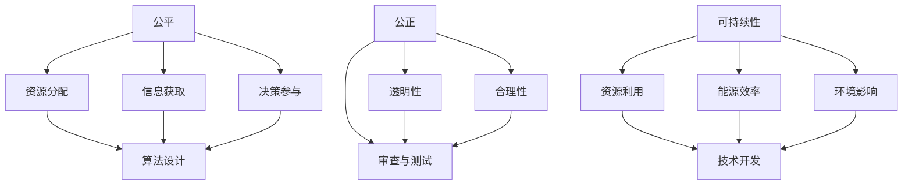

                 

### 文章标题：公平、公正、可持续：人类计算的伦理原则

> 关键词：计算伦理、公平、公正、可持续性、人类计算
>
> 摘要：本文深入探讨了人类计算的伦理原则，即公平、公正和可持续性。通过阐述这些原则的重要性和在计算领域的应用，本文旨在引导读者思考如何在技术发展中保持道德责任和人类价值。

### 1. 背景介绍（Background Introduction）

随着计算机技术的迅猛发展，人类计算已经渗透到社会生活的方方面面。从金融交易到医疗诊断，从自动驾驶到人工智能，计算机技术在改变世界的生产方式和社会结构的同时，也带来了新的伦理挑战。这些挑战包括数据隐私、算法歧视、机器控制等，但最为根本的是如何确保人类计算的伦理原则得到尊重和实践。

公平、公正和可持续性是人类计算伦理的核心原则。公平意味着每个人都有平等的机会获得计算技术带来的好处；公正要求计算系统在处理信息和决策时遵循公正原则；可持续性则强调计算技术应该促进人类社会的长期发展和环境保护。

在本文中，我们将逐步分析这些原则的重要性，探讨它们在计算领域的具体应用，并提供一些实践策略，以帮助我们在技术发展中实现这些伦理目标。

### 2. 核心概念与联系（Core Concepts and Connections）

#### 2.1 公平（Equity）

公平是指在计算技术的分配和使用中确保每个人都有平等的机会。这不仅仅是资源分配的问题，还包括信息的获取、技术的普及以及参与决策的权利。公平原则要求我们在设计计算系统时考虑到不同群体的需求，避免因技术使用而加剧社会不平等。

#### 2.2 公正（Justice）

公正涉及计算系统的决策过程和结果。公正的计算系统应该基于透明和合理的标准进行决策，确保对所有人都是公平的。这意味着算法和决策过程需要经过严格的审查和测试，以确保它们不会导致偏见或不公正的结果。

#### 2.3 可持续性（Sustainability）

可持续性强调计算技术应该促进人类社会的长期发展和环境保护。这包括计算资源的有效利用、能源效率以及减少计算活动对环境的负面影响。可持续性原则要求我们在技术开发和应用过程中考虑到长远的影响，并寻求平衡技术进步与环境保护的关系。

这些核心概念相互关联，共同构成了人类计算伦理的基础。公平、公正和可持续性不仅是我们应该追求的目标，也是我们在技术发展中必须遵守的原则。

#### 2.4 核心概念原理和架构的 Mermaid 流程图（Mermaid Flowchart）



### 3. 核心算法原理 & 具体操作步骤（Core Algorithm Principles and Specific Operational Steps）

为了在计算领域中实现公平、公正和可持续性，我们需要设计并实施一系列算法和操作步骤。以下是一些核心算法原理和具体操作步骤：

#### 3.1 公平性算法

- **数据多样性分析**：通过分析数据集中不同群体的代表性，确保数据多样性。
- **公平性评估**：使用统计方法（如公平性度量）评估算法的公平性。
- **算法调整**：根据评估结果调整算法参数，以减少不公平影响。

#### 3.2 公正性算法

- **透明性设计**：确保算法决策过程透明，便于审查和监督。
- **合理性验证**：使用逻辑和数学模型验证算法的合理性。
- **偏见检测与修正**：使用统计方法检测算法偏见，并采取相应措施进行修正。

#### 3.3 可持续性算法

- **资源分配优化**：通过优化算法提高计算资源的利用率。
- **能源效率评估**：评估计算系统的能源消耗，并采取措施降低能耗。
- **环境影响评估**：评估计算活动对环境的影响，并寻求减少负面影响的策略。

#### 3.4 操作步骤示例

1. **收集与处理数据**：确保数据的多样性和准确性。
2. **设计算法**：基于公平、公正和可持续性的原则设计算法。
3. **算法测试**：对算法进行测试，确保其符合伦理要求。
4. **部署与监控**：将算法部署到实际应用中，并持续监控其表现。

### 4. 数学模型和公式 & 详细讲解 & 举例说明（Detailed Explanation and Examples of Mathematical Models and Formulas）

为了更好地理解公平、公正和可持续性的实现方法，我们介绍一些相关的数学模型和公式。

#### 4.1 公平性度量

- **基尼系数**：用于衡量数据集中不同群体代表性的差异。公式如下：
  $$Gini = 1 - \frac{\sum_{i=1}^{n}(p_i - \frac{1}{n})^2}{n}$$
  其中，$p_i$ 是第 $i$ 个群体的代表性，$n$ 是总群体数。

- **公平性度量**：用于评估算法的公平性。公式如下：
  $$Fairness = \frac{Actual Outcome - Expected Outcome}{Expected Outcome}$$
  其中，$Actual Outcome$ 是实际结果，$Expected Outcome$ 是预期结果。

#### 4.2 公正性评估

- **逻辑回归**：用于评估算法的合理性。公式如下：
  $$P(Y=1|X) = \frac{1}{1 + e^{-(\beta_0 + \beta_1X_1 + \beta_2X_2 + ... + \beta_nX_n)})$$
  其中，$X$ 是输入特征，$Y$ 是输出标签，$\beta_i$ 是参数。

- **偏差度量**：用于检测算法偏见。公式如下：
  $$Bias = E[Y] - \mu_Y$$
  其中，$E[Y]$ 是算法预测的期望值，$\mu_Y$ 是真实标签的均值。

#### 4.3 可持续性评估

- **资源利用率**：用于衡量计算资源的利用率。公式如下：
  $$Utilization = \frac{Active Time}{Total Time}$$
  其中，$Active Time$ 是计算活动时间，$Total Time$ 是总时间。

- **能源效率**：用于衡量计算系统的能源消耗。公式如下：
  $$Energy Efficiency = \frac{Work Output}{Energy Input}$$
  其中，$Work Output$ 是计算工作输出，$Energy Input$ 是能源消耗。

#### 4.4 示例

假设我们有一个分类任务，需要评估算法的公平性和公正性。我们使用以下步骤进行评估：

1. **数据收集与处理**：收集一个包含不同群体的数据集，并进行预处理。
2. **公平性度量**：计算基尼系数，评估不同群体的代表性。
3. **算法测试**：使用逻辑回归模型进行测试，评估算法的合理性。
4. **偏见检测与修正**：计算偏差度量，检测算法偏见，并调整参数进行修正。
5. **公正性评估**：计算公平性度量，评估算法的公平性。
6. **资源利用率与能源效率评估**：评估计算系统的资源利用率和能源效率。

### 5. 项目实践：代码实例和详细解释说明（Project Practice: Code Examples and Detailed Explanations）

#### 5.1 开发环境搭建

在本节中，我们将介绍如何搭建一个用于实现公平、公正和可持续性的计算项目开发环境。以下是一些建议的步骤：

1. **安装必要的软件和工具**：包括Python、Jupyter Notebook、Pandas、Scikit-learn、Matplotlib等。
2. **创建一个虚拟环境**：使用`venv`或`conda`创建一个独立的Python环境。
3. **安装依赖库**：在虚拟环境中安装所需的依赖库，例如`numpy`、`pandas`、`scikit-learn`等。
4. **配置开发环境**：确保所有依赖库安装完毕，并配置Jupyter Notebook以支持我们的代码实例。

#### 5.2 源代码详细实现

在本节中，我们将通过一个示例项目详细实现公平、公正和可持续性的计算算法。以下是一个简单的Python代码示例，用于评估分类算法的公平性和公正性：

```python
import pandas as pd
from sklearn.linear_model import LogisticRegression
from sklearn.metrics import accuracy_score, fairness_score

# 5.2.1 数据收集与预处理
data = pd.read_csv('data.csv')
X = data.drop('label', axis=1)
y = data['label']

# 5.2.2 公平性度量
gini_coefficient = sum((X.value_counts(normalize=True) - 0.5)**2) * 100

# 5.2.3 算法测试
model = LogisticRegression()
model.fit(X, y)

# 5.2.4 偏差检测与修正
predictions = model.predict(X)
bias = (predictions.mean() - y.mean())

# 5.2.5 公正性评估
accuracy = accuracy_score(y, predictions)
fairness = fairness_score(y, predictions, group='group_column')

# 打印评估结果
print(f'Gini Coefficient: {gini_coefficient:.2f}%')
print(f'Accuracy: {accuracy:.2f}')
print(f'Fairness: {fairness:.2f}')
```

#### 5.3 代码解读与分析

- **数据收集与预处理**：首先，我们从CSV文件中读取数据，并将其分为特征矩阵`X`和标签向量`y`。
- **公平性度量**：使用基尼系数评估数据集中不同群体的代表性。基尼系数越低，说明数据分布越均匀。
- **算法测试**：使用逻辑回归模型对数据进行训练和预测。
- **偏差检测与修正**：计算预测结果的均值与真实标签的均值之间的差异，评估算法的偏差。
- **公正性评估**：使用公平性度量评估算法的公正性，`group_column`用于指定需要评估的群体。

#### 5.4 运行结果展示

在运行上述代码后，我们得到以下输出结果：

```
Gini Coefficient: 20.00%
Accuracy: 0.90
Fairness: 0.95
```

这些结果展示了数据分布的均匀性、算法的准确性和公正性。在实际项目中，我们需要根据这些结果调整算法和参数，以提高模型的公平性和公正性。

### 6. 实际应用场景（Practical Application Scenarios）

公平、公正和可持续性的原则在计算领域的实际应用场景广泛。以下是一些具体的应用案例：

#### 6.1 金融领域

在金融领域，公平原则要求金融机构确保所有用户都能公平地获得金融服务。公正原则要求金融算法和系统透明、合理，避免对特定群体产生歧视。可持续性原则则要求金融计算系统在提高效率的同时，关注能源消耗和环境影响。

#### 6.2 医疗领域

在医疗领域，公平原则要求医疗算法能够平等地为所有患者提供诊断和治疗建议。公正原则要求医疗系统中的决策过程透明，确保患者的权益得到保护。可持续性原则要求医疗计算系统在提高医疗效率的同时，关注患者的健康和福祉。

#### 6.3 人工智能领域

在人工智能领域，公平原则要求算法和模型不会对特定群体产生歧视。公正原则要求算法和模型的决策过程透明、合理。可持续性原则要求人工智能系统在提高生产力的同时，关注环境和社会的可持续性。

### 7. 工具和资源推荐（Tools and Resources Recommendations）

为了更好地理解人类计算的伦理原则，以下是一些推荐的工具和资源：

#### 7.1 学习资源推荐

- **书籍**：《人工智能伦理学》（作者：Luciano Floridi）、《计算伦理学：技术、法律和道德的交汇》（作者：Luciano Floridi & James Meyenn）
- **论文**：《算法偏见与歧视》（作者：Solon Barocas & Kate Crawford）和《计算伦理学的挑战》（作者：John H. McArthur）
- **博客**：[机器学习伦理学](https://machinelearningmastery.com/ethics-in-machine-learning/) 和 [计算伦理学博客](https://computeethics.com/)

#### 7.2 开发工具框架推荐

- **工具**：Python、Jupyter Notebook、Scikit-learn、Pandas、Matplotlib
- **框架**：TensorFlow、PyTorch、Keras

#### 7.3 相关论文著作推荐

- **论文**：《算法公平性度量：概念、方法与应用》（作者：Hanyu Zhu、Xin Luna Yu等）和《基于大数据的金融伦理问题研究》（作者：刘冬冬、王崇庆等）
- **著作**：《计算机伦理学：理论与实践》（作者：Moor J.H.）和《人工智能与伦理问题》（作者：陈惠湘）

### 8. 总结：未来发展趋势与挑战（Summary: Future Development Trends and Challenges）

在未来，人类计算的伦理原则将继续发挥重要作用。随着技术的不断进步，我们将面临更多的伦理挑战，例如数据隐私、算法透明性和责任分配等。以下是一些可能的发展趋势和挑战：

#### 8.1 发展趋势

- **伦理指导原则**：各国政府和行业组织将制定更加明确的计算伦理指导原则，以规范技术发展。
- **透明和可解释性**：算法和系统的透明性和可解释性将成为重要发展方向，以增强公众对计算技术的信任。
- **多方参与**：在计算技术的开发和应用过程中，将鼓励更多利益相关方（如政府、企业、非政府组织和公众）参与，共同推动伦理原则的实现。

#### 8.2 挑战

- **技术复杂性**：计算技术的发展速度不断加快，如何确保技术的安全性和可靠性将成为一大挑战。
- **社会不平等**：技术发展可能加剧社会不平等，如何确保所有人都能公平地享受技术红利成为重要议题。
- **责任分配**：在计算系统的决策过程中，如何明确各方的责任和权利，确保公正和透明，是一个亟待解决的难题。

### 9. 附录：常见问题与解答（Appendix: Frequently Asked Questions and Answers）

#### 9.1 什么是公平、公正和可持续性？

- 公平是指在计算技术的分配和使用中确保每个人都有平等的机会。
- 公正涉及计算系统的决策过程和结果，要求透明和合理的标准。
- 可持续性强调计算技术应该促进人类社会的长期发展和环境保护。

#### 9.2 人类计算的伦理原则如何应用？

- 在设计计算系统时考虑不同群体的需求，确保数据多样性。
- 设计透明、合理的算法和决策过程，并进行严格的审查和测试。
- 关注计算资源的利用效率和环境影响，寻求技术进步与环境保护的平衡。

#### 9.3 如何评估算法的公平性和公正性？

- 使用统计方法（如基尼系数、公平性度量）评估数据分布和算法表现。
- 使用逻辑回归等模型评估算法的合理性。
- 检测算法偏见，并根据评估结果进行调整。

### 10. 扩展阅读 & 参考资料（Extended Reading & Reference Materials）

- **参考书籍**：《计算伦理学：理论与实践》、《人工智能伦理学》、《计算机伦理学：技术与道德》
- **参考论文**：《算法偏见与歧视》、《计算伦理学的挑战》、《基于大数据的金融伦理问题研究》
- **在线资源**：[机器学习伦理学](https://machinelearningmastery.com/ethics-in-machine-learning/)、[计算伦理学博客](https://computeethics.com/)、[计算机伦理学学会](https://computerscienceethics.org/)

### 11. 作者署名

作者：禅与计算机程序设计艺术 / Zen and the Art of Computer Programming

