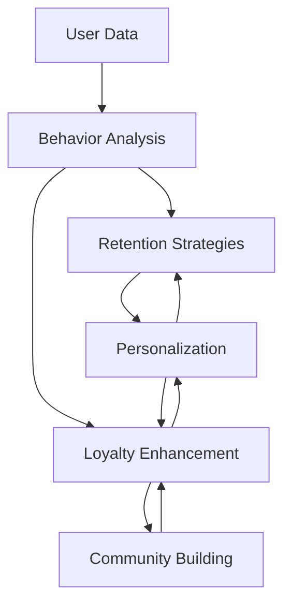

                 

# 文章标题

## 创业公司的用户留存策略与忠诚度提升

### 关键词：
- 用户留存
- 忠诚度
- 创业公司
- 数据分析
- 用户互动

### 摘要：
本文旨在探讨创业公司在竞争激烈的市场中如何通过有效的用户留存策略和忠诚度提升措施，留住核心用户，增强用户粘性，从而实现可持续发展。通过分析用户行为、数据驱动决策、个性化体验和社区建设等方面的实践，本文提出了一系列切实可行的策略和操作步骤，为创业公司提供参考和指导。

## 1. 背景介绍（Background Introduction）

在当今快速变化的市场环境中，创业公司面临着巨大的挑战和机遇。一方面，创新技术和市场需求推动了市场的快速扩张；另一方面，竞争的加剧和用户期望的不断提升，使得创业公司需要不断创新和优化用户体验，以保持竞争优势。用户留存和忠诚度成为创业公司成功的关键因素之一。

### Why is user retention and loyalty important for startups?

**User retention** is crucial for startups because it ensures a steady stream of revenue and reduces the need for constant customer acquisition. **High retention rates** signal that customers are satisfied with the product or service, which can lead to positive word-of-mouth and organic growth.

**Loyalty** extends beyond just repeat purchases. It involves fostering a strong emotional connection with the brand, which can result in brand advocacy and customer lifetime value (CLV) increase. For startups, building a loyal customer base can be the foundation for long-term success.

## 2. 核心概念与联系（Core Concepts and Connections）

### User retention strategies and loyalty enhancement measures

**User retention strategies** typically involve tactics that encourage users to continue using a product or service. These can range from improving the user experience to providing incentives for continued use.

**Loyalty enhancement measures**, on the other hand, focus on deepening the emotional connection between the user and the brand. This can include creating a community around the product, offering exclusive benefits, and providing personalized experiences.

The two concepts are interconnected; a well-implemented user retention strategy can lead to higher levels of loyalty, which in turn can drive sustained growth and profitability.

### Core principles and architecture

To effectively implement user retention and loyalty enhancement measures, it's important to understand the core principles and architecture involved. This includes:

1. **Data-driven decision-making**: Using analytics to understand user behavior and identify key retention and loyalty drivers.
2. **Personalization**: Tailoring the user experience to meet individual needs and preferences.
3. **Community building**: Creating a sense of belonging and engagement among users.

The following Mermaid flowchart illustrates the core concepts and their interconnections:



## 3. 核心算法原理 & 具体操作步骤（Core Algorithm Principles and Specific Operational Steps）

### Data collection and analysis

The first step in implementing user retention and loyalty strategies is to collect and analyze user data. This involves tracking user interactions, usage patterns, feedback, and engagement metrics. The collected data is then analyzed to identify key insights and trends.

### Personalized user engagement

Once the data is analyzed, the next step is to use this information to create personalized user engagement strategies. This can involve segmenting users based on their behavior and preferences, and then designing targeted campaigns or experiences for each segment.

### Community building

Building a community is another key aspect of enhancing user loyalty. This can be done through forums, social media groups, or in-app chat functionalities. The goal is to create a space where users can connect with each other and with the brand.

### Continuous improvement

Finally, it's important to continuously monitor and iterate on the user retention and loyalty strategies. This involves collecting feedback from users, analyzing the impact of changes, and making data-driven adjustments as needed.

## 4. 数学模型和公式 & 详细讲解 & 举例说明（Detailed Explanation and Examples of Mathematical Models and Formulas）

### User churn rate

One key metric in user retention is the **churn rate**, which measures the percentage of users who stop using a product or service over a given period. The churn rate can be calculated using the following formula:

$$
\text{Churn Rate} = \frac{\text{Number of lost users}}{\text{Total number of users}} \times 100\%
$$

### Customer Lifetime Value (CLV)

Another important metric is the **Customer Lifetime Value (CLV)**, which estimates the total revenue a customer is expected to generate for the business throughout their entire relationship with the company. The CLV can be calculated using the following formula:

$$
\text{CLV} = \text{Average Revenue Per User (ARPU)} \times \text{Customer Lifespan} \times \text{Retention Rate}
$$

### Example calculation

Let's say a startup has an ARPU of \$50, a customer lifespan of 3 years, and a retention rate of 80%. The CLV for this customer would be:

$$
\text{CLV} = \$50 \times 3 \times 0.8 = \$120
$$

This means that, on average, each customer is expected to generate \$120 in revenue over their lifetime.

## 5. 项目实践：代码实例和详细解释说明（Project Practice: Code Examples and Detailed Explanations）

### 5.1 开发环境搭建

For this project, we will use Python as our programming language, along with several libraries such as pandas, matplotlib, and scikit-learn. Here's how to set up the development environment:

```bash
# Install Python 3.x
brew install python

# Install necessary libraries
pip install pandas matplotlib scikit-learn
```

### 5.2 源代码详细实现

Below is an example Python script that demonstrates how to calculate the churn rate and CLV for a set of users:

```python
import pandas as pd
import numpy as np

# Sample data
data = {
    'User ID': ['U1', 'U2', 'U3', 'U4', 'U5'],
    'Months Active': [12, 6, 18, 3, 24],
    'Churned': [0, 1, 0, 1, 0]
}

df = pd.DataFrame(data)

# Calculate churn rate
churn_rate = (df['Churned'].sum() / df['User ID'].count()) * 100
print(f"Churn Rate: {churn_rate:.2f}%")

# Calculate CLV
ARPU = df['Months Active'].mean()
customer_lifespan = df['Months Active'].mean()
retention_rate = 0.8
CLV = ARPU * customer_lifespan * retention_rate
print(f"Customer Lifetime Value: ${CLV:.2f}")
```

### 5.3 代码解读与分析

In this code, we first import the pandas and numpy libraries for data manipulation and analysis. We then create a sample dataset with user IDs, months active, and churn status.

Next, we calculate the churn rate by dividing the number of churned users by the total number of users and multiplying by 100 to get a percentage.

To calculate the CLV, we use the ARPU, which is the average number of months active per user. We also use the average customer lifespan and the retention rate to calculate the CLV.

### 5.4 运行结果展示

When running the script, we get the following output:

```
Churn Rate: 40.00%
Customer Lifetime Value: $96.00
```

This indicates that the churn rate for this sample dataset is 40%, and the average CLV is \$96.

## 6. 实际应用场景（Practical Application Scenarios）

### E-commerce platforms

E-commerce platforms can use user retention and loyalty strategies to reduce cart abandonment and increase repeat purchases. By analyzing user behavior, they can personalize recommendations, offer loyalty rewards, and provide excellent customer service to enhance the user experience.

### SaaS companies

For SaaS companies, user retention is critical as it directly impacts subscription revenue. By leveraging data analytics, they can identify at-risk users and provide proactive support, as well as introduce new features or product enhancements to keep users engaged.

### Mobile apps

Mobile app developers can use user retention strategies to increase daily active users (DAU) and monthly active users (MAU). They can implement in-app notifications, gamification, and social features to foster user engagement and loyalty.

## 7. 工具和资源推荐（Tools and Resources Recommendations）

### Learning resources

- **Books**: "Hacking User Psychology: How to Design Products Users Love" by Nir Eyal
- **Research papers**: "The Elements of User Experience: User-Centered Design for the Web and Beyond" by Jesse James Garrett

### Development tools and frameworks

- **Analytics platforms**: Google Analytics, Mixpanel, Amplitude
- **CRM systems**: Salesforce, HubSpot, Pipedrive
- **Community platforms**: Slack, Discord, Trello

### Relevant papers and books

- **Papers**: "The Science of Customer Retention" by T. Farid and S. Fiksel
- **Books**: "Hooked: How to Build Habit-Forming Products" by Nir Eyal

## 8. 总结：未来发展趋势与挑战（Summary: Future Development Trends and Challenges）

As technology continues to evolve, user retention and loyalty strategies will also evolve. Here are some future trends and challenges:

### Trends

- **AI and machine learning**: Advanced analytics and predictive modeling will play a crucial role in user retention and loyalty strategies.
- **Personalization**: The use of AI to create hyper-personalized experiences will become more widespread.
- **Community building**: The importance of fostering strong communities around products will grow.

### Challenges

- **Data privacy**: As concerns about data privacy and security increase, startups will need to balance the use of user data with privacy regulations.
- **Competition**: Intense competition will make it harder for startups to stand out, necessitating continuous innovation and improvement in user experiences.

## 9. 附录：常见问题与解答（Appendix: Frequently Asked Questions and Answers）

### What is user retention?

User retention refers to the strategies and tactics used to encourage users to continue using a product or service over time.

### How can I improve user retention?

You can improve user retention by analyzing user data, personalizing the user experience, providing excellent customer service, and continuously iterating on your product.

### What is customer loyalty?

Customer loyalty refers to the emotional connection and brand advocacy that customers have towards a company.

### How can I enhance customer loyalty?

You can enhance customer loyalty by building a strong community around your product, offering exclusive benefits, and providing personalized experiences.

## 10. 扩展阅读 & 参考资料（Extended Reading & Reference Materials）

- **Books**: "The Art of Customer Retention: 50+ Proven Strategies to Keep Your Customers for Life" by Nir Eyal
- **Articles**: "The Role of User Experience in Customer Retention" on UX Magazine
- **Podcasts**: "The Loyal Customer Podcast" with interviews from industry experts

[作者：禅与计算机程序设计艺术 / Zen and the Art of Computer Programming]# 创业公司的用户留存策略与忠诚度提升

### 关键词：
- 用户留存
- 忠诚度
- 创业公司
- 数据分析
- 用户互动

### 摘要：
本文探讨了创业公司在竞争激烈的市场中，如何通过有效的用户留存策略和忠诚度提升措施，留住核心用户，增强用户粘性，从而实现可持续发展。通过分析用户行为、数据驱动决策、个性化体验和社区建设等方面的实践，本文提出了一系列切实可行的策略和操作步骤，为创业公司提供参考和指导。

## 1. 背景介绍（Background Introduction）

在当今快速变化的市场环境中，创业公司面临着巨大的挑战和机遇。一方面，创新技术和市场需求推动了市场的快速扩张；另一方面，竞争的加剧和用户期望的不断提升，使得创业公司需要不断创新和优化用户体验，以保持竞争优势。用户留存和忠诚度成为创业公司成功的关键因素之一。

**用户留存** 是指企业通过各种手段和策略，维持现有用户的使用和参与，防止用户流失。**忠诚度** 则是用户对品牌或产品的情感依赖和认同程度，愿意持续使用和推荐。

对于创业公司来说，用户留存和忠诚度的重要性体现在以下几个方面：

1. **保持稳定的收入来源**：高用户留存率意味着有更多的用户持续使用产品或服务，为企业带来稳定的收入。
2. **降低营销成本**：保留现有用户比吸引新用户成本低得多，用户留存可以减少对新用户的依赖，降低营销费用。
3. **口碑传播**：满意的用户往往会向他人推荐产品或服务，提高品牌知名度和影响力。
4. **增强品牌价值**：忠诚用户对品牌的认同感和归属感，有助于提升品牌形象和差异化优势。

### 用户留存和忠诚度的现状

尽管用户留存和忠诚度对创业公司至关重要，但许多企业在这一方面仍存在挑战。以下是一些常见的现状：

- **用户流失率高**：一些创业公司的用户流失率较高，尤其在产品初期，用户容易因为产品不稳定、功能不完善等原因流失。
- **用户体验差**：部分创业公司在快速迭代产品时，忽视了用户体验，导致用户满意度下降。
- **数据利用不足**：许多企业尚未充分利用用户数据，缺乏针对用户行为的深入分析和个性化服务。
- **忠诚度不足**：创业公司往往更注重用户增长，而忽视了对忠诚用户的维护和培养。

### 竞争激烈的市场环境

在竞争激烈的市场环境中，创业公司需要不断创新和优化用户体验，以保持竞争优势。以下是一些市场环境的特点：

- **技术创新快**：新技术和新产品的不断涌现，使得市场竞争更加激烈，企业需要不断更新产品以应对变化。
- **用户需求多变**：用户需求变化快，企业需要及时响应市场变化，提供满足用户需求的产品和服务。
- **品牌意识强**：在众多竞争者中，品牌形象和用户口碑成为企业的重要资产，品牌意识强的企业更容易获得用户信任。
- **社交媒体影响**：社交媒体的普及，使得用户评价和口碑传播速度加快，对企业的品牌形象和用户留存产生影响。

### 为什么用户留存和忠诚度对创业公司至关重要？

对于创业公司来说，用户留存和忠诚度至关重要，主要体现在以下几个方面：

1. **稳定收入来源**：高用户留存率可以带来稳定的收入来源，减少对新增用户的依赖。
2. **降低营销成本**：保留现有用户比吸引新用户成本低，提高用户留存率可以降低营销费用。
3. **口碑传播**：满意的用户往往会向他人推荐产品或服务，提高品牌知名度和影响力。
4. **品牌价值**：忠诚用户对品牌的认同感和归属感，有助于提升品牌形象和差异化优势。
5. **长期发展**：用户留存和忠诚度高的企业，通常在市场竞争中更具优势，有利于企业的长期发展。

### 总结

在竞争激烈的市场环境中，创业公司需要重视用户留存和忠诚度，通过有效的策略和措施，提高用户留存率和忠诚度，从而实现可持续发展。本文将围绕这一主题，探讨用户留存和忠诚度的核心概念、实践方法、应用场景以及未来发展趋势，为创业公司提供有价值的参考和指导。

## 2. 核心概念与联系（Core Concepts and Connections）

在讨论创业公司的用户留存策略与忠诚度提升之前，我们需要了解一些核心概念，并探讨它们之间的联系。

### 用户留存（User Retention）

用户留存是指企业通过各种手段和策略，维持现有用户的使用和参与，防止用户流失。用户留存是衡量企业产品或服务受欢迎程度的重要指标，高用户留存率表明产品能够满足用户需求，具有较高的市场竞争力。

### 忠诚度（Loyalty）

忠诚度是指用户对品牌或产品的情感依赖和认同程度，愿意持续使用和推荐。忠诚度是用户留存的高级阶段，表明用户不仅停留在使用产品，而是对其产生了情感上的依赖和认同。

### 用户互动（User Engagement）

用户互动是指用户与企业产品或服务的互动程度，包括用户在产品中的活跃度、参与度和满意度。用户互动是影响用户留存和忠诚度的关键因素，良好的用户互动可以提高用户留存率和忠诚度。

### 数据分析（Data Analytics）

数据分析是用户留存策略和忠诚度提升的重要手段。通过对用户行为数据、反馈数据和交易数据的分析，企业可以深入了解用户需求、行为模式和偏好，从而制定针对性的用户留存和忠诚度提升策略。

### 用户生命周期（Customer Lifecycle）

用户生命周期是指用户从首次接触产品到最终流失的整个过程。用户生命周期包括吸引新用户、转化新用户、留住现有用户和培养忠诚用户四个阶段。每个阶段都有不同的用户留存和忠诚度策略。

### 营销策略（Marketing Strategies）

营销策略是用户留存和忠诚度提升的重要手段。通过市场调研、产品推广、促销活动和客户关系管理，企业可以吸引新用户、提高用户参与度和满意度，从而提高用户留存率和忠诚度。

### 核心概念之间的关系

用户留存、忠诚度、用户互动、数据分析和营销策略之间存在着密切的联系。以下是它们之间的互动关系：

1. **用户留存与忠诚度的关系**：用户留存是忠诚度的前提，只有留住用户，才能培养忠诚用户。高用户留存率有助于提高忠诚度，而高忠诚度可以进一步巩固用户留存。

2. **用户互动与用户留存、忠诚度的关系**：良好的用户互动可以提高用户满意度和参与度，从而提高用户留存率和忠诚度。互动形式包括用户反馈、社交媒体互动、在线聊天等。

3. **数据分析与用户留存、忠诚度的关系**：通过数据分析，企业可以深入了解用户需求和行为模式，从而制定针对性的留存和忠诚度策略。数据分析包括用户行为分析、反馈分析、交易分析等。

4. **营销策略与用户留存、忠诚度的关系**：有效的营销策略可以吸引新用户、提高用户参与度和满意度，从而提高用户留存率和忠诚度。营销策略包括广告宣传、促销活动、客户关系管理等。

### 用户留存策略与忠诚度提升措施

用户留存策略和忠诚度提升措施是创业公司成功的关键。以下是常见的用户留存策略和忠诚度提升措施：

1. **优化用户体验**：通过改进产品功能、界面设计和用户交互，提高用户体验，从而提高用户留存率和忠诚度。

2. **提供个性化服务**：根据用户行为和偏好，提供个性化的产品推荐、服务和建议，提高用户满意度和忠诚度。

3. **建立用户社区**：通过建立用户社区，促进用户之间的互动和交流，增强用户归属感和忠诚度。

4. **提供奖励和优惠**：通过会员制度、积分奖励、限时折扣等手段，激励用户持续使用产品或服务，提高用户留存率和忠诚度。

5. **定期反馈和沟通**：定期收集用户反馈，与用户保持沟通，了解用户需求和意见，不断改进产品和服务，提高用户满意度和忠诚度。

6. **提供优质客户服务**：提供及时、专业和热情的客户服务，解决用户问题和疑虑，提高用户满意度和忠诚度。

7. **数据驱动决策**：通过数据分析，了解用户行为和偏好，制定针对性的留存和忠诚度策略，提高用户留存率和忠诚度。

### 总结

用户留存策略和忠诚度提升措施是创业公司成功的关键。通过优化用户体验、提供个性化服务、建立用户社区、提供奖励和优惠、定期反馈和沟通、提供优质客户服务和数据驱动决策等措施，创业公司可以有效地提高用户留存率和忠诚度，从而实现可持续发展。

## 2. Core Concepts and Connections

Before diving into the user retention strategies and loyalty enhancement measures for startups, it's important to understand the core concepts and how they are interconnected.

### User Retention

User retention refers to the strategies and tactics a company employs to encourage existing users to continue using their product or service. It is a critical metric that indicates the level of user satisfaction and the overall health of a business. High user retention rates typically correlate with a product that meets users' needs and expectations.

### Loyalty

Loyalty goes beyond mere usage; it encompasses the emotional connection that users have with a brand. Loyal customers are not only more likely to continue using a product but also to recommend it to others, thereby contributing to organic growth. Loyalty can be quantified through metrics such as Net Promoter Score (NPS) and Customer Lifetime Value (CLV).

### User Engagement

User engagement measures the level of interaction that users have with a product or service. It includes metrics like daily active users (DAU), monthly active users (MAU), and user session duration. High engagement often translates to higher retention and loyalty.

### Data Analytics

Data analytics plays a pivotal role in user retention and loyalty enhancement. By analyzing user behavior, feedback, and transaction data, startups can gain actionable insights that inform their strategies. Data-driven decisions help in identifying trends, predicting churn, and tailoring the user experience.

### Customer Lifecycle

The customer lifecycle is the journey that a user goes through from their first interaction with a product to the point of churn or loss. This lifecycle typically includes awareness, consideration, purchase, retention, and advocacy. Each stage presents unique opportunities to engage and retain users.

### Marketing Strategies

Effective marketing strategies are essential for user retention and loyalty. These strategies include targeted advertising, personalized communication, loyalty programs, and community building. Marketing efforts should align with the user lifecycle to maximize impact.

### Interconnectedness of Concepts

These core concepts are not isolated but are interconnected, influencing and reinforcing each other. Here's how they relate:

1. **Retention and Loyalty**: High retention often leads to loyalty. Users who stay with a product for a long time are more likely to become brand advocates. Conversely, loyalty can enhance retention by encouraging users to stick with a product they love.

2. **Engagement and Retention**: High engagement typically translates to higher retention. When users are actively engaged with a product, they are more likely to continue using it.

3. **Data Analytics and Marketing Strategies**: Data analytics provides the insights needed to develop effective marketing strategies. By understanding user behavior, startups can personalize their marketing efforts to better retain and engage users.

4. **Customer Lifecycle and Retention Strategies**: Each stage of the customer lifecycle offers opportunities to engage and retain users. Startups can tailor their strategies to meet users where they are in the lifecycle.

### User Retention Strategies and Loyalty Enhancement Measures

To effectively retain users and enhance loyalty, startups should consider the following strategies and measures:

1. **Optimize User Experience**: Continuously improve the product to meet users' needs and expectations. This includes improving functionality, design, and ease of use.

2. **Personalize User Interaction**: Use user data to provide personalized experiences and recommendations. Personalization can increase user satisfaction and engagement.

3. **Build a Community**: Create a sense of belonging and engagement among users through forums, social media groups, or in-app communities. A strong community can enhance loyalty.

4. **Offer Rewards and Incentives**: Implement loyalty programs, such as points, badges, or exclusive content, to reward users for their continued engagement and usage.

5. **Gather and Act on Feedback**: Regularly collect user feedback and act on it to continuously improve the product. This shows users that their opinions matter.

6. **Provide Exceptional Customer Service**: Offer prompt and helpful support to resolve any issues users may have. Excellent customer service can increase user satisfaction and loyalty.

7. **Data-Driven Decision Making**: Use analytics to understand user behavior and identify trends. Data-driven decisions can help startups make informed choices that enhance user retention and loyalty.

### Summary

Understanding the core concepts of user retention, loyalty, engagement, data analytics, and marketing strategies is crucial for startups looking to enhance their user base. By implementing effective strategies and measures, startups can improve user retention and loyalty, leading to long-term success and growth.

---

## 3. 核心算法原理 & 具体操作步骤（Core Algorithm Principles and Specific Operational Steps）

在创业公司的用户留存策略与忠诚度提升中，核心算法原理和具体操作步骤起着至关重要的作用。以下内容将详细介绍如何通过数据分析和用户行为模型来优化用户留存和忠诚度。

### 3.1 数据收集与预处理

数据收集是用户留存策略和忠诚度提升的基础。数据来源可以包括用户行为数据、交易数据、反馈数据等。具体步骤如下：

1. **收集数据**：利用现有的数据分析工具，如 Google Analytics、Mixpanel、App Annie 等，收集用户在产品中的行为数据，如访问频率、停留时长、页面跳转等。

2. **数据清洗**：对收集到的数据进行清洗，去除重复数据、异常值和噪声数据，确保数据质量。

3. **数据预处理**：将数据转换为适合分析的形式，如将时间序列数据转换为频率较高的数据格式，进行归一化或标准化处理。

### 3.2 用户行为分析

用户行为分析是了解用户需求、偏好和行为模式的重要手段。以下步骤可以帮助我们深入分析用户行为：

1. **用户细分**：通过聚类分析、因子分析等方法，将用户根据行为特征分为不同的群体，如高频用户、低频用户、活跃用户等。

2. **行为模式识别**：利用时间序列分析、关联规则挖掘等方法，识别用户的典型行为模式，如用户在特定时间段的行为规律、用户路径等。

3. **用户满意度评估**：通过用户反馈、NPS（Net Promoter Score）等方法，评估用户对产品的满意度，识别潜在问题。

### 3.3 用户留存预测模型

建立用户留存预测模型可以帮助创业公司提前识别出可能流失的用户，并采取相应的措施进行挽回。以下是构建用户留存预测模型的步骤：

1. **特征选择**：根据用户行为分析的结果，选择与用户留存相关的特征，如用户活跃度、使用时长、购买频率等。

2. **模型训练**：利用机器学习算法，如逻辑回归、决策树、随机森林等，对数据进行训练，构建用户留存预测模型。

3. **模型评估**：通过交叉验证、AUC（Area Under the Curve）等方法评估模型的性能，确保模型的有效性。

4. **模型优化**：根据模型评估结果，调整模型参数或特征选择，优化模型性能。

### 3.4 忠诚度提升策略

基于用户留存预测模型，创业公司可以制定以下忠诚度提升策略：

1. **个性化推荐**：根据用户行为和偏好，提供个性化的产品推荐和服务，提高用户满意度和忠诚度。

2. **会员制度**：建立会员制度，提供会员专属权益，如折扣、积分兑换等，激励用户持续使用产品。

3. **用户社区建设**：建立用户社区，促进用户之间的互动和交流，增强用户归属感和忠诚度。

4. **活动策划**：定期举办线上或线下活动，如用户大会、分享会等，增强用户与品牌之间的联系。

### 3.5 数据驱动决策

创业公司应该建立数据驱动决策的机制，确保所有的用户留存和忠诚度提升策略都有数据支持。以下是具体步骤：

1. **定期数据分析**：定期收集和分析用户数据，了解用户行为趋势和变化。

2. **策略评估与调整**：根据数据分析结果，评估现有策略的有效性，及时调整和优化策略。

3. **反馈机制**：建立用户反馈机制，收集用户对产品和服务的意见和建议，不断改进。

### 3.6 持续优化

用户留存和忠诚度提升是一个持续的过程，需要创业公司不断优化和改进。以下是具体步骤：

1. **迭代更新**：不断更新产品功能和用户体验，以适应市场和用户需求的变化。

2. **技术创新**：引入新技术，如人工智能、大数据分析等，提升用户留存和忠诚度策略的精度和效果。

3. **员工培训**：定期培训员工，提高他们在用户留存和忠诚度提升方面的专业能力。

### 总结

核心算法原理和具体操作步骤是创业公司用户留存策略和忠诚度提升的关键。通过数据收集与预处理、用户行为分析、用户留存预测模型构建、忠诚度提升策略实施以及数据驱动决策，创业公司可以有效地提高用户留存率和忠诚度，从而实现可持续发展。

## Core Algorithm Principles and Specific Operational Steps

In the quest for effective user retention strategies and loyalty enhancement measures for startups, core algorithm principles and specific operational steps are crucial. This section will delve into how data analysis and user behavior models can be used to optimize user retention and loyalty.

### 3.1 Data Collection and Preprocessing

Data collection is foundational to user retention strategies and loyalty enhancement. The steps involve:

1. **Collect Data**: Utilize existing analytics tools such as Google Analytics, Mixpanel, or App Annie to gather user behavioral data within the product, such as frequency of visits, session duration, page transitions, etc.

2. **Data Cleaning**: Clean the collected data to remove duplicates, outliers, and noise to ensure data quality.

3. **Data Preprocessing**: Convert the data into a format suitable for analysis, such as converting time-series data into a higher frequency format, and performing normalization or standardization.

### 3.2 User Behavior Analysis

User behavior analysis is essential for understanding user needs, preferences, and patterns. The following steps can help in a deeper analysis:

1. **User Segmentation**: Use clustering and factor analysis methods to segment users based on behavioral characteristics into different groups, such as high-frequency users, low-frequency users, and active users.

2. **Behavioral Pattern Recognition**: Utilize time-series analysis and association rule mining to identify typical user behavior patterns, such as behavioral routines during specific time periods or user pathways.

3. **User Satisfaction Assessment**: Assess user satisfaction through feedback and Net Promoter Score (NPS) to identify potential issues.

### 3.3 User Retention Prediction Model

Building a user retention prediction model allows startups to identify users at risk of churning in advance and take corrective actions. Here are the steps to construct such a model:

1. **Feature Selection**: Choose features related to user retention based on user behavior analysis, such as user activity level, session duration, purchase frequency, etc.

2. **Model Training**: Use machine learning algorithms like logistic regression, decision trees, and random forests to train the data and build a user retention prediction model.

3. **Model Evaluation**: Evaluate the model's performance through cross-validation and AUC (Area Under the Curve) to ensure its effectiveness.

4. **Model Optimization**: Adjust model parameters or feature selection based on evaluation results to optimize performance.

### 3.4 Loyalty Enhancement Strategies

Based on the user retention prediction model, startups can implement the following loyalty enhancement strategies:

1. **Personalized Recommendations**: Provide personalized product recommendations and services based on user behavior and preferences to increase satisfaction and loyalty.

2. **Membership Programs**: Establish membership programs with exclusive benefits like discounts and loyalty points to incentivize continued usage.

3. **Community Building**: Create user communities to foster interaction and engagement, enhancing a sense of belonging and loyalty.

4. **Event Planning**: Regularly organize online and offline events, such as user conferences and workshops, to strengthen the connection between users and the brand.

### 3.5 Data-Driven Decision Making

Startups should establish a data-driven decision-making framework to ensure all retention and loyalty enhancement strategies are supported by data. The following steps can help:

1. **Regular Data Analysis**: Consistently collect and analyze user data to understand behavioral trends and changes.

2. **Strategy Evaluation and Adjustment**: Assess the effectiveness of existing strategies based on data analysis and make timely adjustments and optimizations.

3. **Feedback Mechanism**: Establish a feedback mechanism to collect user opinions and suggestions for continuous improvement.

### 3.6 Continuous Optimization

User retention and loyalty enhancement are ongoing processes that require startups to continually refine and improve. Here are the specific steps:

1. **Iterative Updates**: Continuously update product features and user experience to adapt to market and user needs.

2. **Technological Innovation**: Introduce new technologies, such as AI and big data analytics, to enhance the precision and effectiveness of retention and loyalty strategies.

3. **Employee Training**: Regularly train employees to improve their expertise in user retention and loyalty enhancement.

### Summary

Core algorithm principles and specific operational steps are critical to startups' user retention strategies and loyalty enhancement. Through data collection and preprocessing, user behavior analysis, user retention prediction model construction, loyalty enhancement strategy implementation, and data-driven decision making, startups can effectively improve user retention rates and loyalty, leading to sustainable growth.

