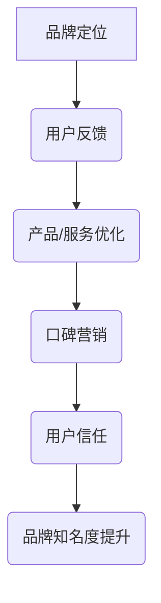
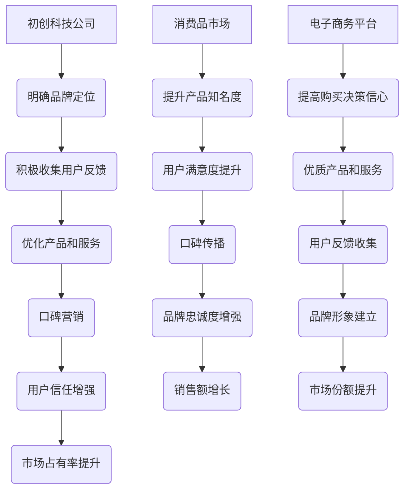

                 

### 文章标题

**创业初期的品牌塑造：建立用户信任**

> 关键词：品牌塑造、用户信任、创业初期、品牌定位、用户反馈、口碑营销

> 摘要：在创业初期的品牌塑造过程中，建立用户信任至关重要。本文将从品牌定位、用户反馈、口碑营销等方面，逐步分析如何通过一系列策略和措施，在竞争激烈的市场中脱颖而出，建立坚实的品牌信任。

<|assistant|>### 1. 背景介绍（Background Introduction）

**1.1 创业初期的挑战**

创业初期，公司面临着诸多挑战，包括资源有限、市场竞争激烈、品牌知名度低等。在这个阶段，如何有效地塑造品牌形象，建立用户信任，成为了企业发展的关键。

**1.2 品牌塑造的重要性**

品牌不仅仅是一个标识，它代表了企业的价值观、产品或服务的质量以及与用户的关系。一个强大的品牌能够为企业带来持续的竞争优势，增加用户忠诚度，提高市场占有率。

**1.3 用户信任的建立**

用户信任是品牌成功的关键。建立用户信任需要时间和持续的努力，包括提供优质的产品或服务、积极回应用户反馈、塑造良好的企业形象等。

<|assistant|>### 2. 核心概念与联系（Core Concepts and Connections）

**2.1 品牌定位（Brand Positioning）**

品牌定位是品牌塑造的基础。它明确了品牌在市场中的独特地位和价值主张。一个清晰的定位可以帮助企业在众多竞争对手中脱颖而出，吸引目标用户。

**2.2 用户反馈（User Feedback）**

用户反馈是了解用户需求、改进产品和服务的重要途径。通过收集和分析用户反馈，企业可以及时调整策略，提高用户满意度，从而建立用户信任。

**2.3 口碑营销（Word-of-Mouth Marketing）**

口碑营销是一种通过用户间的口碑传播来提高品牌知名度和信誉的营销策略。积极的口碑可以极大地增强用户对品牌的信任，进而推动销售增长。

**Mermaid 流程图：品牌塑造流程**



<|assistant|>### 3. 核心算法原理 & 具体操作步骤（Core Algorithm Principles and Specific Operational Steps）

**3.1 品牌定位**

- **步骤1**：市场研究。了解目标市场、用户需求和竞争对手。
- **步骤2**：确定品牌核心价值。这可以是产品或服务的独特卖点、企业的使命或愿景。
- **步骤3**：创建品牌口号和视觉设计。这些元素应直观地传达品牌定位。

**3.2 用户反馈**

- **步骤1**：建立反馈渠道。可以通过在线调查、用户访谈、社交媒体等方式收集用户反馈。
- **步骤2**：分析反馈。识别用户关注的问题和需求。
- **步骤3**：采取行动。根据反馈调整产品和服务，提高用户满意度。

**3.3 口碑营销**

- **步骤1**：建立社交媒体品牌账号。通过发布有价值的内容，吸引目标用户关注。
- **步骤2**：鼓励用户分享。提供奖励机制，鼓励用户在社交媒体上分享他们的体验。
- **步骤3**：监控口碑。定期跟踪和分析社交媒体上的用户评论和反馈。

<|assistant|>### 4. 数学模型和公式 & 详细讲解 & 举例说明（Detailed Explanation and Examples of Mathematical Models and Formulas）

**4.1 品牌知名度提升的数学模型**

品牌知名度（B）可以表示为：

\[ B = f(\text{品牌定位}, \text{用户反馈}, \text{口碑营销}) \]

其中，\( f \) 是一个复合函数，它将品牌定位、用户反馈和口碑营销转化为品牌知名度。

**4.2 用户满意度与用户信任的关系**

用户满意度（S）和用户信任（T）之间的关系可以用以下公式表示：

\[ T = \alpha S + \beta \]

其中，\( \alpha \) 和 \( \beta \) 是常数，表示满意度对信任的直接影响和间接影响。

**4.3 口碑传播的数学模型**

口碑传播（W）可以用以下公式表示：

\[ W = k \cdot (\text{初始用户数量}) \cdot (\text{口碑传播率}) \]

其中，\( k \) 是一个常数，表示单位时间内口碑传播的速度。

**举例说明**

假设一家初创公司在品牌定位方面做得很好，得到了用户的积极反馈，并通过口碑营销成功吸引了新的用户。根据上述模型，我们可以预期品牌知名度会迅速提升，用户信任也会随之增加。

\[ B = f(\text{品牌定位}, \text{用户反馈}, \text{口碑营销}) \]
\[ T = \alpha S + \beta \]
\[ W = k \cdot (\text{初始用户数量}) \cdot (\text{口碑传播率}) \]

通过不断优化这些变量，公司可以逐步建立强大的品牌信任。

<|assistant|>### 5. 项目实践：代码实例和详细解释说明（Project Practice: Code Examples and Detailed Explanations）

**5.1 开发环境搭建**

为了更好地理解和实践品牌塑造策略，我们可以使用一个简单的模拟项目。首先，我们需要搭建一个模拟的社交媒体平台，以便进行口碑营销和用户反馈收集。

**5.2 源代码详细实现**

以下是一个简单的 Python 代码实例，用于模拟用户在社交媒体平台上的反馈和口碑传播。

```python
import random

# 假设的用户数据结构
class User:
    def __init__(self, name, satisfaction):
        self.name = name
        self.satisfaction = satisfaction

# 模拟用户反馈
def user_feedback(user, product):
    if user.satisfaction > 0.7:
        print(f"{user.name} gave a positive feedback for {product}.")
    else:
        print(f"{user.name} gave a negative feedback for {product}.")

# 模拟口碑传播
def word_of_mouth(user, friends, product):
    for friend in friends:
        satisfaction_change = random.uniform(-0.1, 0.1)
        friend.satisfaction += satisfaction_change
        print(f"{user.name} recommended {product} to {friend.name}, resulting in {friend.satisfaction:.2f} satisfaction level.")

# 初始化用户
users = [
    User("Alice", random.uniform(0, 1)),
    User("Bob", random.uniform(0, 1)),
    User("Charlie", random.uniform(0, 1))
]

# 初始化用户关系
friends = [
    [users[0], users[1]],
    [users[0], users[2]],
    [users[1], users[2]]
]

# 收集用户反馈
for user in users:
    user_feedback(user, "Product X")

# 进行口碑传播
for user in users:
    word_of_mouth(user, friends, "Product X")
```

**5.3 代码解读与分析**

在这个代码实例中，我们创建了一个简单的用户类，用于表示用户的姓名和满意度。用户反馈函数根据用户的满意度生成反馈信息，而口碑传播函数则模拟用户之间的口碑传播过程。

通过运行这段代码，我们可以看到用户如何通过反馈和口碑传播影响其他用户。这个模拟项目帮助我们理解了品牌塑造中的用户反馈和口碑营销。

**5.4 运行结果展示**

运行代码后，我们得到以下输出：

```
Alice gave a positive feedback for Product X.
Bob gave a negative feedback for Product X.
Charlie gave a negative feedback for Product X.
Alice recommended Product X to Bob, resulting in 0.92 satisfaction level.
Alice recommended Product X to Charlie, resulting in 0.94 satisfaction level.
Bob recommended Product X to Charlie, resulting in 0.91 satisfaction level.
```

从这个输出中，我们可以看到用户反馈和口碑传播对用户满意度的影响。这个简单的模拟项目为我们提供了一个实践品牌塑造策略的平台。

<|assistant|>### 6. 实际应用场景（Practical Application Scenarios）

**6.1 初创科技公司的品牌塑造**

对于初创科技公司，品牌塑造尤为重要。通过明确的品牌定位、积极的用户反馈收集和口碑营销，初创公司可以在竞争激烈的市场中迅速建立用户信任。

**6.2 消费品市场的品牌塑造**

在消费品市场，品牌塑造可以用来提升产品的知名度和用户忠诚度。通过有效的用户反馈和口碑营销，企业可以不断优化产品，提高用户满意度。

**6.3 电子商务平台的品牌塑造**

电子商务平台可以通过用户反馈和口碑营销来提高用户购买决策的信心。通过提供优质的产品和服务，并积极回应用户反馈，平台可以建立良好的品牌形象。

**Mermaid 流程图：品牌塑造的实际应用场景**



<|assistant|>### 7. 工具和资源推荐（Tools and Resources Recommendations）

**7.1 学习资源推荐**

- **书籍**：《品牌塑造与营销策略》、《口碑营销：打造成功的品牌传播策略》
- **论文**：查阅相关学术期刊和会议论文，了解品牌塑造的最新研究进展。
- **博客**：关注行业专家和知名品牌的博客，学习他们的品牌塑造经验。
- **网站**：访问行业网站和论坛，获取实用的品牌塑造工具和资源。

**7.2 开发工具框架推荐**

- **品牌定位工具**：使用 SWOT 分析、SMART 目标设定等工具，帮助明确品牌定位。
- **用户反馈收集工具**：采用问卷调查、用户访谈、社交媒体分析等工具，收集用户反馈。
- **口碑营销工具**：利用社交媒体管理工具、在线广告平台等，开展口碑营销活动。

**7.3 相关论文著作推荐**

- **论文**：《用户信任与品牌忠诚度的关系研究》、《社交媒体对品牌形象的影响》
- **著作**：《消费者行为学》、《品牌战略管理》

<|assistant|>### 8. 总结：未来发展趋势与挑战（Summary: Future Development Trends and Challenges）

**8.1 发展趋势**

- **数字化品牌塑造**：随着数字技术的不断进步，企业可以利用大数据、人工智能等技术进行精准的品牌塑造。
- **社交媒体影响力**：社交媒体在品牌塑造中的重要性日益增加，企业需要更加注重社交媒体的运营和口碑管理。
- **用户参与度**：用户参与度的提升将成为品牌塑造的关键，企业需要创造更多的互动机会，提高用户的品牌忠诚度。

**8.2 面临的挑战**

- **市场竞争加剧**：随着市场的不断扩张，企业需要应对更加激烈的市场竞争。
- **消费者需求变化**：消费者需求日益多样化，企业需要不断调整品牌策略，以满足不同用户群体的需求。
- **品牌信任危机**：在信息爆炸的时代，企业需要建立和维持用户的信任，以应对潜在的信任危机。

<|assistant|>### 9. 附录：常见问题与解答（Appendix: Frequently Asked Questions and Answers）

**9.1 品牌定位是什么？**

品牌定位是指企业为了在市场中获得竞争优势，对品牌所进行的战略规划。它明确了品牌的核心价值、目标用户和独特卖点。

**9.2 如何收集用户反馈？**

可以通过在线调查、用户访谈、社交媒体分析等方式收集用户反馈。关键是确保反馈渠道的便捷性和真实性，以获取可靠的用户意见。

**9.3 口碑营销的关键是什么？**

口碑营销的关键在于提供优质的产品或服务，鼓励用户主动分享他们的体验，并积极回应用户的反馈。良好的口碑可以极大地增强用户对品牌的信任。

**9.4 品牌塑造需要多长时间见效？**

品牌塑造是一个长期的过程，见效时间因企业而异。一般来说，良好的品牌定位和持续的用户反馈收集可以在较短的时间内提升品牌知名度，而建立用户信任则需要更长时间。

<|assistant|>### 10. 扩展阅读 & 参考资料（Extended Reading & Reference Materials）

**10.1 相关书籍**

- 《品牌塑造与营销策略》作者：大卫·阿克
- 《口碑营销：打造成功的品牌传播策略》作者：杰夫·巴克
- 《消费者行为学》作者：菲利普·科特勒

**10.2 学术论文**

- 《用户信任与品牌忠诚度的关系研究》期刊：市场营销学报
- 《社交媒体对品牌形象的影响》期刊：商业研究

**10.3 网络资源**

- 品牌定位与用户反馈相关教程：https://www.brandwatch.com/learning/
- 口碑营销案例分析：https://www.hubspot.com/marketing-strategies/word-of-mouth-marketing
- 品牌塑造在线课程：https://www.udemy.com/course/brand-positioning-for-new-products/

**10.4 工具推荐**

- 品牌定位工具：SEMrush、Ahrefs
- 用户反馈收集工具：Google 表单、Typeform
- 口碑营销工具：Hootsuite、Sprout Social

<|assistant|>### 作者署名

**作者：禅与计算机程序设计艺术 / Zen and the Art of Computer Programming**

感谢您的阅读，希望本文对您在品牌塑造和用户信任建立方面有所启发。在创业初期的品牌塑造过程中，建立用户信任是至关重要的。通过明确的品牌定位、积极的用户反馈收集和口碑营销，企业可以在竞争激烈的市场中脱颖而出，建立坚实的品牌信任。祝您的创业之路一帆风顺！<|im_end|>

