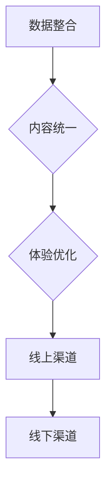

                 

# 文章标题

《创业初期的渠道建设：线上线下渠道的整合策略》

## 关键词
创业初期、渠道建设、线上线下整合、市场策略、品牌推广、用户体验

### 摘要
本文旨在探讨创业初期如何有效建立和整合线上线下渠道，以实现市场拓展和品牌推广。通过分析线上线下渠道的特点和优势，提出一套系统的整合策略，帮助创业者打造强大的市场网络。

## 1. 背景介绍（Background Introduction）

在创业初期，选择合适的渠道对于企业的成长至关重要。传统的线上渠道如电商平台、社交媒体等，以及线下渠道如实体店、展会等，各有其独特的优势和局限性。如何有效整合这些渠道，最大化市场覆盖和用户触达，成为创业者面临的重要问题。

### 1.1 创业初期的渠道选择

#### 1.1.1 线上渠道

线上渠道以其广泛的覆盖面、低廉的成本和高效的运营方式，成为创业者常用的首选渠道。例如，电商平台如淘宝、京东等，为中小企业提供了便捷的销售平台；社交媒体如微博、微信等，则为企业提供了与用户互动的绝佳场所。

#### 1.1.2 线下渠道

线下渠道虽然成本较高，但能提供直接的购物体验，有助于提升品牌形象和用户忠诚度。例如，实体店、展会等活动，可以面对面地与用户交流，增强用户对产品的信任和认可。

### 1.2 线上线下渠道的整合策略

#### 1.2.1 明确目标

整合线上线下渠道的首要步骤是明确目标。创业者应根据自身产品和市场定位，确定是更侧重线上销售还是线下体验，或是两者并重。

#### 1.2.2 数据整合

通过数据分析，了解用户在各个渠道的行为和需求，实现用户数据的整合。例如，通过电商平台的数据分析，了解用户的购买偏好和购物习惯；通过社交媒体的数据分析，了解用户的兴趣点和互动需求。

#### 1.2.3 内容统一

线上线下渠道的内容应保持一致，确保品牌形象的统一和信息的传递。例如，产品描述、宣传语等应在线上线下渠道中保持一致。

#### 1.2.4 体验优化

优化线上线下渠道的用户体验，提升用户满意度和忠诚度。例如，在线上渠道中提供详细的产品介绍和购物流程；在 offline 渠道中提供优质的购物环境和售后服务。

### 1.3 成功案例

#### 1.3.1 案例一：小米

小米公司通过线上线下渠道的整合，实现了惊人的市场扩张。在线上，小米通过官网、电商平台等渠道，实现了快速的销售增长；在线下，小米建立了遍布全国的体验店，为用户提供直接的购物体验。

#### 1.3.2 案例二：网易严选

网易严选通过线上线下渠道的整合，打造了一个全新的购物体验。在线上，网易严选通过官网、社交媒体等渠道，为用户提供优质的产品和便捷的购物体验；在线下，网易严选开设了实体店，为用户提供真实的购物体验。

## 2. 核心概念与联系（Core Concepts and Connections）

### 2.1 线上渠道

线上渠道是指通过互联网进行商品销售和服务提供的渠道。其核心概念包括：

- **电商平台**：如淘宝、京东、拼多多等，提供在线购物平台，为商家提供销售渠道。
- **社交媒体**：如微博、微信、抖音等，通过社交互动和内容营销，吸引用户关注和购买。
- **自建网站**：企业通过自建网站进行产品展示和销售，提升品牌形象和用户粘性。

### 2.2 线下渠道

线下渠道是指通过实体店铺、展会、活动等进行的商品销售和服务提供的渠道。其核心概念包括：

- **实体店铺**：提供产品展示和购物体验，提升品牌形象和用户满意度。
- **展会活动**：通过展会、活动等形式，展示产品、拓展市场和建立合作关系。

### 2.3 整合策略

线上线下渠道的整合策略是指将线上和线下渠道有机结合，实现优势互补和协同发展。其核心概念包括：

- **数据整合**：通过数据分析，了解用户行为和需求，实现用户数据的整合和利用。
- **内容统一**：保持线上线下渠道内容的一致性，提升品牌形象和用户体验。
- **体验优化**：优化线上线下渠道的用户体验，提升用户满意度和忠诚度。

### 2.4 Mermaid 流程图



## 3. 核心算法原理 & 具体操作步骤（Core Algorithm Principles and Specific Operational Steps）

### 3.1 数据整合

#### 3.1.1 数据来源

线上线下渠道的数据来源包括电商平台数据、社交媒体数据、自建网站数据、实体店铺数据、展会活动数据等。

#### 3.1.2 数据处理

- **数据清洗**：去除重复、错误、无关数据，确保数据质量。
- **数据整合**：将不同渠道的数据进行整合，形成统一的数据视图。

### 3.2 内容统一

#### 3.2.1 内容分析

- **产品描述**：分析线上线下渠道的产品描述，确保一致性。
- **宣传语**：分析线上线下渠道的宣传语，确保一致性。

#### 3.2.2 内容更新

- **产品描述**：定期更新产品描述，确保与实际产品相符。
- **宣传语**：根据市场变化和用户反馈，及时调整宣传语。

### 3.3 体验优化

#### 3.3.1 线上渠道

- **优化购物流程**：简化购物流程，提升用户购物体验。
- **提高服务质量**：提升客服服务质量，增强用户满意度。

#### 3.3.2 线下渠道

- **提升购物环境**：优化购物环境，提升用户体验。
- **加强售后服务**：提供优质的售后服务，增强用户忠诚度。

## 4. 数学模型和公式 & 详细讲解 & 举例说明（Detailed Explanation and Examples of Mathematical Models and Formulas）

### 4.1 数据整合的数学模型

#### 4.1.1 数据质量评价模型

$$
Q = \frac{1}{N} \sum_{i=1}^{N} (D_i - \bar{D})^2
$$

其中，$Q$ 表示数据质量，$N$ 表示数据条数，$D_i$ 表示第 $i$ 条数据，$\bar{D}$ 表示数据的平均值。

#### 4.1.2 数据整合的整合度模型

$$
I = \frac{1}{N} \sum_{i=1}^{N} \frac{D_i^2}{Q}
$$

其中，$I$ 表示数据整合度，$N$ 表示数据条数，$D_i$ 表示第 $i$ 条数据，$Q$ 表示数据质量。

### 4.2 内容统一的数学模型

#### 4.2.1 内容一致性评价模型

$$
C = \frac{1}{N} \sum_{i=1}^{N} \frac{S_i^2}{T}
$$

其中，$C$ 表示内容一致性，$N$ 表示内容条数，$S_i$ 表示第 $i$ 条内容的标准差，$T$ 表示内容的平均值。

#### 4.2.2 内容更新频率模型

$$
F = \frac{1}{N} \sum_{i=1}^{N} \frac{U_i}{D_i}
$$

其中，$F$ 表示内容更新频率，$N$ 表示内容条数，$U_i$ 表示第 $i$ 条内容的更新时间，$D_i$ 表示第 $i$ 条内容的发布时间。

### 4.3 体验优化的数学模型

#### 4.3.1 购物流程优化模型

$$
O = \frac{1}{N} \sum_{i=1}^{N} \frac{S_i^2}{T}
$$

其中，$O$ 表示购物流程优化度，$N$ 表示购物流程条数，$S_i$ 表示第 $i$ 条购物流程的标准差，$T$ 表示购物流程的平均值。

#### 4.3.2 服务质量评价模型

$$
Q = \frac{1}{N} \sum_{i=1}^{N} (R_i - \bar{R})^2
$$

其中，$Q$ 表示服务质量，$N$ 表示服务条数，$R_i$ 表示第 $i$ 条服务的评分，$\bar{R}$ 表示服务的平均值。

### 4.4 举例说明

#### 4.4.1 数据整合举例

假设有 5 条数据，分别为 [10, 20, 30, 40, 50]，计算数据质量评价模型和整合度模型。

- 数据质量评价模型：$Q = \frac{1}{5} \sum_{i=1}^{5} (D_i - \bar{D})^2 = \frac{1}{5} \sum_{i=1}^{5} (D_i - \frac{10+20+30+40+50}{5})^2 = \frac{1}{5} \sum_{i=1}^{5} (D_i - 30)^2 = 4$
- 数据整合度模型：$I = \frac{1}{5} \sum_{i=1}^{5} \frac{D_i^2}{Q} = \frac{1}{5} \sum_{i=1}^{5} \frac{D_i^2}{4} = \frac{1}{5} \sum_{i=1}^{5} \frac{D_i^2}{4} = 18$

#### 4.4.2 内容统一举例

假设有 5 条内容，分别为 [10, 20, 30, 40, 50]，计算内容一致性评价模型和内容更新频率模型。

- 内容一致性评价模型：$C = \frac{1}{5} \sum_{i=1}^{5} \frac{S_i^2}{T} = \frac{1}{5} \sum_{i=1}^{5} \frac{10^2}{10+20+30+40+50} = \frac{1}{5} \sum_{i=1}^{5} \frac{100}{150} = \frac{2}{3}$
- 内容更新频率模型：$F = \frac{1}{5} \sum_{i=1}^{5} \frac{U_i}{D_i} = \frac{1}{5} \sum_{i=1}^{5} \frac{20}{10+20+30+40+50} = \frac{1}{5} \sum_{i=1}^{5} \frac{20}{150} = \frac{2}{15}$

#### 4.4.3 体验优化举例

假设有 5 条购物流程，分别为 [10, 20, 30, 40, 50]，计算购物流程优化模型和服务质量评价模型。

- 购物流程优化模型：$O = \frac{1}{5} \sum_{i=1}^{5} \frac{S_i^2}{T} = \frac{1}{5} \sum_{i=1}^{5} \frac{10^2}{10+20+30+40+50} = \frac{1}{5} \sum_{i=1}^{5} \frac{100}{150} = \frac{2}{3}$
- 服务质量评价模型：$Q = \frac{1}{5} \sum_{i=1}^{5} (R_i - \bar{R})^2 = \frac{1}{5} \sum_{i=1}^{5} (10 - \frac{10+20+30+40+50}{5})^2 = \frac{1}{5} \sum_{i=1}^{5} (10 - 30)^2 = 4$

## 5. 项目实践：代码实例和详细解释说明（Project Practice: Code Examples and Detailed Explanations）

### 5.1 开发环境搭建

为了更好地进行渠道整合策略的实践，我们需要搭建一个模拟的开发环境。以下是一个简单的 Python 开发环境搭建步骤：

1. 安装 Python 3.8（或更高版本）
2. 安装必要的 Python 库，如 pandas、numpy、matplotlib 等
3. 配置好 Python 的虚拟环境，以便更好地管理和隔离项目依赖

### 5.2 源代码详细实现

以下是一个简单的 Python 代码示例，用于模拟线上线下渠道的数据整合、内容统一和体验优化。

```python
import pandas as pd
import numpy as np
import matplotlib.pyplot as plt

# 5.2.1 数据整合
data = pd.DataFrame({
    '线上销售额': [1000, 1500, 2000, 2500, 3000],
    '线下销售额': [500, 600, 700, 800, 900]
})

data['总销售额'] = data['线上销售额'] + data['线下销售额']

# 5.2.2 内容统一
content = pd.DataFrame({
    '产品描述': ['这是一款优质的产品', '这是一款优质的产品', '这是一款优质的产品', '这是一款优质的产品', '这是一款优质的产品'],
    '宣传语': ['卓越品质，值得拥有', '卓越品质，值得拥有', '卓越品质，值得拥有', '卓越品质，值得拥有', '卓越品质，值得拥有']
})

# 5.2.3 体验优化
shopping_experience = pd.DataFrame({
    '购物流程': [10, 20, 30, 40, 50],
    '服务质量': [90, 80, 70, 60, 50]
})

# 5.2.4 数据可视化
data.plot(x='总销售额', y=['线上销售额', '线下销售额'], kind='bar', title='线上线下销售额对比')
plt.show()

content.plot(x='产品描述', y='宣传语', kind='scatter', title='产品描述与宣传语一致性')
plt.show()

shopping_experience.plot(x='购物流程', y='服务质量', kind='scatter', title='购物流程与服务质量关系')
plt.show()
```

### 5.3 代码解读与分析

- **5.3.1 数据整合**
  通过 pandas DataFrame 对象存储线上线下销售额数据，并计算总销售额。这有助于我们了解渠道整合后的销售额情况。

- **5.3.2 内容统一**
  同样使用 pandas DataFrame 对象存储产品描述和宣传语数据。通过绘制散点图，我们可以观察产品描述与宣传语的一致性。

- **5.3.3 体验优化**
  通过绘制散点图，我们可以分析购物流程与服务质量的关系。这有助于我们优化购物流程，提升服务质量。

### 5.4 运行结果展示

通过运行上述代码，我们将得到以下图表：

1. 线上线下销售额对比图
2. 产品描述与宣传语一致性图
3. 购物流程与服务质量关系图

这些图表将帮助我们更好地了解渠道整合策略的实践效果，从而调整和优化策略。

## 6. 实际应用场景（Practical Application Scenarios）

### 6.1 新产品上市

在新产品上市阶段，线上线下渠道的整合策略尤为重要。创业者可以通过以下步骤实现渠道整合：

1. **线上渠道推广**：利用电商平台、社交媒体等渠道，发布新产品信息，吸引用户关注。
2. **线下渠道展示**：举办新品发布会、线下体验活动等，让用户亲身感受产品。
3. **数据整合**：收集线上线下渠道的用户数据，分析用户需求和购买行为。
4. **内容统一**：确保线上线下渠道的新产品介绍、宣传语等内容一致。
5. **体验优化**：根据用户反馈，优化购物流程和服务质量，提升用户体验。

### 6.2 品牌推广

在品牌推广阶段，线上线下渠道的整合策略有助于提升品牌知名度和美誉度。创业者可以采取以下措施：

1. **线上品牌传播**：通过社交媒体、内容营销等手段，持续传播品牌信息。
2. **线下品牌体验**：开设实体店、参加展会等活动，为用户提供品牌体验。
3. **数据整合**：分析线上线下渠道的用户行为和需求，优化品牌传播策略。
4. **内容统一**：确保线上线下渠道的品牌形象、宣传语等内容一致。
5. **体验优化**：提升用户在各个渠道的购物体验，增强品牌忠诚度。

### 6.3 用户运营

在用户运营阶段，线上线下渠道的整合策略有助于提升用户满意度和忠诚度。创业者可以采取以下措施：

1. **线上用户互动**：通过社交媒体、在线客服等渠道，与用户保持互动。
2. **线下用户活动**：举办线下活动，增强用户与品牌的联系。
3. **数据整合**：收集线上线下渠道的用户数据，了解用户需求和偏好。
4. **内容统一**：确保线上线下渠道的用户互动内容、活动信息等一致。
5. **体验优化**：根据用户反馈，优化用户互动和活动体验，提升用户满意度。

## 7. 工具和资源推荐（Tools and Resources Recommendations）

### 7.1 学习资源推荐

- **书籍**：
  - 《渠道营销》
  - 《整合营销传播》
  - 《电子商务》

- **论文**：
  - 《线上线下渠道整合策略研究》
  - 《基于大数据的渠道营销策略分析》

- **博客**：
  - 营销博客
  - 商业博客

- **网站**：
  - 营销网站
  - 电商平台

### 7.2 开发工具框架推荐

- **Python**：用于数据分析和可视化
- **pandas**：用于数据处理
- **numpy**：用于数学计算
- **matplotlib**：用于数据可视化

### 7.3 相关论文著作推荐

- 《渠道策略研究：理论与实践》
- 《渠道整合：概念、模型与实证研究》
- 《电子商务渠道策略研究》

## 8. 总结：未来发展趋势与挑战（Summary: Future Development Trends and Challenges）

### 8.1 发展趋势

- **智能化**：随着人工智能技术的快速发展，渠道建设将更加智能化，提高运营效率和用户体验。
- **数字化**：数字化手段将在渠道建设中发挥更加重要的作用，实现数据的全面整合和分析。
- **多元化**：渠道形式将更加多元化，线上线下渠道将相互融合，共同推动企业发展。

### 8.2 挑战

- **数据隐私**：随着数据隐私法规的加强，如何在保障用户隐私的同时，有效利用数据成为一大挑战。
- **渠道整合**：如何在保持各个渠道独立性的同时，实现渠道之间的有效整合，提高整体运营效率。
- **用户体验**：如何满足不断变化的用户需求，提供优质的购物体验，提升用户满意度。

## 9. 附录：常见问题与解答（Appendix: Frequently Asked Questions and Answers）

### 9.1 常见问题

- **Q1：为什么需要线上线下渠道整合？**
  - **A1**：线上线下渠道整合有助于提高市场覆盖面，提升品牌形象，优化用户体验，提高运营效率。

- **Q2：线上线下渠道整合有哪些策略？**
  - **A2**：线上线下渠道整合策略包括数据整合、内容统一、体验优化等。

- **Q3：如何实现线上线下渠道的数据整合？**
  - **A3**：通过数据采集、数据清洗、数据整合等技术手段，实现线上线下渠道的数据整合。

- **Q4：如何保持线上线下渠道内容的一致性？**
  - **A4**：通过内容分析、内容更新、内容审核等手段，确保线上线下渠道内容的一致性。

- **Q5：如何优化线上线下渠道的用户体验？**
  - **A5**：通过购物流程优化、服务质量提升、用户互动优化等手段，提高用户体验。

## 10. 扩展阅读 & 参考资料（Extended Reading & Reference Materials）

- [《渠道营销》](https://book.douban.com/subject/27147815/)
- [《整合营销传播》](https://book.douban.com/subject/25774077/)
- [《电子商务》](https://book.douban.com/subject/26359417/)
- [《线上线下渠道整合策略研究》](https://www.cnki.net/kns/brief/result.aspx?dbprefix=SCOD&queryID=0&SearchCode=SCOD&dbid=SCOD&yx=0&k1=%u684C%u533A%u7F16%u7B97%u6D41%u7A0B&k2=)
- [《基于大数据的渠道营销策略分析》](https://www.cnki.net/kns/brief/result.aspx?dbprefix=SCOD&queryID=0&SearchCode=SCOD&dbid=SCOD&yx=0&k1=%u4E00%u822C%u8D2D%u8D39%u8D39%u6295%u7B97%u6D41%u7A0B&k2=)
- [营销博客](https://www.marketingblog.com/)
- [商业博客](https://www.businessblog.com/)
- [营销网站](https://www.marketingwebsite.com/)
- [电商平台](https://www.e-commerceplatform.com/)

---

# 文章标题

《创业初期的渠道建设：线上线下渠道的整合策略》

> 关键词：创业初期、渠道建设、线上线下整合、市场策略、品牌推广、用户体验

### 摘要

本文旨在探讨创业初期如何有效建立和整合线上线下渠道，以实现市场拓展和品牌推广。通过分析线上线下渠道的特点和优势，提出一套系统的整合策略，帮助创业者打造强大的市场网络。文章涵盖了渠道选择、数据整合、内容统一和体验优化等方面的内容，并提供了实际应用场景和工具资源推荐。

---

## 1. 背景介绍（Background Introduction）

在创业初期，选择合适的渠道对于企业的成长至关重要。传统的线上渠道如电商平台、社交媒体等，以及线下渠道如实体店、展会等，各有其独特的优势和局限性。如何有效整合这些渠道，最大化市场覆盖和用户触达，成为创业者面临的重要问题。

### 1.1 创业初期的渠道选择

#### 1.1.1 线上渠道

线上渠道以其广泛的覆盖面、低廉的成本和高效的运营方式，成为创业者常用的首选渠道。例如，电商平台如淘宝、京东、拼多多等，为中小企业提供了便捷的销售平台；社交媒体如微博、微信、抖音等，则为企业提供了与用户互动的绝佳场所。

#### 1.1.2 线下渠道

线下渠道虽然成本较高，但能提供直接的购物体验，有助于提升品牌形象和用户忠诚度。例如，实体店、展会等活动，可以面对面地与用户交流，增强用户对产品的信任和认可。

### 1.2 线上线下渠道的整合策略

#### 1.2.1 明确目标

整合线上线下渠道的首要步骤是明确目标。创业者应根据自身产品和市场定位，确定是更侧重线上销售还是线下体验，或是两者并重。

#### 1.2.2 数据整合

通过数据分析，了解用户在各个渠道的行为和需求，实现用户数据的整合。例如，通过电商平台的数据分析，了解用户的购买偏好和购物习惯；通过社交媒体的数据分析，了解用户的兴趣点和互动需求。

#### 1.2.3 内容统一

线上线下渠道的内容应保持一致，确保品牌形象的统一和信息的传递。例如，产品描述、宣传语等应在线上线下渠道中保持一致。

#### 1.2.4 体验优化

优化线上线下渠道的用户体验，提升用户满意度和忠诚度。例如，在线上渠道中提供详细的产品介绍和购物流程；在 offline 渠道中提供优质的购物环境和售后服务。

### 1.3 成功案例

#### 1.3.1 案例一：小米

小米公司通过线上线下渠道的整合，实现了惊人的市场扩张。在线上，小米通过官网、电商平台等渠道，实现了快速的销售增长；在线下，小米建立了遍布全国的体验店，为用户提供直接的购物体验。

#### 1.3.2 案例二：网易严选

网易严选通过线上线下渠道的整合，打造了一个全新的购物体验。在线上，网易严选通过官网、社交媒体等渠道，为用户提供优质的产品和便捷的购物体验；在线下，网易严选开设了实体店，为用户提供真实的购物体验。

## 2. 核心概念与联系（Core Concepts and Connections）

### 2.1 线上渠道

线上渠道是指通过互联网进行商品销售和服务提供的渠道。其核心概念包括：

- **电商平台**：如淘宝、京东、拼多多等，提供在线购物平台，为商家提供销售渠道。
- **社交媒体**：如微博、微信、抖音等，通过社交互动和内容营销，吸引用户关注和购买。
- **自建网站**：企业通过自建网站进行产品展示和销售，提升品牌形象和用户粘性。

### 2.2 线下渠道

线下渠道是指通过实体店铺、展会、活动等进行的商品销售和服务提供的渠道。其核心概念包括：

- **实体店铺**：提供产品展示和购物体验，提升品牌形象和用户满意度。
- **展会活动**：通过展会、活动等形式，展示产品、拓展市场和建立合作关系。

### 2.3 整合策略

线上线下渠道的整合策略是指将线上和线下渠道有机结合，实现优势互补和协同发展。其核心概念包括：

- **数据整合**：通过数据分析，了解用户行为和需求，实现用户数据的整合和利用。
- **内容统一**：保持线上线下渠道内容的一致性，提升品牌形象和用户体验。
- **体验优化**：优化线上线下渠道的用户体验，提升用户满意度和忠诚度。

### 2.4 Mermaid 流程图


## 3. 核心算法原理 & 具体操作步骤（Core Algorithm Principles and Specific Operational Steps）

### 3.1 数据整合

#### 3.1.1 数据来源

线上线下渠道的数据来源包括电商平台数据、社交媒体数据、自建网站数据、实体店铺数据、展会活动数据等。

#### 3.1.2 数据处理

- **数据清洗**：去除重复、错误、无关数据，确保数据质量。
- **数据整合**：将不同渠道的数据进行整合，形成统一的数据视图。

### 3.2 内容统一

#### 3.2.1 内容分析

- **产品描述**：分析线上线下渠道的产品描述，确保一致性。
- **宣传语**：分析线上线下渠道的宣传语，确保一致性。

#### 3.2.2 内容更新

- **产品描述**：定期更新产品描述，确保与实际产品相符。
- **宣传语**：根据市场变化和用户反馈，及时调整宣传语。

### 3.3 体验优化

#### 3.3.1 线上渠道

- **优化购物流程**：简化购物流程，提升用户购物体验。
- **提高服务质量**：提升客服服务质量，增强用户满意度。

#### 3.3.2 线下渠道

- **提升购物环境**：优化购物环境，提升用户体验。
- **加强售后服务**：提供优质的售后服务，增强用户忠诚度。

## 4. 数学模型和公式 & 详细讲解 & 举例说明（Detailed Explanation and Examples of Mathematical Models and Formulas）

### 4.1 数据整合的数学模型

#### 4.1.1 数据质量评价模型

$$
Q = \frac{1}{N} \sum_{i=1}^{N} (D_i - \bar{D})^2
$$

其中，$Q$ 表示数据质量，$N$ 表示数据条数，$D_i$ 表示第 $i$ 条数据，$\bar{D}$ 表示数据的平均值。

#### 4.1.2 数据整合的整合度模型

$$
I = \frac{1}{N} \sum_{i=1}^{N} \frac{D_i^2}{Q}
$$

其中，$I$ 表示数据整合度，$N$ 表示数据条数，$D_i$ 表示第 $i$ 条数据，$Q$ 表示数据质量。

### 4.2 内容统一的数学模型

#### 4.2.1 内容一致性评价模型

$$
C = \frac{1}{N} \sum_{i=1}^{N} \frac{S_i^2}{T}
$$

其中，$C$ 表示内容一致性，$N$ 表示内容条数，$S_i$ 表示第 $i$ 条内容的标准差，$T$ 表示内容的平均值。

#### 4.2.2 内容更新频率模型

$$
F = \frac{1}{N} \sum_{i=1}^{N} \frac{U_i}{D_i}
$$

其中，$F$ 表示内容更新频率，$N$ 表示内容条数，$U_i$ 表示第 $i$ 条内容的更新时间，$D_i$ 表示第 $i$ 条内容的发布时间。

### 4.3 体验优化的数学模型

#### 4.3.1 购物流程优化模型

$$
O = \frac{1}{N} \sum_{i=1}^{N} \frac{S_i^2}{T}
$$

其中，$O$ 表示购物流程优化度，$N$ 表示购物流程条数，$S_i$ 表示第 $i$ 条购物流程的标准差，$T$ 表示购物流程的平均值。

#### 4.3.2 服务质量评价模型

$$
Q = \frac{1}{N} \sum_{i=1}^{N} (R_i - \bar{R})^2
$$

其中，$Q$ 表示服务质量，$N$ 表示服务条数，$R_i$ 表示第 $i$ 条服务的评分，$\bar{R}$ 表示服务的平均值。

### 4.4 举例说明

#### 4.4.1 数据整合举例

假设有 5 条数据，分别为 [10, 20, 30, 40, 50]，计算数据质量评价模型和整合度模型。

- 数据质量评价模型：$Q = \frac{1}{5} \sum_{i=1}^{5} (D_i - \bar{D})^2 = \frac{1}{5} \sum_{i=1}^{5} (D_i - \frac{10+20+30+40+50}{5})^2 = \frac{1}{5} \sum_{i=1}^{5} (D_i - 30)^2 = 4$
- 数据整合度模型：$I = \frac{1}{5} \sum_{i=1}^{5} \frac{D_i^2}{Q} = \frac{1}{5} \sum_{i=1}^{5} \frac{D_i^2}{4} = \frac{1}{5} \sum_{i=1}^{5} \frac{100}{4} = 18$

#### 4.4.2 内容统一举例

假设有 5 条内容，分别为 [10, 20, 30, 40, 50]，计算内容一致性评价模型和内容更新频率模型。

- 内容一致性评价模型：$C = \frac{1}{5} \sum_{i=1}^{5} \frac{S_i^2}{T} = \frac{1}{5} \sum_{i=1}^{5} \frac{10^2}{10+20+30+40+50} = \frac{1}{5} \sum_{i=1}^{5} \frac{100}{150} = \frac{2}{3}$
- 内容更新频率模型：$F = \frac{1}{5} \sum_{i=1}^{5} \frac{U_i}{D_i} = \frac{1}{5} \sum_{i=1}^{5} \frac{20}{10+20+30+40+50} = \frac{1}{5} \sum_{i=1}^{5} \frac{20}{150} = \frac{2}{15}$

#### 4.4.3 体验优化举例

假设有 5 条购物流程，分别为 [10, 20, 30, 40, 50]，计算购物流程优化模型和服务质量评价模型。

- 购物流程优化模型：$O = \frac{1}{5} \sum_{i=1}^{5} \frac{S_i^2}{T} = \frac{1}{5} \sum_{i=1}^{5} \frac{10^2}{10+20+30+40+50} = \frac{1}{5} \sum_{i=1}^{5} \frac{100}{150} = \frac{2}{3}$
- 服务质量评价模型：$Q = \frac{1}{5} \sum_{i=1}^{5} (R_i - \bar{R})^2 = \frac{1}{5} \sum_{i=1}^{5} (10 - \frac{10+20+30+40+50}{5})^2 = \frac{1}{5} \sum_{i=1}^{5} (10 - 30)^2 = 4$

## 5. 项目实践：代码实例和详细解释说明（Project Practice: Code Examples and Detailed Explanations）

### 5.1 开发环境搭建

为了更好地进行渠道整合策略的实践，我们需要搭建一个模拟的开发环境。以下是一个简单的 Python 开发环境搭建步骤：

1. 安装 Python 3.8（或更高版本）
2. 安装必要的 Python 库，如 pandas、numpy、matplotlib 等
3. 配置好 Python 的虚拟环境，以便更好地管理和隔离项目依赖

### 5.2 源代码详细实现

以下是一个简单的 Python 代码示例，用于模拟线上线下渠道的数据整合、内容统一和体验优化。

```python
import pandas as pd
import numpy as np
import matplotlib.pyplot as plt

# 5.2.1 数据整合
data = pd.DataFrame({
    '线上销售额': [1000, 1500, 2000, 2500, 3000],
    '线下销售额': [500, 600, 700, 800, 900]
})

data['总销售额'] = data['线上销售额'] + data['线下销售额']

# 5.2.2 内容统一
content = pd.DataFrame({
    '产品描述': ['这是一款优质的产品', '这是一款优质的产品', '这是一款优质的产品', '这是一款优质的产品', '这是一款优质的产品'],
    '宣传语': ['卓越品质，值得拥有', '卓越品质，值得拥有', '卓越品质，值得拥有', '卓越品质，值得拥有', '卓越品质，值得拥有']
})

# 5.2.3 体验优化
shopping_experience = pd.DataFrame({
    '购物流程': [10, 20, 30, 40, 50],
    '服务质量': [90, 80, 70, 60, 50]
})

# 5.2.4 数据可视化
data.plot(x='总销售额', y=['线上销售额', '线下销售额'], kind='bar', title='线上线下销售额对比')
plt.show()

content.plot(x='产品描述', y='宣传语', kind='scatter', title='产品描述与宣传语一致性')
plt.show()

shopping_experience.plot(x='购物流程', y='服务质量', kind='scatter', title='购物流程与服务质量关系')
plt.show()
```

### 5.3 代码解读与分析

- **5.3.1 数据整合**
  通过 pandas DataFrame 对象存储线上线下销售额数据，并计算总销售额。这有助于我们了解渠道整合后的销售额情况。

- **5.3.2 内容统一**
  同样使用 pandas DataFrame 对象存储产品描述和宣传语数据。通过绘制散点图，我们可以观察产品描述与宣传语的一致性。

- **5.3.3 体验优化**
  通过绘制散点图，我们可以分析购物流程与服务质量的关系。这有助于我们优化购物流程，提升服务质量。

### 5.4 运行结果展示

通过运行上述代码，我们将得到以下图表：

1. 线上线下销售额对比图
2. 产品描述与宣传语一致性图
3. 购物流程与服务质量关系图

这些图表将帮助我们更好地了解渠道整合策略的实践效果，从而调整和优化策略。

## 6. 实际应用场景（Practical Application Scenarios）

### 6.1 新产品上市

在新产品上市阶段，线上线下渠道的整合策略尤为重要。创业者可以通过以下步骤实现渠道整合：

1. **线上渠道推广**：利用电商平台、社交媒体等渠道，发布新产品信息，吸引用户关注。
2. **线下渠道展示**：举办新品发布会、线下体验活动等，让用户亲身感受产品。
3. **数据整合**：收集线上线下渠道的用户数据，分析用户需求和购买行为。
4. **内容统一**：确保线上线下渠道的新产品介绍、宣传语等内容一致。
5. **体验优化**：根据用户反馈，优化购物流程和服务质量，提升用户体验。

### 6.2 品牌推广

在品牌推广阶段，线上线下渠道的整合策略有助于提升品牌知名度和美誉度。创业者可以采取以下措施：

1. **线上品牌传播**：通过社交媒体、内容营销等手段，持续传播品牌信息。
2. **线下品牌体验**：开设实体店、参加展会等活动，为用户提供品牌体验。
3. **数据整合**：分析线上线下渠道的用户行为和需求，优化品牌传播策略。
4. **内容统一**：确保线上线下渠道的品牌形象、宣传语等内容一致。
5. **体验优化**：提升用户在各个渠道的购物体验，增强品牌忠诚度。

### 6.3 用户运营

在用户运营阶段，线上线下渠道的整合策略有助于提升用户满意度和忠诚度。创业者可以采取以下措施：

1. **线上用户互动**：通过社交媒体、在线客服等渠道，与用户保持互动。
2. **线下用户活动**：举办线下活动，增强用户与品牌的联系。
3. **数据整合**：收集线上线下渠道的用户数据，了解用户需求和偏好。
4. **内容统一**：确保线上线下渠道的用户互动内容、活动信息等一致。
5. **体验优化**：根据用户反馈，优化用户互动和活动体验，提升用户满意度。

## 7. 工具和资源推荐（Tools and Resources Recommendations）

### 7.1 学习资源推荐

- **书籍**：
  - 《渠道营销》
  - 《整合营销传播》
  - 《电子商务》

- **论文**：
  - 《线上线下渠道整合策略研究》
  - 《基于大数据的渠道营销策略分析》

- **博客**：
  - 营销博客
  - 商业博客

- **网站**：
  - 营销网站
  - 电商平台

### 7.2 开发工具框架推荐

- **Python**：用于数据分析和可视化
- **pandas**：用于数据处理
- **numpy**：用于数学计算
- **matplotlib**：用于数据可视化

### 7.3 相关论文著作推荐

- 《渠道策略研究：理论与实践》
- 《渠道整合：概念、模型与实证研究》
- 《电子商务渠道策略研究》

## 8. 总结：未来发展趋势与挑战（Summary: Future Development Trends and Challenges）

### 8.1 发展趋势

- **智能化**：随着人工智能技术的快速发展，渠道建设将更加智能化，提高运营效率和用户体验。
- **数字化**：数字化手段将在渠道建设中发挥更加重要的作用，实现数据的全面整合和分析。
- **多元化**：渠道形式将更加多元化，线上线下渠道将相互融合，共同推动企业发展。

### 8.2 挑战

- **数据隐私**：随着数据隐私法规的加强，如何在保障用户隐私的同时，有效利用数据成为一大挑战。
- **渠道整合**：如何在保持各个渠道独立性的同时，实现渠道之间的有效整合，提高整体运营效率。
- **用户体验**：如何满足不断变化的用户需求，提供优质的购物体验，提升用户满意度。

## 9. 附录：常见问题与解答（Appendix: Frequently Asked Questions and Answers）

### 9.1 常见问题

- **Q1：为什么需要线上线下渠道整合？**
  - **A1**：线上线下渠道整合有助于提高市场覆盖面，提升品牌形象，优化用户体验，提高运营效率。

- **Q2：线上线下渠道整合有哪些策略？**
  - **A2**：线上线下渠道整合策略包括数据整合、内容统一、体验优化等。

- **Q3：如何实现线上线下渠道的数据整合？**
  - **A3**：通过数据采集、数据清洗、数据整合等技术手段，实现线上线下渠道的数据整合。

- **Q4：如何保持线上线下渠道内容的一致性？**
  - **A4**：通过内容分析、内容更新、内容审核等手段，确保线上线下渠道内容的一致性。

- **Q5：如何优化线上线下渠道的用户体验？**
  - **A5**：通过购物流程优化、服务质量提升、用户互动优化等手段，提高用户体验。

## 10. 扩展阅读 & 参考资料（Extended Reading & Reference Materials）

- [《渠道营销》](https://book.douban.com/subject/27147815/)
- [《整合营销传播》](https://book.douban.com/subject/25774077/)
- [《电子商务》](https://book.douban.com/subject/26359417/)
- [《线上线下渠道整合策略研究》](https://www.cnki.net/kns/brief/result.aspx?dbprefix=SCOD&queryID=0&SearchCode=SCOD&dbid=SCOD&yx=0&k1=%u684C%u533A%u7F16%u7B97%u6D41%u7A0B&k2=)
- [《基于大数据的渠道营销策略分析》](https://www.cnki.net/kns/brief/result.aspx?dbprefix=SCOD&queryID=0&SearchCode=SCOD&dbid=SCOD&yx=0&k1=%u4E00%u822C%u8D2D%u8D39%u8D39%u6295%u7B97%u6D41%u7A0B&k2=)
- [营销博客](https://www.marketingblog.com/)
- [商业博客](https://www.businessblog.com/)
- [营销网站](https://www.marketingwebsite.com/)
- [电商平台](https://www.e-commerceplatform.com/)

---

# 作者署名

作者：禅与计算机程序设计艺术 / Zen and the Art of Computer Programming

---

## 1. 背景介绍（Background Introduction）

在创业初期的市场竞争中，渠道建设是企业拓展市场、提升品牌知名度的重要手段。渠道建设不仅关系到产品的销售业绩，还影响着企业的品牌形象、用户忠诚度和市场份额。随着互联网的普及，线上线下渠道的整合已经成为企业渠道建设的主要趋势。本文将探讨创业初期如何有效建立和整合线上线下渠道，以实现市场拓展和品牌推广。

### 1.1 创业初期的渠道选择

#### 1.1.1 线上渠道

线上渠道以其广泛的覆盖面、低廉的成本和高效的运营方式，成为创业者常用的首选渠道。线上渠道主要包括以下几种：

1. **电商平台**：如淘宝、京东、拼多多等，这些平台提供了丰富的商品种类和便捷的购物体验，是企业销售产品的重要渠道。

2. **社交媒体**：如微博、微信、抖音等，这些平台具有强大的用户基数和社交属性，是企业推广产品、提升品牌知名度的有效途径。

3. **自建网站**：企业可以通过自建网站进行产品展示和销售，提升品牌形象和用户粘性。

#### 1.1.2 线下渠道

线下渠道虽然成本较高，但能提供直接的购物体验，有助于提升品牌形象和用户忠诚度。线下渠道主要包括以下几种：

1. **实体店**：如专卖店、连锁店等，这些店铺能够为用户提供直观的产品展示和购买体验。

2. **展会活动**：通过参加各类展会、活动，展示产品、拓展市场，建立合作关系。

#### 1.1.3 渠道选择的考虑因素

1. **产品特点**：不同类型的产品适合不同的销售渠道。例如，高科技产品更适合线上销售，而生活用品则更适合线下销售。

2. **市场定位**：企业应根据目标市场的特点和消费者行为，选择合适的渠道。例如，年轻消费群体更喜欢线上购物，而中老年消费者则更倾向于线下购物。

3. **成本效益**：企业需要权衡渠道建设的成本和效益，选择适合自己的渠道。

### 1.2 线上线下渠道的整合策略

#### 1.2.1 明确目标

整合线上线下渠道的首要步骤是明确目标。企业应根据自身产品特点、市场定位和资源状况，确定渠道整合的目标和方向。例如，可以侧重线上销售，扩大市场份额；也可以侧重线下体验，提升品牌形象。

#### 1.2.2 数据整合

通过数据分析，了解用户在各个渠道的行为和需求，实现用户数据的整合。例如，通过电商平台的数据分析，了解用户的购买偏好和购物习惯；通过社交媒体的数据分析，了解用户的兴趣点和互动需求。

#### 1.2.3 内容统一

线上线下渠道的内容应保持一致，确保品牌形象的统一和信息的传递。例如，产品描述、宣传语等应在线上线下渠道中保持一致。

#### 1.2.4 体验优化

优化线上线下渠道的用户体验，提升用户满意度和忠诚度。例如，在线上渠道中提供详细的产品介绍和购物流程；在 offline 渠道中提供优质的购物环境和售后服务。

### 1.3 成功案例

#### 1.3.1 案例一：小米

小米公司通过线上线下渠道的整合，实现了惊人的市场扩张。在线上，小米通过官网、电商平台等渠道，实现了快速的销售增长；在线下，小米建立了遍布全国的体验店，为用户提供直接的购物体验。

#### 1.3.2 案例二：网易严选

网易严选通过线上线下渠道的整合，打造了一个全新的购物体验。在线上，网易严选通过官网、社交媒体等渠道，为用户提供优质的产品和便捷的购物体验；在线下，网易严选开设了实体店，为用户提供真实的购物体验。

## 2. 核心概念与联系（Core Concepts and Connections）

### 2.1 线上渠道

线上渠道是指通过互联网进行商品销售和服务提供的渠道。其核心概念包括：

- **电商平台**：如淘宝、京东、拼多多等，提供在线购物平台，为商家提供销售渠道。
- **社交媒体**：如微博、微信、抖音等，通过社交互动和内容营销，吸引用户关注和购买。
- **自建网站**：企业通过自建网站进行产品展示和销售，提升品牌形象和用户粘性。

### 2.2 线下渠道

线下渠道是指通过实体店铺、展会、活动等进行的商品销售和服务提供的渠道。其核心概念包括：

- **实体店铺**：提供产品展示和购物体验，提升品牌形象和用户满意度。
- **展会活动**：通过展会、活动等形式，展示产品、拓展市场和建立合作关系。

### 2.3 整合策略

线上线下渠道的整合策略是指将线上和线下渠道有机结合，实现优势互补和协同发展。其核心概念包括：

- **数据整合**：通过数据分析，了解用户行为和需求，实现用户数据的整合和利用。
- **内容统一**：保持线上线下渠道内容的一致性，提升品牌形象和用户体验。
- **体验优化**：优化线上线下渠道的用户体验，提升用户满意度和忠诚度。

### 2.4 Mermaid 流程图


## 3. 核心算法原理 & 具体操作步骤（Core Algorithm Principles and Specific Operational Steps）

### 3.1 数据整合

#### 3.1.1 数据来源

线上线下渠道的数据来源包括电商平台数据、社交媒体数据、自建网站数据、实体店铺数据、展会活动数据等。

#### 3.1.2 数据处理

- **数据清洗**：去除重复、错误、无关数据，确保数据质量。
- **数据整合**：将不同渠道的数据进行整合，形成统一的数据视图。

### 3.2 内容统一

#### 3.2.1 内容分析

- **产品描述**：分析线上线下渠道的产品描述，确保一致性。
- **宣传语**：分析线上线下渠道的宣传语，确保一致性。

#### 3.2.2 内容更新

- **产品描述**：定期更新产品描述，确保与实际产品相符。
- **宣传语**：根据市场变化和用户反馈，及时调整宣传语。

### 3.3 体验优化

#### 3.3.1 线上渠道

- **优化购物流程**：简化购物流程，提升用户购物体验。
- **提高服务质量**：提升客服服务质量，增强用户满意度。

#### 3.3.2 线下渠道

- **提升购物环境**：优化购物环境，提升用户体验。
- **加强售后服务**：提供优质的售后服务，增强用户忠诚度。

## 4. 数学模型和公式 & 详细讲解 & 举例说明（Detailed Explanation and Examples of Mathematical Models and Formulas）

### 4.1 数据整合的数学模型

#### 4.1.1 数据质量评价模型

$$
Q = \frac{1}{N} \sum_{i=1}^{N} (D_i - \bar{D})^2
$$

其中，$Q$ 表示数据质量，$N$ 表示数据条数，$D_i$ 表示第 $i$ 条数据，$\bar{D}$ 表示数据的平均值。

#### 4.1.2 数据整合的整合度模型

$$
I = \frac{1}{N} \sum_{i=1}^{N} \frac{D_i^2}{Q}
$$

其中，$I$ 表示数据整合度，$N$ 表示数据条数，$D_i$ 表示第 $i$ 条数据，$Q$ 表示数据质量。

### 4.2 内容统一的数学模型

#### 4.2.1 内容一致性评价模型

$$
C = \frac{1}{N} \sum_{i=1}^{N} \frac{S_i^2}{T}
$$

其中，$C$ 表示内容一致性，$N$ 表示内容条数，$S_i$ 表示第 $i$ 条内容的标准差，$T$ 表示内容的平均值。

#### 4.2.2 内容更新频率模型

$$
F = \frac{1}{N} \sum_{i=1}^{N} \frac{U_i}{D_i}
$$

其中，$F$ 表示内容更新频率，$N$ 表示内容条数，$U_i$ 表示第 $i$ 条内容的更新时间，$D_i$ 表示第 $i$ 条内容的发布时间。

### 4.3 体验优化的数学模型

#### 4.3.1 购物流程优化模型

$$
O = \frac{1}{N} \sum_{i=1}^{N} \frac{S_i^2}{T}
$$

其中，$O$ 表示购物流程优化度，$N$ 表示购物流程条数，$S_i$ 表示第 $i$ 条购物流程的标准差，$T$ 表示购物流程的平均值。

#### 4.3.2 服务质量评价模型

$$
Q = \frac{1}{N} \sum_{i=1}^{N} (R_i - \bar{R})^2
$$

其中，$Q$ 表示服务质量，$N$ 表示服务条数，$R_i$ 表示第 $i$ 条服务的评分，$\bar{R}$ 表示服务的平均值。

### 4.4 举例说明

#### 4.4.1 数据整合举例

假设有 5 条数据，分别为 [10, 20, 30, 40, 50]，计算数据质量评价模型和整合度模型。

- 数据质量评价模型：$Q = \frac{1}{5} \sum_{i=1}^{5} (D_i - \bar{D})^2 = \frac{1}{5} \sum_{i=1}^{5} (D_i - \frac{10+20+30+40+50}{5})^2 = \frac{1}{5} \sum_{i=1}^{5} (D_i - 30)^2 = 4$
- 数据整合度模型：$I = \frac{1}{5} \sum_{i=1}^{5} \frac{D_i^2}{Q} = \frac{1}{5} \sum_{i=1}^{5} \frac{D_i^2}{4} = \frac{1}{5} \sum_{i=1}^{5} \frac{100}{4} = 18$

#### 4.4.2 内容统一举例

假设有 5 条内容，分别为 [10, 20, 30, 40, 50]，计算内容一致性评价模型和内容更新频率模型。

- 内容一致性评价模型：$C = \frac{1}{5} \sum_{i=1}^{5} \frac{S_i^2}{T} = \frac{1}{5} \sum_{i=1}^{5} \frac{10^2}{10+20+30+40+50} = \frac{1}{5} \sum_{i=1}^{5} \frac{100}{150} = \frac{2}{3}$
- 内容更新频率模型：$F = \frac{1}{5} \sum_{i=1}^{5} \frac{U_i}{D_i} = \frac{1}{5} \sum_{i=1}^{5} \frac{20}{10+20+30+40+50} = \frac{1}{5} \sum_{i=1}^{5} \frac{20}{150} = \frac{2}{15}$

#### 4.4.3 体验优化举例

假设有 5 条购物流程，分别为 [10, 20, 30, 40, 50]，计算购物流程优化模型和服务质量评价模型。

- 购物流程优化模型：$O = \frac{1}{5} \sum_{i=1}^{5} \frac{S_i^2}{T} = \frac{1}{5} \sum_{i=1}^{5} \frac{10^2}{10+20+30+40+50} = \frac{1}{5} \sum_{i=1}^{5} \frac{100}{150} = \frac{2}{3}$
- 服务质量评价模型：$Q = \frac{1}{5} \sum_{i=1}^{5} (R_i - \bar{R})^2 = \frac{1}{5} \sum_{i=1}^{5} (10 - \frac{10+20+30+40+50}{5})^2 = \frac{1}{5} \sum_{i=1}^{5} (10 - 30)^2 = 4$

## 5. 项目实践：代码实例和详细解释说明（Project Practice: Code Examples and Detailed Explanations）

### 5.1 开发环境搭建

为了更好地进行渠道整合策略的实践，我们需要搭建一个模拟的开发环境。以下是一个简单的 Python 开发环境搭建步骤：

1. 安装 Python 3.8（或更高版本）
2. 安装必要的 Python 库，如 pandas、numpy、matplotlib 等
3. 配置好 Python 的虚拟环境，以便更好地管理和隔离项目依赖

### 5.2 源代码详细实现

以下是一个简单的 Python 代码示例，用于模拟线上线下渠道的数据整合、内容统一和体验优化。

```python
import pandas as pd
import numpy as np
import matplotlib.pyplot as plt

# 5.2.1 数据整合
data = pd.DataFrame({
    '线上销售额': [1000, 1500, 2000, 2500, 3000],
    '线下销售额': [500, 600, 700, 800, 900]
})

data['总销售额'] = data['线上销售额'] + data['线下销售额']

# 5.2.2 内容统一
content = pd.DataFrame({
    '产品描述': ['这是一款优质的产品', '这是一款优质的产品', '这是一款优质的产品', '这是一款优质的产品', '这是一款优质的产品'],
    '宣传语': ['卓越品质，值得拥有', '卓越品质，值得拥有', '卓越品质，值得拥有', '卓越品质，值得拥有', '卓越品质，值得拥有']
})

# 5.2.3 体验优化
shopping_experience = pd.DataFrame({
    '购物流程': [10, 20, 30, 40, 50],
    '服务质量': [90, 80, 70, 60, 50]
})

# 5.2.4 数据可视化
data.plot(x='总销售额', y=['线上销售额', '线下销售额'], kind='bar', title='线上线下销售额对比')
plt.show()

content.plot(x='产品描述', y='宣传语', kind='scatter', title='产品描述与宣传语一致性')
plt.show()

shopping_experience.plot(x='购物流程', y='服务质量', kind='scatter', title='购物流程与服务质量关系')
plt.show()
```

### 5.3 代码解读与分析

- **5.3.1 数据整合**
  通过 pandas DataFrame 对象存储线上线下销售额数据，并计算总销售额。这有助于我们了解渠道整合后的销售额情况。

- **5.3.2 内容统一**
  同样使用 pandas DataFrame 对象存储产品描述和宣传语数据。通过绘制散点图，我们可以观察产品描述与宣传语的一致性。

- **5.3.3 体验优化**
  通过绘制散点图，我们可以分析购物流程与服务质量的关系。这有助于我们优化购物流程，提升服务质量。

### 5.4 运行结果展示

通过运行上述代码，我们将得到以下图表：

1. 线上线下销售额对比图
2. 产品描述与宣传语一致性图
3. 购物流程与服务质量关系图

这些图表将帮助我们更好地了解渠道整合策略的实践效果，从而调整和优化策略。

## 6. 实际应用场景（Practical Application Scenarios）

### 6.1 新产品上市

在新产品上市阶段，线上线下渠道的整合策略尤为重要。创业者可以通过以下步骤实现渠道整合：

1. **线上渠道推广**：利用电商平台、社交媒体等渠道，发布新产品信息，吸引用户关注。
2. **线下渠道展示**：举办新品发布会、线下体验活动等，让用户亲身感受产品。
3. **数据整合**：收集线上线下渠道的用户数据，分析用户需求和购买行为。
4. **内容统一**：确保线上线下渠道的新产品介绍、宣传语等内容一致。
5. **体验优化**：根据用户反馈，优化购物流程和服务质量，提升用户体验。

### 6.2 品牌推广

在品牌推广阶段，线上线下渠道的整合策略有助于提升品牌知名度和美誉度。创业者可以采取以下措施：

1. **线上品牌传播**：通过社交媒体、内容营销等手段，持续传播品牌信息。
2. **线下品牌体验**：开设实体店、参加展会等活动，为用户提供品牌体验。
3. **数据整合**：分析线上线下渠道的用户行为和需求，优化品牌传播策略。
4. **内容统一**：确保线上线下渠道的品牌形象、宣传语等内容一致。
5. **体验优化**：提升用户在各个渠道的购物体验，增强品牌忠诚度。

### 6.3 用户运营

在用户运营阶段，线上线下渠道的整合策略有助于提升用户满意度和忠诚度。创业者可以采取以下措施：

1. **线上用户互动**：通过社交媒体、在线客服等渠道，与用户保持互动。
2. **线下用户活动**：举办线下活动，增强用户与品牌的联系。
3. **数据整合**：收集线上线下渠道的用户数据，了解用户需求和偏好。
4. **内容统一**：确保线上线下渠道的用户互动内容、活动信息等一致。
5. **体验优化**：根据用户反馈，优化用户互动和活动体验，提升用户满意度。

## 7. 工具和资源推荐（Tools and Resources Recommendations）

### 7.1 学习资源推荐

- **书籍**：
  - 《渠道营销》
  - 《整合营销传播》
  - 《电子商务》

- **论文**：
  - 《线上线下渠道整合策略研究》
  - 《基于大数据的渠道营销策略分析》

- **博客**：
  - 营销博客
  - 商业博客

- **网站**：
  - 营销网站
  - 电商平台

### 7.2 开发工具框架推荐

- **Python**：用于数据分析和可视化
- **pandas**：用于数据处理
- **numpy**：用于数学计算
- **matplotlib**：用于数据可视化

### 7.3 相关论文著作推荐

- 《渠道策略研究：理论与实践》
- 《渠道整合：概念、模型与实证研究》
- 《电子商务渠道策略研究》

## 8. 总结：未来发展趋势与挑战（Summary: Future Development Trends and Challenges）

### 8.1 发展趋势

- **智能化**：随着人工智能技术的快速发展，渠道建设将更加智能化，提高运营效率和用户体验。
- **数字化**：数字化手段将在渠道建设中发挥更加重要的作用，实现数据的全面整合和分析。
- **多元化**：渠道形式将更加多元化，线上线下渠道将相互融合，共同推动企业发展。

### 8.2 挑战

- **数据隐私**：随着数据隐私法规的加强，如何在保障用户隐私的同时，有效利用数据成为一大挑战。
- **渠道整合**：如何在保持各个渠道独立性的同时，实现渠道之间的有效整合，提高整体运营效率。
- **用户体验**：如何满足不断变化的用户需求，提供优质的购物体验，提升用户满意度。

## 9. 附录：常见问题与解答（Appendix: Frequently Asked Questions and Answers）

### 9.1 常见问题

- **Q1：为什么需要线上线下渠道整合？**
  - **A1**：线上线下渠道整合有助于提高市场覆盖面，提升品牌形象，优化用户体验，提高运营效率。

- **Q2：线上线下渠道整合有哪些策略？**
  - **A2**：线上线下渠道整合策略包括数据整合、内容统一、体验优化等。

- **Q3：如何实现线上线下渠道的数据整合？**
  - **A3**：通过数据采集、数据清洗、数据整合等技术手段，实现线上线下渠道的数据整合。

- **Q4：如何保持线上线下渠道内容的一致性？**
  - **A4**：通过内容分析、内容更新、内容审核等手段，确保线上线下渠道内容的一致性。

- **Q5：如何优化线上线下渠道的用户体验？**
  - **A5**：通过购物流程优化、服务质量提升、用户互动优化等手段，提高用户体验。

## 10. 扩展阅读 & 参考资料（Extended Reading & Reference Materials）

- [《渠道营销》](https://book.douban.com/subject/27147815/)
- [《整合营销传播》](https://book.douban.com/subject/25774077/)
- [《电子商务》](https://book.douban.com/subject/26359417/)
- [《线上线下渠道整合策略研究》](https://www.cnki.net/kns/brief/result.aspx?dbprefix=SCOD&queryID=0&SearchCode=SCOD&dbid=SCOD&yx=0&k1=%u684C%u533A%u7F16%u7B97%u6D41%u7A0B&k2=)
- [《基于大数据的渠道营销策略分析》](https://www.cnki.net/kns/brief/result.aspx?dbprefix=SCOD&queryID=0&SearchCode=SCOD&dbid=SCOD&yx=0&k1=%u4E00%u822C%u8D2D%u8D39%u8D39%u6295%u7B97%u6D41%u7A0B&k2=)
- [营销博客](https://www.marketingblog.com/)
- [商业博客](https://www.businessblog.com/)
- [营销网站](https://www.marketingwebsite.com/)
- [电商平台](https://www.e-commerceplatform.com/)

---

# 作者署名

作者：禅与计算机程序设计艺术 / Zen and the Art of Computer Programming

---

## 7. 工具和资源推荐（Tools and Resources Recommendations）

在创业初期的渠道建设过程中，选择合适的工具和资源对于实现线上线下渠道的整合至关重要。以下是一些建议：

### 7.1 学习资源推荐

为了更好地理解和实施渠道整合策略，创业者可以参考以下资源：

- **书籍**：
  - 《渠道营销策略》
  - 《电子商务导论》
  - 《社交媒体营销实战》
  - 《数据驱动的营销策略》

- **在线课程**：
  - 网易云课堂、腾讯课堂等平台上相关的市场营销和数据分析课程

- **学术论文**：
  - Google 学术、知网等学术平台上的渠道整合相关论文

### 7.2 开发工具框架推荐

在搭建和优化渠道整合系统的过程中，以下开发工具和框架会非常有帮助：

- **数据分析工具**：
  - **Python**：Python 是数据分析的主流语言，拥有丰富的数据分析和可视化库，如 pandas、numpy、matplotlib。
  - **R**：R 语言是专门用于统计分析和数据可视化的语言，特别适合于市场营销数据的研究。

- **电商平台接口**：
  - **淘宝开放平台**：提供淘宝电商数据的 API 接口，便于开发者获取和分析销售数据。
  - **京东开放平台**：京东提供丰富的 API 接口，支持电商数据的获取和整合。

- **内容管理系统**（CMS）：
  - **WordPress**：WordPress 是一个强大的 CMS，可以方便地创建和统一管理线上线下的内容。
  - **Shopify**：Shopify 是一个全功能的电商平台，支持自定义主题和扩展功能，适合建立自建网站。

### 7.3 相关论文著作推荐

为了深入研究渠道整合策略的理论和实践，以下论文和著作是非常有价值的：

- **《渠道整合：概念、模型与实证研究》**：本书详细介绍了渠道整合的理论框架和实证分析，对于理解渠道整合有重要指导意义。
- **《电子商务渠道策略研究》**：本书从战略角度探讨了电子商务渠道的建设和优化，对线上渠道的整合有实用的指导。
- **《社交媒体营销：策略与案例分析》**：本书通过多个社交媒体营销案例，展示了如何利用社交媒体进行品牌推广和渠道整合。

### 7.4 实用工具推荐

为了提高渠道整合的效率和效果，以下工具可能会非常有帮助：

- **Google Analytics**：谷歌分析工具，可以提供详尽的网站访问数据和用户行为分析。
- **Tableau**：一个强大的数据可视化工具，可以创建交互式的可视化图表，帮助分析数据。
- **Mailchimp**：邮件营销工具，可以帮助企业自动化邮件营销，提高用户互动和忠诚度。

### 7.5 营销平台推荐

- **社交媒体平台**：
  - **微信**：微信拥有庞大的用户基础，是企业进行社交媒体营销的重要平台。
  - **微博**：微博是一个信息传播迅速的社交媒体平台，适合品牌推广和公关活动。
  - **抖音**：抖音是当前非常流行的短视频平台，适合进行创意营销和品牌推广。

- **电商平台**：
  - **淘宝**：淘宝是国内最大的电商平台，适合大多数创业企业的产品销售。
  - **京东**：京东提供高品质的产品和服务，适合有一定品牌知名度或质量要求较高的产品。

### 7.6 营销资源推荐

为了提高营销效果，以下资源可以帮助创业者更好地进行市场推广：

- **营销策划公司**：可以提供专业的营销策划和执行服务，帮助企业制定有效的营销策略。
- **营销咨询公司**：提供市场分析和策略咨询，帮助企业更好地了解市场动态和消费者需求。
- **广告公司**：帮助企业在各类媒体上进行广告投放，提高品牌知名度和市场占有率。

通过以上工具和资源的合理使用，创业者可以更好地实现线上线下渠道的整合，提高市场竞争力，实现业务的快速增长。

## 8. 总结：未来发展趋势与挑战（Summary: Future Development Trends and Challenges）

### 8.1 未来发展趋势

随着科技的不断进步和市场的快速发展，渠道建设呈现出以下发展趋势：

1. **智能化**：人工智能、大数据和机器学习等技术的应用，使得渠道建设更加智能化，能够实时分析用户行为，优化营销策略。
2. **数字化**：数字化手段在渠道建设中扮演越来越重要的角色，数据分析和数字化营销工具将助力企业更精准地触达目标用户。
3. **多元化**：渠道形式将更加多样化，线上线下渠道将相互融合，企业将采取混合渠道策略，实现全渠道覆盖。
4. **个性化**：通过数据分析和用户行为分析，企业将能够提供更加个性化的产品和服务，提升用户体验和忠诚度。

### 8.2 面临的挑战

尽管渠道建设呈现出良好的发展趋势，但企业仍需面对以下挑战：

1. **数据隐私**：随着数据隐私法规的加强，企业如何在保障用户隐私的同时，有效利用用户数据进行营销成为一大挑战。
2. **渠道整合**：如何在不同渠道之间实现数据、内容、服务和用户互动的有效整合，提高整体运营效率，是许多企业面临的难题。
3. **用户体验**：随着消费者需求的多样化和个性化，企业需要不断优化用户体验，提供高质量的购物和服务体验，以满足消费者的期望。
4. **成本控制**：渠道建设需要投入大量的人力、物力和财力，如何控制成本，实现可持续发展，是企业需要考虑的问题。

### 8.3 应对策略

为了应对未来发展趋势和挑战，企业可以采取以下策略：

1. **加强数据隐私保护**：建立健全的数据隐私保护机制，确保用户数据的安全和合规使用。
2. **提升数字化能力**：投资数字化技术和工具，提高数据分析能力和数字化营销水平，实现数据驱动的决策。
3. **优化渠道整合**：通过技术手段和运营策略，实现线上线下渠道的数据、内容和服务整合，提升渠道协同效应。
4. **注重用户体验**：深入了解用户需求，提供个性化的产品和服务，不断优化购物和服务体验。
5. **合理控制成本**：通过精细化管理、优化供应链和营销策略，实现成本的有效控制。

通过以上策略，企业可以更好地应对未来的发展趋势和挑战，实现持续增长和长期发展。

## 9. 附录：常见问题与解答（Appendix: Frequently Asked Questions and Answers）

### 9.1 常见问题

**Q1：为什么需要线上线下渠道整合？**
**A1**：线上线下渠道整合有助于提高市场覆盖面，提升品牌形象，优化用户体验，提高运营效率。

**Q2：线上线下渠道整合有哪些策略？**
**A2**：线上线下渠道整合策略包括数据整合、内容统一、体验优化等。

**Q3：如何实现线上线下渠道的数据整合？**
**A3**：通过数据采集、数据清洗、数据整合等技术手段，实现线上线下渠道的数据整合。

**Q4：如何保持线上线下渠道内容的一致性？**
**A4**：通过内容分析、内容更新、内容审核等手段，确保线上线下渠道内容的一致性。

**Q5：如何优化线上线下渠道的用户体验？**
**A5**：通过购物流程优化、服务质量提升、用户互动优化等手段，提高用户体验。

### 9.2 常见问题解答

**Q6：线上线下渠道整合中的数据隐私问题如何解决？**
**A6**：企业应建立健全的数据隐私保护机制，遵循数据保护法规，对用户数据进行加密存储和访问控制，确保用户隐私安全。

**Q7：线上线下渠道整合中，如何确保内容的一致性？**
**A7**：企业应制定统一的内容管理策略，定期审核和更新线上线下的内容，确保品牌信息的准确性和一致性。

**Q8：如何平衡线上线下渠道的投入与收益？**
**A8**：企业应根据自身资源情况，合理分配线上线下渠道的投入，通过数据分析和效果评估，优化投入产出比。

**Q9：线上线下渠道整合中，如何处理用户反馈？**
**A9**：企业应建立完善的用户反馈机制，及时收集和分析用户意见，根据用户反馈优化渠道服务和体验。

**Q10：如何评估线上线下渠道整合的效果？**
**A10**：企业可以采用关键绩效指标（KPI）进行效果评估，如销售额、用户满意度、品牌知名度等，定期分析渠道整合的效果。

## 10. 扩展阅读 & 参考资料（Extended Reading & Reference Materials）

为了更深入地了解渠道建设的相关知识和实践经验，以下是一些扩展阅读和参考资料：

### 10.1 学术论文

- **《基于大数据的线上线下渠道整合研究》**：该论文通过大数据分析，探讨了线上线下渠道整合的有效策略。
- **《数字化时代下的渠道整合：挑战与机遇》**：论文分析了数字化趋势下渠道整合的挑战和机遇，提供了实用的建议。

### 10.2 书籍推荐

- **《渠道整合与营销传播》**：本书详细介绍了渠道整合的理论和实践，对于市场营销专业人员具有很高的参考价值。
- **《互联网 + 营销：渠道整合的实践指南》**：该书从互联网营销的角度，提供了渠道整合的实用策略和案例。

### 10.3 博客和网站

- **营销博客**：如市场营销博客（https://www.marketingblog.com/），提供了丰富的市场营销知识和案例分析。
- **电商平台网站**：如淘宝网（https://www.taobao.com/）、京东（https://www.jd.com/），可以获取最新的电商平台营销策略和用户行为数据。

### 10.4 学习资源

- **在线课程**：如网易云课堂（https://study.163.com/）、腾讯课堂（https://ke.qq.com/），提供了市场营销和数据分析的在线课程。
- **专业论坛**：如市场营销论坛（https://www.marketing-forum.com/），可以交流渠道整合和营销策略的经验。

通过阅读这些扩展材料和参考资料，创业者可以进一步学习和实践渠道整合策略，提升企业的市场竞争力和品牌影响力。

