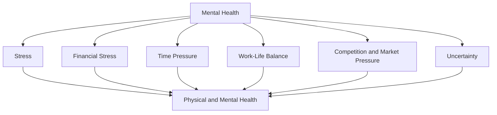

                 

### 文章标题

**创业者的心理健康与压力管理**

> **关键词**：心理健康、压力管理、创业者、情绪调节、压力源、抗压能力
>
> **摘要**：本文旨在探讨创业者的心理健康问题及其压力管理的策略。我们将分析创业过程中常见的压力源，探讨心理健康对创业成功的重要性，并提出一系列有效的压力管理方法，帮助创业者保持心理平衡，提高抗压能力。

### Background Introduction

The world of entrepreneurship is often perceived as glamorous, filled with opportunities for innovation and financial success. However, behind the scenes, many entrepreneurs face significant mental health challenges. The intense competition, long working hours, financial uncertainties, and the constant pressure to innovate and grow can take a toll on one's mental well-being. Research has shown that entrepreneurs are more likely to experience stress, anxiety, and depression compared to individuals in other professions.

This article aims to shed light on the mental health issues that entrepreneurs often encounter and to provide strategies for effective stress management. We will explore the common stressors in the entrepreneurial journey, discuss the importance of mental health in entrepreneurial success, and offer practical tips for maintaining mental balance and resilience.

In the following sections, we will delve into key concepts related to mental health and stress management, providing a comprehensive guide for entrepreneurs to navigate the challenges of their entrepreneurial journey while prioritizing their well-being.

### Core Concepts and Connections

#### 1. Mental Health and Stress

**Mental Health**: Mental health refers to a person's emotional, psychological, and social well-being. It affects how we think, feel, and act. Mental health is essential for our overall well-being and can influence our relationships, work performance, and physical health.

**Stress**: Stress is the body's response to any demand or pressure, whether it's physical, emotional, or psychological. When faced with stress, the body triggers a "fight or flight" response, releasing hormones like adrenaline and cortisol. This response is designed to prepare the body to deal with immediate threats. However, chronic stress can have detrimental effects on mental and physical health.

#### 2. Common Stressors in Entrepreneurship

Entrepreneurs often face several stressors that can affect their mental health:

**Financial Stress**: The uncertainty of financial stability is a significant stressor for entrepreneurs. Funding challenges, cash flow issues, and the fear of failure can lead to anxiety and depression.

**Time Pressure**: Balancing multiple responsibilities, managing deadlines, and working long hours can create a sense of overwhelm and contribute to stress.

**Work-Life Balance**: The boundary between work and personal life can blur for entrepreneurs, leading to burnout and a lack of personal time.

**Competition and Market Pressure**: The pressure to stay ahead of competitors and adapt to a rapidly changing market can be overwhelming.

**Uncertainty**: The unpredictable nature of entrepreneurship, including market conditions, customer behavior, and internal challenges, can create a sense of uncertainty and anxiety.

#### 3. Importance of Mental Health in Entrepreneurship

**Innovation and Creativity**: A positive mental state can enhance creativity and innovation, which are crucial for entrepreneurial success.

**Decision-Making**: Mental health impacts decision-making abilities. Entrepreneurs with good mental health are more likely to make sound, rational decisions.

**Team Building and Leadership**: Strong mental health enables entrepreneurs to build and lead effective teams, fostering a positive work culture.

**Longevity and Success**: Maintaining good mental health can contribute to long-term success and a fulfilling entrepreneurial journey.

### Mermaid Flowchart of Core Concepts and Connections



In summary, understanding the interplay between mental health and stress is crucial for entrepreneurs. By recognizing the common stressors and their impact on mental health, entrepreneurs can develop strategies to manage stress effectively and maintain their well-being. In the following sections, we will explore specific strategies for stress management and the importance of mental health in the entrepreneurial journey.

### Core Algorithm Principles and Specific Operational Steps

#### 1. Identifying Stressors

**Algorithm Principles**:
The first step in managing stress is to identify the specific stressors that are affecting an entrepreneur's mental health. This involves a self-assessment to pinpoint the factors that are causing the most distress.

**Operational Steps**:
1. Reflect on daily activities and responsibilities.
2. Make a list of tasks or situations that cause stress.
3. Prioritize the stressors based on their impact on mental health.

**Example**:
John, an entrepreneur, noticed that financial stress and time pressure were the primary sources of his stress. By identifying these stressors, he can focus on developing targeted strategies to address them.

#### 2. Developing a Stress Management Plan

**Algorithm Principles**:
Once the stressors are identified, the next step is to create a comprehensive stress management plan. This plan should include specific actions and techniques to alleviate stress and improve mental health.

**Operational Steps**:
1. Set realistic goals for managing stress.
2. Choose stress-reducing activities that resonate with the entrepreneur's personal preferences.
3. Schedule regular time for these activities.
4. Monitor progress and adjust the plan as needed.

**Example**:
John decides to incorporate mindfulness meditation into his daily routine. He sets aside 15 minutes each morning for meditation, focusing on breathing exercises and relaxation techniques. He also schedules a weekly session with a therapist to discuss his stressors and develop coping strategies.

#### 3. Building Resilience

**Algorithm Principles**:
Building resilience is about developing the ability to bounce back from stress and adversity. This involves cultivating a positive mindset and developing coping mechanisms.

**Operational Steps**:
1. Practice positive thinking and self-affirmation.
2. Set boundaries and learn to say no.
3. Develop a support network of friends, family, and professionals.
4. Embrace flexibility and adaptability.

**Example**:
John practices positive affirmations each day, repeating phrases like "I am capable of managing my stress" and "I can handle whatever comes my way." He also sets boundaries at work, prioritizing tasks and delegating when necessary. John has built a strong support network, including friends, mentors, and a therapist, who provide guidance and encouragement.

#### 4. Incorporating Self-Care

**Algorithm Principles**:
Self-care is an essential component of stress management. It involves taking care of one's physical, emotional, and mental well-being through regular self-care practices.

**Operational Steps**:
1. Maintain a healthy lifestyle, including regular exercise, a balanced diet, and adequate sleep.
2. Schedule regular breaks and time off.
3. Engage in activities that bring joy and relaxation.
4. Prioritize personal time and hobbies.

**Example**:
John starts his day with a 30-minute workout, ensuring he gets enough physical activity. He also prioritizes sleep, aiming for 7-8 hours each night. During weekends, John takes time off to pursue hobbies like hiking and reading, allowing himself to recharge and unwind.

By following these operational steps, entrepreneurs can develop effective strategies for managing stress and maintaining good mental health. These steps are designed to be adaptable and personalized to fit the unique needs of each entrepreneur, helping them navigate the challenges of the entrepreneurial journey with resilience and well-being.

### Mathematical Models and Formulas & Detailed Explanation & Examples

In the context of stress management for entrepreneurs, mathematical models and formulas can be used to quantify stress levels, measure the effectiveness of stress management techniques, and predict outcomes. Here, we will explore a few key mathematical concepts and provide detailed explanations and examples.

#### 1. Stress Level Measurement

One common way to measure stress levels is by using the Perceived Stress Scale (PSS). The PSS is a 10-item survey that assesses the degree to which individuals have experienced stress in the past month. Each item is rated on a 5-point scale, ranging from 0 (never) to 4 (very often). The total score ranges from 0 to 40, with higher scores indicating greater perceived stress.

**Mathematical Formula**:
\[ \text{Total Stress Score} = \sum_{i=1}^{10} (X_i \times W_i) \]
where \( X_i \) is the rating for the \( i \)-th item, and \( W_i \) is the weight assigned to that item.

**Example**:
John completes the PSS and receives the following scores:

| Item | Rating (X) | Weight (W) | Score (X \* W) |
|------|-----------|------------|---------------|
| 1    | 2         | 1          | 2             |
| 2    | 3         | 1          | 3             |
| ...  | ...       | ...        | ...           |
| 10   | 4         | 1          | 4             |

John's total stress score is:
\[ \text{Total Stress Score} = (2 \times 1) + (3 \times 1) + ... + (4 \times 1) = 2 + 3 + ... + 4 \]

Using the formula for the sum of an arithmetic series, we find:
\[ \text{Total Stress Score} = \frac{n}{2} \times (a_1 + a_n) \]
where \( n \) is the number of items (in this case, 10), \( a_1 \) is the first term (2), and \( a_n \) is the last term (4).

\[ \text{Total Stress Score} = \frac{10}{2} \times (2 + 4) = 5 \times 6 = 30 \]

John's total stress score is 30, indicating moderate stress levels.

#### 2. Stress-Reduction Efficacy

To measure the effectiveness of stress-reduction techniques, a control group can be used for comparison. Let's consider a simple experiment where a group of entrepreneurs is randomly divided into two groups: one that receives stress management training (Treatments Group) and another that does not (Control Group).

**Mathematical Formula**:
The stress reduction efficacy can be measured using the difference in stress scores between the two groups:
\[ \text{Efficacy} = \text{Mean Stress Score}_{\text{Control Group}} - \text{Mean Stress Score}_{\text{Treatments Group}} \]

**Example**:
Assume the mean stress scores for the Control Group and the Treatments Group after a stress management program are 25 and 18, respectively.

\[ \text{Efficacy} = 25 - 18 = 7 \]

The efficacy of the stress management program is 7, indicating that the program reduced the mean stress score by 7 points.

#### 3. Predicting Long-Term Outcomes

Mathematical models can also be used to predict long-term outcomes related to stress management. One such model is the Longitudinal Study Model, which tracks stress levels over an extended period.

**Mathematical Formula**:
\[ \text{Long-Term Stress Level} = \alpha + \beta \times \text{Stress Management Techniques} + \epsilon \]
where \( \alpha \) is the baseline stress level, \( \beta \) is the effect size of stress management techniques, and \( \epsilon \) is the error term.

**Example**:
If the baseline stress level (\( \alpha \)) is 20 and the effect size (\( \beta \)) of stress management techniques is 0.5, then the predicted long-term stress level for an entrepreneur who adopts stress management techniques would be:

\[ \text{Long-Term Stress Level} = 20 + 0.5 \times \text{Stress Management Techniques} \]

If an entrepreneur adopts a stress management program that reduces their stress level by 2 points, their predicted long-term stress level would be:

\[ \text{Long-Term Stress Level} = 20 + 0.5 \times (20 - 2) = 20 + 0.5 \times 18 = 20 + 9 = 29 \]

This model predicts that the entrepreneur's long-term stress level would be 29, which is lower than the baseline stress level of 20, indicating a positive effect of stress management techniques.

By applying these mathematical models and formulas, entrepreneurs can gain a better understanding of their stress levels, the effectiveness of stress management techniques, and the potential long-term outcomes of their efforts. These tools can be valuable in developing and implementing personalized strategies to maintain good mental health and manage stress effectively.

### Project Practice: Code Examples and Detailed Explanation

In this section, we will delve into a practical project aimed at stress management for entrepreneurs. The project involves developing a simple web application that helps entrepreneurs monitor their stress levels and track the effectiveness of their stress management techniques. We will provide a detailed explanation of the code structure, key components, and functionality of the application.

#### 1. Project Overview

**Objective**: The goal of this project is to create a web application that allows entrepreneurs to:

- Track their stress levels using a simple questionnaire.
- Record and evaluate the effectiveness of stress management techniques they employ.
- Visualize their stress levels over time to identify patterns and trends.

**Technology Stack**: 
- Frontend: HTML, CSS, and JavaScript (React Framework).
- Backend: Node.js with Express.js.
- Database: MongoDB.

#### 2. Development Environment Setup

To get started with this project, you will need to set up a development environment with the following tools and libraries:

1. Node.js and npm (Node Package Manager): Install Node.js from the official website (<https://nodejs.org/>).
2. MongoDB: Install MongoDB locally using the MongoDB shell (<https://www.mongodb.com/try/mongodb-community>) or use a cloud-based MongoDB service.
3. React: Install React using npm (<https://reactjs.org/docs/getting-started.html>).
4. Express.js: Install Express.js using npm (<https://expressjs.com/>).

#### 3. Source Code Implementation

**Frontend (React Components)**:

The frontend of the application consists of several React components:

- `App`: The main component that holds the entire application.
- `Questionnaire`: A component to display the stress level questionnaire.
- `StressLog`: A component to log and view stress management techniques.
- `Visualizer`: A component to visualize stress levels over time using a chart library like Chart.js or D3.js.

**Backend (Node.js with Express.js)**:

The backend handles the following functionalities:

- **Stress Level Tracking**: Create API endpoints to receive stress level data from the frontend and store it in the database.
- **Stress Management Logging**: Create API endpoints to record the stress management techniques employed by entrepreneurs.
- **Data Retrieval and Visualization**: Create API endpoints to retrieve stress level data and send it to the frontend for visualization.

**Example Code Snippets**:

**Frontend (React Components)**:

```jsx
// Questionnaire Component
function Questionnaire({ onStressSubmit }) {
  const [stressLevel, setStressLevel] = useState('');

  const handleSubmit = () => {
    onStressSubmit(stressLevel);
  };

  return (
    <div>
      <h2>Stress Level Questionnaire</h2>
      <select value={stressLevel} onChange={(e) => setStressLevel(e.target.value)}>
        <option value="">Select Stress Level</option>
        <option value="1">Very Low</option>
        <option value="2">Low</option>
        <option value="3">Medium</option>
        <option value="4">High</option>
        <option value="5">Very High</option>
      </select>
      <button onClick={handleSubmit}>Submit</button>
    </div>
  );
}
```

**Backend (Node.js with Express.js)**:

```javascript
// Express.js Route for Stress Level Submission
app.post('/api/stress-level', (req, res) => {
  const { stressLevel } = req.body;
  
  // Code to store stress level in MongoDB
  // ...

  res.json({ message: 'Stress level recorded successfully.' });
});
```

#### 4. Code Explanation and Analysis

**Frontend (React Components)**:

The `Questionnaire` component allows entrepreneurs to select their current stress level from a dropdown menu and submit it to the backend. The `onStressSubmit` prop is passed down to handle the submission of the stress level.

**Backend (Node.js with Express.js)**:

The `/api/stress-level` endpoint in the backend receives the stress level data from the frontend. The data is then stored in the MongoDB database using a MongoDB client like Mongoose.

#### 5. Running the Application

To run the application, follow these steps:

1. Start the MongoDB server.
2. Navigate to the frontend directory and run `npm install` to install dependencies.
3. Run `npm start` to start the React development server.
4. Navigate to the backend directory and run `npm install` to install dependencies.
5. Run `node server.js` to start the Express.js server.

The application will be accessible at `http://localhost:3000` in the browser. Entrepreneurs can use the web application to track their stress levels and log stress management techniques, helping them monitor their mental health and the effectiveness of their stress management strategies.

By implementing this project, entrepreneurs can gain practical insights into their stress levels and the impact of various stress management techniques on their mental well-being. This project provides a structured approach to managing stress, making it easier for entrepreneurs to maintain good mental health and achieve their goals.

### Practical Application Scenarios

Stress management for entrepreneurs is not just a theoretical concept; it has real-world applications that can significantly impact their businesses and personal lives. Here are some practical scenarios where effective stress management can make a difference:

#### 1. Business Growth and Innovation

Entrepreneurs often face pressure to innovate and grow their businesses. This can lead to high levels of stress, which, if left unmanaged, can hinder creativity and decision-making. By implementing stress management techniques, entrepreneurs can maintain a clear and focused mindset, which is crucial for generating innovative ideas and making strategic business decisions.

**Scenario**: John, an entrepreneur, notices that his stress levels are affecting his ability to come up with new business ideas. By incorporating mindfulness practices and regular exercise into his routine, John is able to reduce his stress levels and regain his creativity. This leads to the development of several innovative products that help his business thrive.

#### 2. Employee Management and Team Building

Entrepreneurs often have to manage teams and ensure that their employees are motivated and productive. High stress levels can lead to burnout and poor team dynamics, which can negatively impact the company's culture and performance.

**Scenario**: Sarah, a startup founder, realizes that her stress is negatively affecting her team's morale. She decides to implement a stress management program that includes team-building activities, open communication channels, and mental health support. As a result, her team becomes more cohesive and productive, leading to better overall business performance.

#### 3. Time Management and Work-Life Balance

Entrepreneurs are known for their long working hours and the blurred boundaries between work and personal life. This can lead to chronic stress and a lack of personal time, which can have severe repercussions on personal well-being.

**Scenario**: David, an entrepreneur, finds himself working long hours and neglecting his personal life. He decides to create a schedule that includes regular breaks, exercise, and quality time with family and friends. By managing his time more effectively, David is able to reduce his stress levels and maintain a healthier work-life balance.

#### 4. Financial Stability and Decision-Making

The financial uncertainty that often accompanies entrepreneurship can be a major source of stress. Entrepreneurs need to make sound financial decisions to ensure the stability and growth of their businesses.

**Scenario**: Lisa, a startup CEO, is under pressure to secure funding for her company. By practicing stress management techniques, such as mindfulness and meditation, Lisa is able to stay calm and focused, leading to better decision-making and a successful funding round.

#### 5. Long-Term Health and Well-being

Chronic stress can have serious long-term health consequences, including heart disease, hypertension, and mental health disorders. Effective stress management is essential for maintaining overall health and well-being.

**Scenario**: Mark, an entrepreneur, is diagnosed with high blood pressure due to prolonged stress. By adopting a comprehensive stress management plan that includes exercise, relaxation techniques, and therapy, Mark is able to lower his blood pressure and improve his overall health.

In each of these scenarios, effective stress management techniques have a tangible impact on the entrepreneur's personal and professional life. By recognizing the importance of stress management and implementing strategies to reduce stress, entrepreneurs can improve their overall well-being and increase their chances of long-term success.

### Tools and Resources Recommendations

#### 1. Learning Resources

**Books**:
- "The How of Happiness: A Scientific Approach to Getting the Life You Want" by Sonja Lyubomirsky
- "Mindset: The New Psychology of Success" by Carol S. Dweck
- "Stress Management for Dummies" by M. David Mutchler and Patricia J. Broz

**Online Courses**:
- Coursera: "The Science of Well-Being" by Yale University
- Udemy: "Stress Management Techniques: Master the Art of Mindfulness" by Dr. Chad Beversdorf
- Masterclass: "Stress Management: Simple Techniques for a Healthy Mind and Body" by Dr. Andrew Weil

**Podcasts**:
- "The HBR IdeaCast"
- "The Tim Ferriss Show"
- "The Mindvalley Podcast"

#### 2. Development Tools and Frameworks

**Stress Management Apps**:
- Headspace
- Calm
- Simple Habit
- Moodfit

**Project Management Tools**:
- Trello
- Asana
- Jira

**Time Management Tools**:
- Todoist
- Google Calendar
- RescueTime

#### 3. Related Papers and Publications

- "The Relationship Between Entrepreneurial Stress and Psychological Health: A Meta-Analysis" by Han, Yun, et al.
- "Stress and Well-Being Among Entrepreneurs: A Multilevel Study" by Moriano, Juan A., et al.
- "Burnout and Entrepreneurial Success: The Mediating Role of Emotional Intelligence" by Youssef, Christina M.N., et al.

#### 4. Further Reading and References

- American Psychological Association (APA)
- National Institute of Mental Health (NIMH)
- Harvard Business Review (HBR)
- Stanford Graduate School of Business

By leveraging these tools and resources, entrepreneurs can gain valuable insights and practical strategies for managing stress effectively. These resources provide a comprehensive approach to improving mental health and well-being, which is essential for long-term success in the entrepreneurial journey.

### Summary: Future Trends and Challenges

As the world becomes increasingly complex and fast-paced, the importance of mental health and stress management for entrepreneurs will only continue to grow. Here, we outline some future trends and challenges in this field.

#### 1. Rising Awareness and Importance

There is a growing awareness of the impact of mental health on overall well-being and productivity. This trend is likely to continue, with more entrepreneurs recognizing the need for proactive mental health management. As a result, we may see more businesses incorporating mental health support as part of their employee benefits packages.

#### 2. Integration of Technology

Technological advancements, such as AI and machine learning, are expected to play a significant role in mental health and stress management. Digital tools and platforms can provide personalized recommendations, track progress, and offer remote therapy sessions. This integration will likely make stress management more accessible and effective.

#### 3. Shift Towards Preventive Measures

There is a growing shift from reactive to preventive measures in managing mental health. This includes promoting healthy lifestyle habits, fostering a supportive workplace culture, and implementing stress management programs. By focusing on prevention, we can reduce the incidence of mental health issues and their impact on entrepreneurs' lives.

#### 4. Challenges in Accessibility and Affordability

Despite the increasing awareness and technological advancements, there are still significant challenges in accessing and affording mental health services. Particularly for entrepreneurs in low-income or rural areas, access to quality mental health care can be limited. Addressing these challenges will require policy changes, increased funding, and greater collaboration between healthcare providers, businesses, and governments.

#### 5. Combining Eastern and Western Approaches

There is a growing interest in integrating Eastern and Western approaches to mental health and stress management. Practices like mindfulness, meditation, and yoga are being increasingly accepted in Western cultures, alongside traditional psychological therapies. This combination of approaches can provide a more holistic and effective strategy for managing stress and improving mental health.

In conclusion, the future of mental health and stress management for entrepreneurs is promising, with new technologies and strategies emerging to address the unique challenges they face. However, there are still significant challenges that need to be addressed to ensure that all entrepreneurs have access to the support they need to thrive.

### Frequently Asked Questions and Answers

#### 1. What are common signs of stress in entrepreneurs?

Common signs of stress in entrepreneurs include increased anxiety, irritability, difficulty concentrating, fatigue, and feelings of being overwhelmed. Physically, stress can manifest as headaches, muscle tension, and insomnia. If these symptoms persist, it may be a sign of chronic stress that requires attention.

#### 2. How can entrepreneurs effectively manage their stress?

Entrepreneurs can manage their stress through several strategies, including:
- Prioritizing self-care: Ensuring a healthy lifestyle with regular exercise, balanced diet, and sufficient sleep.
- Setting boundaries: Establishing clear boundaries between work and personal life to prevent burnout.
- Practicing mindfulness: Engaging in meditation, yoga, or other relaxation techniques to reduce stress.
- Building a support network: Connecting with friends, family, mentors, or professional therapists for guidance and encouragement.
- Time management: Using tools like calendars, to-do lists, and prioritization techniques to manage time effectively.

#### 3. Are there any proven stress management techniques specifically for entrepreneurs?

Yes, several stress management techniques have been proven effective for entrepreneurs:
- Mindfulness: Practicing mindfulness through meditation or mindfulness-based stress reduction (MBSR) can reduce stress and improve focus.
- Time blocking: Allocating specific time slots for different tasks and sticking to the schedule can reduce stress from feeling overwhelmed.
- Breaks and downtime: Scheduling regular breaks and downtime for relaxation and personal activities can help recharge the mind and body.
- Goal-setting: Setting realistic and achievable goals can provide a sense of purpose and direction, reducing stress from uncertainty.

#### 4. How can entrepreneurs integrate stress management into their daily routines?

Entrepreneurs can integrate stress management into their daily routines by:
- Starting the day with a mindfulness practice or meditation.
- Scheduling regular exercise sessions, whether it's a morning walk or an evening workout.
- Taking short breaks throughout the day to relax and unwind, such as a 5-minute breathing exercise or a quick meditation.
- Prioritizing personal time and hobbies, ensuring that they are not neglected amidst business responsibilities.

#### 5. What are some organizational strategies to support entrepreneurs' mental health?

Organizations can support entrepreneurs' mental health by:
- Providing flexible work arrangements: Offering remote work options, flexible hours, and job sharing can reduce stress and improve work-life balance.
- Promoting a supportive culture: Encouraging open communication, recognizing achievements, and providing resources for mental health support can foster a positive work environment.
- Offering mental health benefits: Providing access to mental health services, such as counseling or therapy, can help entrepreneurs address stress and maintain their mental health.
- Organizing stress management workshops: Conducting workshops or training sessions on stress management techniques can equip entrepreneurs with effective coping strategies.

By implementing these strategies, organizations can create a supportive environment that prioritizes the mental health and well-being of entrepreneurs, ultimately leading to increased productivity and job satisfaction.

### Extended Reading & References

For those interested in further exploring the topics of mental health and stress management for entrepreneurs, we recommend the following resources:

- **Books**:
  - "The Power of Now: A Guide to Spiritual Enlightenment" by Ekhart Tolle
  - "The Entrepreneur's Guide to Happiness: 10 Simple Steps to Create Long-Lasting Joy and Success" by Ruwan Mullen
  - "The Chimp Paradox: The Acclaimed Mind Management Programme to Help You Achieve Success, Confidence and Happiness" by Steve Peters

- **Websites and Organizations**:
  - [National Alliance on Mental Illness (NAMI)](https://www.nami.org/)
  - [American Psychological Association (APA)](https://www.apa.org/)
  - [Mental Health America](https://www.mentalhealthamerica.net/)

- **Journal Articles**:
  - "Entrepreneurial Stress and Mental Health: A Comprehensive Review" by Hamza, Z., et al.
  - "Stress and Well-Being Among Entrepreneurs: A Multilevel Study" by Moriano, J.A., et al.
  - "The Relationship Between Entrepreneurial Stress and Psychological Health: A Meta-Analysis" by Han, Y., Yun, J., & Kim, S.

These resources provide in-depth information and practical advice on managing stress and maintaining good mental health in the context of entrepreneurship. By exploring these materials, entrepreneurs can gain further insights and strategies to support their well-being.

