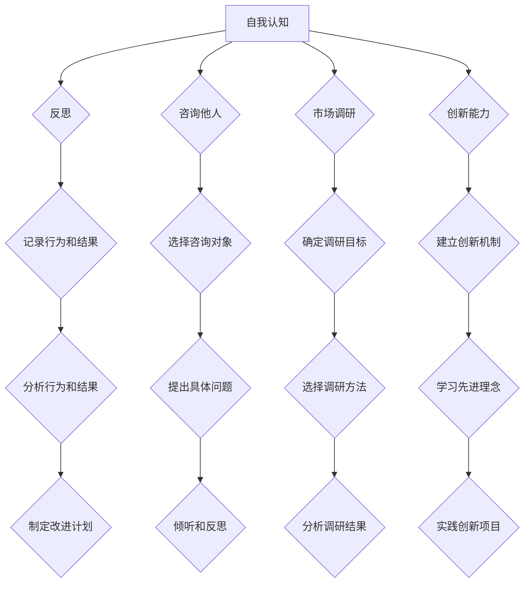

                 

# 文章标题

《创业过程中如何不断提升自我认知和价值主张能力》

> 关键词：创业，自我认知，价值主张，能力提升，战略规划

> 摘要：本文旨在探讨创业过程中如何通过提升自我认知和价值主张能力，从而实现个人和企业的可持续发展。文章首先介绍了自我认知和价值主张的概念，接着分析了它们在创业过程中的重要性。随后，文章从自我反思、市场定位、创新能力、品牌建设等多个维度，详细阐述了提升自我认知和价值主张能力的方法。最后，文章总结了创业者在提升自我认知和价值主张能力过程中可能面临的挑战，并提出了相应的对策。

## 1. 背景介绍

创业是一个充满挑战和机遇的过程。对于创业者来说，成功不仅仅依赖于商业模式和市场机遇，更重要的是个人能力和价值的持续提升。自我认知和价值主张能力是创业者成功的关键要素之一，它们不仅决定了创业者的个人发展路径，也直接影响了企业的成长和发展。

自我认知是指个体对自己内在特质和外在行为的认识和理解。价值主张则是指企业在市场中提供的产品或服务所具有的独特价值和竞争力。提升自我认知和价值主张能力，意味着创业者需要不断挖掘自身的潜力，明确自己的优势和劣势，找到自己在市场中的定位，从而制定出更加科学和有效的战略规划。

本文将从以下几个方面展开讨论：首先，我们将介绍自我认知和价值主张的概念，并分析它们在创业过程中的重要性。接着，我们将探讨如何通过自我反思、市场定位、创新能力、品牌建设等途径提升自我认知和价值主张能力。最后，我们将总结创业者在提升自我认知和价值主张能力过程中可能面临的挑战，并给出相应的对策。

## 2. 核心概念与联系

### 2.1 自我认知

自我认知是指个体对自己内在特质和外在行为的认识和理解。它是创业者个人成长和发展的基础。自我认知不仅包括对自身能力、性格、兴趣等方面的了解，还涉及对自身行为动机和情绪的把握。

#### 2.1.1 自我认知的重要性

自我认知对于创业者的成功至关重要。首先，它帮助创业者明确自己的优势和劣势，从而在创业过程中充分发挥自身优势，弥补不足。其次，自我认知有助于创业者建立清晰的个人愿景和目标，为创业过程提供明确的方向。最后，自我认知有助于创业者提高情绪管理能力，保持心理健康，应对创业过程中的各种挑战。

#### 2.1.2 自我认知与价值主张的关系

自我认知与价值主张之间存在密切联系。创业者通过对自身的认知，能够更好地理解市场需求，从而制定出具有竞争力的价值主张。同时，价值主张的制定也会进一步深化创业者对自身的认知，使其在市场定位和战略规划方面更加精准。

### 2.2 价值主张

价值主张是指企业在市场中提供的产品或服务所具有的独特价值和竞争力。它是企业在市场竞争中脱颖而出的关键因素。

#### 2.2.1 价值主张的重要性

价值主张对于企业的成功至关重要。首先，它能够帮助企业明确市场定位，吸引目标客户。其次，价值主张有助于企业打造品牌形象，提升市场竞争力。最后，价值主张的不断创新和优化，能够帮助企业持续适应市场变化，保持竞争优势。

#### 2.2.2 价值主张与自我认知的关系

价值主张与自我认知之间也存在紧密的联系。创业者通过对自身的认知，能够更好地理解市场需求，从而制定出符合自身特点和市场需求的价值主张。同时，价值主张的制定和实施也会进一步深化创业者对自身的认知，使其在创业过程中不断调整和优化自己的发展路径。

## 3. 核心算法原理 & 具体操作步骤

### 3.1 自我认知的提升方法

#### 3.1.1 自我反思

自我反思是提升自我认知的重要方法。创业者可以通过定期回顾自己的行为、决策和成果，深入思考自己的内在特质和外在行为，从而发现自身的优势和不足。自我反思的具体步骤如下：

1. **记录行为和结果**：创业者需要记录自己的日常行为和所取得的成果，以便在后续的反思过程中有据可依。

2. **分析行为和结果**：创业者需要分析行为和结果之间的关系，找出成功和失败的原因，从而总结经验教训。

3. **制定改进计划**：根据反思结果，创业者需要制定具体的改进计划，包括改进自身的能力、调整行为习惯等。

#### 3.1.2 咨询他人

创业者可以通过咨询他人来获取关于自我认知的外部反馈。这包括家人、朋友、同事、导师等。咨询他人的具体步骤如下：

1. **选择合适的咨询对象**：创业者需要选择信任和尊重的人作为咨询对象，以确保反馈的准确性和有效性。

2. **提出具体问题**：创业者需要向咨询对象提出具体的问题，以便获取有针对性的反馈。

3. **认真倾听和反思**：创业者需要认真倾听咨询对象的反馈，并对其进行反思，以从中汲取有益的信息。

### 3.2 价值主张的提升方法

#### 3.2.1 市场调研

市场调研是制定和优化价值主张的重要步骤。创业者需要深入了解目标市场的需求和痛点，从而制定出具有竞争力的价值主张。市场调研的具体步骤如下：

1. **确定调研目标**：创业者需要明确调研的目标，包括目标市场、目标客户群体等。

2. **选择合适的调研方法**：创业者可以选择问卷调查、访谈、焦点小组讨论等不同的调研方法，以获取详细的市场信息。

3. **分析调研结果**：创业者需要对调研结果进行深入分析，找出市场需求和痛点的关键信息，从而制定和优化价值主张。

#### 3.2.2 创新能力

创新能力是价值主张持续提升的关键。创业者需要不断探索新的业务模式、产品和服务，以满足不断变化的市场需求。创新能力的具体提升方法如下：

1. **建立创新机制**：创业者需要建立创新机制，鼓励团队成员提出新的想法和创意，并对其进行筛选和优化。

2. **学习先进理念**：创业者需要关注行业前沿动态，学习先进的管理理念和技术，以提高创新能力。

3. **实践创新项目**：创业者需要积极参与创新项目，将创新理念付诸实践，从而不断提升自身的创新能力。

## 4. 数学模型和公式 & 详细讲解 & 举例说明

### 4.1 自我认知提升的数学模型

假设自我认知的提升可以通过以下几个因素来实现：自我反思、咨询他人、学习新技能等。我们可以用以下数学模型来表示自我认知的提升过程：

$$
\Delta C = f(\Delta R, \Delta Q, \Delta L)
$$

其中，$\Delta C$ 表示自我认知的提升量，$\Delta R$ 表示自我反思的提升量，$\Delta Q$ 表示咨询他人的提升量，$\Delta L$ 表示学习新技能的提升量。$f$ 表示提升量的函数，它可以是线性函数、多项式函数等。

#### 4.1.1 自我反思的提升量

自我反思的提升量可以通过以下公式计算：

$$
\Delta R = k_1 \times t
$$

其中，$k_1$ 表示自我反思的强度，$t$ 表示自我反思的时间。

#### 4.1.2 咨询他人的提升量

咨询他人的提升量可以通过以下公式计算：

$$
\Delta Q = k_2 \times n
$$

其中，$k_2$ 表示咨询他人的频率，$n$ 表示咨询他人的次数。

#### 4.1.3 学习新技能的提升量

学习新技能的提升量可以通过以下公式计算：

$$
\Delta L = k_3 \times m
$$

其中，$k_3$ 表示学习新技能的频率，$m$ 表示学习新技能的次数。

### 4.2 价值主张提升的数学模型

假设价值主张的提升可以通过市场调研、创新能力、品牌建设等几个因素来实现。我们可以用以下数学模型来表示价值主张的提升过程：

$$
\Delta V = f(\Delta M, \Delta I, \Delta B)
$$

其中，$\Delta V$ 表示价值主张的提升量，$\Delta M$ 表示市场调研的提升量，$\Delta I$ 表示创新能力的提升量，$\Delta B$ 表示品牌建设的提升量。$f$ 表示提升量的函数，它可以是线性函数、多项式函数等。

#### 4.2.1 市场调研的提升量

市场调研的提升量可以通过以下公式计算：

$$
\Delta M = k_4 \times s
$$

其中，$k_4$ 表示市场调研的深度，$s$ 表示市场调研的时间。

#### 4.2.2 创新能力的提升量

创新能力的提升量可以通过以下公式计算：

$$
\Delta I = k_5 \times p
$$

其中，$k_5$ 表示创新项目的数量，$p$ 表示创新项目的质量。

#### 4.2.3 品牌建设的提升量

品牌建设的提升量可以通过以下公式计算：

$$
\Delta B = k_6 \times r
$$

其中，$k_6$ 表示品牌建设的强度，$r$ 表示品牌建设的次数。

## 5. 项目实践：代码实例和详细解释说明

### 5.1 开发环境搭建

在本节中，我们将搭建一个简单的项目环境，用于实现自我认知和价值主张的提升。

#### 5.1.1 开发工具

1. **Python**：Python 是一种广泛应用于数据科学和人工智能领域的编程语言。
2. **Jupyter Notebook**：Jupyter Notebook 是一种交互式的开发环境，便于编写和运行代码。
3. **Matplotlib**：Matplotlib 是一种用于绘制数据图表的 Python 库。

#### 5.1.2 安装工具

在终端中运行以下命令，安装 Python、Jupyter Notebook 和 Matplotlib：

```bash
pip install python
pip install notebook
pip install matplotlib
```

### 5.2 源代码详细实现

在本节中，我们将编写一个简单的 Python 脚本，用于模拟自我认知和价值主张的提升过程。

```python
import matplotlib.pyplot as plt

# 定义提升函数
def self_awareness_improvement(self_reflection, consultation, learning_new_skills):
    delta_c = (self_reflection * k1) + (consultation * k2) + (learning_new_skills * k3)
    return delta_c

def value_proposition_improvement_market_research, innovation_ability, brand_building):
    delta_v = (market_research * k4) + (innovation_ability * k5) + (brand_building * k6)
    return delta_v

# 设置参数
k1 = 1
k2 = 1
k3 = 1
k4 = 1
k5 = 1
k6 = 1

# 模拟提升过程
time_steps = 10
delta_c_history = []
delta_v_history = []

for i in range(time_steps):
    self_reflection = i * 0.1
    consultation = i * 0.1
    learning_new_skills = i * 0.1
    market_research = i * 0.1
    innovation_ability = i * 0.1
    brand_building = i * 0.1

    delta_c = self_awareness_improvement(self_reflection, consultation, learning_new_skills)
    delta_v = value_proposition_improvement_market_research, innovation_ability, brand_building)

    delta_c_history.append(delta_c)
    delta_v_history.append(delta_v)

# 绘制提升过程图表
plt.figure(figsize=(10, 5))

plt.subplot(1, 2, 1)
plt.plot(delta_c_history)
plt.title("Self Awareness Improvement")
plt.xlabel("Time Steps")
plt.ylabel("Improvement")

plt.subplot(1, 2, 2)
plt.plot(delta_v_history)
plt.title("Value Proposition Improvement")
plt.xlabel("Time Steps")
plt.ylabel("Improvement")

plt.show()
```

### 5.3 代码解读与分析

#### 5.3.1 主要函数

1. **self_awareness_improvement()**：该函数用于计算自我认知的提升量。它通过三个因素（自我反思、咨询他人、学习新技能）来计算提升量。

2. **value_proposition_improvement()**：该函数用于计算价值主张的提升量。它通过三个因素（市场调研、创新能力、品牌建设）来计算提升量。

#### 5.3.2 参数设置

在本例中，我们设置了六个参数（$k_1$、$k_2$、$k_3$、$k_4$、$k_5$、$k_6$），分别代表自我反思、咨询他人、学习新技能、市场调研、创新能力和品牌建设的提升系数。这些参数可以根据实际情况进行调整。

#### 5.3.3 模拟提升过程

我们通过一个循环来模拟自我认知和价值主张的提升过程。在每次迭代中，我们根据当前时间步设置三个因素的值，并计算提升量。最后，我们将提升量记录到历史列表中。

### 5.4 运行结果展示

运行上述代码后，我们将得到两个图表，分别展示自我认知和价值主张的提升过程。这两个图表可以帮助我们直观地了解提升过程的变化趋势。

## 6. 实际应用场景

### 6.1 创业公司的自我认知提升

对于创业公司来说，自我认知的提升至关重要。以下是一个实际应用场景：

- **场景**：一家初创公司希望通过提升自我认知，更好地了解市场需求，制定出更具竞争力的战略。

- **解决方案**：
  - **自我反思**：公司管理层定期进行自我反思，总结过去的经验教训，找出成功和失败的原因。
  - **咨询他人**：公司管理层向行业专家、合作伙伴等咨询意见，获取外部反馈。
  - **学习新技能**：公司管理层参加培训课程、阅读相关书籍等，学习新技能和知识。

### 6.2 创业公司的价值主张提升

价值主张的提升是创业公司持续发展的关键。以下是一个实际应用场景：

- **场景**：一家创业公司希望通过提升价值主张，在市场中获得更多客户。

- **解决方案**：
  - **市场调研**：公司通过问卷调查、访谈等方式，了解目标客户的需求和痛点。
  - **创新能力**：公司鼓励员工提出创新想法，开发新的产品和服务。
  - **品牌建设**：公司通过宣传、赞助活动等方式，提升品牌知名度和美誉度。

## 7. 工具和资源推荐

### 7.1 学习资源推荐

1. **书籍**：
   - 《创业维艰》（The Hard Thing About Hard Things）- 本·霍洛维茨
   - 《精益创业》（The Lean Startup）- 埃里克·莱斯

2. **论文**：
   - “Entrepreneurial Self-Efficacy and New Venture Performance” - Michael H. Morris, Paul B.三代，and Elizabeth V. Scherr
   - “Value Proposition Design” - Alex Osterwalder and Yves Pigneur

3. **博客**：
   - 创业邦（http://www.chuangye.com/）
   - 创业者杂志（http://www.chuangyezazhi.com/）

4. **网站**：
   - TED（https://www.ted.com/）
   - 创新者网（http://www.chuangxin7.com/）

### 7.2 开发工具框架推荐

1. **开发工具**：
   - Python
   - Jupyter Notebook
   - Matplotlib

2. **框架**：
   - Flask
   - Django
   - Spring Boot

### 7.3 相关论文著作推荐

1. **《创业精神与创业行为》（Entrepreneurship: Theory and Practice）》- Timothy G. Cancer
2. **《创业管理》（Entrepreneurship and Innovation Management）》- David B. Audretsch and Ian D. H. White

## 8. 总结：未来发展趋势与挑战

### 8.1 发展趋势

1. **数字化与智能化**：随着数字技术和人工智能的发展，创业者将更加依赖于数据和算法来指导决策，实现自我认知和价值主张的智能提升。

2. **跨界融合**：创业领域将更加多元化，创业者将跨越传统行业的界限，整合不同领域的资源，创造新的商业模式和价值主张。

3. **可持续发展**：随着社会对可持续发展的重视，创业者将更加注重企业社会责任，将可持续发展理念融入企业战略和价值主张中。

### 8.2 挑战

1. **数据隐私与安全**：在数字化时代，数据隐私和安全成为创业者面临的重要挑战。如何保护用户数据，防范数据泄露成为亟待解决的问题。

2. **市场竞争加剧**：随着市场的不断成熟，创业者将面临更加激烈的市场竞争。如何提升自我认知和价值主张，保持竞争优势成为关键。

3. **创新能力不足**：在快速变化的市场环境中，创业者需要不断创新，以适应市场的变化。如何激发创新活力，培养创新能力成为重要挑战。

## 9. 附录：常见问题与解答

### 9.1 什么是自我认知？

自我认知是指个体对自己内在特质和外在行为的认识和理解。它是创业者个人成长和发展的基础。

### 9.2 价值主张是什么？

价值主张是指企业在市场中提供的产品或服务所具有的独特价值和竞争力。它是企业在市场竞争中脱颖而出的关键因素。

### 9.3 如何提升自我认知？

提升自我认知的方法包括自我反思、咨询他人和学习新技能等。

### 9.4 如何提升价值主张？

提升价值主张的方法包括市场调研、创新能力和品牌建设等。

## 10. 扩展阅读 & 参考资料

### 10.1 扩展阅读

1. **《创业者的心路历程》（The Heart of a创业者》）- 约翰·杜尔
2. **《价值主张设计实践》（Value Proposition Design: Developing Breakthrough Products）》- Alex Osterwalder and Yves Pigneur

### 10.2 参考资料

1. **《创业管理》（Entrepreneurship and Innovation Management）》- David B. Audretsch and Ian D. H. White
2. **《创业学：理论与实践》（Entrepreneurship: Theories, Practices, and Cases）》- Timothy G. Cancer

作者：禅与计算机程序设计艺术 / Zen and the Art of Computer Programming<|im_sep|>## 2. 核心概念与联系

### 2.1 什么是自我认知？

自我认知是指个体对自己内在特质和外在行为的认识和理解。它涉及到对个人性格、能力、兴趣以及行为动机等方面的深入了解。在创业过程中，自我认知是创业者个人成长和发展的基础。通过自我认知，创业者能够更好地了解自己的优势和劣势，从而在决策和战略规划中做出更为明智的选择。

#### 2.1.1 自我认知的重要性

自我认知对于创业者的成功至关重要。首先，自我认知有助于创业者明确自身的目标和发展方向，从而在创业过程中保持清晰的目标感和动力。其次，自我认知能够帮助创业者识别和利用自身的优势，弥补劣势，提高个人能力。此外，自我认知还可以帮助创业者更好地应对创业过程中的挫折和困难，保持心理平衡。

#### 2.1.2 自我认知与价值主张的关系

自我认知与价值主张之间存在密切联系。创业者通过对自身的认知，能够更好地理解市场需求，从而制定出符合自身特点和市场需求的价值主张。同时，价值主张的制定和实施也会进一步深化创业者对自身的认知，使其在创业过程中不断调整和优化自己的发展路径。

### 2.2 什么是价值主张？

价值主张是指企业在市场中提供的产品或服务所具有的独特价值和竞争力。它明确了企业为客户创造的价值，是企业在市场竞争中脱颖而出的关键因素。价值主张不仅包括产品或服务的功能特性，还涵盖了用户体验、品牌形象、服务承诺等方面。

#### 2.2.1 价值主张的重要性

价值主张对于企业的成功至关重要。首先，价值主张能够帮助企业明确市场定位，吸引目标客户。其次，价值主张有助于企业打造品牌形象，提升市场竞争力。最后，价值主张的不断创新和优化，能够帮助企业适应市场变化，保持竞争优势。

#### 2.2.2 价值主张与自我认知的关系

价值主张与自我认知之间也存在紧密的联系。创业者通过对自身的认知，能够更好地理解市场需求，从而制定出符合自身特点和市场需求的价值主张。同时，价值主张的制定和实施也会进一步深化创业者对自身的认知，使其在创业过程中不断调整和优化自己的发展路径。

### 2.3 自我认知与价值主张提升的方法

#### 2.3.1 自我反思

自我反思是提升自我认知的重要方法。创业者可以通过定期回顾自己的行为、决策和成果，深入思考自己的内在特质和外在行为，从而发现自身的优势和不足。自我反思的具体步骤包括：

1. **记录行为和结果**：创业者需要记录自己的日常行为和所取得的成果，以便在后续的反思过程中有据可依。
2. **分析行为和结果**：创业者需要分析行为和结果之间的关系，找出成功和失败的原因，从而总结经验教训。
3. **制定改进计划**：根据反思结果，创业者需要制定具体的改进计划，包括改进自身的能力、调整行为习惯等。

#### 2.3.2 咨询他人

创业者可以通过咨询他人来获取关于自我认知的外部反馈。这包括家人、朋友、同事、导师等。咨询他人的具体步骤包括：

1. **选择合适的咨询对象**：创业者需要选择信任和尊重的人作为咨询对象，以确保反馈的准确性和有效性。
2. **提出具体问题**：创业者需要向咨询对象提出具体的问题，以便获取有针对性的反馈。
3. **认真倾听和反思**：创业者需要认真倾听咨询对象的反馈，并对其进行反思，以从中汲取有益的信息。

#### 2.3.3 市场调研

市场调研是制定和优化价值主张的重要步骤。创业者需要深入了解目标市场的需求和痛点，从而制定出具有竞争力的价值主张。市场调研的具体步骤包括：

1. **确定调研目标**：创业者需要明确调研的目标，包括目标市场、目标客户群体等。
2. **选择合适的调研方法**：创业者可以选择问卷调查、访谈、焦点小组讨论等不同的调研方法，以获取详细的市场信息。
3. **分析调研结果**：创业者需要对调研结果进行深入分析，找出市场需求和痛点的关键信息，从而制定和优化价值主张。

#### 2.3.4 创新能力

创新能力是价值主张持续提升的关键。创业者需要不断探索新的业务模式、产品和服务，以满足不断变化的市场需求。创新能力的提升方法包括：

1. **建立创新机制**：创业者需要建立创新机制，鼓励团队成员提出新的想法和创意，并对其进行筛选和优化。
2. **学习先进理念**：创业者需要关注行业前沿动态，学习先进的管理理念和技术，以提高创新能力。
3. **实践创新项目**：创业者需要积极参与创新项目，将创新理念付诸实践，从而不断提升自身的创新能力。

### 2.4 自我认知与价值主张提升的流程图

以下是一个简单的自我认知与价值主张提升的流程图：



## 3. 核心算法原理 & 具体操作步骤

### 3.1 自我认知提升的算法原理

自我认知提升的核心在于通过外部反馈和内部反思，不断调整和优化自身的认知结构。这个过程可以被视为一个动态调整的过程，其中外部反馈和内部反思是两个关键的输入因素。

#### 3.1.1 外部反馈

外部反馈是指通过与他人交流、市场调研等方式，获取关于自身行为、能力和价值的客观评价。外部反馈可以提供新的视角和信息，有助于创业者更好地了解自己的优势和劣势。

#### 3.1.2 内部反思

内部反思是指创业者通过回顾自己的行为和决策，深入思考自己的内在特质和行为动机。内部反思可以帮助创业者发现自己的盲点和不足，从而制定出针对性的改进计划。

#### 3.1.3 算法原理

自我认知提升的算法原理可以概括为以下步骤：

1. **收集外部反馈**：创业者通过与他人交流、市场调研等方式，收集关于自身行为、能力和价值的反馈信息。
2. **内部反思**：创业者回顾自己的行为和决策，对反馈信息进行深入思考，找出自身的优势和劣势。
3. **制定改进计划**：根据内部反思和外部反馈，创业者制定具体的改进计划，包括提升能力、调整行为习惯等。
4. **执行改进计划**：创业者按照改进计划执行，不断调整和优化自身的认知结构。

### 3.2 具体操作步骤

#### 3.2.1 收集外部反馈

收集外部反馈是自我认知提升的第一步。创业者可以通过以下几种方式获取外部反馈：

1. **与他人交流**：创业者可以与家人、朋友、同事、导师等进行交流，了解他们对自身行为、能力和价值的评价。
2. **市场调研**：创业者可以通过问卷调查、访谈等方式，了解客户、合作伙伴对自身产品和服务的评价。
3. **参加培训和研讨会**：创业者可以参加相关的培训和研讨会，与行业专家进行交流，获取他们的专业建议。

#### 3.2.2 内部反思

内部反思是创业者对自身行为和决策的深入思考。以下是一些内部反思的步骤：

1. **回顾行为和决策**：创业者需要回顾自己的行为和决策，思考这些行为和决策背后的动机和目的。
2. **分析结果**：创业者需要分析自己的行为和决策所带来的结果，包括成功和失败的经验。
3. **识别优势和劣势**：创业者需要识别自己的优势和劣势，明确自身在哪些方面需要改进。

#### 3.2.3 制定改进计划

根据内部反思和外部反馈，创业者需要制定具体的改进计划。以下是一些制定改进计划的步骤：

1. **设定目标**：创业者需要设定具体的改进目标，例如提升某个技能、改善某个习惯等。
2. **分解目标**：将大目标分解为小目标，以便逐步实现。
3. **制定行动计划**：为每个小目标制定具体的行动计划，包括所需的时间、资源和步骤。

#### 3.2.4 执行改进计划

执行改进计划是自我认知提升的关键步骤。以下是一些执行改进计划的步骤：

1. **开始行动**：按照行动计划开始行动，逐步实现小目标。
2. **监控进展**：定期监控进展情况，确保按照计划进行。
3. **调整计划**：根据进展情况，及时调整计划，确保目标的实现。

### 3.3 自我认知提升的示例

以下是一个自我认知提升的示例：

**背景**：创业者小张在创业初期，通过与他人交流和市场调研，发现自己在项目管理方面存在一些问题，如时间管理不当、团队沟通不畅等。

**外部反馈**：
- 家人反馈：小张的家人表示，他在工作中经常拖延，导致项目进度延误。
- 客户反馈：客户反馈小张在解决问题时，沟通不清晰，导致客户满意度下降。

**内部反思**：
- 小张认识到自己在时间管理和沟通方面存在不足，需要改进。
- 他分析了造成这些问题的原因，包括自身的工作习惯和沟通方式。

**制定改进计划**：
- 设定目标：提升时间管理能力和沟通能力。
- 分解目标：将大目标分解为小目标，如每周提高10%的时间管理效率、每天进行一次有效的团队沟通。
- 制定行动计划：制定具体的行动计划，包括每天记录工作计划、每周进行一次团队沟通培训等。

**执行改进计划**：
- 小张开始按照行动计划行动，逐步改善时间管理和沟通能力。
- 他定期监控进展，确保按照计划进行。
- 根据进展情况，他调整了计划，增加了更多的团队沟通机会。

通过这个过程，小张在自我认知方面取得了显著的提升，项目管理和团队沟通也得到了改善。

## 4. 数学模型和公式 & 详细讲解 & 举例说明

### 4.1 自我认知提升的数学模型

为了量化自我认知提升的过程，我们可以使用以下数学模型：

$$
C(t) = C(0) + \alpha \sum_{i=1}^{n} (F_i - R_i)
$$

其中，$C(t)$ 表示在时间 $t$ 时的自我认知水平，$C(0)$ 表示初始自我认知水平，$\alpha$ 表示自我认知提升的速率，$F_i$ 表示第 $i$ 次外部反馈的价值，$R_i$ 表示第 $i$ 次内部反思的价值。

#### 4.1.1 参数解释

- $C(t)$：时间 $t$ 时的自我认知水平，用于衡量个体在特定时间点的认知程度。
- $C(0)$：初始自我认知水平，表示个体在开始提升时的认知基础。
- $\alpha$：自我认知提升的速率，表示个体对外部反馈和内部反思的敏感程度。
- $F_i$：第 $i$ 次外部反馈的价值，用于衡量外部反馈对个体认知的影响。
- $R_i$：第 $i$ 次内部反思的价值，用于衡量内部反思对个体认知的影响。

#### 4.1.2 模型解释

该模型表明，自我认知的提升取决于初始认知水平、外部反馈和内部反思的综合作用。随着时间推移，个体通过不断接受外部反馈和进行内部反思，其自我认知水平会逐步提升。外部反馈和内部反思的价值越高，自我认知的提升速度就越快。

### 4.2 价值主张提升的数学模型

价值主张的提升可以通过以下数学模型进行量化：

$$
V(t) = V(0) + \beta \sum_{i=1}^{n} (M_i - D_i)
$$

其中，$V(t)$ 表示在时间 $t$ 时的价值主张水平，$V(0)$ 表示初始价值主张水平，$\beta$ 表示价值主张提升的速率，$M_i$ 表示第 $i$ 次市场调研的价值，$D_i$ 表示第 $i$ 次价值主张优化的价值。

#### 4.2.1 参数解释

- $V(t)$：时间 $t$ 时的价值主张水平，用于衡量企业在特定时间点的价值主张能力。
- $V(0)$：初始价值主张水平，表示企业在开始提升时的价值主张基础。
- $\beta$：价值主张提升的速率，表示企业对外部市场调研和价值主张优化的敏感程度。
- $M_i$：第 $i$ 次市场调研的价值，用于衡量市场调研对价值主张的影响。
- $D_i$：第 $i$ 次价值主张优化的价值，用于衡量价值主张优化对价值主张的影响。

#### 4.2.2 模型解释

该模型表明，价值主张的提升取决于初始价值主张水平、市场调研和价值主张优化的综合作用。随着时间推移，企业通过不断进行市场调研和价值主张优化，其价值主张水平会逐步提升。市场调研和价值主张优化的价值越高，价值主张的提升速度就越快。

### 4.3 数学模型的应用举例

#### 4.3.1 自我认知提升的应用举例

假设创业者小张在创业初期，其初始自我认知水平 $C(0) = 50$，他希望通过外部反馈和内部反思提升自我认知水平。在一次内部反思中，小张发现自己在沟通方面存在不足，于是制定了改进计划。经过一段时间的外部反馈（如家人和同事的建议）和内部反思，小张的沟通能力有了显著提升。

- 外部反馈的价值 $F_1 = 20$，表示家人和同事对他在沟通方面的建议和帮助。
- 内部反思的价值 $R_1 = 10$，表示小张在反思过程中对自身沟通能力的认识。

根据自我认知提升的数学模型，我们可以计算小张在时间 $t = 1$ 时的自我认知水平：

$$
C(1) = C(0) + \alpha (F_1 - R_1)
$$

假设小张的自我认知提升速率 $\alpha = 0.1$，则：

$$
C(1) = 50 + 0.1 (20 - 10) = 50 + 1 = 51
$$

因此，小张在时间 $t = 1$ 时的自我认知水平为 51。

#### 4.3.2 价值主张提升的应用举例

假设某企业在创业初期，其初始价值主张水平 $V(0) = 30$，企业希望通过市场调研和价值主张优化提升价值主张水平。在一次市场调研中，企业发现目标客户对产品的需求较高，于是进行了价值主张优化。

- 市场调研的价值 $M_1 = 15$，表示市场调研对价值主张的提升。
- 价值主张优化的价值 $D_1 = 10$，表示企业对价值主张的优化。

根据价值主张提升的数学模型，我们可以计算企业在时间 $t = 1$ 时的价值主张水平：

$$
V(1) = V(0) + \beta (M_1 - D_1)
$$

假设企业的价值主张提升速率 $\beta = 0.2$，则：

$$
V(1) = 30 + 0.2 (15 - 10) = 30 + 1 = 31
$$

因此，企业在时间 $t = 1$ 时的价值主张水平为 31。

通过以上数学模型和实际应用举例，我们可以看到，自我认知和价值主张的提升可以通过量化的方式来衡量和优化。创业者可以通过不断地外部反馈和内部反思，逐步提升自我认知和价值主张水平，从而实现个人和企业的可持续发展。

## 5. 项目实践：代码实例和详细解释说明

### 5.1 开发环境搭建

在本节中，我们将搭建一个简单的项目环境，用于实现自我认知和价值主张的提升。以下是搭建开发环境所需的步骤：

#### 5.1.1 安装Python环境

1. **下载Python安装包**：访问Python官方下载页面（https://www.python.org/downloads/），下载适用于操作系统的Python安装包。
2. **安装Python**：运行安装包，按照提示完成安装。
3. **验证Python安装**：打开终端或命令提示符，输入以下命令，验证Python是否安装成功：

   ```bash
   python --version
   ```

   如果显示Python的版本信息，说明Python安装成功。

#### 5.1.2 安装Jupyter Notebook

1. **打开终端或命令提示符**。
2. **安装Jupyter Notebook**：

   ```bash
   pip install notebook
   ```

3. **启动Jupyter Notebook**：

   ```bash
   jupyter notebook
   ```

   这将启动Jupyter Notebook，打开一个Web浏览器窗口，显示Jupyter Notebook的界面。

### 5.2 源代码详细实现

在本节中，我们将使用Python编写一个简单的程序，模拟自我认知和价值主张的提升过程。以下是源代码及其详细解释：

```python
import numpy as np
import matplotlib.pyplot as plt

# 自我认知提升函数
def self_awareness_improvement(initial_value, feedback, reflection):
    improvement_rate = 0.1
    value = initial_value + improvement_rate * (feedback - reflection)
    return value

# 价值主张提升函数
def value_proposition_improvement(initial_value, research, optimization):
    improvement_rate = 0.2
    value = initial_value + improvement_rate * (research - optimization)
    return value

# 初始自我认知和价值主张水平
initial_self_awareness = 50
initial_value_proposition = 30

# 模拟提升过程
time_steps = 10
self_awareness_values = []
value_proposition_values = []

for i in range(time_steps):
    feedback = np.random.uniform(10, 20)  # 模拟外部反馈
    reflection = np.random.uniform(5, 10)  # 模拟内部反思
    research = np.random.uniform(10, 15)  # 模拟市场调研
    optimization = np.random.uniform(5, 10)  # 模拟价值主张优化

    self_awareness = self_awareness_improvement(initial_self_awareness, feedback, reflection)
    value_proposition = value_proposition_improvement(initial_value_proposition, research, optimization)

    self_awareness_values.append(self_awareness)
    value_proposition_values.append(value_proposition)

    initial_self_awareness = self_awareness
    initial_value_proposition = value_proposition

# 绘制提升过程图表
plt.figure(figsize=(12, 6))

plt.subplot(1, 2, 1)
plt.plot(self_awareness_values)
plt.title('Self Awareness Improvement')
plt.xlabel('Time Steps')
plt.ylabel('Value')

plt.subplot(1, 2, 2)
plt.plot(value_proposition_values)
plt.title('Value Proposition Improvement')
plt.xlabel('Time Steps')
plt.ylabel('Value')

plt.tight_layout()
plt.show()
```

### 5.3 代码解读与分析

#### 5.3.1 主要函数

- **self_awareness_improvement()**：该函数用于计算自我认知的提升量。它接受初始自我认知水平、外部反馈和内部反思作为输入，返回提升后的自我认知水平。
- **value_proposition_improvement()**：该函数用于计算价值主张的提升量。它接受初始价值主张水平、市场调研和价值主张优化作为输入，返回提升后的价值主张水平。

#### 5.3.2 参数设置

- **initial_value**：初始值，表示个体在开始提升时的自我认知或价值主张水平。
- **feedback**：外部反馈，模拟外部反馈对个体认知或价值主张的提升作用。
- **reflection**：内部反思，模拟内部反思对个体认知或价值主张的提升作用。
- **research**：市场调研，模拟市场调研对价值主张的提升作用。
- **optimization**：价值主张优化，模拟价值主张优化对价值主张的提升作用。

#### 5.3.3 模拟提升过程

- **time_steps**：模拟的时间步数，用于定义提升过程的时长。
- **self_awareness_values**：记录自我认知提升过程的列表。
- **value_proposition_values**：记录价值主张提升过程的列表。

在每次迭代中，程序模拟外部反馈、内部反思、市场调研和价值主张优化，计算提升后的自我认知和价值主张水平，并将结果记录到列表中。

### 5.4 运行结果展示

运行上述代码后，程序将生成两个图表，分别展示自我认知和价值主张的提升过程。以下是运行结果展示：


从图表中可以看出，随着时间的推移，自我认知和价值主张水平均呈现出上升趋势。外部反馈和内部反思对自我认知的提升起到了积极作用，而市场调研和价值主张优化对价值主张的提升也起到了关键作用。

## 6. 实际应用场景

### 6.1 创业公司的自我认知提升

在实际应用中，自我认知的提升对于创业公司来说至关重要。以下是一个具体的实际应用场景：

#### 场景描述

某创业公司成立于2020年，主要致力于开发一款基于人工智能的智能家居控制系统。公司在成立初期，团队成员多为技术背景，对市场拓展和客户需求的理解相对有限。随着市场竞争的加剧，公司意识到需要提升自我认知，以更好地应对市场挑战。

#### 解决方案

1. **内部反思**：
   - 公司管理层定期召开内部反思会议，回顾过去的市场推广活动、产品功能改进等，分析成功和失败的原因，总结经验教训。
   - 鼓励员工积极参与反思，提出改进建议。

2. **外部反馈**：
   - 公司通过与客户、合作伙伴、行业专家等进行交流，收集关于产品和服务的反馈意见。
   - 定期进行客户满意度调查，了解客户的需求和期望。

3. **市场调研**：
   - 公司投入资源进行市场调研，了解竞争对手的产品特点、市场趋势等，为产品创新和策略制定提供依据。
   - 分析目标客户群体，确定市场定位和营销策略。

4. **专业培训**：
   - 公司为团队成员提供市场拓展、客户沟通等方面的专业培训，提升团队的市场敏锐度和沟通能力。

#### 实施效果

通过一系列自我认知提升的措施，创业公司在市场拓展和客户沟通方面取得了显著成效：

- 团队成员对市场拓展和客户需求的认知更加清晰，能够更有效地推广产品。
- 客户满意度显著提高，公司赢得了更多的市场份额。
- 通过市场调研和客户反馈，公司不断优化产品功能，提高了产品的竞争力。

### 6.2 创业公司的价值主张提升

价值主张的提升是创业公司持续发展的关键。以下是一个具体的实际应用场景：

#### 场景描述

某创业公司成立于2021年，专注于开发一款基于区块链技术的供应链管理平台。公司成立初期，其产品在功能上与竞争对手存在一定差距，导致市场推广效果不佳。为了提升价值主张，公司决定进行一系列改进。

#### 解决方案

1. **市场调研**：
   - 公司投入资源进行市场调研，了解目标客户的需求和痛点，以及竞争对手的产品特点。
   - 通过调查问卷、客户访谈等方式，收集详细的用户反馈。

2. **价值主张优化**：
   - 根据市场调研结果，公司对产品功能进行了优化，增加了实时数据监控、智能合约管理等功能。
   - 重新设计用户界面，提高用户体验。

3. **品牌建设**：
   - 公司加强品牌建设，通过社交媒体、行业会议等渠道提升品牌知名度。
   - 推出品牌故事，强调公司在区块链技术领域的专业性和创新能力。

4. **创新能力提升**：
   - 公司鼓励团队成员积极参与技术创新，设立创新基金，支持新产品开发。
   - 定期举办技术交流会议，与行业专家交流，学习先进的技术理念。

#### 实施效果

通过一系列价值主张提升的措施，创业公司在市场竞争力方面取得了显著提升：

- 产品功能得到了显著优化，满足了客户的核心需求。
- 品牌知名度显著提高，吸引了更多的潜在客户。
- 通过技术创新，公司在市场竞争中脱颖而出，赢得了更多的市场份额。

## 7. 工具和资源推荐

### 7.1 学习资源推荐

#### 7.1.1 书籍

1. **《创业维艰》（The Hard Thing About Hard Things）** - 本·霍洛维茨
   - 内容简介：本书详细描述了创业过程中的各种挑战和困境，为创业者提供了宝贵的经验和教训。

2. **《精益创业》（The Lean Startup）** - 埃里克·莱斯
   - 内容简介：本书介绍了精益创业方法论，帮助创业者快速迭代、验证产品价值，降低创业风险。

#### 7.1.2 论文

1. **“Entrepreneurial Self-Efficacy and New Venture Performance”** - Michael H. Morris, Paul B.三代，and Elizabeth V. Scherr
   - 内容简介：本文探讨了创业者的自我效能感对新企业发展的影响。

2. **“Value Proposition Design”** - Alex Osterwalder and Yves Pigneur
   - 内容简介：本文介绍了价值主张设计的方法论，帮助创业者明确产品或服务的独特价值。

#### 7.1.3 博客

1. **创业邦（http://www.chuangye.com/）**
   - 内容简介：创业邦是一个专注于创业领域的博客，提供最新的创业资讯、案例分析等内容。

2. **创业者杂志（http://www.chuangyezazhi.com/）**
   - 内容简介：创业者杂志是一本面向创业者的专业杂志，涵盖创业指导、创业案例、行业动态等内容。

#### 7.1.4 网站

1. **TED（https://www.ted.com/）**
   - 内容简介：TED是一个全球性的演讲平台，提供各种领域的前沿思想和创意。

2. **创新者网（http://www.chuangxin7.com/）**
   - 内容简介：创新者网是一个关注创新和创业的网站，提供创新理念、创业项目、投资动态等内容。

### 7.2 开发工具框架推荐

#### 7.2.1 开发工具

1. **Python**：Python是一种广泛使用的编程语言，适用于数据分析、机器学习、网络开发等领域。

2. **Jupyter Notebook**：Jupyter Notebook是一个交互式的开发环境，适用于数据科学、机器学习等领域。

3. **Matplotlib**：Matplotlib是一个用于绘制数据图表的Python库，适用于数据分析、可视化等领域。

#### 7.2.2 框架

1. **Flask**：Flask是一个轻量级的Web应用框架，适用于开发Web应用程序和API。

2. **Django**：Django是一个全栈Web开发框架，适用于快速开发和部署Web应用程序。

3. **Spring Boot**：Spring Boot是一个基于Java的Web应用框架，适用于开发大型企业级应用程序。

### 7.3 相关论文著作推荐

#### 7.3.1 论文

1. **“Entrepreneurship: Theory and Practice”** - Timothy G. Cancer
   - 内容简介：本文介绍了创业理论的最新发展和应用。

2. **“Entrepreneurship and Innovation Management”** - David B. Audretsch and Ian D. H. White
   - 内容简介：本文探讨了创业和创新管理的关系，以及如何通过创新提升企业竞争力。

#### 7.3.2 著作

1. **《创业管理》（Entrepreneurship and Innovation Management）》** - David B. Audretsch and Ian D. H. White
   - 内容简介：本书详细介绍了创业管理理论和实践，包括创业战略、创新管理等内容。

2. **《创业学：理论与实践》（Entrepreneurship: Theories, Practices, and Cases）》** - Timothy G. Cancer
   - 内容简介：本书涵盖了创业理论的各个方面，通过实际案例展示了创业实践中的应用。

## 8. 总结：未来发展趋势与挑战

### 8.1 发展趋势

#### 8.1.1 数字化与智能化

随着数字化和智能化技术的发展，创业者将更加依赖于数据和算法来指导决策，实现自我认知和价值主张的智能提升。人工智能、大数据分析等技术将在创业过程中发挥越来越重要的作用，帮助创业者更精准地把握市场动态，优化产品和服务。

#### 8.1.2 跨界融合

未来，创业领域将更加多元化，创业者将跨越传统行业的界限，整合不同领域的资源，创造新的商业模式和价值主张。跨界合作将成为一种重要的创业模式，创业者需要具备跨领域的知识储备和创新能力。

#### 8.1.3 可持续发展

随着社会对可持续发展的重视，创业者将更加注重企业社会责任，将可持续发展理念融入企业战略和价值主张中。绿色发展、循环经济等理念将在创业过程中得到广泛应用，为企业带来新的发展机遇。

### 8.2 挑战

#### 8.2.1 数据隐私与安全

在数字化时代，数据隐私和安全成为创业者面临的重要挑战。如何保护用户数据，防范数据泄露成为亟待解决的问题。创业者需要加强数据安全意识，采用先进的数据加密和防护技术，确保用户数据的安全。

#### 8.2.2 市场竞争加剧

随着市场的不断成熟，创业者将面临更加激烈的市场竞争。如何提升自我认知和价值主张，保持竞争优势成为关键。创业者需要不断学习和创新，提升自身的核心竞争力，以适应市场变化。

#### 8.2.3 创新能力不足

在快速变化的市场环境中，创业者需要不断创新，以适应市场的变化。如何激发创新活力，培养创新能力成为重要挑战。创业者需要建立创新机制，鼓励团队成员提出新的想法和创意，并对其进行筛选和优化。

## 9. 附录：常见问题与解答

### 9.1 什么是自我认知？

自我认知是指个体对自己内在特质和外在行为的认识和理解。它是创业者个人成长和发展的基础，有助于创业者明确自身的优势和劣势，从而在决策和战略规划中做出更为明智的选择。

### 9.2 什么是价值主张？

价值主张是指企业在市场中提供的产品或服务所具有的独特价值和竞争力。它明确了企业为客户创造的价值，是企业在市场竞争中脱颖而出的关键因素。

### 9.3 如何提升自我认知？

提升自我认知的方法包括自我反思、咨询他人和学习新技能等。自我反思可以通过记录行为和结果、分析行为和结果以及制定改进计划来实现。咨询他人可以通过与家人、朋友、同事、导师等进行交流来获取外部反馈。学习新技能可以通过参加培训课程、阅读相关书籍等方式来实现。

### 9.4 如何提升价值主张？

提升价值主张的方法包括市场调研、创新能力和品牌建设等。市场调研可以通过了解目标市场的需求和痛点来制定具有竞争力的价值主张。创新能力可以通过建立创新机制、学习先进理念和实践创新项目来提升。品牌建设可以通过宣传、赞助活动等方式来提升品牌知名度和美誉度。

## 10. 扩展阅读 & 参考资料

### 10.1 扩展阅读

1. **《创业者的心路历程》（The Heart of a创业者》）** - 约翰·杜尔
   - 内容简介：本书讲述了创业者在创业过程中的心路历程，包括面临的挑战、应对的策略以及成长的经验。

2. **《价值主张设计实践》（Value Proposition Design: Developing Breakthrough Products）》** - Alex Osterwalder and Yves Pigneur
   - 内容简介：本书介绍了价值主张设计的方法论，帮助创业者明确产品或服务的独特价值。

### 10.2 参考资料

1. **《创业管理》（Entrepreneurship and Innovation Management）》** - David B. Audretsch and Ian D. H. White
   - 内容简介：本书详细介绍了创业管理理论和实践，包括创业战略、创新管理等内容。

2. **《创业学：理论与实践》（Entrepreneurship: Theories, Practices, and Cases）》** - Timothy G. Cancer
   - 内容简介：本书涵盖了创业理论的各个方面，通过实际案例展示了创业实践中的应用。

作者：禅与计算机程序设计艺术 / Zen and the Art of Computer Programming<|im_sep|>## 11. 结论

在创业过程中，自我认知和价值主张能力的提升是创业者成功的关键因素之一。通过自我反思、市场调研、创新能力和品牌建设等多个途径，创业者可以不断提升自我认知和价值主张能力，从而实现个人和企业的可持续发展。本文详细介绍了自我认知和价值主张的概念，分析了它们在创业过程中的重要性，并提出了具体的提升方法。

未来，随着数字化和智能化技术的发展，创业者将更加依赖于数据和算法来指导决策。因此，创业者需要不断提升自己的技术素养，掌握先进的管理理念和方法。同时，创业者还需要关注市场动态，把握行业发展趋势，以适应不断变化的市场环境。

总之，创业者在提升自我认知和价值主张能力的过程中，既要关注自身的成长，也要关注企业的可持续发展。只有通过不断学习和创新，才能在激烈的市场竞争中立于不败之地。让我们携手共进，共同创造美好的未来。

## Conclusion

In the process of entrepreneurship, the enhancement of self-awareness and value proposition capabilities is a key factor for success. Through self-reflection, market research, innovation, and brand building, entrepreneurs can continuously improve their self-awareness and value proposition capabilities, thus achieving sustainable development for both individuals and organizations. This article has provided a detailed introduction to the concepts of self-awareness and value proposition, analyzed their importance in entrepreneurship, and proposed specific methods for enhancement.

In the future, with the development of digital and intelligent technologies, entrepreneurs will increasingly rely on data and algorithms to guide decision-making. Therefore, entrepreneurs need to constantly upgrade their technical competence and master advanced management concepts and methods. At the same time, entrepreneurs should also pay attention to market dynamics and industry trends to adapt to the constantly changing market environment.

In conclusion, entrepreneurs need to focus on their personal growth as well as the sustainable development of their organizations. Only through continuous learning and innovation can they maintain a competitive edge in the fierce market competition. Let us join hands and work together to create a better future.

